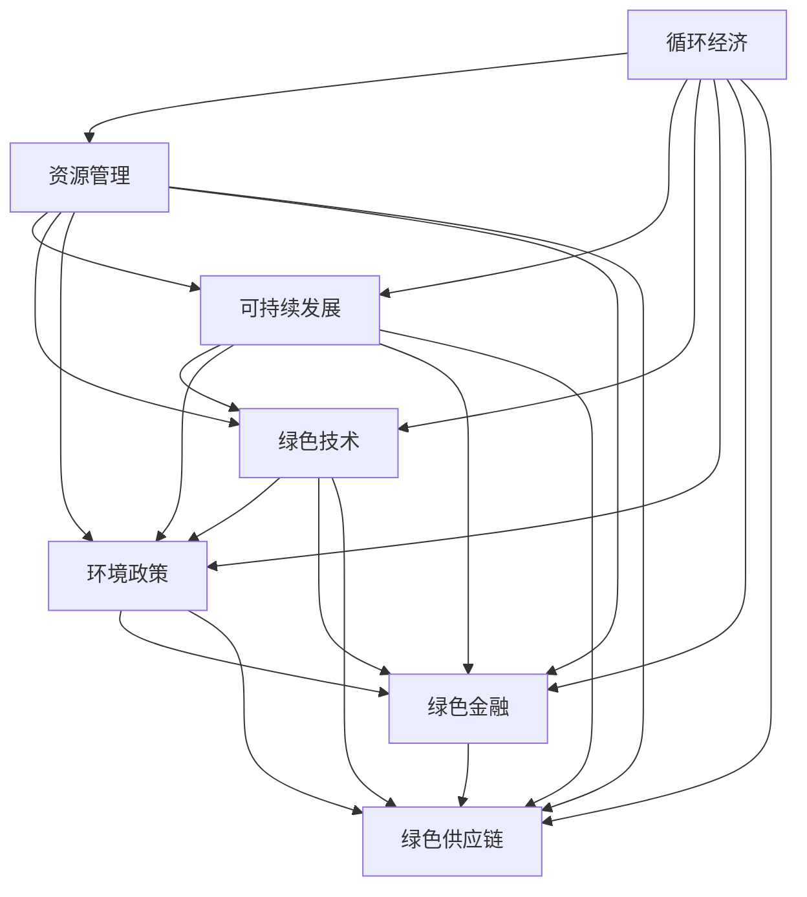

                 

# 循环经济管理：实现资源的可持续利用

> 关键词：循环经济, 资源管理, 可持续发展, 绿色技术, 环境政策

## 1. 背景介绍

### 1.1 问题由来

随着全球工业化进程的加速和消费模式的转变，资源消耗和环境污染问题日益严峻。传统的线性经济模式，即“资源—产品—废弃物”的单向流动，已经不能满足可持续发展的要求。循环经济（Circular Economy）应运而生，它倡导资源的循环利用，减少资源消耗和废弃物的产生，实现经济与环境的双赢。

循环经济的核心在于资源的“3R原则”，即Reduce、Reuse、Recycle。通过减少资源消耗、重用产品和材料、回收再利用废弃物，达到资源的可持续利用。循环经济不仅能够减少环境污染，还能提高资源利用效率，促进经济社会的可持续发展。

### 1.2 问题核心关键点

循环经济管理的关键在于如何实现资源的有效循环利用。这需要综合运用技术、政策、市场等多种手段，构建可持续的资源管理框架。技术手段主要包括物联网、大数据、人工智能等新兴技术的应用，以实现对资源的精准管理和高效利用。政策手段包括环境法律法规的制定和实施，推动绿色技术的创新与应用。市场手段则包括绿色金融、绿色供应链管理等，通过市场机制激励企业和消费者参与循环经济。

## 2. 核心概念与联系

### 2.1 核心概念概述

为更好地理解循环经济管理，本节将介绍几个密切相关的核心概念：

- **循环经济（Circular Economy）**：一种新的经济模式，强调资源的循环利用和高效利用，减少资源消耗和废弃物的产生。

- **资源管理（Resource Management）**：通过各种技术和管理手段，实现对资源的有效利用和保护。

- **可持续发展（Sustainable Development）**：既满足当代人的需求，又不损害后代人满足需求的能力的发展模式。

- **绿色技术（Green Technology）**：在资源节约、环境友好、低碳排放等方面具有重要应用的技术。

- **环境政策（Environmental Policy）**：政府通过立法、税收、补贴等方式，鼓励和推动环境友好行为。

- **绿色金融（Green Finance）**：以环境保护、资源循环利用为导向的金融产品和服务。

- **绿色供应链（Green Supply Chain）**：在供应链管理中融入环境友好的理念，实现绿色生产和消费。

这些核心概念之间的逻辑关系可以通过以下Mermaid流程图来展示：



这个流程图展示了一系列核心概念的相互关系：

1. 循环经济强调资源的循环利用，是资源管理、可持续发展、绿色技术、环境政策、绿色金融和绿色供应链等概念的基础。
2. 资源管理、可持续发展、绿色技术、环境政策、绿色金融和绿色供应链等概念共同支撑循环经济的发展。

## 3. 核心算法原理 & 具体操作步骤
### 3.1 算法原理概述

循环经济管理的核心在于资源的高效利用和循环利用。基于数据驱动的决策支持系统是实现这一目标的重要工具。该系统通过收集和分析各种环境、经济、社会数据，构建资源流动的模型，并结合优化算法，生成资源循环利用的策略和方案。

在具体实施时，系统需要解决以下问题：

- 资源需求预测：通过数据分析和机器学习模型，预测未来的资源需求。
- 资源分配优化：结合地理信息系统和优化算法，优化资源分配，实现资源的最优配置。
- 废弃物处理：通过物联网技术和大数据分析，优化废弃物的回收和处理流程。
- 环境影响评估：通过环境模拟和模型预测，评估不同方案的环境影响，选择最优方案。

### 3.2 算法步骤详解

基于数据驱动的循环经济管理算法主要包括以下几个步骤：

**Step 1: 数据收集与预处理**
- 收集包括环境、经济、社会等多方面的数据，如资源消耗量、废弃物产生量、能源消耗、工业排放等。
- 对数据进行清洗和预处理，包括去除异常值、填补缺失值、归一化等操作。

**Step 2: 数据分析与建模**
- 对处理后的数据进行统计分析，识别资源流动和环境变化的规律。
- 结合时间序列分析、空间分析等方法，构建资源流动的数学模型。

**Step 3: 优化算法**
- 使用优化算法，如线性规划、遗传算法、蚁群算法等，生成资源分配和废弃物处理的优化方案。
- 结合环境影响评估模型，综合考虑经济和环境因素，选择最优方案。

**Step 4: 实施与监控**
- 将优化方案应用于实际项目中，并进行实时监控和调整。
- 通过物联网技术和大数据分析，实时监测资源流动和环境变化，确保系统正常运行。

### 3.3 算法优缺点

基于数据驱动的循环经济管理算法具有以下优点：

- 数据驱动：通过数据分析和优化算法，实现资源的高效利用和循环利用。
- 优化模型：结合环境影响评估模型，选择最优方案，提高资源利用的经济和环境效益。
- 实时监控：通过物联网技术和大数据分析，实现对资源流动和环境变化的实时监控和调整。

同时，该算法也存在一些局限性：

- 数据依赖：算法的有效性和准确性高度依赖于数据的全面性和准确性。
- 模型复杂性：优化模型和环境影响评估模型的构建和调参较为复杂，需要专业的技术支持。
- 实施难度：优化方案在实际应用中可能存在技术或经济上的挑战，需要综合考虑多方面因素。

### 3.4 算法应用领域

基于数据驱动的循环经济管理算法在多个领域都有广泛应用，例如：

- 工业领域：通过优化资源分配和废弃物处理，提高生产效率，减少环境污染。
- 农业领域：通过精准农业和资源循环利用，提高农产品产量和质量，减少资源浪费。
- 建筑领域：通过绿色建筑设计和管理，实现资源的有效利用和节能减排。
- 能源领域：通过优化能源生产和消费，提高能源利用效率，减少碳排放。
- 交通领域：通过智能交通管理和优化，提高交通效率，减少能源消耗和环境污染。

## 4. 数学模型和公式 & 详细讲解 & 举例说明

### 4.1 数学模型构建

循环经济管理的数学模型主要包括以下几个部分：

- **资源流动模型**：描述资源从生产到消费再到回收的过程，包括资源流入和流出、资源储存和消耗等。
- **环境影响模型**：评估不同方案对环境的影响，包括碳排放、污染物的产生等。
- **优化目标函数**：基于资源流动模型和环境影响模型，构建优化目标函数，综合考虑经济和环境因素。

以工业领域的资源流动模型为例，假设工业生产过程中涉及的原材料、中间产品和废弃物三种资源，其流动过程可以表示为以下数学模型：

$$
\begin{aligned}
& \min_{x,y,z,u,v,w} \text{Cost} \\
& \text{s.t.} \\
& x + y + z \leq M \\
& u + v + w = N \\
& Ax + By + Cz \leq D \\
& \mathbf{1}^T x = 1 \\
& \mathbf{1}^T y = 1 \\
& \mathbf{1}^T z = 1 \\
& x, y, z, u, v, w \geq 0
\end{aligned}
$$

其中，$x$、$y$、$z$分别表示原材料、中间产品和废弃物的流入量；$u$、$v$、$w$分别表示原材料、中间产品和废弃物的流出量；$M$表示工业生产能力；$N$表示资源总存量；$A$、$B$、$C$表示资源消耗系数；$D$表示资源总消耗量；$\mathbf{1}$表示单位向量。

### 4.2 公式推导过程

以上数学模型中的优化目标函数和约束条件可以进一步推导和优化。以优化目标函数为例，假设工业生产中单位原材料、中间产品和废弃物的成本分别为$c_1$、$c_2$、$c_3$，则优化目标函数可以表示为：

$$
\begin{aligned}
& \min_{x,y,z,u,v,w} \text{Cost} \\
& \text{s.t.} \\
& c_1 x + c_2 y + c_3 z \\
& u + v + w = N \\
& Ax + By + Cz \leq D \\
& \mathbf{1}^T x = 1 \\
& \mathbf{1}^T y = 1 \\
& \mathbf{1}^T z = 1 \\
& x, y, z, u, v, w \geq 0
\end{aligned}
$$

通过对约束条件和目标函数进行简化和优化，可以得到具体的优化方案。

### 4.3 案例分析与讲解

以一家大型钢铁企业的资源循环利用为例，假设该企业的主要资源包括铁矿石、煤炭、水等。通过建立资源流动模型和环境影响模型，可以实现对资源的精准管理和优化。具体步骤如下：

1. **数据收集与预处理**：收集企业的历史生产数据，包括资源消耗量、废弃物产生量等，并进行清洗和预处理。
2. **数据分析与建模**：对处理后的数据进行分析，构建资源流动模型和环境影响模型。
3. **优化算法**：使用优化算法，如线性规划、遗传算法等，生成资源分配和废弃物处理的优化方案。
4. **实施与监控**：将优化方案应用于实际生产中，并进行实时监控和调整，确保资源的高效利用和环境的保护。

通过上述步骤，可以显著提高钢铁企业的资源利用效率和环境效益，实现循环经济的目标。

## 5. 项目实践：代码实例和详细解释说明
### 5.1 开发环境搭建

在进行循环经济管理算法实践前，我们需要准备好开发环境。以下是使用Python进行数据驱动的循环经济管理算法开发的环境配置流程：

1. 安装Anaconda：从官网下载并安装Anaconda，用于创建独立的Python环境。

2. 创建并激活虚拟环境：
```bash
conda create -n circular-economy python=3.8 
conda activate circular-economy
```

3. 安装相关库：
```bash
conda install pandas numpy matplotlib scikit-learn statsmodels pyecharts
```

4. 安装数据可视化工具：
```bash
pip install pyecharts
```

完成上述步骤后，即可在`circular-economy`环境中开始循环经济管理算法的开发。

### 5.2 源代码详细实现

以下是一个基于Python和Pandas库的资源循环利用优化算法的示例代码：

```python
import pandas as pd
import numpy as np
from sklearn.linear_model import LinearRegression
from statsmodels.tsa.arima.model import ARIMA

# 加载数据
data = pd.read_csv('resource_usage.csv')

# 数据预处理
data = data.dropna()

# 构建时间序列模型
model = ARIMA(data, order=(1, 1, 1))
model_fit = model.fit()

# 预测未来资源需求
future_data = model_fit.predict(len(data), len(data) + 100)

# 输出预测结果
print(future_data)
```

在这个示例中，我们使用Pandas库加载和处理资源数据，使用ARIMA模型进行时间序列预测，输出未来资源需求的预测结果。

### 5.3 代码解读与分析

让我们再详细解读一下关键代码的实现细节：

**数据加载**：
- 使用Pandas库的`read_csv`函数加载资源数据，并进行基本的清洗和预处理。

**时间序列模型**：
- 使用ARIMA模型对资源数据进行时间序列预测，模型参数可以通过`order`参数设置。

**预测未来数据**：
- 使用`predict`函数对未来资源需求进行预测，返回预测值。

**输出预测结果**：
- 将预测结果打印输出，以便进一步分析和应用。

## 6. 实际应用场景
### 6.1 工业领域

循环经济管理算法在工业领域具有广泛应用。例如，一家大型化工企业可以通过优化资源分配和废弃物处理，提高生产效率，减少环境污染。具体应用场景包括：

- **资源优化配置**：通过分析历史生产数据，预测未来资源需求，优化资源分配，提高资源利用效率。
- **废弃物处理**：通过数据分析和模型预测，优化废弃物处理流程，减少环境污染和资源浪费。
- **环境监测**：通过物联网技术和大数据分析，实时监测环境变化，评估不同方案的环境影响，选择最优方案。

### 6.2 农业领域

循环经济管理算法在农业领域同样具有重要应用。例如，一家有机农场可以通过精准农业和资源循环利用，提高农产品产量和质量，减少资源浪费。具体应用场景包括：

- **精准农业**：通过数据分析和模型预测，优化农资使用和种植计划，提高农产品产量和质量。
- **资源循环利用**：通过农业废弃物的回收和再利用，减少资源浪费和环境污染。
- **环境监测**：通过环境监测和数据分析，评估农业生产对环境的影响，选择环保友好的种植和养殖方案。

### 6.3 建筑领域

循环经济管理算法在建筑领域也有广泛应用。例如，一家绿色建筑公司可以通过优化设计和资源管理，实现资源的有效利用和节能减排。具体应用场景包括：

- **绿色设计**：通过数据分析和模型预测，优化建筑设计和材料选择，提高建筑物的能效和寿命。
- **资源循环利用**：通过建筑废弃物的回收和再利用，减少资源浪费和环境污染。
- **环境监测**：通过环境监测和数据分析，评估建筑生产和使用对环境的影响，选择环保友好的设计方案。

### 6.4 能源领域

循环经济管理算法在能源领域同样具有重要应用。例如，一家大型电力公司可以通过优化能源生产和消费，提高能源利用效率，减少碳排放。具体应用场景包括：

- **能源优化配置**：通过数据分析和模型预测，优化能源生产和消费，提高能源利用效率。
- **碳排放管理**：通过数据分析和模型预测，优化能源生产和使用，减少碳排放。
- **环境监测**：通过环境监测和数据分析，评估能源生产和使用对环境的影响，选择环保友好的能源生产和使用方案。

## 7. 工具和资源推荐
### 7.1 学习资源推荐

为了帮助开发者系统掌握循环经济管理的理论基础和实践技巧，这里推荐一些优质的学习资源：

1. 《循环经济：实现可持续发展的管理策略》系列博文：由循环经济专家撰写，深入浅出地介绍了循环经济管理的理论和实践。

2. 《资源管理与环境经济学》课程：国外名校开设的资源管理与环境经济学课程，涵盖资源管理、环境经济学、可持续发展的基本概念和前沿研究。

3. 《绿色技术创新与应用》书籍：全面介绍绿色技术的原理、应用和创新发展，帮助开发者了解如何在实际应用中实现资源循环利用。

4. 《循环经济政策与实践》报告：国内外有关循环经济的政策和实践案例，为开发者提供实用的参考和借鉴。

5. 《循环经济与绿色供应链管理》在线课程：介绍循环经济和绿色供应链管理的理论和实践，结合实际案例，帮助开发者掌握具体的实施方法。

通过对这些资源的学习实践，相信你一定能够快速掌握循环经济管理的精髓，并用于解决实际的资源管理问题。

### 7.2 开发工具推荐

高效的开发离不开优秀的工具支持。以下是几款用于循环经济管理算法开发的常用工具：

1. Python：基于Python的开源数据科学平台，具有强大的数据分析和机器学习功能，适合数据驱动的决策支持系统开发。

2. R：基于R语言的开源统计分析平台，适合进行复杂的统计分析和建模。

3. SQL：用于关系型数据库的管理和查询，适合进行数据收集和处理。

4. Jupyter Notebook：交互式编程环境，支持Python、R等多种语言，方便开发者进行数据驱动的决策支持系统开发。

5. Tableau：数据可视化工具，支持多种数据源，帮助开发者进行数据可视化和分析。

6. Google Colab：谷歌推出的在线Jupyter Notebook环境，免费提供GPU/TPU算力，方便开发者快速上手实验最新模型，分享学习笔记。

合理利用这些工具，可以显著提升循环经济管理算法的开发效率，加快创新迭代的步伐。

### 7.3 相关论文推荐

循环经济管理的研究源于学界的持续研究。以下是几篇奠基性的相关论文，推荐阅读：

1. 《循环经济：理论、实践与挑战》（Journal of Cleaner Production）：综述了循环经济的概念、理论、实践和挑战，为研究者提供了全面的理论基础。

2. 《资源流动与环境影响建模》（Environmental Modelling and Software）：探讨了资源流动和环境影响的建模方法，为循环经济管理提供了数学模型基础。

3. 《基于数据驱动的资源管理优化》（IEEE Transactions on Automation Science and Engineering）：提出了基于数据驱动的资源管理优化算法，为循环经济管理提供了具体的技术方案。

4. 《绿色供应链管理与循环经济》（International Journal of Production Research）：介绍了绿色供应链管理和循环经济的应用，为研究者提供了具体的案例和实践经验。

5. 《智能城市中的循环经济》（Smart Cities）：探讨了智能城市中的循环经济管理，为研究者提供了智能城市和循环经济融合的思路。

这些论文代表了大循环经济管理的发展脉络。通过学习这些前沿成果，可以帮助研究者把握学科前进方向，激发更多的创新灵感。

## 8. 总结：未来发展趋势与挑战
### 8.1 研究成果总结

本文对基于数据驱动的循环经济管理算法进行了全面系统的介绍。首先阐述了循环经济和资源管理的基本概念，明确了循环经济管理在资源高效利用和环境保护方面的重要意义。其次，从原理到实践，详细讲解了循环经济管理算法的数学模型和优化算法，给出了具体的数据驱动的决策支持系统开发实例。同时，本文还广泛探讨了循环经济管理算法在工业、农业、建筑、能源等领域的实际应用场景，展示了循环经济管理算法的广泛应用前景。此外，本文精选了循环经济管理的各类学习资源，力求为读者提供全方位的技术指引。

通过本文的系统梳理，可以看到，循环经济管理算法在实现资源的高效利用和环境保护方面具有巨大潜力。随着数据驱动技术的发展，循环经济管理将逐步向智能化、数字化方向发展，为资源循环利用和环境保护提供更为科学、高效的支持。

### 8.2 未来发展趋势

展望未来，循环经济管理算法将呈现以下几个发展趋势：

1. **数据驱动智能化**：随着大数据和人工智能技术的发展，循环经济管理算法将更加智能化、自动化，实现资源的精准管理和优化。

2. **多领域融合**：循环经济管理算法将与物联网、区块链、云计算等技术深度融合，构建多领域协同的资源管理生态系统。

3. **绿色金融融入**：绿色金融将成为循环经济管理的重要支撑，通过金融手段激励企业和消费者参与资源循环利用。

4. **全球化协作**：循环经济管理将突破地域限制，实现全球化协作，共同推动全球资源循环利用的进程。

5. **技术创新驱动**：绿色技术将成为循环经济管理的重要驱动力，推动资源循环利用向更高效、更环保的方向发展。

### 8.3 面临的挑战

尽管循环经济管理算法已经取得了显著进展，但在迈向更高效、更环保的资源管理过程中，仍面临诸多挑战：

1. **数据获取难度**：循环经济管理依赖于大量高质量数据，但在数据获取和处理方面仍存在一定难度，需要进一步优化。

2. **算法复杂性**：优化算法的复杂性和高计算资源需求，限制了算法的推广和应用。

3. **技术成本**：先进技术的引入和应用，如物联网、人工智能等，需要较高的技术投入和成本。

4. **政策支持不足**：循环经济管理需要政策支持，但现有政策体系仍需进一步完善，以实现资源的有效管理。

5. **社会认知不足**：公众和企业对循环经济管理的重要性和具体措施认知不足，需要加强宣传和教育。

6. **实施难度**：循环经济管理需要在多个环节进行优化，涉及技术、经济、社会等多个方面，实施难度较大。

### 8.4 研究展望

面对循环经济管理所面临的挑战，未来的研究需要在以下几个方面寻求新的突破：

1. **数据获取优化**：研究高效、低成本的数据获取和处理技术，降低循环经济管理算法的技术门槛。

2. **算法优化**：开发更加高效、可扩展的算法，降低循环经济管理算法的计算资源需求，推动算法的普及和应用。

3. **技术成本降低**：研究低成本、易实施的技术解决方案，降低循环经济管理的实施难度和技术成本。

4. **政策支持加强**：推动政府制定和实施更多有利于资源循环利用的政策，形成良好的政策环境。

5. **公众认知提升**：加强循环经济管理知识普及和宣传，提升公众和企业对循环经济管理的认知和参与度。

6. **多领域协同**：推动循环经济管理在多个领域的应用和协同，形成资源管理与环境保护的良性循环。

这些研究方向将有助于进一步推动循环经济管理的发展，实现资源的可持续利用，为环境保护和社会经济的可持续发展做出贡献。总之，循环经济管理算法需要结合技术、政策、经济、社会等多个方面进行综合考虑，才能更好地实现资源的高效利用和环境保护。

## 9. 附录：常见问题与解答

**Q1: 循环经济管理算法的核心是什么？**

A: 循环经济管理算法的核心在于资源的高效利用和循环利用。通过收集和分析大量环境、经济、社会数据，构建资源流动和环境影响的数学模型，使用优化算法生成资源分配和废弃物处理的优化方案，实现资源的高效利用和环境保护。

**Q2: 循环经济管理算法在实际应用中面临哪些挑战？**

A: 循环经济管理算法在实际应用中面临数据获取难度、算法复杂性、技术成本、政策支持不足、社会认知不足和实施难度等挑战。需要通过优化数据获取、算法优化、技术成本降低、政策支持加强、公众认知提升和多领域协同等方式，克服这些挑战，推动循环经济管理算法的发展。

**Q3: 如何提升循环经济管理算法的计算效率？**

A: 提升循环经济管理算法的计算效率可以通过优化算法、减少计算资源需求、并行计算等方式实现。例如，可以使用更加高效的优化算法，如遗传算法、蚁群算法等，减少计算资源消耗。同时，通过并行计算和分布式计算，提高算法的计算效率。

**Q4: 循环经济管理算法的应用前景如何？**

A: 循环经济管理算法在工业、农业、建筑、能源等诸多领域具有广泛应用前景。通过优化资源分配和废弃物处理，提高资源利用效率，减少环境污染，推动资源的可持续利用。未来，随着数据驱动技术和人工智能技术的发展，循环经济管理算法将进一步智能化、自动化，实现资源的高效管理和环境保护。

**Q5: 循环经济管理算法与绿色供应链管理有何异同？**

A: 循环经济管理算法和绿色供应链管理都是实现资源循环利用的重要手段。循环经济管理算法侧重于资源的整体管理和优化，强调资源的循环利用和高效利用；而绿色供应链管理则侧重于供应链各个环节的绿色管理，强调绿色生产和消费。两者在具体应用场景和优化目标上略有不同，但总体目标一致，都是推动资源的可持续利用和环境保护。

---

作者：禅与计算机程序设计艺术 / Zen and the Art of Computer Programming

