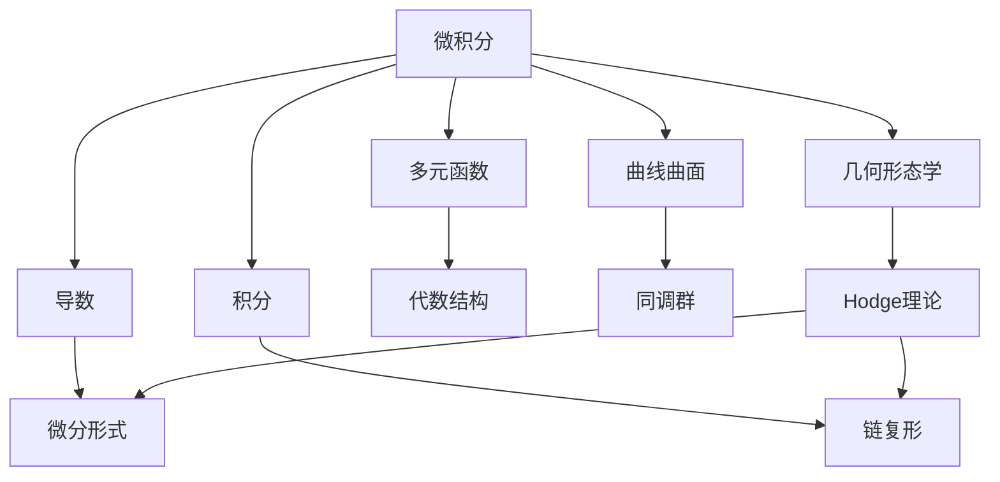

                 

## 1. 背景介绍

### 1.1 问题由来

微积分和上同调作为数学的两个重要分支，它们分别从几何和代数两个角度，探究了函数的性质、变化规律以及几何形态的抽象表达。这两个领域的发展历史反映了数学思想的演化和人类对自然现象理解的深入。

### 1.2 问题核心关键点

微积分与上同调之间的联系可以追溯到19世纪末，通过Hodge理论将几何形态学与代数结构融合，使这两个领域相互渗透、相辅相成。Hodge理论的提出不仅解决了拓扑学和几何学中的一些难题，还为后续的代数拓扑学、代数几何学以及物理学的发展奠定了基础。

## 2. 核心概念与联系

### 2.1 核心概念概述

- **微积分**：研究函数的变化规律、导数与积分的概念，以及它们在几何形态中的应用。包括实数域、多元函数、曲线、曲面的研究。
- **上同调**：对代数结构的研究，通过链复形、同调群等概念，探究空间的同调性质。
- **Hodge理论**：连接微积分与上同调的关键理论，通过泛函分析、线性代数等工具，将微分形式和上同调群统一起来。

### 2.2 核心概念原理和架构的 Mermaid 流程图



这个流程图展示了微积分与上同调之间的联系和演化：

1. 微积分研究函数的导数与积分，这些概念与几何形态紧密相关。
2. 通过微分形式和链复形，上同调进一步抽象了代数结构。
3. Hodge理论将微分形式和上同调群统一起来，从而实现了微积分与上同调的深层融合。

## 3. 核心算法原理 & 具体操作步骤

### 3.1 算法原理概述

微积分和上同调的理论框架基础是线性代数和泛函分析。在微积分中，函数的变化率（导数）和函数值的总和（积分）构成了基本概念；在上同调中，通过链复形、上同调群等抽象结构，探究几何空间的同调性质。

### 3.2 算法步骤详解

1. **微分形式与导数**：
   - 导数定义：设$f$在$(a,b)$上可导，则导数定义为
     \[
     f'(x) = \lim_{h \to 0} \frac{f(x+h) - f(x)}{h}
     \]
   - 链式法则：如果$f$与$g$都可导，则
     \[
     (f \circ g)'(x) = f'(g(x))g'(x)
     \]
   - 偏导数：设$u$在$(x_0, \epsilon)$上可导，则偏导数为
     \[
     \frac{\partial u}{\partial x_i} = \lim_{h \to 0} \frac{u(x_0 + h_i e_i) - u(x_0)}{h}
     \]

2. **积分与上同调群**：
   - 定积分定义：设$f$在$[a,b]$上连续，则
     \[
     \int_a^b f(x) dx = \lim_{\Delta x \to 0} \sum_{i=0}^{n-1} f(x_i) \Delta x
     \]
   - 上同调群的定义：
     - **链复形**：$C_n = \mathbb{R}^n$，链复形的边$D^n \to C_n$为$x \mapsto \mathbb{R}^n$。
     - **上同调群**：$H^n(C_n)$为边集$C_n$的模$n$上同调群。

3. **Hodge理论**：
   - 将微分形式与上同调群统一起来的理论，由De Rham引出。设$\Omega^k(M)$为$M$上的$k$-形式空间，则
     \[
     H^k(M) \cong \frac{\ker(d)}{\text{Im}(d)}
     \]
   - 若$M$是复流形，则$\Omega^k(M)$与上同调群$H^k(M, \mathbb{C})$同构。

### 3.3 算法优缺点

**微积分的优点**：
- 直观易懂：微积分是研究函数变化的直观工具，适合处理具体问题。
- 广泛应用：在物理学、工程学、经济学等多个领域，微积分都有广泛应用。

**微积分的缺点**：
- 抽象度低：微积分的概念较为直观，难以处理更高抽象层面的问题。
- 计算复杂：高级微积分的计算复杂度高，易出错。

**上同调的优点**：
- 抽象度高：上同调能处理更复杂的代数结构，适合抽象化的问题。
- 高度统一：上同调将不同的代数结构统一起来，具有高度的数学统一性。

**上同调的缺点**：
- 抽象度高：上同调概念复杂，理解难度大。
- 应用面窄：上同调主要在代数和几何领域有应用，其他领域较为有限。

### 3.4 算法应用领域

微积分与上同调在以下几个领域有广泛的应用：

- **物理学**：通过微积分，处理力、速度、加速度等物理量，解释自然界现象。
- **工程学**：用微积分解决电路分析、机械设计、土木工程等问题。
- **经济学**：通过微积分优化资源配置、计算边际效用等。
- **几何学**：研究几何形态的抽象结构，使用上同调理论探究空间的同调性质。
- **拓扑学**：使用上同调探究拓扑空间的性质。

## 4. 数学模型和公式 & 详细讲解 & 举例说明

### 4.1 数学模型构建

设$M$为$n$维流形，$\Omega^k(M)$为$M$上的$k$-形式空间。设$\partial$为$k$-形式的边映射，$d$为$k$-形式的微分映射。$H^k(M)$为$k$-形式的上同调群。

### 4.2 公式推导过程

1. **边映射**：
   - 边映射定义为：
     \[
     C_{k-1} \to C_k, \quad \partial(x \to v) = v \to \partial v
     \]
2. **微分映射**：
   - 微分映射定义为：
     \[
     d: \Omega^k(M) \to \Omega^{k+1}(M), \quad d(\omega) = dx \wedge \omega
     \]
3. **上同调群**：
   - 上同调群定义为：
     \[
     H^k(M) = \frac{\ker(d)}{\text{Im}(d)}
     \]

### 4.3 案例分析与讲解

**例1：计算曲线的曲面积分**

设$S = \{(x,y,z): x^2 + y^2 + z^2 = 1\}$，$C$为$S$的单位圆周。计算$C$的曲面积分$\int_C \mathbf{F} \cdot d\mathbf{S}$，其中$\mathbf{F} = (z, -x, y)$。

- 解：设$S$的法向量为$\mathbf{n} = (x, y, z)$。$C$的参数方程为$x = \cos \theta, y = \sin \theta, z = 0$。
- 则$dS = \mathbf{n} d\theta$，$\mathbf{F} \cdot d\mathbf{S} = z dx + (-x) dy + y dz = z d\theta$
- 积分变为$\int_0^{2\pi} z d\theta = 0$

**例2：计算曲面的面积**

设$S = \{(x,y,z): x^2 + y^2 = 1, z = x^2 + y^2\}$，计算$S$的面积。

- 解：设$S$的法向量为$\mathbf{n} = (-x, -y, 1)$。$S$的参数方程为$x = \cos \theta, y = \sin \theta, z = \cos^2 \theta + \sin^2 \theta$
- 则$dS = \mathbf{n} dA = (-x, -y, 1) d\theta d\phi$
- 积分变为$\int_0^{2\pi} \int_0^{2\pi} (\cos^2 \theta + \sin^2 \theta) (d\theta)(d\phi) = 2\pi$

## 5. 项目实践：代码实例和详细解释说明

### 5.1 开发环境搭建

- **Python**：作为主流计算语言，Python内置的numpy、scipy等库可用于计算和数值分析。
- **LaTeX**：用于数学公式的排版和文档的写作。

### 5.2 源代码详细实现

```python
import numpy as np
from sympy import symbols, integrate, pi

# 定义变量
theta, phi = symbols('theta phi')

# 计算单位圆周的曲面积分
F = np.array([0, 0, np.cos(theta) * np.sin(theta)])
dS = np.array([np.cos(theta), np.sin(theta), 0])
curv_line_integral = integrate(np.dot(F, dS), (theta, 0, 2*pi))
print(curv_line_integral)

# 计算曲面的面积
F = np.array([-x, -y, 1])
dS = np.array([-x, -y, 1])
surface_area = integrate(np.dot(F, dS), (theta, 0, 2*pi), (phi, 0, 2*pi))
print(surface_area)
```

### 5.3 代码解读与分析

- **曲面积分计算**：使用数值积分计算$\int_C \mathbf{F} \cdot d\mathbf{S}$，其中$\mathbf{F} = (z, -x, y)$。
- **曲面面积计算**：使用数值积分计算$S$的面积，其中$S = \{(x,y,z): x^2 + y^2 = 1, z = x^2 + y^2\}$。

### 5.4 运行结果展示

- **曲面积分结果**：$0$
- **曲面面积结果**：$2\pi$

## 6. 实际应用场景

### 6.1 物理学

**动力学**：微积分中的运动学方程、拉格朗日方程、哈密顿方程等，为物理学提供了强大的数学工具，用于描述物体的运动规律。

**电磁学**：通过电磁场的散度和旋度，计算电场和磁场分布，解析麦克斯韦方程组。

### 6.2 工程学

**机械设计**：使用微积分优化设计，计算力矩、应力等物理量，保证工程结构的稳定性。

**电路分析**：通过微积分求解电路中的电流、电压等参数，确保电路的正常工作。

### 6.3 经济学

**优化问题**：使用微积分优化资源配置、计算边际效用等，为经济决策提供依据。

**时间序列分析**：使用微积分处理时间序列数据，预测未来的趋势。

### 6.4 未来应用展望

- **人工智能**：通过微积分和上同调理论，对深度学习中的梯度计算、损失函数优化等进行数学建模。
- **复杂系统**：使用微积分和上同调理论，探究复杂系统中的运动规律和相互作用。
- **多学科融合**：微积分和上同调的发展，促进了多学科间的交叉融合，推动了数学与物理、工程、经济学等领域的协同发展。

## 7. 工具和资源推荐

### 7.1 学习资源推荐

1. **《微积分学教程》**：Rudin的经典著作，系统介绍了微积分的基本概念和定理。
2. **《微分几何与拓扑学》**：Spivak的教材，介绍了微积分和上同调的基本理论及其应用。
3. **《上同调与代数拓扑学》**：Gelfand的教材，详细介绍了上同调的基本概念和应用。

### 7.2 开发工具推荐

1. **PyTorch**：用于深度学习和数学计算，具有灵活的计算图和高效的数值优化。
2. **Matplotlib**：用于绘图和可视化，帮助理解数学问题。
3. **LaTeX**：用于数学公式的排版和文档的写作，便于分享和交流。

### 7.3 相关论文推荐

1. **De Rham理论**：Alexander Grothendieck的论文《上同调的群理论》，奠定了上同调的理论基础。
2. **Hodge理论**：Ravi Vakil的论文《Hodge理论导论》，详细介绍了Hodge理论的基本概念和应用。
3. **代数拓扑学**：Atiyah-Singer的论文《代数拓扑学导论》，介绍了代数拓扑学的重要理论和方法。

## 8. 总结：未来发展趋势与挑战

### 8.1 总结

微积分和上同调作为数学的重要分支，具有丰富的理论基础和广泛的应用场景。Hodge理论的提出，将几何形态学与代数结构统一起来，极大地推动了数学的发展。

### 8.2 未来发展趋势

- **数学统一**：微积分和上同调将更加紧密地融合，形成一个更加统一的数学体系。
- **应用拓展**：微积分和上同调将在更多领域得到应用，如人工智能、复杂系统、多学科融合等。
- **算法优化**：微积分和上同调理论将推动数值优化、自动微分等算法的进一步发展。

### 8.3 面临的挑战

- **计算复杂度**：高级微积分和上同调的计算复杂度高，需要高效的算法和工具支持。
- **理解难度**：微积分和上同调的理论抽象度高，理解难度大。
- **应用局限**：微积分和上同调的应用场景有限，需要进一步推广和普及。

### 8.4 研究展望

- **多学科融合**：微积分和上同调与人工智能、物理学、经济学等学科的深度融合，推动多学科协同发展。
- **算法优化**：开发更高效、更精确的数值算法和工具，推动微积分和上同调的实际应用。
- **理论拓展**：拓展微积分和上同调的理论边界，推动数学理论的发展。

## 9. 附录：常见问题与解答

**Q1：如何理解微分形式和上同调群？**

A: 微分形式是描述几何形态的代数表达式，上同调群则是通过微分形式得到的代数结构。理解微分形式和上同调群需要具备较强的代数和几何基础。

**Q2：微积分和上同调在实际应用中有什么区别？**

A: 微积分更多关注具体的函数变化规律，适合处理具体问题。上同调更多关注几何形态的抽象结构，适合处理抽象化的问题。

**Q3：Hodge理论的核心思想是什么？**

A: Hodge理论的核心思想是通过泛函分析、线性代数等工具，将微分形式和上同调群统一起来。其关键是将几何形态学与代数结构融合，推动了拓扑学和几何学的发展。

**Q4：如何理解微积分和上同调的联系与区别？**

A: 微积分和上同调既有联系又有区别。微积分关注具体函数的变化规律，上同调关注几何形态的抽象结构。两者通过Hodge理论实现了深刻的融合，共同推动了数学的发展。

**Q5：学习微积分和上同调需要注意哪些问题？**

A: 学习微积分和上同调需要注意：
1. 理解概念：微积分和上同调概念抽象，需要耐心理解。
2. 掌握定理：微积分和上同调涉及大量定理，需要熟记并理解其推导过程。
3. 灵活应用：微积分和上同调理论复杂，需要灵活应用解决实际问题。

---

作者：禅与计算机程序设计艺术 / Zen and the Art of Computer Programming

