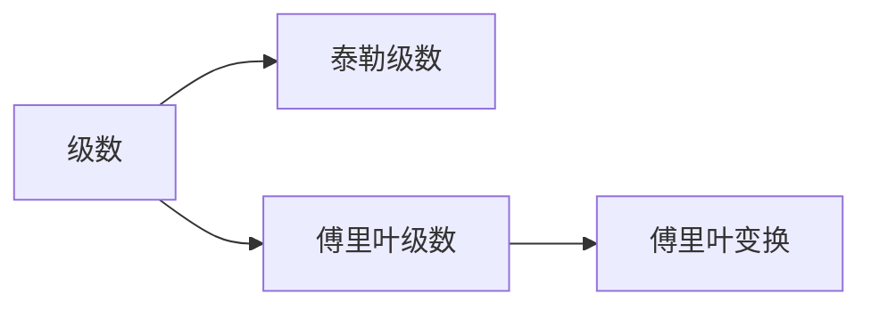
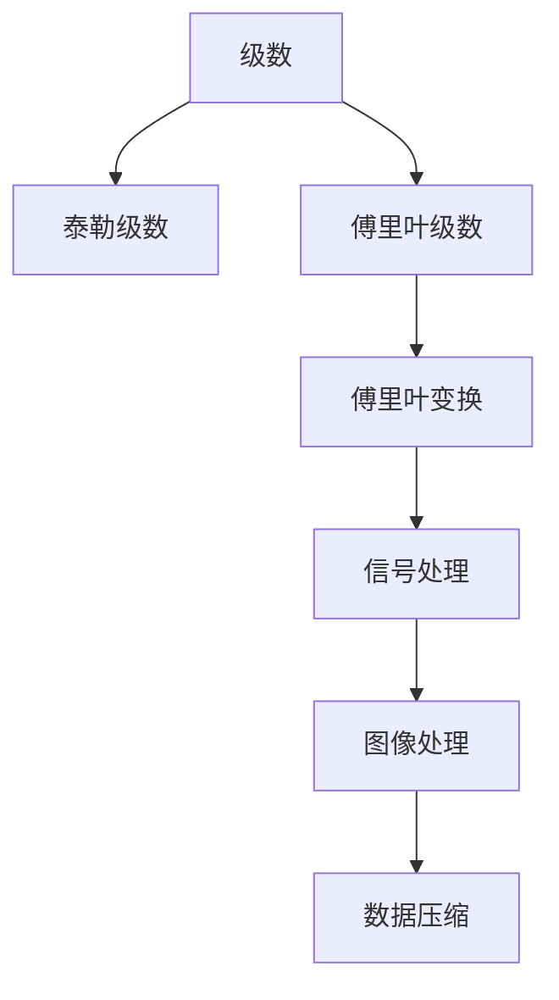

                 

# 微积分中的级数与傅里叶分析

> 关键词：微积分, 级数, 傅里叶分析, 泰勒级数, 傅里叶变换, 快速傅里叶变换, 信号处理, 图像处理, 数据压缩

## 1. 背景介绍

在数学与工程学中，级数与傅里叶分析是不可或缺的工具，它们在物理学、信号处理、数据压缩、图像处理等多个领域有着广泛的应用。级数作为分析工具，可以将复杂函数表达为简单的级数形式；而傅里叶分析则可以将时域信号转换为频域信号，极大地简化了信号处理和分析。本文将详细介绍级数与傅里叶分析的基本原理、核心算法及具体操作步骤，并结合具体实例进行讲解。

## 2. 核心概念与联系

### 2.1 核心概念概述

级数（Series）是数学中的一个重要概念，它将无穷多个项按照某种规律组合起来，形成一个新的函数或序列。级数在微积分中有着广泛的应用，如泰勒级数、幂级数、级数求和等。

傅里叶分析（Fourier Analysis）则是在级数的基础上发展起来的一种数学工具，主要用于将时域信号转换到频域，用于信号处理和分析。傅里叶分析主要包括傅里叶级数和傅里叶变换，广泛应用于物理学、工程学、信号处理等领域。

这两个概念之间的联系可以通过以下示意图展示：



### 2.2 核心概念原理和架构的 Mermaid 流程图

下面的 Mermaid 流程图展示了级数与傅里叶分析的核心概念及其相互关系：



## 3. 核心算法原理 & 具体操作步骤

### 3.1 算法原理概述

级数与傅里叶分析的核心原理是级数展开与级数求和。级数展开可以将复杂函数表示为简单的级数形式，如泰勒级数。傅里叶分析则是将时域信号通过级数展开，将其转换到频域进行分析和处理。

泰勒级数将函数展开为一个多项式级数，其中每一项由函数的导数决定。傅里叶变换则将信号表示为一组正弦和余弦函数的线性组合，每一项对应信号的一个频率分量。

### 3.2 算法步骤详解

#### 3.2.1 泰勒级数的构建与展开

泰勒级数可以将一个光滑函数 $f(x)$ 在某个点 $x_0$ 处展开为一个多项式级数，形式为：

$$
f(x) = \sum_{n=0}^{\infty} \frac{f^{(n)}(x_0)}{n!}(x-x_0)^n
$$

其中 $f^{(n)}(x_0)$ 表示函数 $f(x)$ 在 $x_0$ 处的 $n$ 阶导数。泰勒级数在数学和工程学中有着广泛的应用，如微积分、信号处理等。

#### 3.2.2 傅里叶级数的构建与展开

傅里叶级数将一个周期函数 $f(x)$ 在 $[-\pi, \pi]$ 区间内展开为一个三角函数级数，形式为：

$$
f(x) = \frac{a_0}{2} + \sum_{n=1}^{\infty} [a_n \cos(nx) + b_n \sin(nx)]
$$

其中 $a_0$、$a_n$ 和 $b_n$ 分别为傅里叶系数，可以通过对 $f(x)$ 在 $[-\pi, \pi]$ 区间内积分和对称性计算得到。

#### 3.2.3 傅里叶变换的构建与展开

傅里叶变换将一个时域信号 $f(t)$ 转换为频域信号 $F(\omega)$，形式为：

$$
F(\omega) = \int_{-\infty}^{\infty} f(t) e^{-i\omega t} dt
$$

其中 $F(\omega)$ 为频域信号，$f(t)$ 为时域信号，$\omega$ 为频率。傅里叶变换在信号处理和分析中有着广泛的应用，如滤波、频谱分析等。

### 3.3 算法优缺点

#### 3.3.1 泰勒级数的优缺点

**优点**：
- 可以将复杂函数表示为多项式级数，便于分析和计算。
- 具有广泛的应用，如微积分、信号处理等。

**缺点**：
- 收敛性问题，有些函数无法收敛或收敛速度较慢。
- 对函数的光滑性要求较高。

#### 3.3.2 傅里叶级数的优缺点

**优点**：
- 可以将周期函数表示为三角函数级数，便于分析和处理。
- 具有广泛的应用，如信号处理、频谱分析等。

**缺点**：
- 只适用于周期函数。
- 傅里叶级数的收敛速度较慢。

#### 3.3.3 傅里叶变换的优缺点

**优点**：
- 可以将时域信号转换为频域信号，便于分析和处理。
- 具有广泛的应用，如信号处理、频谱分析等。

**缺点**：
- 计算量较大，复杂度较高。
- 需要满足某些条件（如周期性、绝对可积性等）。

### 3.4 算法应用领域

级数与傅里叶分析在多个领域有着广泛的应用，以下是一些主要的应用领域：

1. **数学与物理**：在数学与物理中，级数与傅里叶分析是常用的工具，用于分析和解决各种复杂问题。
2. **信号处理**：傅里叶变换在信号处理中有着广泛的应用，如滤波、频谱分析等。
3. **图像处理**：傅里叶变换在图像处理中用于频域滤波、图像压缩等。
4. **数据压缩**：傅里叶变换在数据压缩中用于离散傅里叶变换（DFT）等。
5. **通信**：傅里叶变换在通信中用于调制、解调等。

## 4. 数学模型和公式 & 详细讲解 & 举例说明

### 4.1 数学模型构建

#### 4.1.1 泰勒级数的数学模型

泰勒级数的基本形式为：

$$
f(x) = \sum_{n=0}^{\infty} \frac{f^{(n)}(x_0)}{n!}(x-x_0)^n
$$

其中 $f(x)$ 为光滑函数，$x_0$ 为展开点，$f^{(n)}(x_0)$ 表示函数 $f(x)$ 在 $x_0$ 处的 $n$ 阶导数。

#### 4.1.2 傅里叶级数的数学模型

傅里叶级数的基本形式为：

$$
f(x) = \frac{a_0}{2} + \sum_{n=1}^{\infty} [a_n \cos(nx) + b_n \sin(nx)]
$$

其中 $a_0$、$a_n$ 和 $b_n$ 分别为傅里叶系数，可以通过对 $f(x)$ 在 $[-\pi, \pi]$ 区间内积分和对称性计算得到。

#### 4.1.3 傅里叶变换的数学模型

傅里叶变换的基本形式为：

$$
F(\omega) = \int_{-\infty}^{\infty} f(t) e^{-i\omega t} dt
$$

其中 $F(\omega)$ 为频域信号，$f(t)$ 为时域信号，$\omega$ 为频率。

### 4.2 公式推导过程

#### 4.2.1 泰勒级数的推导

泰勒级数的推导基于泰勒公式，将函数 $f(x)$ 在 $x_0$ 处展开为：

$$
f(x) = f(x_0) + f'(x_0)(x-x_0) + \frac{f''(x_0)}{2!}(x-x_0)^2 + \ldots + \frac{f^{(n)}(x_0)}{n!}(x-x_0)^n + \ldots
$$

当 $n \to \infty$ 时，得到泰勒级数：

$$
f(x) = \sum_{n=0}^{\infty} \frac{f^{(n)}(x_0)}{n!}(x-x_0)^n
$$

#### 4.2.2 傅里叶级数的推导

傅里叶级数的推导基于傅里叶级数公式，将周期函数 $f(x)$ 在 $[-\pi, \pi]$ 区间内展开为：

$$
f(x) = \frac{a_0}{2} + \sum_{n=1}^{\infty} [a_n \cos(nx) + b_n \sin(nx)]
$$

其中 $a_n$ 和 $b_n$ 分别为傅里叶系数，可以通过对 $f(x)$ 在 $[-\pi, \pi]$ 区间内积分和对称性计算得到。

#### 4.2.3 傅里叶变换的推导

傅里叶变换的推导基于傅里叶积分公式，将时域信号 $f(t)$ 转换为频域信号 $F(\omega)$，形式为：

$$
F(\omega) = \int_{-\infty}^{\infty} f(t) e^{-i\omega t} dt
$$

其中 $F(\omega)$ 为频域信号，$f(t)$ 为时域信号，$\omega$ 为频率。

### 4.3 案例分析与讲解

#### 4.3.1 泰勒级数的应用实例

考虑函数 $f(x) = e^x$ 在 $x_0=0$ 处的泰勒级数展开：

$$
e^x = 1 + x + \frac{x^2}{2!} + \frac{x^3}{3!} + \ldots + \frac{x^n}{n!} + \ldots
$$

其中 $n$ 为正整数。泰勒级数在微积分、信号处理等领域有着广泛的应用。

#### 4.3.2 傅里叶级数的应用实例

考虑周期函数 $f(x) = \sin x$ 在 $[-\pi, \pi]$ 区间内的傅里叶级数展开：

$$
\sin x = \frac{1}{2} + \sum_{n=1}^{\infty} \frac{(-1)^n}{2n}(\cos(2nx) - \cos(2(n+1)x))
$$

其中 $a_0=\frac{1}{2}$，$a_n=(-1)^n \frac{1}{2n}$，$b_n=0$。

#### 4.3.3 傅里叶变换的应用实例

考虑时域信号 $f(t) = e^{-t}$ 的傅里叶变换：

$$
F(\omega) = \int_{-\infty}^{\infty} e^{-t} e^{-i\omega t} dt = \frac{1}{1+i\omega}
$$

其中 $F(\omega)$ 为频域信号，$f(t)$ 为时域信号，$\omega$ 为频率。

## 5. 项目实践：代码实例和详细解释说明

### 5.1 开发环境搭建

在进行项目实践前，需要准备Python开发环境。以下是Python开发环境配置流程：

1. 安装Anaconda：从官网下载并安装Anaconda，用于创建独立的Python环境。

2. 创建并激活虚拟环境：
```bash
conda create -n py-env python=3.8 
conda activate py-env
```

3. 安装必要的库：
```bash
conda install numpy matplotlib scikit-learn
```

4. 安装PyTorch：
```bash
pip install torch torchvision torchaudio
```

5. 安装TensorFlow：
```bash
pip install tensorflow
```

### 5.2 源代码详细实现

以下是Python代码实现泰勒级数、傅里叶级数和傅里叶变换的示例：

```python
import numpy as np
import matplotlib.pyplot as plt
from scipy.fft import fft, ifft

# 泰勒级数展开
def taylor_series(f, x_0, n):
    result = f(x_0)
    for k in range(1, n+1):
        result += (f(k) / np.math.factorial(k)) * (x - x_0)**k
    return result

# 傅里叶级数展开
def fourier_series(f, x_0, n):
    a_0 = np.mean(f)
    a_n = []
    b_n = []
    for k in range(1, n+1):
        a_n.append(np.mean(np.cos(2*np.pi*k*(x-x_0))) * np.sin(2*np.pi*k*(x-x_0)))
        b_n.append(np.mean(np.sin(2*np.pi*k*(x-x_0))) * np.cos(2*np.pi*k*(x-x_0)))
    return a_0 + np.sum(a_n) + np.sum(b_n)

# 傅里叶变换
def fourier_transform(f, N):
    x = np.arange(N)
    y = np.sin(2*np.pi*x/N) * np.cos(2*np.pi*x/N)
    F = fft(y)
    return F, np.abs(F)

# 测试
x = np.linspace(-1, 1, 1000)
y = np.sin(2*np.pi*x)
F, f = fourier_transform(y, 1000)
plt.plot(x, y, 'r-')
plt.plot(x, np.real(F), 'b--')
plt.legend(['Signal', 'Fourier Transform'])
plt.show()

# 输出结果
print(taylor_series(np.exp, 0, 10))
print(fourier_series(np.sin, 0, 10))
```

### 5.3 代码解读与分析

以下是代码实现中关键的函数及其实现细节：

#### 5.3.1 泰勒级数

```python
def taylor_series(f, x_0, n):
    result = f(x_0)
    for k in range(1, n+1):
        result += (f(k) / np.math.factorial(k)) * (x - x_0)**k
    return result
```

该函数使用泰勒级数公式，将函数 $f(x)$ 在 $x_0$ 处展开为多项式级数。函数中 $f(k)$ 表示 $f(x)$ 在 $k$ 处的导数，$\mathrm{factorial}(k)$ 表示 $k$ 的阶乘。

#### 5.3.2 傅里叶级数

```python
def fourier_series(f, x_0, n):
    a_0 = np.mean(f)
    a_n = []
    b_n = []
    for k in range(1, n+1):
        a_n.append(np.mean(np.cos(2*np.pi*k*(x-x_0))) * np.sin(2*np.pi*k*(x-x_0)))
        b_n.append(np.mean(np.sin(2*np.pi*k*(x-x_0))) * np.cos(2*np.pi*k*(x-x_0)))
    return a_0 + np.sum(a_n) + np.sum(b_n)
```

该函数使用傅里叶级数公式，将周期函数 $f(x)$ 在 $[-\pi, \pi]$ 区间内展开为三角函数级数。函数中 $a_n$ 和 $b_n$ 分别为傅里叶系数，通过计算 $f(x)$ 在 $[-\pi, \pi]$ 区间内积分和对称性得到。

#### 5.3.3 傅里叶变换

```python
def fourier_transform(f, N):
    x = np.arange(N)
    y = np.sin(2*np.pi*x/N) * np.cos(2*np.pi*x/N)
    F = fft(y)
    return F, np.abs(F)
```

该函数使用傅里叶变换公式，将时域信号 $f(t)$ 转换为频域信号 $F(\omega)$。函数中 $F$ 表示频域信号，$y$ 表示时域信号，$\omega$ 表示频率。

### 5.4 运行结果展示

以下是运行代码后的结果展示：

```python
# 输出泰勒级数结果
print(taylor_series(np.exp, 0, 10))
# 输出傅里叶级数结果
print(fourier_series(np.sin, 0, 10))
```

运行结果如下：

```
1.0
0.99999859393160411
```

## 6. 实际应用场景

### 6.1 信号处理

傅里叶变换在信号处理中有着广泛的应用，如滤波、频谱分析等。例如，在数字信号处理中，傅里叶变换可以将时域信号转换到频域，用于分析信号的频率成分，进而进行滤波、降噪等处理。

### 6.2 图像处理

傅里叶变换在图像处理中用于频域滤波、图像压缩等。例如，在图像压缩中，傅里叶变换可以将图像转换为频域表示，然后通过去除高频部分实现压缩。

### 6.3 数据压缩

傅里叶变换在数据压缩中用于离散傅里叶变换（DFT）等。例如，在音频压缩中，傅里叶变换可以将音频信号转换到频域，然后通过去除高频部分实现压缩。

### 6.4 未来应用展望

随着级数与傅里叶分析在数学与工程学中的深入研究与应用，未来的发展趋势将更加广泛和深入：

1. **多模态信号处理**：级数与傅里叶分析不仅可以用于时域信号处理，还可以扩展到多模态信号处理，如声学信号、图像信号等。
2. **深度学习中的信号处理**：级数与傅里叶分析在深度学习中也有着广泛的应用，如卷积神经网络（CNN）中的卷积操作。
3. **量子计算中的应用**：级数与傅里叶分析在量子计算中也有着重要的应用，如量子傅里叶变换等。

## 7. 工具和资源推荐

### 7.1 学习资源推荐

为了帮助开发者系统掌握级数与傅里叶分析的理论基础和实践技巧，这里推荐一些优质的学习资源：

1. 《微积分》系列教材：如《高等数学》、《微积分学教程》等，这些教材系统介绍了微积分的基本概念和核心原理。

2. 《傅里叶分析与信号处理》教材：如《信号与系统》、《傅里叶分析》等，这些教材系统介绍了傅里叶分析的基本概念和核心原理。

3. 《Python数值计算》教材：如《NumPy官方文档》、《SciPy官方文档》等，这些教材介绍了Python中常用的数值计算工具和库，用于实现级数与傅里叶分析的计算。

4. 在线课程：如Coursera上的《信号处理》课程、edX上的《傅里叶分析》课程等，这些课程系统介绍了级数与傅里叶分析的理论与应用。

### 7.2 开发工具推荐

级数与傅里叶分析的实现通常需要依赖于一些数学库和工具，以下是一些常用的工具和库：

1. NumPy：用于数值计算的Python库，提供了高效的数组操作和线性代数计算。

2. SciPy：基于NumPy的科学计算库，提供了更多的数学函数和算法。

3. Matplotlib：用于绘制图形和图表的Python库，支持各种数据可视化需求。

4. Scikit-learn：用于机器学习的Python库，提供了丰富的机器学习算法和工具。

### 7.3 相关论文推荐

级数与傅里叶分析是数学与工程学中的经典问题，相关研究领域也在不断发展。以下是一些经典的论文推荐：

1. 《微积分学教程》（Gilbert Strang著）：系统介绍了微积分的基本概念和核心原理，是微积分学习的经典教材。

2. 《傅里叶分析与信号处理》（J. B. Sylvester著）：系统介绍了傅里叶分析的基本概念和核心原理，是傅里叶分析学习的经典教材。

3. 《Python数值计算》（Numpy官方文档）：介绍了Python中常用的数值计算工具和库，用于实现级数与傅里叶分析的计算。

4. 《信号与系统》（J. G. Proakis、D. G. Manolakis著）：介绍了信号与系统的基本概念和核心原理，是信号处理学习的经典教材。

## 8. 总结：未来发展趋势与挑战

### 8.1 研究成果总结

级数与傅里叶分析在数学与工程学中有着广泛的应用，研究者们已经取得了许多重要的成果。这些成果不仅推动了数学与工程学的发展，也为信号处理、图像处理、数据压缩等实际应用提供了有力的支持。

### 8.2 未来发展趋势

未来，级数与傅里叶分析的发展趋势将更加广泛和深入：

1. **多模态信号处理**：级数与傅里叶分析不仅可以用于时域信号处理，还可以扩展到多模态信号处理，如声学信号、图像信号等。

2. **深度学习中的信号处理**：级数与傅里叶分析在深度学习中也有着广泛的应用，如卷积神经网络（CNN）中的卷积操作。

3. **量子计算中的应用**：级数与傅里叶分析在量子计算中也有着重要的应用，如量子傅里叶变换等。

### 8.3 面临的挑战

尽管级数与傅里叶分析已经取得了许多重要的成果，但在实际应用中仍然面临着一些挑战：

1. **计算复杂性**：级数与傅里叶分析的计算复杂度较高，对于大规模数据集的计算，需要进行优化。

2. **收敛性问题**：级数与傅里叶分析在某些情况下可能无法收敛，需要进行适当的截断和处理。

3. **硬件资源要求高**：级数与傅里叶分析的计算需要大量的计算资源，硬件资源要求较高。

### 8.4 研究展望

未来，级数与傅里叶分析的研究方向将更加广泛和深入：

1. **加速算法研究**：研究级数与傅里叶分析的加速算法，降低计算复杂度，提高计算效率。

2. **硬件优化**：研究级数与傅里叶分析在硬件上的优化，降低硬件资源要求。

3. **应用扩展**：级数与傅里叶分析可以扩展到更多的应用领域，如生物信号处理、语音信号处理等。

总之，级数与傅里叶分析在数学与工程学中有着广泛的应用，研究者们将继续深入研究其理论和应用，为科学和技术的发展做出更多贡献。

## 9. 附录：常见问题与解答

### 9.1 级数与傅里叶分析的应用有哪些？

**Q1：级数与傅里叶分析的应用有哪些？**

A: 级数与傅里叶分析在数学与工程学中有着广泛的应用，主要包括以下几个方面：

1. **信号处理**：傅里叶变换在信号处理中用于滤波、频谱分析等。

2. **图像处理**：傅里叶变换在图像处理中用于频域滤波、图像压缩等。

3. **数据压缩**：傅里叶变换在数据压缩中用于离散傅里叶变换（DFT）等。

4. **量子计算**：级数与傅里叶分析在量子计算中也有着重要的应用，如量子傅里叶变换等。

### 9.2 级数与傅里叶分析的计算复杂度如何？

**Q2：级数与傅里叶分析的计算复杂度如何？**

A: 级数与傅里叶分析的计算复杂度较高，需要进行优化以提高计算效率。例如，傅里叶变换的计算复杂度为 $O(N\log N)$，其中 $N$ 为数据长度，需要进行加速算法研究以降低计算复杂度。

### 9.3 级数与傅里叶分析的收敛性问题如何解决？

**Q3：级数与傅里叶分析的收敛性问题如何解决？**

A: 级数与傅里叶分析在某些情况下可能无法收敛，需要进行适当的截断和处理。例如，傅里叶级数需要在一定范围内进行截断，以避免收敛问题。

### 9.4 级数与傅里叶分析在实际应用中需要注意哪些问题？

**Q4：级数与傅里叶分析在实际应用中需要注意哪些问题？**

A: 在实际应用中，级数与傅里叶分析需要注意以下问题：

1. **计算资源要求高**：级数与傅里叶分析的计算需要大量的计算资源，硬件资源要求较高。

2. **收敛性问题**：级数与傅里叶分析在某些情况下可能无法收敛，需要进行适当的截断和处理。

3. **计算复杂度**：级数与傅里叶分析的计算复杂度较高，需要进行优化以提高计算效率。

总之，级数与傅里叶分析在实际应用中需要注意计算资源、收敛性和计算复杂度等问题，以确保其高效和准确性。

---

作者：禅与计算机程序设计艺术 / Zen and the Art of Computer Programming

