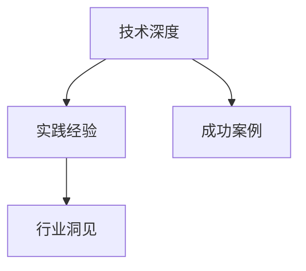

                 

# 打造个人品牌故事：让你的经历成为励志范本

在这个信息爆炸的时代，个人品牌成为了连接人与世界的桥梁。无论你是软件开发人员、架构师、CTO还是人工智能专家，一个清晰的个人品牌故事不仅能帮助你在职场中脱颖而出，更能影响和激励他人，推动行业进步。本文将深入探讨如何通过技术背景、项目实践、行业洞见和成功经验，打造一个既专业又感人的个人品牌故事。

## 1. 背景介绍

### 1.1 问题由来
个人品牌建设不是一朝一夕的事，它需要一个长期而系统的过程。面对日新月异的行业变化和不断涌现的新技术，如何保持持续学习和成长，如何将技术积累转化为影响力，如何让个人品牌故事触动人心的同时具有技术深度，是我们共同面对的挑战。

### 1.2 问题核心关键点
- **技术深度**：技术专家要能够深入浅出地解释复杂技术原理，让人理解其价值和应用。
- **实践经验**：将理论知识与实际项目相结合，展示解决真实问题的能力。
- **行业洞见**：分享对行业趋势、技术发展、团队管理等方面的独特见解。
- **成功案例**：通过成功项目展示自己的成就，同时激励他人。

### 1.3 问题研究意义
构建一个有深度的个人品牌，不仅能提升自己的职业价值，还能通过分享知识和经验，影响和启发更多的人。在技术领域，个人的成长和成功往往能带动团队的进步，进而推动整个行业的发展。

## 2. 核心概念与联系

### 2.1 核心概念概述
- **个人品牌故事**：个人品牌的核心是故事，通过讲述自身经历、成就和感悟，塑造出让人信服的形象。
- **技术深度**：深度的技术知识是个人品牌的基础，是讲述故事和解决问题的前提。
- **实践经验**：实际项目中的经验积累，是验证技术深度和展示能力的重要途径。
- **行业洞见**：对于行业趋势和技术的深刻理解，是构建行业影响力、指导实践的关键。
- **成功案例**：具体项目的成功案例，是展示技术和成果、激励他人的有力证据。

这些核心概念相互关联，形成一个完整的个人品牌构建框架。技术深度提供了讲述故事的基础，实践经验是故事的核心内容，行业洞见提升故事的高度，成功案例则使故事具有说服力。

### 2.2 核心概念原理和架构的 Mermaid 流程图



此图展示了个人品牌故事构建的核心概念及其相互关系。技术深度是基础，实践经验是核心，行业洞见是高度，成功案例是证明。

## 3. 核心算法原理 & 具体操作步骤

### 3.1 算法原理概述
个人品牌故事构建过程可以看作是对自我认知和技术经验的算法化处理。其核心在于如何将这些经验和知识以结构化的方式呈现，并通过讲述使受众产生共鸣。

### 3.2 算法步骤详解
1. **确定品牌主题**：
   - 明确个人品牌的核心价值和目标受众。
   - 思考自身最大的技术优势和独特经历。

2. **梳理技术历程**：
   - 列出技术学习、项目实践、团队合作等关键节点。
   - 对每个节点进行详细描述，包括面临的挑战、解决方案、技术贡献。

3. **提炼行业洞见**：
   - 分析行业趋势、技术发展，提出自己的见解。
   - 分享这些见解如何影响你的技术选择和项目实践。

4. **展示成功案例**：
   - 挑选最具代表性的项目，描述其背景、目标、实施过程和结果。
   - 分析项目成功的原因，如技术、团队、市场等因素。

5. **互动与反馈**：
   - 通过博客、社交媒体、公开演讲等渠道分享故事。
   - 收集受众反馈，不断优化和改进个人品牌故事。

### 3.3 算法优缺点
**优点**：
- 结构化展示，便于理解。
- 具体案例展示，增加说服力。
- 多渠道传播，扩大影响力。

**缺点**：
- 需要大量时间和精力进行梳理和撰写。
- 内容可能过于技术化，难以触及更多受众。
- 成功的案例可能过于片面，不能全面反映个人能力。

### 3.4 算法应用领域
个人品牌故事构建不仅适用于技术专家，也适用于所有希望提升个人影响力的职场人士。通过技术背景、行业洞见和成功案例的展示，不仅能够帮助个人在技术领域内脱颖而出，还能为其他行业提供参考和借鉴。

## 4. 数学模型和公式 & 详细讲解 & 举例说明

### 4.1 数学模型构建
个人品牌故事构建的数学模型可以简化为以下几个要素：
- **技术知识深度**：$K$
- **实践经验丰富度**：$E$
- **行业洞见高度**：$I$
- **成功案例数量**：$C$

模型构建公式为：
$$
\text{品牌影响力} = K \times E \times I \times C
$$

### 4.2 公式推导过程
- **技术知识深度**：$K$ 通过学术背景、项目经验和技术贡献等指标衡量。
- **实践经验丰富度**：$E$ 通过实际项目数量、技术栈多样性、问题解决能力等指标衡量。
- **行业洞见高度**：$I$ 通过分析深度、预测准确性、行业影响力等指标衡量。
- **成功案例数量**：$C$ 通过项目成功率、技术创新、社会影响等指标衡量。

### 4.3 案例分析与讲解
以某知名CTO为例，其个人品牌故事构建过程如下：
- **技术知识深度**：本科和硕士均毕业于知名大学计算机系，在顶级会议和期刊发表论文。
- **实践经验丰富度**：参与多个大型互联网项目，涉及大数据、云计算、人工智能等领域。
- **行业洞见高度**：提出多个行业标准和最佳实践，在技术社区有广泛影响力。
- **成功案例数量**：领导团队开发出多款行业领先的产品，获得多项技术大奖。

## 5. 项目实践：代码实例和详细解释说明

### 5.1 开发环境搭建
- **选择平台**：GitHub、Medium、LinkedIn等平台。
- **配置工具**：Markdown、LaTeX、Jupyter Notebook等工具。

### 5.2 源代码详细实现
以下是一个简单的Python代码示例，用于生成个人品牌故事的基本框架：

```python
# 导入相关库
from markdown import Markdown

# 定义品牌故事模板
template = """
# 个人品牌故事

## 技术深度
[技术背景]

## 实践经验
[项目经历]

## 行业洞见
[行业分析]

## 成功案例
[项目案例]
"""

# 生成品牌故事
markdown_output = template.format(
    技术背景="在这里简述你的学术背景和技术积累",
    项目经历="列出并简述你参与的关键项目和贡献",
    行业分析="分析行业趋势并分享见解",
    项目案例="挑选最具代表性的项目，描述其背景、目标、实施过程和结果"
)

# 输出品牌故事
print(markdown_output)
```

### 5.3 代码解读与分析
上述代码展示了如何利用Python和Markdown生成个人品牌故事的基本框架。通过填充具体内容，可以生成详细的品牌故事。

### 5.4 运行结果展示
运行代码后，输出结果将是一个包含品牌故事框架的Markdown文档。开发者可以在此基础上添加详细内容，并通过平台发布。

## 6. 实际应用场景

### 6.1 技术博客和公开演讲
- **场景描述**：通过技术博客和公开演讲分享个人品牌故事，展示技术深度和实践经验。
- **实际应用**：
  - 在博客上发布文章，如技术心得、项目总结、行业分析等。
  - 在技术会议上做演讲，展示个人品牌和影响力。

### 6.2 社交媒体和个人网站
- **场景描述**：利用社交媒体和个人网站传播品牌故事，增加受众覆盖面。
- **实际应用**：
  - 在LinkedIn、Twitter等平台上分享技术洞见和成功案例。
  - 建立个人网站，展示详细的品牌故事和项目介绍。

### 6.3 书籍和论文
- **场景描述**：通过撰写书籍和发表论文，系统地分享知识和经验。
- **实际应用**：
  - 撰写技术书籍，如《深度学习实战》、《区块链技术解析》等。
  - 在顶级期刊或会议发表论文，展示最新的研究成果。

### 6.4 未来应用展望
随着社交媒体和内容平台的兴起，个人品牌故事的影响力和传播方式也在不断演进。未来的趋势可能包括：
- **多平台融合**：通过跨平台内容同步，扩大品牌影响力。
- **内容社区化**：通过建立品牌社区，增加用户互动和反馈。
- **实时更新**：通过实时更新品牌故事，保持内容的时效性和相关性。

## 7. 工具和资源推荐

### 7.1 学习资源推荐
- **《技术写作的艺术》**：讲解如何通过写作构建个人品牌，提升影响力和知名度。
- **Coursera《故事写作》**：提供故事创作技巧，适合技术背景的人士学习。
- **Medium《技术写作指南》**：分享如何利用写作平台展示个人品牌。

### 7.2 开发工具推荐
- **GitHub**：代码托管平台，适合分享项目和代码。
- **Jupyter Notebook**：交互式笔记本，适合撰写技术文章和代码示例。
- **LaTeX**：高质感的文档排版工具，适合撰写技术书籍和论文。

### 7.3 相关论文推荐
- **《构建个人品牌的故事化叙事》**：探讨如何将个人经历转化为品牌故事，提升影响力。
- **《影响力》**：讲解如何通过讲述故事影响他人，适用于技术管理者和品牌建设者。

## 8. 总结：未来发展趋势与挑战

### 8.1 研究成果总结
个人品牌故事构建是一个涉及技术深度、实践经验、行业洞见和成功案例的综合性过程。通过系统化的梳理和展示，个人品牌故事不仅能提升自身影响力，还能激励和影响他人。

### 8.2 未来发展趋势
- **内容多样化**：结合图片、视频、代码等多种形式，丰富个人品牌故事的内容。
- **技术融合**：利用人工智能技术进行内容推荐和受众分析，优化传播效果。
- **全球化**：通过多语言翻译和本地化策略，扩大个人品牌故事的国际影响力。

### 8.3 面临的挑战
- **内容持续更新**：保持品牌故事的最新性和相关性，需要持续的努力和创新。
- **受众多样化**：不同背景的受众对内容的理解和需求各不相同，需要灵活调整内容策略。
- **技术突破**：随着技术的发展，个人品牌故事构建工具和方法也需要不断更新。

### 8.4 研究展望
未来的研究将集中在如何利用新技术和工具，提升个人品牌故事的传播效率和影响范围。同时，如何将个人品牌故事与行业趋势、技术前沿相结合，是推动行业发展的关键。

## 9. 附录：常见问题与解答

**Q1：如何选择合适的平台和工具？**
- **平台选择**：根据受众特性选择适合的社交媒体和内容平台，如LinkedIn适合专业人士，GitHub适合技术开发者。
- **工具选择**：选择易用的工具和格式，如Markdown、LaTeX、Jupyter Notebook等。

**Q2：如何构建一个吸引人的品牌故事？**
- **引人入胜的开头**：用有趣的故事或问题吸引读者注意。
- **详细的描述**：用具体的案例和数据展示技术深度和实践经验。
- **互动性强的内容**：加入问答、互动环节，增加受众参与感。

**Q3：如何提升个人品牌故事的影响力？**
- **多渠道传播**：通过多个平台和工具发布内容。
- **受众分析**：利用数据分析工具，了解受众需求和兴趣点。
- **持续优化**：根据反馈不断调整和改进个人品牌故事。

通过系统的个人品牌故事构建，技术专家不仅能够提升自身的职业价值，还能对行业发展产生深远影响。在不断探索和实践中，每个人的品牌故事都能成为独特的、励志的范本，引领技术的未来。

---

作者：禅与计算机程序设计艺术 / Zen and the Art of Computer Programming

