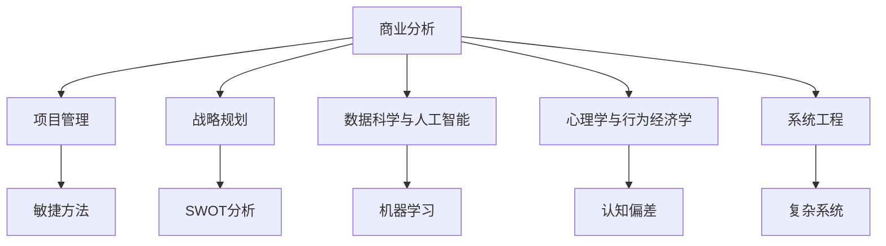

                 

# 打造个人思维体系的意义

## 1. 背景介绍

### 1.1 问题由来
在快速变化和高度互联的今天，个人思维体系（也称为心智模型）的重要性愈发凸显。面对日益复杂多变的商业环境和技术挑战，能否构建一个灵活、结构化、高效的思维体系，直接影响到个体的决策能力、创新力和竞争力。如何打造并持续优化这一体系，成为当今时代对每一位专业人士的迫切需求。

### 1.2 问题核心关键点
打造个人思维体系的核心关键点包括以下几个方面：
1. **核心概念理解**：系统掌握商业、技术、心理学等关键领域的核心概念和原理。
2. **跨领域应用**：能够将不同领域的知识、方法论和工具进行有机融合，解决实际问题。
3. **思维模式提升**：培养批判性思维、系统思考、创新思维等高阶思维能力，以应对复杂挑战。
4. **实践与反馈**：通过实际工作中的应用和反思，持续改进和优化思维体系。
5. **工具与资源**：熟练使用数据分析、AI工具、管理框架等现代技术和工具，提升工作效率。

### 1.3 问题研究意义
构建个人思维体系具有深远的意义：
1. **提升决策质量**：系统化的思维体系能帮助个体在复杂信息中快速找到关键点，做出更有依据的决策。
2. **加速职业发展**：拥有高效思维体系的职场人能更快地识别机会，应对变化，实现职业快速进阶。
3. **促进创新创造**：通过跨学科融合，拓宽思维边界，激发新想法、新方法和新产品。
4. **改善生活质量**：系统思维有助于更好地管理时间、情绪和人际关系，提升生活满意度。

## 2. 核心概念与联系

### 2.1 核心概念概述

为更好地理解个人思维体系的构建，本节将介绍几个关键概念及其相互关联：

- **核心概念**：商业分析、项目管理、战略规划、数据科学与人工智能、心理学与行为经济学、系统工程。
- **概念联系**：这些概念相互交织，形成一个完整、动态的知识体系。例如，数据科学与人工智能是支撑商业分析的技术基础，心理学与行为经济学帮助理解人类行为模式，系统工程则是整合这些知识，形成整体解决方案的能力。

通过以下Mermaid流程图，我们可以更直观地展示这些核心概念之间的联系：



这个流程图展示了核心概念之间的相互依赖和支持关系，展示了构建个人思维体系时需综合考虑的各个方面。

## 3. 核心算法原理 & 具体操作步骤
### 3.1 算法原理概述

打造个人思维体系的方法论，本质上是一种以系统化、结构化思维为导向的学习和应用过程。核心算法原理包括以下几个步骤：

1. **知识体系构建**：系统地学习各领域的核心概念和理论，构建基础的知识框架。
2. **案例分析与实践**：通过实际案例的分析，理解理论在具体情境下的应用，并进行模拟和实践。
3. **反馈与调整**：在实践中不断收集反馈，识别不足和瓶颈，进行针对性的调整和优化。
4. **持续更新**：随着新知识、新方法的不断涌现，定期回顾和更新思维体系，保持其时效性和前瞻性。

### 3.2 算法步骤详解

以下是打造个人思维体系的具体步骤：

**Step 1: 知识体系构建**
1. 确定学习目标：根据职业需求和个人兴趣，确定需要掌握的核心领域和关键概念。
2. 选择合适的学习资源：如书籍、课程、论文、案例等，建立系统化的知识库。
3. 制定学习计划：设定学习进度和里程碑，确保高效有序地掌握新知识。

**Step 2: 案例分析与实践**
1. 收集真实案例：选择具有代表性的案例，涵盖各种情境和问题。
2. 理论应用分析：将理论知识应用到案例分析中，理解其具体应用场景和方法。
3. 模拟实践：在模拟环境中应用理论知识，进行实践操作。

**Step 3: 反馈与调整**
1. 定期自我评估：通过反思、记录等方式，评估知识掌握程度和思维应用效果。
2. 识别改进点：针对评估结果，识别需要提升和改进的地方。
3. 优化调整：根据反馈，调整学习计划和实践策略，进一步提升思维能力。

**Step 4: 持续更新**
1. 持续学习新知识：关注最新研究成果、市场趋势和技术动态。
2. 参与交流与合作：通过网络、社区、研讨会等方式，与其他专业人士交流互动。
3. 定期回顾与更新：每年或每半年进行一次全面的回顾，识别并更新体系中的知识和方法。

### 3.3 算法优缺点

**优点**：
1. **系统化学习**：通过系统化的知识构建和案例分析，确保理论知识和实践技能全面掌握。
2. **高效反馈机制**：定期反思和评估，快速识别改进点，优化思维体系。
3. **持续更新**：保持思维体系的最新状态，适应快速变化的市场和技术环境。

**缺点**：
1. **时间投入大**：打造高效思维体系需要大量时间和精力。
2. **初期挑战大**：从零开始构建思维体系，初期可能遇到较大的困难和挑战。
3. **易受干扰**：在学习过程中，可能受到外界干扰，影响学习进度和质量。

### 3.4 算法应用领域

个人思维体系构建的通用原则和方法是普遍适用的，可以应用于各种职业领域和学术领域，包括但不限于：

- **商业分析**：构建基于数据驱动的商业洞察和决策能力。
- **项目管理**：掌握项目规划、执行和监控的系统方法。
- **战略规划**：发展战略思维，制定长期发展计划。
- **数据科学与人工智能**：掌握数据处理、机器学习等核心技术，提升数据驱动决策能力。
- **心理学与行为经济学**：理解人类行为模式，优化管理策略和产品设计。
- **系统工程**：整合不同领域的知识和方法，形成系统化解决方案。

## 4. 数学模型和公式 & 详细讲解 & 举例说明（备注：数学公式请使用latex格式，latex嵌入文中独立段落使用 $$，段落内使用 $)
### 4.1 数学模型构建

本文将构建一个简单的数学模型，用于说明个人思维体系构建的过程。

设一个知识体系由 $n$ 个核心概念组成，每个概念 $i$ 的掌握程度为 $x_i \in [0,1]$。根据知识的互补性和集成性，知识的综合效用 $U$ 可以表示为：

$$
U = \sum_{i=1}^n w_i x_i + \sum_{i=1}^n \sum_{j=i+1}^n a_{ij} x_i x_j
$$

其中 $w_i$ 为概念 $i$ 的权重，$a_{ij}$ 为概念 $i$ 和概念 $j$ 之间的关联强度。

### 4.2 公式推导过程

1. **加权和**：每个概念 $i$ 的掌握程度 $x_i$ 对综合效用 $U$ 的贡献为 $w_i x_i$。权重 $w_i$ 反映了该概念在知识体系中的重要性。
2. **交互作用项**：概念 $i$ 和概念 $j$ 的交互作用项 $a_{ij} x_i x_j$ 体现了不同概念之间的互补性，当两者同时掌握时，效用会显著提升。
3. **权重调整**：随着对概念 $i$ 的掌握程度提升，其权重 $w_i$ 也会逐渐减小，反映知识体系的动态调整过程。

### 4.3 案例分析与讲解

**案例**：在商业分析领域，核心概念包括市场研究、数据分析、竞争对手分析等。

- **概念1**：市场研究掌握程度 $x_1$，权重 $w_1=0.4$。
- **概念2**：数据分析掌握程度 $x_2$，权重 $w_2=0.3$。
- **概念3**：竞争对手分析掌握程度 $x_3$，权重 $w_3=0.3$。

**公式推导**：

$$
U = 0.4x_1 + 0.3x_2 + 0.3x_3 + 0.2x_1x_2 + 0.2x_1x_3 + 0.1x_2x_3
$$

其中 $0.2$ 为概念 $i$ 和概念 $j$ 之间的关联强度，表示在市场研究、数据分析和竞争对手分析之间，三者的交叉应用能够提升综合效用。

**案例分析**：
- **场景1**：若仅掌握市场研究，$x_1=1, x_2=0, x_3=0$，则 $U=0.4$。
- **场景2**：若市场研究和数据分析都掌握，$x_1=1, x_2=1, x_3=0$，则 $U=0.9$。
- **场景3**：若市场研究、数据分析和竞争对手分析都掌握，$x_1=1, x_2=1, x_3=1$，则 $U=1.5$。

该模型展示了知识体系构建的动态过程和相互关系，通过合理设置权重和关联强度，可以优化知识组合，提升综合效用。

## 5. 项目实践：代码实例和详细解释说明
### 5.1 开发环境搭建

进行个人思维体系构建的实践，需要准备相应的开发环境：

1. **学习资源准备**：选择合适的课程、书籍、论文、案例等，建立知识库。
2. **工具与框架准备**：如Python、R、SQL等，以及数据分析和可视化工具，如Jupyter Notebook、Tableau等。
3. **项目管理准备**：使用项目管理工具，如JIRA、Trello等，制定和跟踪学习计划。

### 5.2 源代码详细实现

以下是一个基于Python的简单代码实现，用于展示如何构建和优化个人思维体系：

```python
import numpy as np
import pandas as pd

# 初始化权重和关联强度
w = np.array([0.4, 0.3, 0.3])
a = np.array([[0.2, 0.2, 0.1],
              [0.2, 0, 0],
              [0.1, 0, 0]])

# 初始化知识掌握程度
x = np.zeros((3, 1))

# 定义函数，计算综合效用
def compute_U(x):
    U = np.zeros((3, 1))
    for i in range(3):
        for j in range(3):
            U[i] += w[i] * x[i] + a[i, j] * x[i] * x[j]
    return U

# 循环学习并优化
for t in range(10):
    U = compute_U(x)
    dx = U - U.max()  # 计算知识差距
    x += 0.1 * dx  # 更新知识掌握程度
    if np.allclose(x, x[t-1], atol=1e-6):
        break  # 达到收敛，跳出循环

print("最终知识掌握程度：", x)
print("最终综合效用：", compute_U(x).max())
```

### 5.3 代码解读与分析

**代码解读**：
1. **权重和关联强度**：通过数组 `w` 和 `a` 定义概念的权重和交互作用强度。
2. **知识掌握程度**：初始化为全零数组 `x`，表示每个概念的掌握程度为0。
3. **计算综合效用**：定义 `compute_U` 函数，计算当前知识体系的综合效用。
4. **优化过程**：通过循环迭代，更新知识掌握程度 `x`，使得综合效用最大化。

**分析**：
- **效果评估**：代码实现了知识体系的构建和优化过程，通过循环迭代不断提升综合效用。
- **动态调整**：通过 `dx` 数组计算知识差距，动态调整知识掌握程度 `x`，确保思维体系的有效性。
- **收敛判断**：通过设置收敛阈值 `atol`，判断是否达到收敛条件，优化知识体系。

## 6. 实际应用场景
### 6.1 战略规划

个人思维体系在战略规划中的应用，主要体现在以下几个方面：

- **环境分析**：通过系统分析内外部环境，构建战略地图。
- **竞争分析**：利用SWOT分析，识别优势、劣势、机会和威胁。
- **路径规划**：结合市场趋势和自身资源，制定长期发展计划。

**案例**：某高科技企业面临市场竞争加剧的挑战，需进行战略规划。

**策略**：
1. **环境分析**：通过PEST分析，识别宏观经济、政策、技术和社会环境因素。
2. **竞争分析**：利用SWOT分析，识别自身的优势、劣势、市场机会和竞争威胁。
3. **路径规划**：结合内外部环境分析，制定基于创新和市场导向的发展策略。

**应用**：
- **PEST分析**：将宏观环境因素纳入考量，制定策略。
- **SWOT分析**：识别自身和竞争对手的优劣势，优化资源配置。
- **路径规划**：结合市场趋势和自身资源，制定长期发展计划。

### 6.2 项目管理

个人思维体系在项目管理中的应用，主要体现在以下几个方面：

- **项目规划**：使用项目管理工具和方法，制定详细项目计划。
- **风险管理**：识别和管理项目中的风险，制定应对措施。
- **质量控制**：通过定期评估和反馈，确保项目质量。

**案例**：某大型软件项目需要高效完成，需进行项目管理。

**策略**：
1. **项目规划**：使用敏捷方法论，制定迭代开发计划。
2. **风险管理**：识别潜在风险，制定预防和应对措施。
3. **质量控制**：通过代码审查和单元测试，确保项目质量。

**应用**：
- **敏捷方法**：采用Scrum或Kanban，快速响应变化。
- **风险管理**：定期识别和管理项目风险，确保项目顺利推进。
- **质量控制**：通过持续集成和自动化测试，提升项目质量。

### 6.3 商业分析

个人思维体系在商业分析中的应用，主要体现在以下几个方面：

- **市场研究**：通过数据分析，识别市场趋势和机会。
- **竞争分析**：分析竞争对手的策略和市场表现，制定应对策略。
- **客户分析**：通过客户细分和行为分析，优化产品和服务。

**案例**：某电子商务平台需提升销售业绩，需进行商业分析。

**策略**：
1. **市场研究**：通过数据分析，识别市场趋势和机会。
2. **竞争分析**：分析竞争对手的策略和市场表现，制定应对策略。
3. **客户分析**：通过客户细分和行为分析，优化产品和服务。

**应用**：
- **市场研究**：使用数据挖掘技术，识别市场趋势和机会。
- **竞争分析**：分析竞争对手的策略和市场表现，制定应对策略。
- **客户分析**：通过客户细分和行为分析，优化产品和服务。

## 7. 工具和资源推荐
### 7.1 学习资源推荐

为了帮助开发者系统掌握个人思维体系的构建和应用，这里推荐一些优质的学习资源：

1. **《系统思考》系列书籍**：介绍系统思维的核心概念和方法，如系统动力学、因果循环图等。
2. **Coursera《商业分析》课程**：由宾夕法尼亚大学开设的商业分析课程，涵盖商业分析的各个方面，包括数据分析、市场研究等。
3. **LinkedIn Learning《项目管理》课程**：提供全面的项目管理知识，涵盖敏捷方法、风险管理等。
4. **《数据科学与人工智能》书籍**：介绍数据科学和人工智能的基础知识和前沿技术，包括机器学习、深度学习等。
5. **《心理学与行为经济学》书籍**：讲解心理学和行为经济学的核心概念，帮助理解人类行为模式，优化管理策略。

通过这些资源的学习，相信你一定能够系统掌握个人思维体系的核心概念和方法，并在实际工作中灵活应用。

### 7.2 开发工具推荐

高效的开发和学习需要优质的工具支持。以下是几款用于个人思维体系构建和应用开发的常用工具：

1. **Jupyter Notebook**：免费的开源笔记本工具，支持Python、R等语言，用于数据处理和代码实现。
2. **Tableau**：强大的数据可视化工具，能够高效展示数据分析结果，支持交互式探索。
3. **Trello**：项目管理和协作工具，支持任务分配、进度跟踪和团队协作。
4. **Scrum Boards**：敏捷项目管理工具，支持Scrum方法论的实施，促进团队协作和项目管理。
5. **GitHub**：代码托管和版本控制工具，支持多人协作和版本管理，方便代码共享和迭代。

合理利用这些工具，可以显著提升个人思维体系构建和应用的效率，加快创新迭代的步伐。

### 7.3 相关论文推荐

个人思维体系的构建和应用，涉及多学科的知识和方法。以下是几篇奠基性的相关论文，推荐阅读：

1. **《系统思考：思维范式的革命》**：Deborah Emerson Meyerson和Alan D. Kennedy撰写的经典书籍，介绍了系统思维的核心概念和方法。
2. **《敏捷方法论：如何敏捷地应对变化》**：Ken Schwaber和Mike Beedle撰写的书籍，详细介绍了敏捷方法论的核心原则和实践。
3. **《数据科学与人工智能：数据驱动的决策支持》**：Christopher M. Bishop撰写的书籍，介绍了数据科学和人工智能的基本概念和前沿技术。
4. **《心理学与行为经济学：行为决策理论与应用》**：Russell H. Krugman和Alan S. Bersin撰写的书籍，讲解心理学和行为经济学的核心概念和应用。

这些论文代表了个人思维体系构建和应用研究的前沿，通过学习这些论文，可以帮助研究者把握学科前进方向，激发更多的创新灵感。

## 8. 总结：未来发展趋势与挑战
### 8.1 研究成果总结

本文对打造个人思维体系的方法论进行了全面系统的介绍。首先阐述了个人思维体系的重要性，明确了其在学习、工作和生活中应用的广泛性。其次，从原理到实践，详细讲解了个人思维体系的构建和应用过程，包括知识体系构建、案例分析与实践、反馈与调整、持续更新等关键步骤，并给出了具体的代码实例。同时，本文还探讨了个人思维体系在商业分析、项目管理、战略规划等实际场景中的应用，展示了其多领域适用性和巨大潜力。

通过本文的系统梳理，可以看到，个人思维体系构建不仅是一个理论学习的过程，更是一个实践应用和持续优化的过程。掌握核心概念和应用方法，结合实际情境进行灵活运用，是打造高效、灵活的个人思维体系的关键。

### 8.2 未来发展趋势

展望未来，个人思维体系构建将呈现以下几个发展趋势：

1. **跨学科融合**：随着多学科融合趋势的加强，个人思维体系将融合更多领域的方法论，如系统思考、设计思维、认知科学等。
2. **智能辅助**：随着人工智能技术的发展，智能辅助工具将更加普及，帮助个体更高效地构建和优化思维体系。
3. **个性化定制**：基于大数据和AI技术，实现个性化学习路径和资源推荐，适应不同个体的需求。
4. **全球化视角**：全球化背景下的复杂环境，要求个体具备更广阔的视野和全球化思维，提升跨文化沟通能力。

### 8.3 面临的挑战

尽管个人思维体系构建取得了显著进展，但在迈向更高阶应用的过程中，仍面临以下挑战：

1. **知识更新迅速**：知识更新速度加快，要求个体不断学习新知识，提升持续学习能力。
2. **跨学科难度高**：跨学科融合需要较强的理论基础和实践经验，对个体综合素质要求高。
3. **时间管理困难**：构建高效的思维体系需要大量时间和精力，需要在繁忙的工作和生活中找到平衡。
4. **应用难度大**：理论知识转化为实际应用需要丰富的实践经验，需要不断反思和调整。

### 8.4 研究展望

面对个人思维体系构建所面临的挑战，未来的研究需要在以下几个方面寻求新的突破：

1. **持续学习机制**：研究高效的持续学习模型，如自适应学习、混合学习等，提升个体学习效率。
2. **智能辅助工具**：开发更加智能和个性化的学习辅助工具，帮助个体高效构建和优化思维体系。
3. **跨学科融合方法**：探索跨学科融合的有效方法和工具，促进不同领域的知识和方法的有机整合。
4. **实践应用模型**：研究将理论知识转化为实际应用的最佳模型和方法，提升思维体系的实用性和有效性。

这些研究方向将为个人思维体系构建提供新的方法和思路，推动其在更广阔的应用场景中落地和应用。

## 9. 附录：常见问题与解答

**Q1：如何系统地构建个人思维体系？**

A: 系统构建个人思维体系，需要遵循以下步骤：
1. 确定学习目标，选择合适的学习资源。
2. 制定学习计划，逐步掌握核心概念和理论。
3. 进行案例分析和实践，理解理论的应用场景。
4. 定期反馈和调整，优化思维体系。
5. 持续更新，保持体系的时效性和前瞻性。

**Q2：个人思维体系构建的难点有哪些？**

A: 个人思维体系构建的主要难点包括：
1. 知识更新迅速，需要不断学习和适应新知识。
2. 跨学科难度高，需要较强的理论基础和实践经验。
3. 时间管理困难，需要在繁忙的工作和生活中找到平衡。
4. 应用难度大，需要将理论知识转化为实际应用。

**Q3：如何克服个人思维体系构建的难点？**

A: 克服个人思维体系构建的难点，需要采取以下策略：
1. 持续学习机制，如自适应学习、混合学习等，提升学习效率。
2. 智能辅助工具，如学习平台、知识图谱等，帮助高效构建和优化思维体系。
3. 跨学科融合方法，探索不同领域知识和方法的有机整合。
4. 实践应用模型，研究将理论知识转化为实际应用的最佳方法。

**Q4：个人思维体系构建的意义是什么？**

A: 个人思维体系构建的意义在于：
1. 提升决策质量，帮助个体在复杂信息中快速找到关键点，做出更有依据的决策。
2. 加速职业发展，掌握高效思维体系，提升职场竞争力和职业发展速度。
3. 促进创新创造，通过跨学科融合，拓宽思维边界，激发新想法和新方法。
4. 改善生活质量，提升时间、情绪和人际关系管理能力，提高生活满意度。

通过本文的系统梳理，可以看到，打造个人思维体系不仅是一个理论学习的过程，更是一个实践应用和持续优化的过程。掌握核心概念和应用方法，结合实际情境进行灵活运用，是打造高效、灵活的个人思维体系的关键。

---

作者：禅与计算机程序设计艺术 / Zen and the Art of Computer Programming

