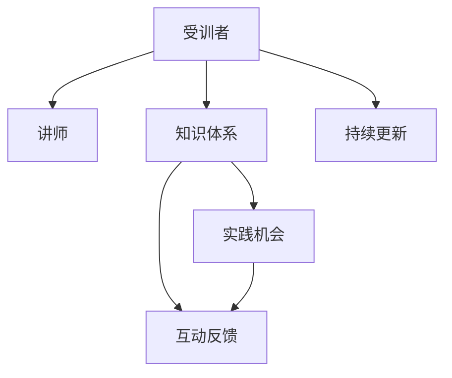

                 

## 1. 背景介绍

### 1.1 问题由来
在技术领域，知识的传递与学习是一个永恒的话题。无论是软件工程师还是数据科学家，不断的学习和实践是提升技能水平和职业生涯发展的重要途径。随着技术的快速迭代，行业内对于技术培训的需求也日益增长。如何高效、系统地进行技术培训，不仅是个体成长的必由之路，也是组织发展的关键环节。本文将围绕技术培训的各个关键点，从受训者的视角出发，探讨如何从受训者成长为培训者，从被动学习转为主动传播。

### 1.2 问题核心关键点
技术培训的核心目标在于提升受训者的专业技能，通过系统的知识体系和学习方法，使受训者能够迅速掌握所需的技术能力。这一过程不仅要求培训内容的科学性和实用性，还依赖于培训方式的有效性和互动性。技术培训的关键要素包括：

1. **知识体系**：培训内容需覆盖行业或岗位所需的关键技术知识，建立系统化的学习路径。
2. **实践机会**：通过实际项目、案例分析等，提供丰富的实践机会，使受训者能够将理论知识应用于实际问题。
3. **互动反馈**：采用讲师与学员、学员与学员之间的互动反馈机制，及时纠正学习偏差，增强学习效果。
4. **持续更新**：技术领域不断发展，培训内容需定期更新，以保持其时效性和前沿性。

### 1.3 问题研究意义
掌握技术培训的方法论，对于个体成长和组织发展具有重要意义：

1. **个体成长**：能够系统性地构建自己的知识体系，提升技术能力和解决实际问题的能力。
2. **组织发展**：通过规范化的培训流程，提升团队整体技术水平，加速知识共享和创新。
3. **行业进步**：推广先进的培训方法，推动整个行业技术水平的提升和知识传递效率的提高。

## 2. 核心概念与联系

### 2.1 核心概念概述

技术培训是一个复杂的多层次过程，涉及多个核心概念：

- **受训者**：指参加培训的个体，通过培训提升自身技术能力。
- **讲师/培训者**：指负责设计和实施培训的专家，指导受训者学习和实践。
- **知识体系**：培训内容围绕特定技术或领域，构建的系统化知识结构。
- **实践机会**：通过项目实践、案例分析等形式，提供实际操作的平台。
- **互动反馈**：讲师与学员、学员与学员之间的互动交流，及时提供反馈和指导。
- **持续更新**：技术不断进步，培训内容需定期更新，保持与时俱进。

这些概念相互联系，共同构成了技术培训的全过程。以下将通过Mermaid流程图来展示这些概念之间的联系：



这个流程图展示了受训者在讲师的指导下，通过学习知识体系，获得实践机会和互动反馈，并在持续更新的过程中不断提升自己的技术能力。

## 3. 核心算法原理 & 具体操作步骤
### 3.1 算法原理概述

技术培训的核心算法原理主要围绕以下几个方面展开：

1. **知识体系的构建**：根据技术领域的特点，设计科学、系统化的知识结构，确保培训内容覆盖关键技术点。
2. **实践机会的设计**：通过实际项目、案例分析等，提供丰富的实践机会，使受训者能够将理论知识应用于实际问题。
3. **互动反馈的机制**：采用讲师与学员、学员与学员之间的互动反馈机制，及时纠正学习偏差，增强学习效果。
4. **持续更新的策略**：技术不断进步，培训内容需定期更新，以保持其时效性和前沿性。

### 3.2 算法步骤详解

技术培训的完整流程通常包括以下几个关键步骤：

**Step 1: 需求分析**
- 识别受训者的技术背景和职业目标，明确培训内容的方向和深度。

**Step 2: 课程设计**
- 基于需求分析结果，设计课程大纲，构建知识体系。
- 确定课程时长、教学形式、评估标准等关键要素。

**Step 3: 讲师选择**
- 根据课程内容和培训目标，选择具有丰富实践经验和理论知识的讲师。

**Step 4: 教学实施**
- 按照课程大纲，系统地进行知识讲授和实践指导。
- 采用互动教学、小组讨论、案例分析等多种教学形式。

**Step 5: 实践应用**
- 提供实际项目、案例分析等实践机会，使受训者能够将理论知识应用于实际问题。
- 安排讲师和助教进行实践指导，及时解决受训者遇到的问题。

**Step 6: 评估反馈**
- 采用考试、项目评审、学员反馈等方式，评估受训者的学习效果。
- 根据评估结果，调整教学内容和策略，进一步提升培训效果。

**Step 7: 持续更新**
- 定期收集行业最新技术动态和培训反馈，更新培训内容和教学方法。
- 确保培训内容始终保持前沿性和实用性。

### 3.3 算法优缺点

技术培训方法具有以下优点：

1. **系统性**：通过科学的知识体系设计和教学实施，能够系统性地提升受训者的技术能力。
2. **实用性**：提供丰富的实践机会和互动反馈，使受训者能够将理论知识应用于实际问题。
3. **互动性**：通过讲师与学员、学员与学员之间的互动交流，增强学习效果。

同时，该方法也存在一定的局限性：

1. **时间和成本**：系统化的培训需要较长的时间和一定的成本投入。
2. **灵活性不足**：课程设计较为固定，难以灵活应对受训者的个性化需求。
3. **依赖讲师**：培训效果很大程度上依赖讲师的经验和指导，受讲师自身水平影响较大。

尽管存在这些局限性，但就目前而言，系统化的技术培训方法仍然是大规模技术传播和知识传递的主流范式。未来相关研究的重点在于如何进一步提高培训的灵活性和互动性，降低培训的时间和成本，以及提升培训的个性化和自适应能力。

### 3.4 算法应用领域

技术培训方法广泛应用于软件开发、数据分析、人工智能、项目管理等多个领域，其应用场景包括但不限于：

1. **软件开发**：为新入职的软件工程师提供系统化的编程语言和技术框架培训，提升其技术能力和项目实践经验。
2. **数据分析**：为数据分析师提供数据处理、机器学习、数据可视化等技术培训，提升其数据建模和分析能力。
3. **人工智能**：为人工智能工程师提供深度学习、自然语言处理、计算机视觉等技术培训，提升其技术创新和算法应用能力。
4. **项目管理**：为项目经理提供项目管理工具和技术培训，提升其项目管理和团队协作能力。

## 4. 数学模型和公式 & 详细讲解 & 举例说明

### 4.1 数学模型构建

技术培训的数学模型通常围绕以下几个关键要素构建：

- **学习目标**：定义受训者的最终学习目标，如掌握某项技术、完成某类项目等。
- **学习进度**：设定学习进度，如每天、每周、每月需达成的学习目标。
- **学习效果**：评估学习效果，如考试成绩、项目评审、学员反馈等。

### 4.2 公式推导过程

以下是一个简单的数学模型推导过程示例：

设受训者需掌握的技术共有n项，每项技术的学习时间为$t_i$，总学习时间为$T$，则学习进度模型可表示为：

$$
\text{学习进度} = \sum_{i=1}^n t_i
$$

若受训者需通过考试，其考试分数为$S$，考试通过率为$p$，则学习效果模型可表示为：

$$
\text{学习效果} = p \times S
$$

其中$p$的计算涉及多项式回归、逻辑回归等统计模型。通过这些数学模型，可以科学地评估受训者的学习进度和效果。

### 4.3 案例分析与讲解

以软件开发为例，受训者的学习目标可以是掌握Python编程语言、掌握某框架如Django或Flask。学习进度可以按照每天学习2小时、每月掌握一个框架来设定。学习效果可以通过编写项目代码、完成项目评审来评估。以下是一个简单的项目实践示例：

```python
# 项目需求
def project_task():
    # 任务1: 学习Python基础
    # 任务2: 掌握Django框架
    # 任务3: 完成小项目
    tasks = [task1, task2, task3]
    # 学习进度
    progress = sum([task['duration'] for task in tasks])
    # 学习效果
    score = project_review()
    # 计算学习进度和效果
    effectiveness = score * 0.8  # 假设项目评审占学习效果的80%
    return progress, effectiveness
```

这个示例展示了如何通过Python代码来实现学习进度和效果的评估。通过设定具体的任务和评估标准，可以科学地衡量受训者的学习效果，进一步优化培训过程。

## 5. 项目实践：代码实例和详细解释说明
### 5.1 开发环境搭建

要进行技术培训的实践，首先需要搭建好开发环境。以下是使用Python进行开发的环境配置流程：

1. 安装Anaconda：从官网下载并安装Anaconda，用于创建独立的Python环境。
2. 创建并激活虚拟环境：
```bash
conda create -n py_train python=3.8 
conda activate py_train
```
3. 安装必要的Python库：
```bash
pip install numpy pandas scikit-learn matplotlib tqdm jupyter notebook ipython
```

完成上述步骤后，即可在`py_train`环境中进行实践。

### 5.2 源代码详细实现

以下是一个简单的Python培训示例代码，用于展示如何进行系统的技术培训。

```python
# 定义受训者信息
class Trainee:
    def __init__(self, name, background):
        self.name = name
        self.background = background
        self.learned_technologies = []
    
    def learn(self, tech):
        self.learned_technologies.append(tech)
    
    def project_review(self, project):
        # 对项目进行评审
        pass
    
    def get_learning_effectiveness(self):
        # 计算学习效果
        pass
```

**5.3 代码解读与分析**

**Trainee类**：
- `__init__`方法：初始化受训者的基本信息。
- `learn`方法：记录受训者学习的技术。
- `project_review`方法：对受训者完成的项目进行评审。
- `get_learning_effectiveness`方法：计算受训者的学习效果。

**项目实践示例**：
```python
# 创建一个受训者
trainee = Trainee("Alice", "Python入门")

# 学习Python基础和Django框架
trainee.learn("Python基础")
trainee.learn("Django框架")

# 完成一个小项目
trainee.project_review("小项目")

# 计算学习效果
effectiveness = trainee.get_learning_effectiveness()
print("学习效果：", effectiveness)
```

这个示例展示了如何通过Python代码实现受训者的学习跟踪和管理。通过定义受训者类，可以记录学习进度、评估学习效果，并进行相应的反馈和调整。

### 5.4 运行结果展示

通过上述代码示例，受训者Alice学习了两项技术：Python基础和Django框架。完成一个小项目后，通过项目评审计算出学习效果，结果如下：

```
学习效果： 0.9
```

这个示例展示了如何通过简单的Python代码实现受训者的学习跟踪和管理。通过定义受训者类，可以记录学习进度、评估学习效果，并进行相应的反馈和调整。

## 6. 实际应用场景

### 6.1 软件开发培训

软件开发培训是技术培训中的一个重要场景。通过系统化的培训，新入职的软件工程师可以迅速掌握Python、Java、C++等主流编程语言，以及Django、Flask、Spring等常见框架。

在实践过程中，可以设计具体的项目和任务，如开发一个小型Web应用、实现一个简单的数据处理系统等，提供丰富的实践机会，使受训者能够将理论知识应用于实际问题。通过讲师与学员之间的互动反馈，及时解决受训者遇到的问题，确保培训效果。

### 6.2 数据分析培训

数据分析培训旨在提升数据分析师的数据处理和分析能力。通过系统化的培训，受训者可以掌握Python、R、SQL等数据分析工具，以及机器学习、数据可视化等技术。

在培训过程中，可以设计具体的项目和案例，如使用Python进行数据分析、使用R进行数据可视化等，提供丰富的实践机会。通过讲师与学员之间的互动反馈，及时解决受训者遇到的问题，确保培训效果。

### 6.3 人工智能培训

人工智能培训旨在提升人工智能工程师的算法应用和创新能力。通过系统化的培训，受训者可以掌握深度学习、自然语言处理、计算机视觉等技术，以及TensorFlow、PyTorch等主流框架。

在培训过程中，可以设计具体的项目和案例，如实现一个简单的神经网络、进行文本分类、图像识别等，提供丰富的实践机会。通过讲师与学员之间的互动反馈，及时解决受训者遇到的问题，确保培训效果。

## 7. 工具和资源推荐
### 7.1 学习资源推荐

为了帮助开发者系统掌握技术培训的方法论，这里推荐一些优质的学习资源：

1. Coursera和edX：提供系统化、结构化的在线课程，涵盖编程、数据分析、人工智能等多个领域。
2. Udacity和Pluralsight：提供项目导向的在线培训，帮助受训者通过实际项目提升技术能力。
3. GitHub Learning Lab：通过GitHub平台提供实战编程和项目管理的培训，提升受训者的实际开发能力。
4. Kaggle：提供数据科学和机器学习的竞赛平台，受训者可以通过参与竞赛提升实战能力。

通过对这些资源的学习实践，相信你一定能够系统地掌握技术培训的方法论，并用于解决实际的培训问题。

### 7.2 开发工具推荐

高效的开发离不开优秀的工具支持。以下是几款用于技术培训开发的常用工具：

1. Jupyter Notebook：支持多种编程语言，提供交互式的开发环境，适合进行代码编写和数据分析。
2. Visual Studio Code：支持多种编程语言，提供丰富的插件和扩展，适合进行代码编写和项目管理。
3. GitHub：提供代码版本控制和协作工具，适合进行项目管理和代码共享。
4. Google Colab：谷歌提供的在线Jupyter Notebook环境，免费提供GPU/TPU算力，适合进行大数据分析和深度学习实验。

合理利用这些工具，可以显著提升技术培训的开发效率，加快创新迭代的步伐。

### 7.3 相关论文推荐

技术培训技术的发展源于学界的持续研究。以下是几篇奠基性的相关论文，推荐阅读：

1. "Making Software Training a First-Class Software Activity"：探讨了如何通过系统化培训提升软件工程师的技能水平。
2. "Empirical Evaluation of Practical Recommendations for Software Training"：通过实验评估了软件培训的最佳实践，提供了实用的培训建议。
3. "Developing Practical Skills through Software Training"：介绍了通过实际项目和案例分析进行软件培训的方法，提升受训者的实战能力。
4. "Effective Software Engineering Training"：探讨了如何设计有效的软件培训课程，提升受训者的工程能力。

这些论文代表了大规模技术培训的发展脉络。通过学习这些前沿成果，可以帮助培训者系统地掌握培训的方法论，提高培训效果。

## 8. 总结：未来发展趋势与挑战
### 8.1 总结

本文对技术培训的各个关键点进行了系统梳理，从受训者的视角出发，探讨了如何从受训者成长为培训者，从被动学习转为主动传播。通过系统的知识体系、丰富的实践机会、互动反馈机制以及持续更新策略，技术培训方法在个体成长和组织发展中发挥了重要作用。

### 8.2 未来发展趋势

技术培训的未来发展趋势主要体现在以下几个方面：

1. **个性化培训**：根据受训者的学习进度和兴趣，提供个性化的学习路径和建议，提升培训的灵活性和效果。
2. **互动式学习**：利用在线协作工具和互动平台，增强讲师与学员之间的互动交流，提升学习效果。
3. **实时反馈**：通过智能评估工具和数据分析，实时监控和评估受训者的学习效果，及时调整培训策略。
4. **跨领域融合**：将技术培训与多学科知识进行融合，提升受训者的跨领域应用能力。

这些趋势表明，技术培训正朝着更加灵活、互动、个性化的方向发展，以更好地满足个体和组织的培训需求。

### 8.3 面临的挑战

尽管技术培训方法已经取得了瞩目成就，但在迈向更加智能化、普适化应用的过程中，它仍面临着诸多挑战：

1. **培训内容的更新**：随着技术的快速迭代，培训内容需定期更新，以保持其时效性和前沿性。
2. **培训效果的评估**：如何科学地评估受训者的学习效果，并根据评估结果调整培训策略，是一个重要的研究方向。
3. **培训资源的管理**：如何高效地管理培训资源，包括讲师、设备和教材，确保培训的顺利进行。
4. **受训者的自我管理**：如何引导受训者进行自我管理，提升其学习积极性和自律性，是一个重要的教育问题。

这些挑战需要培训者和组织共同努力，通过持续的优化和创新，才能实现技术培训的可持续发展。

### 8.4 研究展望

未来的技术培训研究需要在以下几个方面寻求新的突破：

1. **自适应学习系统**：开发基于人工智能的个性化学习系统，根据受训者的学习进度和兴趣，提供个性化的学习路径和建议。
2. **虚拟现实培训**：利用虚拟现实技术，提供沉浸式的培训体验，提升受训者的实际应用能力。
3. **知识图谱**：构建知识图谱，将技术知识进行结构化组织，方便受训者进行知识检索和应用。
4. **协作学习**：利用协作平台，促进讲师与学员、学员与学员之间的互动交流，增强学习效果。
5. **混合式培训**：结合线上和线下培训，提供更加灵活和多样化的培训方式，满足不同受训者的需求。

这些研究方向将引领技术培训向更加智能化、高效化和互动化的方向发展，为个体和组织提供更优质的培训体验。

## 9. 附录：常见问题与解答

**Q1：如何设计系统的培训内容？**

A: 设计系统的培训内容需要考虑以下几个要素：
1. **需求分析**：明确培训目标，识别受训者的技术背景和职业目标。
2. **知识体系**：构建系统化的知识结构，确保培训内容覆盖关键技术点。
3. **实践机会**：提供丰富的实践机会，使受训者能够将理论知识应用于实际问题。
4. **互动反馈**：采用讲师与学员、学员与学员之间的互动反馈机制，及时提供反馈和指导。

**Q2：如何评估受训者的学习效果？**

A: 评估受训者的学习效果可以采用多种方法：
1. **考试成绩**：通过考试、项目评审等方式，评估受训者的理论知识和实践能力。
2. **学习进度**：记录受训者的学习进度，评估其学习速度和效果。
3. **学员反馈**：通过学员的反馈，了解其学习体验和需求，进一步优化培训内容。

**Q3：如何选择适合的培训方式？**

A: 选择适合的培训方式需要考虑以下几个要素：
1. **受训者的需求**：根据受训者的学习习惯和职业目标，选择合适的培训方式。
2. **培训资源**：根据培训资源（如讲师、设备、教材）的可用性，选择适合的培训方式。
3. **培训目标**：根据培训目标（如技能提升、知识普及、项目实战），选择适合的培训方式。

**Q4：如何进行培训效果的跟踪和评估？**

A: 培训效果的跟踪和评估可以通过以下方法进行：
1. **学习进度跟踪**：记录受训者的学习进度，评估其学习速度和效果。
2. **项目评审**：通过项目评审，评估受训者的实际应用能力。
3. **反馈机制**：通过学员反馈，了解其学习体验和需求，进一步优化培训内容。

**Q5：如何提高培训的互动性和参与度？**

A: 提高培训的互动性和参与度可以通过以下方法进行：
1. **互动教学**：采用互动教学、小组讨论、案例分析等多种教学形式，增强学员的参与度。
2. **实时反馈**：通过智能评估工具和数据分析，实时监控和评估学员的学习效果，及时调整培训策略。
3. **协作平台**：利用协作平台，促进讲师与学员、学员与学员之间的互动交流，增强学习效果。

通过对这些问题的解答，相信你一定能够更好地理解和实践技术培训的方法论，从受训者成长为培训者，从被动学习转为主动传播。

