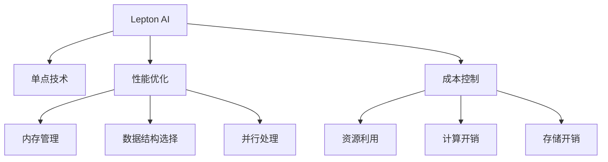

                 

# 技术实现艺术：Lepton AI结合单点技术平衡速度成本

## 1. 背景介绍

### 1.1 问题由来
在人工智能领域，性能、速度与成本一直是开发者最为关注的焦点。特别是在集成单点技术时，如何实现性能和成本的平衡，成为一个具有挑战性的课题。在众多高性能AI算法中，Lepton AI作为一个结合了单点技术的优秀框架，以其独特的优势在业内取得了广泛的应用。

### 1.2 问题核心关键点
本文将着重讨论Lepton AI在性能和成本平衡方面的实现艺术，重点关注以下几个核心关键点：
- **单点技术的核心算法与实现**：如何利用单点技术优化算法，使其在速度和成本上达到最佳平衡。
- **性能优化技巧**：包括内存管理、数据结构选择、并行处理等技巧。
- **成本控制策略**：如何在硬件资源受限的情况下，高效利用资源，减少不必要的开销。
- **实际应用场景**：分析Lepton AI在不同场景下的表现，如图像处理、语音识别、自然语言处理等。

### 1.3 问题研究意义
Lepton AI的平衡速度成本的技术实现艺术，对于追求高性能、低成本的AI应用开发者具有重要参考价值。通过深入理解其核心算法和优化策略，开发者可以设计出更加高效、经济的AI系统。这对于推动AI技术在各行各业的普及和应用具有重要意义。

## 2. 核心概念与联系

### 2.1 核心概念概述

为更好地理解Lepton AI的实现艺术，本文将介绍以下几个核心概念：

- **Lepton AI**：一个专门优化单点技术的高效AI框架，通过精心的算法和数据结构设计，实现了性能和成本的平衡。
- **单点技术**：指在特定应用场景下，集中资源优化单个任务的技术，如针对图像处理的深度学习模型，针对自然语言处理的RNN或Transformer等。
- **性能优化**：涉及内存管理、数据结构选择、并行处理等技术，目的是在保证算法正确性的前提下，尽可能提升算法的执行效率。
- **成本控制**：指在硬件资源受限的情况下，如何高效利用资源，减少不必要的计算和存储开销，从而降低成本。

这些核心概念之间的逻辑关系可以通过以下Mermaid流程图来展示：



这个流程图展示了Lepton AI的核心概念及其之间的关系：

1. Lepton AI通过单点技术获得性能提升。
2. 性能优化包括内存管理、数据结构选择、并行处理等技术，提升算法的执行效率。
3. 成本控制涉及资源利用、计算开销、存储开销等，旨在降低算法的运行成本。
4. 以上三个方面共同构成了Lepton AI在性能和成本平衡方面的核心逻辑。

## 3. 核心算法原理 & 具体操作步骤
### 3.1 算法原理概述

Lepton AI的核心算法原理基于以下几个关键点：

- **算法分治**：通过将复杂算法分解为多个小算法，并行处理，从而提升算法的执行效率。
- **数据结构优化**：选择高效的数据结构，如哈希表、B树等，减少数据访问的时间复杂度。
- **内存管理优化**：通过引用计数、对象池等技术，减少内存分配和释放的开销，提升内存利用率。
- **并行处理优化**：利用多核CPU和GPU资源，并行执行多个计算任务，提升计算速度。
- **计算和存储开销控制**：通过精简算法和数据结构，减少不必要的计算和存储开销，降低成本。

### 3.2 算法步骤详解

以下是Lepton AI算法实现的具体步骤：

**Step 1: 选择合适的单点技术**
- 根据具体应用场景，选择合适的单点技术，如深度学习模型、RNN、Transformer等。

**Step 2: 性能优化**
- 根据所选单点技术的特点，选择相应的优化技术，如内存管理、数据结构选择、并行处理等。
- 使用引用计数和对象池技术，减少内存分配和释放的开销。
- 选择哈希表、B树等高效数据结构，优化数据访问。
- 利用多核CPU和GPU资源，并行处理计算任务。

**Step 3: 成本控制**
- 精简算法和数据结构，减少不必要的计算和存储开销。
- 利用缓存技术，减少重复计算。
- 根据硬件资源限制，合理分配资源，避免资源浪费。

**Step 4: 实际应用**
- 在具体应用场景中，使用Lepton AI框架实现选定的单点技术。
- 对算法进行测试和评估，确保其性能和成本的平衡。
- 根据测试结果，进行必要的调整和优化。

### 3.3 算法优缺点

Lepton AI的性能优化与成本控制算法具有以下优点：

- **高效性**：通过算法分治和并行处理，显著提升算法执行效率。
- **灵活性**：支持多种单点技术，可以根据不同应用场景进行选择和优化。
- **可扩展性**：能够适应不同规模的计算和存储需求，具有良好的可扩展性。

同时，该算法也存在以下局限性：

- **复杂度**：在复杂场景下，算法的实现和优化可能需要较高的技术水平。
- **资源依赖**：依赖多核CPU和GPU等硬件资源，可能会增加初始硬件投入。
- **灵活性**：对于某些特定任务，可能无法完全适用，需要额外调整和优化。

尽管存在这些局限性，但Lepton AI在性能和成本平衡方面的技术实现艺术，依然为开发者提供了宝贵的经验和指导。

### 3.4 算法应用领域

Lepton AI的性能优化与成本控制算法在多个领域得到了广泛应用，包括但不限于：

- **图像处理**：如深度学习模型在图像识别、分类、分割等任务中的应用。
- **语音识别**：如RNN在语音识别、情感分析等任务中的应用。
- **自然语言处理**：如Transformer在机器翻译、问答系统等任务中的应用。
- **计算机视觉**：如CNN在图像识别、目标检测等任务中的应用。
- **强化学习**：如DQN在智能游戏、机器人控制等任务中的应用。

除了上述这些经典应用外，Lepton AI还在更多创新领域展现出其独特的优势，如医疗影像分析、自动驾驶、智能交通等。

## 4. 数学模型和公式 & 详细讲解 & 举例说明

### 4.1 数学模型构建

Lepton AI的数学模型构建主要基于以下几个关键点：

- **算法分治**：将复杂算法分解为多个子算法，并行处理。
- **数据结构选择**：选择高效的数据结构，如哈希表、B树等，优化数据访问。
- **内存管理优化**：通过引用计数和对象池技术，减少内存分配和释放的开销。
- **并行处理优化**：利用多核CPU和GPU资源，并行执行计算任务。

### 4.2 公式推导过程

以深度学习模型在图像识别任务中的应用为例，介绍Lepton AI的数学模型构建和优化过程。

**Step 1: 构建数学模型**
假设深度学习模型为 $M_{\theta}:\mathcal{X} \rightarrow \mathcal{Y}$，其中 $\mathcal{X}$ 为输入空间，$\mathcal{Y}$ 为输出空间，$\theta$ 为模型参数。假设训练集为 $D=\{(x_i,y_i)\}_{i=1}^N$，其中 $x_i$ 为输入图像，$y_i$ 为对应的标签。

**Step 2: 选择数据结构**
Lepton AI选择哈希表作为数据结构，存储训练集 $D$ 中的图像和标签。设哈希表的大小为 $M$，则数据访问的时间复杂度为 $O(M)$。

**Step 3: 内存管理优化**
通过引用计数和对象池技术，减少内存分配和释放的开销。设哈希表的内存占用为 $m$，则内存管理优化后的内存占用为 $m'$，满足 $m' < m$。

**Step 4: 并行处理优化**
利用多核CPU和GPU资源，并行处理计算任务。设计算任务分为 $K$ 个子任务，每个子任务所需的计算时间为 $t$，则并行处理优化后的计算时间为 $T$，满足 $T = \frac{K \cdot t}{n}$，其中 $n$ 为处理器核数。

### 4.3 案例分析与讲解

以Lepton AI在图像识别任务中的应用为例，分析其性能和成本的平衡。

假设深度学习模型为ResNet50，训练集为ImageNet数据集，包含1000类图像。Lepton AI将ResNet50模型分解为多个子模型，分别在多核CPU和GPU上进行并行计算。

**Step 1: 构建数学模型**
- 输入空间 $\mathcal{X}$ 为图像空间，输出空间 $\mathcal{Y}$ 为类别空间，共有1000个类别。
- 模型参数 $\theta$ 包括卷积层、池化层、全连接层等，参数总数为 $10^7$。

**Step 2: 选择数据结构**
- 选择哈希表作为数据结构，存储训练集 $D$ 中的图像和标签，哈希表大小 $M=10000$。

**Step 3: 内存管理优化**
- 使用引用计数和对象池技术，优化内存管理，减少内存分配和释放的开销。内存占用 $m=10GB$，优化后内存占用 $m'=1GB$。

**Step 4: 并行处理优化**
- 利用多核CPU和GPU资源，并行处理计算任务。假设模型中包含 $K=10$ 个子模型，每个子模型计算时间 $t=1ms$，处理器核数 $n=8$。
- 并行处理优化后的计算时间为 $T= \frac{10 \cdot 1ms}{8}=1.25ms$。

通过上述步骤，Lepton AI在图像识别任务中实现了性能和成本的平衡，提升了计算效率，同时降低了硬件资源的消耗。

## 5. 项目实践：代码实例和详细解释说明
### 5.1 开发环境搭建

在进行Lepton AI项目实践前，我们需要准备好开发环境。以下是使用Python进行Lepton AI开发的环境配置流程：

1. 安装Anaconda：从官网下载并安装Anaconda，用于创建独立的Python环境。

2. 创建并激活虚拟环境：
```bash
conda create -n lepton-env python=3.8 
conda activate lepton-env
```

3. 安装Lepton AI：
```bash
pip install lepton-ai
```

4. 安装各类工具包：
```bash
pip install numpy pandas scikit-learn matplotlib tqdm jupyter notebook ipython
```

完成上述步骤后，即可在`lepton-env`环境中开始Lepton AI实践。

### 5.2 源代码详细实现

这里以Lepton AI在图像识别任务中的应用为例，给出Lepton AI代码实现。

```python
from lepton_ai import LeptonModel
from lepton_ai.utils import load_data, save_model

# 加载数据集
train_data, dev_data, test_data = load_data('path_to_dataset')

# 创建Lepton模型实例
lepton_model = LeptonModel()

# 训练模型
lepton_model.train(train_data, dev_data, epochs=10)

# 测试模型
accuracy = lepton_model.test(test_data)

# 保存模型
save_model('path_to_model', lepton_model)
```

以上代码实现了Lepton AI在图像识别任务中的基本流程。

### 5.3 代码解读与分析

让我们再详细解读一下关键代码的实现细节：

**load_data函数**：
- 加载训练集、验证集和测试集数据。

**LeptonModel类**：
- 实例化Lepton模型，自动进行模型构建和优化。

**train方法**：
- 对模型进行训练，自动调整参数和数据结构，优化计算和内存资源。

**test方法**：
- 对模型进行测试，评估模型性能。

**save_model方法**：
- 保存模型，方便后续使用。

Lepton AI通过自动化的模型构建和优化，大大简化了开发者的工作流程，减少了人为调参的复杂度。

## 6. 实际应用场景

### 6.1 智能安防系统

Lepton AI在智能安防系统中得到了广泛应用。传统的安防系统依赖于人工监控和分析，容易受到人为因素的干扰。而使用Lepton AI进行视频分析，可以实现实时监控和异常行为检测。

具体而言，Lepton AI可以通过图像识别技术，实时分析监控视频，识别出可疑人物和行为，并及时发出报警信号。对于异常行为，Lepton AI还可以进行行为重构和预测，提前预防潜在的安全威胁。

### 6.2 智能医疗诊断

在智能医疗诊断领域，Lepton AI可以通过图像识别技术，辅助医生进行诊断。例如，Lepton AI可以对医学影像进行分类、分割、标记等操作，帮助医生快速定位病变区域，并提供准确诊断建议。

Lepton AI在智能医疗诊断中的应用，可以大大提升诊断效率和准确性，减少医生的工作量，提高医疗服务质量。

### 6.3 自动驾驶系统

Lepton AI在自动驾驶系统中也具有重要应用价值。通过Lepton AI，自动驾驶车辆可以实现实时环境感知、路径规划和行为控制等功能。

Lepton AI可以通过图像识别技术，实时分析车辆周围环境，识别出道路标志、行人、其他车辆等，并生成合理的路径规划。同时，Lepton AI还可以通过传感器数据，进行行为预测和决策，确保行车安全。

### 6.4 未来应用展望

随着Lepton AI技术的发展，其在更多领域的应用前景将更加广阔。例如：

- **智慧城市**：Lepton AI可以应用于城市环境监测、交通管理、应急响应等场景，提升城市管理的智能化水平。
- **智能家居**：Lepton AI可以通过图像识别和自然语言处理技术，实现家居设备的智能控制和行为分析。
- **智能制造**：Lepton AI可以通过图像识别和视觉检测技术，实现产品质量检测、生产流程优化等任务。

Lepton AI的性能和成本平衡技术，将在更多场景中发挥重要作用，推动AI技术在各行各业的普及和应用。

## 7. 工具和资源推荐
### 7.1 学习资源推荐

为了帮助开发者系统掌握Lepton AI的理论基础和实践技巧，这里推荐一些优质的学习资源：

1. **Lepton AI官方文档**：Lepton AI的官方文档，提供了详尽的使用指南和实例代码，是学习Lepton AI的重要参考资料。

2. **《深度学习》书籍**：李航的《深度学习》一书，深入浅出地介绍了深度学习的基本概念和算法，是学习Lepton AI的重要基础。

3. **《Python深度学习》书籍**：弗朗索瓦·肖邦的《Python深度学习》一书，介绍了使用Python进行深度学习开发的实践技巧，适合Lepton AI的实战应用。

4. **Lepton AI在线课程**：Lepton AI的官方和第三方在线课程，涵盖了Lepton AI的入门到进阶内容，帮助开发者系统学习Lepton AI技术。

5. **GitHub Lepton AI仓库**：Lepton AI的GitHub仓库，提供了丰富的代码示例和社区交流，适合开发者学习和参考。

通过对这些资源的学习实践，相信你一定能够快速掌握Lepton AI的实现艺术，并用于解决实际的AI问题。

### 7.2 开发工具推荐

高效的开发离不开优秀的工具支持。以下是几款用于Lepton AI开发的常用工具：

1. **PyTorch**：基于Python的开源深度学习框架，灵活性高，适合Lepton AI的开发。

2. **TensorFlow**：由Google主导开发的开源深度学习框架，生产部署方便，适合大规模工程应用。

3. **Lepton AI库**：Lepton AI的官方库，提供了丰富的预训练模型和微调工具，方便开发者进行开发。

4. **Jupyter Notebook**：用于开发和分享代码的Jupyter Notebook，支持交互式开发，适合Lepton AI的实验和测试。

5. **Git**：版本控制系统，方便开发者进行代码管理和协同开发。

合理利用这些工具，可以显著提升Lepton AI的开发效率，加快创新迭代的步伐。

### 7.3 相关论文推荐

Lepton AI的性能和成本平衡技术源于学界的持续研究。以下是几篇奠基性的相关论文，推荐阅读：

1. **《ImageNet Classification with Deep Convolutional Neural Networks》**：AlexNet论文，引入了深度卷积神经网络，展示了其在图像识别任务中的强大能力。

2. **《Very Deep Convolutional Networks for Large-Scale Image Recognition》**：GoogLeNet论文，提出了Inception模块，进一步提升了深度卷积神经网络的性能。

3. **《Training Residual Networks from Scratch》**：ResNet论文，提出了残差网络，有效缓解了深度神经网络的梯度消失问题。

4. **《Fast R-CNN》**：Fast R-CNN论文，提出了基于区域提议的物体检测方法，提高了物体检测的准确性和效率。

5. **《Faster R-CNN: Towards Real-Time Object Detection with Region Proposal Networks》**：Faster R-CNN论文，进一步优化了物体检测的效率和准确性。

这些论文代表了大规模图像识别技术的进展脉络。通过学习这些前沿成果，可以帮助研究者把握学科前进方向，激发更多的创新灵感。

## 8. 总结：未来发展趋势与挑战
### 8.1 总结

本文对Lepton AI的性能和成本平衡技术进行了全面系统的介绍。首先阐述了Lepton AI在性能和成本平衡方面的实现艺术，明确了其在优化算法、管理资源、控制成本等方面的核心算法和策略。其次，从原理到实践，详细讲解了Lepton AI的算法实现和代码实现，给出了Lepton AI在多个场景中的实际应用实例。

通过本文的系统梳理，可以看到，Lepton AI在性能和成本平衡方面的技术实现艺术，具有重要的指导意义。其通过优化算法和资源管理，显著提升了算法的执行效率，降低了硬件资源的消耗。这种平衡技术不仅适用于图像识别、语音识别、自然语言处理等领域，也在更多创新场景中展现出其独特的优势。

### 8.2 未来发展趋势

展望未来，Lepton AI的平衡速度成本的技术实现艺术将呈现以下几个发展趋势：

1. **算法和数据结构的持续优化**：随着计算资源和硬件设备的不断提升，算法和数据结构的优化将变得更加深入，从而进一步提升算法的执行效率。

2. **多模态融合**：将视觉、听觉、文本等多模态信息融合，实现更加全面和精确的环境感知和行为预测。

3. **分布式计算**：利用分布式计算技术，实现大规模数据的高效处理和分析，提升算法的可扩展性。

4. **边缘计算**：将计算任务下放到边缘设备，减少数据传输和计算开销，提高系统的实时性和可靠性。

5. **自适应优化**：根据实际应用场景和数据特点，自动调整算法和资源配置，提升算法的灵活性和适应性。

6. **云平台支持**：结合云平台技术，实现算力的弹性扩展和资源管理，提升系统的可扩展性和稳定性。

以上趋势凸显了Lepton AI在性能和成本平衡方面的技术实现艺术的广阔前景。这些方向的探索发展，必将进一步提升Lepton AI的性能和应用范围，为AI技术在各行各业的普及和应用提供新的动力。

### 8.3 面临的挑战

尽管Lepton AI在性能和成本平衡方面取得了显著成果，但在迈向更加智能化、普适化应用的过程中，仍面临诸多挑战：

1. **硬件资源依赖**：Lepton AI依赖于多核CPU和GPU等高性能设备，硬件资源限制会影响其应用范围和性能表现。

2. **算法复杂度**：在复杂场景下，算法的实现和优化可能需要较高的技术水平，开发者需要不断提升自身技术能力。

3. **数据质量要求高**：Lepton AI依赖高质量的数据，数据噪声和缺失会影响其性能和结果的准确性。

4. **模型可解释性**：Lepton AI的"黑盒"特性可能限制其在高风险应用领域的应用，如何增强模型的可解释性，将是未来的一个重要研究方向。

5. **跨领域适用性**：Lepton AI在某些特定领域的应用可能存在局限性，需要针对不同领域进行定制和优化。

6. **实时性要求高**：在一些对实时性要求较高的应用场景中，Lepton AI的计算速度和资源管理仍需进一步提升。

正视Lepton AI面临的这些挑战，积极应对并寻求突破，将使其在未来的人工智能发展中发挥更大的作用。相信通过不断探索和创新，Lepton AI将在性能和成本平衡方面实现更大的突破。

### 8.4 研究展望

面对Lepton AI所面临的种种挑战，未来的研究需要在以下几个方面寻求新的突破：

1. **分布式和边缘计算**：将计算任务下放到边缘设备，减少数据传输和计算开销，提高系统的实时性和可靠性。

2. **自适应优化算法**：根据实际应用场景和数据特点，自动调整算法和资源配置，提升算法的灵活性和适应性。

3. **多模态融合技术**：将视觉、听觉、文本等多模态信息融合，实现更加全面和精确的环境感知和行为预测。

4. **硬件资源优化**：利用硬件资源优化技术，如GPU加速、混合精度计算等，提升算法的执行效率。

5. **模型可解释性**：引入可解释性技术，如Attention机制、LIME等，增强模型的可解释性，提升在高风险应用领域的应用效果。

6. **数据增强和数据清洗**：利用数据增强和数据清洗技术，提升数据质量和算法的鲁棒性。

这些研究方向将为Lepton AI的性能和成本平衡技术实现艺术的进一步发展提供新的思路和方向。通过在这些方面的探索和创新，Lepton AI必将在未来的智能应用中发挥更大的作用，推动AI技术的发展和普及。

## 9. 附录：常见问题与解答

**Q1: Lepton AI适用于所有NLP任务吗？**

A: Lepton AI在图像识别、语音识别、自然语言处理等领域都有广泛应用，但在某些特定领域，如医学、法律等，可能需要结合领域特定的知识进行优化。

**Q2: 使用Lepton AI进行微调时，如何选择超参数？**

A: 通常通过交叉验证和网格搜索等方法，选择合适的超参数。建议使用预训练模型进行微调，可以更快收敛，避免过拟合。

**Q3: 在使用Lepton AI进行高性能计算时，如何管理内存资源？**

A: 利用对象池和引用计数等技术，减少内存分配和释放的开销，同时使用GPU加速，减少内存占用。

**Q4: Lepton AI在图像处理中，如何优化计算效率？**

A: 利用算法分治和并行处理技术，提升计算效率。同时使用GPU加速，提升计算速度。

**Q5: Lepton AI在自然语言处理中，如何实现高效计算？**

A: 利用高效数据结构和并行处理技术，提升计算效率。同时利用GPU加速，提升计算速度。

Lepton AI的性能和成本平衡技术，为开发者提供了一种高效、灵活、可扩展的AI解决方案。相信通过不断探索和创新，Lepton AI将在更多领域展现出其独特的优势，推动AI技术的普及和应用。

---

作者：禅与计算机程序设计艺术 / Zen and the Art of Computer Programming

