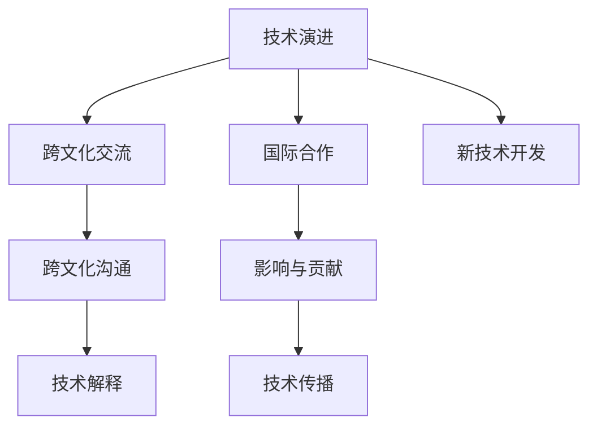

                 

# 技术演讲：从地区到国际舞台

---

## 1. 背景介绍

### 1.1 问题由来
随着技术创新的加速和全球化趋势的深化，技术领域逐渐成为各国竞争与合作的重要战场。对于技术专业人士而言，如何在多元化和复杂化的环境中把握技术演进的脉搏，在全球舞台上展现其技术和思想的独特魅力，是当前的重要课题。

### 1.2 问题核心关键点
本演讲围绕以下几个核心关键点展开，探讨如何将技术知识、工程实践和国际视野结合，展示技术成果并推动技术进步。

- **技术演进**：跟踪前沿技术动态，掌握核心算法和框架。
- **跨文化交流**：在多元文化背景下有效沟通和展示技术成果。
- **国际合作**：建立和维护全球化的技术合作网络。
- **影响与贡献**：在技术领域产生广泛影响和深远贡献。

## 2. 核心概念与联系

### 2.1 核心概念概述

本次演讲将涵盖以下核心概念及其相互关联：

- **技术演进**：指技术领域的持续发展和创新，包括新理论、新算法、新工具等。
- **跨文化交流**：涉及技术在跨文化环境中的传播、理解和应用。
- **国际合作**：指跨国技术团队或组织间的协作与共享，提升全球技术水平。
- **影响与贡献**：指技术专业人士在全球范围内的技术贡献和社会影响。

### 2.2 核心概念原理和架构的 Mermaid 流程图



这个流程图展示了一个完整的技术演进过程，从新理论的诞生，到跨文化交流与国际合作，最终产生广泛影响和深远贡献。各环节相互关联，共同推动技术的前进。

## 3. 核心算法原理 & 具体操作步骤
### 3.1 算法原理概述

技术演进的核心驱动因素之一是算法和框架的进步。算法原理的演进，既需要数学模型的革新，也需要工程实践的优化。

算法演进一般遵循以下流程：

1. **理论推导**：基于已有知识，构建或改进数学模型。
2. **实验验证**：通过大量实验数据，验证模型有效性和泛化能力。
3. **工程优化**：通过算法调优、架构改进等方式提升模型性能。
4. **应用拓展**：将算法应用于实际场景，解决具体问题。

### 3.2 算法步骤详解

以机器学习中的深度学习算法为例，以下为其核心步骤：

1. **数据准备**：收集并预处理训练数据集。
2. **模型构建**：选择或设计适当的神经网络模型。
3. **模型训练**：通过反向传播算法，不断更新模型参数。
4. **模型评估**：使用测试集评估模型性能，选择合适的超参数。
5. **模型优化**：对模型进行调优，提升准确率和泛化能力。
6. **模型应用**：将模型应用于实际问题，进行预测或决策。

### 3.3 算法优缺点

深度学习算法在处理非线性关系和复杂模式方面具有优势，但也面临以下挑战：

- **计算资源需求高**：需要大量计算能力和存储空间。
- **过拟合风险**：模型容易过度拟合训练数据。
- **解释性差**：难以解释模型内部的决策过程。

### 3.4 算法应用领域

深度学习算法广泛应用于计算机视觉、自然语言处理、推荐系统等领域，取得了显著的效果。以下以计算机视觉为例，详细讲解其应用：

1. **图像分类**：将图像分为不同的类别，如识别猫狗、交通标志等。
2. **目标检测**：在图像中定位并识别目标物体，如人脸检测、车辆识别等。
3. **语义分割**：将图像中的每个像素与特定类别关联，如医学影像的细胞分割。
4. **实例分割**：识别图像中每个实例的边界和类别，如无人机识别森林中的树木。

## 4. 数学模型和公式 & 详细讲解 & 举例说明

### 4.1 数学模型构建

以卷积神经网络（CNN）为例，介绍其数学模型的构建。

CNN模型由卷积层、池化层、全连接层组成。设输入图像为$X \in \mathbb{R}^{H \times W \times C}$，输出标签为$Y \in \{1, 2, \dots, K\}$，其中$H$和$W$为图像高宽，$C$为通道数。

模型定义如下：

$$
\begin{align*}
X_{l+1} &= \sigma \left( W_l X_l + b_l \right) \\
Y &= \text{softmax} \left( W_{\text{out}} X_L + b_{\text{out}} \right)
\end{align*}
$$

其中$W_l$为卷积核权重，$b_l$为偏置项，$\sigma$为激活函数，$\text{softmax}$为归一化指数函数。

### 4.2 公式推导过程

以卷积层为例，推导卷积核权重$W_l$的计算过程：

$$
X_{l+1} = \sigma \left( W_l X_l + b_l \right)
$$

其中卷积核$W_l \in \mathbb{R}^{F \times F \times C \times C_k}$，卷积操作定义为：

$$
x_{ij}^{kl} = W_l * X_l \Big|_{(i+p, j+q)} = \sum_{i', j'} W_{ik}^{l,i',j'} x_{i',j'}^{l}
$$

其中$p, q$为卷积核位置偏移量，$C_k$为卷积核输出通道数。

### 4.3 案例分析与讲解

以ImageNet数据集为例，展示CNN模型的应用：

1. **数据预处理**：将图像归一化、标准化。
2. **模型构建**：搭建多个卷积层、池化层和全连接层。
3. **模型训练**：使用随机梯度下降算法，不断更新权重和偏置。
4. **模型评估**：使用测试集评估模型精度和泛化能力。
5. **模型优化**：调整超参数，提升模型性能。
6. **模型应用**：将模型应用于实际图像分类任务。

## 5. 项目实践：代码实例和详细解释说明

### 5.1 开发环境搭建

以下是在Python环境下使用TensorFlow搭建CNN模型的步骤：

1. **安装TensorFlow**：
```bash
pip install tensorflow
```

2. **准备数据**：
```python
import tensorflow as tf
from tensorflow.keras.datasets import cifar10

(train_images, train_labels), (test_images, test_labels) = cifar10.load_data()
```

3. **模型构建**：
```python
model = tf.keras.Sequential([
    tf.keras.layers.Conv2D(32, (3, 3), activation='relu', input_shape=(32, 32, 3)),
    tf.keras.layers.MaxPooling2D((2, 2)),
    tf.keras.layers.Conv2D(64, (3, 3), activation='relu'),
    tf.keras.layers.MaxPooling2D((2, 2)),
    tf.keras.layers.Conv2D(64, (3, 3), activation='relu'),
    tf.keras.layers.Flatten(),
    tf.keras.layers.Dense(64, activation='relu'),
    tf.keras.layers.Dense(10)
])
```

### 5.2 源代码详细实现

以下是训练模型的代码：

```python
model.compile(optimizer='adam',
              loss=tf.keras.losses.SparseCategoricalCrossentropy(from_logits=True),
              metrics=['accuracy'])

model.fit(train_images, train_labels, epochs=10, 
          validation_data=(test_images, test_labels))
```

### 5.3 代码解读与分析

**模型构建**：使用Sequential模型堆叠多个层。Conv2D层实现卷积操作，MaxPooling2D层进行池化操作，Flatten层将多维特征展开为向量，Dense层进行全连接操作。

**模型训练**：使用Adam优化器，SparseCategoricalCrossentropy损失函数，训练10个epoch，评估测试集上的准确率。

**模型评估**：使用测试集评估模型精度和泛化能力。

## 6. 实际应用场景

### 6.1 计算机视觉

计算机视觉在医学影像分析、自动驾驶、智能监控等领域具有广泛应用。以下以医学影像分析为例：

1. **图像预处理**：对医学影像进行预处理，如去噪、增强对比度。
2. **模型训练**：使用CNN模型训练图像分类器，识别肿瘤、细胞等。
3. **模型评估**：使用测试集评估模型精度和泛化能力。
4. **模型应用**：将模型应用于实际医学影像分析任务。

### 6.2 自然语言处理

自然语言处理在机器翻译、情感分析、问答系统等领域具有重要应用。以下以机器翻译为例：

1. **数据准备**：收集并预处理双语对照语料库。
2. **模型构建**：搭建序列到序列模型，如Transformer模型。
3. **模型训练**：使用反向传播算法，不断更新模型参数。
4. **模型评估**：使用BLEU、ROUGE等指标评估模型性能。
5. **模型应用**：将模型应用于实际机器翻译任务。

### 6.3 推荐系统

推荐系统在电商、社交网络、新闻推荐等领域具有广泛应用。以下以电商推荐为例：

1. **数据准备**：收集用户行为数据、商品信息等。
2. **模型构建**：搭建深度学习模型，如协同过滤、基于矩阵分解的推荐模型。
3. **模型训练**：使用梯度下降算法，不断更新模型参数。
4. **模型评估**：使用离线评估指标如NDCG、MRR等，评估模型性能。
5. **模型应用**：将模型应用于实际电商推荐任务。

## 7. 工具和资源推荐

### 7.1 学习资源推荐

以下推荐一些优质的学习资源，帮助理解技术演进和应用：

1. **Coursera**：提供大量技术相关课程，涵盖深度学习、计算机视觉、自然语言处理等领域。
2. **edX**：提供由世界顶尖大学和机构开设的课程，包括计算机科学和人工智能。
3. **Kaggle**：提供大量数据集和竞赛，实践机器学习和数据科学技能。
4. **GitHub**：提供大量开源项目和代码，了解前沿技术实践。
5. **Stack Overflow**：提供技术问答平台，解决编程和算法问题。

### 7.2 开发工具推荐

以下是一些常用的开发工具，提升技术实现和应用效率：

1. **PyCharm**：强大的Python开发环境，提供代码高亮、调试、版本控制等功能。
2. **Jupyter Notebook**：交互式开发环境，支持Python、R等语言。
3. **Anaconda**：Python数据科学平台，提供科学计算、数据分析工具。
4. **TensorBoard**：可视化工具，实时监测模型训练状态，提供详细图表。
5. **Weights & Biases**：模型训练实验跟踪工具，记录和可视化实验结果。

### 7.3 相关论文推荐

以下推荐一些前沿研究论文，了解技术进展和研究趋势：

1. **ImageNet Large Scale Visual Recognition Challenge（ILSVRC）**：图像分类任务，推动计算机视觉技术发展。
2. **BERT: Pre-training of Deep Bidirectional Transformers for Language Understanding**：提出BERT模型，推动自然语言处理技术发展。
3. **Google AI Blog**：Google AI博客，发布最新技术和研究成果。
4. **IEEE Transactions on Neural Networks and Learning Systems**：国际权威期刊，发表深度学习和人工智能最新研究成果。
5. **KDD**：国际顶级数据科学会议，涵盖数据挖掘、机器学习、人工智能等领域。

## 8. 总结：未来发展趋势与挑战

### 8.1 研究成果总结

本次演讲主要介绍了技术演进、跨文化交流、国际合作和影响与贡献。通过理解技术演进的底层原理和操作步骤，掌握跨文化交流的技巧，建立国际合作的桥梁，展现技术贡献和影响，可以有效推动技术进步和应用落地。

### 8.2 未来发展趋势

未来技术演进将呈现以下几个趋势：

1. **人工智能普及**：AI技术将深入到各行各业，推动智能化发展。
2. **多模态融合**：结合视觉、语音、文本等多模态数据，提升技术效果。
3. **自适应学习**：开发自适应学习算法，提升模型适应新数据和场景的能力。
4. **模型压缩和优化**：优化模型结构，减少计算资源消耗，提升推理效率。
5. **伦理与安全**：提升AI模型的可解释性，确保模型安全性和合规性。

### 8.3 面临的挑战

当前技术演进面临以下挑战：

1. **计算资源不足**：需要大量计算能力和存储空间，传统硬件难以支持。
2. **数据隐私问题**：涉及数据隐私保护和合规性问题，亟需解决。
3. **技术标准统一**：不同国家和组织的技术标准和规范存在差异，难以统一。
4. **伦理与安全**：AI模型的可解释性和安全性问题，需要进一步解决。
5. **国际合作与竞争**：国际合作与竞争并存，需要平衡好两者的关系。

### 8.4 研究展望

未来需要在以下方面进行探索和研究：

1. **计算资源优化**：开发更高效的计算模型，提升计算效率。
2. **数据隐私保护**：开发隐私保护技术，确保数据安全和隐私。
3. **技术标准统一**：推动技术标准的统一，提升技术应用的一致性和互操作性。
4. **伦理与安全研究**：加强对AI模型的伦理与安全研究，确保模型的可解释性和安全性。
5. **国际合作**：加强国际合作，推动技术交流和资源共享，提升全球技术水平。

## 9. 附录：常见问题与解答

**Q1: 什么是技术演进？**

A: 技术演进是指技术领域的持续发展和创新，包括新理论、新算法、新工具等。例如，深度学习技术的进步、计算机视觉算法的发展等。

**Q2: 如何实现跨文化交流？**

A: 跨文化交流需要掌握多种语言，了解不同文化的背景和习惯。可以通过国际会议、学术交流、论文发表等方式进行。

**Q3: 如何建立国际合作？**

A: 国际合作需要建立全球化的技术网络，参与国际科研项目和会议，与国际同行保持密切联系。可以通过开放数据集、开源项目等方式促进合作。

**Q4: 如何展现技术贡献？**

A: 可以通过发表学术论文、参加国际会议、开源项目等方式展示技术成果。同时，可以通过技术博客、社交媒体等平台进行交流和传播。

---

作者：禅与计算机程序设计艺术 / Zen and the Art of Computer Programming

