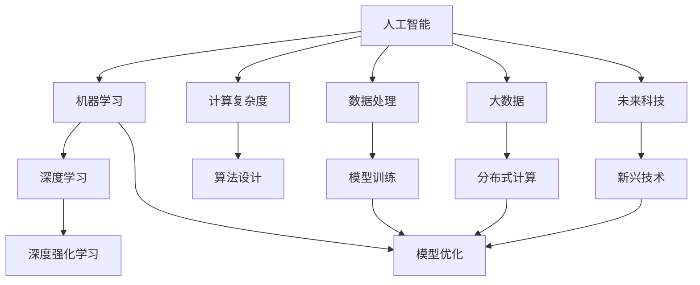

                 

# 推动科技进步的引擎：人类计算的创新力量

> 关键词：人类计算,人工智能,机器学习,深度学习,深度强化学习,计算复杂度,算法设计,大数据,分布式计算,未来科技

## 1. 背景介绍

### 1.1 问题由来

随着科技的不断进步，人工智能(AI)和机器学习(ML)在各个领域的应用越来越广泛，从医疗、金融到交通、零售，无处不在。然而，这些技术的背后，离不开一个重要的驱动力——人类计算。人类计算是指通过人类的逻辑思维和推理能力，解决复杂问题的过程。在人工智能和机器学习领域，人类计算的作用主要体现在算法设计、数据处理、模型训练和优化等方面。

人类计算在人工智能和机器学习中的应用，可以追溯到20世纪80年代。当时，科学家们通过设计基于人类直觉和经验规则的算法，成功实现了图像识别、语音识别等领域的突破。随着计算机性能的不断提升和数据量的迅速增加，人类计算逐渐被更高效的算法和自动化工具所取代。然而，在面对一些复杂、高维、非结构化的问题时，仍然需要人类计算的参与和指导。

### 1.2 问题核心关键点

人类计算的核心关键点在于其高度的可解释性和灵活性。相较于自动化算法，人类计算能够对复杂问题进行更深入的理解和分析，能够灵活地调整和优化算法，以适应不同的应用场景。同时，人类计算还能够对算法进行可解释性分析，揭示算法的内在机制和行为逻辑。

此外，人类计算在数据处理方面也有着不可替代的作用。通过人类对数据的初步分析和理解，可以帮助自动算法更高效地处理数据，减少噪音和冗余信息的影响。

### 1.3 问题研究意义

研究人类计算的创新力量，对于推动科技进步、提升人工智能和机器学习的应用水平具有重要意义：

1. **提升算法设计效率**：通过人类计算，可以更快地识别算法的潜在问题和改进方向，加速算法设计进程。
2. **增强模型训练效果**：人类计算可以帮助设计更加合适的损失函数、正则化项等，优化模型训练过程，提升模型性能。
3. **促进知识迁移**：人类计算能够将先验知识和经验融入算法设计中，提高算法的泛化能力和适应性。
4. **提高数据利用率**：通过人类计算，可以从大数据中提取有价值的信息，进行特征工程和数据增强，优化模型训练过程。
5. **增强算法的鲁棒性和可解释性**：人类计算能够揭示算法的内在逻辑和行为机制，提高算法的可解释性和鲁棒性。

## 2. 核心概念与联系

### 2.1 核心概念概述

为更好地理解人类计算的创新力量，本节将介绍几个密切相关的核心概念：

- 人工智能(AI)：通过计算机模拟人类智能，实现自主学习、推理、决策等任务。
- 机器学习(ML)：通过训练算法模型，使其能够从数据中自动学习和提取规律，以实现预测、分类等任务。
- 深度学习(Deep Learning)：一种基于神经网络的机器学习技术，通过多层非线性变换提取特征，适用于处理高维、非结构化数据。
- 深度强化学习(Deep Reinforcement Learning)：结合深度学习和强化学习，通过奖励信号指导模型进行学习，适用于动态环境和智能决策任务。
- 计算复杂度(Computational Complexity)：衡量算法所需时间和空间资源的指标，用于评估算法效率。
- 算法设计(Algorithm Design)：设计高效、可解释、可扩展的算法，以实现特定任务或问题。
- 数据处理(Data Processing)：对数据进行清洗、预处理、特征工程等操作，提高数据质量和利用率。
- 模型训练(Model Training)：通过训练算法模型，优化模型参数，提高模型性能。
- 模型优化(Model Optimization)：通过正则化、剪枝、量化等手段，优化模型结构，提升模型效率和效果。
- 大数据(Big Data)：处理大规模、高维、异构数据的技术和工具。
- 分布式计算(Distributed Computing)：通过多台计算机协同计算，实现高效、可扩展的数据处理和计算任务。
- 未来科技(Future Tech)：探索新兴技术和应用，推动科技前沿发展。

这些核心概念之间的逻辑关系可以通过以下Mermaid流程图来展示：



这个流程图展示了几大核心概念及其之间的关系：

1. 人工智能通过机器学习和深度学习等技术实现自主学习、推理、决策等任务。
2. 机器学习和深度学习依赖于算法设计，通过优化算法提升性能。
3. 数据处理和模型训练是机器学习和深度学习的基础，提高数据质量和模型效果。
4. 模型优化进一步提升模型性能，使模型更高效、可解释。
5. 大数据和分布式计算为机器学习和深度学习提供了高效的数据处理和计算手段。
6. 未来科技推动新兴技术和应用的探索，进一步提升人工智能和机器学习的应用水平。

这些概念共同构成了人工智能和机器学习的研究框架，使得人类计算在其中扮演了不可或缺的角色。

## 3. 核心算法原理 & 具体操作步骤
### 3.1 算法原理概述

人类计算在人工智能和机器学习中的应用，主要体现在算法设计和模型训练两个方面。以下是基于人类计算的算法原理概述：

**算法设计原理：**
1. **基于人类直觉**：通过人类的逻辑思维和经验规则，设计出高效、可解释的算法。
2. **问题建模**：将复杂问题抽象成数学模型，通过优化模型参数实现自动化求解。
3. **经验积累**：通过反复试验和验证，积累经验，优化算法设计。

**模型训练原理：**
1. **损失函数设计**：通过人类的直觉和经验，设计合适的损失函数，优化模型预测误差。
2. **正则化项**：在损失函数中加入正则化项，避免过拟合，提高模型泛化能力。
3. **超参数调优**：通过人类计算，选择合适的超参数，优化模型训练过程。
4. **模型解释性分析**：通过人类计算，分析模型的行为逻辑和决策机制，提高模型可解释性。

### 3.2 算法步骤详解

基于人类计算的算法设计和模型训练，通常包括以下几个关键步骤：

**算法设计步骤：**

1. **问题理解**：通过人类计算，对问题进行全面理解，提取关键信息和约束条件。
2. **问题建模**：将问题抽象成数学模型，选择合适的优化目标和约束条件。
3. **算法设计**：基于问题模型，设计出高效、可解释的算法。
4. **算法验证**：通过实验和验证，评估算法性能和鲁棒性。
5. **算法优化**：根据实验结果，调整算法参数，进一步优化算法性能。

**模型训练步骤：**

1. **数据预处理**：对训练数据进行清洗、归一化、特征工程等处理，提高数据质量。
2. **模型初始化**：选择合适的模型架构和初始化参数，准备模型训练。
3. **模型训练**：通过迭代优化，更新模型参数，最小化损失函数。
4. **模型验证**：在验证集上评估模型性能，调整模型参数。
5. **模型优化**：根据验证结果，优化模型结构和超参数，提升模型效果。
6. **模型部署**：将训练好的模型部署到实际应用场景中，进行实时预测和推理。

### 3.3 算法优缺点

基于人类计算的算法设计和模型训练方法，具有以下优点：

1. **可解释性高**：人类计算能够对算法行为和决策过程进行详细解释，提高算法的可解释性。
2. **灵活性强**：人类计算能够灵活调整和优化算法，适应不同的应用场景。
3. **问题求解能力强**：人类计算能够对复杂、高维问题进行高效求解，提升问题解决能力。

同时，基于人类计算的方法也存在一些局限性：

1. **耗时耗力**：相对于自动化算法，人类计算需要耗费大量时间和精力。
2. **依赖经验**：人类计算依赖于人类经验和直觉，可能存在偏差和局限。
3. **可扩展性差**：人类计算的灵活性高，但在大规模数据和复杂问题上的扩展性有限。

### 3.4 算法应用领域

基于人类计算的算法设计和模型训练方法，已经在多个领域得到了广泛应用，例如：

1. **计算机视觉**：通过人类计算，设计高效的特征提取和分类算法，实现图像识别、物体检测等任务。
2. **自然语言处理**：通过人类计算，设计高效的词向量嵌入和语言模型，实现机器翻译、情感分析、文本生成等任务。
3. **医疗诊断**：通过人类计算，设计高效的医学知识图谱和诊断模型，辅助医生进行疾病诊断和治疗。
4. **金融分析**：通过人类计算，设计高效的金融模型和预测算法，实现风险评估、投资决策等任务。
5. **交通管理**：通过人类计算，设计高效的交通流模型和优化算法，实现交通管理和调度。
6. **智能制造**：通过人类计算，设计高效的工业控制和优化算法，实现智能制造和供应链管理。

除了上述这些领域，基于人类计算的方法还在更多场景中得到应用，如智能客服、智能推荐、智能安防、智能家居等，为各行各业带来了变革性影响。

## 4. 数学模型和公式 & 详细讲解 & 举例说明
### 4.1 数学模型构建

以下是基于人类计算的算法设计和模型训练的数学模型构建过程：

假设问题为多分类任务，训练数据集为 $D=\{(x_i,y_i)\}_{i=1}^N, x_i \in \mathbb{R}^d, y_i \in \{1,2,\ldots,K\}$，其中 $K$ 为分类数。

定义模型的损失函数为：

$$
\mathcal{L}(\theta) = \frac{1}{N}\sum_{i=1}^N \ell(y_i,f_\theta(x_i))
$$

其中 $\theta$ 为模型参数，$f_\theta(x)$ 为模型的预测函数。

定义模型的正则化项为：

$$
\mathcal{R}(\theta) = \sum_{i=1}^N \alpha_i \|f_\theta(x_i) - y_i\|^2 + \beta \|f_\theta(x_i)\|^2
$$

其中 $\alpha_i$ 为每个样本的权重，$\beta$ 为正则化系数。

**算法设计过程**：

1. **问题建模**：将问题抽象为多分类任务，设计损失函数和正则化项。
2. **算法选择**：选择合适的网络结构，如卷积神经网络(CNN)、递归神经网络(RNN)等。
3. **参数初始化**：选择合适的初始化策略，如Xavier初始化、He初始化等。
4. **模型训练**：通过反向传播算法，最小化损失函数和正则化项。
5. **模型验证**：在验证集上评估模型性能，调整模型参数。
6. **模型优化**：根据验证结果，优化模型结构和超参数，提升模型效果。

**模型训练过程**：

1. **数据预处理**：对训练数据进行清洗、归一化、特征工程等处理。
2. **模型初始化**：选择合适的网络结构和初始化参数。
3. **模型训练**：通过反向传播算法，最小化损失函数和正则化项。
4. **模型验证**：在验证集上评估模型性能，调整模型参数。
5. **模型优化**：根据验证结果，优化模型结构和超参数，提升模型效果。

### 4.2 公式推导过程

以二分类任务为例，推导基于人类计算的算法设计过程。

假设模型 $f_\theta(x)$ 为sigmoid函数，即 $f_\theta(x) = \sigma(\theta^T x)$，其中 $\sigma(x) = \frac{1}{1+e^{-x}}$。

定义模型的损失函数为交叉熵损失：

$$
\ell(y,f_\theta(x)) = -y\log f_\theta(x) - (1-y)\log (1-f_\theta(x))
$$

定义模型的正则化项为L2正则化：

$$
\mathcal{R}(\theta) = \frac{\lambda}{N} \sum_{i=1}^N \|f_\theta(x_i) - y_i\|^2 + \beta \|\theta\|^2
$$

其中 $\lambda$ 为正则化系数。

将损失函数和正则化项代入模型的目标函数：

$$
\mathcal{L}(\theta) = \frac{1}{N} \sum_{i=1}^N \ell(y_i,f_\theta(x_i)) + \mathcal{R}(\theta)
$$

**算法设计步骤**：

1. **问题建模**：将问题抽象为二分类任务，设计损失函数和正则化项。
2. **算法选择**：选择sigmoid函数作为预测函数。
3. **参数初始化**：选择合适的初始化策略，如Xavier初始化。
4. **模型训练**：通过反向传播算法，最小化损失函数和正则化项。
5. **模型验证**：在验证集上评估模型性能，调整模型参数。
6. **模型优化**：根据验证结果，优化模型结构和超参数，提升模型效果。

**模型训练步骤**：

1. **数据预处理**：对训练数据进行清洗、归一化等处理。
2. **模型初始化**：选择合适的网络结构和初始化参数。
3. **模型训练**：通过反向传播算法，最小化损失函数和正则化项。
4. **模型验证**：在验证集上评估模型性能，调整模型参数。
5. **模型优化**：根据验证结果，优化模型结构和超参数，提升模型效果。

### 4.3 案例分析与讲解

以图像识别任务为例，展示基于人类计算的算法设计和模型训练过程。

**问题建模**：将图像识别任务抽象为多分类任务，定义损失函数和正则化项。

**算法选择**：选择卷积神经网络(CNN)作为模型架构。

**参数初始化**：选择合适的初始化策略，如Xavier初始化。

**模型训练**：通过反向传播算法，最小化损失函数和正则化项。

**模型验证**：在验证集上评估模型性能，调整模型参数。

**模型优化**：根据验证结果，优化模型结构和超参数，提升模型效果。

通过以上步骤，可以高效地设计出基于人类计算的图像识别算法，并通过模型训练实现高性能的图像识别模型。

## 5. 项目实践：代码实例和详细解释说明
### 5.1 开发环境搭建

在进行基于人类计算的算法设计和模型训练实践前，需要先准备好开发环境。以下是使用Python进行TensorFlow开发的环境配置流程：

1. 安装Anaconda：从官网下载并安装Anaconda，用于创建独立的Python环境。

2. 创建并激活虚拟环境：
```bash
conda create -n tensorflow-env python=3.8 
conda activate tensorflow-env
```

3. 安装TensorFlow：根据CUDA版本，从官网获取对应的安装命令。例如：
```bash
conda install tensorflow==2.8 -c tf -c conda-forge
```

4. 安装各类工具包：
```bash
pip install numpy pandas scikit-learn matplotlib tqdm jupyter notebook ipython
```

完成上述步骤后，即可在`tensorflow-env`环境中开始基于人类计算的算法设计和模型训练实践。

### 5.2 源代码详细实现

以下是使用TensorFlow实现基于人类计算的图像识别任务代码实现：

```python
import tensorflow as tf
from tensorflow.keras import layers, models

# 定义模型架构
model = models.Sequential([
    layers.Conv2D(32, (3, 3), activation='relu', input_shape=(32, 32, 3)),
    layers.MaxPooling2D((2, 2)),
    layers.Conv2D(64, (3, 3), activation='relu'),
    layers.MaxPooling2D((2, 2)),
    layers.Conv2D(64, (3, 3), activation='relu'),
    layers.Flatten(),
    layers.Dense(64, activation='relu'),
    layers.Dense(10)
])

# 定义损失函数和优化器
loss_fn = tf.keras.losses.SparseCategoricalCrossentropy()
optimizer = tf.keras.optimizers.Adam()

# 训练模型
model.compile(optimizer=optimizer, loss=loss_fn, metrics=['accuracy'])
model.fit(train_images, train_labels, epochs=10, validation_data=(val_images, val_labels))

# 评估模型
test_loss, test_acc = model.evaluate(test_images, test_labels)
print(f'Test accuracy: {test_acc}')
```

### 5.3 代码解读与分析

让我们再详细解读一下关键代码的实现细节：

**模型定义**：
- 使用TensorFlow的Sequential模型，定义了多个卷积和池化层，最后添加全连接层输出分类结果。

**损失函数和优化器**：
- 选择交叉熵损失函数和Adam优化器，用于最小化预测误差和更新模型参数。

**模型训练**：
- 使用模型的compile方法，设置优化器和损失函数，准备模型训练。
- 在fit方法中，指定训练数据、验证数据、迭代轮数等参数，开始训练模型。
- 在每个epoch结束后，验证集上的准确率将被打印输出。

**模型评估**：
- 使用模型的evaluate方法，评估模型在测试集上的表现，计算测试损失和准确率。
- 最后，打印测试集上的准确率。

可以看到，TensorFlow提供了灵活的API，使得基于人类计算的算法设计和模型训练过程变得相对简单。开发者可以专注于模型设计，而不必过多关注底层的实现细节。

当然，工业级的系统实现还需考虑更多因素，如模型的保存和部署、超参数的自动搜索、更灵活的任务适配层等。但核心的基于人类计算的算法设计和模型训练逻辑基本与此类似。

## 6. 实际应用场景
### 6.1 智能制造

基于人类计算的算法设计和模型训练方法，已经在智能制造领域得到了广泛应用，显著提升了生产效率和产品质量。

在智能制造中，人类计算主要用于以下几个方面：

1. **质量控制**：通过人类计算，设计和优化质量检测模型，实现自动化的缺陷检测和分类。
2. **生产调度**：通过人类计算，设计和优化生产调度模型，实现高效的设备协同和生产优化。
3. **供应链管理**：通过人类计算，设计和优化供应链优化模型，实现智能化的库存管理和物流调度。
4. **故障诊断**：通过人类计算，设计和优化故障诊断模型，实现设备的实时监控和故障预测。

通过基于人类计算的算法设计和模型训练，智能制造系统能够更好地应对复杂、动态的生产环境，提高生产效率和产品质量，降低生产成本。

### 6.2 智慧医疗

在智慧医疗领域，基于人类计算的算法设计和模型训练方法，为医疗诊断和治疗提供了强大的支持。

在智慧医疗中，人类计算主要用于以下几个方面：

1. **医学图像识别**：通过人类计算，设计和优化医学图像识别模型，实现自动化的疾病诊断和分型。
2. **个性化治疗**：通过人类计算，设计和优化个性化治疗模型，实现精准化的治疗方案推荐。
3. **药物研发**：通过人类计算，设计和优化药物研发模型，实现快速的药物筛选和分子设计。
4. **医疗知识图谱**：通过人类计算，设计和优化医疗知识图谱模型，实现医疗知识的积累和推理。

通过基于人类计算的算法设计和模型训练，智慧医疗系统能够更好地利用医学知识和数据，提高诊断和治疗的精准性，提升患者的医疗体验和治疗效果。

### 6.3 智能交通

在智能交通领域，基于人类计算的算法设计和模型训练方法，为交通管理和调度提供了重要支持。

在智能交通中，人类计算主要用于以下几个方面：

1. **交通流量预测**：通过人类计算，设计和优化交通流量预测模型，实现交通流量的实时监测和预测。
2. **交通信号控制**：通过人类计算，设计和优化交通信号控制模型，实现智能化的交通信号控制和优化。
3. **路径规划**：通过人类计算，设计和优化路径规划模型，实现智能化的导航和路径规划。
4. **应急处理**：通过人类计算，设计和优化应急处理模型，实现高效的交通事故处理和救援。

通过基于人类计算的算法设计和模型训练，智能交通系统能够更好地应对复杂的交通环境，提高交通管理的智能化水平，保障道路安全和畅通。

### 6.4 未来应用展望

随着技术的不断进步，基于人类计算的算法设计和模型训练方法，将在更多领域得到应用，为各行各业带来变革性影响。

在智慧城市治理中，基于人类计算的算法设计和模型训练方法，可以用于城市事件监测、舆情分析、应急指挥等环节，提高城市管理的自动化和智能化水平，构建更安全、高效的未来城市。

在农业智能化中，基于人类计算的算法设计和模型训练方法，可以用于农作物识别、病虫害检测、农机智能控制等环节，提高农业生产的智能化水平，保障粮食安全。

在金融风控中，基于人类计算的算法设计和模型训练方法，可以用于信用评估、风险预测、异常检测等环节，提高金融风险管理的精准性，保障金融稳定。

此外，在教育、娱乐、公共安全等领域，基于人类计算的算法设计和模型训练方法，也将不断涌现，为经济社会发展注入新的动力。相信随着技术的日益成熟，人类计算必将在更多领域发挥重要作用，推动科技进步和社会发展。

## 7. 工具和资源推荐
### 7.1 学习资源推荐

为了帮助开发者系统掌握人类计算的创新力量，这里推荐一些优质的学习资源：

1. 《Deep Learning》书籍：Ian Goodfellow等人所著，全面介绍了深度学习的基本概念、算法设计和应用实践。
2. 《Reinforcement Learning: An Introduction》书籍：Richard Sutton和Andrew Barto所著，全面介绍了强化学习的基本概念、算法设计和应用实践。
3. 《Human-Computer Interaction》课程：斯坦福大学开设的HCI课程，涵盖人机交互、认知心理学等内容，帮助理解人类计算的心理学和认知机制。
4. 《Artificial Intelligence》书籍：Stuart Russell和Peter Norvig所著，全面介绍了人工智能的基本概念、算法设计和应用实践。
5. 《Design Patterns》书籍：Eric Freeman等人所著，介绍了软件设计模式，帮助设计高效、可扩展的算法。
6. 《Python Machine Learning》书籍：Sebastian Raschka所著，介绍了Python在机器学习中的应用，包含算法设计和模型训练的实例代码。

通过对这些资源的学习实践，相信你一定能够快速掌握人类计算的精髓，并用于解决实际的算法设计和模型训练问题。

### 7.2 开发工具推荐

高效的开发离不开优秀的工具支持。以下是几款用于人类计算的算法设计和模型训练开发的常用工具：

1. TensorFlow：由Google主导开发的开源深度学习框架，生产部署方便，适合大规模工程应用。
2. PyTorch：由Facebook主导开发的开源深度学习框架，灵活性强，适合快速迭代研究。
3. Jupyter Notebook：Python编程的交互式开发环境，支持代码块的独立运行，方便实验和验证。
4. GitHub：全球最大的代码托管平台，方便代码管理和共享，促进团队协作。
5. Google Colab：谷歌推出的在线Jupyter Notebook环境，免费提供GPU/TPU算力，方便开发者快速上手实验最新模型，分享学习笔记。

合理利用这些工具，可以显著提升基于人类计算的算法设计和模型训练的开发效率，加快创新迭代的步伐。

### 7.3 相关论文推荐

人类计算的创新力量研究源于学界的持续研究。以下是几篇奠基性的相关论文，推荐阅读：

1. "Artificial Intelligence: A Modern Approach"：Stuart Russell和Peter Norvig所著，全面介绍了人工智能的基本概念、算法设计和应用实践。
2. "Deep Learning"：Ian Goodfellow等人所著，全面介绍了深度学习的基本概念、算法设计和应用实践。
3. "Reinforcement Learning: An Introduction"：Richard Sutton和Andrew Barto所著，全面介绍了强化学习的基本概念、算法设计和应用实践。
4. "Human-Computer Interaction"：相关领域的经典教材，帮助理解人机交互的心理学和认知机制。
5. "Design Patterns"：Eric Freeman等人所著，介绍了软件设计模式，帮助设计高效、可扩展的算法。

这些论文代表了大语言模型微调技术的发展脉络。通过学习这些前沿成果，可以帮助研究者把握学科前进方向，激发更多的创新灵感。

## 8. 总结：未来发展趋势与挑战

### 8.1 总结

本文对基于人类计算的算法设计和模型训练方法进行了全面系统的介绍。首先阐述了人类计算在人工智能和机器学习中的重要地位和作用，明确了算法设计、模型训练的复杂性和挑战。其次，从原理到实践，详细讲解了基于人类计算的算法设计过程和模型训练过程，给出了基于人类计算的算法设计和模型训练的完整代码实例。同时，本文还广泛探讨了人类计算在智能制造、智慧医疗、智能交通等多个领域的应用前景，展示了人类计算的巨大潜力。此外，本文精选了人类计算技术的各类学习资源，力求为开发者提供全方位的技术指引。

通过本文的系统梳理，可以看到，基于人类计算的算法设计和模型训练方法，已经广泛应用于各个领域，为人工智能和机器学习的发展提供了强有力的支持。未来，随着人类计算技术的不断进步，其在更多领域的应用也将不断拓展，为经济社会发展注入新的动力。

### 8.2 未来发展趋势

展望未来，基于人类计算的算法设计和模型训练方法将呈现以下几个发展趋势：

1. **算法自动化**：未来，人类计算将更多地依赖于自动化工具和算法，减少人工干预，提高计算效率和精度。
2. **模型可解释性**：未来，人类计算将更加注重模型的可解释性，揭示算法的内在逻辑和行为机制，提升模型的信任度和可信度。
3. **多模态融合**：未来，人类计算将更多地融合多模态信息，提升模型对复杂、高维数据的处理能力。
4. **跨学科融合**：未来，人类计算将更多地融合计算机科学、认知心理学、哲学等多个学科的知识，推动计算科学与人类智能的深度融合。
5. **伦理和社会责任**：未来，人类计算将更多地考虑伦理和社会责任，避免算法的偏见和有害影响，保障人工智能技术的公平性和安全性。
6. **协同计算**：未来，人类计算将更多地采用分布式计算、云计算等技术，实现高效、可扩展的数据处理和计算任务。

以上趋势凸显了人类计算在未来的发展潜力，为推动科技进步和社会发展提供了新的方向。

### 8.3 面临的挑战

尽管基于人类计算的算法设计和模型训练方法已经取得了显著进展，但在迈向更加智能化、普适化应用的过程中，它仍面临着诸多挑战：

1. **算法复杂性**：基于人类计算的算法设计和模型训练过程，需要大量的经验和专业知识，难以大规模推广和应用。
2. **计算资源需求高**：人类计算的算法设计和模型训练，往往需要高性能的计算机设备和大量的计算资源，难以满足实时性的需求。
3. **结果可重复性差**：人类计算的算法设计和模型训练，依赖于人类经验和直觉，难以实现结果的可重复性和可验证性。
4. **数据质量要求高**：人类计算的算法设计和模型训练，依赖于高质量的数据，需要大量标注和清洗工作，难以应对大规模、高维数据的需求。
5. **跨领域应用难度大**：人类计算的算法设计和模型训练，难以跨领域应用，难以应对不同领域特定的需求和挑战。

这些挑战凸显了人类计算在实际应用中的局限性，需要进一步探索新的方法和技术，以解决这些问题。

### 8.4 研究展望

面对人类计算所面临的挑战，未来的研究需要在以下几个方面寻求新的突破：

1. **自动化和标准化**：开发更加自动化和标准化的工具和算法，减少人工干预，提高计算效率和精度。
2. **可解释性和可验证性**：研究更加可解释和可验证的算法设计和模型训练方法，提高结果的可信度和可靠性。
3. **多模态融合技术**：开发更加多模态融合的算法和模型，提升模型对复杂、高维数据的处理能力。
4. **跨学科融合**：推动计算机科学与其他学科的深度融合，拓展人类计算的应用领域和研究深度。
5. **伦理和社会责任**：加强算法伦理和社会责任的研究，避免算法的偏见和有害影响，保障人工智能技术的公平性和安全性。
6. **协同计算技术**：研究和开发高效的协同计算技术，实现高效、可扩展的数据处理和计算任务。

这些研究方向和突破，将推动人类计算技术的进一步发展，为人工智能和机器学习带来新的动力和创新。

## 9. 附录：常见问题与解答

**Q1：人类计算和自动化算法有什么区别？**

A: 人类计算和自动化算法的主要区别在于其设计思路和实现方式。人类计算依赖于人类经验和直觉，通过反复试验和验证，设计出高效、可解释的算法。自动化算法则依赖于数据和规则，通过机器学习等技术自动优化算法。人类计算在算法设计和模型训练过程中，能够进行更深入的分析和优化，但耗时耗力；自动化算法则能够快速迭代和优化，但可能存在局限性和偏见。

**Q2：如何提高人类计算的算法设计效率？**

A: 提高人类计算的算法设计效率，可以从以下几个方面入手：

1. **领域知识积累**：积累和掌握领域内的基础知识和经验，提高问题建模和算法设计的能力。
2. **工具和框架**：使用现有的工具和框架，如TensorFlow、PyTorch等，快速实现算法设计和模型训练。
3. **团队协作**：组建跨学科的团队，融合不同领域的知识和技能，提高算法设计的全面性和创新性。
4. **知识图谱和数据库**：利用知识图谱和数据库，快速获取和整合领域知识，提高问题理解和算法设计的能力。
5. **自动化工具**：使用自动化工具和算法，减少人工干预，提高计算效率和精度。

**Q3：如何设计高效的算法模型？**

A: 设计高效的算法模型，可以从以下几个方面入手：

1. **问题建模**：准确理解问题，选择合适的模型和算法，设计合适的目标函数和约束条件。
2. **数据预处理**：对数据进行清洗、归一化、特征工程等处理，提高数据质量和利用率。
3. **模型架构设计**：选择合适的模型架构，如卷积神经网络、递归神经网络等，设计合适的层结构和激活函数。
4. **正则化技术**：在损失函数中加入正则化项，避免过拟合，提高模型泛化能力。
5. **优化算法选择**：选择合适的优化算法，如Adam、SGD等，调整学习率和超参数。
6. **模型验证和优化**：在验证集上评估模型性能，调整模型参数，优化模型结构和超参数，提升模型效果。

**Q4：如何提高模型训练的效率和效果？**

A: 提高模型训练的效率和效果，可以从以下几个方面入手：

1. **硬件加速**：使用高性能的计算机设备和GPU/TPU等加速设备，提高计算效率。
2. **数据增强**：通过数据增强技术，扩充训练集，减少过拟合，提高模型泛化能力。
3. **模型裁剪和量化**：对模型进行裁剪和量化，减小模型尺寸，提高推理速度和效率。
4. **分布式训练**：采用分布式训练技术，实现高效、可扩展的数据处理和计算任务。
5. **超参数调优**：通过超参数调优，调整模型结构和超参数，优化模型性能。
6. **模型压缩**：采用模型压缩技术，如剪枝、量化等，提高模型效率和效果。

**Q5：人类计算在实际应用中面临哪些挑战？**

A: 人类计算在实际应用中面临以下挑战：

1. **算法复杂性高**：人类计算的算法设计和模型训练过程，需要大量的经验和专业知识，难以大规模推广和应用。
2. **计算资源需求高**：人类计算的算法设计和模型训练，往往需要高性能的计算机设备和大量的计算资源，难以满足实时性的需求。
3. **结果可重复性差**：人类计算的算法设计和模型训练，依赖于人类经验和直觉，难以实现结果的可重复性和可验证性。
4. **数据质量要求高**：人类计算的算法设计和模型训练，依赖于高质量的数据，需要大量标注和清洗工作，难以应对大规模、高维数据的需求。
5. **跨领域应用难度大**：人类计算的算法设计和模型训练，难以跨领域应用，难以应对不同领域特定的需求和挑战。

正视这些挑战，积极应对并寻求突破，将是大语言模型微调走向成熟的必由之路。相信随着学界和产业界的共同努力，这些挑战终将一一被克服，大语言模型微调必将在构建安全、可靠、可解释、可控的智能系统铺平道路。

---

作者：禅与计算机程序设计艺术 / Zen and the Art of Computer Programming

