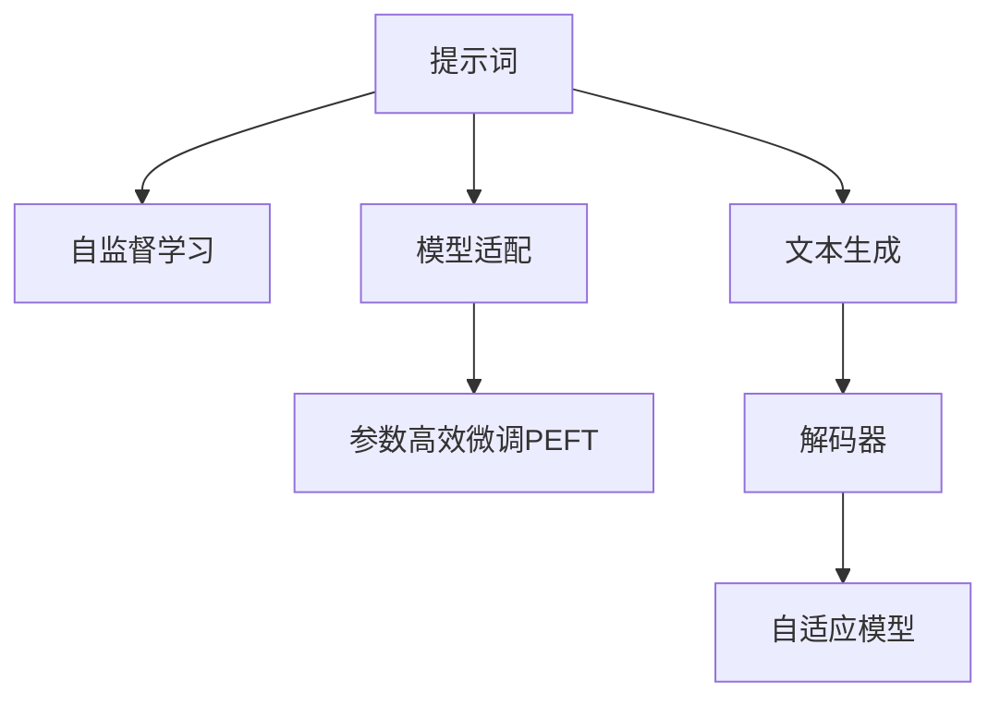

                 

# 提示词工程（Prompt Engineering）

> 关键词：提示词,自监督学习,模型适配,语言模型,解码器,自适应模型,文本生成

## 1. 背景介绍

### 1.1 问题由来
随着预训练语言模型（如BERT、GPT-3等）在自然语言处理（NLP）领域的广泛应用，研究人员和工程师们发现，仅仅依靠预训练模型并不能满足所有场景的需求。不同任务对模型的要求各异，需要模型具备更强的任务适配能力。这促使了提示词工程（Prompt Engineering）的兴起，即在模型输入端设计合适的提示词，引导模型产生特定任务要求的输出。提示词工程已成为提升模型性能、适应不同应用场景的关键技术。

### 1.2 问题核心关键点
提示词工程的核心在于如何设计合适的输入提示词，使得预训练模型能够根据提示词自动调整输出策略，以适应特定任务的需求。这涉及到以下几个关键点：

1. **提示词设计**：提示词必须能够清晰地描述任务目标，并足够简洁，以避免模型在解码过程中产生不必要的复杂度。
2. **任务适配**：提示词应该能够引导模型快速进入任务相关的状态，减少额外训练时间和数据需求。
3. **模型适配**：提示词的设计需要考虑不同模型的结构和特点，以最大化模型的输出质量。
4. **数据增强**：通过生成新的提示词，可以扩展数据集，提高模型的泛化能力。
5. **参数高效**：提示词工程可以与参数高效微调（PEFT）方法结合，进一步减少模型微调所需的参数量。

### 1.3 问题研究意义
提示词工程对于提升自然语言处理模型的性能和适应性具有重要意义：

1. **提升模型泛化能力**：通过合理设计提示词，可以显著提升模型在不同领域和任务上的泛化能力。
2. **减少标注数据需求**：提示词工程可以在小样本情况下，通过精心设计的提示词引导模型产生高质量输出。
3. **增强模型灵活性**：提示词工程使得模型能够适应多种任务，灵活性大大增强。
4. **提高开发效率**：提示词工程可以减少模型微调过程中的时间成本和数据成本，提高模型开发的效率。
5. **促进技术创新**：提示词工程催生了少样本学习、零样本学习和模型适应的新研究方向，推动了自然语言处理技术的不断进步。

## 2. 核心概念与联系

### 2.1 核心概念概述

为更好地理解提示词工程，本节将介绍几个密切相关的核心概念：

- **提示词（Prompt）**：在自然语言处理中，提示词是指在模型输入端添加的引导信息，以指示模型执行特定任务。
- **自监督学习（Self-Supervised Learning）**：通过自动设计目标（如掩码语言模型、下一句预测等），使模型在无标签数据上自动学习任务相关知识。
- **模型适配（Model Adaptation）**：指将预训练模型通过微调、参数高效微调（PEFT）等方式，适应特定任务的需求。
- **语言模型（Language Model）**：通过统计或神经网络模型预测自然语言序列的概率分布。
- **解码器（Decoder）**：在神经网络模型中，解码器负责将输入信息转换为期望的输出，如自然语言文本。
- **自适应模型（Adaptive Model）**：能够根据输入提示自动调整输出策略的模型，广泛应用于提示词工程中。
- **文本生成（Text Generation）**：指利用模型生成自然语言文本的过程，是提示词工程的重要应用场景。

这些核心概念之间的逻辑关系可以通过以下Mermaid流程图来展示：



这个流程图展示了大语言模型提示词工程的核心概念及其之间的关系：

1. 提示词工程的核心在于设计合适的输入提示词。
2. 自监督学习用于预训练大语言模型，学习通用的语言表示。
3. 模型适配通过微调、参数高效微调等方式，适应特定任务的需求。
4. 文本生成是提示词工程的重要应用场景，利用解码器生成自然语言文本。
5. 自适应模型能够根据输入提示自动调整输出策略。

## 3. 核心算法原理 & 具体操作步骤
### 3.1 算法原理概述

提示词工程的核心理念是通过精心设计的输入提示词，引导预训练模型生成符合特定任务要求的输出。这一过程本质上是将自监督学习的知识应用于下游任务，使得模型在无标签数据上进行微调，从而适应特定任务的需求。

### 3.2 算法步骤详解

提示词工程的具体步骤如下：

**Step 1: 准备数据集和预训练模型**
- 收集下游任务的标注数据集，确保数据集的多样性和代表性。
- 选择合适的预训练语言模型，如BERT、GPT等，作为输入提示词的设计基础。

**Step 2: 设计输入提示词**
- 根据下游任务的特点，设计简洁且具有指导性的提示词。
- 提示词应包含任务的关键信息，如问题、目标、约束等。
- 使用模板生成器自动生成提示词，或根据领域知识手动设计提示词。

**Step 3: 微调模型**
- 使用设计好的提示词作为模型输入，对预训练模型进行微调。
- 调整学习率、批大小等超参数，确保模型快速收敛。
- 使用正则化技术，如L2正则、Dropout等，避免模型过拟合。
- 周期性在验证集上评估模型性能，必要时进行Early Stopping。

**Step 4: 评估模型效果**
- 在测试集上评估模型输出与真实标签的差异，计算评估指标（如准确率、F1分数等）。
- 根据评估结果调整提示词设计，进行多轮迭代优化。

**Step 5: 应用模型**
- 将微调后的模型应用于实际任务中，生成符合任务要求的输出。
- 定期更新和重新微调模型，以适应任务需求的变化。

### 3.3 算法优缺点

提示词工程具有以下优点：
1. **灵活性强**：提示词可以针对不同任务进行设计，适应性强。
2. **可扩展性高**：提示词可以用于多种任务和应用场景，具有高度的可扩展性。
3. **资源需求低**：提示词工程可以通过少量标注数据实现微调，节省时间和成本。
4. **效果显著**：提示词工程在多种NLP任务上取得了显著的性能提升。

同时，提示词工程也存在以下局限性：
1. **设计难度高**：提示词设计需要经验和创造力，往往需要多次迭代优化。
2. **泛化能力有限**：提示词设计过多依赖于特定任务，泛化能力有限。
3. **模型依赖强**：提示词工程的效果依赖于预训练模型的质量和性能。
4. **数据质量要求高**：提示词设计需要高质量的标注数据作为基础。

### 3.4 算法应用领域

提示词工程在自然语言处理领域得到了广泛应用，包括但不限于以下几个方面：

1. **问答系统**：设计合适的提示词，使模型能够准确理解用户的问题，并生成正确的答案。
2. **文本摘要**：使用提示词引导模型从长文本中提取关键信息，生成简洁的摘要。
3. **情感分析**：通过提示词引导模型判断文本情感倾向，进行情感分析。
4. **机器翻译**：使用提示词控制翻译结果的风格和格式，如正式语或口语化表达。
5. **代码生成**：设计提示词，使模型能够生成符合特定风格或功能的代码片段。
6. **对话系统**：设计引导性提示词，使模型能够生成自然流畅的对话内容。

## 4. 数学模型和公式 & 详细讲解  
### 4.1 数学模型构建

本节将使用数学语言对提示词工程进行更加严格的刻画。

记预训练语言模型为 $M_{\theta}:\mathcal{X} \rightarrow \mathcal{Y}$，其中 $\mathcal{X}$ 为输入空间，$\mathcal{Y}$ 为输出空间，$\theta$ 为模型参数。假设提示词为 $P$，下游任务为 $T$，任务标注为 $y$。

定义模型 $M_{\theta}$ 在输入 $P$ 上的输出为 $\hat{y}=M_{\theta}(P)$，则在数据集 $D$ 上的经验风险为：

$$
\mathcal{L}(P) = \frac{1}{N} \sum_{i=1}^N \ell(M_{\theta}(P),y)
$$

其中 $\ell$ 为任务 $T$ 的损失函数，用于衡量模型输出与真实标签之间的差异。常见的损失函数包括交叉熵损失、均方误差损失等。

### 4.2 公式推导过程

以下我们以问答任务为例，推导交叉熵损失函数及其梯度的计算公式。

假设模型 $M_{\theta}$ 在输入 $P$ 上的输出为 $\hat{y}=M_{\theta}(P) \in [0,1]$，表示模型认为问题 $P$ 的答案是正样本的概率。真实标签 $y \in \{0,1\}$。则二分类交叉熵损失函数定义为：

$$
\ell(M_{\theta}(P),y) = -[y\log \hat{y} + (1-y)\log (1-\hat{y})]
$$

将其代入经验风险公式，得：

$$
\mathcal{L}(P) = -\frac{1}{N}\sum_{i=1}^N [y_i\log M_{\theta}(P_i)+(1-y_i)\log(1-M_{\theta}(P_i))]
$$

根据链式法则，损失函数对参数 $\theta_k$ 的梯度为：

$$
\frac{\partial \mathcal{L}(P)}{\partial \theta_k} = -\frac{1}{N}\sum_{i=1}^N (\frac{y_i}{M_{\theta}(P_i)}-\frac{1-y_i}{1-M_{\theta}(P_i)}) \frac{\partial M_{\theta}(P_i)}{\partial \theta_k}
$$

其中 $\frac{\partial M_{\theta}(P_i)}{\partial \theta_k}$ 可进一步递归展开，利用自动微分技术完成计算。

在得到损失函数的梯度后，即可带入参数更新公式，完成模型的迭代优化。重复上述过程直至收敛，最终得到适应下游任务的最优模型参数 $\theta^*$。

## 5. 项目实践：代码实例和详细解释说明
### 5.1 开发环境搭建

在进行提示词工程实践前，我们需要准备好开发环境。以下是使用Python进行PyTorch开发的环境配置流程：

1. 安装Anaconda：从官网下载并安装Anaconda，用于创建独立的Python环境。

2. 创建并激活虚拟环境：
```bash
conda create -n pytorch-env python=3.8 
conda activate pytorch-env
```

3. 安装PyTorch：根据CUDA版本，从官网获取对应的安装命令。例如：
```bash
conda install pytorch torchvision torchaudio cudatoolkit=11.1 -c pytorch -c conda-forge
```

4. 安装Transformers库：
```bash
pip install transformers
```

5. 安装各类工具包：
```bash
pip install numpy pandas scikit-learn matplotlib tqdm jupyter notebook ipython
```

完成上述步骤后，即可在`pytorch-env`环境中开始提示词工程实践。

### 5.2 源代码详细实现

下面我们以问答系统任务为例，给出使用Transformers库对BERT模型进行提示词工程实践的PyTorch代码实现。

首先，定义问答系统任务的数据处理函数：

```python
from transformers import BertTokenizer
from torch.utils.data import Dataset
import torch

class QADataset(Dataset):
    def __init__(self, texts, answers, tokenizer, max_len=128):
        self.texts = texts
        self.answers = answers
        self.tokenizer = tokenizer
        self.max_len = max_len
        
    def __len__(self):
        return len(self.texts)
    
    def __getitem__(self, item):
        text = self.texts[item]
        answer = self.answers[item]
        
        encoding = self.tokenizer(text, return_tensors='pt', max_length=self.max_len, padding='max_length', truncation=True)
        input_ids = encoding['input_ids'][0]
        attention_mask = encoding['attention_mask'][0]
        
        # 对答案进行编码
        answer_id = [tag2id[answer] for answer in self.answers]
        answer_id.extend([tag2id['O']] * (self.max_len - len(answer_id)))
        labels = torch.tensor(answer_id, dtype=torch.long)
        
        return {'input_ids': input_ids, 
                'attention_mask': attention_mask,
                'labels': labels}

# 标签与id的映射
tag2id = {'O': 0, 'A': 1}
id2tag = {v: k for k, v in tag2id.items()}

# 创建dataset
tokenizer = BertTokenizer.from_pretrained('bert-base-cased')

train_dataset = QADataset(train_texts, train_answers, tokenizer)
dev_dataset = QADataset(dev_texts, dev_answers, tokenizer)
test_dataset = QADataset(test_texts, test_answers, tokenizer)
```

然后，定义模型和优化器：

```python
from transformers import BertForTokenClassification, AdamW

model = BertForTokenClassification.from_pretrained('bert-base-cased', num_labels=len(tag2id))

optimizer = AdamW(model.parameters(), lr=2e-5)
```

接着，定义训练和评估函数：

```python
from torch.utils.data import DataLoader
from tqdm import tqdm
from sklearn.metrics import classification_report

device = torch.device('cuda') if torch.cuda.is_available() else torch.device('cpu')
model.to(device)

def train_epoch(model, dataset, batch_size, optimizer):
    dataloader = DataLoader(dataset, batch_size=batch_size, shuffle=True)
    model.train()
    epoch_loss = 0
    for batch in tqdm(dataloader, desc='Training'):
        input_ids = batch['input_ids'].to(device)
        attention_mask = batch['attention_mask'].to(device)
        labels = batch['labels'].to(device)
        model.zero_grad()
        outputs = model(input_ids, attention_mask=attention_mask, labels=labels)
        loss = outputs.loss
        epoch_loss += loss.item()
        loss.backward()
        optimizer.step()
    return epoch_loss / len(dataloader)

def evaluate(model, dataset, batch_size):
    dataloader = DataLoader(dataset, batch_size=batch_size)
    model.eval()
    preds, labels = [], []
    with torch.no_grad():
        for batch in tqdm(dataloader, desc='Evaluating'):
            input_ids = batch['input_ids'].to(device)
            attention_mask = batch['attention_mask'].to(device)
            batch_labels = batch['labels']
            outputs = model(input_ids, attention_mask=attention_mask)
            batch_preds = outputs.logits.argmax(dim=2).to('cpu').tolist()
            batch_labels = batch_labels.to('cpu').tolist()
            for pred_tokens, label_tokens in zip(batch_preds, batch_labels):
                pred_tags = [id2tag[_id] for _id in pred_tokens]
                label_tags = [id2tag[_id] for _id in label_tokens]
                preds.append(pred_tags[:len(label_tokens)])
                labels.append(label_tags)
                
    print(classification_report(labels, preds))
```

最后，启动训练流程并在测试集上评估：

```python
epochs = 5
batch_size = 16

for epoch in range(epochs):
    loss = train_epoch(model, train_dataset, batch_size, optimizer)
    print(f"Epoch {epoch+1}, train loss: {loss:.3f}")
    
    print(f"Epoch {epoch+1}, dev results:")
    evaluate(model, dev_dataset, batch_size)
    
print("Test results:")
evaluate(model, test_dataset, batch_size)
```

以上就是使用PyTorch对BERT进行问答系统任务提示词工程的完整代码实现。可以看到，得益于Transformers库的强大封装，我们可以用相对简洁的代码完成BERT模型的提示词工程实践。

### 5.3 代码解读与分析

让我们再详细解读一下关键代码的实现细节：

**QADataset类**：
- `__init__`方法：初始化文本、答案、分词器等关键组件。
- `__len__`方法：返回数据集的样本数量。
- `__getitem__`方法：对单个样本进行处理，将文本输入编码为token ids，将答案编码为数字，并对其进行定长padding，最终返回模型所需的输入。

**tag2id和id2tag字典**：
- 定义了标签与数字id之间的映射关系，用于将token-wise的预测结果解码回真实的标签。

**训练和评估函数**：
- 使用PyTorch的DataLoader对数据集进行批次化加载，供模型训练和推理使用。
- 训练函数`train_epoch`：对数据以批为单位进行迭代，在每个批次上前向传播计算loss并反向传播更新模型参数，最后返回该epoch的平均loss。
- 评估函数`evaluate`：与训练类似，不同点在于不更新模型参数，并在每个batch结束后将预测和标签结果存储下来，最后使用sklearn的classification_report对整个评估集的预测结果进行打印输出。

**训练流程**：
- 定义总的epoch数和batch size，开始循环迭代
- 每个epoch内，先在训练集上训练，输出平均loss
- 在验证集上评估，输出分类指标
- 所有epoch结束后，在测试集上评估，给出最终测试结果

可以看到，PyTorch配合Transformers库使得BERT提示词工程的代码实现变得简洁高效。开发者可以将更多精力放在数据处理、模型改进等高层逻辑上，而不必过多关注底层的实现细节。

当然，工业级的系统实现还需考虑更多因素，如模型的保存和部署、超参数的自动搜索、更灵活的任务适配层等。但核心的提示词工程范式基本与此类似。

## 6. 实际应用场景
### 6.1 智能客服系统

基于提示词工程的对话技术，可以广泛应用于智能客服系统的构建。传统客服往往需要配备大量人力，高峰期响应缓慢，且一致性和专业性难以保证。而使用提示词工程设计的对话模型，可以7x24小时不间断服务，快速响应客户咨询，用自然流畅的语言解答各类常见问题。

在技术实现上，可以收集企业内部的历史客服对话记录，将问题和最佳答复构建成监督数据，在此基础上对预训练对话模型进行微调。提示词工程设计的对话模型能够自动理解用户意图，匹配最合适的答案模板进行回复。对于客户提出的新问题，还可以接入检索系统实时搜索相关内容，动态组织生成回答。如此构建的智能客服系统，能大幅提升客户咨询体验和问题解决效率。

### 6.2 金融舆情监测

金融机构需要实时监测市场舆论动向，以便及时应对负面信息传播，规避金融风险。传统的人工监测方式成本高、效率低，难以应对网络时代海量信息爆发的挑战。基于提示词工程的文本分类和情感分析技术，为金融舆情监测提供了新的解决方案。

具体而言，可以收集金融领域相关的新闻、报道、评论等文本数据，并对其进行主题标注和情感标注。在此基础上对预训练语言模型进行微调，使其能够自动判断文本属于何种主题，情感倾向是正面、中性还是负面。将提示词工程设计的模型应用到实时抓取的网络文本数据，就能够自动监测不同主题下的情感变化趋势，一旦发现负面信息激增等异常情况，系统便会自动预警，帮助金融机构快速应对潜在风险。

### 6.3 个性化推荐系统

当前的推荐系统往往只依赖用户的历史行为数据进行物品推荐，无法深入理解用户的真实兴趣偏好。基于提示词工程的个性化推荐系统可以更好地挖掘用户行为背后的语义信息，从而提供更精准、多样的推荐内容。

在实践中，可以收集用户浏览、点击、评论、分享等行为数据，提取和用户交互的物品标题、描述、标签等文本内容。将文本内容作为模型输入，用户的后续行为（如是否点击、购买等）作为监督信号，在此基础上微调预训练语言模型。提示词工程设计的模型能够从文本内容中准确把握用户的兴趣点。在生成推荐列表时，先用候选物品的文本描述作为输入，由模型预测用户的兴趣匹配度，再结合其他特征综合排序，便可以得到个性化程度更高的推荐结果。

### 6.4 未来应用展望

随着提示词工程技术的不断发展，其在自然语言处理领域的应用前景将更加广阔。

在智慧医疗领域，基于提示词工程的问答系统、病历分析、药物研发等应用将提升医疗服务的智能化水平，辅助医生诊疗，加速新药开发进程。

在智能教育领域，提示词工程可应用于作业批改、学情分析、知识推荐等方面，因材施教，促进教育公平，提高教学质量。

在智慧城市治理中，提示词工程设计的系统可以用于城市事件监测、舆情分析、应急指挥等环节，提高城市管理的自动化和智能化水平，构建更安全、高效的未来城市。

此外，在企业生产、社会治理、文娱传媒等众多领域，提示词工程的应用也将不断涌现，为传统行业数字化转型升级提供新的技术路径。相信随着技术的日益成熟，提示词工程必将成为自然语言处理技术的重要范式，推动人工智能技术在更广泛领域的应用。

## 7. 工具和资源推荐
### 7.1 学习资源推荐

为了帮助开发者系统掌握提示词工程的理论基础和实践技巧，这里推荐一些优质的学习资源：

1. 《Prompt Engineering in Natural Language Processing》系列博文：由提示词工程专家撰写，深入浅出地介绍了提示词工程的基本概念和具体实践。

2. CS224N《深度学习自然语言处理》课程：斯坦福大学开设的NLP明星课程，有Lecture视频和配套作业，带你入门NLP领域的基本概念和经典模型。

3. 《Prompt Engineering: How to Design Effective Prompts for Natural Language Processing Models》书籍：提示词工程领域的权威著作，系统全面地介绍了提示词工程的理论和实践方法。

4. HuggingFace官方文档：Transformers库的官方文档，提供了海量预训练模型和完整的提示词工程样例代码，是上手实践的必备资料。

5. CLUE开源项目：中文语言理解测评基准，涵盖大量不同类型的中文NLP数据集，并提供了基于提示词工程的baseline模型，助力中文NLP技术发展。

通过对这些资源的学习实践，相信你一定能够快速掌握提示词工程的核心技术和技巧，并用于解决实际的NLP问题。
###  7.2 开发工具推荐

高效的开发离不开优秀的工具支持。以下是几款用于提示词工程开发的常用工具：

1. PyTorch：基于Python的开源深度学习框架，灵活动态的计算图，适合快速迭代研究。大部分预训练语言模型都有PyTorch版本的实现。

2. TensorFlow：由Google主导开发的开源深度学习框架，生产部署方便，适合大规模工程应用。同样有丰富的预训练语言模型资源。

3. Transformers库：HuggingFace开发的NLP工具库，集成了众多SOTA语言模型，支持PyTorch和TensorFlow，是进行提示词工程开发的利器。

4. Weights & Biases：模型训练的实验跟踪工具，可以记录和可视化模型训练过程中的各项指标，方便对比和调优。与主流深度学习框架无缝集成。

5. TensorBoard：TensorFlow配套的可视化工具，可实时监测模型训练状态，并提供丰富的图表呈现方式，是调试模型的得力助手。

6. Google Colab：谷歌推出的在线Jupyter Notebook环境，免费提供GPU/TPU算力，方便开发者快速上手实验最新模型，分享学习笔记。

合理利用这些工具，可以显著提升提示词工程任务的开发效率，加快创新迭代的步伐。

### 7.3 相关论文推荐

提示词工程技术的发展得益于学界的持续研究。以下是几篇奠基性的相关论文，推荐阅读：

1. "The Interpretability of Sequence-to-Sequence Models via Implicit State Tracking"：提出通过提示词引导模型生成与目标输出一致的输出，提高模型的可解释性。

2. "Prompt Engineering for Natural Language Generation"：提出通过设计提示词，控制文本生成模型的输出风格和内容，提升生成文本的质量。

3. "Evaluating and Comparing Machine Translation with Limited Human Training Data"：通过设计提示词，评估模型在少样本情况下的性能，推动少样本学习和提示词工程的发展。

4. "Zero-shot Translation Learning using Pretrained Language Models"：利用提示词工程设计的模型在零样本情况下进行翻译，提升模型泛化能力。

5. "Adaptive Machines"：提出通过设计提示词，使模型能够根据输入数据动态调整输出策略，提高模型的灵活性和泛化能力。

这些论文代表了大语言模型提示词工程的发展脉络。通过学习这些前沿成果，可以帮助研究者把握学科前进方向，激发更多的创新灵感。

## 8. 总结：未来发展趋势与挑战

### 8.1 总结

本文对提示词工程进行了全面系统的介绍。首先阐述了提示词工程的研究背景和意义，明确了提示词在提示词工程中的核心作用。其次，从原理到实践，详细讲解了提示词工程的数学原理和关键步骤，给出了提示词工程任务开发的完整代码实例。同时，本文还广泛探讨了提示词工程在智能客服、金融舆情、个性化推荐等多个行业领域的应用前景，展示了提示词工程技术的巨大潜力。此外，本文精选了提示词工程的各类学习资源，力求为读者提供全方位的技术指引。

通过本文的系统梳理，可以看到，提示词工程技术在大语言模型微调中的应用，显著提升了模型在不同任务上的泛化能力，降低了标注数据的需求，增强了模型的灵活性和可扩展性。提示词工程技术将成为未来自然语言处理技术的重要组成部分，为人工智能技术的普及和发展提供强有力的支持。

### 8.2 未来发展趋势

展望未来，提示词工程技术将呈现以下几个发展趋势：

1. **自动化提示词设计**：随着自然语言处理技术的进步，提示词设计将越来越自动化，使用提示词生成工具自动设计高质量的提示词，进一步提升提示词工程的效率和效果。

2. **多模态提示词**：提示词设计将不仅仅局限于文本数据，而是扩展到图像、视频、语音等多模态数据，实现跨模态的智能交互。

3. **自适应学习**：提示词工程将结合自适应学习技术，使模型能够根据输入数据动态调整输出策略，增强模型的灵活性和泛化能力。

4. **跨领域提示词**：设计通用的提示词，使其能够适应多种任务和领域，提升模型的跨领域迁移能力。

5. **少样本和零样本学习**：通过精心的提示词设计，使得模型能够在少量标注数据甚至无标注数据的情况下，实现高效的少样本和零样本学习。

6. **模型可解释性**：提示词工程将结合因果分析和可解释性方法，使模型输出更加透明，便于理解和调试。

以上趋势凸显了提示词工程技术的广阔前景。这些方向的探索发展，将进一步提升自然语言处理模型的性能和应用范围，为人工智能技术在更多领域的落地应用提供新的思路和手段。

### 8.3 面临的挑战

尽管提示词工程技术已经取得了显著进展，但在迈向更加智能化、普适化应用的过程中，它仍面临着诸多挑战：

1. **提示词设计复杂度高**：提示词设计需要经验和创造力，往往需要多次迭代优化，难以自动化。
2. **提示词泛化能力有限**：提示词设计过多依赖于特定任务，泛化能力有限。
3. **模型鲁棒性不足**：提示词工程生成的模型面对域外数据时，泛化性能往往大打折扣。
4. **数据质量要求高**：提示词设计需要高质量的标注数据作为基础，获取高质量标注数据的成本较高。

### 8.4 研究展望

面对提示词工程面临的这些挑战，未来的研究需要在以下几个方面寻求新的突破：

1. **自动化提示词生成**：开发更高效的提示词生成技术，自动设计高质量的提示词，提高提示词工程的可扩展性和效率。

2. **多模态提示词设计**：研究多模态提示词设计技术，使模型能够处理图像、视频、语音等多模态数据，提升跨模态智能交互能力。

3. **自适应模型设计**：研究自适应模型设计技术，使模型能够根据输入数据动态调整输出策略，提高模型的灵活性和泛化能力。

4. **模型可解释性提升**：结合因果分析和可解释性方法，使模型输出更加透明，便于理解和调试。

5. **知识整合与迁移**：研究知识图谱、逻辑规则等外部知识的整合，提升模型在不同领域和任务上的迁移能力。

6. **伦理与安全**：研究提示词工程中的伦理和安全问题，确保模型输出的安全性和公平性。

这些研究方向的探索，将引领提示词工程技术迈向更高的台阶，为构建安全、可靠、可解释、可控的智能系统铺平道路。面向未来，提示词工程技术还需要与其他人工智能技术进行更深入的融合，如知识表示、因果推理、强化学习等，多路径协同发力，共同推动自然语言理解和智能交互系统的进步。只有勇于创新、敢于突破，才能不断拓展语言模型的边界，让智能技术更好地造福人类社会。

## 9. 附录：常见问题与解答

**Q1：提示词工程是否适用于所有NLP任务？**

A: 提示词工程在大多数NLP任务上都能取得不错的效果，特别是对于数据量较小的任务。但对于一些特定领域的任务，如医学、法律等，提示词工程可能需要进行领域特定的优化。

**Q2：如何设计高质量的提示词？**

A: 高质量的提示词设计需要经验和创造力，一般遵循以下原则：简洁明了、明确具体、具有指导性、避免冗余。设计过程中，可以借鉴现有优秀的提示词示例，并进行反复迭代优化。

**Q3：提示词工程在微调模型时需要注意哪些问题？**

A: 提示词工程在微调模型时，需要注意以下几个问题：
1. 学习率的设置：提示词工程需要与微调方法相结合，选择合适的学习率。
2. 正则化技术的应用：使用L2正则、Dropout等正则化技术，防止模型过拟合。
3. 数据增强：通过回译、近义替换等方式扩充训练集，提高模型的泛化能力。
4. 参数高效微调：结合参数高效微调技术，减少模型微调所需的参数量。

**Q4：提示词工程与参数高效微调（PEFT）结合时需要注意哪些问题？**

A: 提示词工程与参数高效微调（PEFT）结合时，需要注意以下几个问题：
1. 提示词设计要与PEFT方法兼容，避免过多修改模型结构。
2. 使用少量参数进行微调，以减少计算资源消耗。
3. 调整学习率，确保模型在微调过程中稳定收敛。

**Q5：提示词工程在实际应用中需要注意哪些问题？**

A: 提示词工程在实际应用中，需要注意以下几个问题：
1. 模型裁剪：去除不必要的层和参数，减小模型尺寸，加快推理速度。
2. 量化加速：将浮点模型转为定点模型，压缩存储空间，提高计算效率。
3. 服务化封装：将提示词工程模型封装为标准化服务接口，便于集成调用。
4. 监控告警：实时采集系统指标，设置异常告警阈值，确保服务稳定性。

通过本文的系统梳理，可以看到，提示词工程技术在大语言模型微调中的应用，显著提升了模型在不同任务上的泛化能力，降低了标注数据的需求，增强了模型的灵活性和可扩展性。提示词工程技术将成为未来自然语言处理技术的重要组成部分，为人工智能技术的普及和发展提供强有力的支持。未来，随着技术的不断进步和应用场景的不断扩展，提示词工程必将在更多领域大放异彩，为人工智能技术的发展注入新的活力。

---

作者：禅与计算机程序设计艺术 / Zen and the Art of Computer Programming

