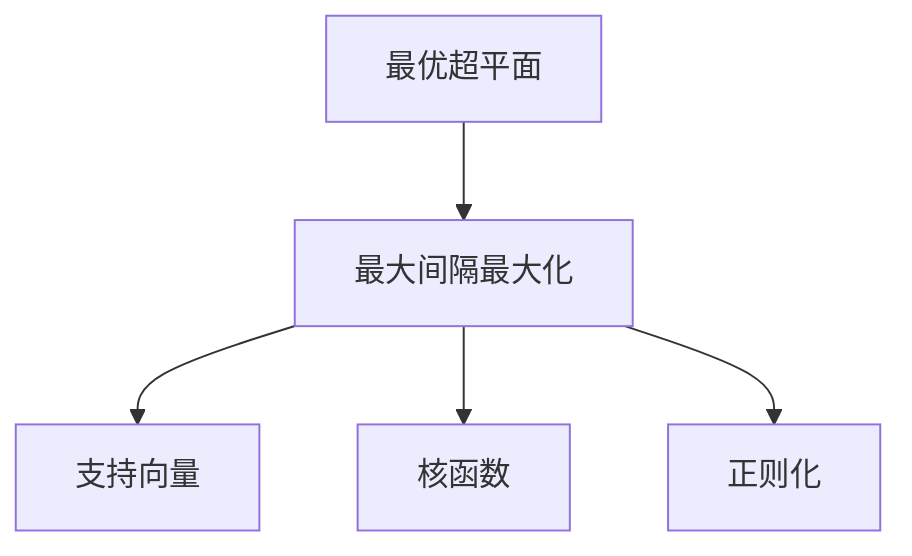

                 

# 支持向量机(Support Vector Machines) - 原理与代码实例讲解

> 关键词：支持向量机, SVM, 核函数, 高维空间, 模型优化, 应用实例

## 1. 背景介绍

### 1.1 问题由来

支持向量机(Support Vector Machine, SVM)是一种广泛应用于分类和回归分析的机器学习算法。自20世纪90年代以来，SVM以其优秀的理论性能和实际效果，在学术界和工业界得到了广泛关注。

SVM的基本思想是寻找一个最优超平面，将数据集分割成不同的类别。这个最优超平面不仅能够最大化不同类别之间的间隔，还能够处理高维数据。SVM通过寻找边缘最大化(closest to the edge)的数据点(即支持向量)，使得模型能够更好地泛化到未见过的数据上。

### 1.2 问题核心关键点

SVM的核心在于以下几个方面：

- 核函数(kernel function)：将数据映射到高维空间，使得非线性可分的数据在低维空间中变得可分。
- 最大间隔最大化(margin maximization)：通过最大化分类超平面与最近支持向量之间的距离，提升模型的泛化能力。
- 正则化(regularization)：通过引入正则项，防止模型过拟合。
- 支持向量(support vector)：在最大间隔超平面两侧的样本，对超平面的位置和方向有决定性影响。

SVM已被广泛应用于多个领域，如医学诊断、金融预测、图像分类、文本分类等。

### 1.3 问题研究意义

SVM的研究对于提升机器学习模型的性能和泛化能力具有重要意义：

1. 优化性能：通过选择合适的核函数，SVM能够处理复杂数据，提升模型的分类准确率。
2. 泛化能力：通过最大间隔最大化，SVM能够增强模型的泛化能力，避免过拟合。
3. 高效计算：SVM的决策边界是凸集，具有较好的可解释性和可优化性。
4. 适应性强：SVM能够处理多种数据类型，如连续型、离散型和半连续型数据。
5. 高维度数据：SVM能够处理高维数据，在数据维度远大于样本数量时仍能保持良好的性能。

## 2. 核心概念与联系

### 2.1 核心概念概述

为更好地理解SVM的原理和应用，本节将介绍几个密切相关的核心概念：

- 最优超平面(Optimal Hyperplane)：用于分割数据集的最优超平面，能够最大化不同类别之间的间隔。
- 最大间隔最大化(Margin Maximization)：通过最大化分类超平面与最近支持向量之间的距离，提升模型的泛化能力。
- 支持向量(Support Vector)：在最大间隔超平面两侧的样本，对超平面的位置和方向有决定性影响。
- 核函数(Kernel Function)：将数据映射到高维空间，使得非线性可分的数据在低维空间中变得可分。
- 正则化(Regularization)：通过引入正则项，防止模型过拟合。

这些核心概念之间的逻辑关系可以通过以下Mermaid流程图来展示：



这个流程图展示了大支持向量机的工作原理和关键组件：

1. 通过最大间隔最大化，构造最优超平面。
2. 支持向量在最大间隔超平面两侧，对超平面的位置和方向有决定性影响。
3. 核函数将数据映射到高维空间，使得非线性可分的数据在低维空间中变得可分。
4. 正则化通过引入正则项，防止模型过拟合。

这些概念共同构成了SVM的核心框架，使得SVM在各种数据分布下都能发挥其强大的分类能力。

## 3. 核心算法原理 & 具体操作步骤
### 3.1 算法原理概述

SVM的基本思想是找到一个最优超平面，将数据集分割成不同的类别。通过最大化分类超平面与最近支持向量之间的距离，提升模型的泛化能力。

SVM的数学模型定义如下：

$$
\min_{w,b} \frac{1}{2}||w||^2 + C\sum_{i=1}^n (\xi_i)
$$

其中，$w$ 为分类超平面的权重向量，$b$ 为截距，$\xi_i$ 为松弛变量，$C$ 为正则化系数。分类超平面的方程为 $w^T x + b = 0$。

约束条件为：

$$
\begin{cases}
y_i(w^T x_i + b) \geq 1 - \xi_i \\
\xi_i \geq 0 \\
\end{cases} \quad \text{for } i=1,2,\dots,n
$$

其中，$y_i \in \{-1,1\}$ 表示第 $i$ 个样本的标签。

### 3.2 算法步骤详解

SVM的核心算法步骤如下：

**Step 1: 数据预处理**
- 对数据进行标准化或归一化，以便不同特征的权重相等。
- 对于二分类问题，将标签转化为 $y_i \in \{-1,1\}$。

**Step 2: 构建模型**
- 选择合适的核函数，如线性核、多项式核、径向基函数(RBF)核等。
- 定义损失函数和正则项。
- 求解最优超平面，使分类间隔最大化。

**Step 3: 模型优化**
- 使用最优化算法，如SMO(Smoothly Clipped Algorithms)等，求解最大化间隔问题。
- 计算支持向量，确定最优超平面。

**Step 4: 模型预测**
- 对于新样本 $x$，通过计算距离最优超平面的距离，进行分类预测。

### 3.3 算法优缺点

SVM的优点包括：

- 泛化能力强：通过最大化分类间隔，SVM能够在训练样本和测试样本之间实现良好的泛化。
- 适应性强：能够处理多种数据类型，如连续型、离散型和半连续型数据。
- 高维度数据处理能力强：SVM能够在高维空间中有效处理数据。
- 可解释性强：SVM的决策边界是凸集，具有较好的可解释性。

SVM的缺点包括：

- 对噪声敏感：支持向量对噪声数据非常敏感，容易受到样本异常值的影响。
- 计算复杂度高：在高维空间中，SVM的计算复杂度较高，需要较多的计算资源。
- 超参数选择困难：需要选择合适的正则化系数和核函数参数，对数据分布的假设较强。
- 模型复杂度高：当训练样本数量较大时，SVM的模型复杂度较高。

### 3.4 算法应用领域

SVM在多个领域得到了广泛的应用，具体如下：

- 图像分类：如手写数字识别、物体识别等，SVM能够处理高维图像特征。
- 文本分类：如情感分析、主题分类等，SVM能够处理文本数据。
- 医学诊断：如肿瘤分类、疾病预测等，SVM能够处理半连续型数据。
- 金融预测：如股票价格预测、信用评估等，SVM能够处理多种数据类型。
- 信号处理：如语音识别、图像处理等，SVM能够处理非线性信号。

## 4. 数学模型和公式 & 详细讲解 & 举例说明
### 4.1 数学模型构建

SVM的数学模型定义如下：

$$
\min_{w,b} \frac{1}{2}||w||^2 + C\sum_{i=1}^n (\xi_i)
$$

其中，$w$ 为分类超平面的权重向量，$b$ 为截距，$\xi_i$ 为松弛变量，$C$ 为正则化系数。分类超平面的方程为 $w^T x + b = 0$。

约束条件为：

$$
\begin{cases}
y_i(w^T x_i + b) \geq 1 - \xi_i \\
\xi_i \geq 0 \\
\end{cases} \quad \text{for } i=1,2,\dots,n
$$

其中，$y_i \in \{-1,1\}$ 表示第 $i$ 个样本的标签。

### 4.2 公式推导过程

对于二分类问题，SVM的目标函数可以写为：

$$
\min_{w,b} \frac{1}{2}||w||^2 + C\sum_{i=1}^n (\xi_i)
$$

其中，$\xi_i$ 表示第 $i$ 个样本的分类误差。$C$ 为正则化系数，用于平衡模型的复杂度和泛化能力。

目标函数的第一项 $\frac{1}{2}||w||^2$ 表示正则化项，用于控制模型复杂度。第二项 $C\sum_{i=1}^n (\xi_i)$ 表示损失项，用于控制分类误差。

将目标函数和约束条件带入拉格朗日乘子法，得到拉格朗日乘子对样本的 Lagrange 函数：

$$
L(\alpha) = \frac{1}{2}||w||^2 + C\sum_{i=1}^n (\xi_i) + \sum_{i=1}^n \alpha_i(y_i(w^T x_i + b) - 1 + \xi_i) - \sum_{i=1}^n \alpha_i\xi_i
$$

其中，$\alpha_i$ 为拉格朗日乘子，满足 $0 \leq \alpha_i \leq C$。

求导并令导数为零，得到最优超平面的方程：

$$
w = \sum_{i=1}^n \alpha_i y_i x_i
$$

$$
b = y_j - w^T x_j
$$

其中，$y_j$ 为支持向量。

### 4.3 案例分析与讲解

以二分类问题为例，说明SVM的具体应用过程：

假设有一组二分类数据集 $D=\{(x_i,y_i)\}_{i=1}^N$，其中 $x_i \in \mathbb{R}^d$，$y_i \in \{-1,1\}$。

**Step 1: 数据预处理**

对数据进行标准化或归一化，将每个特征值转化为标准差为1的值。

**Step 2: 构建模型**

选择合适的核函数，如径向基函数(RBF)核。

$$
K(x_i,x_j) = \exp(-\gamma||x_i - x_j||^2)
$$

其中，$\gamma$ 为核函数的参数，控制核函数的宽度。

**Step 3: 模型优化**

使用SMO算法求解拉格朗日乘子 $\alpha_i$，得到最优超平面 $w$ 和截距 $b$。

**Step 4: 模型预测**

对于新样本 $x$，计算 $w^T x + b$ 的值，根据符号进行分类预测。

## 5. 项目实践：代码实例和详细解释说明
### 5.1 开发环境搭建

在进行SVM实践前，我们需要准备好开发环境。以下是使用Python进行Scikit-learn开发的环境配置流程：

1. 安装Anaconda：从官网下载并安装Anaconda，用于创建独立的Python环境。

2. 创建并激活虚拟环境：
```bash
conda create -n svm-env python=3.8 
conda activate svm-env
```

3. 安装Scikit-learn：
```bash
conda install scikit-learn
```

4. 安装其他依赖库：
```bash
pip install numpy pandas matplotlib seaborn
```

完成上述步骤后，即可在`svm-env`环境中开始SVM实践。

### 5.2 源代码详细实现

下面我们以手写数字识别任务为例，给出使用Scikit-learn库对SVM模型进行训练和预测的Python代码实现。

首先，定义训练集和测试集：

```python
from sklearn.datasets import load_digits
from sklearn.model_selection import train_test_split

digits = load_digits()
X = digits.data
y = digits.target

X_train, X_test, y_train, y_test = train_test_split(X, y, test_size=0.2, random_state=42)
```

然后，定义SVM模型并进行训练：

```python
from sklearn.svm import SVC

svm = SVC(kernel='rbf', gamma=0.1, C=1.0)
svm.fit(X_train, y_train)
```

接着，评估模型在测试集上的表现：

```python
from sklearn.metrics import accuracy_score

y_pred = svm.predict(X_test)
accuracy = accuracy_score(y_test, y_pred)
print(f"Accuracy: {accuracy:.2f}")
```

最后，进行模型预测并可视化结果：

```python
import matplotlib.pyplot as plt

plt.scatter(X_test[:, 0], X_test[:, 1], c=y_pred, cmap='viridis')
plt.xlabel('Feature 1')
plt.ylabel('Feature 2')
plt.show()
```

以上就是使用Scikit-learn对SVM进行手写数字识别任务训练和预测的完整代码实现。可以看到，Scikit-learn库的SVM模型提供了简单易用的接口，大大简化了模型的训练和评估过程。

### 5.3 代码解读与分析

让我们再详细解读一下关键代码的实现细节：

**load_digits函数**：
- 用于加载手写数字数据集，生成特征值 $X$ 和标签 $y$。

**train_test_split函数**：
- 将数据集划分为训练集和测试集，设置划分比例为80%和20%。

**SVC类**：
- 用于定义SVM模型，选择径向基函数(RBF)核，设置核函数参数 $\gamma=0.1$ 和正则化系数 $C=1.0$。

**fit方法**：
- 对训练集进行模型拟合，学习最优超平面。

**accuracy_score函数**：
- 计算模型在测试集上的准确率。

**scatter方法**：
- 绘制测试集的散点图，并用颜色表示预测结果，直观展示模型效果。

可以看到，Scikit-learn库提供了丰富的数据集和模型接口，使得SVM模型的实现变得简单易行。开发者只需关注模型参数和评估指标的调整，即可快速验证SVM的效果。

## 6. 实际应用场景
### 6.1 图像分类

SVM在图像分类任务中具有显著优势，能够处理高维数据，并对噪声数据具有一定的鲁棒性。传统图像分类方法如决策树、K近邻等，在高维空间中往往面临计算复杂度高、泛化能力不足等问题。

在实践中，可以通过将图像像素值转化为特征向量，使用SVM进行分类。SVM能够通过选择合适的核函数，处理复杂的非线性分类问题，并在训练过程中最大化分类间隔，提升模型泛化能力。

### 6.2 文本分类

SVM在文本分类任务中也得到了广泛应用，如情感分析、主题分类等。文本数据通常具有高维稀疏性，传统的朴素贝叶斯、K近邻等方法难以有效处理。

在实践中，可以将文本转换为词袋模型或TF-IDF向量，使用SVM进行分类。SVM通过核函数，将文本数据映射到高维空间，实现线性可分的文本分类。

### 6.3 金融预测

金融预测是SVM的重要应用领域之一，如股票价格预测、信用评估等。金融数据通常具有非线性、高维、非平稳等特点，传统的线性回归等方法难以有效建模。

在实践中，可以通过对金融数据进行特征工程，如时间序列分析、因子分析等，使用SVM进行预测。SVM通过核函数，能够处理非线性关系，并通过对正则化的控制，防止模型过拟合。

### 6.4 未来应用展望

随着SVM的不断优化和演化，其在更多领域的应用前景将更加广阔：

- 生物信息学：如蛋白质分类、基因表达分析等，SVM能够处理高维生物数据。
- 医疗诊断：如肿瘤分类、疾病预测等，SVM能够处理半连续型数据。
- 信号处理：如语音识别、图像处理等，SVM能够处理非线性信号。
- 工业控制：如设备故障预测、质量检测等，SVM能够处理高维数据。
- 社会网络分析：如社交网络分类、推荐系统等，SVM能够处理多维关系数据。

## 7. 工具和资源推荐
### 7.1 学习资源推荐

为了帮助开发者系统掌握SVM的理论基础和实践技巧，这里推荐一些优质的学习资源：

1. 《机器学习实战》系列书籍：由Kaggle竞赛获奖者编写，涵盖机器学习的基本概念和实战技巧，包括SVM的详细应用。

2. Coursera《机器学习》课程：斯坦福大学开设的机器学习课程，涵盖机器学习的基本概念和算法，包括SVM的介绍和应用。

3. Scikit-learn官方文档：Scikit-learn库的官方文档，提供了丰富的SVM模型接口和参数解释，是学习SVM的必备资料。

4. Kaggle机器学习竞赛平台：提供大量数据集和模型竞赛，帮助开发者实践SVM模型的优化和调优。

5. GitHub上的SVM代码库：如scikit-learn/sklearn，包含大量SVM的实际应用案例和代码示例，方便开发者学习。

通过对这些资源的学习实践，相信你一定能够快速掌握SVM的精髓，并用于解决实际的机器学习问题。

### 7.2 开发工具推荐

高效的开发离不开优秀的工具支持。以下是几款用于SVM开发的常用工具：

1. Python：Python是机器学习领域的主流编程语言，拥有丰富的科学计算库和机器学习框架，如Scikit-learn、TensorFlow等。

2. Scikit-learn：Scikit-learn库提供了丰富的机器学习算法和接口，包括SVM模型，易于上手和实践。

3. TensorFlow：由Google主导开发的深度学习框架，支持SVM等经典机器学习算法，提供高效的分布式计算能力。

4. Weights & Biases：模型训练的实验跟踪工具，可以记录和可视化模型训练过程中的各项指标，方便对比和调优。

5. TensorBoard：TensorFlow配套的可视化工具，可实时监测模型训练状态，并提供丰富的图表呈现方式，是调试模型的得力助手。

合理利用这些工具，可以显著提升SVM开发和调优的效率，加快创新迭代的步伐。

### 7.3 相关论文推荐

SVM的研究历史悠久，涉及的文献广泛。以下是几篇奠基性的相关论文，推荐阅读：

1. Support Vector Machines（Vapnik, 1995）：提出SVM的基本概念和数学模型，奠定了SVM的理论基础。

2. Sequential Minimal Optimization: A Fast Algorithm for Training Support Vector Machines（Platt, 1999）：提出SMO算法，极大地提升了SVM的训练效率。

3. An Introduction to Support Vector Machines and Other Kernel-based Learning Methods（Cortes & Vapnik, 1995）：介绍了SVM的基本原理和算法，并讨论了SVM在不同领域的应用。

4. SVMs for Statistical Learning（Cortes & Vapnik, 1995）：详细讨论了SVM在统计学习中的应用，包括回归和分类问题。

5. SVMs in Finance（El Karoui & Luc Raimondo, 2011）：讨论了SVM在金融领域的应用，包括股票价格预测、信用评估等。

这些论文代表了大支持向量机的理论基础和发展脉络，通过学习这些前沿成果，可以帮助研究者把握学科前进方向，激发更多的创新灵感。

## 8. 总结：未来发展趋势与挑战
### 8.1 总结

本文对支持向量机(SVM)的原理与代码实例进行了全面系统的介绍。首先阐述了SVM的基本思想和应用背景，明确了SVM在分类和回归任务中的独特价值。其次，从原理到实践，详细讲解了SVM的数学模型和关键步骤，给出了SVM任务开发的完整代码实例。同时，本文还广泛探讨了SVM在图像分类、文本分类、金融预测等多个领域的应用前景，展示了SVM的强大分类能力。此外，本文精选了SVM学习的各类资源，力求为读者提供全方位的技术指引。

通过本文的系统梳理，可以看到，SVM作为一种经典的机器学习算法，其强大的泛化能力和适应性，使其在各种数据分布下都能发挥其强大的分类能力。SVM的理论基础和实际效果得到了广泛认可，成为机器学习领域的重要工具。未来，伴随SVM的不断优化和演化，其应用领域和性能将进一步拓展，为解决复杂分类问题提供新的思路。

### 8.2 未来发展趋势

展望未来，SVM的发展趋势如下：

1. 算法优化：通过引入新的算法和优化方法，提升SVM的训练效率和模型性能。
2. 可解释性：提高SVM模型的可解释性，增强模型的决策透明度和可信度。
3. 多模态学习：将SVM与深度学习等技术结合，处理多模态数据，提升模型的适应性和泛化能力。
4. 实时处理：优化SVM模型结构，提升推理速度，实现实时处理和在线优化。
5. 分布式计算：通过分布式计算技术，提升SVM在高维数据和大规模数据上的性能。
6. 自动化调优：引入自动化调优技术，自动选择最佳参数和核函数，提升模型效果。

以上趋势凸显了SVM的广阔前景和持续发展潜力。这些方向的探索发展，必将进一步提升SVM的性能和应用范围，为解决复杂分类问题提供新的工具和方法。

### 8.3 面临的挑战

尽管SVM的研究和应用已取得巨大成功，但在迈向更加智能化、普适化应用的过程中，仍面临以下挑战：

1. 计算资源限制：高维数据和高复杂度模型需要较大的计算资源，如何优化计算效率和降低计算成本，仍是亟需解决的问题。
2. 数据质量问题：SVM对噪声数据和异常值敏感，如何在数据预处理和特征工程中保证数据质量，提升模型鲁棒性，是一个重要的研究方向。
3. 核函数选择：SVM的性能依赖于核函数的选择，如何选择最优核函数，是一个复杂的优化问题。
4. 参数调整：SVM的性能受正则化系数和核函数参数影响较大，如何自动调优这些参数，提升模型效果，是一个重要的研究方向。
5. 模型泛化：SVM在高维空间中容易发生过拟合，如何提升模型的泛化能力，是一个重要的研究方向。

### 8.4 研究展望

面对SVM面临的挑战，未来的研究需要在以下几个方面寻求新的突破：

1. 引入深度学习思想：将深度学习中的卷积神经网络、循环神经网络等模型与SVM结合，处理高维数据和多模态数据。
2. 引入进化算法：引入进化算法优化SVM的超参数，提升模型效果。
3. 引入对抗训练：引入对抗样本，提高SVM模型的鲁棒性和泛化能力。
4. 引入迁移学习：利用迁移学习思想，提升SVM的泛化能力和可解释性。
5. 引入强化学习：利用强化学习技术优化SVM的参数调整和模型训练过程，提升模型效果。

这些研究方向的探索，必将引领SVM的研究和应用迈向新的高度，为解决复杂分类问题提供新的工具和方法。面向未来，SVM的研究将不断拓展其应用范围和深度，成为解决复杂分类问题的重要手段。

## 9. 附录：常见问题与解答

**Q1：SVM是如何进行特征选择的？**

A: SVM的特征选择通常通过L1正则化（Lasso）来实现。L1正则化会使得模型的部分权重变为0，从而实现特征选择。在SVM中，可以通过添加L1正则化项来促进特征选择。

**Q2：SVM在处理高维数据时有哪些优化方法？**

A: 处理高维数据时，SVM的计算复杂度较高，可以通过以下方法进行优化：
1. 数据降维：通过PCA、LDA等方法将高维数据降维到低维空间。
2. 核函数优化：选择更加高效的核函数，如多项式核、线性核等。
3. 支持向量选择：只保留支持向量，减少模型复杂度。
4. 样本抽样：通过随机抽样或分层抽样，减少计算量。
5. 分布式计算：使用分布式计算框架，如Spark、Hadoop等，提升计算效率。

**Q3：SVM在实际应用中如何避免过拟合？**

A: SVM可以通过以下几个方法避免过拟合：
1. 核函数选择：选择更加简单的核函数，如线性核、多项式核等，减少模型复杂度。
2. 正则化：通过引入L1正则化或L2正则化，控制模型复杂度。
3. 支持向量选择：只保留支持向量，减少模型复杂度。
4. 交叉验证：使用交叉验证方法，评估模型泛化能力。
5. 剪枝：使用剪枝技术，去除冗余支持向量。

**Q4：SVM在图像分类中如何处理噪声数据？**

A: SVM在图像分类中可以通过以下几个方法处理噪声数据：
1. 数据预处理：通过平滑、去噪等方法减少噪声影响。
2. 特征工程：通过特征选择和特征降维，减少噪声数据的影响。
3. 核函数选择：选择更加鲁棒的核函数，如径向基函数(RBF)核。
4. 支持向量选择：只保留鲁棒性强的支持向量，减少噪声数据的影响。
5. 异常值检测：通过异常值检测技术，识别并去除噪声数据。

通过以上方法，可以显著提升SVM在图像分类等任务中的鲁棒性和泛化能力。

**Q5：SVM在文本分类中如何处理文本数据？**

A: SVM在文本分类中可以通过以下几个方法处理文本数据：
1. 文本表示：将文本转换为词袋模型、TF-IDF模型等向量表示。
2. 特征选择：通过L1正则化、特征降维等方法选择重要特征。
3. 核函数选择：选择更加鲁棒的核函数，如径向基函数(RBF)核。
4. 数据增强：通过数据增强技术，生成更多的训练样本。
5. 超参数调优：通过超参数调优，选择最优的核函数参数和正则化系数。

通过以上方法，可以显著提升SVM在文本分类等任务中的性能和泛化能力。

---

作者：禅与计算机程序设计艺术 / Zen and the Art of Computer Programming

