                 

# 政策与监管：引导人类计算的健康发展方向

## 1. 背景介绍

随着信息技术的发展，计算机计算已经深入到我们生活的方方面面，从个人电脑、智能手机到云服务，计算无处不在。然而，伴随计算能力的大幅提升，计算相关政策与监管也在不断地演变，以应对由此产生的新问题和挑战。本文将从背景介绍入手，深入探讨当前计算相关的政策与监管框架，分析其发展脉络与影响，并提出未来可能的政策与监管方向。

## 2. 核心概念与联系

### 2.1 核心概念概述

为了更好地理解计算相关的政策与监管，我们首先需要定义几个核心概念：

- **计算能力**：指计算机执行特定任务的能力，通常用每秒执行的浮点运算次数（FLOPS）来衡量。
- **数据隐私**：指个人信息的收集、存储、处理和使用过程中，个体对其信息控制程度的保护。
- **网络安全**：指计算机网络和系统中，防止非法访问、篡改、破坏和泄露数据的安全措施。
- **知识产权**：指智力创造的成果，如算法、软件等，受法律保护，拥有一定期限的独占使用权。
- **标准化**：指对某一领域内事物，建立统一的标准、规范和指导原则，以提升行业的效率和一致性。

这些核心概念之间相互联系，共同构成了一个复杂的计算生态系统。计算能力的提升，需要数据隐私和网络安全的保障，而知识产权的标准化，则体现了计算资源的公平合理使用。

### 2.2 核心概念原理和架构的 Mermaid 流程图

```mermaid
graph LR
    A[计算能力] --> B[数据隐私]
    A --> C[网络安全]
    A --> D[知识产权]
    B --> E[标准规范]
    C --> F[法律法规]
    D --> G[技术标准]
    E --> H[行业规范]
    F --> I[政策法规]
    G --> J[国际标准]
    H --> K[国家标准]
    I --> L[地方规定]
    J --> M[国际条约]
    K --> N[国内标准]
    L --> O[地方政策]
    M --> P[国际协议]
    N --> Q[国内规范]
    O --> R[地方指引]
    P --> S[国际条约]
    Q --> T[国内法规]
    R --> U[地方指引]
    S --> V[国际协议]
    T --> W[国内法律]
    U --> X[地方指引]
    V --> Y[国际协议]
    W --> Z[国内法律]
    X --> AA[地方指引]
    Y --> BB[国际协议]
    Z --> CC[国内法律]
    AA --> DD[地方指引]
    BB --> EE[国际协议]
    CC --> FF[国内法律]
    DD --> GG[地方指引]
    EE --> HH[国际协议]
    FF --> II[国内法律]
    GG --> JJ[地方指引]
    HH --> KK[国际协议]
    II --> LL[国内法律]
    JJ --> MM[地方指引]
    KK --> NN[国际协议]
    LL --> oo[国内法律]
    MM --> pp[地方指引]
    NN --> qq[国际协议]
    oo --> rr[国内法律]
    pp --> ss[地方指引]
    qq --> tt[国际协议]
    rr --> uu[国内法律]
    ss --> vv[地方指引]
    tt --> ww[国际协议]
    uu --> xx[国内法律]
    vv --> yy[地方指引]
    ww --> zz[国际协议]
    xx --> aa[国内法律]
    yy --> bb[地方指引]
    zz --> cc[国际协议]
```



这个Mermaid流程图展示了计算能力与其他核心概念之间的联系：

- 计算能力依赖于数据隐私和网络安全的保护。
- 计算能力的发展受到知识产权法律和标准化政策的影响。
- 数据隐私、网络安全、知识产权等核心概念都需要相应的标准和规范。
- 法律、政策、条约等法律法规体系，为这些核心概念提供了保障和指导。

## 3. 核心算法原理 & 具体操作步骤

### 3.1 算法原理概述

计算相关的政策与监管，本质上是对计算能力及其相关核心概念的管理与控制。其主要目标包括：

- **保障数据隐私**：保护个人数据的收集、存储和处理过程中的隐私，防止数据泄露和滥用。
- **加强网络安全**：防止网络攻击、数据篡改和破坏，保障信息安全。
- **促进公平竞争**：通过知识产权政策，保护创造者权益，促进创新。
- **提高行业标准**：通过标准化政策，提升行业的效率和一致性。

### 3.2 算法步骤详解

基于上述目标，计算相关的政策与监管可以按照以下步骤进行：

**Step 1: 制定数据隐私政策**
- 定义数据收集、存储和处理的范围。
- 明确数据的保护措施，如加密、匿名化、访问控制等。
- 建立数据泄露报告和应急响应机制。

**Step 2: 加强网络安全**
- 制定网络安全标准，要求系统采用最新的安全技术和措施。
- 定期进行网络安全评估和审计。
- 提供安全培训和意识教育。

**Step 3: 制定知识产权政策**
- 明确知识产权的保护范围和期限。
- 建立知识产权保护机制，如专利申请、版权登记等。
- 促进知识产权的合理使用和分享。

**Step 4: 推行标准化政策**
- 制定行业标准和规范，确保技术的一致性和兼容性。
- 定期更新和修订标准，保持与技术发展的同步。
- 推动标准在全球范围内的推广和实施。

**Step 5: 实施法律法规**
- 制定相关法律法规，明确计算领域的权利和义务。
- 设立监管机构，负责法律的执行和监督。
- 建立法律救济和纠纷解决机制。

### 3.3 算法优缺点

计算相关的政策与监管，其优点在于：

- **保障安全**：通过制定严格的隐私和网络安全政策，保障个人和组织的数据安全。
- **促进创新**：通过知识产权保护政策，激发创造者的创新动力，促进技术发展。
- **提高效率**：通过标准化政策，提升行业效率，减少技术差异带来的成本。

然而，这些政策与监管也存在一些缺点：

- **成本高昂**：政策与监管的制定和实施需要大量资源和时间。
- **灵活性不足**：政策与监管可能滞后于技术发展，不够灵活。
- **执行难度**：政策的执行需要强有力的监管机构和技术手段，执行难度较大。

### 3.4 算法应用领域

计算相关的政策与监管，在以下几个领域得到了广泛应用：

- **政府和公共部门**：如卫生健康、金融监管、交通管理等领域，需要制定严格的数据隐私和安全政策。
- **企业界**：如IT公司、科技公司等，需要遵守知识产权政策和标准化规范。
- **学术界**：如大学和研究机构，需要遵循数据使用和共享的道德规范。

## 4. 数学模型和公式 & 详细讲解 & 举例说明

### 4.1 数学模型构建

计算相关的政策与监管，可以从以下几个维度进行建模：

- **隐私模型**：描述数据隐私的保护过程，如数据收集、存储、处理和传输的隐私保护机制。
- **安全模型**：描述网络安全保障机制，如入侵检测、异常监测和应急响应。
- **知识产权模型**：描述知识产权的保护和授权过程，如专利申请、版权登记和许可。
- **标准化模型**：描述技术标准和规范的制定和实施过程，如标准制定、标准化测试和推广。

### 4.2 公式推导过程

以数据隐私模型为例，我们可以使用信息熵（Entropy）来衡量数据隐私的保护程度。信息熵公式如下：

$$
H(S) = -\sum_{x \in S} P(x) \log P(x)
$$

其中，$S$为数据集合，$P(x)$为数据点$x$出现的概率。

在计算隐私保护模型的公式推导过程中，我们可以将信息熵扩展到隐私信息熵（Privacy Information Entropy），描述隐私泄露的可能性：

$$
H_{\epsilon}(S) = -\sum_{x \in S} P(x) \log P(x) + \log \epsilon
$$

其中，$\epsilon$为隐私保护策略的有效性参数。

### 4.3 案例分析与讲解

假设我们有一个存储大量个人健康数据的系统，需要对其隐私进行保护。我们可以使用差分隐私（Differential Privacy）技术，对数据进行处理，使任何个体的数据泄露对系统的整体隐私影响尽可能小。

具体实现过程中，我们可以将原始数据进行扰动（例如添加随机噪声），使任何单点数据的更改对整体数据分布的影响变得微乎其微。这样，即使攻击者能够访问部分数据，也无法通过这些数据推断出其他用户的隐私信息。

## 5. 项目实践：代码实例和详细解释说明

### 5.1 开发环境搭建

为了进行计算相关的政策与监管的实践，我们需要搭建一个开发环境。以下是Python和PyTorch环境搭建的具体步骤：

1. 安装Anaconda：从官网下载并安装Anaconda，用于创建独立的Python环境。
2. 创建并激活虚拟环境：
```bash
conda create -n pytorch-env python=3.8 
conda activate pytorch-env
```
3. 安装PyTorch：根据CUDA版本，从官网获取对应的安装命令。例如：
```bash
conda install pytorch torchvision torchaudio cudatoolkit=11.1 -c pytorch -c conda-forge
```
4. 安装TensorFlow：
```bash
conda install tensorflow
```
5. 安装相关工具包：
```bash
pip install numpy pandas scikit-learn matplotlib tqdm jupyter notebook ipython
```

完成上述步骤后，即可在`pytorch-env`环境中开始计算相关的政策与监管的实践。

### 5.2 源代码详细实现

下面我们以差分隐私技术为例，给出使用PyTorch实现数据隐私保护的代码实现。

首先，定义差分隐私的参数：

```python
import torch
import torch.nn as nn
import torch.optim as optim

epsilon = 0.1  # 隐私保护参数
delta = 0.01  # 隐私保护参数
```

然后，定义差分隐私模型：

```python
class DPModel(nn.Module):
    def __init__(self, model):
        super(DPModel, self).__init__()
        self.model = model

    def forward(self, x):
        return torch.exp(self.model(x) / epsilon) * (1 - torch.exp(-x / epsilon))
```

接着，定义损失函数和优化器：

```python
loss_fn = nn.MSELoss()
optimizer = optim.SGD(self.model.parameters(), lr=0.001)
```

最后，启动差分隐私训练流程：

```python
for epoch in range(100):
    self.model.train()
    optimizer.zero_grad()
    output = self.model(input)
    loss = loss_fn(output, target)
    loss.backward()
    optimizer.step()
    if (epoch + 1) % 10 == 0:
        print('Epoch [{}/{}], Loss: {:.4f}'.format(epoch + 1, 100, loss.item()))
```

以上就是使用PyTorch实现差分隐私技术的基本代码。可以看到，差分隐私技术的实现相对简单，只需要在模型前加一层差分隐私操作，即可对数据进行隐私保护。

### 5.3 代码解读与分析

让我们再详细解读一下关键代码的实现细节：

**DPModel类**：
- `__init__`方法：初始化模型参数。
- `forward`方法：在模型前加一层差分隐私操作，使输出具有差分隐私属性。

**损失函数和优化器**：
- 使用均方误差损失函数，优化器使用随机梯度下降（SGD）算法。

**训练流程**：
- 每个epoch内，前向传播计算损失，反向传播更新模型参数。
- 周期性打印当前损失值。

通过这个简单的差分隐私技术实践，我们可以清晰地看到，差分隐私技术的实现主要通过在模型前加一层差分隐私操作，对数据进行扰动，从而保护数据的隐私。

## 6. 实际应用场景

### 6.1 医疗健康数据隐私保护

在大数据分析和人工智能应用的推动下，医疗健康数据的隐私保护显得尤为重要。通过差分隐私技术，可以在保护患者隐私的同时，提供精准的医疗数据分析和决策支持。

例如，在电子病历数据上应用差分隐私技术，可以对患者疾病诊断、治疗效果等敏感信息进行保护，同时还能为医生提供有价值的分析结果，提升医疗服务质量。

### 6.2 金融数据隐私保护

在金融领域，个人交易数据的隐私保护同样重要。金融系统中的差分隐私技术应用，可以有效防止数据泄露和滥用，保障用户的金融安全。

通过在交易数据上应用差分隐私技术，可以确保任何个体数据的泄露对整个系统造成的隐私风险较小，从而在保障用户隐私的同时，提供安全的金融服务。

### 6.3 智能城市数据隐私保护

随着智能城市建设，大量的城市数据被收集和处理。差分隐私技术的应用，可以保护这些数据的隐私，防止数据泄露和滥用。

例如，智能交通系统中的差分隐私技术应用，可以对交通流量、车辆位置等敏感数据进行保护，同时还能为交通管理提供数据支持，提升城市交通管理效率。

### 6.4 未来应用展望

未来，差分隐私技术的应用将更加广泛，可能覆盖更多的数据处理场景。例如：

- 在智能制造中，应用差分隐私技术可以保护工厂设备数据，同时为生产优化提供数据支持。
- 在智慧农业中，应用差分隐私技术可以保护农业生产数据，同时为农业管理提供数据支持。
- 在智慧能源中，应用差分隐私技术可以保护能源使用数据，同时为能源管理提供数据支持。

## 7. 工具和资源推荐

### 7.1 学习资源推荐

为了帮助开发者系统掌握差分隐私技术，这里推荐一些优质的学习资源：

1. 《差分隐私技术》系列博文：由差分隐私技术专家撰写，深入浅出地介绍了差分隐私原理、算法和应用场景。
2. CSAPP《计算机系统：一种系统观点》课程：计算机系统课程经典教材，涵盖了差分隐私技术的理论基础和实践应用。
3. 《Differential Privacy》书籍：差分隐私技术的经典教材，详细介绍了差分隐私的定义、算法和应用。
4. IBM差分隐私工具库：IBM开发的差分隐私工具库，提供了一系列的差分隐私算法实现和应用示例。
5. Kaggle差分隐私竞赛：Kaggle提供的差分隐私竞赛，可以参与实际数据集上的差分隐私应用实践。

通过对这些资源的学习实践，相信你一定能够快速掌握差分隐私技术的精髓，并用于解决实际的计算问题。

### 7.2 开发工具推荐

高效的开发离不开优秀的工具支持。以下是几款用于差分隐私开发的常用工具：

1. PyTorch：基于Python的开源深度学习框架，支持差分隐私操作，适合快速迭代研究。
2. TensorFlow：由Google主导开发的开源深度学习框架，支持差分隐私操作，适合大规模工程应用。
3. IBM差分隐私工具库：IBM开发的差分隐私工具库，提供了一系列的差分隐私算法实现和应用示例。
4. Microsoft Privacy Policy Simulator：微软开发的隐私政策模拟器，用于评估隐私保护策略的有效性。
5. Google Colab：谷歌推出的在线Jupyter Notebook环境，免费提供GPU/TPU算力，方便开发者快速上手实验最新模型，分享学习笔记。

合理利用这些工具，可以显著提升差分隐私技术的开发效率，加快创新迭代的步伐。

### 7.3 相关论文推荐

差分隐私技术的发展源于学界的持续研究。以下是几篇奠基性的相关论文，推荐阅读：

1. Differential Privacy：由Kearns等人提出的差分隐私概念，奠定了差分隐私理论的基础。
2. Privacy Preserving Algorithms for Grouped Data：由Dwork等人提出的差分隐私算法，适用于大规模数据集的保护。
3. The Algorithmic Foundations of Privacy：由Dwork等人编写的差分隐私理论经典教材，详细介绍了差分隐私的定义、算法和应用。
4. Privacy-Preserving Deep Learning：由Abernethy等人提出的差分隐私深度学习算法，在深度学习任务中保护数据隐私。
5. Adversarial Privacy：由Karwa等人提出的差分隐私对抗算法，针对恶意攻击的差分隐私保护。

这些论文代表了大差分隐私技术的发展脉络。通过学习这些前沿成果，可以帮助研究者把握学科前进方向，激发更多的创新灵感。

## 8. 总结：未来发展趋势与挑战

### 8.1 研究成果总结

差分隐私技术在计算相关的政策与监管中，发挥了重要作用。通过差分隐私技术的应用，可以有效地保护数据隐私，防止数据泄露和滥用，为计算相关的应用提供了安全保障。

### 8.2 未来发展趋势

展望未来，差分隐私技术的应用将更加广泛，可能涉及更多的数据处理场景。例如：

- 在智能制造中，应用差分隐私技术可以保护工厂设备数据，同时为生产优化提供数据支持。
- 在智慧农业中，应用差分隐私技术可以保护农业生产数据，同时为农业管理提供数据支持。
- 在智慧能源中，应用差分隐私技术可以保护能源使用数据，同时为能源管理提供数据支持。

### 8.3 面临的挑战

尽管差分隐私技术在保护数据隐私方面具有重要意义，但在应用过程中也面临一些挑战：

- 计算资源消耗高：差分隐私技术需要对数据进行扰动，增加了计算成本。
- 隐私保护水平有限：差分隐私技术的保护水平可能受到数据分布和攻击模型的影响。
- 隐私保护策略设计复杂：设计合理的隐私保护策略，需要考虑多种因素，如隐私参数、攻击模型等。

### 8.4 研究展望

面对差分隐私技术面临的挑战，未来的研究需要在以下几个方面寻求新的突破：

- 优化差分隐私算法：开发更加高效的差分隐私算法，减少计算成本，提高隐私保护水平。
- 引入对抗模型：在差分隐私中引入对抗模型，设计更鲁棒的隐私保护策略。
- 结合联邦学习：将差分隐私技术结合联邦学习，保护数据隐私的同时，实现数据协同。
- 引入差分隐私模型：设计差分隐私模型，将隐私保护嵌入到模型训练过程中。

这些研究方向的探索，必将引领差分隐私技术迈向更高的台阶，为构建安全、可靠、可解释、可控的智能系统铺平道路。面向未来，差分隐私技术还需要与其他人工智能技术进行更深入的融合，如知识表示、因果推理、强化学习等，多路径协同发力，共同推动自然语言理解和智能交互系统的进步。只有勇于创新、敢于突破，才能不断拓展差分隐私技术的边界，让智能技术更好地造福人类社会。

## 9. 附录：常见问题与解答

**Q1：差分隐私技术是否适用于所有数据隐私场景？**

A: 差分隐私技术适用于大多数数据隐私场景，特别是在数据分布较复杂、隐私要求较高的场合。但对于一些特殊的场景，如时间序列数据、图像数据等，可能需要结合其他隐私保护技术，如加密技术、匿名化技术等，才能达到理想的隐私保护效果。

**Q2：差分隐私技术如何与大数据处理结合？**

A: 差分隐私技术与大数据处理结合，可以通过分布式计算和隐私保护技术，实现大数据处理过程中的隐私保护。例如，在分布式系统中，可以采用差分隐私算法对中间结果进行保护，同时保证数据分布和聚合后的隐私保护水平。

**Q3：差分隐私技术对计算性能的影响如何？**

A: 差分隐私技术对计算性能有一定的影响，特别是在数据量较大时。差分隐私技术需要在原始数据上添加噪声，这会增加计算成本。因此，需要在隐私保护和计算性能之间进行权衡，选择合适的隐私保护参数和扰动策略。

**Q4：如何选择合适的隐私保护参数？**

A: 选择合适的隐私保护参数，需要考虑多个因素，如数据规模、隐私要求、攻击模型等。一般建议从小的隐私参数开始尝试，逐步增加参数，直到达到理想的隐私保护水平。

**Q5：差分隐私技术如何与其他隐私保护技术结合？**

A: 差分隐私技术可以与其他隐私保护技术（如加密技术、匿名化技术等）结合，形成更加全面的隐私保护方案。例如，可以在差分隐私的基础上，结合加密技术，实现更强的隐私保护能力。

通过以上详细的分析和讨论，我们系统地了解了计算相关的政策与监管的重要性，并探索了差分隐私技术的实际应用场景和发展趋势。希望本文能够为研究者、开发者和相关从业者提供有价值的参考和指导，共同推动计算相关领域的安全和可持续发展。

---

作者：禅与计算机程序设计艺术 / Zen and the Art of Computer Programming

