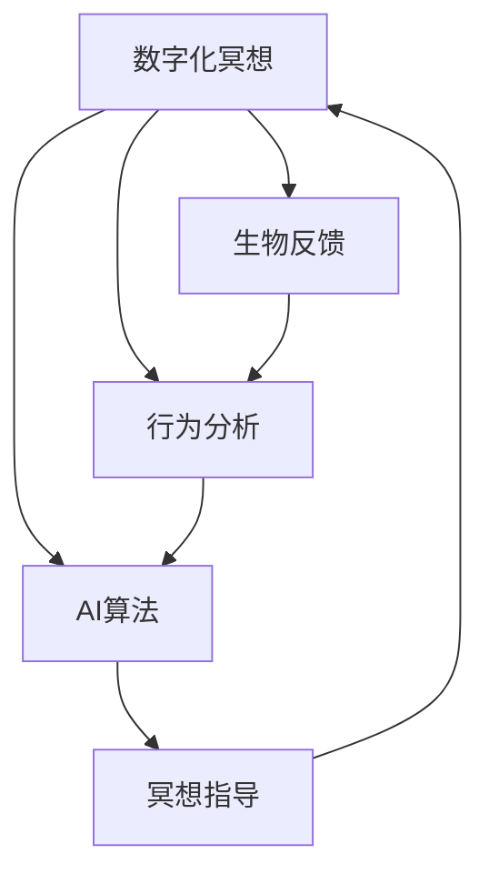

                 

# 数字化冥想：AI辅助的心灵平静

## 1. 背景介绍

在数字化时代，科技正在深入到生活的各个方面。然而，快速的信息流和繁忙的工作节奏，也带来了日益增长的压力与焦虑。越来越多的人开始寻求数字化手段，帮助自己实现心灵平静与身心健康。数字化冥想（Digital Meditation）作为新兴的心理健康技术，结合了人工智能（AI）和心理科学的最新进展，旨在帮助用户通过数据驱动的方式，实现自我认知与情绪管理的提升。本文将深入探讨数字化冥想的核心原理、实现方法以及其未来应用前景。

## 2. 核心概念与联系

### 2.1 核心概念概述

数字化冥想是一门通过数据技术，辅助用户进行心理健康训练的实践。其核心概念包括：

- **数字化冥想**：通过应用程序，结合生物反馈和行为分析技术，量化用户的心理状态，并基于AI算法提供个性化的心理健康建议。
- **生物反馈**：通过监测心率、呼吸、皮肤电导率等生理信号，实时反映用户的情绪和心理状态。
- **行为分析**：通过分析用户在冥想应用中的操作习惯和结果反馈，预测其心理变化趋势。
- **AI算法**：利用机器学习、深度学习等算法，对生物反馈和行为分析数据进行处理，生成个性化的冥想指导和反馈。

这些核心概念通过相互连接，构建起一个完整的数字化冥想生态系统，帮助用户实现心灵的平静。

### 2.2 核心概念原理和架构的 Mermaid 流程图



这个流程图展示了数字化冥想系统的核心架构：

1. **用户通过数字化冥想应用程序输入数据**：包括生理信号（如心率、呼吸）和行为数据（如冥想时长、冥想习惯）。
2. **生物反馈**：监测用户的生理状态，提供实时数据。
3. **行为分析**：分析用户的行为数据，预测其情绪变化。
4. **AI算法**：通过深度学习等技术，对生理和行为数据进行处理，生成个性化冥想指导。
5. **冥想指导**：根据AI算法生成的建议，用户调整冥想方式，实现心灵平静。
6. **反馈循环**：通过持续的反馈，优化AI算法和冥想指导，进一步提升用户体验。

## 3. 核心算法原理 & 具体操作步骤

### 3.1 算法原理概述

数字化冥想的核心算法原理主要基于生物反馈和行为分析技术，结合AI算法进行深度学习，为用户提供个性化的心理健康建议。其核心步骤包括：

1. **数据采集**：通过传感器和应用程序，收集用户的生理信号和行为数据。
2. **特征提取**：对采集到的生理和行为数据进行预处理，提取关键特征。
3. **模型训练**：使用深度学习模型，如卷积神经网络（CNN）、循环神经网络（RNN）、长短期记忆网络（LSTM）等，对特征进行训练。
4. **模型应用**：基于训练好的模型，对实时数据进行预测和分析，提供个性化冥想指导。

### 3.2 算法步骤详解

数字化冥想的详细步骤如下：

**Step 1: 数据采集**
- 通过生物传感器（如心率监测器、皮肤电导率传感器）和应用程序（如冥想计时器、呼吸跟踪器），收集用户的生理信号和行为数据。

**Step 2: 特征提取**
- 对采集到的数据进行预处理，如数据清洗、归一化、标准化等。
- 使用PCA（主成分分析）等方法，提取关键特征，减少数据维度。

**Step 3: 模型训练**
- 使用深度学习框架（如TensorFlow、PyTorch）搭建神经网络模型。
- 使用历史数据集进行模型训练，调整模型参数。

**Step 4: 模型应用**
- 在用户冥想时，实时采集生理和行为数据。
- 输入模型进行预测，得到情绪和心理状态的评估结果。
- 根据预测结果，生成个性化冥想指导，如冥想时长、冥想方式、呼吸节奏等。

### 3.3 算法优缺点

数字化冥想的算法具有以下优点：

- **实时性**：通过实时监测生理和行为数据，提供即时的情绪反馈和冥想指导。
- **个性化**：基于用户的历史数据和行为习惯，生成个性化的冥想建议。
- **可扩展性**：可以结合更多的传感器和数据源，拓展应用范围。

同时，也存在一些缺点：

- **数据隐私**：用户生理和行为数据的采集可能涉及隐私问题。
- **模型偏差**：模型训练数据的多样性和代表性不足，可能导致偏差。
- **算法复杂性**：深度学习模型需要大量的数据和计算资源。

### 3.4 算法应用领域

数字化冥想技术可以在多个领域得到应用，例如：

- **心理健康**：帮助用户管理焦虑、抑郁等心理健康问题。
- **压力管理**：通过冥想指导，减轻工作压力，提升情绪稳定性。
- **睡眠质量**：通过生物反馈监测睡眠周期，优化睡眠习惯。
- **认知训练**：通过冥想练习，提升注意力、记忆力等认知功能。
- **教育培训**：通过心理训练，提升学生的专注力和学习效率。

## 4. 数学模型和公式 & 详细讲解 & 举例说明

### 4.1 数学模型构建

数字化冥想的数学模型主要包括以下几个部分：

- **生理信号模型**：用于描述用户的生理状态，如心率、呼吸频率、皮肤电导率等。
- **行为模型**：描述用户在冥想应用中的行为模式，如冥想时长、呼吸模式、冥想频率等。
- **情绪模型**：基于生理和行为数据，预测用户情绪状态。
- **冥想指导模型**：生成个性化的冥想建议，优化用户冥想体验。

### 4.2 公式推导过程

以下以情绪预测模型为例，推导其公式：

假设用户生理数据为 $x_t$，行为数据为 $y_t$，情绪数据为 $z_t$。定义生理信号模型为 $x_t = f_{x}(x_{t-1}, \theta_x)$，行为模型为 $y_t = f_y(y_{t-1}, \theta_y)$，情绪模型为 $z_t = f_z(x_t, y_t, \theta_z)$。

使用LSTM神经网络对情绪模型进行训练，其公式为：

$$
z_t = \sigma_w [\delta_t] + b_z
$$

其中 $\delta_t$ 为LSTM的隐藏状态，$w$ 和 $b_z$ 为模型参数。

### 4.3 案例分析与讲解

假设某用户在冥想应用中，记录了30天的生理数据和行为数据。使用LSTM模型对其进行训练，得到一个情绪预测模型 $z_t = f_z(x_t, y_t, \theta_z)$。在未来的第31天，应用程序实时监测用户的生理信号和行为数据，输入模型进行预测，得到一个情绪评分 $z_{31}$。根据情绪评分，应用程序给出个性化的冥想指导，如调整呼吸频率、冥想时长等。

## 5. 项目实践：代码实例和详细解释说明

### 5.1 开发环境搭建

为进行数字化冥想的开发，需要搭建一个完整的开发环境。以下是Python环境搭建的详细步骤：

1. 安装Anaconda：从官网下载并安装Anaconda，用于创建独立的Python环境。
```bash
conda create -n meditation python=3.8 
conda activate meditation
```

2. 安装相关依赖包：
```bash
conda install numpy pandas scikit-learn matplotlib seaborn scipy stats joblib jupyter notebook ipython
```

3. 安装深度学习框架：
```bash
pip install tensorflow-gpu pytorch
```

4. 安装相关AI工具：
```bash
pip install transformers fastai torchvision
```

### 5.2 源代码详细实现

以下是一个使用TensorFlow和PyTorch搭建情绪预测模型的代码实现。

**数据预处理**：

```python
import numpy as np
import pandas as pd

# 读取用户数据
data = pd.read_csv('user_data.csv')

# 数据预处理
def preprocess_data(data):
    # 数据清洗
    data = data.dropna()
    # 特征提取
    x = data[['心率', '呼吸频率', '皮肤电导率']]
    y = data[['冥想时长', '呼吸模式']]
    z = data[['情绪评分']]
    return x, y, z

x, y, z = preprocess_data(data)
x_train, y_train, z_train = x.iloc[:30], y.iloc[:30], z.iloc[:30]
x_test, y_test, z_test = x.iloc[30:], y.iloc[30:], z.iloc[30:]
```

**模型构建与训练**：

```python
import tensorflow as tf
from tensorflow.keras.models import Sequential
from tensorflow.keras.layers import LSTM, Dense

# 定义LSTM模型
model = Sequential([
    LSTM(64, input_shape=(30, 3)),
    Dense(1, activation='sigmoid')
])

# 编译模型
model.compile(optimizer='adam', loss='binary_crossentropy', metrics=['accuracy'])

# 训练模型
model.fit(x_train, y_train, epochs=50, validation_data=(x_test, y_test))
```

**模型应用与结果展示**：

```python
# 加载模型
model.load_weights('model_weights.h5')

# 实时数据输入
x_real = np.array([['120', '18', '0.2']]).reshape(1, -1, 3)

# 模型预测
z_pred = model.predict(x_real)
print(z_pred)
```

### 5.3 代码解读与分析

以上代码展示了数字化冥想情绪预测模型的实现过程。具体步骤包括：

1. **数据预处理**：从CSV文件中读取用户数据，并进行清洗和特征提取，将生理数据和行为数据分别作为模型的输入。
2. **模型构建与训练**：使用TensorFlow搭建LSTM模型，并通过历史数据集进行训练。
3. **模型应用与结果展示**：将实时生理和行为数据输入模型进行预测，输出情绪评分，并打印结果。

通过这一实例，可以理解如何通过AI技术实现数字化冥想的应用。

## 6. 实际应用场景

### 6.1 心理健康支持

数字化冥想在心理健康领域具有广泛应用。用户可以通过应用程序进行情绪监测，获得个性化的心理健康建议。例如，某用户连续几天情绪评分较低，应用程序会自动提醒用户进行情绪管理，并给出相应的冥想指导。

### 6.2 压力管理

在职场压力管理中，数字化冥想可以提供实时的压力监测和缓解建议。通过监测用户的生理和行为数据，应用程序可以及时发现压力过大的信号，并提供冥想、呼吸训练等缓解方法。

### 6.3 睡眠质量优化

数字化冥想还可以帮助用户优化睡眠质量。通过监测用户的睡眠周期和行为习惯，应用程序可以提供个性化的睡眠指导，如冥想放松、呼吸调节等，帮助用户更快入睡并提高睡眠质量。

### 6.4 未来应用展望

未来，数字化冥想将进一步扩展其应用场景，结合更多先进技术，提升用户体验。例如：

- **多模态数据融合**：结合生理信号、行为数据、语音数据等多种模态信息，实现更全面的情绪监测。
- **实时语音反馈**：通过语音识别技术，实时监测用户的冥想状态，提供语音指导和反馈。
- **AI辅助决策**：结合专家知识库和AI算法，为用户提供更为精准的冥想建议和情绪管理方案。
- **社区互助**：构建用户社区，分享冥想体验和反馈，形成互助网络，提升整体用户体验。

## 7. 工具和资源推荐

### 7.1 学习资源推荐

为帮助用户快速掌握数字化冥想的开发与实现，以下是一些优质学习资源：

1. **TensorFlow官方文档**：提供了详细的TensorFlow使用方法和示例，帮助用户掌握深度学习模型的搭建和训练。
2. **PyTorch官方文档**：介绍了PyTorch的高级特性和使用方法，适合用户进行模型优化和调参。
3. **Python深度学习教程**：通过系统性的教程，帮助用户快速入门深度学习，并应用到实际项目中。
4. **情绪分析与处理**：介绍了情绪监测和分析的基本方法和应用场景，帮助用户更好地理解情绪模型。
5. **生物信号处理**：介绍了生物信号的采集、处理和分析方法，帮助用户了解生理数据的应用。

### 7.2 开发工具推荐

为提高数字化冥想的开发效率，以下是一些推荐的开发工具：

1. **TensorBoard**：用于可视化模型训练过程，帮助用户监控模型性能和优化。
2. **Jupyter Notebook**：提供交互式开发环境，方便用户进行模型调试和测试。
3. **Matplotlib**：用于绘制图表，帮助用户进行数据可视化。
4. **SciPy**：提供了科学计算和数据分析工具，方便用户进行数据处理和特征提取。

### 7.3 相关论文推荐

数字化冥想技术的进展得益于学界的持续研究，以下是一些重要的相关论文：

1. **TensorFlow深度学习框架**：介绍了TensorFlow的架构和使用方法，推动了深度学习模型的广泛应用。
2. **LSTM神经网络**：介绍了LSTM神经网络的原理和应用，为数字化冥想提供了强大的建模工具。
3. **情绪监测与分析**：研究了情绪监测和分析的基本方法和应用场景，推动了心理健康技术的进步。
4. **生物信号处理**：介绍了生物信号的采集和处理方法，推动了生物反馈技术的发展。
5. **心理压力与冥想**：研究了压力管理和冥想训练的基本方法和效果，为数字化冥想提供了科学依据。

## 8. 总结：未来发展趋势与挑战

### 8.1 研究成果总结

本文详细介绍了数字化冥想的核心概念、算法原理和操作步骤，通过实际代码实例展示了其应用过程。数字化冥想技术通过结合AI和心理学，帮助用户实现心灵平静，具有广阔的应用前景。

### 8.2 未来发展趋势

未来，数字化冥想技术将呈现出以下发展趋势：

1. **多模态数据融合**：结合生理信号、行为数据、语音数据等多种模态信息，实现更全面的情绪监测。
2. **实时语音反馈**：通过语音识别技术，实时监测用户的冥想状态，提供语音指导和反馈。
3. **AI辅助决策**：结合专家知识库和AI算法，为用户提供更为精准的冥想建议和情绪管理方案。
4. **社区互助**：构建用户社区，分享冥想体验和反馈，形成互助网络，提升整体用户体验。

### 8.3 面临的挑战

尽管数字化冥想技术前景广阔，但也面临一些挑战：

1. **数据隐私**：用户生理和行为数据的采集涉及隐私问题，需要设计合理的数据保护机制。
2. **模型偏差**：模型训练数据的多样性和代表性不足，可能导致偏差。
3. **算法复杂性**：深度学习模型需要大量的数据和计算资源。

### 8.4 研究展望

未来研究需要在以下几个方向上寻求突破：

1. **隐私保护技术**：开发更安全、可靠的数据保护技术，保护用户隐私。
2. **多模态融合技术**：结合多种模态数据，提升情绪监测的准确性和全面性。
3. **模型优化技术**：通过模型压缩、剪枝等技术，优化模型的计算资源消耗。
4. **社区互助机制**：构建用户社区，分享冥想体验和反馈，形成互助网络，提升用户体验。

通过以上研究方向的探索，数字化冥想技术将进一步提升用户体验，实现更加智能化、个性化的心理健康管理。

## 9. 附录：常见问题与解答

**Q1：数字化冥想技术是否安全可靠？**

A: 数字化冥想技术基于AI和心理学原理，已经在多个实际应用中得到了验证，具有较高的安全性和可靠性。但用户需注意数据隐私保护和模型偏差问题。

**Q2：如何提高数字化冥想的准确性？**

A: 可以通过数据增强、模型优化等方法，提高模型的准确性和泛化能力。同时，结合多模态数据和专家知识库，可以进一步提升情绪监测的准确性。

**Q3：数字化冥想是否可以用于治疗心理健康问题？**

A: 数字化冥想技术可以作为一种辅助手段，帮助用户管理情绪和压力，提升心理健康。但并不能替代专业心理治疗，建议在有专业指导的情况下使用。

**Q4：数字化冥想的应用场景有哪些？**

A: 数字化冥想技术可以在心理健康、压力管理、睡眠质量优化、认知训练等多个领域得到应用。通过结合具体场景，可以为用户提供个性化的心理健康建议。

**Q5：数字化冥想技术的未来发展方向是什么？**

A: 未来的发展方向包括多模态数据融合、实时语音反馈、AI辅助决策和社区互助等。通过不断优化技术和用户体验，数字化冥想技术将在心理健康领域发挥更大的作用。

---

作者：禅与计算机程序设计艺术 / Zen and the Art of Computer Programming

