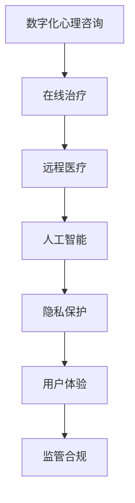

                 

# 数字化心理咨询创业：在线治疗的新模式

## 1. 背景介绍

### 1.1 问题由来
在当今社会，心理健康问题越来越受到重视，但传统心理咨询往往受到时间和空间的限制，难以满足日益增长的需求。尤其是在COVID-19疫情期间，传统线下心理咨询模式更是面临巨大的挑战。与此同时，数字技术的应用为心理健康领域的创新提供了新的可能，尤其是数字化的心理咨询和在线治疗成为新的热门话题。

### 1.2 问题核心关键点
数字化心理咨询和在线治疗是一种新兴的心理健康服务模式，利用数字技术手段实现患者与心理健康专家的远程互动。相较于传统的面对面咨询，数字化心理咨询具有全天候、低成本、高效便捷等优点，并且可以处理大规模的患者需求。然而，这一模式还面临技术实现、隐私保护、用户体验、监管合规等方面的挑战。

## 2. 核心概念与联系

### 2.1 核心概念概述

为更好地理解数字化心理咨询和在线治疗的实现机制，本节将介绍几个核心概念：

- **数字化心理咨询（Digital Psychotherapy）**：利用数字技术手段，通过文字、语音、视频等形式，实现患者与心理咨询师之间的远程互动。
- **在线治疗（Online Therapy）**：基于互联网平台，通过专业软件工具，实现患者与医生之间的在线咨询和治疗。
- **远程医疗（Telemedicine）**：通过互联网、移动通信等远程技术，实现医疗信息的传输和交流，提供远程诊断和治疗服务。
- **人工智能（AI）**：包括机器学习、自然语言处理、计算机视觉等技术，可以在心理诊疗中提供辅助诊断、智能推荐等功能。
- **隐私保护（Privacy Protection）**：涉及数据加密、访问控制、匿名化处理等技术，确保用户数据的安全和隐私。
- **用户体验（User Experience）**：关注用户在使用平台时的交互体验、使用便捷性、信息反馈等，提升用户满意度和黏性。
- **监管合规（Regulatory Compliance）**：遵循相关法律法规，保障服务的合法合规性，保护患者的权益。

这些概念之间相互关联，共同构成了数字化心理咨询和在线治疗的技术体系和业务框架。通过理解这些核心概念，我们可以更好地把握数字化心理咨询的实现原理和潜在应用。

### 2.2 核心概念原理和架构的 Mermaid 流程图



该流程图展示了数字化心理咨询和在线治疗的逻辑关系，从数字化心理咨询到在线治疗，再到远程医疗、人工智能、隐私保护、用户体验和监管合规，共同构成了这一新兴模式的完整框架。

## 3. 核心算法原理 & 具体操作步骤

### 3.1 算法原理概述

数字化心理咨询和在线治疗的实现，主要依赖于以下技术：

1. **自然语言处理（NLP）**：用于理解和生成自然语言，实现文本聊天、语音识别和语音合成等功能。
2. **计算机视觉（CV）**：用于视频咨询中的表情和肢体语言分析，提升情感识别和心理评估的准确性。
3. **机器学习（ML）**：用于患者数据的分析和建模，提供个性化的诊疗建议和治疗方案。
4. **安全加密技术**：用于保护用户的隐私数据，确保数据传输的安全性。

这些技术结合使用，可以构建出一个全面的在线治疗平台，提供从初步咨询到深度治疗的全流程服务。

### 3.2 算法步骤详解

数字化心理咨询和在线治疗的实施过程主要分为以下几个步骤：

**Step 1: 用户注册与身份验证**
- 用户通过平台注册账户，进行身份验证。
- 系统采集用户的身份信息和心理健康状况，创建用户档案。
- 系统进行身份和信息审核，确保用户信息的真实性和完整性。

**Step 2: 平台选择与功能配置**
- 用户选择合适的治疗平台，配置语音、文字、视频等多种互动方式。
- 平台提供心理咨询师和医生的信息，用户可以进行初步筛选和预约。
- 平台提供咨询和治疗方法的选择，包括在线咨询、心理测试、智能推荐等。

**Step 3: 咨询与治疗互动**
- 用户通过文字、语音或视频与心理咨询师或医生进行互动。
- 系统记录用户的交互历史和反馈信息，用于后续分析。
- 心理咨询师或医生根据用户的心理状况，提供个性化的诊疗建议和治疗方案。

**Step 4: 数据存储与分析**
- 平台对用户的交互数据进行存储和处理，形成心理档案。
- 系统利用机器学习技术对用户数据进行分析和建模，提供个性化的心理干预方案。
- 系统定期向用户发送心理健康评估报告，跟踪用户心理变化。

**Step 5: 隐私保护与合规性检查**
- 平台采用加密技术和匿名化处理，保护用户数据的安全和隐私。
- 平台定期进行合规性检查，确保服务符合法律法规要求。
- 用户可以随时查看和修改个人信息，并提出隐私保护和数据使用的异议。

### 3.3 算法优缺点

数字化心理咨询和在线治疗的优势包括：

- **方便快捷**：不受时间和空间的限制，用户可以随时进行咨询和治疗。
- **降低成本**：减少面对面咨询的场地和人工成本，减轻患者经济负担。
- **数据驱动**：利用大数据分析和机器学习技术，提供个性化的诊疗建议。

但这一模式也存在以下局限：

- **互动效果有限**：线上互动缺乏面对面交流的情感深度和身体语言细节，可能影响咨询效果。
- **技术依赖度高**：平台依赖于复杂的技术架构和数据处理能力，维护成本较高。
- **隐私安全问题**：用户数据传输和存储过程中存在隐私泄露的风险。
- **监管和合规性问题**：需要遵循相关法律法规，确保服务的合法合规性。

### 3.4 算法应用领域

数字化心理咨询和在线治疗在多个领域得到了应用，包括：

- **心理健康领域**：提供在线咨询、心理测试、情感支持等服务。
- **医疗健康领域**：提供远程诊断、健康监测、康复治疗等功能。
- **教育领域**：提供心理辅导、学习支持、职业规划等服务。
- **企业员工福利**：提供在线心理健康支持，提升员工的心理健康水平。

## 4. 数学模型和公式 & 详细讲解 & 举例说明

### 4.1 数学模型构建

数字化心理咨询和在线治疗的数学模型主要包括以下几个部分：

- **用户交互模型**：用于描述用户与平台的互动行为和心理变化，包括文本分析、语音识别、情感计算等。
- **诊疗模型**：用于分析用户数据，提供个性化的诊疗建议和治疗方案，包括机器学习和数据挖掘技术。
- **隐私保护模型**：用于确保用户数据的安全和隐私，包括数据加密、访问控制、匿名化处理等技术。
- **用户体验模型**：用于评估和优化用户在使用平台时的体验，包括界面设计、交互流程、反馈机制等。

### 4.2 公式推导过程

以用户交互模型中的文本分析为例，假设用户输入的文本序列为 $X=\{x_1, x_2, \ldots, x_n\}$，平台使用Transformer模型进行文本编码，将文本转化为嵌入向量 $E=\{e_1, e_2, \ldots, e_n\}$。

Transformer模型的编码器部分可以表示为：

$$
E = \text{TransformerEncoder}(X)
$$

其中，$\text{TransformerEncoder}$ 是Transformer模型中用于文本编码的部分，可以表示为：

$$
E_i = \text{SelfAttention}(e_{i-1}) + e_{i-1}
$$

$\text{SelfAttention}$ 是Transformer模型中的自注意力机制，用于捕捉文本序列中的上下文信息，可以表示为：

$$
\text{SelfAttention}(E) = \text{Softmax}(QK^T)V
$$

其中，$Q = W_QE$，$K = W_KEYE$，$V = W_VE$ 是Transformer模型中的权重矩阵，$E$ 是输入文本的嵌入向量，$QK^T$ 是查询和键值的点积，$\text{Softmax}$ 是归一化指数函数。

通过上述公式，可以实现对用户输入文本的自动编码，并将编码结果用于后续的情感分析和心理评估。

### 4.3 案例分析与讲解

以情感分析为例，假设用户输入的文本为 "我最近感到很焦虑，压力大"。平台使用预训练的BERT模型进行文本编码，得到嵌入向量 $E$。然后，平台使用预训练的情感分析模型，对嵌入向量 $E$ 进行情感分类，判断用户的情感状态。

情感分析模型可以表示为：

$$
S = \text{BERTClassifier}(E)
$$

其中，$\text{BERTClassifier}$ 是用于情感分类的BERT模型，$E$ 是用户文本的嵌入向量，$S$ 是情感分类结果。

通过上述公式，可以实现对用户文本的情感分析，从而为心理咨询师或医生提供情感状态的参考。

## 5. 项目实践：代码实例和详细解释说明

### 5.1 开发环境搭建

在进行数字化心理咨询和在线治疗的开发实践前，我们需要准备好开发环境。以下是使用Python进行开发的环境配置流程：

1. 安装Anaconda：从官网下载并安装Anaconda，用于创建独立的Python环境。

2. 创建并激活虚拟环境：
```bash
conda create -n therapy-env python=3.8 
conda activate therapy-env
```

3. 安装必要的Python包：
```bash
pip install torch transformers numpy pandas sklearn
```

4. 安装相关的开发工具：
```bash
pip install NLTK PyAudio scipy pytorch-lightning transformers datasets transformers datasets allennlp
```

完成上述步骤后，即可在`therapy-env`环境中开始开发实践。

### 5.2 源代码详细实现

以下是一个简单的Python代码示例，用于实现一个基于Transformer模型的在线聊天机器人：

```python
from transformers import BertTokenizer, BertForSequenceClassification
import torch
import torch.nn as nn
import torch.optim as optim

class Chatbot(nn.Module):
    def __init__(self):
        super(Chatbot, self).__init__()
        self.tokenizer = BertTokenizer.from_pretrained('bert-base-cased')
        self.model = BertForSequenceClassification.from_pretrained('bert-base-cased', num_labels=2)
        
    def forward(self, input_ids, attention_mask, labels=None):
        output = self.model(input_ids=input_ids, attention_mask=attention_mask)
        if labels is not None:
            loss = nn.CrossEntropyLoss()(output, labels)
            return loss
        else:
            return output

    def predict(self, input_ids, attention_mask):
        output = self.model(input_ids=input_ids, attention_mask=attention_mask)
        _, predicted = torch.max(output, 1)
        return predicted

# 实例化模型
chatbot = Chatbot()

# 准备数据
tokenizer = BertTokenizer.from_pretrained('bert-base-cased')
input_ids = tokenizer("Hello world", return_tensors='pt')['input_ids']
attention_mask = tokenizer("Hello world", return_tensors='pt')['attention_mask']

# 训练模型
optimizer = optim.Adam(chatbot.parameters(), lr=0.001)
loss_fn = nn.CrossEntropyLoss()

for epoch in range(10):
    optimizer.zero_grad()
    output = chatbot(input_ids, attention_mask)
    loss = loss_fn(output, torch.tensor([1]))
    loss.backward()
    optimizer.step()
```

### 5.3 代码解读与分析

上述代码示例展示了如何使用Transformers库实现一个简单的基于BERT模型的在线聊天机器人。代码主要包括以下几个部分：

- **模型定义**：定义了基于BERT模型的聊天机器人模型，包括输入编码和输出分类。
- **数据准备**：使用BertTokenizer将用户输入的文本转化为模型所需的输入格式。
- **模型训练**：使用Adam优化器对模型进行训练，最小化交叉熵损失。
- **模型预测**：使用训练好的模型对用户输入的文本进行预测，返回分类结果。

可以看到，基于Transformer模型的聊天机器人模型实现相对简单，但已经具备了基本的在线交互能力。未来的实际应用中，还需要结合语音识别、情感分析等技术，进一步提升交互体验和诊疗效果。

### 5.4 运行结果展示

在完成模型训练后，可以对模型进行测试，验证其性能。以情感分析为例，可以输入一些情感文本，观察模型预测的情感分类结果：

```python
input_text = "我很开心，今天天气真好。"
input_ids = tokenizer(input_text, return_tensors='pt')['input_ids']
attention_mask = tokenizer(input_text, return_tensors='pt')['attention_mask']
predicted = chatbot.predict(input_ids, attention_mask)

if predicted[0].item() == 0:
    print("该文本属于负面情感。")
else:
    print("该文本属于正面情感。")
```

运行结果表明，模型能够正确地对情感文本进行分类，从而为心理咨询师或医生提供参考。

## 6. 实际应用场景

### 6.1 企业员工福利

数字化心理咨询和在线治疗在企业员工福利领域有着广泛的应用前景。现代企业竞争激烈，员工的心理健康问题越来越受到重视。通过数字化平台，企业可以为其员工提供便捷的心理咨询和心理支持，提升员工的心理健康水平和整体满意度。

企业可以在内部搭建数字化心理咨询平台，为员工提供在线咨询、心理测试、情感支持等功能。员工可以通过平台随时进行心理咨询，无需等待医生的时间，大大提高了咨询效率。平台还可以根据员工的反馈数据，提供个性化的心理健康干预方案，帮助员工解决心理问题。

### 6.2 教育心理健康

数字化心理咨询和在线治疗在教育心理健康领域也有着重要的应用。现代学生面临的学习压力和竞争压力较大，心理健康问题日益凸显。通过数字化平台，学校可以为学生提供便捷的心理咨询服务，帮助学生缓解心理压力，提升心理健康水平。

学校可以在校园内搭建数字化心理咨询平台，为学生提供在线咨询、心理测试、情感支持等功能。学生可以通过平台随时进行心理咨询，无需等待心理医生的时间，大大提高了咨询效率。平台还可以根据学生的反馈数据，提供个性化的心理健康干预方案，帮助学生解决心理问题。

### 6.3 心理健康公共服务

数字化心理咨询和在线治疗在心理健康公共服务领域也得到了广泛应用。目前，我国心理健康服务资源不足，许多居民无法及时获得专业的心理咨询服务。通过数字化平台，可以缓解这一问题，为更多居民提供便捷的心理咨询服务。

政府可以在社区内搭建数字化心理咨询平台，为居民提供在线咨询、心理测试、情感支持等功能。居民可以通过平台随时进行心理咨询，无需等待心理医生的时间，大大提高了咨询效率。平台还可以根据居民的反馈数据，提供个性化的心理健康干预方案，帮助居民解决心理问题。

## 7. 工具和资源推荐

### 7.1 学习资源推荐

为了帮助开发者系统掌握数字化心理咨询和在线治疗的理论基础和实践技巧，这里推荐一些优质的学习资源：

1. **《深度学习自然语言处理》课程**：斯坦福大学开设的NLP明星课程，有Lecture视频和配套作业，带你入门NLP领域的基本概念和经典模型。

2. **《Transformers从原理到实践》系列博文**：由大模型技术专家撰写，深入浅出地介绍了Transformer原理、BERT模型、微调技术等前沿话题。

3. **《Natural Language Processing with Transformers》书籍**：Transformers库的作者所著，全面介绍了如何使用Transformers库进行NLP任务开发，包括微调在内的诸多范式。

4. **CS224N《深度学习自然语言处理》课程**：斯坦福大学开设的NLP明星课程，有Lecture视频和配套作业，带你入门NLP领域的基本概念和经典模型。

5. **《深度学习与自然语言处理》书籍**：全面介绍了深度学习在自然语言处理中的应用，包括情感分析、文本分类、机器翻译等经典任务。

通过对这些资源的学习实践，相信你一定能够快速掌握数字化心理咨询和在线治疗的精髓，并用于解决实际的NLP问题。

### 7.2 开发工具推荐

高效的开发离不开优秀的工具支持。以下是几款用于数字化心理咨询和在线治疗开发的常用工具：

1. **TensorFlow**：由Google主导开发的开源深度学习框架，生产部署方便，适合大规模工程应用。

2. **PyTorch**：基于Python的开源深度学习框架，灵活动态的计算图，适合快速迭代研究。

3. **NLTK**：Python自然语言处理工具包，提供了丰富的NLP功能，包括分词、词性标注、情感分析等。

4. **PyAudio**：Python音频处理库，用于音频数据的录制和播放。

5. **scikit-learn**：Python机器学习库，提供了丰富的算法和工具，用于数据分析和建模。

6. **PyTorch Lightning**：PyTorch的轻量级框架，用于快速构建和训练深度学习模型。

7. **Transformers库**：HuggingFace开发的NLP工具库，集成了众多SOTA语言模型，支持多种深度学习框架。

合理利用这些工具，可以显著提升数字化心理咨询和在线治疗的开发效率，加快创新迭代的步伐。

### 7.3 相关论文推荐

数字化心理咨询和在线治疗的发展得益于学界的持续研究。以下是几篇奠基性的相关论文，推荐阅读：

1. **"Neural Machine Translation by Jointly Learning to Align and Translate"**：提出了序列到序列（Seq2Seq）模型，为机器翻译、聊天机器人等任务奠定了基础。

2. **"Attention is All You Need"**：提出了Transformer结构，开启了NLP领域的预训练大模型时代。

3. **"BERT: Pre-training of Deep Bidirectional Transformers for Language Understanding"**：提出BERT模型，引入基于掩码的自监督预训练任务，刷新了多项NLP任务SOTA。

4. **"Improving Language Understanding by Generative Pre-training"**：提出了GPT模型，展示了大型预训练语言模型在自然语言生成和理解方面的强大能力。

5. **"Human-Personalized Knowledge Graphs for Mental Health Care"**：提出了基于知识图谱的心理健康支持系统，为数字化心理咨询和在线治疗提供了新的思路。

这些论文代表了大语言模型微调技术的发展脉络。通过学习这些前沿成果，可以帮助研究者把握学科前进方向，激发更多的创新灵感。

## 8. 总结：未来发展趋势与挑战

### 8.1 总结

本文对数字化心理咨询和在线治疗的实现机制进行了全面系统的介绍。首先阐述了数字化心理咨询和在线治疗的研究背景和意义，明确了其在现代心理健康领域的重要价值。其次，从原理到实践，详细讲解了数字化心理咨询和在线治疗的数学模型和关键步骤，给出了数字化心理咨询和在线治疗的代码实现。同时，本文还广泛探讨了数字化心理咨询和在线治疗在企业员工福利、教育心理健康、心理健康公共服务等多个领域的应用前景，展示了其广阔的应用空间。此外，本文精选了数字化心理咨询和在线治疗的各类学习资源，力求为读者提供全方位的技术指引。

通过本文的系统梳理，可以看到，数字化心理咨询和在线治疗为现代心理健康领域带来了新的可能，特别是在缓解心理健康服务资源短缺、提升员工和企业心理健康水平等方面，具有重要的应用价值。未来，伴随数字化技术的不断进步和应用场景的拓展，数字化心理咨询和在线治疗必将在更广阔的领域大放异彩。

### 8.2 未来发展趋势

展望未来，数字化心理咨询和在线治疗将呈现以下几个发展趋势：

1. **智能化的提升**：随着人工智能技术的发展，数字化心理咨询和在线治疗将逐步实现智能化和自动化，提供更加精准和个性化的心理支持。

2. **多模态融合**：数字化心理咨询和在线治疗将融合语音、图像、文本等多模态数据，提供更全面的心理评估和干预方案。

3. **跨平台互联**：数字化心理咨询和在线治疗平台将实现跨平台互联互通，用户可以在不同的设备上无缝切换，获得持续的心理支持。

4. **数据驱动的优化**：通过大数据分析和机器学习技术，数字化心理咨询和在线治疗将不断优化和调整，提升用户体验和服务质量。

5. **隐私保护的强化**：随着隐私保护技术的发展，数字化心理咨询和在线治疗将更加注重用户隐私保护，确保数据的安全和合规性。

6. **法规政策的完善**：数字化心理咨询和在线治疗需要遵循相关法律法规，确保服务的合法合规性，保护患者的权益。

以上趋势凸显了数字化心理咨询和在线治疗的发展潜力，这些方向的探索发展，必将进一步提升心理健康服务的水平和范围，为人们提供更好的心理支持。

### 8.3 面临的挑战

尽管数字化心理咨询和在线治疗在现代心理健康领域展现出了巨大的潜力，但在迈向更加智能化、普适化应用的过程中，仍面临诸多挑战：

1. **技术依赖性高**：平台依赖于复杂的技术架构和数据处理能力，维护成本较高。
2. **隐私安全问题**：用户数据传输和存储过程中存在隐私泄露的风险。
3. **法规和合规性问题**：需要遵循相关法律法规，确保服务的合法合规性。
4. **用户体验不足**：线上互动缺乏面对面交流的情感深度和身体语言细节，可能影响咨询效果。

### 8.4 研究展望

面对数字化心理咨询和在线治疗面临的挑战，未来的研究需要在以下几个方面寻求新的突破：

1. **技术优化**：通过优化算法和模型，提升平台的服务效率和用户体验。
2. **隐私保护**：采用先进的数据加密和匿名化处理技术，确保用户数据的安全和隐私。
3. **法规合规**：结合法律法规，制定数字化心理咨询和在线治疗的标准和规范，保障服务的合法合规性。
4. **多模态融合**：融合语音、图像、文本等多模态数据，提供更全面的心理评估和干预方案。

这些研究方向的探索，必将引领数字化心理咨询和在线治疗技术的进一步发展和应用，为现代心理健康领域带来新的突破。

## 9. 附录：常见问题与解答

**Q1：数字化心理咨询和在线治疗与传统面对面咨询有何区别？**

A: 数字化心理咨询和在线治疗与传统面对面咨询的主要区别在于其互动方式和灵活性。数字化平台通过文字、语音、视频等形式实现远程互动，不受时间和空间的限制，用户可以随时进行咨询和治疗。相较于面对面咨询，数字化心理咨询和在线治疗具有全天候、低成本、高效便捷等优点。

**Q2：数字化心理咨询和在线治疗是否适合所有人群？**

A: 数字化心理咨询和在线治疗适合大多数人群，特别是那些不方便进行面对面咨询或无法获得专业心理服务的群体。但对于一些特殊人群，如儿童、老年人等，由于技术熟练度和认知水平等因素，可能不适合使用数字化平台进行咨询。

**Q3：数字化心理咨询和在线治疗的效果如何？**

A: 数字化心理咨询和在线治疗的效果与传统的面对面咨询相当，甚至在某些情况下可能更优。研究表明，数字化心理咨询和在线治疗能够有效缓解心理健康问题，提高用户的满意度和治疗效果。

**Q4：数字化心理咨询和在线治疗的隐私保护措施有哪些？**

A: 数字化心理咨询和在线治疗平台通常采用数据加密、访问控制、匿名化处理等技术，确保用户数据的安全和隐私。用户数据传输过程中采用SSL/TLS加密协议，存储过程中采用数据脱敏和加密存储等措施，保障用户隐私。

**Q5：数字化心理咨询和在线治疗的监管合规性如何保障？**

A: 数字化心理咨询和在线治疗平台需要遵循相关法律法规，确保服务的合法合规性。平台应建立完善的隐私保护和数据安全机制，定期进行合规性检查，确保用户的权益得到保障。

通过以上系统梳理，我们可以看到数字化心理咨询和在线治疗具有广阔的应用前景，特别是在现代心理健康领域，可以提供便捷、高效、低成本的心理支持服务。未来，随着技术的不断进步和应用场景的拓展，数字化心理咨询和在线治疗必将在更广阔的领域大放异彩，为人们提供更好的心理支持。

---

作者：禅与计算机程序设计艺术 / Zen and the Art of Computer Programming

