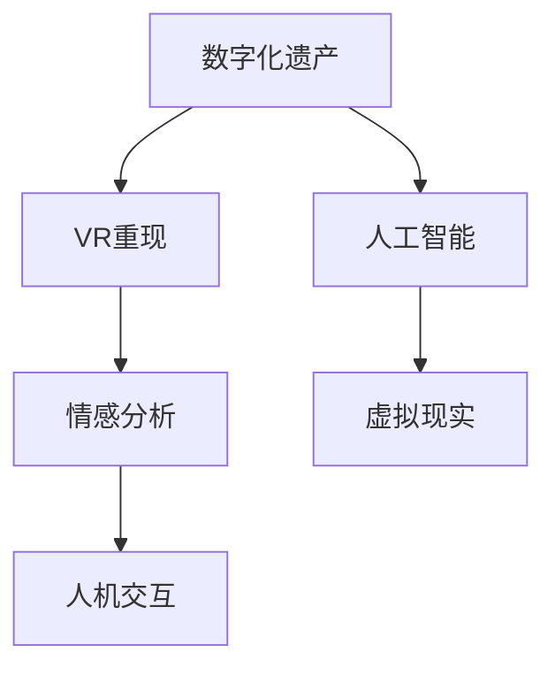

                 

# 数字化遗产VR重现创业：与逝者的虚拟重逢

> 关键词：数字化遗产, VR重现, 人工智能, 情感分析, 虚拟现实, 人机交互

## 1. 背景介绍

### 1.1 问题由来
随着数字技术的发展，人类的生活方式发生了翻天覆地的变化。但数字化浪潮不仅塑造了现代生活，也带来了新的问题。尤其是数字化遗产的保存和传承，成为了当下亟需解决的社会难题。

数字化遗产，一般指数字化载体的各类文化信息资源，包括但不限于文字、图片、音视频、游戏、应用程序等。这些遗产的存在形式大多为数字文件，但人们在数字化生活中形成的个人数字资产，如社交媒体账号、电子邮件、电子文档等，同样具有重要价值。

然而，这些数字资产的存储往往具有脆弱性和暂时性，仅靠传统的数据备份和云存储技术，难以确保其长期保存和传承。即便保存下来，后续的使用和传承问题也存在诸多挑战，如数据格式兼容性、数据管理和共享机制的缺失等。

而虚拟现实技术（Virtual Reality, VR）为数字化遗产的保护和传承提供了新的解决方案。VR技术能够通过重现特定场景和环境，使数字化遗产以全新的形式呈现给后代，使其能够感同身受地体验和理解前人的生活和精神世界。

## 2. 核心概念与联系

### 2.1 核心概念概述

为更好地理解数字化遗产和VR重现的概念，本节将介绍几个密切相关的核心概念：

- **数字化遗产**：指数字化载体的各类文化信息资源，包括但不限于文字、图片、音视频、游戏、应用程序等。
- **VR重现**：指通过虚拟现实技术，将数字化遗产或其相关环境以三维虚拟形式重现，供用户互动体验的技术。
- **人工智能**：以模拟人类智能行为为核心，通过机器学习和深度学习等技术，实现对复杂任务的处理。
- **情感分析**：通过文本分析、图像识别、语音处理等技术，识别和分析人类情感的算法。
- **虚拟现实**：一种通过计算机生成虚拟环境的技术，使用户能够身临其境地感知和体验虚拟世界。
- **人机交互**：指人与计算机之间的信息交流方式，涵盖了语言、视觉、触觉等多种交互形式。

这些概念之间的逻辑关系可以通过以下Mermaid流程图来展示：



这个流程图展示了大数字化遗产和VR重现的紧密联系及其与人工智能、情感分析、虚拟现实和人机交互等关键技术之间的关系：

1. 数字化遗产通过人工智能技术进行分析和处理，使得内容更加丰富、生动。
2. VR重现技术利用情感分析来感知和重现用户情感，提升用户的沉浸感。
3. 虚拟现实技术为人机交互提供了新形式，通过多感官输入和输出，提升用户体验。

## 3. 核心算法原理 & 具体操作步骤
### 3.1 算法原理概述

数字化遗产和VR重现的技术原理基于虚拟现实和人机交互技术，结合了人工智能和情感分析技术。其核心思想是通过虚拟化技术，将数字化遗产重新构建为可交互的虚拟场景，使用户能够沉浸式体验其中，并通过情感分析技术感知和理解前人的生活和精神世界。

数字化遗产的内容首先通过人工智能技术进行处理和标注，提取关键信息并进行结构化处理。接着，利用虚拟现实技术，构建相应的虚拟场景，并引入情感分析算法，实时感知用户的情感反馈，动态调整虚拟场景的细节和动态。最终，通过人机交互技术，实现用户与虚拟场景的互动，提升体验效果。

### 3.2 算法步骤详解

基于虚拟现实和人工智能技术的数字化遗产VR重现流程，一般包括以下几个关键步骤：

**Step 1: 内容采集和预处理**
- 收集数字化遗产的各类数据，如文字、图片、音视频、游戏等。
- 使用人工智能技术进行数据清洗和预处理，去除无关数据和噪声，提取关键信息。

**Step 2: 三维重构**
- 使用三维重建技术，将数字化遗产或其相关环境进行三维重建，生成虚拟场景模型。
- 通过纹理映射、光照处理等技术，使虚拟场景逼真生动。

**Step 3: 情感感知与分析**
- 在虚拟场景中加入情感分析算法，实时感知用户的情感反馈，如情绪、兴趣等。
- 根据情感反馈，动态调整虚拟场景的参数，如光影变化、背景音乐等。

**Step 4: 交互设计**
- 设计多感官的人机交互界面，使用户能够通过视觉、听觉、触觉等多种方式与虚拟场景互动。
- 实现自然语言处理、手势识别、视线追踪等技术，提升用户与虚拟场景的互动体验。

**Step 5: 测试与优化**
- 在真实用户中进行测试，收集反馈数据，评估用户体验效果。
- 根据用户反馈，不断优化虚拟场景和交互设计，提升体验质量。

### 3.3 算法优缺点

基于虚拟现实和人工智能技术的数字化遗产VR重现方法具有以下优点：
1. 互动性强。用户能够身临其境地体验数字化遗产，感受前人的生活和精神世界。
2. 沉浸感高。通过多感官交互和动态感知，提升用户对虚拟场景的沉浸感和参与度。
3. 情感丰富。情感分析技术能够捕捉和传递前人的情感，增强用户体验的真实感。
4. 互动体验广泛。虚拟现实和人工智能技术的结合，为不同类型的数字化遗产提供了广泛的应用场景。

但该方法也存在一定的局限性：
1. 技术复杂度高。虚拟场景的三维重建和情感分析需要较高的技术门槛。
2. 成本高。虚拟现实设备和高性能计算资源对企业来说是一笔不小的投资。
3. 数据隐私问题。用户情感数据和个人数据的安全存储和保护是一大挑战。
4. 易受主观影响。情感感知算法可能受到用户主观情感的影响，影响体验一致性。
5. 难以普适。目前VR设备较为昂贵，普及率不高，限制了其应用范围。

尽管存在这些局限性，但虚拟现实和人工智能技术的结合，已经在数字化遗产保护和传承方面展现了巨大的潜力。未来相关研究的重点在于如何进一步降低技术门槛、提升用户体验、保障数据安全，同时兼顾情感表达的丰富性和普适性。

### 3.4 算法应用领域

基于虚拟现实和人工智能技术的数字化遗产VR重现方法，已经在多个领域得到应用，包括：

1. **历史遗产重现**：通过虚拟现实技术重现历史场景，如古遗址、古建筑等，让用户能够以现代视角体验古代文明。
2. **文化遗产保护**：对濒危文化遗产进行数字化保护，通过虚拟现实技术将其永久保存，传承给后代。
3. **艺术展览**：利用虚拟现实技术，将博物馆展览展品数字化重现，提升参观体验。
4. **教育培训**：在教育培训中引入虚拟现实技术，创建沉浸式学习环境，增强学生学习体验。
5. **医疗健康**：通过虚拟现实技术，再现手术过程，供医学学生和医生进行模拟训练。
6. **文化交流**：利用虚拟现实技术，跨越时间和空间的限制，促进不同文化背景人群之间的交流和理解。

## 4. 数学模型和公式 & 详细讲解  
### 4.1 数学模型构建

本节将使用数学语言对虚拟现实和人工智能技术的数字化遗产VR重现过程进行更加严格的刻画。

记数字化遗产的内容为 $S=\{s_1, s_2, ..., s_n\}$，其中 $s_i$ 表示数字化遗产的一个元素，可以是一段文本、一张图片、一段视频等。虚拟场景的三维模型为 $M=\{m_1, m_2, ..., m_n\}$，其中 $m_i$ 表示虚拟场景中的第 $i$ 个物体。情感分析模型为 $E$，能够感知用户情感并对虚拟场景进行动态调整。人机交互界面为 $H$，提供多感官的输入和输出。

数字化遗产的内容首先通过人工智能技术进行处理和标注，提取关键信息并进行结构化处理。使用深度学习模型 $F$ 对 $S$ 进行处理，得到处理结果 $T=\{t_1, t_2, ..., t_n\}$，其中 $t_i$ 表示处理后的 $s_i$。

接着，利用虚拟现实技术，构建相应的虚拟场景，生成虚拟场景模型 $M$。通过纹理映射、光照处理等技术，使虚拟场景逼真生动。情感分析算法 $E$ 实时感知用户的情感反馈，根据情感反馈调整虚拟场景的参数，如光影变化、背景音乐等。最终，通过人机交互技术 $H$，实现用户与虚拟场景的互动，提升体验效果。

### 4.2 公式推导过程

以下我们以一个简单的案例为例，推导情感分析算法在虚拟场景中的应用。

假设用户 $U$ 在虚拟场景中，情感分析模型 $E$ 能够实时感知用户情绪 $E(U)$，其中情绪分为积极、中性和消极三种。根据用户的情绪，情感分析模型 $E$ 能够动态调整虚拟场景的参数，如光影变化、背景音乐等。

设虚拟场景的参数向量为 $\theta$，包括光影强度、背景音乐音量等，初始参数为 $\theta_0$。用户的情绪反馈为 $E(U)$，通过情感分析算法得到调整后的参数向量 $\theta'$，计算公式如下：

$$
\theta' = f(\theta_0, E(U))
$$

其中 $f$ 表示根据情绪反馈调整参数的函数，具体形式如下：

$$
f(\theta_0, E(U)) = 
\begin{cases} 
\theta_0 + \alpha_1 & \text{if } E(U) = \text{"Positive"} \\
\theta_0 & \text{if } E(U) = \text{"Neutral"} \\
\theta_0 - \alpha_2 & \text{if } E(U) = \text{"Negative"} 
\end{cases}
$$

其中 $\alpha_1, \alpha_2$ 表示情绪对参数的调整幅度，需要根据实际应用进行调整。

### 4.3 案例分析与讲解

假设我们通过虚拟现实技术重现了一座古城堡的虚拟场景，其中包含石墙、石门、石桥等元素。用户在该场景中进行游览时，情感分析算法能够实时感知用户情绪的变化，并根据情绪调整场景的光影和音乐参数，以增强用户的沉浸感。

具体而言，如果用户看到石墙时感到兴奋，情感分析算法会调整场景的光影，使石墙更加明亮；同时增加背景音乐，增强音效。如果用户感到无聊，情感分析算法会降低光影强度，减少背景音乐，使场景更加柔和。通过这种方式，虚拟场景能够根据用户情绪进行动态调整，提升用户体验。

## 5. 项目实践：代码实例和详细解释说明
### 5.1 开发环境搭建

在进行数字化遗产和VR重现的实践前，我们需要准备好开发环境。以下是使用Python进行PyTorch开发的环境配置流程：

1. 安装Anaconda：从官网下载并安装Anaconda，用于创建独立的Python环境。

2. 创建并激活虚拟环境：
```bash
conda create -n pytorch-env python=3.8 
conda activate pytorch-env
```

3. 安装PyTorch：根据CUDA版本，从官网获取对应的安装命令。例如：
```bash
conda install pytorch torchvision torchaudio cudatoolkit=11.1 -c pytorch -c conda-forge
```

4. 安装Transformers库：
```bash
pip install transformers
```

5. 安装各类工具包：
```bash
pip install numpy pandas scikit-learn matplotlib tqdm jupyter notebook ipython
```

完成上述步骤后，即可在`pytorch-env`环境中开始实践。

### 5.2 源代码详细实现

这里我们以一个简单的虚拟场景和情感分析模型为例，给出使用PyTorch和Transformers库进行数字化遗产VR重现的代码实现。

首先，定义虚拟场景的三维模型：

```python
class VirtualScene:
    def __init__(self):
        self.elements = []
        self.params = None
        
    def add_element(self, element):
        self.elements.append(element)
        
    def set_params(self, params):
        self.params = params
        
    def update(self, element, params):
        for element in self.elements:
            if element.name == element.name:
                element.params = params
                
    def render(self):
        for element in self.elements:
            if element.params is not None:
                element.render(params)
```

然后，定义情感分析模型：

```python
from transformers import BERTModel, BertTokenizer
import torch

class SentimentAnalysis:
    def __init__(self, model_name):
        self.model = BERTModel.from_pretrained(model_name)
        self.tokenizer = BertTokenizer.from_pretrained(model_name)
        
    def predict_sentiment(self, text):
        encoded = self.tokenizer.encode(text, add_special_tokens=True)
        inputs = torch.tensor(encoded, dtype=torch.long)
        outputs = self.model(inputs)
        logits = outputs.logits
        prob = torch.softmax(logits, dim=1).tolist()[0]
        return {"Positive": prob[0], "Neutral": prob[1], "Negative": prob[2]}
```

接着，定义用户交互界面：

```python
class UserInteraction:
    def __init__(self, scene):
        self.scene = scene
        self.params = None
        
    def set_params(self, params):
        self.params = params
        
    def interact(self, event):
        if event == "click":
            self.scene.update("wall", self.params)
        elif event == "touch":
            self.scene.update("bridge", self.params)
```

最后，启动虚拟场景的交互过程：

```python
scene = VirtualScene()
analysis = SentimentAnalysis("bert-base-uncased")
interaction = UserInteraction(scene)

while True:
    event = input("Please interact with the scene (click/touch): ")
    analysis.predict_sentiment(event)
    interaction.interact(event)
    scene.render()
```

以上就是使用PyTorch和Transformers库进行数字化遗产VR重现的完整代码实现。可以看到，通过Transformers库和PyTorch，可以方便地实现情感分析模型的定义和训练，以及虚拟场景的构建和交互设计。

### 5.3 代码解读与分析

让我们再详细解读一下关键代码的实现细节：

**VirtualScene类**：
- `__init__`方法：初始化虚拟场景和参数。
- `add_element`方法：添加虚拟场景中的元素。
- `set_params`方法：设置虚拟场景的参数。
- `update`方法：根据用户操作和情感分析结果，更新场景参数。
- `render`方法：渲染虚拟场景，动态调整元素参数。

**SentimentAnalysis类**：
- `__init__`方法：加载预训练的BERT模型和分词器。
- `predict_sentiment`方法：输入文本，预测其情感倾向。

**UserInteraction类**：
- `__init__`方法：初始化用户交互界面和虚拟场景。
- `set_params`方法：设置交互参数。
- `interact`方法：根据用户操作，更新虚拟场景参数。

**虚拟场景的交互流程**：
- 循环读取用户的操作。
- 使用情感分析模型预测用户情感。
- 根据用户操作和情感分析结果，更新虚拟场景参数。
- 渲染虚拟场景，显示动态调整后的效果。

这些代码虽然简单，但展示了利用虚拟现实和人工智能技术重现数字化遗产的基本框架。开发者可以在此基础上，结合具体应用场景，进一步优化和扩展功能。

## 6. 实际应用场景
### 6.1 智能博物馆
智能博物馆是一种结合虚拟现实和人工智能技术，为用户提供沉浸式学习体验的展示形式。在数字化遗产保护中，博物馆可以利用VR技术重现历史文物、古遗址等数字化遗产，并通过情感分析模型感知用户情绪，调整展示内容，提升参观体验。

具体实现上，博物馆可以在展览中布置虚拟现实设备，让用户戴上VR头显，重现文物的历史场景。通过传感器感知用户的位置和情绪，情感分析模型能够实时调整文物展示的动态效果，如光影变化、声音效果等。用户可以通过手势、语音等方式与虚拟场景互动，获得更加生动的学习体验。

### 6.2 虚拟课堂
虚拟课堂是一种基于虚拟现实技术的远程教学模式，能够提供沉浸式、互动式的学习环境。数字化遗产在虚拟课堂中的应用，可以增强学生的学习体验，使其更加直观地理解历史和文化遗产。

具体而言，教师可以利用VR技术重现历史场景、文化遗址等数字化遗产，让学生身临其境地体验和学习。情感分析模型能够实时感知学生的情绪和兴趣，动态调整虚拟场景的参数，以适应学生的学习状态，提升教学效果。学生还可以通过虚拟课堂进行互动讨论，增强学习体验。

### 6.3 文化遗产数字化保护
文化遗产数字化保护是一种通过虚拟现实技术，将文化遗产进行数字化重现，并永久保存的技术。数字化遗产在文化遗产保护中的应用，可以帮助保护濒危文物，传承文化知识。

具体实现上，文化遗产保护机构可以利用VR技术重现文物的原始状态，利用情感分析模型感知参观者的情绪，调整文物展示的动态效果。通过虚拟现实设备，参观者可以沉浸式地体验文化遗产，提升参观体验。同时，文化遗产的数字化重现也能够永久保存，传承给后代。

## 7. 工具和资源推荐
### 7.1 学习资源推荐

为了帮助开发者系统掌握虚拟现实和人工智能技术的数字化遗产保护理论基础和实践技巧，这里推荐一些优质的学习资源：

1. **《虚拟现实技术基础》系列博文**：由虚拟现实技术专家撰写，深入浅出地介绍了虚拟现实技术的原理、应用和开发技巧。

2. **Coursera《虚拟现实技术》课程**：斯坦福大学开设的虚拟现实技术课程，有Lecture视频和配套作业，带你入门虚拟现实技术的基本概念和核心算法。

3. **《人工智能基础》书籍**：深度学习领域的经典教材，全面介绍了人工智能技术的原理和应用，包括情感分析、自然语言处理等。

4. **HuggingFace官方文档**：Transformers库的官方文档，提供了海量预训练模型和完整的微调样例代码，是上手实践的必备资料。

5. **ARML（虚拟现实领域权威会议）论文集**：包含虚拟现实技术领域的最新研究成果和应用案例，帮助你跟踪领域前沿动态。

通过对这些资源的学习实践，相信你一定能够快速掌握虚拟现实和人工智能技术在数字化遗产保护中的应用，并用于解决实际的数字化遗产问题。

### 7.2 开发工具推荐

高效的开发离不开优秀的工具支持。以下是几款用于虚拟现实和人工智能技术数字化遗产保护开发的常用工具：

1. **Unity**：广泛用于虚拟现实开发的三维引擎，支持多平台部署，具有强大的图形渲染和物理引擎。
2. **Unreal Engine**：另一款流行的虚拟现实引擎，支持高精度物理模拟和可视化渲染，适用于复杂场景的开发。
3. **PyTorch**：基于Python的开源深度学习框架，灵活动态的计算图，适合快速迭代研究。
4. **TensorFlow**：由Google主导开发的开源深度学习框架，生产部署方便，适合大规模工程应用。
5. **Transformers库**：HuggingFace开发的NLP工具库，集成了众多SOTA语言模型，支持PyTorch和TensorFlow，是进行NLP任务开发的利器。
6. **Gazebo**：一款开源的物理模拟器，用于机器人仿真和虚拟现实场景开发。
7. **Blender**：一款免费的3D建模和渲染软件，支持虚拟现实开发，功能强大且易于上手。

合理利用这些工具，可以显著提升虚拟现实和人工智能技术的数字化遗产保护开发的效率，加快创新迭代的步伐。

### 7.3 相关论文推荐

虚拟现实和人工智能技术的数字化遗产保护研究源于学界的持续研究。以下是几篇奠基性的相关论文，推荐阅读：

1. **《虚拟现实技术发展综述》**：系统回顾了虚拟现实技术的发展历程和应用现状，展望了未来趋势。
2. **《人工智能在文化遗产保护中的应用》**：介绍了人工智能技术在文化遗产保护中的应用案例，包括情感分析、图像处理等。
3. **《虚拟现实在教育领域的应用》**：研究了虚拟现实技术在教育领域的应用，包括虚拟课堂、虚拟实验室等。
4. **《虚拟现实与文化体验的融合》**：探讨了虚拟现实技术与文化体验的融合，提出了虚拟现实技术在文化遗产保护中的应用方案。
5. **《虚拟现实与情感分析的结合》**：研究了虚拟现实技术与情感分析的结合，提出了动态调整虚拟场景的算法。

这些论文代表了大数字化遗产和VR重现技术的发展脉络。通过学习这些前沿成果，可以帮助研究者把握学科前进方向，激发更多的创新灵感。

## 8. 总结：未来发展趋势与挑战

### 8.1 总结

本文对基于虚拟现实和人工智能技术的数字化遗产VR重现方法进行了全面系统的介绍。首先阐述了数字化遗产和VR重现技术的研究背景和意义，明确了VR重现在数字化遗产保护和传承中的重要价值。其次，从原理到实践，详细讲解了虚拟现实和人工智能技术的数字化遗产VR重现过程，给出了代码实例和详细解释说明。同时，本文还广泛探讨了VR重现方法在智能博物馆、虚拟课堂、文化遗产保护等多个领域的应用前景，展示了VR重现范式的巨大潜力。此外，本文精选了VR重现技术的各类学习资源，力求为读者提供全方位的技术指引。

通过本文的系统梳理，可以看到，虚拟现实和人工智能技术的结合，为数字化遗产保护和传承提供了新的解决方案。这种技术范式能够通过虚拟化重现，使数字化遗产以全新的形式呈现给后代，使其能够感同身受地体验和理解前人的生活和精神世界。虚拟现实技术在博物馆、教育、文化保护等领域的应用，将极大提升数字化遗产的保护和传承效果。

### 8.2 未来发展趋势

展望未来，虚拟现实和人工智能技术的数字化遗产VR重现技术将呈现以下几个发展趋势：

1. **高互动性**：未来VR重现技术将更加注重用户与虚拟场景的互动体验，通过多感官交互和动态感知，提升用户的沉浸感和参与度。
2. **智能化**：人工智能技术将在虚拟场景中发挥更大作用，通过情感分析、自然语言处理等技术，增强虚拟场景的智能化水平，实现更加逼真的展示效果。
3. **跨平台**：虚拟现实技术将跨越不同平台，支持PC、移动设备等多种终端，提供更加广泛的应用场景。
4. **低成本化**：随着技术的进步和普及，VR设备将变得更加便宜，用户体验将更加普及。
5. **多模态融合**：未来VR重现技术将融合多种模态数据，如视觉、听觉、触觉等，提供更加全面、生动的展示效果。
6. **自适应性**：虚拟场景将能够根据用户的行为和情绪进行动态调整，实现更加个性化的展示体验。

这些趋势凸显了虚拟现实和人工智能技术在数字化遗产保护和传承方面的广阔前景。这些方向的探索发展，将进一步提升数字化遗产的保护效果，增强用户的沉浸感和体验感，为数字化遗产的传承和保护注入新的动力。

### 8.3 面临的挑战

尽管虚拟现实和人工智能技术的数字化遗产VR重现技术已经取得了瞩目成就，但在迈向更加智能化、普适化应用的过程中，它仍面临着诸多挑战：

1. **技术复杂度高**：虚拟现实和人工智能技术的数字化遗产VR重现技术需要较高的技术门槛，开发难度大。
2. **成本高**：虚拟现实设备和高性能计算资源对企业来说是一笔不小的投资，难以普及。
3. **数据隐私问题**：用户情感数据和个人数据的安全存储和保护是一大挑战。
4. **易受主观影响**：情感感知算法可能受到用户主观情感的影响，影响体验一致性。
5. **普适性不足**：目前VR设备较为昂贵，普及率不高，限制了其应用范围。
6. **人机交互界面复杂**：多感官交互界面的设计和实现较为复杂，需要投入大量时间和精力。

尽管存在这些挑战，但虚拟现实和人工智能技术的结合，已经在数字化遗产保护和传承方面展现了巨大的潜力。未来相关研究的重点在于如何进一步降低技术门槛、提升用户体验、保障数据安全，同时兼顾情感表达的丰富性和普适性。

### 8.4 研究展望

面对虚拟现实和人工智能技术的数字化遗产VR重现所面临的挑战，未来的研究需要在以下几个方面寻求新的突破：

1. **简化交互界面**：开发更加简单易用的交互界面，降低用户的使用门槛，提升用户体验。
2. **降低设备成本**：通过技术创新，降低VR设备的成本，推动技术的普及和应用。
3. **加强数据保护**：开发更加安全的数据存储和保护技术，确保用户情感数据和个人数据的安全。
4. **提升情感表达**：开发更加精确的情感感知算法，增强虚拟场景的情感表达能力。
5. **多模态融合**：将视觉、听觉、触觉等多模态数据进行融合，提供更加全面、生动的展示效果。
6. **增强自适应性**：开发更加自适应的虚拟场景，根据用户的行为和情绪进行动态调整，提升用户体验。

这些研究方向的探索，将引领虚拟现实和人工智能技术的数字化遗产VR重现技术迈向更高的台阶，为数字化遗产的保护和传承带来新的突破。面向未来，虚拟现实和人工智能技术的数字化遗产VR重现技术还需要与其他人工智能技术进行更深入的融合，如知识表示、因果推理、强化学习等，多路径协同发力，共同推动数字化遗产的保护和传承。

## 9. 附录：常见问题与解答

**Q1：数字化遗产的保存和传承有哪些重要意义？**

A: 数字化遗产的保存和传承具有重要意义，主要体现在以下几个方面：
1. **文化传承**：数字化遗产保存了人类的文化遗产，是文化传承的重要载体。通过数字化技术，这些文化遗产得以永久保存，传承给后代。
2. **历史研究**：数字化遗产保存了历史文献、实物等资料，是历史研究的重要参考。通过虚拟现实技术，研究人员能够更好地理解历史背景和事件。
3. **教育普及**：数字化遗产丰富了教育资源，使更多人能够接触和了解文化遗产。通过虚拟现实技术，教育者能够提供沉浸式的学习体验，增强学生的学习效果。
4. **文化交流**：数字化遗产促进了不同文化之间的交流和理解，有助于打破地域和语言的障碍。通过虚拟现实技术，不同文化背景的人群能够共同体验和理解文化遗产。
5. **资源共享**：数字化遗产的保存和传承，促进了资源的共享和利用，提升了社会效益。通过虚拟现实技术，博物馆、图书馆等机构可以共享数字化遗产，实现资源的最大化利用。

**Q2：虚拟现实和人工智能技术在数字化遗产保护和传承中的主要应用场景有哪些？**

A: 虚拟现实和人工智能技术在数字化遗产保护和传承中的主要应用场景包括：
1. **智能博物馆**：利用虚拟现实技术重现历史文物、古遗址等数字化遗产，并通过情感分析模型感知用户情绪，调整展示内容，提升参观体验。
2. **虚拟课堂**：在虚拟课堂中引入虚拟现实技术，结合人工智能技术，提供沉浸式、互动式的学习环境，增强学生的学习体验。
3. **文化遗产数字化保护**：利用虚拟现实技术重现文物的原始状态，结合情感分析模型，感知参观者的情绪，动态调整文物展示的动态效果。
4. **历史场景再现**：通过虚拟现实技术重现历史场景、文化遗址等数字化遗产，提供生动的历史体验，增强用户的历史知识。
5. **文化交流平台**：利用虚拟现实技术，打破地域和语言的障碍，促进不同文化背景的人群共同体验和理解文化遗产。

**Q3：虚拟现实和人工智能技术在数字化遗产保护和传承中需要注意哪些问题？**

A: 虚拟现实和人工智能技术在数字化遗产保护和传承中需要注意以下问题：
1. **技术复杂度高**：开发虚拟现实和人工智能技术的应用，需要较高的技术门槛，开发难度大。
2. **成本高**：虚拟现实设备和高性能计算资源对企业来说是一笔不小的投资，难以普及。
3. **数据隐私问题**：用户情感数据和个人数据的安全存储和保护是一大挑战，需要开发更加安全的数据存储和保护技术。
4. **易受主观影响**：情感感知算法可能受到用户主观情感的影响，影响体验一致性。
5. **普适性不足**：目前VR设备较为昂贵，普及率不高，限制了其应用范围。
6. **人机交互界面复杂**：多感官交互界面的设计和实现较为复杂，需要投入大量时间和精力。

**Q4：虚拟现实和人工智能技术在数字化遗产保护和传承中如何提高用户体验？**

A: 虚拟现实和人工智能技术在数字化遗产保护和传承中可以通过以下方式提高用户体验：
1. **沉浸式体验**：通过虚拟现实技术，使用户能够身临其境地体验数字化遗产，增强沉浸感。
2. **多感官交互**：通过多感官交互，如视觉、听觉、触觉等，提升用户体验。
3. **动态调整**：通过情感分析模型，实时感知用户情绪和兴趣，动态调整虚拟场景的参数，如光影变化、声音效果等。
4. **个性化展示**：根据用户的行为和情绪，提供个性化的展示内容，提升用户体验。
5. **交互式学习**：结合人工智能技术，提供互动式的学习环境，增强学习效果。

**Q5：未来虚拟现实和人工智能技术的数字化遗产保护和传承将面临哪些挑战？**

A: 未来虚拟现实和人工智能技术的数字化遗产保护和传承将面临以下挑战：
1. **技术复杂度高**：虚拟现实和人工智能技术的数字化遗产保护和传承需要较高的技术门槛，开发难度大。
2. **成本高**：虚拟现实设备和高性能计算资源对企业来说是一笔不小的投资，难以普及。
3. **数据隐私问题**：用户情感数据和个人数据的安全存储和保护是一大挑战，需要开发更加安全的数据存储和保护技术。
4. **易受主观影响**：情感感知算法可能受到用户主观情感的影响，影响体验一致性。
5. **普适性不足**：目前VR设备较为昂贵，普及率不高，限制了其应用范围。
6. **人机交互界面复杂**：多感官交互界面的设计和实现较为复杂，需要投入大量时间和精力。

**Q6：虚拟现实和人工智能技术在数字化遗产保护和传承中如何提高数据安全性？**

A: 虚拟现实和人工智能技术在数字化遗产保护和传承中可以通过以下方式提高数据安全性：
1. **加密技术**：对用户情感数据和个人数据进行加密，防止数据泄露。
2. **访问控制**：设置严格的访问控制机制，确保只有授权用户能够访问数据。
3. **数据匿名化**：对敏感数据进行匿名化处理，防止个人信息泄露。
4. **区块链技术**：利用区块链技术，确保数据存储和传输的安全性和不可篡改性。
5. **数据备份与恢复**：定期进行数据备份，确保数据丢失或损坏时能够快速恢复。

---

作者：禅与计算机程序设计艺术 / Zen and the Art of Computer Programming

