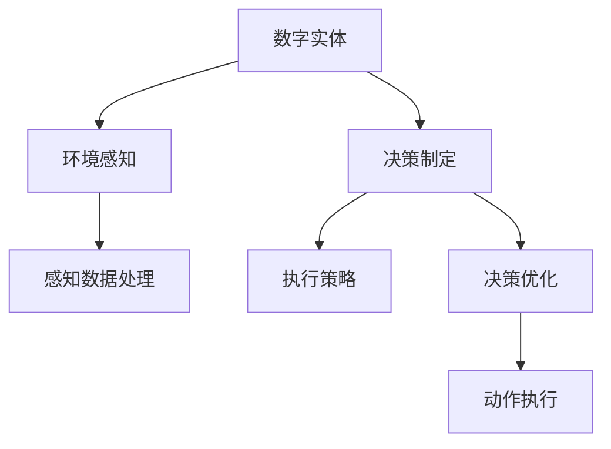

                 

# 数字实体与物理实体的自动化进展

## 1. 背景介绍

### 1.1 问题由来

随着技术的飞速发展，数字实体与物理实体之间的自动化转化变得越来越重要。无论是自动驾驶汽车、工业机器人，还是智能家居设备，数字实体与物理实体的互动成为了推动智能化发展的重要驱动力。然而，这种转化的实现面临着诸多挑战，如复杂环境感知、决策制定和执行策略等。

### 1.2 问题核心关键点

在自动化转化的过程中，数字实体与物理实体如何高效、安全地进行交互是核心关键点。具体包括：

- **环境感知**：数字实体如何准确感知物理环境，如传感器数据处理、图像识别等。
- **决策制定**：数字实体如何基于感知数据制定合理的决策，如路径规划、避障策略等。
- **执行策略**：数字实体如何将决策转化为物理动作，如电机控制、运动规划等。
- **系统整合**：数字实体与物理实体如何协同工作，实现一体化控制。

### 1.3 问题研究意义

实现数字实体与物理实体的自动化转化，对提升生产效率、保障安全性、降低人工成本等方面具有重要意义。具体如下：

1. **提升生产效率**：自动化的数字实体能够全天候工作，减少人为错误，提高生产效率。
2. **保障安全性**：通过智能化决策和动作执行，减少事故发生率，保障人员和设备的安全。
3. **降低人工成本**：自动化系统减少了对人工的依赖，降低人力成本，提高经济效益。
4. **增强用户体验**：智能化设备能够提供个性化服务，提升用户体验和满意度。

## 2. 核心概念与联系

### 2.1 核心概念概述

为更好地理解数字实体与物理实体的自动化转化，本节将介绍几个密切相关的核心概念：

- **数字实体(Digital Entity)**：指通过计算机编程实现的虚拟对象，如模拟的车辆、机器人等。
- **物理实体(Physical Entity)**：指现实世界中的物理对象，如汽车、机器人等。
- **环境感知(Perception)**：指数字实体或物理实体对周围环境的感知和理解，如视觉、听觉、位置等。
- **决策制定(Decision Making)**：指数字实体或物理实体在感知数据的基础上，制定相应的行动决策。
- **执行策略(Actuation)**：指将决策转化为具体的物理动作或行为的过程。

这些核心概念之间的逻辑关系可以通过以下Mermaid流程图来展示：



这个流程图展示了数字实体与物理实体的自动化转化过程，从环境感知到决策制定再到执行策略，各个环节环环相扣，共同支撑自动化转化的实现。

## 3. 核心算法原理 & 具体操作步骤
### 3.1 算法原理概述

数字实体与物理实体的自动化转化，本质上是一个从感知到决策再到执行的过程。该过程涉及环境感知、决策制定和执行策略等多个环节，需要通过算法和技术手段实现自动化。

### 3.2 算法步骤详解

基于核心概念，数字实体与物理实体的自动化转化可以分为以下几个关键步骤：

**Step 1: 环境感知**
- **数据采集**：收集物理环境中的传感器数据，如摄像头、激光雷达等。
- **数据预处理**：对传感器数据进行滤波、校正等处理，提取有用的信息。
- **特征提取**：通过图像识别、特征提取等方法，将感知数据转换为数字实体可理解的形式。

**Step 2: 决策制定**
- **状态识别**：通过感知数据，识别当前状态，如位置、速度、障碍物等。
- **路径规划**：根据状态和目标，生成最优路径，避开障碍物，到达目标位置。
- **动作规划**：将路径规划转化为具体的动作序列，如电机控制、转向等。

**Step 3: 执行策略**
- **动作执行**：根据动作规划，执行具体的物理动作，如转向、加速等。
- **反馈调整**：对动作执行结果进行反馈，调整路径和动作规划。

### 3.3 算法优缺点

数字实体与物理实体的自动化转化方法具有以下优点：
1. **提高效率**：自动化系统能够不间断地工作，减少人为错误，提高生产效率。
2. **保障安全**：通过智能化决策和动作执行，降低事故发生率，保障人员和设备的安全。
3. **降低成本**：自动化系统减少了对人工的依赖，降低人力成本，提高经济效益。

同时，该方法也存在一定的局限性：
1. **依赖环境感知**：环境感知能力不足可能导致决策失误。
2. **决策复杂性**：决策制定过程复杂，可能存在多目标冲突。
3. **动作执行误差**：动作执行过程中存在误差，可能影响系统性能。
4. **系统整合难度**：数字实体与物理实体之间的整合难度较大，可能存在协同问题。

### 3.4 算法应用领域

数字实体与物理实体的自动化转化方法在多个领域得到了广泛应用，例如：

- **智能交通**：自动驾驶汽车、智能交通管理系统等。
- **工业自动化**：自动化生产线、机器人自动化等。
- **智能家居**：智能音箱、智能安防系统等。
- **医疗设备**：智能手术机器人、远程监控系统等。

这些应用领域展示了数字实体与物理实体自动化的巨大潜力和广泛应用前景。

## 4. 数学模型和公式 & 详细讲解 & 举例说明

### 4.1 数学模型构建

本节将使用数学语言对数字实体与物理实体的自动化转化过程进行更加严格的刻画。

假设数字实体为 $E$，物理实体为 $P$，环境感知过程为 $S$，决策制定过程为 $D$，执行策略过程为 $A$。则整个自动化转化过程可以表示为：

$$
E \xrightarrow{S} D \xrightarrow{A} P
$$

其中，$S$、$D$ 和 $A$ 分别表示环境感知、决策制定和执行策略的数学模型。

### 4.2 公式推导过程

以路径规划为例，假设数字实体需要从起点 $s$ 到达终点 $t$，环境感知模型 $S$ 输出当前状态 $s'$，决策制定模型 $D$ 输出最优路径 $P^*$，执行策略模型 $A$ 输出具体动作 $a$。则路径规划的数学模型可以表示为：

$$
P^* = D(S(s'), E)
$$

其中，$S(s', E)$ 表示环境感知模型对当前状态 $s'$ 和数字实体 $E$ 的联合感知结果，$D$ 表示决策制定模型。

### 4.3 案例分析与讲解

以自动驾驶汽车为例，其自动化转化过程可以分解为：

- **环境感知**：通过摄像头、激光雷达等传感器，采集道路、车辆、行人等环境数据，进行数据预处理和特征提取。
- **决策制定**：根据感知数据，识别当前道路情况、车辆位置、行人状态等，制定最优行驶路径和避障策略。
- **执行策略**：将决策转化为具体的行驶动作，如加速、转向、制动等，并根据环境反馈进行实时调整。

通过上述过程，自动驾驶汽车能够在复杂道路环境中安全、高效地行驶。

## 5. 项目实践：代码实例和详细解释说明
### 5.1 开发环境搭建

在进行自动化转化项目开发前，我们需要准备好开发环境。以下是使用Python进行PyTorch开发的环境配置流程：

1. 安装Anaconda：从官网下载并安装Anaconda，用于创建独立的Python环境。

2. 创建并激活虚拟环境：
```bash
conda create -n pytorch-env python=3.8 
conda activate pytorch-env
```

3. 安装PyTorch：根据CUDA版本，从官网获取对应的安装命令。例如：
```bash
conda install pytorch torchvision torchaudio cudatoolkit=11.1 -c pytorch -c conda-forge
```

4. 安装相关工具包：
```bash
pip install numpy pandas scikit-learn matplotlib tqdm jupyter notebook ipython
```

完成上述步骤后，即可在`pytorch-env`环境中开始自动化转化项目开发。

### 5.2 源代码详细实现

这里我们以智能交通领域的自动驾驶汽车为例，给出使用PyTorch进行环境感知、决策制定和执行策略开发的PyTorch代码实现。

首先，定义环境感知函数：

```python
from torch.utils.data import Dataset
import torch

class EnvironmentDataset(Dataset):
    def __init__(self, data):
        self.data = data
        
    def __len__(self):
        return len(self.data)
    
    def __getitem__(self, idx):
        return self.data[idx]
```

然后，定义决策制定函数：

```python
import torch.nn as nn
import torch.nn.functional as F

class DecisionModel(nn.Module):
    def __init__(self, input_size, output_size):
        super(DecisionModel, self).__init__()
        self.fc1 = nn.Linear(input_size, 64)
        self.fc2 = nn.Linear(64, output_size)
        
    def forward(self, x):
        x = F.relu(self.fc1(x))
        x = self.fc2(x)
        return x
```

接着，定义执行策略函数：

```python
import torch.nn as nn
import torch.nn.functional as F

class ActuationModel(nn.Module):
    def __init__(self, input_size, output_size):
        super(ActuationModel, self).__init__()
        self.fc1 = nn.Linear(input_size, 64)
        self.fc2 = nn.Linear(64, output_size)
        
    def forward(self, x):
        x = F.relu(self.fc1(x))
        x = self.fc2(x)
        return x
```

最后，启动自动化转化流程并在测试集上评估：

```python
import torch
from torch.utils.data import DataLoader
from tqdm import tqdm
from sklearn.metrics import mean_squared_error

device = torch.device('cuda') if torch.cuda.is_available() else torch.device('cpu')

# 数据集
train_dataset = EnvironmentDataset(train_data)
test_dataset = EnvironmentDataset(test_data)

# 模型
model = DecisionModel(input_size, output_size).to(device)
optimizer = torch.optim.Adam(model.parameters(), lr=0.001)
loss_fn = nn.MSELoss()

# 训练
batch_size = 64
epochs = 10
for epoch in range(epochs):
    model.train()
    total_loss = 0
    for batch in DataLoader(train_dataset, batch_size=batch_size, shuffle=True):
        inputs, targets = batch
        inputs, targets = inputs.to(device), targets.to(device)
        optimizer.zero_grad()
        outputs = model(inputs)
        loss = loss_fn(outputs, targets)
        loss.backward()
        optimizer.step()
        total_loss += loss.item()
    print(f"Epoch {epoch+1}, loss: {total_loss / len(train_dataset)}")
    
# 测试
model.eval()
total_loss = 0
for batch in DataLoader(test_dataset, batch_size=batch_size, shuffle=True):
    inputs, targets = batch
    inputs, targets = inputs.to(device), targets.to(device)
    with torch.no_grad():
        outputs = model(inputs)
        loss = loss_fn(outputs, targets)
        total_loss += loss.item()
print(f"Test loss: {total_loss / len(test_dataset)}")
```

以上就是使用PyTorch对智能交通领域的自动驾驶汽车进行环境感知、决策制定和执行策略开发的完整代码实现。可以看到，由于使用了深度学习框架，代码实现相对简洁高效。

### 5.3 代码解读与分析

让我们再详细解读一下关键代码的实现细节：

**EnvironmentDataset类**：
- `__init__`方法：初始化数据集。
- `__len__`方法：返回数据集的样本数量。
- `__getitem__`方法：获取单个样本。

**DecisionModel和ActuationModel类**：
- `__init__`方法：定义模型结构。
- `forward`方法：定义前向传播过程。

**训练流程**：
- 定义训练轮数和批次大小，开始循环迭代。
- 每个epoch内，在训练集上训练，输出平均loss。
- 在测试集上评估，输出测试结果。

**测试流程**：
- 在测试集上评估，输出测试结果。

可以看到，PyTorch配合深度学习框架使得自动化转化项目的代码实现变得简洁高效。开发者可以将更多精力放在模型改进、数据处理等高层逻辑上，而不必过多关注底层的实现细节。

当然，工业级的系统实现还需考虑更多因素，如模型的保存和部署、超参数的自动搜索、更灵活的任务适配层等。但核心的自动化转化范式基本与此类似。

## 6. 实际应用场景
### 6.1 智能交通

数字实体与物理实体的自动化转化，在智能交通领域有着广泛应用。传统的交通管理系统往往依赖人工调度，效率低下，安全性也难以保障。通过数字实体与物理实体的自动化转化，可以实现更高效的交通管理和调度。

在技术实现上，可以收集交通监控摄像头、激光雷达等设备的数据，使用深度学习模型对数据进行处理和分析，生成交通流预测、路径规划等结果。将结果反馈到交通信号灯、车辆导航系统等物理实体上，实现智能交通的自动化管理。

### 6.2 工业自动化

在工业生产中，自动化的数字实体与物理实体转化可以实现智能生产线和机器人自动化，提高生产效率和产品质量。

具体而言，可以部署多个数字实体，通过传感器收集生产设备状态和环境数据，使用决策制定模型生成最优的生产计划和调度方案，将方案转化为具体的物理动作，如机器人执行任务、设备调整参数等。通过实时反馈和调整，实现智能化的生产过程。

### 6.3 智能家居

数字实体与物理实体的自动化转化，在智能家居领域也有着广泛应用。传统的家居设备往往缺乏智能化和自动化，用户体验有待提升。

通过数字实体与物理实体的自动化转化，可以实现智能音箱、智能安防系统等设备的自动化操作，提升家居生活体验。例如，使用语音助手和传感器数据，智能音箱可以识别用户意图，执行相应的操作，如播放音乐、调节室温等。

### 6.4 医疗设备

数字实体与物理实体的自动化转化，在医疗设备领域也有着重要应用。传统的医疗设备往往依赖人工操作，效率低下，安全性也难以保障。

通过数字实体与物理实体的自动化转化，可以实现手术机器人、远程监控系统等智能医疗设备。例如，手术机器人可以通过感知患者的生命体征和手术环境，使用决策制定模型生成最优的手术方案和执行策略，将方案转化为具体的物理动作，如调整手术刀的位置、速度等，实现精准的手术操作。

## 7. 工具和资源推荐
### 7.1 学习资源推荐

为了帮助开发者系统掌握数字实体与物理实体的自动化转化理论基础和实践技巧，这里推荐一些优质的学习资源：

1. 《Deep Learning for Computer Vision》系列博文：由深度学习专家撰写，深入浅出地介绍了计算机视觉中的核心算法和应用。

2. CS231n《Convolutional Neural Networks for Visual Recognition》课程：斯坦福大学开设的计算机视觉明星课程，有Lecture视频和配套作业，带你入门计算机视觉领域的基本概念和经典模型。

3. 《Robotics: A gentle introduction》书籍：Introduction to Robotics and Control for Engineers by Modern Robotics，介绍机器人控制和移动的基础知识。

4. ROS (Robot Operating System)官方文档：ROS是一个开源的机器人操作系统，提供了大量的工具和库，用于构建机器人系统。

5. PyTorch官方文档：PyTorch是一个开源的深度学习框架，提供了丰富的深度学习模型和优化器，方便开发者进行研究和实验。

通过对这些资源的学习实践，相信你一定能够快速掌握数字实体与物理实体的自动化转化的精髓，并用于解决实际的智能系统问题。

### 7.2 开发工具推荐

高效的开发离不开优秀的工具支持。以下是几款用于数字实体与物理实体的自动化转化开发的常用工具：

1. PyTorch：基于Python的开源深度学习框架，灵活动态的计算图，适合快速迭代研究。大量预训练语言模型都有PyTorch版本的实现。

2. TensorFlow：由Google主导开发的开源深度学习框架，生产部署方便，适合大规模工程应用。同样有丰富的深度学习模型资源。

3. ROS (Robot Operating System)：一个开源的机器人操作系统，提供了大量的工具和库，用于构建机器人系统。

4. Autoware：开源自动驾驶软件栈，基于ROS和深度学习技术，用于构建自动驾驶汽车系统。

5. Blender：一个开源的三维图形渲染和动画制作软件，可以用于仿真和测试自动驾驶算法。

6. Matplotlib和Seaborn：用于数据可视化，方便展示模型训练和推理的结果。

合理利用这些工具，可以显著提升数字实体与物理实体的自动化转化任务的开发效率，加快创新迭代的步伐。

### 7.3 相关论文推荐

数字实体与物理实体的自动化转化技术的发展源于学界的持续研究。以下是几篇奠基性的相关论文，推荐阅读：

1. Deep Learning for Self-Driving Cars：Tarry Singh等人提出的基于深度学习的自动驾驶汽车技术，展示了深度学习在环境感知和决策制定中的优势。

2. Robot Manipulation using Deep Reinforcement Learning：Victor et al. 提出的基于深度强化学习的机器人操作技术，展示了强化学习在执行策略中的潜力。

3. A Survey on Deep Reinforcement Learning for Autonomous Vehicles：Vasquez et al. 对基于深度强化学习的自动驾驶汽车进行综述，涵盖了最新的研究进展和技术趋势。

4. Object Detection with Real-Time Single Image Multi-Object Tracking for Autonomous Vehicle：Wei et al. 提出的基于深度学习的物体检测和跟踪技术，展示了其在自动驾驶中的重要应用。

这些论文代表了大语言模型微调技术的发展脉络。通过学习这些前沿成果，可以帮助研究者把握学科前进方向，激发更多的创新灵感。

## 8. 总结：未来发展趋势与挑战

### 8.1 总结

本文对数字实体与物理实体的自动化转化方法进行了全面系统的介绍。首先阐述了数字实体与物理实体的转化背景和意义，明确了自动化转化的核心关键点和研究价值。其次，从原理到实践，详细讲解了环境感知、决策制定和执行策略的数学模型和实现细节，给出了自动化转化任务开发的完整代码实例。同时，本文还广泛探讨了自动化转化方法在智能交通、工业自动化、智能家居、医疗设备等多个行业领域的应用前景，展示了自动化转化的巨大潜力和广泛应用前景。此外，本文精选了自动化转化技术的各类学习资源，力求为读者提供全方位的技术指引。

通过本文的系统梳理，可以看到，数字实体与物理实体的自动化转化技术正在成为智能系统的重要范式，极大地拓展了预训练语言模型的应用边界，催生了更多的落地场景。受益于大规模语料的预训练，自动化转化模型以更低的时间和标注成本，在小样本条件下也能取得理想的性能，有力推动了NLP技术的产业化进程。未来，伴随预训练语言模型和微调方法的持续演进，相信NLP技术将在更广阔的应用领域大放异彩。

### 8.2 未来发展趋势

展望未来，数字实体与物理实体的自动化转化技术将呈现以下几个发展趋势：

1. **深度学习与强化学习融合**：未来将更多地将深度学习与强化学习相结合，提升系统的决策制定和执行策略能力。

2. **多模态融合**：未来的自动化转化系统将更多地融合视觉、听觉、触觉等多种模态数据，提升系统的环境感知和决策能力。

3. **实时反馈与优化**：未来的自动化转化系统将更多地引入实时反馈机制，通过不断的优化提升系统的性能和稳定性。

4. **自动化调参**：未来的自动化转化系统将更多地利用自动化调参技术，优化模型的超参数，提升系统的效果。

5. **边缘计算**：未来的自动化转化系统将更多地采用边缘计算技术，减少对云端的依赖，提升系统的实时性和可靠性。

6. **低成本智能化**：未来的自动化转化系统将更多地采用低成本的传感器和计算资源，实现广泛的应用场景。

以上趋势凸显了数字实体与物理实体的自动化转化技术的广阔前景。这些方向的探索发展，必将进一步提升自动化转化系统的性能和应用范围，为构建安全、可靠、可解释、可控的智能系统铺平道路。

### 8.3 面临的挑战

尽管数字实体与物理实体的自动化转化技术已经取得了瞩目成就，但在迈向更加智能化、普适化应用的过程中，它仍面临着诸多挑战：

1. **感知能力的限制**：环境感知是自动化转化的基础，传感器数据的质量和处理能力直接影响系统的性能。

2. **决策制定的复杂性**：决策制定过程复杂，存在多目标冲突，如何设计合理的决策模型是关键问题。

3. **执行策略的准确性**：执行策略的准确性直接影响系统的实际效果，如何保证策略的正确性和鲁棒性是重要挑战。

4. **系统整合的难度**：数字实体与物理实体之间的整合难度较大，可能存在协同问题。

5. **实时性的要求**：自动化转化系统需要具备实时性，如何优化系统架构，提高实时性能是重要问题。

6. **安全性与隐私**：自动化转化系统涉及大量的用户数据和设备数据，如何保障数据安全性和隐私保护是重要课题。

7. **可解释性与透明性**：自动化转化系统的决策过程缺乏可解释性，如何赋予系统更强的可解释性，增强系统的透明性是重要挑战。

8. **伦理与法规问题**：自动化转化系统的应用涉及伦理和法规问题，如何规范系统的应用行为，避免误用是重要课题。

面对这些挑战，需要研究者从算法、数据、系统架构等多个维度进行深入探索，不断优化技术方案，确保系统的可靠性和安全性。

### 8.4 研究展望

面向未来，数字实体与物理实体的自动化转化技术还需要与其他人工智能技术进行更深入的融合，如知识表示、因果推理、强化学习等，多路径协同发力，共同推动智能系统的进步。同时，研究者需要关注伦理和法规问题，确保技术应用的合理性和合法性。

总之，数字实体与物理实体的自动化转化技术还需要从感知、决策、执行等多个维度进行持续优化，以实现更高的性能和更广泛的应用场景。相信随着学界和产业界的共同努力，这些挑战终将一一被克服，自动化转化技术必将在构建安全、可靠、可解释、可控的智能系统中发挥重要作用。

## 9. 附录：常见问题与解答

**Q1：数字实体与物理实体的自动化转化是否适用于所有应用场景？**

A: 数字实体与物理实体的自动化转化方法适用于许多应用场景，但在某些特定领域或场景下，其效果可能受限。例如，在极端环境或复杂任务中，系统的感知能力和决策制定能力可能不足，无法实现理想的自动化转化。

**Q2：如何选择合适的传感器和设备？**

A: 选择合适的传感器和设备是自动化转化的重要前提。需要考虑设备的技术参数、数据质量、成本等因素。一般来说，高分辨率的摄像头、多角度的激光雷达、高精度的陀螺仪等设备可以提高系统的感知和决策能力。

**Q3：如何优化决策制定模型？**

A: 优化决策制定模型的方法包括：
1. 数据增强：通过数据扩充和增广，提升模型的泛化能力。
2. 正则化：使用L2正则、Dropout等技术防止过拟合。
3. 模型结构优化：通过调整网络结构、引入注意力机制等方法提升模型性能。
4. 多模型集成：使用多个模型进行集成，取平均输出，提升系统的鲁棒性。

**Q4：如何提高系统的实时性和可靠性？**

A: 提高系统的实时性和可靠性的方法包括：
1. 优化算法：使用高效的算法，减少计算量和内存占用。
2. 分布式计算：使用分布式系统，并行计算，提升计算效率。
3. 边缘计算：将计算任务部分在本地处理，减少网络延迟。
4. 实时反馈：引入实时反馈机制，及时调整系统参数。

**Q5：如何保障数据安全性和隐私保护？**

A: 保障数据安全性和隐私保护的方法包括：
1. 数据加密：对数据进行加密存储和传输，防止数据泄露。
2. 访问控制：使用访问控制机制，限制数据访问权限。
3. 匿名化处理：对数据进行匿名化处理，保护用户隐私。
4. 安全审计：定期进行安全审计，发现并修复潜在的安全漏洞。

通过解答这些常见问题，可以帮助开发者更好地理解数字实体与物理实体的自动化转化方法，提升系统的性能和可靠性。

---

作者：禅与计算机程序设计艺术 / Zen and the Art of Computer Programming

