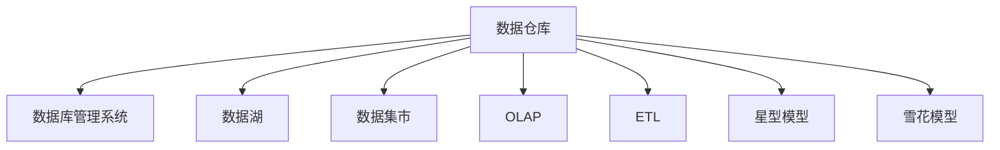

                 

# 数据仓库 原理与代码实例讲解

## 1. 背景介绍

### 1.1 问题由来
随着企业数据的不断增长，如何有效地存储、管理和分析这些数据，以支持企业的决策制定，成为了一个迫切需要解决的问题。传统的分散式数据库系统虽然能够满足一些基本的数据管理需求，但在处理大规模、复杂的数据分析任务时，却显得力不从心。因此，一种全新的数据管理模式——数据仓库应运而生。

### 1.2 问题核心关键点
数据仓库是一种专门用于存储和管理企业历史数据的系统。它通过将不同来源的数据进行集成和整理，形成一个统一、综合的数据存储平台，以支持复杂的数据分析任务，如数据挖掘、联机分析处理（OLAP）等。其核心价值在于能够为企业提供决策支持，帮助企业更好地理解业务，优化运营。

## 2. 核心概念与联系

### 2.1 核心概念概述

为更好地理解数据仓库的原理与实践，本节将介绍几个密切相关的核心概念：

- 数据仓库(Data Warehouse)：一种专门用于存储和管理企业历史数据的系统。通过将不同来源的数据进行集成和整理，形成一个统一、综合的数据存储平台，以支持复杂的数据分析任务。

- 数据库管理系统(DBMS)：用于管理和存储数据的系统，支持数据的增删改查等操作，是数据仓库的基础。

- 数据湖(Data Lake)：一种无需数据预处理的存储方式，可以存储任意格式、任意规模的数据，支持大数据分析。

- 数据集市(Data Mart)：根据特定的业务需求，从数据仓库中提取部分数据进行整合，形成的更小、更集中的数据集合。

- OLAP（Online Analytical Processing）：一种基于多维模型的联机分析处理技术，支持快速、灵活的数据分析。

- ETL（Extract, Transform, Load）：数据抽取、转换、加载的过程，用于将数据从源系统提取出来，进行清洗、转换后加载到数据仓库中。

- 星型模型和雪花模型：数据仓库常用的两种数据模型，用于组织和存储数据。

这些核心概念之间的逻辑关系可以通过以下Mermaid流程图来展示：



这个流程图展示了几大核心概念之间的逻辑关系：

1. 数据仓库建立于数据库管理系统之上，通过DBMS对数据进行管理和存储。
2. 数据湖和数据集市是数据仓库的一部分，用于存储特定主题数据和业务主题数据。
3. OLAP技术支持数据仓库的复杂查询和分析，提升数据利用效率。
4. ETL流程负责数据从源系统到数据仓库的抽取、转换、加载，确保数据的完整性和一致性。
5. 星型模型和雪花模型是数据仓库常用的两种数据模型，用于组织和存储数据。

这些概念共同构成了数据仓库的基本框架，为数据仓库的设计和实现提供了指导。

## 3. 核心算法原理 & 具体操作步骤

### 3.1 算法原理概述

数据仓库的核心算法原理主要涉及数据抽取、转换和加载（ETL）过程，以及数据模型的设计和优化。

- 数据抽取：从不同来源的数据库、文件、API等系统中，将数据抽取出来，形成初步的数据集合。
- 数据转换：对抽取出来的数据进行清洗、转换和聚合，去除噪声和冗余，确保数据的质量和一致性。
- 数据加载：将转换后的数据加载到数据仓库中，并按照数据模型进行存储和组织。

数据模型的设计和优化是数据仓库建设的另一重要部分，常用的模型包括：

- 星型模型：将事实表和维度表组织成星形结构，便于查询和分析。
- 雪花模型：在星型模型的基础上，进一步分解维度表，形成更细粒度的数据组织。

数据仓库的核心算法原理是通过ETL流程实现数据的抽取、转换和加载，并通过数据模型优化数据存储和查询效率，最终支持企业的复杂数据分析任务。

### 3.2 算法步骤详解

数据仓库的构建一般包括以下几个关键步骤：

**Step 1: 需求分析**
- 确定企业的数据需求，包括数据来源、数据类型、分析需求等。
- 与业务部门合作，明确数据仓库的建设目标和应用场景。

**Step 2: 数据采集**
- 识别和接入数据源系统，如数据库、文件系统、API等。
- 设计数据采集脚本，定时或手动地从数据源系统中抽取数据。

**Step 3: 数据清洗与转换**
- 对抽取出来的数据进行清洗和转换，包括去重、去噪、格式转换、数据类型转换等。
- 设计数据转换规则，确保数据的准确性和一致性。

**Step 4: 数据加载**
- 将清洗和转换后的数据加载到数据仓库中。
- 设计数据加载流程，确保数据加载的效率和稳定性。

**Step 5: 数据模型设计**
- 设计数据模型，包括事实表、维度表、外键关系等。
- 选择合适的数据模型（星型模型、雪花模型等），确保数据查询和分析的效率。

**Step 6: 数据仓库测试**
- 对数据仓库进行全面测试，包括数据准确性、数据一致性、系统性能等。
- 根据测试结果调整ETL流程和数据模型，确保数据仓库的质量。

**Step 7: 数据仓库部署**
- 部署数据仓库到生产环境，进行业务数据的加载和运行。
- 提供数据访问接口和查询工具，支持业务用户的数据分析。

### 3.3 算法优缺点

数据仓库具有以下优点：

1. 集中存储：将所有企业数据集中存储在一个统一的数据平台，方便管理和分析。
2. 数据一致性：确保数据的准确性和一致性，避免数据冗余和冲突。
3. 支持复杂分析：支持复杂的数据分析任务，如联机分析处理（OLAP）、数据挖掘等。
4. 支持决策支持：为企业提供决策支持，帮助企业更好地理解业务，优化运营。

同时，数据仓库也存在一些缺点：

1. 初始成本高：数据仓库的建设需要大量的人力、物力和时间投入，初期成本较高。
2. 数据复杂性：数据仓库需要处理大量复杂的数据类型和数据结构，数据管理和维护难度大。
3. 数据安全问题：数据仓库存储大量敏感数据，数据安全问题需要严格控制和管理。
4. 查询效率问题：数据仓库中数据量较大，查询效率可能受限，需要进行优化。

尽管存在这些缺点，但就目前而言，数据仓库仍然是企业数据管理和分析的最佳实践之一。未来相关研究的重点在于如何进一步降低数据仓库的维护成本，提高数据仓库的查询效率，同时兼顾数据安全性和可扩展性等因素。

### 3.4 算法应用领域

数据仓库技术广泛应用于各个行业领域，以下是几个典型的应用场景：

- 零售业：通过数据仓库分析客户购买行为、商品销售情况等，优化库存管理、销售策略等。
- 金融业：通过数据仓库分析客户交易记录、市场行情等，进行风险评估、投资决策等。
- 医疗业：通过数据仓库分析患者诊疗记录、药品销售情况等，进行疾病分析、药物研发等。
- 制造业：通过数据仓库分析生产过程、供应链情况等，优化生产计划、供应链管理等。
- 政府部门：通过数据仓库分析社会经济数据、公共服务数据等，进行政策制定、公共服务优化等。

除了这些经典应用外，数据仓库还被创新性地应用到更多场景中，如物联网数据管理、智能城市数据整合等，为各行各业的数据管理和分析提供了新的解决方案。

## 4. 数学模型和公式 & 详细讲解 & 举例说明

### 4.1 数学模型构建

本节将使用数学语言对数据仓库的构建过程进行更加严格的刻画。

定义数据仓库为 $D_W = (D_S, D_D, I)$，其中 $D_S$ 为数据源集，$D_D$ 为数据集，$I$ 为抽取、转换、加载（ETL）流程。数据集 $D_D$ 由多个数据表 $T_1, T_2, \cdots, T_n$ 组成，数据表 $T_i$ 由属性集合 $A_1, A_2, \cdots, A_m$ 和数据记录 $R_1, R_2, \cdots, R_k$ 组成。数据表之间的关系由外键关系 $F_1, F_2, \cdots, F_n$ 表示。

数据仓库的设计目标是构建一个高效、稳定、易于维护的数据平台，支持企业的复杂数据分析需求。

### 4.2 公式推导过程

以下我们以星型模型为例，推导数据仓库的构建公式。

星型模型由一个事实表 $T_F$ 和多个维度表 $T_D$ 组成，数据表之间的关系通过外键关系 $F$ 表示。假设数据仓库中有 $m$ 个维度表和 $n$ 个事实表，则星型模型的构建公式为：

$$
D_W = (D_S, D_D, I) = (D_S, T_F \cup T_D \cup F, \{ETL_i\}_{i=1}^n)
$$

其中 $T_F$ 为事实表，包含 $n$ 个事实记录 $R_1, R_2, \cdots, R_n$，每个事实记录包含 $m$ 个维度值 $D_1, D_2, \cdots, D_m$。维度表 $T_D$ 包含 $m$ 个维度记录 $D_1, D_2, \cdots, D_m$，每个维度记录包含一个维度值 $D$。外键关系 $F$ 表示维度表和事实表之间的关系，例如 $F_1: T_F \rightarrow T_D$ 表示事实表 $T_F$ 中的维度 $D_1$ 与维度表 $T_D$ 中的维度 $D$ 相关联。

数据仓库的构建过程分为数据抽取、转换和加载（ETL）三个步骤，每个步骤的数学公式如下：

1. 数据抽取：

$$
ETL_i = E_i \cup T_i \cup L_i
$$

其中 $E_i$ 为数据抽取过程，$T_i$ 为数据转换过程，$L_i$ 为数据加载过程。

2. 数据转换：

$$
T_i = C_i \cup P_i
$$

其中 $C_i$ 为数据清洗过程，$P_i$ 为数据聚合过程。

3. 数据加载：

$$
L_i = S_i \cup Q_i
$$

其中 $S_i$ 为数据排序过程，$Q_i$ 为数据查询过程。

### 4.3 案例分析与讲解

假设有一个零售公司的数据仓库，数据源包括订单表、客户表、商品表等。订单表包含订单号、订单日期、客户ID等属性，客户表包含客户ID、客户姓名等属性，商品表包含商品ID、商品名称等属性。数据仓库的设计如下：

- 事实表：订单表 $T_F$，包含订单号、订单日期、客户ID、商品ID、订单数量、订单金额等属性。
- 维度表：客户表 $T_D$、商品表 $T_G$、时间表 $T_T$ 等。
- 外键关系：客户ID 外键连接客户表和订单表，商品ID 外键连接商品表和订单表。

数据仓库的构建过程如下：

1. 数据抽取：从订单表、客户表、商品表等数据源中抽取数据。

2. 数据转换：清洗数据，去除重复记录、噪声数据等，并进行数据聚合和格式化。

3. 数据加载：将转换后的数据加载到数据仓库中，进行存储和组织。

通过上述构建过程，数据仓库能够支持复杂的联机分析处理（OLAP）查询，例如：

- 查询某个时间段内某个客户的订单总额：
$$
SELECT SUM(order_amount) FROM T_F WHERE customer_id = 1 \text{ and order_date between } '2022-01-01' \text{ and } '2022-03-31'
$$

- 查询某个时间段内某个商品的最畅销数量：
$$
SELECT MAX(order_quantity) FROM T_F WHERE product_id = 1 \text{ and order_date between } '2022-01-01' \text{ and } '2022-03-31'
$$

以上案例展示了数据仓库的实际应用，通过构建星型模型，将数据组织成易于查询和分析的形式，极大地提升了数据利用效率。

## 5. 项目实践：代码实例和详细解释说明

### 5.1 开发环境搭建

在进行数据仓库项目实践前，我们需要准备好开发环境。以下是使用Python进行SQLAlchemy开发的环境配置流程：

1. 安装Anaconda：从官网下载并安装Anaconda，用于创建独立的Python环境。

2. 创建并激活虚拟环境：
```bash
conda create -n data-env python=3.8 
conda activate data-env
```

3. 安装SQLAlchemy：
```bash
pip install sqlalchemy
```

4. 安装Pandas、NumPy等常用工具包：
```bash
pip install pandas numpy matplotlib
```

完成上述步骤后，即可在`data-env`环境中开始数据仓库实践。

### 5.2 源代码详细实现

这里我们以一个简单的数据仓库项目为例，展示如何使用SQLAlchemy构建数据仓库。

首先，定义数据源：

```python
from sqlalchemy import create_engine
from sqlalchemy.orm import sessionmaker
from sqlalchemy.ext.declarative import declarative_base

# 定义数据源
engine = create_engine('sqlite:///example.db')
Base = declarative_base()
Session = sessionmaker(bind=engine)
```

然后，定义数据模型：

```python
class Customer(Base):
    __tablename__ = 'customer'
    id = Column(Integer, primary_key=True)
    name = Column(String)
    age = Column(Integer)
    gender = Column(String)

class Order(Base):
    __tablename__ = 'order'
    id = Column(Integer, primary_key=True)
    customer_id = Column(Integer, ForeignKey('customer.id'))
    order_date = Column(DateTime)
    product_id = Column(Integer, ForeignKey('product.id'))
    order_amount = Column(Float)
    order_quantity = Column(Integer)

class Product(Base):
    __tablename__ = 'product'
    id = Column(Integer, primary_key=True)
    name = Column(String)
    price = Column(Float)
```

接下来，定义数据抽取、转换和加载（ETL）过程：

```python
from sqlalchemy import Table, Column, Integer, String, DateTime, ForeignKey

# 定义数据表
metadata = Base.metadata

# 数据抽取
def extract_data():
    conn = engine.connect()
    with conn:
        conn.execute('TRUNCATE TABLE customer')
        conn.execute('TRUNCATE TABLE order')
        conn.execute('TRUNCATE TABLE product')
    
    conn.commit()

# 数据转换
def transform_data():
    conn = engine.connect()
    with conn:
        conn.execute('INSERT INTO customer(name, age, gender) VALUES (?, ?, ?)', ('Alice', 25, 'F'))
        conn.execute('INSERT INTO customer(name, age, gender) VALUES (?, ?, ?)', ('Bob', 30, 'M'))
        conn.execute('INSERT INTO customer(name, age, gender) VALUES (?, ?, ?)', ('Charlie', 35, 'M'))
        conn.execute('INSERT INTO product(name, price) VALUES (?, ?)', ('Product A', 10.0))
        conn.execute('INSERT INTO product(name, price) VALUES (?, ?)', ('Product B', 20.0))
    
    conn.commit()

# 数据加载
def load_data():
    conn = engine.connect()
    with conn:
        conn.execute('INSERT INTO order(customer_id, order_date, product_id, order_amount, order_quantity) VALUES (?, ?, ?, ?, ?)', (1, datetime(2022, 1, 1), 1, 100.0, 5))
        conn.execute('INSERT INTO order(customer_id, order_date, product_id, order_amount, order_quantity) VALUES (?, ?, ?, ?, ?)', (1, datetime(2022, 2, 1), 2, 50.0, 2))
        conn.execute('INSERT INTO order(customer_id, order_date, product_id, order_amount, order_quantity) VALUES (?, ?, ?, ?, ?)', (2, datetime(2022, 3, 1), 1, 200.0, 10))
    
    conn.commit()
```

最后，启动ETL流程：

```python
extract_data()
transform_data()
load_data()
```

以上就是使用SQLAlchemy对数据仓库进行构建的完整代码实现。可以看到，SQLAlchemy提供了一个简洁的ORM框架，可以方便地进行数据模型的定义和操作。

### 5.3 代码解读与分析

让我们再详细解读一下关键代码的实现细节：

**SQLAlchemy**：
- `create_engine`函数：创建SQLAlchemy的引擎对象，指定数据源连接方式。
- `Base`类：定义数据模型，继承自`declarative_base`类。
- `Session`类：定义会话对象，用于执行数据库操作。
- `__tablename__`属性：定义数据表的名称。
- `Column`类：定义数据表的列类型，包括整型、字符串、日期时间等。
- `ForeignKey`类：定义外键关系。

**数据模型**：
- `Customer`类：定义客户表，包含ID、姓名、年龄、性别等属性。
- `Order`类：定义订单表，包含ID、客户ID、订单日期、商品ID、订单金额、订单数量等属性。
- `Product`类：定义商品表，包含ID、商品名称、价格等属性。

**ETL过程**：
- `extract_data`函数：定义数据抽取过程，包括清空数据表。
- `transform_data`函数：定义数据转换过程，包括插入测试数据。
- `load_data`函数：定义数据加载过程，包括插入测试数据。

可以看到，SQLAlchemy提供了一个简单高效的数据仓库构建框架，可以方便地进行数据模型的定义和操作。开发者可以将其作为底层工具，快速实现数据仓库的构建和部署。

当然，实际的数据仓库项目还需要考虑更多因素，如数据安全、备份策略、性能优化等。但核心的ETL流程基本与此类似。

## 6. 实际应用场景

### 6.1 智能客服系统

数据仓库技术在智能客服系统中得到了广泛应用。传统的客服系统往往需要人工进行数据收集和处理，效率低、成本高。而通过数据仓库技术，企业可以自动收集、整理和分析客户互动数据，提升客服系统的智能化水平。

在技术实现上，企业可以收集客户咨询、投诉、评价等数据，将这些数据加载到数据仓库中，并进行清洗、转换和聚合。通过构建联机分析处理（OLAP）查询，分析客户的常见问题、满意度、忠诚度等，优化客服策略，提升客户体验。

### 6.2 零售业销售分析

数据仓库技术在零售业销售分析中发挥了重要作用。通过数据仓库技术，企业可以自动收集、整理和分析订单数据、库存数据、客户数据等，进行销售趋势分析、库存优化、客户分析等。

在技术实现上，企业可以收集订单表、商品表、客户表等数据，将这些数据加载到数据仓库中，并进行清洗、转换和聚合。通过构建联机分析处理（OLAP）查询，分析销售趋势、库存优化、客户购买行为等，优化销售策略，提升业绩。

### 6.3 金融业风险管理

数据仓库技术在金融业风险管理中得到了广泛应用。通过数据仓库技术，企业可以自动收集、整理和分析客户交易数据、市场数据等，进行风险评估、投资决策等。

在技术实现上，企业可以收集客户交易表、市场行情表等数据，将这些数据加载到数据仓库中，并进行清洗、转换和聚合。通过构建联机分析处理（OLAP）查询，分析客户交易行为、市场趋势、风险指标等，评估投资风险，优化投资策略，提升收益。

### 6.4 医疗业病历分析

数据仓库技术在医疗业病历分析中得到了广泛应用。通过数据仓库技术，医院可以自动收集、整理和分析患者诊疗数据、药品销售数据等，进行疾病分析、药物研发等。

在技术实现上，医院可以收集患者诊疗表、药品销售表等数据，将这些数据加载到数据仓库中，并进行清洗、转换和聚合。通过构建联机分析处理（OLAP）查询，分析疾病趋势、药品疗效、患者诊疗行为等，进行疾病预测、药物研发等，提升医疗服务水平。

### 6.5 政府部门公共服务

数据仓库技术在政府部门公共服务中得到了广泛应用。通过数据仓库技术，政府部门可以自动收集、整理和分析社会经济数据、公共服务数据等，进行政策制定、公共服务优化等。

在技术实现上，政府部门可以收集经济指标表、公共服务表等数据，将这些数据加载到数据仓库中，并进行清洗、转换和聚合。通过构建联机分析处理（OLAP）查询，分析经济趋势、公共服务需求、政策效果等，制定政策、优化公共服务，提升公共服务水平。

## 7. 工具和资源推荐

### 7.1 学习资源推荐

为了帮助开发者系统掌握数据仓库的原理与实践，这里推荐一些优质的学习资源：

1. 《SQL Alchemy文档》：SQL Alchemy官方文档，详细介绍了SQL Alchemy的用法和API。
2. 《数据仓库最佳实践》系列博文：通过多个实际案例，展示数据仓库的构建和应用过程，提供系统性的指导。
3. 《数据仓库设计与实现》书籍：介绍数据仓库的基本概念、设计和实现方法，适合初学者和进阶者。
4. 《Oracle数据仓库教程》在线课程：Oracle官方推出的数据仓库课程，涵盖Oracle数据仓库的各个方面。
5. 《数据仓库建模》视频教程：通过视频讲解数据仓库建模的基本概念和实际应用，适合视频学习者。

通过对这些资源的学习实践，相信你一定能够快速掌握数据仓库的精髓，并用于解决实际的业务问题。

### 7.2 开发工具推荐

高效的数据仓库开发离不开优秀的工具支持。以下是几款用于数据仓库开发常用的工具：

1. SQL Alchemy：Python ORM框架，支持多种数据库系统，便于数据模型的定义和操作。
2. Apache Spark：分布式计算框架，支持大规模数据处理，可以与数据仓库无缝集成。
3. Apache Hive：分布式数据仓库系统，支持Hadoop生态系统，便于大规模数据存储和分析。
4. Tableau：数据可视化工具，支持多种数据源，便于数据的展示和分析。
5. Power BI：微软推出的数据可视化工具，支持多种数据源，便于数据的展示和分析。

合理利用这些工具，可以显著提升数据仓库的开发效率，加快创新迭代的步伐。

### 7.3 相关论文推荐

数据仓库技术的发展源于学界的持续研究。以下是几篇奠基性的相关论文，推荐阅读：

1. 《数据仓库概述》：介绍数据仓库的基本概念和应用场景，适合入门读者。
2. 《数据仓库的建模与设计》：介绍数据仓库的建模方法和设计原则，适合进阶读者。
3. 《大数据下的数据仓库架构设计》：介绍大数据环境下数据仓库的架构设计方法，适合大数据领域读者。
4. 《数据仓库在医疗行业的应用》：介绍数据仓库在医疗行业的应用案例，适合医疗领域读者。
5. 《数据仓库在金融行业的应用》：介绍数据仓库在金融行业的应用案例，适合金融领域读者。

这些论文代表了大数据仓库的发展脉络。通过学习这些前沿成果，可以帮助研究者把握学科前进方向，激发更多的创新灵感。

## 8. 总结：未来发展趋势与挑战

### 8.1 总结

本文对数据仓库的原理与实践进行了全面系统的介绍。首先阐述了数据仓库的基本概念和核心价值，明确了数据仓库在企业数据管理和分析中的重要地位。其次，从原理到实践，详细讲解了数据仓库的设计和实现过程，包括数据模型构建、ETL流程优化等关键步骤，给出了数据仓库构建的完整代码实例。同时，本文还广泛探讨了数据仓库在智能客服、零售业、金融业、医疗业等多个行业领域的应用前景，展示了数据仓库的巨大潜力。最后，本文精选了数据仓库学习的优质资源，力求为读者提供全方位的技术指引。

通过本文的系统梳理，可以看到，数据仓库是企业数据管理和分析的重要工具，通过构建统一、综合的数据平台，支持复杂的数据分析任务，提升企业决策支持的效率和准确性。未来，随着数据量的不断增长和数据分析需求的日益复杂，数据仓库技术必将迎来更广泛的应用和发展。

### 8.2 未来发展趋势

展望未来，数据仓库技术将呈现以下几个发展趋势：

1. 数据集成能力增强：数据仓库将具备更强的数据集成能力，支持异构数据源的整合，提升数据的完整性和一致性。
2. 实时数据处理：数据仓库将支持实时数据处理，实现数据流、事件流的即时分析和处理。
3. 云计算支持：数据仓库将支持云原生架构，通过云服务实现数据的高效存储和分析。
4. 多数据模型融合：数据仓库将支持多种数据模型，如星型模型、雪花模型、事实模型等，提升数据查询和分析的灵活性。
5. 自动化优化：数据仓库将支持自动化优化，通过机器学习等技术优化查询性能和数据存储。
6. 数据可视化：数据仓库将支持强大的数据可视化能力，通过图表、仪表盘等工具支持数据的直观展示和分析。

这些趋势凸显了数据仓库技术的广阔前景。这些方向的探索发展，必将进一步提升数据仓库的性能和灵活性，为企业的复杂数据分析提供更强的支持。

### 8.3 面临的挑战

尽管数据仓库技术已经取得了瞩目成就，但在迈向更加智能化、普适化应用的过程中，它仍面临着诸多挑战：

1. 数据质量问题：数据仓库需要处理大量的复杂数据，数据质量问题可能会影响分析结果的准确性。如何保证数据的完整性、一致性和准确性，是数据仓库建设的难点之一。
2. 数据安全问题：数据仓库存储大量敏感数据，数据安全问题需要严格控制和管理。如何保障数据隐私和安全性，防止数据泄露和滥用，是数据仓库建设的重点。
3. 查询效率问题：数据仓库中数据量较大，查询效率可能受限，需要进行优化。如何提升数据仓库的查询效率，优化数据模型和查询逻辑，是数据仓库建设的挑战之一。
4. 系统扩展性问题：数据仓库需要支持大规模数据处理和分析，如何保证系统的扩展性和稳定性，是数据仓库建设的难点之一。
5. 技术复杂性问题：数据仓库技术涉及多种技术和工具，技术复杂性较高。如何降低技术门槛，提高数据仓库的易用性，是数据仓库建设的目标之一。

尽管存在这些挑战，但随着技术的不断进步和应用的不断成熟，数据仓库技术必将逐渐克服这些难题，更好地支持企业的数据分析和决策支持。

### 8.4 研究展望

面对数据仓库面临的种种挑战，未来的研究需要在以下几个方面寻求新的突破：

1. 数据质量控制：开发更加高效的数据清洗和转换工具，提升数据质量，保障数据仓库的准确性和一致性。
2. 数据安全保护：研究数据加密、访问控制等技术，保护数据隐私和安全性，防止数据泄露和滥用。
3. 查询性能优化：研究数据模型的优化和查询优化技术，提升数据仓库的查询效率和响应速度。
4. 系统扩展性设计：研究分布式数据仓库架构，支持大规模数据处理和分析，提升数据仓库的可扩展性和稳定性。
5. 用户友好设计：研究数据仓库的用户界面和操作流程，降低技术门槛，提升数据仓库的易用性。

这些研究方向将引领数据仓库技术迈向更高的台阶，为企业的复杂数据分析提供更强大的支持。面向未来，数据仓库技术还需要与其他人工智能技术进行更深入的融合，如机器学习、深度学习等，协同发力，共同推动数据仓库技术的发展。

## 9. 附录：常见问题与解答

**Q1：数据仓库和数据库有何区别？**

A: 数据仓库和数据库都是用于存储和管理数据的系统，但它们在功能、应用场景等方面有所不同。数据库主要用于事务处理，支持数据的增删改查等操作，适用于小型、高频的应用场景。而数据仓库主要用于数据分析，支持复杂的数据查询和分析，适用于大型、低频的应用场景。数据仓库通常包含历史数据，而数据库主要存储当前的数据。

**Q2：数据仓库的构建需要哪些步骤？**

A: 数据仓库的构建一般包括以下几个关键步骤：需求分析、数据采集、数据清洗与转换、数据加载、数据模型设计、数据仓库测试、数据仓库部署等。每个步骤都需要认真设计和实施，以确保数据仓库的质量和性能。

**Q3：数据仓库如何支持实时数据处理？**

A: 数据仓库可以通过引入实时数据流、事件流等技术，实现数据的实时处理和分析。例如，可以通过实时数据采集工具，将数据流直接输入数据仓库，进行实时的数据清洗和转换。此外，一些数据仓库系统支持流处理引擎，可以直接对数据流进行处理和分析。

**Q4：数据仓库的扩展性如何保证？**

A: 数据仓库的扩展性可以通过分布式架构和云架构来实现。分布式架构可以将数据分散存储在多个节点上，提升数据处理能力。云架构可以通过云服务实现数据的高效存储和分析，支持数据仓库的快速扩展和部署。

**Q5：数据仓库的可视化工具有哪些？**

A: 数据仓库的可视化工具有多种，常见的包括Tableau、Power BI、QlikView、MicroStrategy等。这些工具可以支持数据的直观展示和分析，帮助用户更好地理解数据仓库中的数据。

以上是针对数据仓库的常见问题与解答，希望对您的学习和实践有所帮助。通过深入理解数据仓库的基本原理和实践技巧，相信您能够更好地应对数据仓库建设中的各种挑战，提升数据仓库的性能和可靠性，为企业的复杂数据分析提供强大的支持。

---

作者：禅与计算机程序设计艺术 / Zen and the Art of Computer Programming

