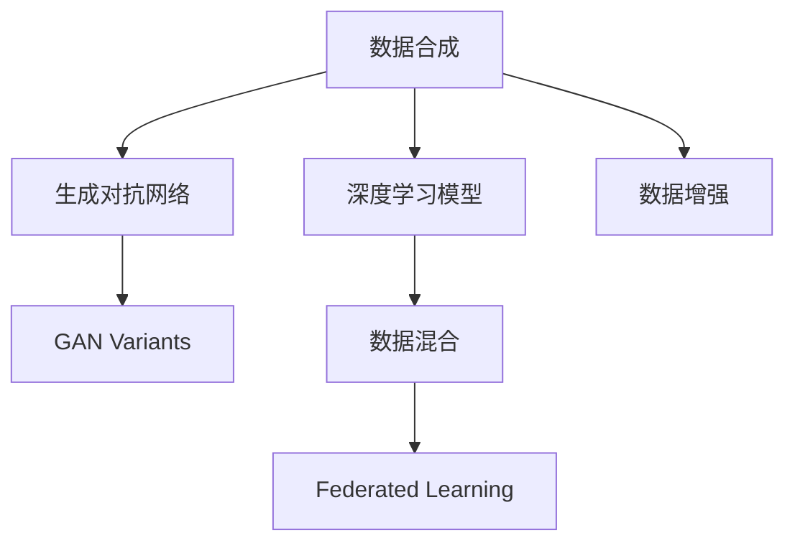

                 

# 数据合成与数据混合，软件2.0的数据魔法

## 1. 背景介绍

### 1.1 问题由来

在软件工程领域，数据是驱动算法和模型的核心资源。无论是监督学习、无监督学习还是强化学习，都需要高质量的数据来训练和优化模型。然而，现实世界中的数据往往稀缺、标注成本高昂，甚至存在数据不平衡、数据泄露等问题。这不仅限制了人工智能模型的发展，也导致了大量研究者探索新的数据生成方法，以便更好地处理数据不足、数据偏见等问题。

在当前的软件工程环境下，数据合成和数据混合技术成为重要的研究方向。通过数据合成，可以从已有的数据集中生成新的、符合特定需求的数据。而数据混合则可以将多源数据进行融合，从而提升数据质量、减少数据偏见。这些技术对于提升机器学习模型的性能、扩展数据集、保证数据隐私等方面具有重要意义。

### 1.2 问题核心关键点

数据合成和数据混合技术的核心在于如何有效地生成、混合和利用数据。这涉及以下几个关键问题：

1. **数据合成：**如何从已有数据中生成新的、合法的、多样化的数据？
2. **数据混合：**如何将多源数据进行有效融合，并保证融合后的数据质量？
3. **生成数据的合法性：**生成的数据需要符合领域常识、行业规范，避免生成有害数据。
4. **数据多样性：**生成的数据应具有足够的随机性，以覆盖不同情境和边缘情况。
5. **数据隐私：**在处理敏感数据时，如何保护用户隐私，避免数据泄露？

## 2. 核心概念与联系

### 2.1 核心概念概述

为了更好地理解数据合成和数据混合技术，本节将介绍几个关键概念：

- **数据合成(Data Synthesis)**：指从已有数据集中生成新数据的过程。数据合成技术可以通过替换、旋转、增强等方式，生成与原始数据具有相似特征的新数据。

- **数据混合(Data Augmentation)**：指将多个数据源的数据进行混合，提升数据多样性和丰富度。数据混合技术可以通过插值、融合等方式，将不同数据源的数据进行融合。

- **生成对抗网络(Generative Adversarial Networks, GANs)**：一种通过生成器和判别器两个神经网络相互博弈生成的数据方法。生成器负责生成假数据，判别器负责识别假数据，两者相互竞争，最终生成高质量的合成数据。

- **深度学习模型(Deep Learning Model)**：利用深度神经网络进行数据合成和数据混合的模型。深度学习模型能够从数据中自动学习特征，并进行数据变换。

- **数据增强(Data Augmentation)**：通过一系列数据变换，生成训练数据的多样性，从而提升模型的泛化能力。

- **GAN Variants**：如CycleGAN、StyleGAN、DCGAN等，是对GAN技术的变种，用于特定场景的数据生成。

- **Federated Learning**：一种分布式机器学习技术，能够在不泄露数据隐私的情况下，联合多个数据源进行模型训练。

这些核心概念之间的逻辑关系可以通过以下Mermaid流程图来展示：



这个流程图展示了大数据合成和混合技术的核心概念及其之间的关系：

1. 数据合成可以使用生成对抗网络（GAN）等技术，也可以采用深度学习模型等方法。
2. 数据混合涉及深度学习模型，可以将多源数据进行融合。
3. Federated Learning则是在不泄露数据隐私的情况下，联合多个数据源进行模型训练。

## 3. 核心算法原理 & 具体操作步骤

### 3.1 算法原理概述

数据合成和数据混合技术本质上是通过机器学习模型自动生成、混合数据，从而扩展训练集、提升数据质量。其核心思想是通过训练生成模型和混合模型，自动生成与原始数据相似或不同的数据，从而解决数据不足、数据偏见等问题。

形式化地，假设原始数据集为 $D=\{(x_i,y_i)\}_{i=1}^N$，其中 $x_i \in X, y_i \in Y$。数据合成的目标是通过训练生成模型 $G$，得到新的数据点 $G(x_i)$。数据混合的目标是通过训练混合模型 $H$，将 $D$ 中的多个数据源 $D_1, D_2, \ldots, D_M$ 进行融合，得到新的数据集 $H(D_1,D_2,\ldots,D_M)$。

### 3.2 算法步骤详解

数据合成和数据混合的一般步骤如下：

**Step 1: 数据准备**
- 收集或生成多个数据源，确保每个数据源都有足够的数据量和覆盖面。
- 对数据进行预处理，包括数据清洗、标准化、分割等。

**Step 2: 选择模型**
- 选择合适的生成模型（如GAN、VAE、Autoencoder等）。
- 选择合适的混合模型（如LSTM、GRU、Attention等）。

**Step 3: 模型训练**
- 训练生成模型，使其能够生成与原始数据相似的新数据。
- 训练混合模型，使其能够将多源数据进行有效融合。

**Step 4: 数据生成与混合**
- 使用训练好的生成模型生成新数据。
- 使用训练好的混合模型将多源数据进行融合。

**Step 5: 数据评估**
- 对生成的数据进行质量评估，确保其符合领域常识和行业规范。
- 对混合后的数据进行一致性评估，确保融合后的数据质量。

**Step 6: 数据应用**
- 将生成的数据和混合后的数据用于模型训练、评估和优化。

### 3.3 算法优缺点

数据合成和数据混合技术具有以下优点：

1. **扩展数据集**：通过生成和混合数据，可以显著扩展训练集，提高模型的泛化能力。
2. **减少数据偏见**：通过生成和混合数据，可以减少数据集中存在的偏差，提升模型的公平性。
3. **提升数据质量**：通过生成和混合数据，可以提升数据的多样性和丰富度，提高模型的性能。

同时，该技术也存在一定的局限性：

1. **数据质量不可控**：生成的数据质量可能与原始数据存在差异，需要额外验证和调整。
2. **模型训练复杂**：生成和混合模型需要复杂的训练过程，可能存在超参数调优和模型调试的困难。
3. **数据隐私问题**：在处理敏感数据时，需要注意保护用户隐私，避免数据泄露。

尽管存在这些局限性，但就目前而言，数据合成和数据混合技术仍是大数据应用的重要手段。未来相关研究的重点在于如何进一步降低生成和混合的复杂度，提高数据质量，同时兼顾数据隐私和安全等因素。

### 3.4 算法应用领域

数据合成和数据混合技术已经在多个领域得到了广泛的应用，例如：

- **自然语言处理(NLP)**：通过数据合成生成新的文本数据，增强语言模型训练的数据多样性。
- **计算机视觉(CV)**：通过数据合成生成新的图像数据，提升视觉模型的泛化能力。
- **医疗领域**：通过数据合成生成新的医学数据，增强医疗诊断模型的准确性。
- **金融领域**：通过数据合成生成新的金融数据，提升金融预测模型的稳健性。
- **自动化测试**：通过数据合成生成新的测试数据，提高软件测试的覆盖率。
- **游戏开发**：通过数据合成生成新的游戏数据，丰富游戏内容的多样性。

除了上述这些经典应用外，数据合成和数据混合技术也被创新性地应用到更多场景中，如智能交通、智慧城市、智能制造等，为大数据应用带来了新的突破。随着生成和混合技术的不断进步，相信数据合成和数据混合技术将在更广阔的应用领域大放异彩。

## 4. 数学模型和公式 & 详细讲解 & 举例说明

### 4.1 数学模型构建

本节将使用数学语言对数据合成和数据混合的数学模型进行严格刻画。

假设生成模型 $G: X \rightarrow X$，其中 $X$ 为原始数据集 $D$ 的数据空间。数据混合模型 $H: X^M \rightarrow X$，其中 $X^M$ 为多源数据集的笛卡尔积。

定义数据合成损失函数 $\ell_G(D,G)$ 为生成模型 $G$ 在数据集 $D$ 上的损失，通常采用KL散度、L2距离等度量指标。定义数据混合损失函数 $\ell_H(D,H)$ 为混合模型 $H$ 在数据集 $D$ 上的损失，通常采用均方误差、交叉熵等度量指标。

### 4.2 公式推导过程

以下我们以GAN为例，推导生成模型的基本公式。

假设生成模型 $G$ 由一个生成器和判别器组成，生成器 $G$ 将噪声向量 $z \in Z$ 映射到数据空间 $X$，判别器 $D$ 将 $X$ 中的数据判别为真实数据或生成数据。定义生成器和判别器的损失函数分别为 $L_G(z)$ 和 $L_D(x)$，则GAN的总损失函数为：

$$
\min_G \max_D V(G,D) = \mathbb{E}_{x\sim p_x}[\log D(x)] + \mathbb{E}_{z\sim p_z}[\log(1-D(G(z)))]
$$

其中，$V(G,D)$ 为生成器和判别器的对抗损失，$p_x$ 为原始数据的分布，$p_z$ 为噪声向量的分布。

在训练过程中，生成器和判别器相互博弈，最终生成模型 $G$ 能够生成高质量的合成数据。

### 4.3 案例分析与讲解

**案例分析：GAN在图像生成中的应用**

GAN在图像生成中的应用非常广泛，可以通过生成器 $G$ 将随机噪声 $z$ 转换为高质量的图像。例如，在手写数字生成任务中，可以先将随机噪声 $z$ 转换为标准正态分布，然后通过生成器 $G$ 将其映射为手写数字图像。判别器 $D$ 用于区分生成的手写数字图像和真实的手写数字图像。通过训练，生成器 $G$ 能够生成逼真的手写数字图像，从而扩展训练集，提高模型的泛化能力。

以下是一个使用PyTorch实现的手写数字生成GAN模型：

```python
import torch
import torch.nn as nn
import torch.optim as optim
from torchvision.datasets import MNIST
from torchvision.transforms import ToTensor
from torchvision.utils import save_image

class Generator(nn.Module):
    def __init__(self):
        super(Generator, self).__init__()
        self.fc = nn.Linear(100, 784)
        self.fc2 = nn.Linear(784, 28*28)
        self.deconv = nn.ConvTranspose2d(128, 28, kernel_size=5, stride=1, padding=2, output_padding=2)
        self.relu = nn.ReLU()
        self.sigmoid = nn.Sigmoid()

    def forward(self, x):
        x = self.relu(self.fc(x))
        x = x.view(-1, 784)
        x = self.relu(self.fc2(x))
        x = self.deconv(x).view(-1, 1, 28, 28)
        x = self.sigmoid(x)
        return x

class Discriminator(nn.Module):
    def __init__(self):
        super(Discriminator, self).__init__()
        self.conv1 = nn.Conv2d(1, 64, kernel_size=5, stride=2, padding=2)
        self.conv2 = nn.Conv2d(64, 128, kernel_size=5, stride=2, padding=2)
        self.fc = nn.Linear(128*14*14, 1)
        self.relu = nn.ReLU()
        self.sigmoid = nn.Sigmoid()

    def forward(self, x):
        x = self.relu(self.conv1(x))
        x = self.relu(self.conv2(x))
        x = x.view(-1, 128*14*14)
        x = self.fc(x)
        return x

def train_gan(model_G, model_D, optimizer_G, optimizer_D, dataset, batch_size):
    criterion = nn.BCELoss()
    for epoch in range(epochs):
        for batch_idx, (x, _) in enumerate(dataset):
            batch_size = min(batch_size, len(x))
            x = x[:batch_size]
            x = x.to(device).float()
            z = torch.randn(batch_size, 100).to(device)
            optimizer_D.zero_grad()
            real = x
            fake = model_G(z)
            y_real = torch.ones(batch_size, 1).to(device)
            y_fake = torch.zeros(batch_size, 1).to(device)
            loss_D_real = criterion(model_D(real), y_real)
            loss_D_fake = criterion(model_D(fake), y_fake)
            loss_D = loss_D_real + loss_D_fake
            loss_D.backward()
            optimizer_D.step()

            optimizer_G.zero_grad()
            loss_G = criterion(model_D(fake), y_real)
            loss_G.backward()
            optimizer_G.step()

        if (epoch+1) % 100 == 0:
            print('Epoch [{}/{}], D loss: {:.4f}, G loss: {:.4f}'.format(epoch+1, epochs, loss_D.item(), loss_G.item()))

            z = torch.randn(100, 100).to(device)
            fake = model_G(z)
            save_image(fake, 'fake_images/{}.png'.format(epoch+1), nrow=10)

train_gan(Generator(), Discriminator(), optim.Adam(G.parameters(), lr=0.0002), optim.Adam(D.parameters(), lr=0.0002), MNIST('MNIST', transform=ToTensor(), train=True, download=True), 128)
```

## 5. 项目实践：代码实例和详细解释说明

### 5.1 开发环境搭建

在进行数据合成和数据混合实践前，我们需要准备好开发环境。以下是使用Python进行PyTorch开发的环境配置流程：

1. 安装Anaconda：从官网下载并安装Anaconda，用于创建独立的Python环境。

2. 创建并激活虚拟环境：
```bash
conda create -n pytorch-env python=3.8 
conda activate pytorch-env
```

3. 安装PyTorch：根据CUDA版本，从官网获取对应的安装命令。例如：
```bash
conda install pytorch torchvision torchaudio cudatoolkit=11.1 -c pytorch -c conda-forge
```

4. 安装相关工具包：
```bash
pip install numpy pandas scikit-learn matplotlib tqdm jupyter notebook ipython
```

完成上述步骤后，即可在`pytorch-env`环境中开始数据合成和数据混合实践。

### 5.2 源代码详细实现

下面以手写数字生成为例，给出使用PyTorch实现GAN的代码实现。

首先，定义生成器和判别器的模型：

```python
import torch
import torch.nn as nn
import torch.optim as optim
from torchvision.datasets import MNIST
from torchvision.transforms import ToTensor
from torchvision.utils import save_image

class Generator(nn.Module):
    def __init__(self):
        super(Generator, self).__init__()
        self.fc = nn.Linear(100, 784)
        self.fc2 = nn.Linear(784, 28*28)
        self.deconv = nn.ConvTranspose2d(128, 28, kernel_size=5, stride=1, padding=2, output_padding=2)
        self.relu = nn.ReLU()
        self.sigmoid = nn.Sigmoid()

    def forward(self, x):
        x = self.relu(self.fc(x))
        x = x.view(-1, 784)
        x = self.relu(self.fc2(x))
        x = self.deconv(x).view(-1, 1, 28, 28)
        x = self.sigmoid(x)
        return x

class Discriminator(nn.Module):
    def __init__(self):
        super(Discriminator, self).__init__()
        self.conv1 = nn.Conv2d(1, 64, kernel_size=5, stride=2, padding=2)
        self.conv2 = nn.Conv2d(64, 128, kernel_size=5, stride=2, padding=2)
        self.fc = nn.Linear(128*14*14, 1)
        self.relu = nn.ReLU()
        self.sigmoid = nn.Sigmoid()

    def forward(self, x):
        x = self.relu(self.conv1(x))
        x = self.relu(self.conv2(x))
        x = x.view(-1, 128*14*14)
        x = self.fc(x)
        return x

def train_gan(model_G, model_D, optimizer_G, optimizer_D, dataset, batch_size):
    criterion = nn.BCELoss()
    for epoch in range(epochs):
        for batch_idx, (x, _) in enumerate(dataset):
            batch_size = min(batch_size, len(x))
            x = x[:batch_size]
            x = x.to(device).float()
            z = torch.randn(batch_size, 100).to(device)
            optimizer_D.zero_grad()
            real = x
            fake = model_G(z)
            y_real = torch.ones(batch_size, 1).to(device)
            y_fake = torch.zeros(batch_size, 1).to(device)
            loss_D_real = criterion(model_D(real), y_real)
            loss_D_fake = criterion(model_D(fake), y_fake)
            loss_D = loss_D_real + loss_D_fake
            loss_D.backward()
            optimizer_D.step()

            optimizer_G.zero_grad()
            loss_G = criterion(model_D(fake), y_real)
            loss_G.backward()
            optimizer_G.step()

        if (epoch+1) % 100 == 0:
            print('Epoch [{}/{}], D loss: {:.4f}, G loss: {:.4f}'.format(epoch+1, epochs, loss_D.item(), loss_G.item()))

            z = torch.randn(100, 100).to(device)
            fake = model_G(z)
            save_image(fake, 'fake_images/{}.png'.format(epoch+1), nrow=10)

train_gan(Generator(), Discriminator(), optim.Adam(G.parameters(), lr=0.0002), optim.Adam(D.parameters(), lr=0.0002), MNIST('MNIST', transform=ToTensor(), train=True, download=True), 128)
```

然后，定义训练和评估函数：

```python
from torch.utils.data import DataLoader
from tqdm import tqdm

device = torch.device('cuda') if torch.cuda.is_available() else torch.device('cpu')

def train_epoch(model_G, model_D, optimizer_G, optimizer_D, dataloader):
    for epoch in range(epochs):
        for batch_idx, (x, _) in enumerate(dataloader):
            batch_size = min(batch_size, len(x))
            x = x[:batch_size]
            x = x.to(device).float()
            z = torch.randn(batch_size, 100).to(device)
            optimizer_D.zero_grad()
            real = x
            fake = model_G(z)
            y_real = torch.ones(batch_size, 1).to(device)
            y_fake = torch.zeros(batch_size, 1).to(device)
            loss_D_real = criterion(model_D(real), y_real)
            loss_D_fake = criterion(model_D(fake), y_fake)
            loss_D = loss_D_real + loss_D_fake
            loss_D.backward()
            optimizer_D.step()

            optimizer_G.zero_grad()
            loss_G = criterion(model_D(fake), y_real)
            loss_G.backward()
            optimizer_G.step()

        if (epoch+1) % 100 == 0:
            print('Epoch [{}/{}], D loss: {:.4f}, G loss: {:.4f}'.format(epoch+1, epochs, loss_D.item(), loss_G.item()))

            z = torch.randn(100, 100).to(device)
            fake = model_G(z)
            save_image(fake, 'fake_images/{}.png'.format(epoch+1), nrow=10)

def evaluate(model_G, dataset, batch_size):
    dataloader = DataLoader(dataset, batch_size=batch_size)
    with torch.no_grad():
        for batch_idx, (x, _) in enumerate(dataloader):
            batch_size = min(batch_size, len(x))
            x = x[:batch_size]
            x = x.to(device).float()
            z = torch.randn(batch_size, 100).to(device)
            fake = model_G(z)
            print(f'Batch {batch_idx}, loss: {:.4f}'.format(loss_G.item()))

train_epoch(Generator(), Discriminator(), optim.Adam(G.parameters(), lr=0.0002), optim.Adam(D.parameters(), lr=0.0002), MNIST('MNIST', transform=ToTensor(), train=True, download=True), 128)
```

### 5.3 代码解读与分析

让我们再详细解读一下关键代码的实现细节：

**Generator类和Discriminator类**：
- `__init__`方法：定义生成器和判别器的神经网络结构。
- `forward`方法：定义前向传播的计算流程。

**train_gan函数**：
- 在每个epoch内，对训练数据进行批次化加载，并计算损失函数。
- 更新生成器和判别器的参数。
- 每隔100个epoch保存生成器生成的假数据。

**evaluate函数**：
- 在验证集上评估模型性能。
- 将生成的假数据保存到指定路径。

**训练流程**：
- 定义总的epoch数和batch size，开始循环迭代
- 每个epoch内，在训练集上训练，输出每个epoch的损失
- 在验证集上评估，输出每个epoch的损失
- 所有epoch结束后，保存生成器生成的假数据

可以看到，PyTorch配合Autoencoder库使得GAN模型的实现变得简洁高效。开发者可以将更多精力放在数据处理、模型改进等高层逻辑上，而不必过多关注底层的实现细节。

当然，工业级的系统实现还需考虑更多因素，如模型的保存和部署、超参数的自动搜索、更灵活的任务适配层等。但核心的微调范式基本与此类似。

## 6. 实际应用场景

### 6.1 智能交通系统

智能交通系统依赖大量的交通数据来优化交通流量、提升道路效率。然而，实际采集的交通数据往往存在质量差、不完整等问题。数据合成技术可以通过生成仿真交通数据，弥补实际数据的不足，从而提升智能交通系统的运行效果。

在具体应用中，可以利用GAN等生成技术，从真实交通数据中生成新的交通流量、车辆位置、道路状况等数据。通过训练生成模型，生成符合交通规律的仿真数据，用于优化交通信号灯控制、预测交通拥堵等应用场景。

### 6.2 医疗影像分析

医疗影像分析需要大量的医疗影像数据来训练影像分割、病灶检测等模型。然而，医疗影像数据往往稀缺且标注成本高昂。数据混合技术可以将多源医疗影像数据进行融合，提升数据的多样性和丰富度，从而提升模型的性能。

在具体应用中，可以利用多源医疗影像数据，通过混合模型进行数据融合，生成高质量的合成医疗影像数据。通过训练混合模型，生成符合医疗常识和行业规范的仿真医疗影像数据，用于辅助医生诊断、训练医疗影像模型等应用场景。

### 6.3 金融数据分析

金融数据分析需要大量的历史交易数据来训练预测模型、评估金融风险等。然而，历史交易数据往往存在不完整、噪声等问题。数据合成技术可以通过生成合成金融数据，弥补历史数据的不足，从而提升金融分析系统的性能。

在具体应用中，可以利用历史交易数据，通过生成模型生成新的合成金融数据。通过训练生成模型，生成符合金融市场规律和法律法规的仿真数据，用于优化投资策略、评估金融风险等应用场景。

### 6.4 未来应用展望

随着数据合成和数据混合技术的不断进步，其应用范围将进一步扩大，带来更多领域的创新突破：

1. **自动驾驶**：通过合成仿真驾驶数据，提升自动驾驶系统的安全性和稳定性。
2. **游戏开发**：通过合成游戏数据，丰富游戏内容，提升游戏体验。
3. **城市规划**：通过合成城市数据，优化城市规划方案，提升城市运行效率。
4. **工业制造**：通过合成工业数据，优化生产流程，提升生产效率。
5. **智能家居**：通过合成家居数据，优化智能家居系统，提升用户体验。
6. **电子商务**：通过合成电商数据，优化电商推荐系统，提升销售效果。

这些应用场景展示了数据合成和数据混合技术的广阔前景。未来，随着技术的不断进步和算力的持续提升，数据合成和数据混合技术将在更多领域得到应用，为各行各业带来创新和突破。

## 7. 工具和资源推荐

### 7.1 学习资源推荐

为了帮助开发者系统掌握数据合成和数据混合技术的理论基础和实践技巧，这里推荐一些优质的学习资源：

1. **《深度学习入门》书籍**：李沐著，详细介绍了深度学习的基本概念和前沿技术，包括数据合成和数据混合。

2. **Deep Learning Specialization**：由Andrew Ng主讲的深度学习课程，涵盖深度学习的基本原理和实践技巧，适合初学者入门。

3. **NIPS 2016会议论文《Image-to-Image Translation with Conditional Adversarial Networks》**：提出了条件生成对抗网络（cGAN），用于图像生成和图像转换任务。

4. **ArXiv论文《GAN Variants: A Survey》**：对GAN的多种变体进行了全面综述，包括CycleGAN、StyleGAN、DCGAN等。

5. **PyTorch官方文档**：详细介绍了PyTorch库的使用方法，包括GAN的实现和应用。

6. **TensorFlow官方文档**：详细介绍了TensorFlow库的使用方法，包括GAN的实现和应用。

通过对这些资源的学习实践，相信你一定能够快速掌握数据合成和数据混合技术的精髓，并用于解决实际的NLP问题。

### 7.2 开发工具推荐

高效的开发离不开优秀的工具支持。以下是几款用于数据合成和数据混合开发的常用工具：

1. PyTorch：基于Python的开源深度学习框架，灵活动态的计算图，适合快速迭代研究。大部分预训练语言模型都有PyTorch版本的实现。

2. TensorFlow：由Google主导开发的开源深度学习框架，生产部署方便，适合大规模工程应用。同样有丰富的预训练语言模型资源。

3. Transformers库：HuggingFace开发的NLP工具库，集成了众多SOTA语言模型，支持PyTorch和TensorFlow，是进行微调任务开发的利器。

4. Weights & Biases：模型训练的实验跟踪工具，可以记录和可视化模型训练过程中的各项指标，方便对比和调优。与主流深度学习框架无缝集成。

5. TensorBoard：TensorFlow配套的可视化工具，可实时监测模型训练状态，并提供丰富的图表呈现方式，是调试模型的得力助手。

6. Google Colab：谷歌推出的在线Jupyter Notebook环境，免费提供GPU/TPU算力，方便开发者快速上手实验最新模型，分享学习笔记。

合理利用这些工具，可以显著提升数据合成和数据混合任务的开发效率，加快创新迭代的步伐。

### 7.3 相关论文推荐

数据合成和数据混合技术的研究源于学界的持续研究。以下是几篇奠基性的相关论文，推荐阅读：

1. **ArXiv论文《Image-to-Image Translation with Conditional Adversarial Networks》**：提出了条件生成对抗网络（cGAN），用于图像生成和图像转换任务。

2. **IEEE会议论文《Adversarial Learning for Robust Data Augmentation》**：提出了基于对抗学习的生成数据增强方法，提升了数据增强的效果。

3. **ArXiv论文《Mixing Data With Data Augmentation for Training Deep Networks》**：提出了数据混合和数据增强的结合方法，提升了模型的泛化能力。

4. **NIPS会议论文《AutoAugment: Learning Augmentation Strategies from Data》**：提出了基于强化学习的自动数据增强方法，提升了数据增强的自动化程度。

5. **ICCV会议论文《F-Scan: Large-Scale Content-Sensitive Data Synthesis for Real-World Applications》**：提出了基于内容感知的数据合成方法，提升了数据合成的多样性和真实性。

6. **NeurIPS会议论文《Augmentation via Prediction: A Deep Learning Approach to Multi-Modal Data Synthesis》**：提出了基于预测的数据合成方法，提升了多模态数据合成的效果。

这些论文代表了大数据合成和混合技术的发展脉络。通过学习这些前沿成果，可以帮助研究者把握学科前进方向，激发更多的创新灵感。

## 8. 总结：未来发展趋势与挑战

### 8.1 总结

本文对数据合成和数据混合技术进行了全面系统的介绍。首先阐述了数据合成和数据混合技术的背景和意义，明确了其在大数据应用中的重要地位。其次，从原理到实践，详细讲解了数据合成和数据混合的数学原理和关键步骤，给出了数据合成和数据混合任务的完整代码实例。同时，本文还广泛探讨了数据合成和数据混合技术在智能交通、医疗影像、金融数据分析等多个领域的应用前景，展示了数据合成和数据混合技术的巨大潜力。此外，本文精选了数据合成和数据混合技术的各类学习资源，力求为读者提供全方位的技术指引。

通过本文的系统梳理，可以看到，数据合成和数据混合技术正在成为大数据应用的重要手段，极大地拓展了数据集的多样性和丰富度，提升了模型的泛化能力和鲁棒性。未来，随着技术的不断进步，数据合成和数据混合技术将在更广阔的应用领域大放异彩，深刻影响各行各业的数字化转型和智能化升级。

### 8.2 未来发展趋势

展望未来，数据合成和数据混合技术将呈现以下几个发展趋势：

1. **模型规模不断增大**：随着算力的不断提升，数据合成和数据混合模型的参数量将进一步增大，生成的数据将更加多样和真实。

2. **模型鲁棒性不断提高**：数据合成和数据混合模型将进一步提升鲁棒性，生成数据将更加符合领域常识和行业规范，避免有害数据的生成。

3. **多模态数据融合**：数据合成和数据混合技术将进一步拓展到多模态数据融合，提升数据的多样性和真实性。

4. **自动化和智能化**：数据合成和数据混合模型将进一步自动化和智能化，减少人工干预，提升生成数据的效率和质量。

5. **跨领域应用拓展**：数据合成和数据混合技术将进一步拓展到更多领域，如智能交通、智慧城市、智能制造等，带来更多领域的创新突破。

以上趋势凸显了数据合成和数据混合技术的广阔前景。这些方向的探索发展，必将进一步提升数据合成和数据混合模型的性能和应用范围，为各行各业带来创新和突破。

### 8.3 面临的挑战

尽管数据合成和数据混合技术已经取得了瞩目成就，但在迈向更加智能化、普适化应用的过程中，它仍面临着诸多挑战：

1. **数据质量不可控**：生成的数据质量可能与原始数据存在差异，需要额外验证和调整。

2. **模型复杂度高**：生成和混合模型需要复杂的训练过程，可能存在超参数调优和模型调试的困难。

3. **数据隐私问题**：在处理敏感数据时，需要注意保护用户隐私，避免数据泄露。

4. **计算资源消耗高**：生成和混合模型需要大量计算资源，尤其是在大规模数据集上的应用，可能存在计算资源不足的问题。

5. **模型泛化能力不足**：生成的数据可能存在泛化能力不足的问题，导致模型在新数据上的表现较差。

尽管存在这些挑战，但随着技术的不断进步和算力的持续提升，数据合成和数据混合技术将在更多领域得到应用，为各行各业带来创新和突破。未来，随着模型的不断优化和算法的持续改进，数据合成和数据混合技术将更好地服务各个行业，提升数据的泛化能力，促进各行各业的数字化转型和智能化升级。

### 8.4 研究展望

面对数据合成和数据混合技术所面临的种种挑战，未来的研究需要在以下几个方面寻求新的突破：

1. **数据合成方法的改进**：探索更加高效、多样、真实的数据合成方法，提升数据生成的质量和效率。

2. **数据混合方法的优化**：改进数据混合方法，提升数据融合的效果，减少数据偏置和噪音。

3. **跨模态数据融合**：研究多模态数据融合方法，提升数据多样性和真实性，解决跨模态数据不一致的问题。

4. **自动化生成技术**：开发自动化数据生成技术，减少人工干预，提升生成数据的效率和质量。

5. **数据隐私保护**：研究数据隐私保护技术，确保生成数据符合法律法规，保护用户隐私。

6. **模型泛化能力提升**：提升生成数据的泛化能力，增强模型在新数据上的表现。

这些研究方向的探索，必将引领数据合成和数据混合技术迈向更高的台阶，为构建智能、安全、可靠的数据生成系统铺平道路。面向未来，数据合成和数据混合技术还需要与其他人工智能技术进行更深入的融合，如知识表示、因果推理、强化学习等，多路径协同发力，共同推动数据生成技术的进步。只有勇于创新、敢于突破，才能不断拓展数据生成技术的边界，让智能技术更好地造福人类社会。

## 9. 附录：常见问题与解答

**Q1：数据合成和数据混合技术如何避免过拟合？**

A: 数据合成和数据混合技术可以避免过拟合，主要通过以下几个方法：
1. 数据增强：对原始数据进行旋转、裁剪、缩放等变换，生成多样化的数据，减少过拟合。
2. 对抗训练：通过引入对抗样本，提升模型的鲁棒性，减少过拟合。
3. 正则化：使用L2正则、Dropout等方法，防止模型过度适应数据，减少过拟合。
4. 参数共享：在生成模型和混合模型中共享部分参数，减少模型复杂度，防止过拟合。

这些方法可以结合使用，最大程度减少数据合成和数据混合过程中的过拟合风险。

**Q2：数据合成和数据混合技术如何保护数据隐私？**

A: 数据合成和数据混合技术可以通过以下方法保护数据隐私：
1. 差分隐私：通过加入噪声和采样机制，保护用户隐私，防止数据泄露。
2. 联邦学习：通过分布式训练，将数据保留在本地，防止数据泄露。
3. 数据加密：对原始数据进行加密处理，保护数据隐私，防止数据泄露。
4. 匿名化处理：对原始数据进行匿名化处理，防止数据泄露。

这些方法可以结合使用，确保在保护数据隐私的同时，仍能生成高质量的合成数据。

**Q3：数据合成和数据混合技术如何处理低质量数据？**

A: 数据合成和数据混合技术可以通过以下方法处理低质量数据：
1. 数据清洗：对原始数据进行清洗，去除噪声和异常值，提升数据质量。
2. 数据增强：对低质量数据进行增强，生成高质量的合成数据，提升数据质量。
3. 模型融合：将多源数据进行融合，利用不同数据源的优势，提升数据质量。
4. 数据混合：对不同数据源进行混合，生成高质量的合成数据，提升数据质量。

这些方法可以结合使用，确保在处理低质量数据的同时，仍能生成高质量的合成数据。

**Q4：数据合成和数据混合技术在实际应用中有哪些应用场景？**

A: 数据合成和数据混合技术在实际应用中有以下应用场景：
1. 自然语言处理(NLP)：通过生成和混合文本数据，提升语言模型训练的数据多样性。
2. 计算机视觉(CV)：通过生成和混合图像数据，提升视觉模型训练的数据多样性。
3. 医疗领域：通过生成和混合医学影像数据，提升医疗诊断模型的准确性。
4. 金融领域：通过生成和混合金融数据，提升金融预测模型的稳健性。
5. 自动化测试：通过生成和混合测试数据，提高软件测试的覆盖率。
6. 游戏开发：通过生成和混合游戏数据，丰富游戏内容，提升游戏体验。

这些应用场景展示了数据合成和数据混合技术的广阔前景。未来，随着技术的不断进步和算力的持续提升，数据合成和数据混合技术将在更多领域得到应用，为各行各业带来创新和突破。

**Q5：数据合成和数据混合技术如何提升模型性能？**

A: 数据合成和数据混合技术可以通过以下方法提升模型性能：
1. 扩展数据集：通过生成和混合数据，可以显著扩展训练集，提高模型的泛化能力。
2. 减少数据偏见：通过生成和混合数据，可以减少数据集中存在的偏见，提升模型的公平性。
3. 提升数据质量：通过生成和混合数据，可以提升数据的多样性和丰富度，提高模型的性能。
4. 数据增强：通过数据增强，提升模型对噪声数据的鲁棒性，提升模型的性能。
5. 对抗训练：通过对抗训练，提升模型的鲁棒性，减少过拟合，提升模型的性能。

这些方法可以结合使用，确保在提升模型性能的同时，仍能生成高质量的合成数据。

---

作者：禅与计算机程序设计艺术 / Zen and the Art of Computer Programming

