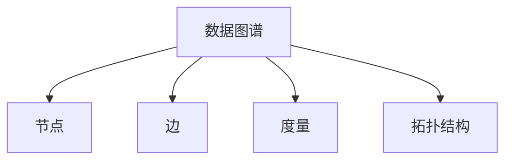

                 

# 数据图谱:软件2.0的知识管理利器

在软件工程领域，数据图谱（Data Landscape）已经成为一个炙手可热的新概念，正在迅速改变我们管理和利用知识的传统方式。本文将深入探讨数据图谱的核心概念与技术，分析其原理与操作步骤，并展望其未来的应用前景。

## 1. 背景介绍

### 1.1 问题由来

随着互联网技术的飞速发展和数据爆炸式的增长，软件工程领域积累了海量的数据资源。然而，这些数据往往是碎片化的、缺乏关联的，无法高效地被利用。传统的文档、数据库、搜索引擎等方法，已经难以满足现代软件开发的需要。

数据图谱正是在这种背景下诞生的新兴技术，它通过建立数据之间的关联，帮助软件工程师在海量的数据海洋中快速找到所需知识，提升开发效率和软件质量。

### 1.2 问题核心关键点

数据图谱的核心在于：

1. **数据关联性分析**：通过构建数据之间的连接，识别出数据间的关联关系，揭示出数据的深层结构。
2. **可视化展示**：将数据图谱通过图表、网络等形式可视化，提供直观、易于理解的知识概览。
3. **交互查询**：提供直观的交互界面，使用户能够通过关键字、标签等查询条件，快速定位到所需信息。

## 2. 核心概念与联系

### 2.1 核心概念概述

为更好地理解数据图谱的核心概念，本节将介绍几个密切相关的核心概念：

- **数据图谱（Data Landscape）**：数据图谱是一个动态变化的、以节点和边为基础的网络结构，用于描述数据之间复杂的关联关系。
- **节点（Node）**：数据图谱中的基本单位，代表数据实体，如文件、代码、库等。
- **边（Edge）**：数据图谱中连接节点的关系，表示数据间的关联性，如引用、依赖、相似性等。
- **度量（Measure）**：数据图谱中节点之间的度量值，用于衡量数据间的关系强度，如连接次数、相似度等。
- **拓扑结构（Topological Structure）**：数据图谱的整体结构特征，如中心性、团簇性等。

这些概念之间的逻辑关系可以通过以下Mermaid流程图来展示：



这个流程图展示了一些核心概念之间的联系：

1. 数据图谱以节点和边为基础，节点代表数据实体，边表示数据间的关联关系。
2. 度量用于衡量边的大小和强度，揭示数据间的相似性、依赖性等。
3. 拓扑结构描述数据图谱的整体布局，如中心性、团簇性等。

## 3. 核心算法原理 & 具体操作步骤

### 3.1 算法原理概述

数据图谱的构建主要基于图算法（Graph Algorithm），通过动态构建和维护数据之间的关联关系，揭示出数据间的深层结构。其核心原理包括：

1. **节点发现（Node Discovery）**：从大量数据中识别出潜在的数据实体。
2. **边建立（Edge Establishment）**：构建数据实体之间的连接关系，形成数据图谱的初始结构。
3. **度量计算（Measure Calculation）**：计算节点之间连接的强度和频率，量化数据间的相似性和依赖性。
4. **拓扑分析（Topological Analysis）**：对数据图谱进行整体结构分析，识别出数据图谱中的中心节点、团簇等。

### 3.2 算法步骤详解

数据图谱的构建和分析可以分为以下几个关键步骤：

**Step 1: 数据预处理**

- 收集和整理目标领域的数据，如代码文件、API接口、文档等。
- 对数据进行格式转换和清洗，去除噪声和重复信息，保证数据的一致性和完整性。

**Step 2: 节点发现**

- 使用特征提取技术，如TF-IDF、词频统计等，将数据转化为向量表示。
- 应用聚类算法，如K-Means、层次聚类等，对数据进行分组和分类，识别出潜在的数据实体。
- 对分类结果进行筛选和验证，去除噪声和冗余信息，得到节点集合。

**Step 3: 边建立**

- 应用图算法，如PageRank、Greedy Neighbor Sampling等，构建节点之间的连接关系，形成数据图谱的初始结构。
- 根据边的强度和频率，计算节点的度量值，如度、中心性、团簇系数等。
- 对连接关系进行筛选和验证，去除冗余和低质量边，优化数据图谱的结构。

**Step 4: 度量计算**

- 计算节点之间的度量值，如连接次数、相似度、依赖度等，量化数据间的相似性和依赖性。
- 应用矩阵计算和降维技术，如SVD、PCA等，简化数据图谱的计算复杂度，提高分析效率。

**Step 5: 拓扑分析**

- 应用图算法，如中心性算法、团簇算法等，对数据图谱进行整体结构分析，识别出数据图谱中的中心节点、团簇等。
- 应用图可视技术，如力导布局、层次布局等，将数据图谱以图表形式可视化，展示数据的结构特征。

### 3.3 算法优缺点

数据图谱的构建与分析方法具有以下优点：

1. **全面性**：通过构建数据之间的关联关系，揭示出数据的深层结构，提供全面的知识概览。
2. **高效性**：利用图算法和可视化技术，快速发现和分析数据间的关联关系，提升分析效率。
3. **可扩展性**：适用于多种数据类型和领域，可以灵活应用于代码管理、文档管理、知识管理等场景。

同时，数据图谱也存在以下局限性：

1. **数据质量依赖**：数据图谱的效果很大程度上取决于数据的质量和完整性，低质量数据会严重影响分析结果。
2. **计算复杂度高**：数据图谱的构建和分析过程复杂，计算量较大，对计算资源要求较高。
3. **结果解释性不足**：数据图谱的结构和度量值难以直观解释，可能需要深入的领域知识才能理解。
4. **应用场景局限**：当前数据图谱主要应用于静态数据的管理和分析，对于动态变化的数据环境，需要进一步改进。

尽管存在这些局限性，但数据图谱在知识管理和软件工程领域已经展现出巨大的潜力，值得深入研究和应用。

### 3.4 算法应用领域

数据图谱在多个领域中得到了广泛的应用，以下是几个典型的应用场景：

- **代码管理**：通过构建代码之间的引用、依赖关系，帮助开发者快速定位代码变更的影响范围，优化代码质量。
- **文档管理**：通过分析文档之间的引用、关联关系，提供文档索引和关联推荐，提升文档的可读性和可维护性。
- **知识管理**：通过构建知识之间的关联关系，揭示知识之间的深层结构，提供知识图谱的可视化展示，帮助知识管理。
- **智能问答**：通过构建知识图谱中的节点和边，建立知识库，提供智能问答系统的知识基础，提升问答系统的准确性和效率。
- **API管理**：通过构建API之间的依赖关系，提供API的文档、调用示例、版本管理等功能，帮助API开发者进行API管理。

## 4. 数学模型和公式 & 详细讲解 & 举例说明

### 4.1 数学模型构建

在数据图谱的构建过程中，涉及大量的数学模型和公式。以下是几个关键数学模型的构建：

**节点发现模型**

节点发现的过程可以通过聚类算法来实现。例如，使用K-Means算法对数据进行聚类，得到数据的分组和分类结果，可以识别出潜在的数据实体。K-Means算法的基本原理如下：

$$
\min_{\theta} \sum_{i=1}^n ||x_i-\mu_k||^2_k
$$

其中 $x_i$ 表示数据样本，$\mu_k$ 表示聚类中心的均值向量，$k$ 表示聚类个数。

**边建立模型**

边建立的过程可以通过图算法来实现。例如，使用Greedy Neighbor Sampling算法，从每个节点中选择邻居节点，构建连接关系。Greedy Neighbor Sampling算法的基本原理如下：

1. 从初始节点开始，选择与该节点最近的邻居节点。
2. 将该节点和邻居节点之间的连接强度加权，计算连接得分。
3. 选择得分最高的连接，添加到数据图谱中。
4. 重复上述步骤，直到所有节点都连接到数据图谱中。

**度量计算模型**

度量计算的过程可以通过矩阵计算和降维技术来实现。例如，使用SVD算法，对数据之间的相似度进行降维处理，得到节点之间的度量值。SVD算法的基本原理如下：

$$
X = U\Sigma V^T
$$

其中 $X$ 表示数据矩阵，$U$ 表示左奇异矩阵，$\Sigma$ 表示奇异值矩阵，$V$ 表示右奇异矩阵。

**拓扑分析模型**

拓扑分析的过程可以通过中心性算法和团簇算法来实现。例如，使用PageRank算法，计算节点之间的中心性，识别出数据图谱中的中心节点。PageRank算法的基本原理如下：

1. 将节点看作网页，边看作链接。
2. 每个节点的中心性为其页面的访问次数与总访问次数之比。
3. 计算每个节点与其邻居节点之间的链接权重，计算该节点的中心性得分。

### 4.2 公式推导过程

以下以K-Means算法为例，推导聚类算法的数学公式：

假设数据集 $D=\{x_1, x_2, ..., x_n\}$，其中每个数据点 $x_i \in R^d$。目标是将数据集分成 $k$ 个簇，使得簇内数据点相似，簇间数据点差异。

K-Means算法的基本步骤如下：

1. 随机选择 $k$ 个初始聚类中心 $\mu_1, \mu_2, ..., \mu_k$。
2. 对每个数据点 $x_i$，计算其与每个聚类中心 $\mu_j$ 的距离 $d(x_i, \mu_j)$，选择距离最近的聚类中心。
3. 将数据点 $x_i$ 分配到对应的簇中，计算簇的质心 $\mu_j = \frac{1}{|C_j|} \sum_{x_i \in C_j} x_i$。
4. 重复步骤2和步骤3，直到簇的质心不再变化，或者达到预设的迭代次数。

K-Means算法的目标函数为：

$$
\min_{\mu_1, \mu_2, ..., \mu_k} \sum_{i=1}^n ||x_i-\mu_j||^2_k
$$

其中 $\mu_j$ 表示第 $j$ 个簇的质心。

### 4.3 案例分析与讲解

假设我们有一个包含多个Java文件的项目，需要对文件进行分类和关联分析。可以使用K-Means算法对文件进行聚类，识别出潜在的数据实体，构建文件之间的连接关系，形成数据图谱。具体步骤如下：

1. 收集所有Java文件，进行预处理，去除注释、空行等噪声信息。
2. 对每个文件进行特征提取，如方法名、变量名、类名等，转化为向量表示。
3. 应用K-Means算法，对文件进行聚类，得到文件的分组和分类结果，识别出潜在的数据实体。
4. 应用Greedy Neighbor Sampling算法，构建文件之间的连接关系，形成数据图谱的初始结构。
5. 应用PageRank算法，计算文件之间的中心性，识别出数据图谱中的中心文件，优化数据图谱的结构。
6. 应用力导布局算法，将数据图谱以图表形式可视化，展示文件之间的关联关系，提供文件索引和关联推荐。

## 5. 项目实践：代码实例和详细解释说明

### 5.1 开发环境搭建

在进行数据图谱实践前，我们需要准备好开发环境。以下是使用Python进行数据图谱开发的环境配置流程：

1. 安装Anaconda：从官网下载并安装Anaconda，用于创建独立的Python环境。

2. 创建并激活虚拟环境：
```bash
conda create -n landscape-env python=3.8 
conda activate landscape-env
```

3. 安装相关依赖包：
```bash
conda install pandas numpy scikit-learn networkx matplotlib tqdm jupyter notebook ipython
```

4. 安装GraphStudio2：一个可视化工具，用于展示和分析数据图谱。
```bash
conda install graphstudylite
```

完成上述步骤后，即可在`landscape-env`环境中开始数据图谱实践。

### 5.2 源代码详细实现

下面我们以Java文件分类和关联分析为例，给出使用Python进行数据图谱开发的代码实现。

首先，定义节点和边类：

```python
class Node:
    def __init__(self, id, features):
        self.id = id
        self.features = features
        self.neighbors = set()
        
class Edge:
    def __init__(self, id, source, target, weight):
        self.id = id
        self.source = source
        self.target = target
        self.weight = weight
```

然后，定义聚类算法函数：

```python
from sklearn.cluster import KMeans

def cluster_data(data, n_clusters):
    kmeans = KMeans(n_clusters=n_clusters, random_state=42)
    kmeans.fit(data)
    labels = kmeans.labels_
    return labels
```

接着，定义边建立函数：

```python
def build_edges(data, labels):
    edges = []
    for i in range(len(data)):
        node = Node(i, data[i])
        for j in range(len(data)):
            if i != j and labels[i] == labels[j]:
                edge = Edge(len(edges), i, j, 1)
                node.neighbors.add(j)
                edges.append(edge)
    return edges
```

最后，定义可视化函数：

```python
import networkx as nx
import matplotlib.pyplot as plt
from networkx.drawing.nx_pygraphviz import graphviz_layout

def visualize_graph(graph):
    pos = graphviz_layout(graph)
    nx.draw(graph, pos, with_labels=True, font_weight='bold', font_size=12, edge_color='gray', node_color='lightblue', node_size=500)
    plt.show()
```

### 5.3 代码解读与分析

让我们再详细解读一下关键代码的实现细节：

**Node类**：
- `id`：节点的唯一标识符。
- `features`：节点的特征向量，用于聚类和度量计算。
- `neighbors`：节点的邻居集合，用于构建连接关系。

**Edge类**：
- `id`：边的唯一标识符。
- `source`：边的起点。
- `target`：边的终点。
- `weight`：边的权重，用于衡量连接的强度。

**cluster_data函数**：
- 使用K-Means算法对数据进行聚类，得到数据的分组和分类结果，识别出潜在的数据实体。

**build_edges函数**：
- 应用Greedy Neighbor Sampling算法，构建数据实体之间的连接关系，形成数据图谱的初始结构。

**visualize_graph函数**：
- 使用GraphStudio2的可视化工具，将数据图谱以图表形式展示。

通过这些代码，我们可以构建和分析Java文件之间的关联关系，得到文件的分类和关联信息，辅助软件开发和维护。

## 6. 实际应用场景

### 6.1 智能问答系统

智能问答系统可以通过构建知识图谱，将问答数据、文档、API等知识源连接起来，构建知识图谱的节点和边，提供智能问答系统的知识基础。例如，使用维基百科、百度百科等开放数据源，构建知识图谱中的节点和边，提供智能问答系统的知识库，提升问答系统的准确性和效率。

### 6.2 代码管理

代码管理可以通过构建代码之间的引用、依赖关系，帮助开发者快速定位代码变更的影响范围，优化代码质量。例如，使用数据图谱构建代码之间的连接关系，识别出代码变更的直接和间接影响，提供代码变更的审核和测试支持，提升代码的维护性和可读性。

### 6.3 文档管理

文档管理可以通过构建文档之间的引用、关联关系，提供文档索引和关联推荐，提升文档的可读性和可维护性。例如，使用数据图谱构建文档之间的连接关系，识别出文档之间的相似性和依赖性，提供文档关联推荐，优化文档的组织和展示，提升文档的可读性和可维护性。

## 7. 工具和资源推荐

### 7.1 学习资源推荐

为了帮助开发者系统掌握数据图谱的理论基础和实践技巧，这里推荐一些优质的学习资源：

1. **《数据图谱：原理与实践》**：一本深入浅出介绍数据图谱原理和实现方法的书籍，适合初学者和进阶开发者。
2. **《知识图谱导论》**：介绍知识图谱的基本概念和构建方法，涵盖多个领域的知识图谱应用案例。
3. **Coursera上的《网络科学》课程**：斯坦福大学开设的课程，涵盖网络分析、图算法等内容，适合掌握数据图谱的基本原理和方法。
4. **Kaggle上的数据图谱比赛**：通过实际数据集练习数据图谱的构建和分析，积累实践经验。

### 7.2 开发工具推荐

数据图谱的开发需要多种工具的支持，以下是几款常用的工具：

1. **Python**：一种高效、易用的编程语言，支持多种数据处理和可视化工具。
2. **GraphStudio2**：一个可视化工具，用于展示和分析数据图谱，支持多种图表布局和美化。
3. **Graphviz**：一个图形可视化工具，支持多种图算法和图表布局，适合复杂图谱的构建和分析。
4. **Jupyter Notebook**：一个交互式编程环境，支持数据图谱的快速开发和验证，适合多语言的代码实现。

### 7.3 相关论文推荐

数据图谱的研究始于学界，并已取得许多重要成果。以下是几篇奠基性的相关论文，推荐阅读：

1. **《数据图谱：从图算法到知识管理》**：介绍数据图谱的基本概念和实现方法，涵盖多个领域的实际应用案例。
2. **《网络科学》**：介绍网络分析的基本方法和图算法，涵盖多个领域的实际应用案例。
3. **《知识图谱与语义网络》**：介绍知识图谱的基本概念和构建方法，涵盖多个领域的知识图谱应用案例。

## 8. 总结：未来发展趋势与挑战

### 8.1 总结

本文对数据图谱的核心概念与技术进行了全面系统的介绍。首先阐述了数据图谱的背景和意义，明确了其在知识管理和软件工程领域的重要作用。其次，从原理到实践，详细讲解了数据图谱的构建和分析方法，给出了数据图谱的完整代码实现。同时，本文还广泛探讨了数据图谱在智能问答、代码管理、文档管理等诸多场景中的应用前景，展示了数据图谱的广阔应用潜力。最后，本文精选了数据图谱的学习资源、开发工具和相关论文，力求为读者提供全方位的技术指引。

通过本文的系统梳理，可以看到，数据图谱正在成为软件工程领域的新范式，极大地提升数据管理和知识利用的效率。未来，伴随数据图谱技术的不断演进，相信软件工程领域的生产力将进一步提升，知识管理将变得更加智能化、系统化。

### 8.2 未来发展趋势

展望未来，数据图谱将呈现以下几个发展趋势：

1. **多模态数据融合**：数据图谱将从传统的文本数据扩展到图像、视频、语音等多模态数据，实现多模态数据的深度融合和协同分析。
2. **实时动态分析**：数据图谱将从静态分析拓展到动态分析，实时监测数据的变化趋势，提供实时的数据管理和服务。
3. **分布式计算**：数据图谱将从单机计算拓展到分布式计算，利用多台计算机的计算能力，提升数据图谱的构建和分析效率。
4. **智能推荐**：数据图谱将从简单的关联推荐拓展到智能推荐，通过深度学习等技术，提供个性化的数据推荐服务。
5. **跨领域应用**：数据图谱将从软件工程领域拓展到更多领域，如金融、医疗、教育等，提供跨领域的知识管理和数据分析。

### 8.3 面临的挑战

尽管数据图谱在知识管理和软件工程领域已经展现出巨大的潜力，但在迈向更加智能化、普适化应用的过程中，仍面临诸多挑战：

1. **数据质量**：数据图谱的效果很大程度上取决于数据的质量和完整性，低质量数据会严重影响分析结果。如何提高数据质量和数据清洗的自动化程度，将是重要的研究方向。
2. **计算复杂度**：数据图谱的构建和分析过程复杂，计算量较大，对计算资源要求较高。如何优化算法，降低计算复杂度，提高分析效率，将是重要的优化方向。
3. **可视化效果**：数据图谱的可视化效果很大程度上取决于图表布局和美学设计，难以直观展示复杂的数据结构。如何设计更好的可视化方法，提升数据图谱的可读性和可理解性，将是重要的研究方向。
4. **应用场景局限**：当前数据图谱主要应用于静态数据的管理和分析，对于动态变化的数据环境，需要进一步改进。如何构建动态数据图谱，适应数据的变化趋势，将是重要的研究方向。
5. **知识迁移**：数据图谱在特定领域的应用往往需要大量的标注数据和专家知识，知识迁移能力不足。如何提高数据图谱的知识迁移能力，实现跨领域知识的共享和应用，将是重要的研究方向。

尽管存在这些挑战，但数据图谱在知识管理和软件工程领域已经展现出巨大的潜力，值得深入研究和应用。相信随着技术的不断进步，数据图谱将在构建智能化的知识管理和软件开发体系中发挥越来越重要的作用。

### 8.4 未来突破

面对数据图谱所面临的挑战，未来的研究需要在以下几个方面寻求新的突破：

1. **多模态数据融合**：通过多模态数据的深度融合和协同分析，构建更全面的数据图谱，提供更加丰富的知识管理服务。
2. **实时动态分析**：通过实时动态分析，及时发现数据的变化趋势，提供实时的数据管理和服务。
3. **分布式计算**：通过分布式计算，提升数据图谱的构建和分析效率，适应大规模数据的管理和分析。
4. **智能推荐**：通过深度学习等技术，提供个性化的数据推荐服务，提升数据图谱的实用性和用户满意度。
5. **跨领域应用**：通过知识迁移和跨领域知识的共享，实现数据图谱的跨领域应用，提升数据图谱的普适性和应用范围。

这些研究方向将推动数据图谱技术迈向更高的台阶，为构建智能化的知识管理和软件开发体系提供坚实的基础。面向未来，数据图谱技术需要从算法、应用场景、用户需求等多个维度进行全面优化，才能真正实现其在知识管理和软件工程领域的广泛应用。总之，数据图谱将在构建智能化的知识管理和软件开发体系中扮演越来越重要的角色。

## 9. 附录：常见问题与解答

**Q1: 数据图谱的核心优势是什么？**

A: 数据图谱的核心优势在于通过构建数据之间的关联关系，揭示数据的深层结构，提供全面的知识概览。其优势包括：

1. 全面性：通过构建数据之间的关联关系，揭示数据的深层结构，提供全面的知识概览。
2. 高效性：利用图算法和可视化技术，快速发现和分析数据间的关联关系，提升分析效率。
3. 可扩展性：适用于多种数据类型和领域，可以灵活应用于代码管理、文档管理、知识管理等场景。

**Q2: 数据图谱在实际应用中面临哪些挑战？**

A: 数据图谱在实际应用中面临以下挑战：

1. 数据质量：数据图谱的效果很大程度上取决于数据的质量和完整性，低质量数据会严重影响分析结果。
2. 计算复杂度：数据图谱的构建和分析过程复杂，计算量较大，对计算资源要求较高。
3. 可视化效果：数据图谱的可视化效果很大程度上取决于图表布局和美学设计，难以直观展示复杂的数据结构。
4. 应用场景局限：当前数据图谱主要应用于静态数据的管理和分析，对于动态变化的数据环境，需要进一步改进。
5. 知识迁移：数据图谱在特定领域的应用往往需要大量的标注数据和专家知识，知识迁移能力不足。

尽管存在这些挑战，但数据图谱在知识管理和软件工程领域已经展现出巨大的潜力，值得深入研究和应用。

**Q3: 数据图谱的应用场景有哪些？**

A: 数据图谱在多个领域中得到了广泛的应用，以下是几个典型的应用场景：

1. 智能问答系统：通过构建知识图谱，将问答数据、文档、API等知识源连接起来，提供智能问答系统的知识基础。
2. 代码管理：通过构建代码之间的引用、依赖关系，帮助开发者快速定位代码变更的影响范围，优化代码质量。
3. 文档管理：通过构建文档之间的引用、关联关系，提供文档索引和关联推荐，提升文档的可读性和可维护性。

通过本文的系统梳理，可以看到，数据图谱正在成为软件工程领域的新范式，极大地提升数据管理和知识利用的效率。未来，伴随数据图谱技术的不断演进，相信软件工程领域的生产力将进一步提升，知识管理将变得更加智能化、系统化。

---
作者：禅与计算机程序设计艺术 / Zen and the Art of Computer Programming

