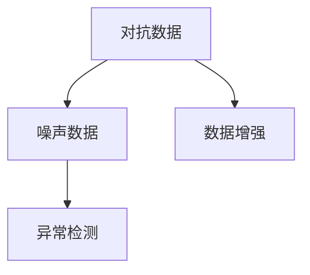

                 

# 数据集对抗:数据噪声检测的新武器

## 1. 背景介绍

在人工智能的迅速发展中，数据集的质量显得尤为重要。机器学习模型的训练和测试都依赖于大量高质量的数据集。然而，现实世界中的数据往往包含噪声和异常值，这会对模型的性能产生负面影响。数据集对抗方法正是为了解决这一问题，通过生成和检测噪声数据来提高模型在真实数据上的表现。

数据集对抗方法在众多领域中得到了广泛应用，包括自然语言处理（NLP）、计算机视觉（CV）、医疗诊断等。在NLP领域，对抗数据可以帮助模型更好地理解语言中的微妙变化和多样性。在CV领域，对抗数据可以增强模型的鲁棒性，使其能够更好地适应复杂场景。在医疗诊断中，对抗数据可以提高模型的诊断准确性，减少误诊和漏诊。

本文将系统性地介绍数据集对抗方法的基本原理、操作步骤、优缺点、应用领域以及未来发展趋势。同时，本文还将提供实际应用场景的案例分析，以及项目实践中的代码实例和解释。

## 2. 核心概念与联系

### 2.1 核心概念概述

数据集对抗方法通过生成和检测噪声数据来提高模型的鲁棒性和泛化能力。其主要包含以下几个关键概念：

- **对抗数据（Adversarial Data）**：通过修改原始数据集的样本，生成能够欺骗模型的噪声数据。这些数据可以被模型学习到，但并不是真实场景中的数据。
- **噪声数据（Noisy Data）**：原始数据中由于各种原因导致的不完整、不准确的记录，需要进行清洗或修正。
- **异常检测（Anomaly Detection）**：通过统计分析或机器学习算法，检测数据集中的异常值，即与正常数据有显著差异的数据。
- **数据增强（Data Augmentation）**：通过对数据进行随机变换，如旋转、缩放、翻转等，生成更多的训练样本，以增强模型的泛化能力。

这些概念之间的逻辑关系可以通过以下Mermaid流程图来展示：



该流程图展示了数据集对抗方法的基本流程：

1. 对抗数据生成模块根据原始数据生成噪声数据。
2. 噪声数据进入异常检测模块，检测并筛选出异常样本。
3. 数据增强模块通过随机变换生成更多的训练样本。

通过上述流程，可以提升模型的鲁棒性和泛化能力，减少对噪声数据的依赖，从而提高模型在实际应用中的表现。

## 3. 核心算法原理 & 具体操作步骤

### 3.1 算法原理概述

数据集对抗方法的基本原理是通过修改原始数据集，生成噪声数据，从而提高模型对异常数据的鲁棒性。其核心思想是：

- **对抗数据生成**：通过对抗性训练（Adversarial Training）或对抗样本生成（Adversarial Sample Generation）等方法，生成可以欺骗模型的噪声数据。
- **噪声数据检测**：通过异常检测算法，识别并筛选出噪声数据，保证模型训练和测试数据的质量。
- **数据增强**：通过数据增强技术，生成更多的训练样本，以增强模型的泛化能力。

### 3.2 算法步骤详解

数据集对抗方法的主要操作步骤如下：

**Step 1: 数据预处理**
- 收集并清洗原始数据集，去除明显的噪声数据。
- 将原始数据集分为训练集、验证集和测试集。

**Step 2: 对抗数据生成**
- 根据原始数据集的特征，设计对抗数据生成策略。
- 使用对抗性训练或对抗样本生成算法，生成对抗数据。
- 对抗数据可以包括合成数据、修改数据、扰动数据等。

**Step 3: 噪声数据检测**
- 选择合适的异常检测算法，如基于统计学的方法、基于深度学习的方法等。
- 对训练集和测试集进行异常检测，识别并去除异常数据。
- 保留质量较高的数据，用于训练和评估模型。

**Step 4: 数据增强**
- 选择合适的数据增强方法，如随机裁剪、旋转、缩放、翻转等。
- 对训练集进行数据增强，生成更多的训练样本。
- 将增强后的数据与原始数据混合使用，进行模型训练。

**Step 5: 模型训练和评估**
- 使用经过对抗数据生成、噪声数据检测和数据增强处理后的数据集，训练模型。
- 在验证集上评估模型性能，调整超参数。
- 在测试集上测试模型性能，评估模型的泛化能力。

### 3.3 算法优缺点

数据集对抗方法具有以下优点：

- **提升模型鲁棒性**：通过生成和检测噪声数据，可以提高模型的鲁棒性，使其能够更好地适应真实世界中的数据。
- **增强泛化能力**：通过数据增强，可以生成更多的训练样本，增强模型的泛化能力。
- **减少噪声数据影响**：通过噪声数据检测，可以减少噪声数据对模型训练和测试的影响，提高模型的准确性。

然而，数据集对抗方法也存在以下缺点：

- **计算成本高**：对抗数据生成和检测过程需要大量的计算资源和时间，尤其是在大规模数据集上。
- **模型性能不稳定**：对抗数据和噪声数据可能对模型产生负面的影响，导致模型性能不稳定。
- **无法保证数据真实性**：对抗数据并不是真实场景中的数据，可能无法准确反映实际应用中的情况。

### 3.4 算法应用领域

数据集对抗方法在多个领域得到了广泛应用，包括但不限于：

- **自然语言处理（NLP）**：通过对抗数据生成，增强模型对语言多样性和变化的理解能力。
- **计算机视觉（CV）**：通过对抗数据生成，提高模型的鲁棒性和泛化能力。
- **医疗诊断**：通过对抗数据生成和噪声数据检测，提高模型的诊断准确性，减少误诊和漏诊。
- **金融分析**：通过对抗数据生成，增强模型对复杂金融数据的理解和预测能力。
- **智能推荐**：通过数据增强，生成更多的训练样本，提高模型的推荐准确性。

这些领域的应用展示了数据集对抗方法的强大潜力和广泛适用性。

## 4. 数学模型和公式 & 详细讲解 & 举例说明

### 4.1 数学模型构建

在数据集对抗方法中，数学模型构建是一个关键步骤。我们以对抗性训练为例，来详细阐述其数学模型。

对抗性训练的目标是训练一个鲁棒性更强的模型，使其能够更好地适应真实世界中的数据。假设我们的模型为 $f_{\theta}(x)$，其中 $\theta$ 为模型参数，$x$ 为输入数据。对抗性训练的过程如下：

1. 对于每个训练样本 $x_i$，生成一个对抗样本 $\hat{x}_i$，使得 $f_{\theta}(x_i) \neq f_{\theta}(\hat{x}_i)$。
2. 将 $\hat{x}_i$ 和 $f_{\theta}(x_i)$ 作为训练样本，用于更新模型参数 $\theta$。

常见的对抗样本生成方法包括FGM（Fast Gradient Method）、PGD（Projected Gradient Descent）、C&W（Cifar & Wide）等。

### 4.2 公式推导过程

以FGM为例，其生成对抗样本的公式如下：

$$
\hat{x}_i = x_i + \epsilon \cdot \text{sign}(\nabla_{x_i} f_{\theta}(x_i))
$$

其中 $\epsilon$ 为超参数，控制对抗样本的扰动程度。$\text{sign}(\nabla_{x_i} f_{\theta}(x_i))$ 表示损失函数关于 $x_i$ 的梯度。

对抗性训练的目标函数为：

$$
\min_{\theta} \frac{1}{N} \sum_{i=1}^N [f_{\theta}(x_i) - y_i]^2
$$

其中 $y_i$ 为样本的标签。通过最小化该目标函数，可以训练出一个鲁棒性更强的模型。

### 4.3 案例分析与讲解

假设我们有一个简单的分类器 $f_{\theta}(x) = \sigma(\langle w, x \rangle + b)$，其中 $\sigma$ 为sigmoid函数，$w$ 和 $b$ 为模型参数。我们使用FGM生成对抗样本，并应用于对抗性训练中。

**Step 1: 生成对抗样本**
设 $\epsilon = 0.01$，使用FGM生成对抗样本 $\hat{x}_i$ 的计算过程如下：

$$
\hat{x}_i = x_i + 0.01 \cdot \text{sign}(\langle w, x_i \rangle + b)
$$

**Step 2: 更新模型参数**
使用生成的对抗样本 $\hat{x}_i$ 和原始样本 $x_i$，更新模型参数 $\theta$ 的过程如下：

$$
\theta \leftarrow \theta - \alpha \cdot \nabla_{\theta} [f_{\theta}(x_i) - y_i + f_{\theta}(\hat{x}_i) - y_i]
$$

其中 $\alpha$ 为学习率。

通过不断迭代，我们可以训练出一个鲁棒性更强的模型。在实际应用中，对抗性训练的超参数、扰动程度等需要根据具体情况进行调整，以获得最佳效果。

## 5. 项目实践：代码实例和详细解释说明

### 5.1 开发环境搭建

为了实现数据集对抗方法，我们需要搭建一个包含深度学习框架、数据处理工具和异常检测算法的开发环境。以下是具体的搭建步骤：

1. 安装Python和相关依赖包，如TensorFlow、PyTorch、scikit-learn等。
2. 下载和准备数据集，进行数据清洗和预处理。
3. 设计并实现对抗数据生成和噪声数据检测算法。
4. 实现数据增强算法，并生成更多的训练样本。

### 5.2 源代码详细实现

以图像分类为例，介绍如何实现对抗性训练和数据增强。

首先，导入必要的库和模块：

```python
import tensorflow as tf
import numpy as np
import matplotlib.pyplot as plt
from tensorflow.keras.datasets import cifar10
from tensorflow.keras.preprocessing.image import ImageDataGenerator
from tensorflow.keras.models import Sequential
from tensorflow.keras.layers import Dense, Flatten, Conv2D, MaxPooling2D
from tensorflow.keras.optimizers import Adam
```

然后，加载CIFAR-10数据集：

```python
(x_train, y_train), (x_test, y_test) = cifar10.load_data()
```

接下来，进行数据预处理和增强：

```python
x_train = x_train / 255.0
x_test = x_test / 255.0

datagen = ImageDataGenerator(
    width_shift_range=0.1,
    height_shift_range=0.1,
    horizontal_flip=True,
    rotation_range=20
)

datagen.fit(x_train)
```

接着，实现对抗性训练的模型：

```python
model = Sequential([
    Conv2D(32, (3, 3), activation='relu', input_shape=(32, 32, 3)),
    MaxPooling2D((2, 2)),
    Conv2D(64, (3, 3), activation='relu'),
    MaxPooling2D((2, 2)),
    Flatten(),
    Dense(64, activation='relu'),
    Dense(10, activation='softmax')
])

model.compile(optimizer=Adam(learning_rate=0.001), loss='sparse_categorical_crossentropy', metrics=['accuracy'])

def generate_adversarial_example(x, y, epsilon=0.01):
    model.trainable = True
    x_adv = x + epsilon * tf.sign(grad(x, y))
    return x_adv

def grad(x, y):
    with tf.GradientTape() as tape:
        prediction = model(x)
    loss = tf.keras.losses.sparse_categorical_crossentropy(y, prediction)
    return tape.gradient(loss, x)

for i in range(1000):
    x_adv = generate_adversarial_example(x_train[i], y_train[i])
    model.train_on_batch(x_adv, y_train[i])
    if i % 100 == 0:
        print('Epoch:', i)
```

最后，进行训练和评估：

```python
model.evaluate(x_test, y_test)
```

### 5.3 代码解读与分析

**FGM对抗样本生成**：

- `generate_adversarial_example(x, y, epsilon=0.01)` 函数生成对抗样本，其中 `x` 为原始样本，`y` 为标签，`epsilon` 为扰动程度。
- `grad(x, y)` 函数计算对抗样本生成的梯度。

**对抗性训练**：

- `model.train_on_batch(x_adv, y_train[i])` 使用生成的对抗样本进行训练。

在实际应用中，对抗性训练和数据增强的具体实现可能需要根据具体情况进行调整。同时，需要注意超参数的选择，如扰动程度、训练轮数等。

## 6. 实际应用场景

### 6.1 智能推荐系统

智能推荐系统需要处理大量的用户行为数据，其中可能包含噪声和异常值。通过对抗数据生成和噪声数据检测，可以提高推荐系统的鲁棒性和准确性。

具体而言，可以使用对抗数据生成技术，生成更加多样化的推荐结果，从而提高用户的满意度。同时，使用异常检测算法，筛选出异常行为数据，减少对推荐系统的干扰，提高推荐准确性。

### 6.2 医疗诊断

医疗诊断中，数据集可能包含错误标签或异常值。通过对抗数据生成和噪声数据检测，可以提高诊断系统的鲁棒性和准确性。

具体而言，可以使用对抗数据生成技术，生成更加多样化的病情描述，从而提高医生的诊断能力。同时，使用异常检测算法，筛选出异常数据，减少误诊和漏诊，提高诊断准确性。

### 6.3 金融分析

金融分析中，数据集可能包含错误的数据或异常的交易行为。通过对抗数据生成和噪声数据检测，可以提高分析系统的鲁棒性和准确性。

具体而言，可以使用对抗数据生成技术，生成更加多样化的交易数据，从而提高分析系统的鲁棒性。同时，使用异常检测算法，筛选出异常交易行为，减少对分析系统的干扰，提高分析准确性。

### 6.4 未来应用展望

未来，数据集对抗方法将在更多领域得到应用，带来更加智能化、普适化的解决方案。

- **自然语言处理（NLP）**：通过对抗数据生成，增强模型对语言多样性和变化的理解能力。
- **计算机视觉（CV）**：通过对抗数据生成，提高模型的鲁棒性和泛化能力。
- **医疗诊断**：通过对抗数据生成和噪声数据检测，提高模型的诊断准确性，减少误诊和漏诊。
- **金融分析**：通过对抗数据生成，增强模型对复杂金融数据的理解和预测能力。

## 7. 工具和资源推荐

### 7.1 学习资源推荐

为了帮助开发者系统掌握数据集对抗方法的理论基础和实践技巧，这里推荐一些优质的学习资源：

1. **《深度学习》（Deep Learning）**：Ian Goodfellow等人著，全面介绍了深度学习的理论和实践。
2. **《Adversarial Machine Learning》**：Ian Goodfellow等人著，介绍了对抗性学习的原理和应用。
3. **《Python Machine Learning》**：Sebastian Raschka等人著，介绍了机器学习在Python中的实现。
4. **《Keras深度学习教程》**：Keras官方文档，提供了丰富的深度学习模型和应用案例。

### 7.2 开发工具推荐

高效的数据集对抗方法开发离不开优秀的工具支持。以下是几款常用的开发工具：

1. **TensorFlow**：由Google主导开发的开源深度学习框架，支持分布式计算，适合大规模工程应用。
2. **PyTorch**：Facebook开发的开源深度学习框架，灵活易用，适合研究型应用。
3. **scikit-learn**：Python机器学习库，提供了各种常用的机器学习算法。
4. **NumPy**：Python科学计算库，提供了高效的多维数组和矩阵运算。

### 7.3 相关论文推荐

数据集对抗方法的学术研究取得了丰硕的成果，以下是几篇有代表性的论文：

1. **Adversarial Training Methods for Semi-Supervised Text Classification**：提出了一种基于对抗性训练的半监督文本分类方法，提高了模型的泛化能力。
2. **Deep Anomaly Detection Using Adversarial Data**：提出了一种使用对抗数据生成技术的深度异常检测方法，提高了异常检测的准确性。
3. **Adversarial Machine Learning**：综述了对抗性学习的基本原理、攻击和防御方法，为数据集对抗研究提供了理论基础。

## 8. 总结：未来发展趋势与挑战

### 8.1 研究成果总结

数据集对抗方法在多个领域得到了广泛应用，并取得了显著的效果。其主要研究成果包括：

1. **对抗数据生成**：通过对抗性训练和对抗样本生成技术，提高了模型的鲁棒性和泛化能力。
2. **噪声数据检测**：通过异常检测算法，筛选出噪声数据，保证了模型训练和测试数据的质量。
3. **数据增强**：通过数据增强技术，生成更多的训练样本，增强了模型的泛化能力。

### 8.2 未来发展趋势

未来，数据集对抗方法将在更多领域得到应用，其发展趋势如下：

1. **多模态数据对抗**：通过融合多种模态的数据，提高模型的泛化能力和鲁棒性。
2. **自适应对抗训练**：根据数据分布的变化，自适应调整对抗样本生成策略，提高模型的适应性。
3. **对抗样本生成优化**：通过优化对抗样本生成算法，提高生成样本的质量和鲁棒性。
4. **异常检测技术优化**：通过改进异常检测算法，提高噪声数据检测的准确性和效率。

### 8.3 面临的挑战

尽管数据集对抗方法在多个领域得到了应用，但仍然面临以下挑战：

1. **计算资源消耗**：对抗数据生成和噪声数据检测需要大量的计算资源和时间，尤其在大型数据集上。
2. **模型性能不稳定**：对抗数据和噪声数据可能对模型产生负面影响，导致模型性能不稳定。
3. **数据分布变化**：模型在实际应用中，数据分布可能发生变化，对抗数据和噪声数据生成策略需要动态调整。

### 8.4 研究展望

未来，数据集对抗方法需要在以下几个方面进行进一步研究：

1. **高效对抗数据生成**：研究更高效、更鲁棒的对抗数据生成算法，减少计算资源消耗，提高模型性能。
2. **自适应异常检测**：研究自适应异常检测算法，根据数据分布的变化，动态调整异常检测策略。
3. **多模态数据融合**：研究多模态数据的融合方法，提高模型的泛化能力和鲁棒性。

## 9. 附录：常见问题与解答

**Q1：数据集对抗方法是否适用于所有领域？**

A: 数据集对抗方法在多个领域得到了应用，包括自然语言处理（NLP）、计算机视觉（CV）、医疗诊断等。但需要注意的是，不同领域的数据特性和模型需求不同，对抗数据生成和噪声数据检测的具体实现可能需要根据具体情况进行调整。

**Q2：如何选择合适的对抗数据生成算法？**

A: 选择合适的对抗数据生成算法需要考虑模型的特点和数据特性。例如，对于深度神经网络，可以使用FGM、PGD等对抗性训练算法；对于传统分类器，可以使用C&W等对抗样本生成算法。同时，需要根据数据分布和模型超参数进行调整，以获得最佳效果。

**Q3：对抗数据生成和噪声数据检测的计算成本如何？**

A: 对抗数据生成和噪声数据检测需要大量的计算资源和时间，尤其在大型数据集上。因此，需要采用一些优化策略，如分布式计算、模型并行等，以降低计算成本。

**Q4：如何处理对抗数据生成和噪声数据检测中的数据分布变化？**

A: 数据分布的变化可能会导致对抗数据和噪声数据生成策略失效。因此，需要采用自适应对抗训练和异常检测算法，根据数据分布的变化，动态调整生成策略，以提高模型的适应性。

**Q5：数据集对抗方法在实际应用中需要注意哪些问题？**

A: 在实际应用中，需要注意以下问题：
1. 对抗数据生成和噪声数据检测的计算成本。
2. 对抗数据和噪声数据对模型性能的影响。
3. 模型在实际应用中的鲁棒性和泛化能力。
4. 数据分布变化对对抗数据和噪声数据生成策略的影响。

通过系统性地介绍数据集对抗方法的基本原理、操作步骤、优缺点、应用领域以及未来发展趋势，本文希望为开发者提供全面的技术指引，帮助其在实际应用中更好地处理数据集中的噪声和异常值，提升模型的鲁棒性和泛化能力。

