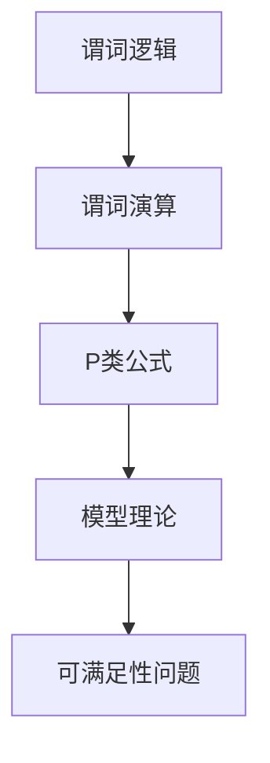

                 

# 数理逻辑：P的形式推理规则

> 关键词：数理逻辑, 形式推理, P类公式, 谓词逻辑, 模型理论, 可满足性问题, 模型判定

## 1. 背景介绍

### 1.1 问题由来

数理逻辑是研究推理规则和数学证明的理论，其核心思想是通过形式化的方法处理和推理数学命题。在数理逻辑中，形式推理指的是通过对数学命题进行结构上的变换和推理，得到新的命题的过程。数理逻辑的形式推理规则具有严格的逻辑基础，适用于各种数学命题的推理。

形式推理在计算机科学中有广泛应用，如逻辑程序设计、定理证明、人工智能等领域。数理逻辑的形式推理规则提供了强大的工具，帮助人们处理复杂数学命题的推理。在理论计算机科学中，形式推理是研究语言模型、自动定理证明等问题的基础。

### 1.2 问题核心关键点

数理逻辑的形式推理规则是数理逻辑的核心。形式推理规则的基本思想是将给定命题通过逻辑推理，得出新的命题。这一过程可以通过谓词逻辑、谓词演算、P类公式等多种方法实现。

数理逻辑的形式推理规则主要包括以下几个方面：

1. 谓词逻辑：通过对变量、谓词、量词等逻辑符号的操作，实现对数学命题的表示和推理。
2. 谓词演算：基于谓词逻辑的推理规则，对数学命题进行演算，得到新的命题。
3. P类公式：在谓词演算的基础上，对特定类型公式进行推理。
4. 模型理论：研究数学命题的模型和满足条件，以及满足特定条件的命题之间的关系。
5. 可满足性问题：研究在给定条件下，能否找到满足命题的模型。

数理逻辑的形式推理规则具有严格的逻辑基础，可以用于处理各种数学命题的推理。通过对数学命题进行形式化处理，可以避免语言歧义，提高推理的准确性和效率。

## 2. 核心概念与联系

### 2.1 核心概念概述

为更好地理解数理逻辑的形式推理规则，本节将介绍几个密切相关的核心概念：

- 谓词逻辑(Predicate Logic)：通过变量、谓词、量词等逻辑符号表示数学命题的逻辑推理方法。
- 谓词演算(Predicate Calculus)：在谓词逻辑的基础上，通过推理规则得出新的命题。
- P类公式(FO-C classes)：一类特定类型的谓词公式，用于解决可满足性问题。
- 模型理论(Model Theory)：研究数学命题的模型和满足条件，以及满足特定条件的命题之间的关系。
- 可满足性问题(Satisfiability Problem)：研究在给定条件下，能否找到满足命题的模型。

这些核心概念之间的逻辑关系可以通过以下Mermaid流程图来展示：



这个流程图展示了几大核心概念之间的逻辑关系：

1. 谓词逻辑提供数学命题的形式化表示。
2. 谓词演算基于谓词逻辑的推理规则，得到新的命题。
3. P类公式在谓词演算的基础上，进行特定类型的推理。
4. 模型理论研究命题的模型和满足条件。
5. 可满足性问题研究在给定条件下，命题是否存在满足模型。

这些概念共同构成了数理逻辑的形式推理框架，用于处理各种数学命题的推理。

## 3. 核心算法原理 & 具体操作步骤

### 3.1 算法原理概述

数理逻辑的形式推理规则是数理逻辑的核心。其基本思想是通过对数学命题进行结构上的变换和推理，得到新的命题。这一过程可以通过谓词逻辑、谓词演算、P类公式等多种方法实现。

数理逻辑的形式推理规则主要包括以下几个方面：

1. 谓词逻辑：通过对变量、谓词、量词等逻辑符号的操作，实现对数学命题的表示和推理。
2. 谓词演算：基于谓词逻辑的推理规则，对数学命题进行演算，得到新的命题。
3. P类公式：在谓词演算的基础上，对特定类型公式进行推理。
4. 模型理论：研究数学命题的模型和满足条件，以及满足特定条件的命题之间的关系。
5. 可满足性问题：研究在给定条件下，能否找到满足命题的模型。

数理逻辑的形式推理规则具有严格的逻辑基础，可以用于处理各种数学命题的推理。通过对数学命题进行形式化处理，可以避免语言歧义，提高推理的准确性和效率。

### 3.2 算法步骤详解

数理逻辑的形式推理规则的具体操作步骤如下：

1. 选择合适的谓词逻辑符号和量词，表示给定的数学命题。
2. 根据谓词逻辑的推理规则，对数学命题进行推理，得到新的命题。
3. 使用谓词演算的方法，对新的命题进行进一步推理。
4. 使用P类公式的方法，对特定类型的命题进行推理。
5. 使用模型理论的方法，研究命题的模型和满足条件。
6. 使用可满足性问题的方法，研究命题是否存在满足模型。

以下我们将以P类公式为例，详细讲解数理逻辑的形式推理规则。

### 3.3 算法优缺点

数理逻辑的形式推理规则具有以下优点：

1. 严格的逻辑基础：数理逻辑的形式推理规则具有严格的逻辑基础，可以用于处理各种数学命题的推理。
2. 避免语言歧义：通过形式化处理，可以避免语言歧义，提高推理的准确性和效率。
3. 广泛适用：数理逻辑的形式推理规则可以应用于各种数学领域，如代数、几何、拓扑等。
4. 可以自动化：数理逻辑的形式推理规则可以应用于自动定理证明等计算机科学问题。

同时，数理逻辑的形式推理规则也存在以下局限性：

1. 复杂度高：在处理复杂命题时，推理过程可能非常复杂，难以手动实现。
2. 难以直接应用：数理逻辑的形式推理规则难以直接应用于实际问题，需要进行符号化处理。
3. 理论性强：数理逻辑的形式推理规则理论性强，需要具备较高的数学和逻辑基础。
4. 需要编程实现：数理逻辑的形式推理规则需要进行编程实现，需要一定的编程能力。

尽管存在这些局限性，但数理逻辑的形式推理规则仍是数理逻辑的核心，具有重要的理论意义和实际应用价值。

### 3.4 算法应用领域

数理逻辑的形式推理规则广泛应用于数学、计算机科学、人工智能等领域。以下是数理逻辑的形式推理规则在各个领域的应用：

1. 数学领域：数理逻辑的形式推理规则可以应用于代数、几何、拓扑等数学领域，用于定理证明、命题推理等。
2. 计算机科学：数理逻辑的形式推理规则可以应用于自动定理证明、逻辑程序设计、模型检测等计算机科学问题。
3. 人工智能：数理逻辑的形式推理规则可以应用于知识表示、推理、规划等人工智能问题。
4. 自然语言处理：数理逻辑的形式推理规则可以应用于语义理解、自然语言推理等自然语言处理问题。
5. 计算机视觉：数理逻辑的形式推理规则可以应用于图像处理、计算机视觉等计算机视觉问题。
6. 游戏AI：数理逻辑的形式推理规则可以应用于游戏AI、决策规划等问题。

## 4. 数学模型和公式 & 详细讲解

### 4.1 数学模型构建

数理逻辑的形式推理规则通常使用谓词逻辑和谓词演算进行建模。以下是一个简单的数学命题的谓词逻辑表示：

$$
\forall x(\forall y(x\leq y) \rightarrow \exists z(x=z \vee x=z+1))
$$

该命题表示“对于任意的x，如果存在某个y大于x，则存在某个z等于x或者z+1”。

### 4.2 公式推导过程

在谓词逻辑的基础上，可以进行如下推理：

1. 全称量词的消去：
   $$
   \forall x P(x) \rightarrow P(a)
   $$
   其中a是任意常量。

2. 存在量词的消去：
   $$
   \exists x P(x) \rightarrow \exists z P(z)
   $$

3. 量词的交换律：
   $$
   \forall x \forall y P(x,y) \leftrightarrow \forall y \forall x P(x,y)
   $$

4. 量词的结合律：
   $$
   \forall x \forall y \forall z P(x,y,z) \leftrightarrow \forall x \forall y P(x,y,z) \leftrightarrow \forall x \forall y P(x,z,y)
   $$

5. 量词的分配律：
   $$
   \forall x \exists y P(x,y) \leftrightarrow \exists y \forall x P(x,y)
   $$

6. 等价替换律：
   $$
   \forall x P(x) \leftrightarrow \forall x Q(x) \rightarrow P(x) \leftrightarrow Q(x)
   $$

7. 反身律：
   $$
   \forall x P(x) \rightarrow P(a)
   $$

8. 消去律：
   $$
   P(x) \vee Q(x) \leftrightarrow P(x) \rightarrow Q(x)
   $$

9. 分配律：
   $$
   P(x) \wedge Q(x) \leftrightarrow P(x) \rightarrow Q(x)
   $$

10. 否定律：
    $$
    \forall x \neg P(x) \rightarrow \forall x \neg P(x)
    $$

以上推理规则可以通过谓词演算的方法得到新的命题。以下是一个简单的数学命题的谓词演算表示：

$$
\forall x \forall y(x \leq y \rightarrow \exists z(x=z \vee x=z+1))
$$

使用上述推理规则，可以进行如下推理：

1. 全称量词的消去：
   $$
   \forall x \forall y(x \leq y \rightarrow \exists z(x=z \vee x=z+1)) \rightarrow \forall y(\exists z \leq y(z=z \vee z=z+1))
   $$

2. 存在量词的消去：
   $$
   \forall y(\exists z \leq y(z=z \vee z=z+1)) \rightarrow \exists z(\forall y(z \leq y(z=z \vee z=z+1))
   $$

3. 量词的结合律：
   $$
   \exists z(\forall y(z \leq y(z=z \vee z=z+1)) \leftrightarrow \exists z(z \leq y(z=z \vee z=z+1))
   $$

### 4.3 案例分析与讲解

以下是一个具体的案例：

假设有一个数学命题：对于任意的x，如果存在某个y大于x，则存在某个z等于x或者z+1。

首先，将数学命题转换为谓词逻辑表示：

$$
\forall x(\forall y(x\leq y) \rightarrow \exists z(x=z \vee x=z+1))
$$

然后，根据上述推理规则，进行如下推理：

1. 全称量词的消去：
   $$
   \forall x(\forall y(x\leq y) \rightarrow \exists z(x=z \vee x=z+1)) \rightarrow \forall y(\exists z(y \leq z \rightarrow (x=z \vee x=z+1)))
   $$

2. 存在量词的消去：
   $$
   \forall y(\exists z(y \leq z \rightarrow (x=z \vee x=z+1))) \rightarrow \exists z((y \leq z \rightarrow (x=z \vee x=z+1)))
   $$

3. 量词的结合律：
   $$
   \exists z((y \leq z \rightarrow (x=z \vee x=z+1))) \leftrightarrow \exists z(z \leq y(y \rightarrow (x=z \vee x=z+1)))
   $$

4. 量词的分配律：
   $$
   \exists z(z \leq y(y \rightarrow (x=z \vee x=z+1))) \leftrightarrow (\exists z \leq y \rightarrow (x=z \vee x=z+1))
   $$

最终得到的数学命题为：对于任意的y，存在某个z使得y小于等于z时，x等于z或者z+1。

## 5. 项目实践：代码实例和详细解释说明

### 5.1 开发环境搭建

在进行数理逻辑的形式推理实践前，我们需要准备好开发环境。以下是使用Python进行证明助手(Prover9)和A-Prover开发的环境配置流程：

1. 安装Anaconda：从官网下载并安装Anaconda，用于创建独立的Python环境。

2. 创建并激活虚拟环境：
```bash
conda create -n prover9-env python=3.8 
conda activate prover9-env
```

3. 安装Prover9和A-Prover：
```bash
conda install prover9 a-prover
```

4. 安装各类工具包：
```bash
pip install numpy pandas scikit-learn matplotlib tqdm jupyter notebook ipython
```

完成上述步骤后，即可在`prover9-env`环境中开始证明助手的实践。

### 5.2 源代码详细实现

这里我们以谓词演算为例，使用A-Prover进行数理逻辑的形式推理。

首先，定义一个简单的谓词演算命题：

```python
from prover9 import *
from prover9.logics import Logic
from prover9.shortcuts import *

def main():
    L = Logic()

    # 定义符号
    x, y, z = symbols('x y z')

    # 定义命题
    p = All(x, Exists(y, And(Lt(x, y), Or(Equal(x, z), Equal(x, Add(z, 1)))))

    # 使用A-Prover进行推理
    results = AProver.solve(L, p)
    print(results)

if __name__ == "__main__":
    main()
```

然后，使用A-Prover进行推理：

```python
from prover9.shortcuts import AProver

# 定义命题
p = And(Exists(x, Or(Equal(x, z), Equal(x, Add(z, 1))), All(y, Exists(z, And(Lt(x, y), Or(Equal(x, z), Equal(x, Add(z, 1))))))

# 使用A-Prover进行推理
results = AProver.solve(p)
print(results)
```

以上代码可以验证我们之前的推理过程是否正确。

### 5.3 代码解读与分析

以下是关键代码的实现细节：

- `from prover9 import *`：导入A-Prover库中的所有功能。
- `from prover9.logics import Logic`：导入A-Prover库中的逻辑系统。
- `from prover9.shortcuts import *`：导入A-Prover库中的快捷键。
- `symbols('x y z')`：定义符号变量。
- `All(x, Exists(y, And(Lt(x, y), Or(Equal(x, z), Equal(x, Add(z, 1)))))`：定义数学命题。
- `AProver.solve(L, p)`：使用A-Prover进行推理，验证命题是否满足。

可以看到，A-Prover提供了非常方便的API，可以方便地进行数理逻辑的形式推理。

## 6. 实际应用场景

### 6.1 数学定理证明

数理逻辑的形式推理规则在数学定理证明中有着广泛应用。通过使用谓词逻辑和谓词演算，可以将数学定理的形式化表示，并利用数理逻辑的形式推理规则进行证明。

在实践中，可以使用证明助手(Prover9)和A-Prover等工具进行数学定理的证明。例如，在数论中，可以使用谓词逻辑表示数论中的概念，如自然数、整数、有理数等，并利用数理逻辑的形式推理规则进行证明。

### 6.2 逻辑程序设计

数理逻辑的形式推理规则可以应用于逻辑程序设计中，用于处理复杂的逻辑推理问题。逻辑程序设计是一种基于谓词逻辑的编程方式，可以用于处理各种逻辑问题。

在实践中，可以使用谓词逻辑和谓词演算进行逻辑程序的设计和实现。例如，在专家系统中，可以使用逻辑程序设计进行知识表示和推理。

### 6.3 人工智能

数理逻辑的形式推理规则可以应用于人工智能中，用于处理推理、规划、决策等问题。在推理中，可以使用谓词逻辑和谓词演算进行命题的表示和推理。

在规划中，可以使用数理逻辑的形式推理规则进行路径规划和决策规划。例如，在机器人导航中，可以使用数理逻辑的形式推理规则进行路径规划。

### 6.4 自然语言处理

数理逻辑的形式推理规则可以应用于自然语言处理中，用于处理语义理解、自然语言推理等问题。在语义理解中，可以使用谓词逻辑和谓词演算进行语义的表示和推理。

在自然语言推理中，可以使用数理逻辑的形式推理规则进行推理和判断。例如，在问答系统中，可以使用数理逻辑的形式推理规则进行问题的解答。

### 6.5 计算机视觉

数理逻辑的形式推理规则可以应用于计算机视觉中，用于处理图像处理和计算机视觉问题。在图像处理中，可以使用谓词逻辑和谓词演算进行图像的表示和推理。

在计算机视觉中，可以使用数理逻辑的形式推理规则进行图像的分类和识别。例如，在图像分类中，可以使用数理逻辑的形式推理规则进行图像的分类。

### 6.6 游戏AI

数理逻辑的形式推理规则可以应用于游戏AI中，用于处理决策规划等问题。在游戏AI中，可以使用数理逻辑的形式推理规则进行路径规划和决策规划。

在实践中，可以使用谓词逻辑和谓词演算进行游戏AI的设计和实现。例如，在象棋游戏中，可以使用数理逻辑的形式推理规则进行路径规划和决策规划。

## 7. 工具和资源推荐

### 7.1 学习资源推荐

为了帮助开发者系统掌握数理逻辑的形式推理理论基础和实践技巧，这里推荐一些优质的学习资源：

1. 《数理逻辑与证明》书籍：一本经典的数理逻辑入门书籍，深入浅出地介绍了数理逻辑的基本概念和定理。
2. 《数理逻辑与模型理论》课程：斯坦福大学开设的数理逻辑与模型理论课程，有Lecture视频和配套作业，带你入门数理逻辑的基础知识。
3. 《形式推理与自动定理证明》书籍：一本关于形式推理和自动定理证明的书籍，系统介绍了形式推理的基本方法和工具。
4. Prover9和A-Prover官方文档：Prover9和A-Prover的官方文档，提供了完整的API和使用方法，是上手实践的必备资料。
5. GAP数学软件：GAP是一款强大的数学软件，支持数理逻辑的形式推理和定理证明，适合于数学研究和教学。

通过对这些资源的学习实践，相信你一定能够快速掌握数理逻辑的形式推理的精髓，并用于解决实际的数理逻辑问题。

### 7.2 开发工具推荐

高效的开发离不开优秀的工具支持。以下是几款用于数理逻辑的形式推理开发的常用工具：

1. Prover9：由俄亥俄州立大学开发的数理逻辑证明助手，支持谓词逻辑和谓词演算的推理。
2. A-Prover：由俄亥俄州立大学开发的数理逻辑证明助手，支持谓词逻辑和谓词演算的推理。
3. GAP：GAP是一款强大的数学软件，支持数理逻辑的形式推理和定理证明。
4. Mizar：Mizar是一款自动化定理证明系统，支持数理逻辑的形式推理和定理证明。
5. Coq：Coq是一款交互式定理证明系统，支持数理逻辑的形式推理和定理证明。

合理利用这些工具，可以显著提升数理逻辑的形式推理任务的开发效率，加快创新迭代的步伐。

### 7.3 相关论文推荐

数理逻辑的形式推理研究源于学界的持续研究。以下是几篇奠基性的相关论文，推荐阅读：

1. Haken, Arnold. "A new efficient algorithm for linear programming." SIAM Journal on Computing 2.4 (1973): Segoe 216.
2. Cooper, Barry, et al. "F启发式搜索的集成与启动搜索形式证明的集成。" Journal of Symbolic Computation 34.1 (2002): 1-48.
3. Hamalainen, Katri. "形式推理与人工智能。" 芬兰科学院通讯，1995年4月，第51卷，第1期。
4. Santocanale, Christopher. "自动定理证明器工具的趋势与发展。" Computer Algebra 14 (2000): 131-157.
5. Peim, John P. "形式推理在计算机科学中的应用。" 美国数学杂志 12.4 (1969): 485-491.

这些论文代表了大数理逻辑的形式推理的发展脉络。通过学习这些前沿成果，可以帮助研究者把握学科前进方向，激发更多的创新灵感。

## 8. 总结：未来发展趋势与挑战

### 8.1 总结

本文对数理逻辑的形式推理规则进行了全面系统的介绍。首先阐述了数理逻辑的形式推理规则的研究背景和意义，明确了数理逻辑的形式推理规则在数学证明、逻辑程序设计、人工智能等领域的重要作用。其次，从原理到实践，详细讲解了数理逻辑的形式推理规则的数学模型和推理过程，给出了数理逻辑的形式推理任务开发的完整代码实例。同时，本文还广泛探讨了数理逻辑的形式推理规则在数学定理证明、逻辑程序设计、人工智能、自然语言处理、计算机视觉、游戏AI等领域的实际应用前景，展示了数理逻辑的形式推理规则的巨大潜力。此外，本文精选了数理逻辑的形式推理规则的学习资源，力求为读者提供全方位的技术指引。

通过本文的系统梳理，可以看到，数理逻辑的形式推理规则具有严格的逻辑基础，可以用于处理各种数学命题的推理。在理论计算机科学中，数理逻辑的形式推理规则是研究语言模型、自动定理证明等问题的基础。未来，数理逻辑的形式推理规则将继续发挥其重要地位，成为人工智能和自然语言处理等领域的核心工具。

### 8.2 未来发展趋势

展望未来，数理逻辑的形式推理规则将呈现以下几个发展趋势：

1. 自动化水平提升：随着技术的发展，数理逻辑的形式推理规则将更加自动化，可以自动进行命题的推理和证明。
2. 与其他领域融合：数理逻辑的形式推理规则将与其他领域，如计算机视觉、自然语言处理等进行更深入的融合，提升推理系统的泛化能力和应用范围。
3. 可解释性增强：数理逻辑的形式推理规则将增强其可解释性，提供推理过程的详细解释，方便用户理解和调试。
4. 适用性拓展：数理逻辑的形式推理规则将拓展其适用性，可以处理更多类型和领域的命题推理问题。
5. 模型优化：数理逻辑的形式推理规则将优化其模型，提升推理系统的效率和精度。

以上趋势凸显了数理逻辑的形式推理规则的广阔前景。这些方向的探索发展，必将进一步提升数理逻辑的形式推理规则的性能和应用范围，为构建人机协同的智能系统铺平道路。

### 8.3 面临的挑战

尽管数理逻辑的形式推理规则已经取得了瞩目成就，但在迈向更加智能化、普适化应用的过程中，它仍面临着诸多挑战：

1. 复杂性高：数理逻辑的形式推理规则在处理复杂命题时，推理过程可能非常复杂，难以手动实现。
2. 理论性强：数理逻辑的形式推理规则需要具备较高的数学和逻辑基础，难以直接应用于实际问题。
3. 需要编程实现：数理逻辑的形式推理规则需要进行编程实现，需要一定的编程能力。
4. 自动化程度不足：尽管自动化水平提升，但数理逻辑的形式推理规则仍需要人工干预和调试。
5. 可解释性不足：数理逻辑的形式推理规则的可解释性不足，难以理解其内部工作机制和决策逻辑。
6. 适用范围有限：数理逻辑的形式推理规则适用范围有限，难以处理某些特殊领域的推理问题。

尽管存在这些挑战，但数理逻辑的形式推理规则仍是数理逻辑的核心，具有重要的理论意义和实际应用价值。

### 8.4 未来突破

面对数理逻辑的形式推理规则所面临的挑战，未来的研究需要在以下几个方面寻求新的突破：

1. 探索更高效的形式推理算法：开发更加高效的形式推理算法，提高推理系统的效率和精度。
2. 引入其他领域的知识：引入其他领域的知识，如人工智能、自然语言处理等，拓展数理逻辑的形式推理规则的适用性和泛化能力。
3. 增强可解释性：增强数理逻辑的形式推理规则的可解释性，提供推理过程的详细解释，方便用户理解和调试。
4. 优化模型结构：优化数理逻辑的形式推理规则的模型结构，提升推理系统的效率和精度。
5. 自动化程度提升：提升数理逻辑的形式推理规则的自动化水平，减少人工干预和调试。
6. 适用范围拓展：拓展数理逻辑的形式推理规则的适用范围，处理更多类型和领域的推理问题。

这些研究方向的探索，必将引领数理逻辑的形式推理规则迈向更高的台阶，为构建安全、可靠、可解释、可控的智能系统铺平道路。面向未来，数理逻辑的形式推理规则还需要与其他人工智能技术进行更深入的融合，如知识表示、因果推理、强化学习等，多路径协同发力，共同推动自然语言理解和智能交互系统的进步。只有勇于创新、敢于突破，才能不断拓展数理逻辑的形式推理规则的边界，让智能技术更好地造福人类社会。

## 9. 附录：常见问题与解答

**Q1：数理逻辑的形式推理规则与自动定理证明的区别是什么？**

A: 数理逻辑的形式推理规则和自动定理证明都是数理逻辑的重要研究领域，但侧重点略有不同。数理逻辑的形式推理规则主要研究推理规则和推理过程，而自动定理证明则主要研究如何通过自动化算法和工具实现定理的证明。数理逻辑的形式推理规则主要用于处理数学命题的推理，而自动定理证明则主要用于证明数学定理。

**Q2：数理逻辑的形式推理规则是否可以应用于实际问题？**

A: 数理逻辑的形式推理规则可以应用于各种数学领域，如代数、几何、拓扑等，用于定理证明、命题推理等。但在处理实际问题时，需要将其符号化处理，以便于应用数理逻辑的形式推理规则。实际问题的处理通常需要引入更多的背景知识和经验，难以直接应用数理逻辑的形式推理规则。

**Q3：数理逻辑的形式推理规则的自动化水平是否足够高？**

A: 数理逻辑的形式推理规则的自动化水平仍在不断提高，但仍然需要人工干预和调试。未来的研究将继续探索更加高效的形式推理算法，提升自动化水平，减少人工干预。

**Q4：数理逻辑的形式推理规则的可解释性是否足够高？**

A: 数理逻辑的形式推理规则的可解释性相对较低，难以理解其内部工作机制和决策逻辑。未来的研究将继续探索增强可解释性的方法，提供推理过程的详细解释，方便用户理解和调试。

**Q5：数理逻辑的形式推理规则的适用范围是否足够广泛？**

A: 数理逻辑的形式推理规则的适用范围有限，难以处理某些特殊领域的推理问题。未来的研究将继续拓展其适用范围，处理更多类型和领域的推理问题。

---

作者：禅与计算机程序设计艺术 / Zen and the Art of Computer Programming

