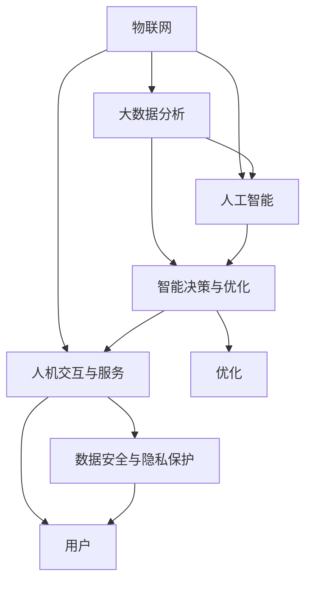

                 

## 1. 背景介绍

### 1.1 问题由来

随着城市化进程的不断加速，人口膨胀、交通拥堵、环境污染等城市问题日益严峻，亟需智慧城市的解决方案。智慧城市是一个集智能交通、智能能源、智能安全等多方面于一体的系统工程，旨在通过智能技术提升城市管理和公共服务的水平，为居民创造一个安全、舒适、便捷的生活环境。

智慧城市的核心在于运用现代信息技术，通过数据分析、人工智能、物联网等手段，实现对城市各项资源的高效管理和优化配置。这些技术的应用，有助于解决城市化进程中的诸多问题，提高城市运营效率，提升居民生活质量。

### 1.2 问题核心关键点

智慧城市的建设主要围绕以下几个关键点展开：

1. **数据采集与整合**：智慧城市的基础在于数据的采集与整合。通过物联网、传感器等技术，实时采集城市各类数据，如交通流量、空气质量、能源消耗等。这些数据是智慧城市进行决策和优化的重要依据。

2. **数据处理与分析**：在数据采集的基础上，利用大数据、人工智能等技术对数据进行处理与分析，挖掘出有价值的信息，为城市管理提供数据支持。

3. **智能决策与优化**：通过数据分析，结合城市管理经验和专家知识，形成智能决策模型，优化城市资源配置，提升城市管理效率。

4. **人机交互与服务**：智慧城市需要构建人机交互界面，如智能路灯、智能公交、智能家居等，为居民提供便捷的服务体验。

5. **安全与隐私**：智慧城市建设过程中，需要确保数据安全和用户隐私，防止数据泄露和滥用。

### 1.3 问题研究意义

智慧城市的建设对提升城市管理水平、优化资源配置、改善居民生活质量具有重要意义：

1. **提升城市运营效率**：通过智能技术对城市资源进行高效管理和配置，减少能源浪费，降低环境污染，提高城市运营效率。

2. **改善居民生活质量**：提供智能交通、智能医疗、智能教育等服务，提升居民生活便捷性，改善生活质量。

3. **促进城市可持续发展**：智慧城市的建设有助于实现城市的可持续发展，提高城市应对灾害、资源短缺等问题的能力。

4. **推动科技创新与产业发展**：智慧城市建设需要大量高科技产品和服务的支持，有助于推动科技创新和产业发展，促进经济增长。

## 2. 核心概念与联系

### 2.1 核心概念概述

智慧城市建设涉及多个领域的技术与理论，其中核心的概念包括：

- **物联网(IoT)**：通过传感器、智能设备等技术，实现对城市各项资源的数据采集。

- **大数据分析**：对城市数据进行收集、存储、处理和分析，挖掘出有价值的信息，为城市管理提供依据。

- **人工智能(AI)**：利用机器学习、深度学习等技术，对城市数据进行分析，形成智能决策。

- **智能决策与优化**：通过数据分析，结合城市管理经验和专家知识，形成智能决策模型，优化城市资源配置。

- **人机交互与服务**：构建智能路灯、智能公交、智能家居等人机交互界面，为居民提供便捷的服务体验。

- **数据安全与隐私保护**：在智慧城市建设过程中，确保数据安全和用户隐私，防止数据泄露和滥用。

这些概念之间存在紧密联系，共同构成了智慧城市的核心技术架构。物联网负责数据采集，大数据分析负责数据处理与分析，人工智能负责智能决策与优化，人机交互与服务提供用户体验，数据安全与隐私保护保障系统安全。

### 2.2 核心概念原理和架构的 Mermaid 流程图(Mermaid 流程节点中不要有括号、逗号等特殊字符)

## 3. 核心算法原理 & 具体操作步骤

### 3.1 算法原理概述

智慧城市建设中，数据采集、处理、分析和智能决策是关键环节。本节将详细探讨这些环节的算法原理。

智慧城市的数据采集依赖于物联网技术。物联网设备通过传感器实时采集城市各项数据，如交通流量、空气质量、能源消耗等。这些数据通过网络传输到云端，存储在数据库中。

智慧城市的数据处理与分析主要依赖于大数据技术。通过对采集到的城市数据进行处理和分析，挖掘出有价值的信息，为城市管理提供依据。大数据技术主要包括数据存储、数据清洗、数据挖掘、数据可视化等步骤。

智慧城市的智能决策与优化依赖于人工智能技术。利用机器学习、深度学习等技术，对城市数据进行分析，形成智能决策模型，优化城市资源配置。人工智能技术主要包括模型训练、特征提取、模型预测、模型优化等步骤。

### 3.2 算法步骤详解

智慧城市建设的算法步骤主要包括以下几个环节：

1. **数据采集**：通过物联网设备，采集城市各项数据，包括交通流量、空气质量、能源消耗等。数据采集需注意数据准确性、实时性、可靠性等指标。

2. **数据存储与清洗**：将采集到的数据存储到数据库中，并进行数据清洗，去除噪声、缺失值等，确保数据质量。

3. **数据处理与分析**：利用大数据技术对城市数据进行处理与分析，挖掘出有价值的信息，如交通拥堵情况、空气质量变化、能源消耗等。

4. **特征提取**：从处理后的数据中提取关键特征，用于训练智能决策模型。

5. **模型训练**：利用机器学习、深度学习等技术，训练智能决策模型，形成决策依据。

6. **模型预测与优化**：利用训练好的模型对城市各项资源进行预测与优化，如交通信号控制、能源分配等。

7. **人机交互与服务**：通过智能路灯、智能公交、智能家居等人机交互界面，为居民提供便捷的服务体验。

8. **数据安全与隐私保护**：在数据采集、处理、分析等环节，确保数据安全和用户隐私，防止数据泄露和滥用。

### 3.3 算法优缺点

智慧城市建设中的算法具有以下优点：

1. **提高城市运营效率**：通过智能技术对城市资源进行高效管理和配置，减少能源浪费，降低环境污染，提高城市运营效率。

2. **改善居民生活质量**：提供智能交通、智能医疗、智能教育等服务，提升居民生活便捷性，改善生活质量。

3. **促进城市可持续发展**：智慧城市的建设有助于实现城市的可持续发展，提高城市应对灾害、资源短缺等问题的能力。

4. **推动科技创新与产业发展**：智慧城市建设需要大量高科技产品和服务的支持，有助于推动科技创新和产业发展，促进经济增长。

同时，智慧城市建设中的算法也存在以下缺点：

1. **数据采集成本高**：物联网设备成本较高，数据采集需投入大量资金。

2. **数据存储与处理量大**：城市数据量庞大，存储与处理需大量计算资源。

3. **智能决策模型复杂**：智能决策模型需处理复杂的城市数据，训练与优化过程复杂。

4. **隐私与安全问题**：智慧城市建设过程中，需确保数据安全和用户隐私，防止数据泄露和滥用。

### 3.4 算法应用领域

智慧城市的建设涵盖多个领域，包括但不限于以下方面：

1. **智能交通**：通过智能路灯、智能公交、智能交通信号等技术，实现交通流量控制，提高道路通行效率，减少交通拥堵。

2. **智能能源**：利用智能电网、智能家居等技术，优化能源分配，提高能源利用效率，降低能源消耗。

3. **智能安防**：通过智能监控、智能报警等技术，提高城市安全防范水平，预防和应对突发事件。

4. **智能医疗**：利用智能诊断、智能预约等技术，提升医疗服务效率，改善医疗资源配置。

5. **智能教育**：通过智能教育平台、智能教学设备等技术，提升教育质量，优化教育资源配置。

6. **智能环境监测**：利用智能传感器、智能监测设备等技术，实时监测空气质量、水质等环境指标，提供健康保障。

## 4. 数学模型和公式 & 详细讲解 & 举例说明（备注：数学公式请使用latex格式，latex嵌入文中独立段落使用 $$，段落内使用 $)
### 4.1 数学模型构建

智慧城市的建设涉及到多个数学模型，包括数据模型、决策模型、优化模型等。以下是智慧城市建设中常见的数学模型构建方法：

1. **数据模型**：数据模型主要用于描述城市各项数据的特征，如时间序列模型、空间分布模型、多维数据模型等。

2. **决策模型**：决策模型主要用于辅助城市管理决策，如预测模型、分类模型、聚类模型等。

3. **优化模型**：优化模型主要用于城市资源配置与优化，如线性规划模型、整数规划模型、多目标优化模型等。

### 4.2 公式推导过程

智慧城市建设中的公式推导过程主要包括以下几个步骤：

1. **数据模型推导**：
   - 时间序列模型：利用ARIMA模型对交通流量、空气质量等时间序列数据进行建模。
   $$
   y_t = c + \sum_{i=1}^p \alpha_i y_{t-i} + \sum_{j=1}^q \beta_j \Delta^j y_{t-j} + \sum_{k=1}^K \gamma_k z_{t-k}
   $$
   - 空间分布模型：利用空间分布模型对城市空间数据进行建模。
   $$
   y_{ij} = \mu + \sum_{k=1}^K \beta_{ik} x_{ik} + \epsilon_{ij}
   $$

2. **决策模型推导**：
   - 预测模型：利用回归模型对城市数据进行预测。
   $$
   y = \beta_0 + \sum_{i=1}^p \beta_i x_i + \epsilon
   $$
   - 分类模型：利用分类模型对城市数据进行分类。
   $$
   P(y|x) = \frac{e^{\beta_0 + \sum_{i=1}^p \beta_i x_i}}{1 + \sum_{i=1}^p e^{\beta_i x_i}}
   $$
   - 聚类模型：利用聚类模型对城市数据进行分类。
   $$
   \min_{k=1}^K \sum_{i=1}^n \rho(x_i, C_k)
   $$

3. **优化模型推导**：
   - 线性规划模型：
   $$
   \max_{x} c^T x \text{ subject to } Ax \leq b, Bx = c, x \geq 0
   $$
   - 整数规划模型：
   $$
   \min_{x} c^T x \text{ subject to } Ax \leq b, Bx = c, x \geq 0, x \in \{0,1\}
   $$
   - 多目标优化模型：
   $$
   \min_{x} f(x) \text{ subject to } g(x) = 0, h(x) \leq 0
   $$

### 4.3 案例分析与讲解

以智能交通为例，介绍智慧城市建设中的数据模型、决策模型和优化模型的应用。

1. **数据模型**：
   - 利用时间序列模型对交通流量进行建模。
   $$
   y_t = c + \sum_{i=1}^p \alpha_i y_{t-i} + \sum_{j=1}^q \beta_j \Delta^j y_{t-j} + \sum_{k=1}^K \gamma_k z_{t-k}
   $$

2. **决策模型**：
   - 利用预测模型对未来交通流量进行预测。
   $$
   y = \beta_0 + \sum_{i=1}^p \beta_i x_i + \epsilon
   $$

3. **优化模型**：
   - 利用线性规划模型对交通信号灯进行优化。
   $$
   \max_{x} c^T x \text{ subject to } Ax \leq b, Bx = c, x \geq 0
   $$

## 5. 项目实践：代码实例和详细解释说明

### 5.1 开发环境搭建

智慧城市建设的开发环境搭建主要包括以下几个步骤：

1. **安装Python**：确保系统已安装Python 3.x版本，可以通过命令行安装或使用Anaconda等工具。

2. **安装相关库**：
   - 安装Pandas、NumPy、SciPy等数据处理库。
   - 安装Scikit-Learn、TensorFlow、PyTorch等机器学习与深度学习库。
   - 安装OpenCV、Faker等计算机视觉与自然语言处理库。

3. **设置环境变量**：设置Python路径、DLL路径等环境变量，确保代码可以正常运行。

4. **配置开发环境**：使用VSCode、PyCharm等IDE进行代码开发，并配置相应的调试工具和版本控制系统。

### 5.2 源代码详细实现

智慧城市建设的源代码实现主要包括以下几个方面：

1. **数据采集**：利用Python的IoT库进行数据采集，例如使用MQTT协议连接物联网设备，获取城市各项数据。

2. **数据存储与清洗**：使用Pandas库进行数据存储与清洗，例如使用to_csv()函数将数据保存到本地文件，使用fillna()函数填补缺失值。

3. **数据处理与分析**：使用Scikit-Learn库进行数据处理与分析，例如使用 PCA 降维、K-Means 聚类、LSTM 预测等。

4. **智能决策与优化**：使用TensorFlow库进行智能决策与优化，例如使用 Keras 搭建预测模型、使用 TensorFlow Serving 进行模型部署、使用 Reinforcement Learning 进行优化决策。

5. **人机交互与服务**：使用Flask、Django 等框架进行人机交互与服务开发，例如使用 Flask 搭建 RESTful API，使用 Django 进行 Web 应用开发。

### 5.3 代码解读与分析

智慧城市建设的代码实现主要包括以下几个步骤：

1. **数据采集**：
   - 利用IoT库，连接物联网设备，获取城市各项数据。
   - 将数据保存至本地文件，并进行初步清洗。

2. **数据存储与清洗**：
   - 使用Pandas库，将数据保存至本地文件，并进行初步清洗。
   - 使用fillna()函数填补缺失值，确保数据完整性。

3. **数据处理与分析**：
   - 使用Scikit-Learn库，对数据进行降维、聚类、预测等处理。
   - 利用时间序列模型对交通流量、空气质量等数据进行建模。

4. **智能决策与优化**：
   - 使用TensorFlow库，搭建预测模型、优化模型。
   - 利用 Reinforcement Learning 进行优化决策，提升交通信号控制效果。

5. **人机交互与服务**：
   - 使用Flask框架，搭建 RESTful API，提供数据访问接口。
   - 使用 Django 框架，进行 Web 应用开发，提供智能交互界面。

## 6. 实际应用场景

### 6.1 智能交通

智能交通是智慧城市建设的重要组成部分，通过智能技术对交通流量进行实时监测与控制，提升道路通行效率，减少交通拥堵。

1. **交通流量监测**：通过智能路灯、智能监控设备等技术，实时监测道路交通流量，为交通管理提供数据支持。

2. **交通信号控制**：利用智能算法对交通信号灯进行优化控制，减少交通拥堵，提高道路通行效率。

3. **智能导航**：通过智能导航系统，为用户提供实时路况信息，推荐最优路线。

### 6.2 智能安防

智能安防是智慧城市建设的重要环节，通过智能监控、智能报警等技术，提高城市安全防范水平，预防和应对突发事件。

1. **智能监控**：通过智能监控设备，实时监测城市各区域的视频数据，为安防管理提供数据支持。

2. **智能报警**：通过智能报警系统，对异常事件进行实时监测与报警，提升城市安全防范水平。

3. **应急响应**：通过智能决策系统，对突发事件进行应急响应与处理，减少灾害损失。

### 6.3 智能医疗

智能医疗是智慧城市建设的重要组成部分，通过智能诊断、智能预约等技术，提升医疗服务效率，改善医疗资源配置。

1. **智能诊断**：通过智能诊断系统，对疾病进行快速准确诊断，提高医疗服务效率。

2. **智能预约**：通过智能预约系统，为患者提供便捷的预约服务，减少排队时间，提高医疗服务效率。

3. **远程医疗**：通过智能视频会议系统，提供远程医疗服务，提升医疗服务水平。

## 7. 工具和资源推荐

### 7.1 学习资源推荐

为了帮助开发者系统掌握智慧城市建设的相关知识，以下是几本推荐的书籍和在线课程：

1. **《智慧城市：基于物联网和大数据的城市管理》**：该书系统介绍了智慧城市的基本概念、技术架构和管理方法，适合初学者入门。

2. **《Python 3 智能交通系统开发实战》**：该书详细介绍了利用Python进行智能交通系统开发的实战案例，适合有基础的开发者参考。

3. **《大数据分析与处理实战》**：该书详细介绍了利用大数据技术进行数据处理和分析的方法，适合数据工程师和数据分析师参考。

4. **《智慧城市技术导论》**：该书系统介绍了智慧城市的关键技术和应用场景，适合技术开发者和管理者参考。

### 7.2 开发工具推荐

智慧城市建设需要多种开发工具的支持，以下是推荐的开发工具：

1. **Python**：Python是最常用的智慧城市开发语言，具备丰富的数据处理和机器学习库。

2. **TensorFlow**：TensorFlow是最流行的深度学习框架，支持大规模模型训练和优化。

3. **Flask**：Flask是轻量级的Web框架，适合开发智慧城市的RESTful API。

4. **Django**：Django是全功能的Web框架，适合开发智慧城市的Web应用。

### 7.3 相关论文推荐

智慧城市建设涉及多种前沿技术，以下是几篇推荐的相关论文：

1. **《基于物联网的智慧城市数据采集与处理技术》**：介绍了利用物联网技术进行智慧城市数据采集与处理的方法。

2. **《基于大数据分析的智能交通流量预测》**：介绍了利用大数据技术进行智慧城市交通流量预测的方法。

3. **《基于人工智能的智慧城市智能决策系统》**：介绍了利用人工智能技术进行智慧城市智能决策的方法。

## 8. 总结：未来发展趋势与挑战

### 8.1 研究成果总结

智慧城市建设的研究成果涵盖了多个领域，包括数据采集、数据处理、智能决策等，为城市管理提供了强有力的技术支持。

1. **数据采集技术**：利用物联网技术进行城市数据采集，获取城市各项数据，为智慧城市建设提供数据支持。

2. **数据处理技术**：利用大数据技术进行数据处理与分析，挖掘出有价值的信息，为城市管理提供依据。

3. **智能决策技术**：利用人工智能技术进行智能决策与优化，提升城市资源配置效率，提高城市管理水平。

### 8.2 未来发展趋势

智慧城市建设的发展趋势主要包括以下几个方面：

1. **物联网技术普及**：物联网技术的发展将进一步提升智慧城市的智能感知能力，为城市管理提供更全面的数据支持。

2. **大数据技术成熟**：大数据技术的发展将进一步提升智慧城市的智能分析能力，为城市管理提供更精准的决策依据。

3. **人工智能技术进步**：人工智能技术的发展将进一步提升智慧城市的智能决策能力，为城市管理提供更高效的资源配置。

4. **智慧城市平台建设**：智慧城市平台将成为智慧城市建设的基础设施，提供统一的数据管理和应用服务。

### 8.3 面临的挑战

智慧城市建设面临的挑战主要包括以下几个方面：

1. **数据隐私与安全**：智慧城市建设过程中，需确保数据安全和用户隐私，防止数据泄露和滥用。

2. **技术复杂性**：智慧城市建设涉及多种前沿技术，需综合考虑数据采集、处理、分析、决策等环节的技术实现。

3. **成本高昂**：智慧城市建设需投入大量资金，包括物联网设备、大数据平台、人工智能系统等。

4. **用户接受度**：智慧城市建设需提升用户接受度，确保智能技术与服务的普及应用。

### 8.4 研究展望

未来智慧城市建设的研究展望主要包括以下几个方面：

1. **数据隐私与安全技术**：需进一步提升数据隐私与安全技术，确保智慧城市建设中的数据安全和用户隐私。

2. **智慧城市平台建设**：需进一步提升智慧城市平台的技术水平，提供统一的数据管理和应用服务。

3. **跨领域技术融合**：需进一步推动智慧城市建设中的跨领域技术融合，提升智慧城市的综合管理能力。

4. **智慧城市应用推广**：需进一步推动智慧城市应用推广，提升智慧城市建设的社会效益和经济效益。

## 9. 附录：常见问题与解答

**Q1：智慧城市建设中的数据隐私和安全问题如何解决？**

A: 智慧城市建设中的数据隐私和安全问题可以通过以下方法解决：

1. 数据匿名化：对敏感数据进行匿名化处理，去除可识别个人身份的信息。

2. 数据加密：对数据进行加密存储和传输，防止数据泄露和滥用。

3. 访问控制：对数据访问进行严格控制，确保只有授权人员可以访问敏感数据。

4. 安全审计：对数据访问和使用进行安全审计，防止数据滥用和恶意攻击。

**Q2：智慧城市建设中如何应对技术复杂性？**

A: 智慧城市建设中的技术复杂性可以通过以下方法解决：

1. 技术架构设计：进行全面的技术架构设计，明确各技术组件的接口和功能。

2. 模块化开发：采用模块化开发方法，将复杂技术分为多个模块，逐步开发实现。

3. 团队协作：建立跨部门的技术团队，进行紧密协作，共同解决技术难题。

4. 持续改进：持续改进技术架构和技术实现，提高系统的稳定性和可靠性。

**Q3：智慧城市建设中如何控制成本？**

A: 智慧城市建设中的成本控制可以通过以下方法解决：

1. 统一规划：制定统一的技术规划和实施方案，避免重复建设和资源浪费。

2. 技术共享：利用云计算和共享技术，降低硬件和软件成本。

3. 需求分析：进行详细的技术需求分析，避免过度设计和冗余建设。

4. 项目管理：采用科学的项目管理方法，确保项目按时按质完成。

---

作者：禅与计算机程序设计艺术 / Zen and the Art of Computer Programming

