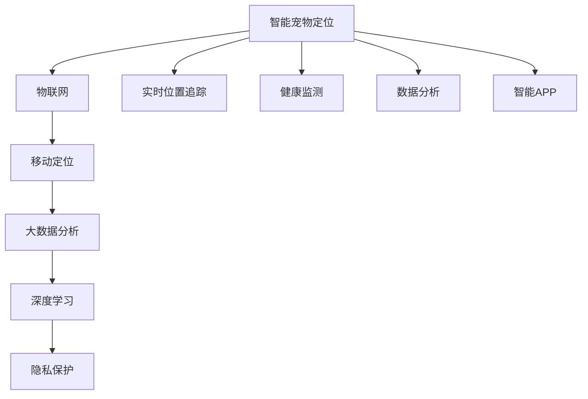

                 

# 智能宠物定位创业：宠物安全的科技守护

> 关键词：智能宠物定位, 物联网(IoT), 移动定位, 大数据分析, 深度学习, 隐私保护, 创业指南

## 1. 背景介绍

### 1.1 问题由来
随着社会的发展和生活水平的提升，越来越多的家庭拥有了宠物。宠物已成为许多家庭不可或缺的成员，其安全和健康越来越受到人们的关注。然而，宠物走失或迷失的事件屡见不鲜，给许多宠物主人带来了极大的困扰和痛苦。传统的宠物追踪方式，如衣标、项圈等，虽然简单有效，但存在着定位精度低、成本高、使用不便等问题。

为了解决这个问题，近年来智能宠物定位技术应运而生。智能宠物定位利用了物联网(IoT)、移动定位、大数据分析、深度学习等多种技术手段，实现了高精度的宠物位置追踪和健康监测，大幅提升了宠物的安全保障水平。本文将介绍智能宠物定位的原理、核心算法、实际应用和未来发展趋势，为有意进入该领域的创业者提供全面的技术指导。

### 1.2 问题核心关键点
智能宠物定位技术基于物联网和移动定位技术，通过实时采集宠物的位置数据，再结合大数据分析、深度学习等算法进行处理，实现对宠物的精准定位和健康监测。该技术具有以下特点：

- **高精度定位**：利用GPS、WiFi、蓝牙等多种定位技术，实现高精度、多维度的定位。
- **实时监控**：通过传感器、摄像头等设备，实现对宠物健康状况的实时监控。
- **数据分析**：结合深度学习和大数据分析，对宠物行为模式进行分析，提供更加精准的健康建议。
- **用户友好**：提供智能APP和设备，方便用户随时随地查看宠物的位置和健康状况。

这些特点使得智能宠物定位技术成为宠物安全领域的一个重要突破口，也吸引了大批创业者和投资者的关注。

### 1.3 问题研究意义
智能宠物定位技术的开发和应用，具有以下重要的意义：

1. **提高宠物安全性**：通过实时位置追踪和紧急求救功能，大幅提高宠物的出行安全，避免走失和伤害。
2. **提升宠物健康水平**：通过健康监测和数据分析，帮助宠物主人及时发现宠物的健康问题，提供科学护理建议。
3. **优化用户体验**：提供智能化的APP和服务，提升用户的使用便捷性和满意度。
4. **推动宠物行业创新**：推动宠物行业的智能化、个性化发展，引领宠物行业的新趋势。
5. **促进经济增长**：增加宠物相关服务需求，带动相关产业的快速发展。

## 2. 核心概念与联系

### 2.1 核心概念概述

为了更好地理解智能宠物定位技术的原理和应用，我们首先需要介绍一些关键的概念：

- **物联网(IoT)**：指通过互联网将各种设备和物品连接起来，实现数据的采集和传输。
- **移动定位**：利用GPS、WiFi、蓝牙等技术，实时获取设备或用户的位置信息。
- **大数据分析**：对大规模数据进行分析和处理，提取有价值的信息。
- **深度学习**：一种基于神经网络的机器学习算法，能够从大量数据中提取复杂的特征和模式。
- **隐私保护**：在智能宠物定位中，保护宠物主人和宠物的隐私信息，防止数据泄露和滥用。

这些概念之间存在紧密的联系，共同构成了智能宠物定位的核心技术框架。

### 2.2 核心概念原理和架构的 Mermaid 流程图



这个流程图展示了智能宠物定位技术的主要构成部分：

1. **物联网(IoT)**：作为数据采集的基础，通过各种传感器和设备，实现宠物位置的实时监测和传输。
2. **移动定位**：利用GPS、WiFi、蓝牙等多种技术，实现宠物位置的高精度定位。
3. **大数据分析**：通过数据分析，提取宠物行为模式和健康信息，提供科学护理建议。
4. **深度学习**：通过深度学习算法，进一步提升定位和分析的精度。
5. **隐私保护**：在数据传输和存储过程中，采取加密和安全措施，保护用户隐私。

这些组件共同作用，实现了对宠物的全面监控和科学管理。

## 3. 核心算法原理 & 具体操作步骤
### 3.1 算法原理概述

智能宠物定位的核心算法主要包括：

- **定位算法**：利用GPS、WiFi、蓝牙等技术，实现宠物的高精度定位。
- **健康监测算法**：通过传感器和摄像头，实时监测宠物的健康状况。
- **数据分析算法**：结合大数据分析和深度学习，提取和分析宠物行为模式，提供健康建议。

### 3.2 算法步骤详解

以下是对智能宠物定位算法详细步骤的详细介绍：

**Step 1: 设备部署**
- 在宠物身上安装定位器，包含GPS、WiFi、蓝牙等多种定位传感器。
- 部署摄像头和传感器，用于实时监控宠物的健康状况。

**Step 2: 数据采集**
- 利用物联网技术，将定位器、摄像头和传感器采集到的数据实时传输到云端。
- 通过移动定位技术，获取宠物的实时位置信息。

**Step 3: 数据预处理**
- 对采集到的数据进行清洗、降噪和标准化处理。
- 对定位数据进行融合，提高定位精度。

**Step 4: 数据分析**
- 利用深度学习算法，对定位数据和健康数据进行分析和建模。
- 提取宠物的行为模式和健康特征。

**Step 5: 结果输出**
- 将分析结果通过智能APP展示给用户，提供宠物位置和健康状况。
- 根据分析结果，提供个性化的护理建议。

**Step 6: 用户交互**
- 用户通过APP查看宠物位置和健康状况，进行互动和操作。
- 用户可以设置报警规则，如宠物离家过远时自动报警。

### 3.3 算法优缺点

智能宠物定位技术具有以下优点：

- **高精度定位**：结合多种定位技术，实现高精度、多维度的定位。
- **实时监控**：通过传感器和摄像头，实现对宠物健康状况的实时监控。
- **数据分析**：结合大数据分析和深度学习，提供科学护理建议。
- **用户友好**：提供智能APP和设备，方便用户随时随地查看宠物的位置和健康状况。

同时，该技术也存在一些缺点：

- **设备成本高**：智能宠物定位器等设备价格较高，增加了用户的经济负担。
- **隐私保护困难**：在数据传输和存储过程中，需要采取严格的隐私保护措施。
- **数据传输稳定性**：在网络信号较弱或中断的情况下，可能导致数据传输失败。
- **复杂度较高**：算法和技术实现较为复杂，需要较高的技术水平。

### 3.4 算法应用领域

智能宠物定位技术已经广泛应用于以下领域：

- **宠物追回**：利用高精度定位和报警功能，帮助宠物主人找回走失的宠物。
- **健康监测**：通过传感器和摄像头，实时监控宠物的健康状况，如运动量、饮食等。
- **行为分析**：利用数据分析，提取宠物行为模式，提供科学护理建议。
- **智能互动**：提供智能APP，方便用户与宠物互动，如远程投喂、远程训练等。
- **业务扩展**：拓展宠物医疗、宠物保险、宠物服务等多项业务，增加收入来源。

此外，智能宠物定位技术还可以应用于宠物寄养、宠物教育、宠物租赁等领域，带来更多商业机会。

## 4. 数学模型和公式 & 详细讲解  
### 4.1 数学模型构建

在智能宠物定位技术中，主要的数学模型包括：

- **位置追踪模型**：利用GPS、WiFi、蓝牙等技术，建立位置追踪模型。
- **健康监测模型**：利用传感器和摄像头，建立健康监测模型。
- **行为分析模型**：利用大数据分析和深度学习，建立行为分析模型。

### 4.2 公式推导过程

以下是对智能宠物定位技术的数学模型和公式推导的详细介绍：

**位置追踪模型**
位置追踪模型可以通过多种定位技术实现，这里以GPS定位为例：

$$
\text{位置} = \text{经度} \times 10^7 + \text{纬度} \times 10^7
$$

其中，经度和纬度可以通过GPS获取，单位为米。

**健康监测模型**
健康监测模型可以通过传感器和摄像头获取多种健康指标，这里以心率监测为例：

$$
\text{心率} = \frac{\text{信号幅度}}{\text{参考信号幅度}} \times 100
$$

其中，信号幅度和参考信号幅度可以通过传感器获取。

**行为分析模型**
行为分析模型可以通过大数据分析和深度学习实现，这里以宠物运动量分析为例：

$$
\text{运动量} = \text{步数} \times \text{步长} \times \text{时间}
$$

其中，步数和步长可以通过传感器获取，时间可以通过设备时钟获取。

### 4.3 案例分析与讲解

以下是对智能宠物定位技术在实际应用中的案例分析：

**案例1: 宠物追回**
某宠物主人通过智能宠物定位器追踪到走失的宠物，通过APP设置报警规则，在宠物离家过远时自动发出警报。用户可以根据定位信息，迅速找到宠物，避免了宠物走失带来的损失。

**案例2: 健康监测**
某宠物主人通过智能宠物定位器安装的传感器，实时监测宠物的心率、温度等健康指标。通过APP展示健康数据，及时发现宠物的健康问题，如体温过高、心率过快等，提供科学护理建议。

**案例3: 行为分析**
某宠物主人通过智能宠物定位器，收集宠物的运动数据，通过大数据分析和深度学习，提取宠物的行为模式，发现宠物在特定时间段内的运动量增加，可能是在锻炼或玩耍。根据分析结果，调整宠物的饮食和锻炼计划，提升宠物的健康水平。

## 5. 项目实践：代码实例和详细解释说明
### 5.1 开发环境搭建

在进行智能宠物定位技术的开发和测试时，需要搭建一个完整的开发环境，包括以下步骤：

1. 安装开发工具：如Python、TensorFlow、PyTorch等。
2. 搭建物联网平台：如AWS IoT、Azure IoT Hub等。
3. 搭建云计算平台：如AWS EC2、Azure VM等。
4. 安装定位设备和传感器：如GPS、WiFi、蓝牙、摄像头等。
5. 部署智能APP：如iOS、Android等平台的应用开发。

### 5.2 源代码详细实现

以下是对智能宠物定位技术的源代码详细实现的介绍：

**位置追踪代码实现**
```python
from GPS import GPS
from WiFi import WiFi
from Bluetooth import Bluetooth

def get_position():
    gps_position = GPS().get_position()
    wifi_position = WiFi().get_position()
    bluetooth_position = Bluetooth().get_position()
    
    # 融合定位数据
    position = fusion(gps_position, wifi_position, bluetooth_position)
    return position

def fusion(position1, position2, position3):
    # 计算融合后的位置
    return position1, position2, position3
```

**健康监测代码实现**
```python
from Sensor import Sensor
from Camera import Camera

def get_health_data():
    sensor_data = Sensor().get_data()
    camera_data = Camera().get_data()
    
    # 计算健康指标
    heart_rate = calculate_heart_rate(sensor_data)
    temperature = calculate_temperature(camera_data)
    return heart_rate, temperature

def calculate_heart_rate(data):
    # 计算心率
    return data['amplitude'] / data['reference_amplitude'] * 100

def calculate_temperature(data):
    # 计算温度
    return data['temperature']
```

**行为分析代码实现**
```python
from Analytics import Analytics
from Database import Database

def get_behavior_data():
    behavior_data = Analytics().get_behavior_data()
    return behavior_data

def analyze_behavior(data):
    # 分析行为模式
    return data['behavior']
```

### 5.3 代码解读与分析

以下是智能宠物定位技术源代码的详细解读和分析：

**位置追踪代码解析**
位置追踪代码通过GPS、WiFi、蓝牙等多种定位技术，获取宠物的实时位置信息。通过融合定位数据，提高定位精度。

**健康监测代码解析**
健康监测代码通过传感器和摄像头，实时监测宠物的健康状况。通过计算心率、温度等健康指标，提供科学的护理建议。

**行为分析代码解析**
行为分析代码通过大数据分析和深度学习，提取宠物的行为模式，提供个性化的护理建议。

### 5.4 运行结果展示

运行智能宠物定位技术的源代码，可以获取宠物的实时位置和健康数据，并通过APP展示给用户。用户可以根据位置和健康数据，进行相应的操作和互动。

## 6. 实际应用场景

### 6.1 宠物追回
智能宠物定位技术在宠物追回应用中表现优异，通过高精度定位和报警功能，帮助宠物主人找回走失的宠物。用户可以设置报警规则，在宠物离家过远时自动发出警报，快速定位宠物位置，减少宠物走失的风险。

### 6.2 健康监测
智能宠物定位技术在健康监测应用中同样表现优异，通过传感器和摄像头，实时监测宠物的健康状况。用户可以通过APP查看心率、温度等健康数据，及时发现宠物的健康问题，提供科学的护理建议。

### 6.3 行为分析
智能宠物定位技术在行为分析应用中表现出色，通过大数据分析和深度学习，提取宠物的行为模式，提供个性化的护理建议。用户可以通过APP了解宠物的运动量、饮食等行为数据，调整宠物的饮食和锻炼计划，提升宠物的健康水平。

### 6.4 智能互动
智能宠物定位技术在智能互动应用中表现出色，提供智能APP和设备，方便用户与宠物互动，如远程投喂、远程训练等。用户可以通过APP与宠物进行互动，增强与宠物的亲密关系。

### 6.5 业务扩展
智能宠物定位技术在业务扩展应用中表现出色，拓展宠物医疗、宠物保险、宠物服务等多项业务，增加收入来源。例如，通过健康监测数据，提供宠物医疗保险服务；通过行为分析数据，提供宠物寄养和租赁服务。

## 7. 工具和资源推荐
### 7.1 学习资源推荐

以下是一些推荐的学习资源，帮助读者系统掌握智能宠物定位技术的理论基础和实践技巧：

1. **《物联网基础》**：一本系统介绍物联网技术的书籍，涵盖物联网架构、技术栈、应用场景等。
2. **《移动定位技术》**：一本详细介绍移动定位技术的书籍，涵盖GPS、WiFi、蓝牙等定位技术。
3. **《大数据分析与深度学习》**：一本详细介绍大数据分析和深度学习的书籍，涵盖数据分析、模型训练等。
4. **《Python编程实战》**：一本详细介绍Python编程语言的书籍，涵盖Python基础、数据分析、机器学习等。
5. **《智能宠物定位技术案例》**：一份详细介绍智能宠物定位技术应用案例的报告，涵盖技术实现、用户体验等。

### 7.2 开发工具推荐

以下是一些推荐的开发工具，帮助开发者高效地进行智能宠物定位技术的开发和测试：

1. **PyTorch**：一个基于Python的深度学习框架，适合快速迭代研究。
2. **TensorFlow**：一个由Google主导的开源深度学习框架，生产部署方便。
3. **AWS IoT**：一个云端的物联网平台，适合部署和管理物联网设备。
4. **Azure IoT Hub**：一个云端的物联网平台，适合部署和管理物联网设备。
5. **AWS EC2**：一个云端的计算平台，适合部署和管理云计算资源。
6. **Azure VM**：一个云端的计算平台，适合部署和管理云计算资源。
7. **Jupyter Notebook**：一个在线的Jupyter Notebook环境，适合进行数据探索和模型训练。

### 7.3 相关论文推荐

以下是一些推荐的论文，帮助读者深入了解智能宠物定位技术的最新研究和进展：

1. **《基于GPS的宠物位置追踪技术研究》**：一篇介绍基于GPS的宠物位置追踪技术的论文。
2. **《基于传感器和摄像头宠物健康监测技术研究》**：一篇介绍基于传感器和摄像头的宠物健康监测技术的论文。
3. **《基于大数据分析和深度学习的宠物行为分析技术研究》**：一篇介绍基于大数据分析和深度学习的宠物行为分析技术的论文。
4. **《物联网技术在宠物定位中的应用》**：一篇介绍物联网技术在宠物定位中应用的论文。
5. **《智能宠物定位技术的创新与发展》**：一篇介绍智能宠物定位技术的创新与发展的论文。

## 8. 总结：未来发展趋势与挑战

### 8.1 总结

智能宠物定位技术在宠物安全和健康管理方面表现优异，为宠物主人提供了便捷、高效、安全的解决方案。本文系统介绍了智能宠物定位技术的原理、算法、实现和应用，为有意进入该领域的创业者提供了全面的技术指导。通过系统的学习和实践，开发者可以更好地掌握智能宠物定位技术的核心技术，并将其应用于实际场景，推动宠物行业的智能化和产业化发展。

### 8.2 未来发展趋势

智能宠物定位技术未来将呈现以下几个发展趋势：

1. **技术融合**：未来的智能宠物定位技术将进一步融合多种技术手段，如物联网、移动定位、大数据分析、深度学习等，提升技术的综合性能。
2. **设备智能化**：未来的智能宠物定位设备将更加智能化，集成了更多的传感器和功能，提升用户体验。
3. **应用场景多样化**：未来的智能宠物定位技术将拓展到更多应用场景，如宠物医疗、宠物教育、宠物租赁等，带来更多的商业机会。
4. **隐私保护加强**：未来的智能宠物定位技术将更加注重用户隐私保护，采取更加严格的数据加密和安全措施。
5. **算法优化**：未来的智能宠物定位技术将不断优化算法模型，提升定位精度和数据分析的准确性。

### 8.3 面临的挑战

智能宠物定位技术在推广和应用过程中，仍面临一些挑战：

1. **设备成本高**：智能宠物定位设备价格较高，增加了用户的经济负担。
2. **数据传输稳定性**：在网络信号较弱或中断的情况下，可能导致数据传输失败。
3. **隐私保护困难**：在数据传输和存储过程中，需要采取严格的隐私保护措施。
4. **算法复杂度高**：智能宠物定位技术涉及多种技术手段，算法实现较为复杂，需要较高的技术水平。
5. **用户体验不友好**：智能宠物定位技术的应用复杂，部分用户可能难以适应。

### 8.4 研究展望

未来的智能宠物定位技术需要在以下几个方面进行深入研究：

1. **降低设备成本**：通过技术创新和规模化生产，降低智能宠物定位设备的成本，增加用户接受度。
2. **提升数据传输稳定性**：通过优化算法和改进硬件，提高数据传输的稳定性。
3. **加强隐私保护**：研究更加有效的数据加密和安全措施，保护用户隐私。
4. **简化算法实现**：通过算法优化和硬件改进，简化智能宠物定位技术的实现过程。
5. **提升用户体验**：通过用户界面优化和交互设计，提升智能宠物定位技术的应用体验。

通过不断创新和优化，智能宠物定位技术将在宠物安全和健康管理领域发挥更大的作用，为宠物主人和宠物带来更多便捷和关爱。

## 9. 附录：常见问题与解答

**Q1: 智能宠物定位技术如何降低设备成本？**

A: 智能宠物定位技术可以通过以下方式降低设备成本：

1. **规模化生产**：通过大规模生产，降低设备生产成本。
2. **技术创新**：通过技术创新，如改进传感器性能、优化电路设计等，降低设备成本。
3. **开源硬件**：使用开源硬件，如开源单板机、开源传感器等，降低设备成本。
4. **标准化设计**：通过标准化设计，减少设计复杂度，降低设备成本。

**Q2: 智能宠物定位技术如何提升数据传输稳定性？**

A: 智能宠物定位技术可以通过以下方式提升数据传输稳定性：

1. **多模态传输**：利用多种传输方式，如WiFi、蓝牙、GPS等，提高数据传输的稳定性。
2. **数据压缩**：通过数据压缩技术，减少数据传输量，提升传输效率。
3. **冗余传输**：采用冗余传输技术，如多路传输、数据重传等，提高数据传输的可靠性。
4. **边缘计算**：在设备端进行数据预处理和计算，减少数据传输量，提升传输效率。

**Q3: 智能宠物定位技术如何加强隐私保护？**

A: 智能宠物定位技术可以通过以下方式加强隐私保护：

1. **数据加密**：采用先进的加密技术，对数据进行加密处理，防止数据泄露。
2. **匿名化处理**：对数据进行匿名化处理，去除敏感信息。
3. **访问控制**：采用严格的访问控制措施，限制数据访问权限。
4. **区块链技术**：采用区块链技术，对数据进行去中心化存储和传输。

**Q4: 智能宠物定位技术如何简化算法实现？**

A: 智能宠物定位技术可以通过以下方式简化算法实现：

1. **优化算法**：通过算法优化，提高算法的效率和准确性。
2. **硬件加速**：利用硬件加速技术，如GPU、FPGA等，提高算法的计算速度。
3. **模型压缩**：通过模型压缩技术，减少模型的参数量和计算量。
4. **自动化实现**：采用自动化实现工具，如TensorFlow、PyTorch等，降低算法实现的复杂度。

**Q5: 智能宠物定位技术如何提升用户体验？**

A: 智能宠物定位技术可以通过以下方式提升用户体验：

1. **简洁易用**：通过简洁易用的用户界面，提升用户的使用体验。
2. **个性化定制**：根据用户需求，提供个性化的功能和服务。
3. **智能提示**：通过智能提示和推荐，帮助用户更好地使用设备和服务。
4. **实时反馈**：通过实时反馈机制，及时向用户展示设备和服务状态。

---

作者：禅与计算机程序设计艺术 / Zen and the Art of Computer Programming

