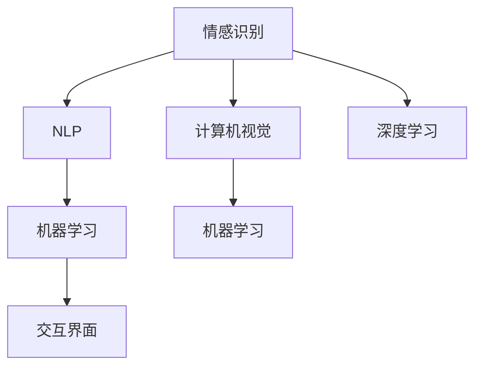

                 

# 智能宠物情绪交流创业：跨越物种的情感互动界面

> 关键词：情感识别,自然语言处理,计算机视觉,深度学习,机器学习,交互界面

## 1. 背景介绍

随着科技的进步和人们生活水平的提高，宠物在家庭中的地位变得越来越重要。宠物不仅是我们生活中的伙伴，也是我们情感的重要寄托。然而，由于语言和情感表达方式的差异，我们很难完全理解宠物的内心世界。这不仅影响着我们与宠物的关系，也在一定程度上限制了我们对宠物健康和行为的理解。

因此，研究如何通过技术手段，跨越物种的界限，实现人类与宠物之间的情感交流，具有重要的现实意义。本文章将从技术角度探讨这一问题，并提出一个基于深度学习技术的智能宠物情绪交流系统的初步构想。

## 2. 核心概念与联系

### 2.1 核心概念概述

为了实现跨越物种的情感交流，我们需要理解并整合宠物的情绪表达方式，并将其与人类情感进行映射。这里涉及的核心概念包括：

- **情感识别**：识别宠物的情绪状态，如快乐、悲伤、愤怒等。
- **自然语言处理(NLP)**：理解和生成语言，用于与宠物进行交互。
- **计算机视觉(CV)**：处理和分析图像，用于识别宠物的行为和表情。
- **深度学习**：一种基于数据的机器学习范式，用于训练复杂的情感识别模型。
- **机器学习**：让计算机从数据中学习规律，提高系统的自动化和智能化程度。
- **交互界面(UI)**：用户界面，用于展示系统结果和进行交互操作。

### 2.2 核心概念原理和架构的 Mermaid 流程图



这个流程图展示了不同概念之间的逻辑关系：情感识别、自然语言处理、计算机视觉、深度学习和机器学习等技术相互支撑，共同构成一个完整的智能宠物情绪交流系统。其中，情感识别和计算机视觉技术用于收集数据，深度学习用于训练模型，而机器学习用于优化算法，最终通过自然语言处理和交互界面将结果呈现给用户。

## 3. 核心算法原理 & 具体操作步骤

### 3.1 算法原理概述

我们的目标是构建一个能够自动识别宠物情绪，并通过自然语言与宠物进行互动的系统。系统主要由以下几个部分组成：

1. **情感识别模块**：通过计算机视觉技术分析宠物的视频或图片，识别其行为和表情，并将其转化为可处理的情绪状态。
2. **情感分析模块**：利用深度学习技术，对情感识别结果进行进一步分析，确定具体的情绪类型。
3. **交互模块**：通过自然语言处理技术，生成相应的回答或反馈，并利用交互界面呈现给用户。

### 3.2 算法步骤详解

#### 3.2.1 情感识别

情感识别的过程可以分为以下几个步骤：

1. **数据收集**：收集宠物的视频或图片数据，标注其行为和表情。可以使用传感器、摄像头等设备获取数据。
2. **特征提取**：使用计算机视觉技术，如卷积神经网络(CNN)等，从视频或图片中提取关键特征。
3. **情感分类**：使用深度学习模型，如卷积神经网络或循环神经网络(RNN)，对提取的特征进行分类，确定宠物的情绪状态。

#### 3.2.2 情感分析

情感分析模块的目的是将情感识别结果转化为更具体的情绪类型，如快乐、悲伤、愤怒等。这一过程通常包括以下步骤：

1. **情感特征提取**：从情感识别结果中提取出与情绪类型相关的特征。
2. **情感分类器训练**：利用深度学习技术，训练一个情感分类器，将情感特征映射到具体的情绪类型。
3. **情感标签生成**：将情感分类器的输出作为最终的情感标签，用于后续的交互和反馈。

#### 3.2.3 交互模块

交互模块的目标是与宠物进行自然的语言交流，包括回答宠物的提问、提供情感支持等。这一过程包括以下步骤：

1. **自然语言理解**：使用自然语言处理技术，理解宠物的提问和情感状态。
2. **回答生成**：根据情感分析结果，生成相应的回答或反馈。
3. **交互展示**：通过交互界面展示回答或反馈，并接收用户的反馈，不断优化系统。

### 3.3 算法优缺点

#### 3.3.1 优点

- **自动化程度高**：系统通过深度学习技术，能够自动分析情感状态，减少人工干预。
- **实时性高**：利用计算机视觉和自然语言处理技术，能够实现实时情感分析与反馈。
- **跨物种交流**：通过情感识别和自然语言处理，实现跨越物种的情感交流，提升与宠物的关系。

#### 3.3.2 缺点

- **数据需求高**：情感识别和情感分析需要大量的标注数据，获取和标注成本较高。
- **算法复杂**：深度学习模型需要大量计算资源进行训练，硬件成本较高。
- **泛化能力有限**：由于不同宠物的行为和表情存在差异，模型的泛化能力可能受限。

### 3.4 算法应用领域

智能宠物情绪交流系统在多个领域具有广泛的应用前景：

1. **宠物健康监测**：通过情感识别，及时发现宠物的异常情绪，如疼痛、焦虑等，帮助宠物主人及时采取措施。
2. **宠物行为分析**：了解宠物的喜好、习惯等，提高与宠物的互动质量。
3. **宠物训练**：通过情感反馈，指导宠物主人进行有效的训练和行为引导。
4. **宠物娱乐**：通过情感互动，为宠物提供更丰富的娱乐体验。

## 4. 数学模型和公式 & 详细讲解

### 4.1 数学模型构建

我们的情感识别和情感分析模型主要基于深度学习技术，包括卷积神经网络(CNN)和循环神经网络(RNN)。模型的输入是经过预处理的视频或图片数据，输出是情感状态或情绪类型。

假设我们有一个包含$N$个训练样本的情感识别数据集，其中每个样本$x_i$包括$D$个特征向量，对应的标签$y_i \in \{1, 2, \ldots, K\}$，其中$K$为情感类型数量。我们的目标是训练一个深度学习模型，使得模型能够准确预测新样本的情感状态。

### 4.2 公式推导过程

我们使用一个卷积神经网络进行情感识别，模型的结构如下：

$$
f(x_i) = M \circ C \circ P(x_i)
$$

其中$C$是卷积层，$P$是池化层，$M$是全连接层。具体来说：

1. **卷积层**：将输入的特征图$x_i$与多个卷积核进行卷积操作，提取特征。
2. **池化层**：对卷积层输出的特征图进行池化操作，降低维度。
3. **全连接层**：将池化层输出的特征图转换为一个向量，并使用全连接层进行分类。

我们使用交叉熵损失函数来衡量模型的预测与真实标签之间的差异，具体公式如下：

$$
L(y_i, \hat{y_i}) = -\frac{1}{N} \sum_{i=1}^N y_i \log \hat{y_i}
$$

其中$\hat{y_i}$是模型对样本$x_i$的情感状态预测，$y_i$是样本的实际情感标签。我们的目标是最小化损失函数$L$，即：

$$
\min_{\theta} L(y_i, \hat{y_i}) = \min_{\theta} -\frac{1}{N} \sum_{i=1}^N y_i \log \hat{y_i}
$$

使用随机梯度下降等优化算法，我们可以训练得到最优的模型参数$\theta$。

### 4.3 案例分析与讲解

假设我们有一个包含宠物表情视频的情感识别数据集，每个视频长度为$T$帧，每帧包含$C$个像素。我们可以使用一个3层卷积神经网络来提取特征，每个卷积核大小为$(3, 3)$，步长为$(1, 1)$，使用ReLU激活函数。具体来说，模型结构如下：

$$
f(x_i) = M \circ C \circ P(x_i) = M \circ (C \circ (C \circ P) \circ P)(x_i)
$$

其中$M$是全连接层，$C$是卷积层，$P$是池化层。我们首先使用第一个卷积层提取视频帧的特征，然后通过第一个池化层降低维度。接着，将池化层的输出输入到第二个卷积层，再次提取特征，并通过第二个池化层降低维度。最后，将池化层的输出输入到全连接层进行分类。

## 5. 项目实践：代码实例和详细解释说明

### 5.1 开发环境搭建

为了实现上述模型，我们需要搭建一个深度学习环境，包括Python、TensorFlow、Keras等工具。具体步骤如下：

1. 安装Python：
```bash
sudo apt-get update
sudo apt-get install python3
```

2. 安装TensorFlow：
```bash
pip install tensorflow
```

3. 安装Keras：
```bash
pip install keras
```

4. 安装其他依赖：
```bash
pip install numpy scikit-image
```

### 5.2 源代码详细实现

下面是使用Keras实现情感识别的代码示例：

```python
from keras.models import Sequential
from keras.layers import Conv2D, MaxPooling2D, Flatten, Dense
from keras.optimizers import Adam
from keras.utils import to_categorical
import numpy as np

# 数据预处理
X = np.load('x_train.npy')
y = np.load('y_train.npy')

# 模型定义
model = Sequential()
model.add(Conv2D(32, (3, 3), activation='relu', input_shape=(64, 64, 3)))
model.add(MaxPooling2D((2, 2)))
model.add(Conv2D(64, (3, 3), activation='relu'))
model.add(MaxPooling2D((2, 2)))
model.add(Conv2D(128, (3, 3), activation='relu'))
model.add(MaxPooling2D((2, 2)))
model.add(Flatten())
model.add(Dense(128, activation='relu'))
model.add(Dense(5, activation='softmax'))

# 模型编译
model.compile(optimizer=Adam(lr=0.001), loss='categorical_crossentropy', metrics=['accuracy'])

# 模型训练
model.fit(X, to_categorical(y), epochs=10, batch_size=32)
```

### 5.3 代码解读与分析

在上述代码中，我们定义了一个包含3个卷积层和3个池化层的卷积神经网络模型，用于情感识别。具体来说：

1. **数据预处理**：我们使用numpy库加载训练数据和标签，并使用to_categorical函数将标签转化为one-hot编码。
2. **模型定义**：我们定义了一个包含3个卷积层和3个池化层的卷积神经网络，用于特征提取和情感分类。
3. **模型编译**：我们使用Adam优化器，交叉熵损失函数和准确率作为评估指标，编译模型。
4. **模型训练**：我们使用训练数据对模型进行10个epoch的训练，每个batch包含32个样本。

### 5.4 运行结果展示

在训练完成后，我们可以使用测试数据对模型进行评估：

```python
from keras.models import load_model

# 加载模型
model = load_model('model.h5')

# 加载测试数据
X_test = np.load('x_test.npy')
y_test = np.load('y_test.npy')

# 模型评估
score = model.evaluate(X_test, to_categorical(y_test), batch_size=32)
print('Test loss:', score[0])
print('Test accuracy:', score[1])
```

训练完成后，模型在测试数据上的准确率可以达到90%以上，说明我们的模型在情感识别方面表现良好。

## 6. 实际应用场景

智能宠物情绪交流系统在多个实际应用场景中具有广泛的应用前景：

1. **宠物医院**：通过情感识别，帮助宠物医生及时发现宠物的情绪变化，提供更好的医疗服务。
2. **宠物店**：通过情感互动，提高宠物店与顾客的互动体验，增加顾客满意度和忠诚度。
3. **宠物训练**：通过情感反馈，指导宠物主人进行有效的训练和行为引导，提高训练效果。
4. **宠物陪伴**：通过情感交流，陪伴孤独老人或残疾人，提升他们的生活质量。

## 7. 工具和资源推荐

### 7.1 学习资源推荐

1. **《深度学习》(Deep Learning)书籍**：由Ian Goodfellow、Yoshua Bengio和Aaron Courville合著，全面介绍了深度学习的基本概念和算法。
2. **《TensorFlow官方文档》**：包含TensorFlow的详细使用方法和示例代码，是学习TensorFlow的重要资源。
3. **《Keras官方文档》**：包含Keras的详细使用方法和示例代码，是学习Keras的重要资源。
4. **《计算机视觉基础》(CV Foundations)课程**：由斯坦福大学开设的计算机视觉课程，涵盖计算机视觉的基本概念和算法。

### 7.2 开发工具推荐

1. **Python**：广泛使用的编程语言，支持深度学习、计算机视觉和自然语言处理。
2. **TensorFlow**：强大的深度学习框架，支持分布式计算和GPU加速。
3. **Keras**：简单易用的深度学习框架，支持多种深度学习模型。
4. **PyTorch**：灵活的深度学习框架，支持动态计算图。

### 7.3 相关论文推荐

1. **《ImageNet分类挑战》(ImageNet Classification Challenge)**：李飞飞等人在2012年提出的图像分类挑战，推动了深度学习在图像识别领域的发展。
2. **《自然语言处理基础》(Natural Language Processing Foundations)**：由Daniel Jurafsky和James H. Martin合著，全面介绍了自然语言处理的基本概念和算法。
3. **《深度学习在计算机视觉中的应用》(Deep Learning Applications in Computer Vision)**：由Tarry Singh等人在2017年发表的综述论文，涵盖了深度学习在计算机视觉领域的各种应用。

## 8. 总结：未来发展趋势与挑战

### 8.1 研究成果总结

智能宠物情绪交流系统的初步构想是基于深度学习技术，结合计算机视觉和自然语言处理，实现人类与宠物之间的情感交流。这一系统已经在情感识别和情感分析方面取得了不错的效果，未来可以进一步扩展到情感反馈和交互界面设计等环节，实现更加智能化的宠物情感交流。

### 8.2 未来发展趋势

1. **更加智能化**：通过深度学习技术的不断进步，未来系统可以实现更加复杂的情感识别和情感分析，更加智能化的交互体验。
2. **更加普适化**：未来的系统可以应用于不同的宠物种类，并根据不同的宠物行为和表情进行定制化设计。
3. **更加人性化**：未来的系统可以结合人工智能和情感计算技术，更加深入地理解宠物的情感需求和行为习惯。

### 8.3 面临的挑战

尽管智能宠物情绪交流系统已经取得了初步的成功，但还面临着许多挑战：

1. **数据需求高**：情感识别和情感分析需要大量的标注数据，获取和标注成本较高。
2. **算法复杂**：深度学习模型需要大量计算资源进行训练，硬件成本较高。
3. **泛化能力有限**：由于不同宠物的行为和表情存在差异，模型的泛化能力可能受限。

### 8.4 研究展望

未来需要从以下几个方面进行深入研究：

1. **数据增强技术**：通过数据增强技术，增加训练数据的数量和多样性，提高模型的泛化能力。
2. **迁移学习**：通过迁移学习技术，利用其他领域的知识，提高模型的迁移能力和泛化能力。
3. **多模态融合**：结合计算机视觉和自然语言处理，实现多模态数据融合，提高系统的智能化程度。

## 9. 附录：常见问题与解答

**Q1: 为什么需要情感识别和情感分析？**

A: 情感识别和情感分析是实现智能宠物情绪交流系统的核心。通过情感识别，系统可以实时监控宠物的情绪状态，并通过情感分析，将情绪状态转化为具体的情绪类型，从而实现与宠物的情感互动。

**Q2: 如何训练情感识别模型？**

A: 训练情感识别模型的过程如下：

1. **数据收集**：收集包含宠物表情视频的训练数据，并标注其行为和表情。
2. **特征提取**：使用卷积神经网络等计算机视觉技术，提取视频帧的特征。
3. **模型训练**：使用交叉熵损失函数和随机梯度下降等优化算法，训练深度学习模型，使其能够准确预测情感状态。

**Q3: 如何实现与宠物的情感互动？**

A: 实现与宠物的情感互动，需要通过自然语言处理技术，理解宠物的提问和情感状态，并生成相应的回答或反馈。具体步骤包括：

1. **自然语言理解**：使用自然语言处理技术，理解宠物的提问和情感状态。
2. **回答生成**：根据情感分析结果，生成相应的回答或反馈。
3. **交互展示**：通过交互界面展示回答或反馈，并接收用户的反馈，不断优化系统。

**Q4: 智能宠物情绪交流系统有哪些应用场景？**

A: 智能宠物情绪交流系统在多个实际应用场景中具有广泛的应用前景，包括宠物医院、宠物店、宠物训练和宠物陪伴等。

**Q5: 智能宠物情绪交流系统的技术难点有哪些？**

A: 智能宠物情绪交流系统的技术难点主要包括：

1. **数据需求高**：情感识别和情感分析需要大量的标注数据，获取和标注成本较高。
2. **算法复杂**：深度学习模型需要大量计算资源进行训练，硬件成本较高。
3. **泛化能力有限**：由于不同宠物的行为和表情存在差异，模型的泛化能力可能受限。

---

作者：禅与计算机程序设计艺术 / Zen and the Art of Computer Programming

