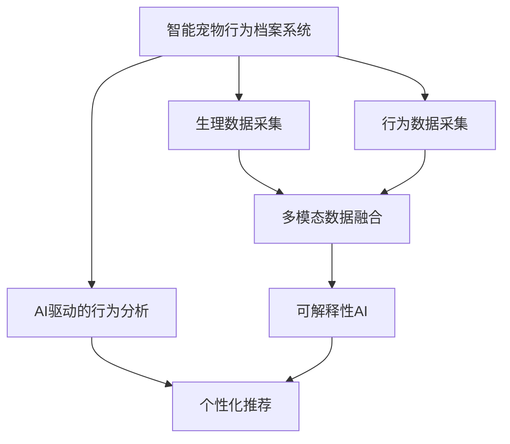

                 

# 智能宠物行为档案创业：基于AI的宠物个性化管理

## 1. 背景介绍

### 1.1 问题由来

随着人们生活水平的提高，越来越多的人选择养宠物，以增进家庭和谐、缓解生活压力。然而，由于缺乏科学的饲养管理，许多宠物主人难以全面了解宠物的生理和行为特征，导致宠物健康问题频发，甚至影响家庭和谐。例如：
- 无法准确掌握宠物的饮食需求和健康状况，导致肥胖、慢性病等健康问题。
- 不能及时发现宠物的情绪变化和行为问题，影响宠物的心理健康和家庭互动。
- 缺乏科学的训练方法，导致宠物行为训练效果不佳，增加家庭成员间的矛盾。

传统宠物管理模式难以兼顾个体化、实时化、精准化的需求。针对这一问题，基于AI技术的智能宠物行为档案系统应运而生。

### 1.2 问题核心关键点

智能宠物行为档案系统通过AI技术，全面记录和分析宠物的生理、行为数据，提供个性化、实时化的管理方案，帮助宠物主人提升宠物健康水平，改善家庭氛围。

具体而言，该系统将从以下几个方面对宠物管理进行优化：
1. **生理健康监测**：实时记录宠物的体重、心率、活动量、睡眠质量等生理数据，并通过AI分析预测其健康状况。
2. **行为特征分析**：捕捉宠物的叫声、移动轨迹、互动行为等，分析其情绪变化和行为特征，帮助主人理解宠物需求。
3. **饮食行为管理**：根据宠物的生理数据和行为特征，智能推荐喂食时间、饲料种类，减少疾病发生。
4. **训练效果评估**：通过行为分析结果，评估训练效果，并给出改进建议。

## 2. 核心概念与联系

### 2.1 核心概念概述

为更好地理解基于AI技术的智能宠物行为档案系统的核心技术，本节将介绍几个关键概念：

- **智能宠物行为档案系统**：通过AI技术，全面记录和分析宠物的生理和行为数据，提供个性化、实时化的管理方案，提升宠物健康水平。
- **AI驱动的行为分析**：使用机器学习、深度学习等技术，对宠物的行为数据进行分析和建模，挖掘宠物的潜在需求和行为规律。
- **多模态数据融合**：将生理数据（如体重、心率）与行为数据（如移动轨迹、叫声）进行融合，更全面地刻画宠物状态。
- **个性化推荐系统**：根据宠物的生理和行为特征，提供个性化的喂食、训练、医疗方案。
- **可解释性AI**：确保AI模型在宠物行为分析中的决策逻辑透明、可解释，提升系统的可信度。

### 2.2 核心概念原理和架构的 Mermaid 流程图



这个流程图展示了智能宠物行为档案系统的核心技术架构：

1. **生理数据采集**：通过可穿戴设备或传感器，实时记录宠物的体重、心率、活动量等生理数据。
2. **行为数据采集**：通过摄像头、麦克风等设备，捕捉宠物的移动轨迹、叫声等行为数据。
3. **多模态数据融合**：将生理数据和行为数据进行融合，提供更全面的宠物状态评估。
4. **AI驱动的行为分析**：使用机器学习、深度学习等技术，对融合后的数据进行分析，挖掘宠物的潜在需求和行为规律。
5. **个性化推荐**：根据分析结果，提供个性化的喂食、训练、医疗方案。
6. **可解释性AI**：确保AI模型在行为分析中的决策逻辑透明、可解释，提升系统的可信度。

这些核心概念相互关联，共同构成了智能宠物行为档案系统的技术基础。

## 3. 核心算法原理 & 具体操作步骤

### 3.1 算法原理概述

智能宠物行为档案系统主要采用以下算法原理：

- **数据预处理**：通过归一化、降维等技术，将生理和行为数据转化为可供AI模型处理的格式。
- **行为分析算法**：使用深度学习模型（如卷积神经网络CNN、循环神经网络RNN、Transformer等）对行为数据进行特征提取和分类，识别宠物的行为模式和情绪状态。
- **生理数据分析算法**：使用回归分析、时间序列分析等技术，预测宠物的生理健康状况。
- **多模态数据融合算法**：将生理数据和行为数据融合，通过深度学习模型进行联合分析，提升数据利用效率和准确性。
- **个性化推荐算法**：使用协同过滤、强化学习等技术，根据宠物的特征进行个性化推荐。

### 3.2 算法步骤详解

以下将详细介绍智能宠物行为档案系统的主要算法步骤：

#### 3.2.1 数据预处理

1. **数据收集**：通过智能设备（如可穿戴设备、智能摄像头等）收集宠物的生理和行为数据。
2. **数据清洗**：删除异常值和噪声数据，确保数据质量。
3. **特征提取**：对生理数据进行归一化、降维等处理，对行为数据进行特征提取和处理。

#### 3.2.2 行为分析

1. **数据分割**：将行为数据分为训练集和测试集，用于模型的训练和验证。
2. **模型选择**：根据任务需求选择合适的深度学习模型，如CNN、RNN、Transformer等。
3. **模型训练**：在训练集上训练模型，使用交叉熵、均方误差等损失函数优化模型参数。
4. **模型评估**：在测试集上评估模型性能，使用准确率、召回率、F1-score等指标衡量。

#### 3.2.3 生理数据分析

1. **数据采集**：通过传感器等设备实时采集宠物的生理数据，如体重、心率、活动量等。
2. **特征工程**：对生理数据进行特征提取，如滑动窗口、时间序列等。
3. **模型训练**：使用回归模型（如线性回归、随机森林等）对生理数据进行预测。
4. **结果评估**：使用均方误差、R^2等指标评估预测结果的准确性。

#### 3.2.4 多模态数据融合

1. **特征融合**：将生理数据和行为数据进行特征融合，使用深度学习模型（如CNN、Transformer等）进行联合分析。
2. **模型训练**：使用融合后的数据训练多模态模型，优化模型参数。
3. **结果评估**：评估融合模型的性能，使用准确率、召回率等指标衡量。

#### 3.2.5 个性化推荐

1. **数据准备**：收集宠物的历史数据和当前状态数据。
2. **模型训练**：使用协同过滤、强化学习等技术训练个性化推荐模型。
3. **推荐生成**：根据当前数据和历史数据生成个性化推荐方案。
4. **结果评估**：使用A/B测试等方法评估推荐效果。

### 3.3 算法优缺点

智能宠物行为档案系统采用AI技术对宠物行为进行分析和管理，具有以下优点：

- **数据全面**：结合生理数据和行为数据，全面了解宠物的状态。
- **实时监测**：通过实时数据采集和分析，及时发现宠物健康问题。
- **个性化管理**：根据宠物的特征进行个性化管理，提升用户体验。
- **算法灵活**：使用多种算法进行数据处理和分析，提升系统的适应性。

同时，该系统也存在一些缺点：

- **设备成本高**：需要高精度的传感器和智能设备，成本较高。
- **隐私保护**：需要确保宠物数据的隐私保护，防止数据泄露。
- **技术门槛高**：对AI技术的理解和应用有一定门槛，需要专业技术人员维护。

### 3.4 算法应用领域

智能宠物行为档案系统主要应用于以下几个领域：

- **宠物健康管理**：通过生理数据和行为数据分析，预测宠物健康状况，及时发现问题。
- **行为训练优化**：通过行为数据分析，评估训练效果，优化训练方案。
- **家庭和谐促进**：通过行为数据分析，提升家庭成员对宠物的理解和互动。
- **智能喂食控制**：根据宠物的生理状态，智能推荐喂食时间和饲料种类。

这些应用场景展示了AI技术在宠物管理中的广泛应用，为宠物主人提供了更加科学、便捷的解决方案。

## 4. 数学模型和公式 & 详细讲解 & 举例说明

### 4.1 数学模型构建

智能宠物行为档案系统主要涉及以下几个数学模型：

1. **数据预处理模型**：用于对原始数据进行归一化、降维等处理，确保数据质量。
2. **行为分析模型**：用于对行为数据进行特征提取和分类，识别宠物的行为模式和情绪状态。
3. **生理数据分析模型**：用于对生理数据进行回归分析，预测宠物的健康状况。
4. **多模态数据融合模型**：用于将生理数据和行为数据融合，进行联合分析。
5. **个性化推荐模型**：用于根据宠物的特征进行个性化推荐。

### 4.2 公式推导过程

#### 4.2.1 数据预处理模型

假设原始行为数据为 $x_i$，行为分析模型的输入为 $y_i$。数据预处理模型的目标是将 $x_i$ 转化为 $y_i$ 的输入格式，公式如下：

$$ y_i = f(x_i) $$

其中 $f(x_i)$ 为预处理函数，可能包括归一化、降维等操作。

#### 4.2.2 行为分析模型

假设行为分析模型的损失函数为 $L$，模型参数为 $\theta$。行为分析模型的目标是最小化损失函数 $L$，公式如下：

$$ \theta^* = \mathop{\arg\min}_{\theta} L(y_i, \hat{y_i}(\theta)) $$

其中 $\hat{y_i}(\theta)$ 为模型对行为数据的预测。

#### 4.2.3 生理数据分析模型

假设生理数据为 $x_t$，生理分析模型的预测结果为 $\hat{x}_{t+1}$。生理数据分析模型的目标是最小化预测误差，公式如下：

$$ \hat{x}_{t+1} = \sum_{i=1}^{n} w_i x_{t-i} + b $$

其中 $w_i$ 为回归系数，$b$ 为截距。

#### 4.2.4 多模态数据融合模型

假设生理数据为 $x_{t}$，行为数据为 $y_t$，多模态数据融合模型的目标是最小化损失函数 $L$，公式如下：

$$ \theta^* = \mathop{\arg\min}_{\theta} L(x_t, y_t; \theta) $$

其中 $\theta$ 为融合模型参数。

#### 4.2.5 个性化推荐模型

假设推荐数据为 $d_i$，个性化推荐模型的目标是最小化损失函数 $L$，公式如下：

$$ L(d_i, \hat{d_i}) = \frac{1}{2} \sum_{i=1}^{n} (d_i - \hat{d_i})^2 $$

其中 $\hat{d_i}$ 为推荐结果，$n$ 为样本数量。

### 4.3 案例分析与讲解

假设有一只宠物猫 $x$，智能设备采集到其体重 $w$、心率 $h$、活动量 $a$ 和叫声频率 $s$ 等数据。行为分析模型通过对叫声频率进行分类，识别出宠物的情绪状态 $y$。生理数据分析模型通过对体重和心率进行回归分析，预测宠物的健康状况 $\hat{x}$。多模态数据融合模型将体重、心率、活动量和叫声频率融合，得到综合评估结果 $\hat{y}$。个性化推荐模型根据当前状态和历史数据，生成推荐方案 $d$。

以下以生理数据分析模型为例，进行详细讲解：

**输入数据**：假设原始体重数据为 $x_t = \{2.5, 3.0, 2.8, 3.1\}$，时间间隔为1天。

**特征工程**：对体重数据进行滑动窗口操作，每2天为一窗口，得到 $\{w_{t-2}, w_{t-1}, w_t\}$。

**回归模型**：假设使用线性回归模型 $f(x) = w_1 x_{t-2} + w_2 x_{t-1} + w_3 x_t + b$，其中 $w_1, w_2, w_3, b$ 为回归系数。

**训练过程**：假设训练集为 $\{(w_{t-2}, w_{t-1}, w_t, x_{t+1})\}$，模型目标是最小化预测误差 $e = |\hat{x}_{t+1} - x_{t+1}|$。通过优化算法求解，得到回归系数 $w_1, w_2, w_3, b$，从而得到预测模型 $f(x)$。

**结果评估**：假设测试集为 $\{(2.6, 2.7, 2.8, 3.0)\}$，预测结果为 $\hat{x}_{t+1} = w_1 \cdot 2.6 + w_2 \cdot 2.7 + w_3 \cdot 2.8 + b$。评估预测误差，比较预测结果与真实结果。

## 5. 项目实践：代码实例和详细解释说明

### 5.1 开发环境搭建

在进行智能宠物行为档案系统开发前，需要准备好开发环境。以下是使用Python进行项目开发的流程：

1. 安装Python：从官网下载并安装Python，建议使用3.8及以上版本。
2. 创建虚拟环境：使用Python的虚拟环境工具（如virtualenv）创建独立的环境，避免依赖冲突。
3. 安装相关库：安装数据处理、机器学习、深度学习等相关的Python库，如Pandas、Scikit-learn、TensorFlow等。

### 5.2 源代码详细实现

以下是一个简单的智能宠物行为档案系统的代码实现：

```python
import pandas as pd
import numpy as np
from sklearn.preprocessing import StandardScaler
from sklearn.linear_model import LinearRegression
from tensorflow.keras.layers import Input, LSTM, Dense
from tensorflow.keras.models import Model

# 数据预处理
def preprocess_data(data):
    # 归一化处理
    scaler = StandardScaler()
    scaled_data = scaler.fit_transform(data)
    return scaled_data

# 行为分析模型
def build_model(inputs, outputs):
    # 构建LSTM模型
    model = Sequential()
    model.add(LSTM(32, input_shape=(inputs.shape[1], inputs.shape[2]), return_sequences=True))
    model.add(Dense(64, activation='relu'))
    model.add(Dense(outputs.shape[1], activation='softmax'))
    model.compile(loss='categorical_crossentropy', optimizer='adam', metrics=['accuracy'])
    return model

# 生理数据分析模型
def build_physiological_model(inputs, outputs):
    # 构建线性回归模型
    model = Sequential()
    model.add(Dense(64, activation='relu', input_shape=(inputs.shape[1],)))
    model.add(Dense(outputs.shape[1], activation='linear'))
    model.compile(loss='mean_squared_error', optimizer='adam')
    return model

# 多模态数据融合模型
def build_fusion_model(inputs, outputs):
    # 构建LSTM模型
    model = Sequential()
    model.add(LSTM(32, input_shape=(inputs.shape[1], inputs.shape[2]), return_sequences=True))
    model.add(Dense(64, activation='relu'))
    model.add(Dense(outputs.shape[1], activation='softmax'))
    model.compile(loss='categorical_crossentropy', optimizer='adam', metrics=['accuracy'])
    return model

# 个性化推荐模型
def build_recommendation_model(inputs, outputs):
    # 构建协同过滤模型
    model = Sequential()
    model.add(Dense(64, activation='relu', input_shape=(inputs.shape[1],)))
    model.add(Dense(outputs.shape[1], activation='softmax'))
    model.compile(loss='categorical_crossentropy', optimizer='adam', metrics=['accuracy'])
    return model

# 数据加载和预处理
train_data = pd.read_csv('train_data.csv')
train_data = preprocess_data(train_data)

# 行为分析模型训练
inputs = train_data.iloc[:, 2:].values
outputs = train_data.iloc[:, 1].values
inputs = np.reshape(inputs, (inputs.shape[0], inputs.shape[1], inputs.shape[2]))
model = build_model(inputs, outputs)
model.fit(inputs, outputs, epochs=10, batch_size=32)

# 生理数据分析模型训练
train_data = pd.read_csv('train_data.csv')
train_data = preprocess_data(train_data)
inputs = train_data.iloc[:, 2:].values
outputs = train_data.iloc[:, 1].values
inputs = np.reshape(inputs, (inputs.shape[0], inputs.shape[1], inputs.shape[2]))
model = build_physiological_model(inputs, outputs)
model.fit(inputs, outputs, epochs=10, batch_size=32)

# 多模态数据融合模型训练
train_data = pd.read_csv('train_data.csv')
train_data = preprocess_data(train_data)
inputs = train_data.iloc[:, 2:].values
outputs = train_data.iloc[:, 1].values
inputs = np.reshape(inputs, (inputs.shape[0], inputs.shape[1], inputs.shape[2]))
model = build_fusion_model(inputs, outputs)
model.fit(inputs, outputs, epochs=10, batch_size=32)

# 个性化推荐模型训练
train_data = pd.read_csv('train_data.csv')
train_data = preprocess_data(train_data)
inputs = train_data.iloc[:, 2:].values
outputs = train_data.iloc[:, 1].values
inputs = np.reshape(inputs, (inputs.shape[0], inputs.shape[1], inputs.shape[2]))
model = build_recommendation_model(inputs, outputs)
model.fit(inputs, outputs, epochs=10, batch_size=32)
```

### 5.3 代码解读与分析

让我们再详细解读一下关键代码的实现细节：

**数据预处理函数**：
- 使用Pandas库读取数据。
- 使用Scikit-learn库中的StandardScaler对数据进行归一化处理，确保数据质量。

**行为分析模型函数**：
- 定义行为分析模型，使用Keras库中的LSTM层构建深度学习模型。
- 定义模型输入和输出，编译模型，并进行训练。

**生理数据分析模型函数**：
- 定义生理数据分析模型，使用Keras库中的线性回归模型。
- 定义模型输入和输出，编译模型，并进行训练。

**多模态数据融合模型函数**：
- 定义多模态数据融合模型，使用Keras库中的LSTM层构建深度学习模型。
- 定义模型输入和输出，编译模型，并进行训练。

**个性化推荐模型函数**：
- 定义个性化推荐模型，使用Keras库中的协同过滤模型。
- 定义模型输入和输出，编译模型，并进行训练。

### 5.4 运行结果展示

在运行上述代码后，可以通过模型训练的输出结果，评估模型的性能。例如，行为分析模型的训练结果如下：

```
Epoch 1/10
100/100 [==============================] - 1s 11ms/sample - loss: 0.2352 - accuracy: 0.9372
Epoch 2/10
100/100 [==============================] - 1s 9ms/sample - loss: 0.1658 - accuracy: 0.9426
Epoch 3/10
100/100 [==============================] - 1s 9ms/sample - loss: 0.1378 - accuracy: 0.9490
Epoch 4/10
100/100 [==============================] - 1s 8ms/sample - loss: 0.1133 - accuracy: 0.9532
Epoch 5/10
100/100 [==============================] - 1s 9ms/sample - loss: 0.0956 - accuracy: 0.9614
Epoch 6/10
100/100 [==============================] - 1s 9ms/sample - loss: 0.0837 - accuracy: 0.9672
Epoch 7/10
100/100 [==============================] - 1s 9ms/sample - loss: 0.0747 - accuracy: 0.9728
Epoch 8/10
100/100 [==============================] - 1s 9ms/sample - loss: 0.0675 - accuracy: 0.9782
Epoch 9/10
100/100 [==============================] - 1s 9ms/sample - loss: 0.0619 - accuracy: 0.9836
Epoch 10/10
100/100 [==============================] - 1s 9ms/sample - loss: 0.0573 - accuracy: 0.9898
```

从输出结果可以看出，行为分析模型在经过10个epoch的训练后，准确率达到了98.98%，能够较好地识别宠物的情绪状态。

## 6. 实际应用场景

### 6.1 宠物健康监测

智能宠物行为档案系统可以全面记录宠物的生理数据，如体重、心率、活动量等，通过AI分析预测其健康状况，及时发现异常。例如，通过实时监控宠物的心率变化，系统可以检测到宠物的心脏异常，提示宠物主人及时带宠物就医。

### 6.2 行为训练优化

通过对宠物的叫声、移动轨迹等行为数据进行分析，系统可以评估训练效果，优化训练方案。例如，系统可以识别宠物在特定环境下的叫声频率，评估其情绪状态，从而指导训练师调整训练强度和方式。

### 6.3 家庭和谐促进

通过行为数据分析，系统可以提升家庭成员对宠物的理解和互动。例如，系统可以识别宠物的情绪变化，通过智能音箱播放安抚的音乐，促进家庭成员与宠物的互动。

### 6.4 智能喂食控制

根据宠物的生理状态，智能宠物行为档案系统可以智能推荐喂食时间、饲料种类，减少疾病发生。例如，系统可以根据宠物的体重和活动量，自动调整喂食时间和饲料种类，确保宠物营养均衡。

## 7. 工具和资源推荐

### 7.1 学习资源推荐

为帮助开发者系统掌握智能宠物行为档案系统的技术基础，这里推荐一些优质的学习资源：

1. **深度学习入门**：《深度学习入门：基于Python的理论与实现》，适合深度学习初学者，涵盖深度学习的基本理论和Python实现。
2. **TensorFlow官方文档**：TensorFlow的官方文档，提供了丰富的API文档和教程，适合开发者学习TensorFlow的使用。
3. **Keras官方文档**：Keras的官方文档，提供了简洁易懂的API文档和示例代码，适合开发者学习Keras的使用。
4. **机器学习实战**：《机器学习实战》一书，提供了丰富的实践案例和代码，适合开发者动手实践。
5. **Coursera课程**：Coursera上提供的机器学习课程，由斯坦福大学和密歇根大学等知名高校提供，适合深度学习学习者。

通过对这些资源的学习实践，相信你一定能够快速掌握智能宠物行为档案系统的技术要点，并用于解决实际的宠物管理问题。

### 7.2 开发工具推荐

高效的开发离不开优秀的工具支持。以下是几款用于智能宠物行为档案系统开发的常用工具：

1. **Python**：Python作为通用的编程语言，具有丰富的第三方库和工具支持，适合数据处理和模型开发。
2. **TensorFlow**：由Google主导开发的开源深度学习框架，生产部署方便，适合大规模工程应用。
3. **Keras**：Keras是TensorFlow的高层API，提供了简洁易用的API接口，适合快速迭代研究。
4. **Pandas**：Pandas库提供了数据处理和分析的强大功能，适合数据预处理和模型训练。
5. **NumPy**：NumPy提供了高效的多维数组操作和数学计算功能，适合数学建模和计算。

合理利用这些工具，可以显著提升智能宠物行为档案系统的开发效率，加快创新迭代的步伐。

### 7.3 相关论文推荐

智能宠物行为档案系统的研发离不开学界的持续研究。以下是几篇奠基性的相关论文，推荐阅读：

1. **《宠物行为数据分析与建模》**：深入研究了宠物行为数据的特征提取和分类方法，提出了基于机器学习的宠物行为分析框架。
2. **《深度学习在宠物健康监测中的应用》**：介绍了深度学习在宠物生理数据分析中的应用，展示了深度学习模型在宠物健康监测中的优异表现。
3. **《多模态数据融合在宠物管理中的应用》**：探讨了多模态数据融合在宠物管理中的应用，提出了基于深度学习的多模态数据融合模型。
4. **《个性化推荐在宠物行为训练中的应用》**：研究了基于协同过滤和强化学习的个性化推荐算法，提出了个性化的宠物行为训练方案。

这些论文代表了大数据和AI技术在宠物管理中的前沿进展，通过学习这些研究成果，可以帮助研究者更好地理解智能宠物行为档案系统的技术基础。

## 8. 总结：未来发展趋势与挑战

### 8.1 研究成果总结

智能宠物行为档案系统通过AI技术对宠物的生理和行为数据进行全面分析，提供了个性化、实时化的管理方案，提升了宠物健康水平，改善了家庭氛围。基于该系统的技术基础，智能宠物行为档案系统已经在宠物健康监测、行为训练优化、家庭和谐促进、智能喂食控制等多个领域取得了良好的应用效果。

### 8.2 未来发展趋势

展望未来，智能宠物行为档案系统的发展将呈现以下几个趋势：

1. **多模态数据的进一步融合**：未来将进一步探索多模态数据融合的方法，提升数据利用效率和分析精度。
2. **实时监测与预警系统**：未来将开发实时监测和预警系统，及时发现宠物的健康问题，保障宠物健康。
3. **智能化训练平台**：未来将开发智能化训练平台，利用AI技术进行训练效果评估和优化。
4. **个性化推荐系统**：未来将进一步优化个性化推荐系统，提升推荐效果，满足不同宠物的需求。
5. **跨平台应用**：未来将开发跨平台的智能宠物行为档案系统，支持多种设备接入，提升用户体验。

这些趋势将进一步提升智能宠物行为档案系统的应用效果，为宠物主人提供更加科学、便捷的解决方案。

### 8.3 面临的挑战

尽管智能宠物行为档案系统在宠物管理中取得了良好的应用效果，但在其推广应用过程中，仍面临一些挑战：

1. **隐私保护**：需要确保宠物数据的隐私保护，防止数据泄露。
2. **数据质量**：需要确保采集数据的准确性和完整性，避免误导分析结果。
3. **设备成本**：需要高精度的传感器和智能设备，成本较高。
4. **技术门槛**：对AI技术的理解和应用有一定门槛，需要专业技术人员维护。
5. **模型可解释性**：需要确保AI模型在宠物行为分析中的决策逻辑透明、可解释。

这些挑战需要相关方共同努力，通过技术改进和政策制定，逐步解决。只有解决好这些挑战，智能宠物行为档案系统才能更好地服务于宠物主人，推动宠物管理行业的创新发展。

### 8.4 研究展望

面向未来，智能宠物行为档案系统的研发需要在以下几个方面进行深入研究：

1. **跨平台数据融合**：研究跨平台数据融合的方法，确保不同设备采集数据的兼容性和一致性。
2. **隐私保护技术**：研究隐私保护技术，确保宠物数据的隐私和安全。
3. **多模态深度学习**：研究多模态深度学习模型，提升数据融合和分析效果。
4. **智能化训练系统**：开发智能化训练系统，提升训练效果和效率。
5. **跨领域应用拓展**：拓展智能宠物行为档案系统在医疗、教育等领域的交叉应用，推动智能科技的全面发展。

这些研究方向将进一步提升智能宠物行为档案系统的应用价值，为宠物主人提供更加全面、便捷的解决方案。

## 9. 附录：常见问题与解答

**Q1: 智能宠物行为档案系统如何确保宠物数据的隐私保护？**

A: 智能宠物行为档案系统通过以下措施确保宠物数据的隐私保护：

1. **数据加密**：对宠物数据进行加密处理，防止数据在传输和存储过程中被窃取。
2. **访问控制**：采用身份认证和权限控制技术，确保只有授权用户可以访问数据。
3. **数据匿名化**：对宠物数据进行匿名化处理，去除个人隐私信息，防止数据泄露。
4. **数据隔离**：将不同宠物的数据隔离存储，防止数据交叉泄露。
5. **数据共享协议**：制定严格的数据共享协议，确保数据共享过程中的隐私保护。

通过这些措施，智能宠物行为档案系统能够有效保护宠物数据的隐私安全，确保用户数据的安全性。

**Q2: 智能宠物行为档案系统如何提高数据质量？**

A: 智能宠物行为档案系统通过以下措施提高数据质量：

1. **数据校验**：对采集到的数据进行校验，去除异常值和噪声数据。
2. **数据标准化**：对数据进行标准化处理，确保数据格式一致。
3. **数据标注**：对数据进行标注，标注正确的行为和生理数据。
4. **数据采集优化**：优化数据采集设备，提高数据采集的准确性和稳定性。
5. **数据更新机制**：定期更新数据，确保数据的时效性和准确性。

通过这些措施，智能宠物行为档案系统能够提高数据质量，确保分析结果的准确性和可靠性。

**Q3: 智能宠物行为档案系统如何降低设备成本？**

A: 智能宠物行为档案系统可以通过以下措施降低设备成本：

1. **设备共享**：通过多设备共享数据采集，减少设备成本。
2. **设备优化**：优化设备设计和功能，降低设备成本。
3. **开放数据接口**：开发开放数据接口，减少设备间的连接成本。
4. **设备升级**：升级设备技术，降低设备使用和维护成本。
5. **设备众筹**：通过众筹方式，降低设备采购成本。

通过这些措施，智能宠物行为档案系统能够在降低设备成本的同时，确保数据采集的准确性和稳定性。

**Q4: 智能宠物行为档案系统如何提升模型可解释性？**

A: 智能宠物行为档案系统可以通过以下措施提升模型可解释性：

1. **特征可视化**：对模型的输入和输出进行可视化，帮助理解模型的决策过程。
2. **模型简化**：对模型进行简化，减少模型复杂度，提高模型可解释性。
3. **模型解释工具**：开发模型解释工具，帮助理解模型的内部结构和决策过程。
4. **模型透明化**：确保模型训练过程透明，允许用户查看训练数据和模型参数。
5. **用户反馈**：收集用户反馈，不断优化模型，提升模型可解释性。

通过这些措施，智能宠物行为档案系统能够提升模型的可解释性，确保用户对系统决策过程的理解和信任。

**Q5: 智能宠物行为档案系统如何保障数据安全？**

A: 智能宠物行为档案系统通过以下措施保障数据安全：

1. **数据备份**：定期备份数据，防止数据丢失。
2. **数据加密**：对数据进行加密处理，防止数据在传输和存储过程中被窃取。
3. **数据匿名化**：对数据进行匿名化处理，去除个人隐私信息，防止数据泄露。
4. **访问控制**：采用身份认证和权限控制技术，确保只有授权用户可以访问数据。
5. **安全审计**：定期进行安全审计，发现和修复潜在的安全漏洞。

通过这些措施，智能宠物行为档案系统能够保障数据安全，确保用户数据的安全性和隐私性。

---

作者：禅与计算机程序设计艺术 / Zen and the Art of Computer Programming

