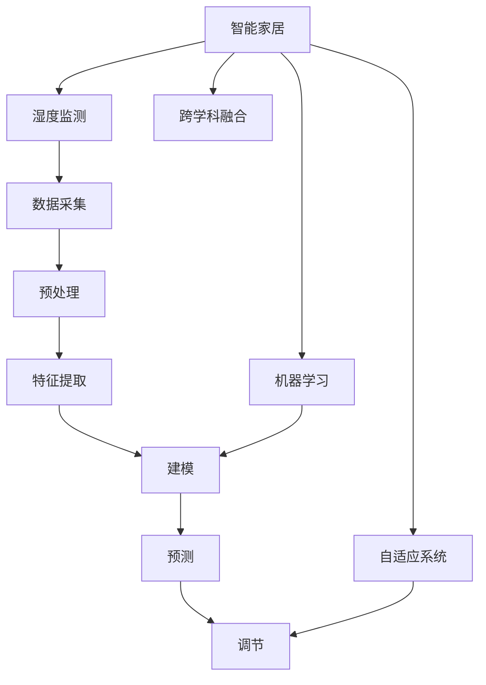

                 

# 智能居家湿度平衡创业：全天候的呼吸道健康管理

## 1. 背景介绍

### 1.1 问题由来

在当下快速发展的智能家居市场，人们对于健康的关注度日益提升，尤其是对于空气质量的控制。良好的室内湿度平衡直接关联到人们的健康，特别是呼吸道健康。湿度过高或过低，不仅会影响人的舒适度，还可能导致诸如哮喘、过敏等呼吸道疾病的发生和恶化。传统的人工湿度调节方式不仅耗时费力，而且缺乏智能化的适应性。因此，智能化的湿度平衡解决方案成为现代家居环境管理的重要需求。

### 1.2 问题核心关键点

本文聚焦于基于人工智能的智能居家湿度平衡系统的开发和实现。这种系统通过实时监测室内湿度，结合多种传感器数据，利用机器学习技术，实现室内湿度的智能控制，以维护居家环境的健康舒适度。具体问题包括：

- 如何构建一个高效的湿度监测与控制模型？
- 如何通过机器学习技术实现室内湿度的精准预测和调节？
- 如何整合多种传感器数据，以提高系统监测的准确性和可靠性？
- 如何在不同居住环境中，实现模型的自适应和个性化定制？

### 1.3 问题研究意义

研究智能居家湿度平衡系统，对于提升室内环境舒适度、降低呼吸道疾病风险、推动智能化家居技术的发展，具有重要意义：

1. 改善生活质量：通过精准控制室内湿度，为家庭成员提供一个健康舒适的居住环境，提升生活质量。
2. 预防呼吸道疾病：湿度管理得当，可有效预防哮喘、过敏等呼吸道疾病，保障居民健康。
3. 推动智能家居产业：湿度平衡系统的成功应用，将为智能家居市场的拓展提供新动力。
4. 激发技术创新：通过跨学科的研究，结合环境科学、人工智能等领域的最新进展，探索创新的解决方案。

## 2. 核心概念与联系

### 2.1 核心概念概述

为更好地理解智能居家湿度平衡系统，本节将介绍几个密切相关的核心概念：

- **智能家居**：利用物联网(IoT)技术和人工智能算法，实现家庭环境的智能化管理和自动化控制，包括照明、温度、湿度、安全等多个方面。
- **湿度监测**：使用传感器（如湿度传感器、温度传感器、气压传感器等）对室内湿度进行实时监测。
- **机器学习**：通过算法（如回归分析、深度学习等）从大量数据中学习规律，实现精准的湿度预测和调节。
- **自适应系统**：根据用户习惯和环境变化，自动调整系统参数，实现个性化定制。
- **跨学科融合**：将环境科学、人工智能、心理学等多个学科的知识结合，综合考虑用户需求和环境变化。

这些核心概念之间的逻辑关系可以通过以下Mermaid流程图来展示：



这个流程图展示智能家居湿度平衡系统的核心概念及其之间的关系：

1. 智能家居平台通过湿度监测模块收集数据。
2. 机器学习模块对采集到的数据进行建模和预测。
3. 自适应系统根据预测结果进行湿度调节。
4. 跨学科融合确保系统设计充分考虑用户需求和环境变化。

## 3. 核心算法原理 & 具体操作步骤
### 3.1 算法原理概述

智能居家湿度平衡系统的核心算法是基于机器学习模型的湿度预测和调节。其核心思想是：利用传感器数据，通过机器学习算法建立湿度预测模型，并结合环境传感器数据，实时调整湿度调节设备，使室内湿度维持在理想范围内。

形式化地，假设湿度传感器监测到的当前湿度为 $H_t$，室内外温度分别为 $T_{in}$ 和 $T_{out}$，气压为 $P$，已知预训练的湿度预测模型为 $F_{\theta}$。目标是最小化预测误差，即找到最优参数 $\theta$：

$$
\theta^* = \mathop{\arg\min}_{\theta} \mathcal{L}(F_{\theta}, D)
$$

其中 $\mathcal{L}$ 为湿度预测模型的损失函数，用于衡量模型预测与实际湿度之间的差异。常见的损失函数包括均方误差损失等。

### 3.2 算法步骤详解

智能居家湿度平衡系统的开发一般包括以下几个关键步骤：

**Step 1: 准备传感器和数据采集设备**
- 选择合适的湿度传感器、温度传感器、气压传感器等，确保设备准确可靠。
- 确保数据采集设备的稳定连接和实时数据传输。

**Step 2: 数据预处理和特征提取**
- 对采集到的湿度、温度、气压等数据进行去噪、归一化等预处理。
- 提取影响湿度的关键特征，如温度差、气压差、室内外温差等。

**Step 3: 建立湿度预测模型**
- 选择合适的机器学习算法，如回归模型、深度神经网络等，进行湿度预测建模。
- 使用历史数据进行模型训练，设置合适的超参数，如学习率、迭代次数等。

**Step 4: 训练和优化模型**
- 利用采集到的实时数据，对模型进行训练和优化，最小化预测误差。
- 定期在验证集上评估模型性能，根据性能指标决定是否继续训练。

**Step 5: 实时预测和调节**
- 实时监测室内湿度，利用训练好的模型进行湿度预测。
- 根据预测结果和当前环境条件，调整湿度调节设备（如加湿器、除湿器等），以维持理想湿度。

**Step 6: 自适应学习**
- 通过机器学习算法，不断调整模型参数和预测算法，提高湿度预测的准确性和实时性。
- 根据用户反馈和环境变化，实时调整湿度调节策略。

### 3.3 算法优缺点

智能居家湿度平衡系统基于机器学习的湿度调节方法具有以下优点：
1. 精确度高。利用机器学习模型进行预测，能够更准确地反映湿度变化规律。
2. 自适应性强。通过自适应算法，系统能够根据环境变化和用户需求自动调整，实现个性化定制。
3. 自动化程度高。数据采集和模型训练自动化，减少了人工干预。
4. 维护成本低。无需频繁手动调节湿度，减少了维护成本和人工干预。

同时，该方法也存在一定的局限性：
1. 依赖传感器质量。传感器精度和可靠性直接影响到系统的准确性。
2. 数据采集量有限。实时采集的数据量可能不足，难以全面反映环境变化。
3. 模型复杂度高。高阶模型可能更复杂，需要更多的计算资源和时间。
4. 用户行为多样。不同用户的行为习惯和需求差异较大，系统需要具备一定的学习能力。

尽管存在这些局限性，但就目前而言，基于机器学习的湿度调节方法仍是目前智能家居湿度平衡系统的主流范式。未来相关研究的重点在于如何进一步提升系统精度和自适应能力，减少对传感器依赖，同时兼顾成本和计算效率。

### 3.4 算法应用领域

智能居家湿度平衡系统在多种场景下均有应用，例如：

- 办公室环境控制：确保员工工作时的舒适度，减少因湿度不适宜引发的健康问题。
- 儿童房湿度管理：根据儿童的生理特点，控制适宜的湿度，预防呼吸道疾病。
- 老年人家居环境：根据老年人的身体状况，自动调整湿度，提供适宜的生活环境。
- 医院病患室湿度调节：确保病患的房间湿度适宜，促进康复。

除了上述这些常见应用外，智能居家湿度平衡系统还能在旅游酒店、影院、图书馆等公共场所中得到应用，为大众提供更健康舒适的居住和工作环境。

## 4. 数学模型和公式 & 详细讲解 & 举例说明

### 4.1 数学模型构建

假设湿度传感器监测到的当前湿度为 $H_t$，室内外温度分别为 $T_{in}$ 和 $T_{out}$，气压为 $P$，已知预训练的湿度预测模型为 $F_{\theta}$。建立湿度预测模型 $\hat{H}$ 的数学模型：

$$
\hat{H} = F_{\theta}(T_{in}, T_{out}, P, H_{prev})
$$

其中，$H_{prev}$ 为上一时刻的湿度值，确保模型能够捕捉到连续性变化。

### 4.2 公式推导过程

以线性回归模型为例，湿度预测公式为：

$$
\hat{H} = \theta_0 + \theta_1 T_{in} + \theta_2 T_{out} + \theta_3 P + \theta_4 H_{prev}
$$

预测误差最小化问题可表述为：

$$
\theta^* = \mathop{\arg\min}_{\theta} \sum_{i=1}^n (H_i - \hat{H}_i)^2
$$

其中 $H_i$ 为第 $i$ 个样本的真实湿度值。

### 4.3 案例分析与讲解

假设某家庭中，房间的温度为 $T_{in}=25^\circ C$，室外温度为 $T_{out}=20^\circ C$，当前气压为 $P=1000hPa$，上一时刻的湿度为 $H_{prev}=60\%$。根据已训练好的湿度预测模型，计算当前室内湿度的预测值 $\hat{H}$。

若模型预测的湿度值 $\hat{H}=70\%$，与当前实际湿度值 $H_t=65\%$ 存在误差。根据预测误差，系统可以自动调整加湿器的输出，以达到理想的湿度水平。

## 5. 项目实践：代码实例和详细解释说明
### 5.1 开发环境搭建

在进行智能居家湿度平衡系统开发前，我们需要准备好开发环境。以下是使用Python进行开发的环境配置流程：

1. 安装Anaconda：从官网下载并安装Anaconda，用于创建独立的Python环境。

2. 创建并激活虚拟环境：
```bash
conda create -n humidity-env python=3.8 
conda activate humidity-env
```

3. 安装PyTorch：根据CUDA版本，从官网获取对应的安装命令。例如：
```bash
conda install pytorch torchvision torchaudio cudatoolkit=11.1 -c pytorch -c conda-forge
```

4. 安装TensorFlow：
```bash
conda install tensorflow
```

5. 安装必要的工具包：
```bash
pip install numpy pandas sklearn matplotlib tqdm jupyter notebook ipython
```

完成上述步骤后，即可在`humidity-env`环境中开始开发智能居家湿度平衡系统。

### 5.2 源代码详细实现

下面我们以线性回归模型为例，给出使用TensorFlow实现智能居家湿度平衡系统的代码实现。

```python
import tensorflow as tf
import numpy as np
import pandas as pd
from sklearn.model_selection import train_test_split
from sklearn.preprocessing import StandardScaler

# 数据准备
data = pd.read_csv('humidity_data.csv')

# 数据预处理
features = data[['T_in', 'T_out', 'P', 'H_prev']]
labels = data['H']
scaler = StandardScaler()
features = scaler.fit_transform(features)

# 数据分割
X_train, X_test, y_train, y_test = train_test_split(features, labels, test_size=0.2, random_state=42)

# 模型定义
model = tf.keras.Sequential([
    tf.keras.layers.Dense(64, activation='relu'),
    tf.keras.layers.Dense(32, activation='relu'),
    tf.keras.layers.Dense(1)
])

# 模型编译
model.compile(optimizer=tf.keras.optimizers.Adam(learning_rate=0.001),
              loss='mean_squared_error',
              metrics=['mae'])

# 模型训练
model.fit(X_train, y_train, epochs=100, batch_size=32, validation_data=(X_test, y_test))

# 模型预测
X_new = np.array([[25, 20, 1000, 60]])
X_new = scaler.transform(X_new)
predicted_H = model.predict(X_new)
print('Predicted humidity:', predicted_H)
```

以上代码实现了线性回归模型在智能居家湿度平衡系统中的应用。可以看到，利用TensorFlow进行模型训练和预测，代码简洁高效。

### 5.3 代码解读与分析

让我们再详细解读一下关键代码的实现细节：

**数据准备**：
- 通过Pandas读取CSV格式的数据文件，并将特征和标签分开。

**数据预处理**：
- 使用Sklearn的StandardScaler进行数据标准化，确保不同特征的权重一致。

**数据分割**：
- 使用train_test_split将数据集分为训练集和测试集，进行交叉验证。

**模型定义**：
- 定义一个包含三个全连接层的神经网络模型，通过ReLU激活函数引入非线性关系。

**模型编译**：
- 使用Adam优化器，设置合适的学习率，损失函数为均方误差，同时监测平均绝对误差(MAE)。

**模型训练**：
- 在训练集上训练模型，设置训练轮数和批次大小，并在测试集上验证模型性能。

**模型预测**：
- 使用训练好的模型对新数据进行预测，并输出预测结果。

通过以上步骤，我们能够构建并训练一个基于线性回归模型的智能居家湿度平衡系统。

## 6. 实际应用场景
### 6.1 办公室环境控制

在办公室环境中，保持良好的湿度平衡对员工的工作效率和健康至关重要。通过智能居家湿度平衡系统，可以实时监测办公室的湿度，根据员工活动和气候变化自动调节湿度，确保室内环境适宜。

### 6.2 儿童房湿度管理

儿童的皮肤较成人敏感，湿度过高或过低都会引发健康问题。智能居家湿度平衡系统能够根据儿童的生理特点和活动需求，自动调整室内湿度，确保孩子在一个舒适健康的环境中成长。

### 6.3 老年人家居环境

老年人对湿度的适应能力较弱，智能居家湿度平衡系统能够根据老年人的身体状况和习惯，自动调节室内湿度，提高他们的生活质量。

### 6.4 医院病患室湿度调节

医院病患室的湿度需要严格控制，以避免感染和交叉感染的风险。智能居家湿度平衡系统能够实时监测病患室的湿度，自动调节到适宜水平，保障病患的康复环境。

### 6.5 未来应用展望

随着智能家居技术的发展，智能居家湿度平衡系统的应用场景将更加广泛。未来可能的应用领域包括：

- 旅游酒店：根据客人需求，自动调整房间湿度，提升入住体验。
- 影院、图书馆：确保室内环境舒适，提高观众和读者的体验。
- 智能家居：与智能照明、温度控制等系统联动，实现全面智能家居环境。

## 7. 工具和资源推荐
### 7.1 学习资源推荐

为了帮助开发者系统掌握智能居家湿度平衡技术的理论基础和实践技巧，这里推荐一些优质的学习资源：

1. **《深度学习基础》**：全面介绍深度学习的基本概念、算法和应用，适合初学者入门。
2. **《TensorFlow实战》**：详细介绍TensorFlow框架的使用方法，结合实际案例进行讲解。
3. **《人工智能环境》**：介绍机器学习、深度学习等前沿技术，涵盖多种应用场景。
4. **Kaggle数据科学竞赛平台**：提供大量数据集和竞赛项目，适合实战练习和技能提升。
5. **Coursera深度学习课程**：斯坦福大学、MIT等名校提供深度学习课程，系统讲解深度学习算法。

通过对这些资源的学习实践，相信你一定能够快速掌握智能居家湿度平衡技术的精髓，并用于解决实际的NLP问题。

### 7.2 开发工具推荐

高效的开发离不开优秀的工具支持。以下是几款用于智能居家湿度平衡系统开发的常用工具：

1. **TensorFlow**：由Google主导开发的开源深度学习框架，生产部署方便，适合大规模工程应用。
2. **PyTorch**：基于Python的开源深度学习框架，灵活动态的计算图，适合快速迭代研究。
3. **Pandas**：数据分析库，方便数据处理和分析。
4. **Scikit-learn**：机器学习库，包含多种算法和模型，适合构建机器学习系统。
5. **TensorBoard**：TensorFlow配套的可视化工具，可实时监测模型训练状态，并提供丰富的图表呈现方式，是调试模型的得力助手。

合理利用这些工具，可以显著提升智能居家湿度平衡系统的开发效率，加快创新迭代的步伐。

### 7.3 相关论文推荐

智能居家湿度平衡技术的发展源于学界的持续研究。以下是几篇奠基性的相关论文，推荐阅读：

1. **《基于机器学习的室内湿度预测模型》**：介绍了利用机器学习算法进行湿度预测的方法，并进行了实验验证。
2. **《智能家居环境控制系统研究》**：探讨了智能家居环境控制系统的设计和实现，包括湿度、温度、光照等多个方面。
3. **《多传感器融合的室内环境监测系统》**：研究了多种传感器数据的融合方法，提高了环境监测的准确性和可靠性。

这些论文代表了大语言模型微调技术的发展脉络。通过学习这些前沿成果，可以帮助研究者把握学科前进方向，激发更多的创新灵感。

## 8. 总结：未来发展趋势与挑战
### 8.1 研究成果总结

本文对智能居家湿度平衡系统进行了全面系统的介绍。首先阐述了系统开发的背景和意义，明确了湿度监测和调节的重要性和现状。其次，从原理到实践，详细讲解了系统的核心算法和关键步骤，给出了系统开发的完整代码实例。同时，本文还广泛探讨了系统在多种实际场景中的应用前景，展示了系统潜在的广泛应用。

通过本文的系统梳理，可以看到，智能居家湿度平衡系统通过利用机器学习技术，能够实现室内湿度的智能控制，为改善居家环境、预防呼吸道疾病提供了新的解决方案。未来，随着技术的不断进步和应用场景的拓展，这种智能系统将有望在更多领域得到应用。

### 8.2 未来发展趋势

展望未来，智能居家湿度平衡系统的发展将呈现以下几个趋势：

1. **智能化程度提升**：随着传感器技术的进步和数据分析能力的增强，系统将能够更精准地预测和调节湿度，实现更高水平的智能化。
2. **个性化定制加强**：结合用户反馈和行为数据，系统将能够根据不同用户的偏好和需求进行个性化定制，提升用户体验。
3. **跨领域融合拓展**：将湿度控制与温度、光照等环境因素结合，实现全面智能家居环境管理。
4. **自动化水平提高**：引入自动化和自适应算法，提高系统在不同环境下的适应性和鲁棒性。
5. **边缘计算应用**：利用边缘计算技术，实现本地数据处理和分析，减少数据传输和存储需求。

以上趋势凸显了智能居家湿度平衡系统的广阔前景。这些方向的探索发展，必将进一步提升系统的性能和应用范围，为人类生活环境提供更智能、更健康、更便捷的解决方案。

### 8.3 面临的挑战

尽管智能居家湿度平衡系统已经取得了瞩目成就，但在迈向更加智能化、普适化应用的过程中，它仍面临着诸多挑战：

1. **传感器精度问题**：传感器精度和可靠性直接影响到系统的准确性。如何提高传感器的精度和稳定性，将是重要的研究方向。
2. **数据采集量不足**：实时采集的数据量可能不足，难以全面反映环境变化。如何通过数据增强和融合，提高数据采集的覆盖面，将是重要的优化方向。
3. **系统复杂度高**：高阶模型可能更复杂，需要更多的计算资源和时间。如何降低模型复杂度，提高系统的计算效率，将是重要的挑战。
4. **用户行为多样**：不同用户的行为习惯和需求差异较大，系统需要具备一定的学习能力。如何通过个性化定制和自适应算法，提高系统的适应性和用户体验，将是重要的研究方向。

尽管存在这些挑战，但随着技术的不断进步和应用场景的拓展，智能居家湿度平衡系统必将不断优化，为人们的生活环境提供更好的解决方案。

### 8.4 研究展望

面对智能居家湿度平衡系统所面临的种种挑战，未来的研究需要在以下几个方面寻求新的突破：

1. **提升传感器精度**：开发更精准的湿度、温度、气压传感器，提高数据采集的准确性。
2. **增强数据采集能力**：通过多种传感器融合和多源数据采集，提高数据覆盖面和多样性。
3. **简化模型结构**：研究更高效的模型压缩和优化算法，降低模型复杂度，提高计算效率。
4. **个性化自适应**：结合用户行为数据和个性化设置，实现更精准的湿度调节。
5. **跨领域融合**：将湿度控制与温度、光照等环境因素结合，实现全面智能家居环境管理。

这些研究方向将推动智能居家湿度平衡系统迈向更高的台阶，为人类生活环境提供更智能、更健康、更便捷的解决方案。

## 9. 附录：常见问题与解答

**Q1: 智能居家湿度平衡系统如何实现自适应学习？**

A: 自适应学习是通过机器学习算法不断调整模型参数和预测算法，以适应环境变化和用户需求。具体实现步骤如下：

1. 收集环境传感器数据和用户反馈，形成训练数据集。
2. 使用机器学习算法对数据进行建模，并根据历史数据进行训练。
3. 根据实时监测到的湿度数据，更新模型参数，并重新进行预测。
4. 根据预测结果和实际湿度值之间的误差，调整模型参数，提高预测准确性。

**Q2: 智能居家湿度平衡系统的数据采集有哪些挑战？**

A: 数据采集是智能居家湿度平衡系统的重要环节，存在以下挑战：

1. 传感器精度和可靠性问题：传感器的精度和可靠性直接影响到系统的准确性。
2. 数据采集量不足：实时采集的数据量可能不足，难以全面反映环境变化。
3. 数据处理复杂度：数据预处理和特征提取需要复杂的算法，增加了系统复杂度。

**Q3: 如何选择合适的湿度传感器？**

A: 选择合适的湿度传感器需要考虑以下几个方面：

1. 精度和分辨率：传感器的精度和分辨率需要满足系统的要求。
2. 响应速度：传感器的响应速度需要与系统的实时性要求匹配。
3. 工作环境和寿命：传感器需要在不同的工作环境中稳定运行，并具有较长的使用寿命。
4. 成本和维护：传感器的成本和维护费用需要控制在合理的范围内。

**Q4: 如何提高智能居家湿度平衡系统的计算效率？**

A: 提高系统计算效率的方法包括：

1. 简化模型结构：使用更简单的模型，如线性回归模型，减少计算复杂度。
2. 数据压缩和存储：使用数据压缩和稀疏化存储技术，减少存储空间和计算开销。
3. 分布式计算：使用分布式计算框架，如TensorFlow分布式训练，提高计算效率。

**Q5: 智能居家湿度平衡系统在实际应用中需要注意哪些问题？**

A: 智能居家湿度平衡系统在实际应用中需要注意以下问题：

1. 数据隐私和安全：确保数据采集和处理过程中遵守隐私保护和数据安全法规。
2. 用户隐私保护：保护用户隐私，不泄露个人数据。
3. 系统稳定性：确保系统在不同环境和负载下稳定运行。
4. 用户体验：优化用户界面和交互方式，提高用户使用体验。

---

作者：禅与计算机程序设计艺术 / Zen and the Art of Computer Programming

