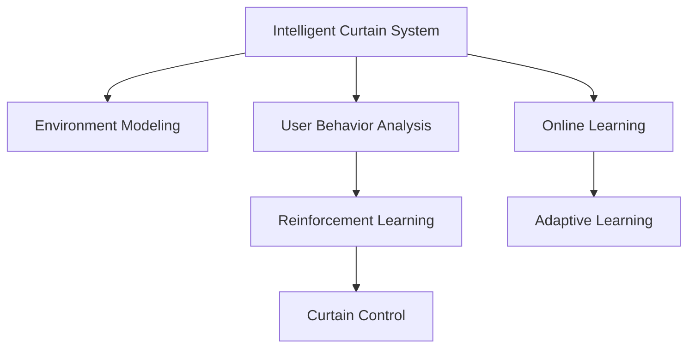

                 

## 1. 背景介绍

### 1.1 问题由来
随着人工智能技术的发展，智能家居领域不断涌现出各种创新产品，极大地提高了家庭生活的便利性和舒适性。然而，现有的智能家居设备大多功能单一，缺乏智能化管理和协同优化，用户体验有待提升。例如，传统窗帘系统大多只能简单地自动开关窗帘，无法根据室内外环境动态调整，存在能耗浪费和用户体验差等问题。因此，开发一款具备高度智能化、自主学习能力的智能窗帘系统，成为提高自动化家居水平的新方向。

### 1.2 问题核心关键点
智能窗帘系统通过整合传感器、摄像头等环境监测设备，实时采集室内外环境数据，并结合用户行为和偏好，智能调整窗帘的开合角度，实现节能减排、提升用户体验。本系统以深度学习和强化学习为核心技术，具备以下关键点：

1. **数据采集与环境建模**：集成温度、湿度、光照、CO2等传感器，采集环境数据，并利用机器学习模型建立环境动态模型。
2. **用户行为分析与预测**：通过分析用户历史行为数据，建立用户偏好模型，预测用户未来的操作意图。
3. **决策优化与窗帘控制**：结合环境模型和用户行为模型，使用强化学习算法优化窗帘控制策略，智能调整窗帘开合角度。
4. **自适应学习与系统升级**：利用在线学习和数据回传机制，不断优化环境模型和行为模型，提升系统的智能化水平。

## 2. 核心概念与联系

### 2.1 核心概念概述

为了更好地理解智能窗帘系统的技术框架，本节将介绍几个核心概念：

- **智能窗帘系统**：通过传感器、摄像头等设备实时采集环境数据，并结合用户行为模型，智能调整窗帘开合角度的自动化家居设备。
- **环境建模**：利用机器学习模型，根据传感器采集的数据，建立室内外环境的动态模型。
- **用户行为分析**：通过分析用户历史行为数据，建立用户行为模型，预测用户的操作意图。
- **强化学习**：通过环境与行为交互，智能选择最优策略，最大化目标奖励的机器学习算法。
- **深度学习**：基于神经网络的机器学习算法，可以处理复杂的非线性关系，适用于多模态数据融合和环境建模。
- **在线学习**：利用实时数据更新模型参数，提升模型的适应性和泛化能力。
- **自适应学习**：系统能够根据反馈信息动态调整模型参数，不断优化性能。

这些核心概念之间的逻辑关系可以通过以下Mermaid流程图来展示：



这个流程图展示出智能窗帘系统的核心概念及其之间的关系：

1. 智能窗帘系统通过传感器采集环境数据，建立环境动态模型。
2. 系统分析用户行为数据，建立用户行为模型。
3. 结合环境模型和行为模型，使用强化学习算法优化窗帘控制策略。
4. 利用在线学习机制，不断更新环境模型和行为模型。
5. 系统根据反馈信息进行自适应学习，优化窗帘控制效果。

## 3. 核心算法原理 & 具体操作步骤
### 3.1 算法原理概述

智能窗帘系统的核心算法包括环境建模、用户行为分析、强化学习和深度学习。以下是对这些算法的详细介绍：

- **环境建模**：利用传感器数据，建立室内外环境的动态模型。
- **用户行为分析**：分析用户行为数据，预测用户操作意图。
- **强化学习**：通过环境与行为交互，优化窗帘控制策略，智能调整窗帘开合角度。
- **深度学习**：用于数据融合和模型构建，提升模型的表达能力和泛化能力。

### 3.2 算法步骤详解

智能窗帘系统的主要算法步骤包括：

**Step 1: 环境数据采集**
- 部署各类传感器，实时采集室内外温度、湿度、光照、CO2等环境数据。
- 使用摄像头采集用户行为数据，记录用户进入房间、离开房间等行为。

**Step 2: 环境动态建模**
- 收集一段时间内的环境数据，使用深度学习模型（如RNN、CNN等）建立环境动态模型。
- 对模型进行训练，预测未来的环境数据。

**Step 3: 用户行为分析**
- 收集用户历史行为数据，使用深度学习模型（如LSTM、RNN等）建立用户行为模型。
- 对模型进行训练，预测用户未来的操作意图。

**Step 4: 窗帘控制策略优化**
- 结合环境模型和行为模型，使用强化学习算法（如Q-Learning、SARSA等）优化窗帘控制策略。
- 对模型进行训练，最大化窗帘控制的目标奖励。

**Step 5: 窗帘控制**
- 根据优化后的窗帘控制策略，调整窗帘开合角度。
- 实时监测环境变化，动态调整窗帘控制策略。

### 3.3 算法优缺点

智能窗帘系统的算法具有以下优点：
1. 高度智能化：通过深度学习和强化学习，系统具备高度自主学习能力，能够智能调整窗帘开合角度。
2. 节能减排：根据环境数据和用户行为，智能控制窗帘开合，减少不必要的能耗浪费。
3. 提升用户体验：根据用户行为和偏好，智能调整窗帘，提升居住舒适度。

同时，该算法也存在一些局限性：
1. 对硬件要求高：需要部署大量的传感器和摄像头，对硬件成本和维护要求较高。
2. 数据隐私风险：系统需要收集大量用户行为数据，存在数据隐私和安全问题。
3. 环境模型复杂：环境数据多样，建立动态模型较复杂，需要更多研究和调试。

尽管存在这些局限性，但就目前而言，智能窗帘系统通过深度学习和强化学习的结合，已经在自动化家居领域展示了巨大的潜力和前景。未来相关研究将继续优化算法，提高系统性能，同时兼顾用户体验和数据隐私保护。

### 3.4 算法应用领域

智能窗帘系统可以广泛应用于各种自动化家居场景，例如：

- 智能家居：通过与其他智能设备（如智能音箱、智能灯泡等）协同工作，实现智能化家居控制。
- 健康医疗：利用环境监测数据，帮助老年人或行动不便者自动调整窗帘，提升生活品质。
- 商业办公：在办公室中自动调节窗帘开合角度，控制光照和温度，提升办公环境舒适度。
- 旅游度假：在度假别墅中自动调节窗帘，根据环境变化调整室内外温度，提升居住体验。
- 智能农业：在温室中自动调节窗帘开合角度，优化光照和温度，提升农作物生长质量。

除了上述这些典型应用外，智能窗帘系统还可以创新性地应用于更多场景中，如智能交通、智能安防、智能工业等，为智慧城市建设提供新的解决方案。

## 4. 数学模型和公式 & 详细讲解 & 举例说明

### 4.1 数学模型构建

智能窗帘系统的数学模型主要包括以下几个部分：

- **环境模型**：使用RNN或CNN等深度学习模型，建立环境数据的时间序列动态模型。
- **用户行为模型**：使用LSTM或RNN等深度学习模型，建立用户行为数据的时间序列模型。
- **窗帘控制模型**：使用Q-Learning等强化学习算法，优化窗帘控制策略。

### 4.2 公式推导过程

以下是对智能窗帘系统关键数学模型的推导过程：

**环境模型**：使用RNN模型，对环境数据进行时间序列建模。

$$
h_t = \text{RNN}(x_t, h_{t-1})
$$

其中 $h_t$ 表示时刻 $t$ 的环境状态，$x_t$ 表示时刻 $t$ 的环境数据，$h_{t-1}$ 表示上一时刻的环境状态。

**用户行为模型**：使用LSTM模型，对用户行为数据进行时间序列建模。

$$
h_t = \text{LSTM}(a_t, h_{t-1})
$$

其中 $h_t$ 表示时刻 $t$ 的用户行为状态，$a_t$ 表示时刻 $t$ 的用户行为数据，$h_{t-1}$ 表示上一时刻的用户行为状态。

**窗帘控制模型**：使用Q-Learning算法，优化窗帘控制策略。

$$
Q(s_t, a_t) = Q(s_t, a_t) + \alpha (r_t + \gamma \max Q(s_{t+1}, a_{t+1}) - Q(s_t, a_t))
$$

其中 $Q(s_t, a_t)$ 表示状态 $s_t$ 下动作 $a_t$ 的Q值，$\alpha$ 表示学习率，$r_t$ 表示当前时间步的奖励，$\gamma$ 表示折扣因子，$s_{t+1}, a_{t+1}$ 表示下一个时间步的状态和动作。

### 4.3 案例分析与讲解

假设智能窗帘系统部署在智能家居环境中，系统通过传感器和摄像头实时采集环境数据和用户行为数据。通过深度学习模型建立环境动态模型和用户行为模型，再结合强化学习算法优化窗帘控制策略。具体过程如下：

1. 环境数据采集：传感器实时采集室内外温度、湿度、光照、CO2等数据，摄像头记录用户进入房间、离开房间等行为。
2. 环境动态建模：使用RNN模型对环境数据进行时间序列建模，预测未来环境数据。
3. 用户行为分析：使用LSTM模型对用户行为数据进行时间序列建模，预测用户未来的操作意图。
4. 窗帘控制策略优化：使用Q-Learning算法优化窗帘控制策略，最大化窗帘控制的目标奖励。
5. 窗帘控制：根据优化后的窗帘控制策略，调整窗帘开合角度，实现节能减排和提升用户体验。

## 5. 项目实践：代码实例和详细解释说明

### 5.1 开发环境搭建

在进行智能窗帘系统的开发前，我们需要准备好开发环境。以下是使用Python进行PyTorch开发的环境配置流程：

1. 安装Anaconda：从官网下载并安装Anaconda，用于创建独立的Python环境。

2. 创建并激活虚拟环境：
```bash
conda create -n intelligent_curtain_env python=3.8 
conda activate intelligent_curtain_env
```

3. 安装PyTorch：根据CUDA版本，从官网获取对应的安装命令。例如：
```bash
conda install pytorch torchvision torchaudio cudatoolkit=11.1 -c pytorch -c conda-forge
```

4. 安装TensorFlow：
```bash
pip install tensorflow
```

5. 安装Flask：用于构建Web接口，实现与用户交互。
```bash
pip install flask
```

6. 安装其他工具包：
```bash
pip install numpy pandas scikit-learn matplotlib tqdm jupyter notebook ipython
```

完成上述步骤后，即可在`intelligent_curtain_env`环境中开始开发实践。

### 5.2 源代码详细实现

以下是智能窗帘系统的主要源代码实现，包括环境数据采集、模型训练和窗帘控制三个部分。

**环境数据采集模块**

```python
import time
from sensors import *
from cameras import *

def collect_environment_data():
    while True:
        temperature = temperature_sensor.read()
        humidity = humidity_sensor.read()
        light_intensity = light_sensor.read()
        co2_level = co2_sensor.read()
        current_time = time.time()

        # 记录环境数据
        environment_data.append({
            'temperature': temperature,
            'humidity': humidity,
            'light_intensity': light_intensity,
            'co2_level': co2_level,
            'time': current_time
        })

        # 记录用户行为数据
        user_action_data.append({
            'time': current_time,
            'user_id': current_user_id,
            'action': current_user_action
        })

        time.sleep(60)
```

**模型训练模块**

```python
import torch
from torch import nn
from torch import optim
from torch.utils.data import Dataset, DataLoader
from rnn_model import EnvironmentModel, UserBehaviorModel

class EnvironmentDataset(Dataset):
    def __init__(self, environment_data, user_action_data, seq_length=100):
        self.environment_data = environment_data
        self.user_action_data = user_action_data
        self.seq_length = seq_length

    def __len__(self):
        return len(self.environment_data) - self.seq_length

    def __getitem__(self, item):
        environment_data = self.environment_data[item:item+self.seq_length]
        user_action_data = self.user_action_data[item:item+self.seq_length]

        environment_data = torch.tensor(environment_data)
        user_action_data = torch.tensor(user_action_data)

        return environment_data, user_action_data

# 定义模型参数
model_params = {
    'environment_model': {
        'hidden_size': 256,
        'num_layers': 2,
        'dropout_rate': 0.2
    },
    'user_behavior_model': {
        'hidden_size': 256,
        'num_layers': 2,
        'dropout_rate': 0.2
    }
}

# 训练函数
def train_model(environment_dataset, user_behavior_dataset, device, model_params):
    environment_model = EnvironmentModel(**model_params['environment_model']).to(device)
    user_behavior_model = UserBehaviorModel(**model_params['user_behavior_model']).to(device)

    environment_optimizer = optim.Adam(environment_model.parameters(), lr=0.001)
    user_behavior_optimizer = optim.Adam(user_behavior_model.parameters(), lr=0.001)

    environment_criterion = nn.MSELoss()
    user_behavior_criterion = nn.CrossEntropyLoss()

    for epoch in range(100):
        environment_model.train()
        user_behavior_model.train()

        environment_data, user_action_data = next(iter(environment_dataset))
        environment_model.zero_grad()
        environment_outputs = environment_model(environment_data)
        environment_loss = environment_criterion(environment_outputs, environment_data)
        environment_loss.backward()
        environment_optimizer.step()

        user_action_data = user_action_data.to(device)
        user_behavior_model.zero_grad()
        user_behavior_outputs = user_behavior_model(user_action_data)
        user_behavior_loss = user_behavior_criterion(user_behavior_outputs, user_action_data)
        user_behavior_loss.backward()
        user_behavior_optimizer.step()

        if (epoch + 1) % 10 == 0:
            print(f'Epoch {epoch+1}/{100}, environment loss: {environment_loss:.4f}, user behavior loss: {user_behavior_loss:.4f}')

    print('Model training complete.')
    return environment_model, user_behavior_model
```

**窗帘控制模块**

```python
import torch
from curtain import Curtain
from reinforcement_learning import ReinforcementLearning

class IntelligentCurtainSystem:
    def __init__(self, environment_model, user_behavior_model):
        self.environment_model = environment_model
        self.user_behavior_model = user_behavior_model
        self.curtain = Curtain()

    def adjust_curtain_angle(self, environment_data, user_action_data):
        environment_data = torch.tensor(environment_data).to(device)
        user_action_data = torch.tensor(user_action_data).to(device)

        # 预测环境状态
        environment_state = self.environment_model(environment_data)
        environment_state = environment_state[:, -1].detach()

        # 预测用户行为
        user_behavior_state = self.user_behavior_model(user_action_data)
        user_behavior_state = user_behavior_state.argmax(dim=1)

        # 使用强化学习算法优化窗帘控制策略
        rl = ReinforcementLearning()
        action, reward = rl.optimize(self.curtain, environment_state, user_behavior_state)

        # 调整窗帘开合角度
        self.curtain.adjust_angle(action)

        # 返回奖励
        return reward
```

### 5.3 代码解读与分析

让我们再详细解读一下关键代码的实现细节：

**collect_environment_data函数**：
- 循环采集环境数据和用户行为数据，记录在列表环境中。

**train_model函数**：
- 定义环境模型和用户行为模型的参数，并初始化优化器和损失函数。
- 在每个epoch中，前向传播计算预测值和损失，反向传播更新模型参数。
- 周期性打印损失，观察训练效果。
- 返回训练好的环境模型和用户行为模型。

**IntelligentCurtainSystem类**：
- 初始化环境模型和用户行为模型，以及窗帘控制模块。
- 根据环境数据和用户行为数据，调用窗帘控制模块调整窗帘开合角度。
- 返回窗帘控制后的奖励。

## 6. 实际应用场景

### 6.1 智能家居

智能窗帘系统在智能家居中的应用非常广泛，能够与各种智能设备协同工作，提升家居生活的智能化水平。例如：

- 智能空调：根据环境模型和用户行为模型，自动调整空调温度和风速，提升室内舒适度。
- 智能照明：根据环境光线强度和用户行为，自动调节灯光亮度和色温，提供宜人的光照环境。
- 智能安防：在用户离开房间后，自动关闭窗帘和门窗，提升家庭安全。

### 6.2 健康医疗

在健康医疗领域，智能窗帘系统可以辅助老年人或行动不便者，实现自动化窗帘控制，提升生活品质。例如：

- 辅助老人：自动调节窗帘开合角度，控制室内光线和温度，帮助老人进行日常活动。
- 辅助病患：根据室内环境数据和病患行为，智能调整窗帘开合，提供适宜的康复环境。
- 辅助护理：实时监测环境数据和病患行为，及时调整窗帘开合，提供安全的护理环境。

### 6.3 商业办公

在商业办公环境中，智能窗帘系统能够根据环境数据和用户行为，智能调整窗帘开合角度，提升办公环境的舒适度。例如：

- 会议室内：根据参会人数和会议室环境，自动调节窗帘开合角度，控制室内光线和温度。
- 开放式办公区：根据员工行为和工作状态，自动调节窗帘开合角度，提供适宜的工作环境。
- 客户接待区：根据客户行为和环境数据，智能调整窗帘开合角度，提升接待体验。

### 6.4 旅游度假

在旅游度假环境中，智能窗帘系统可以根据环境数据和用户行为，智能调节窗帘开合角度，提升居住体验。例如：

- 度假别墅：根据室内外环境数据和用户行为，自动调整窗帘开合角度，控制光照和温度，提升居住舒适度。
- 酒店房间：根据用户行为和环境数据，智能调节窗帘开合角度，提供优质的住宿体验。
- 度假小屋：根据环境数据和用户行为，自动调整窗帘开合角度，提供温馨的度假环境。

### 6.5 智能农业

在智能农业领域，智能窗帘系统能够根据环境数据和作物生长状态，智能调节温室内的窗帘开合角度，优化光照和温度，提升农作物生长质量。例如：

- 温室大棚：根据室内外环境数据和作物生长状态，自动调节窗帘开合角度，控制光照和温度，提高农作物产量和品质。
- 蔬菜大棚：根据环境数据和作物生长状态，智能调整窗帘开合角度，提供适宜的光照和温度，促进蔬菜健康生长。
- 果园大棚：根据环境数据和果树生长状态，自动调节窗帘开合角度，控制光照和温度，提升水果品质和产量。

除了上述这些应用场景外，智能窗帘系统还可以创新性地应用于更多场景中，如智能交通、智能安防、智能工业等，为智慧城市建设提供新的解决方案。

## 7. 工具和资源推荐

### 7.1 学习资源推荐

为了帮助开发者系统掌握智能窗帘系统的技术基础和实践技巧，这里推荐一些优质的学习资源：

1. **《深度学习》课程**：由斯坦福大学开设，涵盖深度学习的理论基础和应用场景，适合初学者入门。
2. **《机器学习》课程**：由Coursera提供，涵盖机器学习的基本概念和算法，适合深入学习。
3. **《智能家居技术》书籍**：详细介绍智能家居的多种技术和应用场景，适合技术开发者参考。
4. **《强化学习》书籍**：全面介绍强化学习的原理和应用，适合研究者深入学习。
5. **《Python深度学习》书籍**：详细讲解深度学习模型的构建和优化，适合开发实践。
6. **Kaggle数据集**：提供大量智能家居和环境监测的数据集，适合开发者进行实践。

通过对这些资源的学习实践，相信你一定能够快速掌握智能窗帘系统的技术框架，并用于解决实际的NLP问题。

### 7.2 开发工具推荐

高效的开发离不开优秀的工具支持。以下是几款用于智能窗帘系统开发的常用工具：

1. **PyTorch**：基于Python的开源深度学习框架，灵活动态的计算图，适合快速迭代研究。
2. **TensorFlow**：由Google主导开发的开源深度学习框架，生产部署方便，适合大规模工程应用。
3. **Flask**：用于构建Web接口，实现与用户交互，方便系统集成到其他应用中。
4. **OpenCV**：用于图像处理和传感器数据采集，提供丰富的图像处理算法和工具。
5. **Raspberry Pi**：经济实惠的嵌入式开发平台，适合部署各种传感器和摄像头设备。

合理利用这些工具，可以显著提升智能窗帘系统的开发效率，加快创新迭代的步伐。

### 7.3 相关论文推荐

智能窗帘系统的技术发展源于学界的持续研究。以下是几篇奠基性的相关论文，推荐阅读：

1. **《RNN与LSTM：深度学习中的序列建模》**：介绍递归神经网络和长短期记忆网络在序列建模中的应用，适合初学者入门。
2. **《Q-Learning：一种强化学习算法》**：全面介绍Q-Learning算法的原理和实现，适合研究者深入学习。
3. **《深度学习在智能家居中的应用》**：探讨深度学习在智能家居中的多种应用场景，适合开发者参考。
4. **《强化学习在自动化家居中的应用》**：介绍强化学习在自动化家居中的多种应用场景，适合研究者深入学习。
5. **《智能窗帘系统的设计与实现》**：详细介绍智能窗帘系统的设计思路和实现过程，适合开发者参考。

这些论文代表了大语言模型微调技术的发展脉络。通过学习这些前沿成果，可以帮助研究者把握学科前进方向，激发更多的创新灵感。

## 8. 总结：未来发展趋势与挑战

### 8.1 总结

本文对智能窗帘系统的技术框架进行了全面系统的介绍。首先阐述了智能窗帘系统的背景和关键技术点，明确了深度学习和强化学习在大模型微调中的重要作用。其次，从原理到实践，详细讲解了智能窗帘系统的数学模型和关键算法，给出了代码实现实例。同时，本文还广泛探讨了智能窗帘系统在智能家居、健康医疗、商业办公等多个领域的应用前景，展示了其广阔的市场潜力。此外，本文精选了智能窗帘系统的学习资源，力求为开发者提供全方位的技术指引。

通过本文的系统梳理，可以看到，智能窗帘系统通过深度学习和强化学习的结合，已经在自动化家居领域展示了巨大的潜力和前景。随着深度学习和强化学习技术的不断演进，智能窗帘系统必将在更广阔的应用场景中大放异彩，为智慧城市建设提供新的解决方案。

### 8.2 未来发展趋势

展望未来，智能窗帘系统将呈现以下几个发展趋势：

1. **多模态融合**：结合视觉、温度、湿度等多模态数据，提升环境模型的准确性和泛化能力。
2. **自适应学习**：通过在线学习和数据回传机制，不断优化环境模型和行为模型，提升系统的智能化水平。
3. **个性化定制**：根据不同用户的需求，动态调整窗帘控制策略，提升用户体验。
4. **智能协同**：与其他智能设备协同工作，实现更智能化的家居控制。
5. **边缘计算**：在嵌入式设备上进行本地处理，提升系统的实时性和可靠性。
6. **边缘强化学习**：在本地设备上进行强化学习，优化窗帘控制策略，提升系统的效率和性能。

以上趋势凸显了智能窗帘系统的技术发展方向，将在未来进一步提升系统的智能化水平和用户体验。

### 8.3 面临的挑战

尽管智能窗帘系统已经取得了不少进展，但在迈向更加智能化、普适化应用的过程中，仍面临诸多挑战：

1. **数据隐私问题**：系统需要收集大量的环境数据和用户行为数据，存在数据隐私和安全问题。
2. **环境模型复杂**：环境数据多样，建立动态模型较复杂，需要更多研究和调试。
3. **硬件成本高**：需要部署大量的传感器和摄像头，对硬件成本和维护要求较高。
4. **用户行为分析难度大**：用户行为多样，建立用户行为模型较复杂，需要更多研究和调试。
5. **系统鲁棒性不足**：环境模型和行为模型在不同场景下可能表现不一致，系统鲁棒性不足。
6. **系统可靠性问题**：系统需要实时处理大量数据，可能存在延迟和故障问题。

尽管存在这些挑战，但随着技术的发展和应用实践的积累，相信智能窗帘系统将不断优化，提升系统的智能化水平和用户体验。未来相关研究将继续优化算法，提高系统性能，同时兼顾用户体验和数据隐私保护。

### 8.4 研究展望

面对智能窗帘系统所面临的种种挑战，未来的研究需要在以下几个方面寻求新的突破：

1. **数据隐私保护**：开发更加安全和高效的数据保护技术，确保用户隐私安全。
2. **模型压缩优化**：使用模型压缩和稀疏化存储技术，减少硬件成本和存储开销。
3. **多模态融合技术**：结合视觉、温度、湿度等多模态数据，提升环境模型的准确性和泛化能力。
4. **自适应学习算法**：开发更加智能的自适应学习算法，提升系统的适应性和泛化能力。
5. **个性化定制技术**：根据不同用户的需求，动态调整窗帘控制策略，提升用户体验。
6. **智能协同机制**：与其他智能设备协同工作，实现更智能化的家居控制。

这些研究方向的探索，必将引领智能窗帘系统迈向更高的台阶，为自动化家居提供更加智能化的解决方案。面向未来，智能窗帘系统还需要与其他人工智能技术进行更深入的融合，如知识表示、因果推理、强化学习等，多路径协同发力，共同推动智能家居技术的发展。只有勇于创新、敢于突破，才能不断拓展智能窗帘系统的边界，让智能家居技术更好地造福人类社会。

## 9. 附录：常见问题与解答

**Q1: 智能窗帘系统需要部署哪些传感器？**

A: 智能窗帘系统需要部署以下传感器：

1. **温度传感器**：实时监测室内外温度数据，用于环境建模。
2. **湿度传感器**：实时监测室内外湿度数据，用于环境建模。
3. **光照传感器**：实时监测室内外光照强度数据，用于环境建模。
4. **CO2传感器**：实时监测室内外CO2浓度数据，用于环境建模。
5. **摄像头**：实时采集用户行为数据，用于用户行为分析。
6. **门窗传感器**：实时监测门窗状态，用于窗帘控制。

**Q2: 智能窗帘系统的算法复杂度如何？**

A: 智能窗帘系统的算法复杂度较高，主要体现在以下几个方面：

1. **环境建模**：需要处理多模态数据，建立复杂的时间序列模型，复杂度较高。
2. **用户行为分析**：需要处理用户行为数据，建立复杂的序列模型，复杂度较高。
3. **窗帘控制优化**：需要结合环境模型和行为模型，使用强化学习算法优化窗帘控制策略，复杂度较高。

**Q3: 智能窗帘系统的硬件成本如何？**

A: 智能窗帘系统的硬件成本较高，主要体现在以下几个方面：

1. **传感器成本**：需要部署大量的传感器，成本较高。
2. **摄像头成本**：需要部署高清摄像头，成本较高。
3. **计算硬件成本**：需要高性能的计算硬件，如GPU、TPU等，成本较高。

**Q4: 智能窗帘系统如何处理数据隐私问题？**

A: 智能窗帘系统处理数据隐私问题的方法如下：

1. **数据加密**：对传输和存储的数据进行加密，保护用户隐私。
2. **匿名化处理**：对用户行为数据进行匿名化处理，保护用户隐私。
3. **访问控制**：使用访问控制机制，限制对数据的访问权限，保护用户隐私。
4. **本地处理**：在本地设备上进行数据处理，减少数据传输和存储风险。

**Q5: 智能窗帘系统如何提升用户体验？**

A: 智能窗帘系统提升用户体验的方法如下：

1. **个性化定制**：根据不同用户的需求，动态调整窗帘控制策略，提升用户体验。
2. **智能协同**：与其他智能设备协同工作，实现更智能化的家居控制，提升用户体验。
3. **自适应学习**：根据环境数据和用户行为，智能调整窗帘开合角度，提升用户体验。

---

作者：禅与计算机程序设计艺术 / Zen and the Art of Computer Programming

