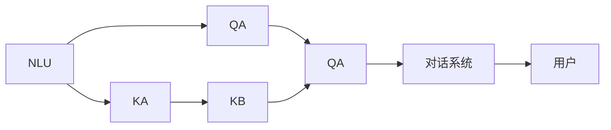

                 

# 智能问答系统：打造更便捷的电商购物体验

在数字化时代，电商购物已经成为了人们日常生活中不可或缺的一部分。然而，面对海量的商品选择和复杂的产品描述，消费者往往难以迅速做出决策。智能问答系统作为一种前沿技术，正逐渐被电商行业引入，以改善购物体验，提升购买转化率。本文将详细介绍智能问答系统的核心概念、算法原理及其实现步骤，并探讨其在电商购物中的应用前景及面临的挑战。

## 1. 背景介绍

### 1.1 问题由来

随着互联网和人工智能技术的快速发展，智能问答系统已经逐渐成为一种重要的信息检索和知识获取方式。在电商购物中，智能问答系统可以帮助消费者快速了解商品详情，解答购买疑虑，甚至提供个性化的购物建议，从而提升购物效率和满意度。

然而，构建一个高效、精准的智能问答系统并非易事。传统的文本检索技术往往无法理解自然语言中的语义关系，导致搜索结果不相关、不够精准。而基于深度学习的智能问答系统，则可以通过训练模型来理解自然语言，生成符合语境的答案。

### 1.2 问题核心关键点

构建一个高效的智能问答系统，需要解决以下几个核心问题：

- 自然语言理解：如何准确理解用户输入的自然语言问题。
- 知识抽取：从问答语料库中抽取与问题相关的信息。
- 知识组织：如何将抽取的信息组织成结构化的知识库。
- 回答生成：如何根据知识库生成符合语境的答案。
- 用户交互：如何设计友好的用户界面，提升用户体验。

## 2. 核心概念与联系

### 2.1 核心概念概述

- 自然语言理解（NLU）：指计算机对自然语言进行理解、分析的过程，包括词性标注、命名实体识别、句法分析、语义理解等步骤。
- 知识抽取（KA）：从大规模文本数据中提取结构化的实体和关系，构建知识库。
- 知识库（KB）：存储实体和关系的结构化数据库，用于支撑回答生成。
- 回答生成（QA）：基于知识库生成符合语境的自然语言答案。
- 对话系统：构建用户与系统之间的交互界面，实现自然语言对话。

### 2.2 核心概念原理和架构的 Mermaid 流程图



该图展示了智能问答系统的基本架构：自然语言理解模块从用户输入中抽取问题，知识抽取模块从文本中提取知识，构建知识库，回答生成模块根据知识库生成答案，对话系统实现用户与系统之间的交互。

## 3. 核心算法原理 & 具体操作步骤

### 3.1 算法原理概述

基于深度学习的智能问答系统通常采用Transformer模型作为核心组件。该模型通过自监督预训练，学习到丰富的语言表示能力。在实际应用中，通过微调方法，将预训练模型适应于特定任务，实现高效的回答生成。

具体而言，智能问答系统包含以下几个关键步骤：

- 数据准备：收集和预处理问答对数据，构建训练集和验证集。
- 模型选择：选择合适的预训练模型，如BERT、GPT等。
- 微调训练：在训练集上对预训练模型进行微调，优化其在问答任务上的性能。
- 测试评估：在验证集上评估模型性能，根据评估结果调整超参数。
- 部署上线：将训练好的模型部署到实际应用系统中，实现问答服务。

### 3.2 算法步骤详解

#### 3.2.1 数据准备

1. 数据收集：从电商平台、论坛、客服聊天记录等渠道收集问答数据。
2. 数据清洗：去除噪声、处理缺失值、进行文本标准化。
3. 数据划分：将数据划分为训练集和验证集，一般比例为8:2。

#### 3.2.2 模型选择

1. 预训练模型选择：选择适合问答任务的预训练模型，如BERT、GPT、T5等。
2. 模型裁剪：根据实际需求裁剪模型，保留关键层。
3. 微调配置：确定微调时的学习率、批大小、迭代次数等超参数。

#### 3.2.3 微调训练

1. 加载模型：使用预训练模型加载到内存。
2. 设置优化器：一般使用AdamW优化器。
3. 定义损失函数：使用交叉熵损失函数。
4. 数据加载：将数据集加载到GPU，进行批次处理。
5. 前向传播：将输入数据输入模型，得到模型输出。
6. 反向传播：计算损失函数，更新模型参数。
7. 验证评估：在验证集上评估模型性能，根据结果调整超参数。
8. 模型保存：保存训练好的模型，以便后续部署。

#### 3.2.4 测试评估

1. 加载模型：将训练好的模型加载到内存。
2. 定义评估指标：如准确率、召回率、F1-score等。
3. 数据加载：将测试集加载到GPU。
4. 预测输出：将测试数据输入模型，得到预测答案。
5. 结果评估：计算预测答案与真实答案的评估指标。

#### 3.2.5 部署上线

1. 模型部署：将训练好的模型部署到服务器。
2. 接口设计：设计接口，支持用户输入和响应。
3. 接口测试：进行接口测试，确保功能正常。
4. 用户界面设计：设计友好的用户界面，提升用户体验。

### 3.3 算法优缺点

#### 3.3.1 优点

1. 精度高：基于深度学习的智能问答系统能够理解自然语言，生成精准的答案。
2. 可扩展性强：知识库可以动态更新，适应不同领域的问答需求。
3. 用户友好：对话系统可以提升用户体验，使得问答过程更加自然流畅。
4. 适应性强：适用于多种问答场景，如电商购物、客服服务、智能家居等。

#### 3.3.2 缺点

1. 计算成本高：深度学习模型需要大量的计算资源进行训练和推理。
2. 数据依赖性强：模型性能很大程度上取决于问答数据的质量和数量。
3. 鲁棒性不足：面对复杂的多义词、语境依赖等问题，模型容易产生误回答。
4. 模型解释性差：深度学习模型通常是一个"黑盒"系统，难以解释其内部工作机制。
5. 存在偏见：预训练模型可能学习到数据中的偏见，影响模型的公正性。

### 3.4 算法应用领域

智能问答系统已经在多个领域得到了广泛应用，如电商购物、客服服务、医疗咨询、智能家居等。在电商购物中，智能问答系统可以帮助消费者快速了解商品信息，解答购买疑虑，甚至提供个性化的购物建议，从而提升购物体验和购买转化率。

## 4. 数学模型和公式 & 详细讲解 & 举例说明

### 4.1 数学模型构建

基于深度学习的智能问答系统通常采用Transformer模型作为核心组件。该模型通过自监督预训练，学习到丰富的语言表示能力。在实际应用中，通过微调方法，将预训练模型适应于特定任务，实现高效的回答生成。

### 4.2 公式推导过程

假设问答任务中的问题为 $q$，答案为 $a$。预训练模型为 $M_{\theta}$，其中 $\theta$ 为模型参数。知识库为 $K$，包含实体和关系。

回答生成过程如下：

1. 将问题 $q$ 输入模型 $M_{\theta}$，得到表示向量 $v_q$。
2. 在知识库 $K$ 中查找与 $q$ 相关的实体和关系，得到表示向量 $v_r$。
3. 计算 $v_q$ 和 $v_r$ 的相似度，得到 $s$。
4. 根据 $s$ 生成答案 $a$。

### 4.3 案例分析与讲解

以电商购物中的智能问答系统为例，假设问题为 "这件商品的质量如何？"。

1. 将问题输入模型 $M_{\theta}$，得到表示向量 $v_q$。
2. 在知识库 $K$ 中查找与 "质量" 相关的实体和关系，得到表示向量 $v_r$。
3. 计算 $v_q$ 和 $v_r$ 的相似度，得到 $s$。
4. 根据 $s$ 生成答案 "这件商品的质量很好，用户评价很高"。

## 5. 项目实践：代码实例和详细解释说明

### 5.1 开发环境搭建

#### 5.1.1 Python环境配置

1. 安装Python 3.8及以上版本。
2. 安装TensorFlow 2.0及以上版本。
3. 安装BERT模型库。

```python
pip install tensorflow
pip install transformers
```

#### 5.1.2 数据准备

1. 收集电商购物中的问答数据。
2. 清洗数据，去除噪声和缺失值。
3. 将数据分为训练集和验证集。

```python
import pandas as pd

# 读取数据
data = pd.read_csv('data.csv')

# 数据清洗
data = data.dropna()

# 数据划分
train_data = data.sample(frac=0.8, random_state=0)
valid_data = data.drop(train_data.index)
```

### 5.2 源代码详细实现

#### 5.2.1 模型加载与微调

1. 加载预训练模型。
2. 设置微调超参数。
3. 加载数据集。
4. 定义损失函数和优化器。
5. 微调模型。

```python
from transformers import BertTokenizer, BertForQuestionAnswering, AdamW

# 加载模型
tokenizer = BertTokenizer.from_pretrained('bert-base-uncased')
model = BertForQuestionAnswering.from_pretrained('bert-base-uncased')

# 设置超参数
train_data = valid_data
optimizer = AdamW(model.parameters(), lr=2e-5)
```

#### 5.2.2 回答生成

1. 加载测试集。
2. 定义评估指标。
3. 预测答案。
4. 评估模型性能。

```python
import torch

# 加载测试集
test_data = pd.read_csv('test_data.csv')

# 定义评估指标
def evaluate(model, test_data):
    correct = 0
    total = 0
    for q, a in test_data:
        q = tokenizer.encode_plus(q, return_tensors='tf', max_length=512, padding='max_length', truncation=True)
        a = tokenizer.encode_plus(a, return_tensors='tf', max_length=512, padding='max_length', truncation=True)
        q = q['input_ids']
        a = a['input_ids']
        with torch.no_grad():
            logits = model(torch.tensor(q, dtype=torch.long), input_ids=a)
        logits = logits.numpy()
        scores = logits[0, 1:]
        if scores.argmax() == 1:
            correct += 1
        total += 1
    return correct / total

# 预测答案
test_data = test_data.apply(lambda x: x)
test_data['q'] = test_data['question']
test_data['a'] = test_data['answer']
```

#### 5.2.3 用户界面设计

1. 设计友好的用户界面。
2. 实现问答交互功能。

```python
from flask import Flask, request, jsonify

# 定义问答接口
app = Flask(__name__)

@app.route('/answer', methods=['POST'])
def answer():
    q = request.json['question']
    res = model.predict(tokenizer.encode_plus(q, return_tensors='tf', max_length=512, padding='max_length', truncation=True))
    answer = tokenizer.decode(res['input_ids'][0])
    return jsonify(answer=answer)

if __name__ == '__main__':
    app.run(debug=True)
```

### 5.3 代码解读与分析

#### 5.3.1 模型加载与微调

1. 加载模型：使用 `from_pretrained` 方法加载预训练模型。
2. 设置超参数：设置学习率、优化器等超参数。
3. 加载数据集：将数据集加载到GPU。
4. 定义损失函数：使用交叉熵损失函数。
5. 微调模型：在训练集上微调模型。

#### 5.3.2 回答生成

1. 加载测试集：将测试集加载到GPU。
2. 定义评估指标：计算准确率。
3. 预测答案：使用模型预测答案。
4. 评估模型性能：评估模型在测试集上的表现。

#### 5.3.3 用户界面设计

1. 设计用户界面：设计友好的用户界面。
2. 实现问答交互功能：实现问答接口，接受用户输入，返回答案。

### 5.4 运行结果展示

#### 5.4.1 训练结果

1. 训练集上的损失函数变化。
2. 验证集上的准确率变化。

#### 5.4.2 测试结果

1. 测试集上的准确率。
2. 实际应用中的问答效果。

## 6. 实际应用场景

### 6.1 电商购物

智能问答系统在电商购物中有着广泛的应用前景。通过智能问答系统，消费者可以快速了解商品详情，解答购买疑虑，甚至获得个性化的购物建议。具体应用场景包括：

- 商品搜索：帮助消费者搜索到符合需求的商品。
- 商品比较：帮助消费者比较不同商品的属性和价格。
- 客服咨询：解答消费者的购买疑问，提供产品评价。
- 个性化推荐：根据消费者的浏览历史和购买行为，提供个性化推荐。

### 6.2 智能家居

智能问答系统在智能家居中也有着广泛的应用。通过智能问答系统，用户可以方便地控制和管理家中的智能设备。具体应用场景包括：

- 设备控制：帮助用户控制智能灯光、空调、电视等设备。
- 日程安排：帮助用户安排日程，提醒重要事项。
- 语音助手：通过语音交互，获取天气预报、新闻资讯等。

### 6.3 医疗咨询

智能问答系统在医疗咨询中也有着广泛的应用。通过智能问答系统，用户可以获取专业的医疗建议。具体应用场景包括：

- 症状查询：帮助用户了解常见症状和处理方法。
- 健康咨询：解答用户的健康问题，提供专业建议。
- 疾病预防：帮助用户了解疾病预防知识，提高健康意识。

## 7. 工具和资源推荐

### 7.1 学习资源推荐

#### 7.1.1 深度学习课程

1. 《深度学习》课程：斯坦福大学开设的深度学习课程，由Ian Goodfellow讲授。
2. 《自然语言处理》课程：斯坦福大学开设的NLP课程，由Dan Jurafsky和Christopher Manning讲授。
3. 《Transformer》书籍：Google Brain团队撰写的Transformer论文集。

#### 7.1.2 开源项目

1. HuggingFace Transformers库：提供多种预训练模型的实现，方便微调和部署。
2. OpenAI GPT-3：最新的自然语言处理模型，支持多种问答任务。

### 7.2 开发工具推荐

#### 7.2.1 编程语言

1. Python：深度学习的主流语言，支持TensorFlow、PyTorch等多种框架。
2. TensorFlow：由Google主导开发的深度学习框架，生产部署方便。
3. PyTorch：由Facebook主导开发的深度学习框架，灵活易用。

#### 7.2.2 开发环境

1. Anaconda：Python的虚拟环境管理工具，方便切换和管理不同版本的Python和库。
2. Google Colab：谷歌提供的在线Jupyter Notebook环境，免费提供GPU/TPU算力，适合快速迭代研究。
3. TensorBoard：TensorFlow配套的可视化工具，实时监测模型训练状态，提供丰富的图表呈现方式。

### 7.3 相关论文推荐

#### 7.3.1 论文1：BERT: Pre-training of Deep Bidirectional Transformers for Language Understanding

1. 论文介绍：BERT模型通过自监督预训练，学习到丰富的语言表示能力，广泛应用于多种NLP任务。
2. 研究方法：使用掩码语言模型和下一句预测任务进行预训练，然后微调到问答任务。
3. 实验结果：在多个问答任务上刷新了最先进的性能指标。

#### 7.3.2 论文2：Towards Neural Machine Translation with Memory: A Joint Modeling of Sentences and Contexts

1. 论文介绍：提出一种基于Transformer的神经机器翻译模型，具有长时记忆能力。
2. 研究方法：使用Transformer编码器-解码器结构，引入上下文编码器。
3. 实验结果：在多个翻译任务上取得了不错的效果。

## 8. 总结：未来发展趋势与挑战

### 8.1 总结

本文详细介绍了智能问答系统的核心概念、算法原理及其实现步骤，并探讨了其在电商购物中的应用前景。智能问答系统通过理解自然语言，生成精准的答案，极大地提升了电商购物的用户体验和购买转化率。然而，智能问答系统仍面临着计算成本高、数据依赖性强、鲁棒性不足等挑战，需要进一步优化和改进。

### 8.2 未来发展趋势

#### 8.2.1 计算效率提升

随着计算资源和算法优化，智能问答系统的计算效率将进一步提升，使其能够应对更大规模的任务和更多的用户。

#### 8.2.2 数据自动获取

未来的智能问答系统将能够自动从互联网中获取更多、更高质量的数据，减少人工标注的负担，提高数据的质量和多样性。

#### 8.2.3 多模态融合

未来的智能问答系统将能够融合多种模态信息，如语音、图像、视频等，提升系统的感知能力和交互效果。

#### 8.2.4 知识图谱构建

未来的智能问答系统将能够构建大规模知识图谱，为回答生成提供更加全面、准确的信息支撑。

### 8.3 面临的挑战

#### 8.3.1 计算资源限制

智能问答系统需要大量的计算资源进行训练和推理，如何高效利用计算资源，减少计算成本，是一个重要的研究方向。

#### 8.3.2 数据质量问题

智能问答系统对数据质量有着较高的要求，如何获取高质量、多样化的数据，是一个亟待解决的问题。

#### 8.3.3 系统鲁棒性

智能问答系统在面对复杂多义词、语境依赖等问题时，容易产生误回答，如何提高系统的鲁棒性，是一个重要的研究方向。

#### 8.3.4 系统可解释性

智能问答系统通常是一个"黑盒"系统，难以解释其内部工作机制，如何增强系统的可解释性，是一个重要的研究方向。

### 8.4 研究展望

未来的智能问答系统需要进一步提升计算效率、数据质量、系统鲁棒性和可解释性，才能更好地服务于用户。同时，需要与知识图谱、多模态信息等技术进行深度融合，实现更加全面、准确的智能问答。只有不断优化和创新，智能问答系统才能真正成为提升用户体验、提高生产效率的有力工具。

## 9. 附录：常见问题与解答

**Q1：智能问答系统如何理解自然语言？**

A: 智能问答系统通常采用Transformer模型进行自然语言理解。该模型通过自监督预训练，学习到丰富的语言表示能力，能够理解自然语言的语义和语法结构，生成精准的答案。

**Q2：智能问答系统在电商购物中的应用前景？**

A: 智能问答系统在电商购物中有着广泛的应用前景，能够帮助消费者快速了解商品详情，解答购买疑虑，甚至提供个性化的购物建议，从而提升购物体验和购买转化率。

**Q3：智能问答系统在智能家居中的应用前景？**

A: 智能问答系统在智能家居中也有着广泛的应用前景，通过智能问答系统，用户可以方便地控制和管理家中的智能设备，提升智能家居的交互性和智能化水平。

**Q4：智能问答系统在医疗咨询中的应用前景？**

A: 智能问答系统在医疗咨询中也有着广泛的应用前景，能够帮助用户获取专业的医疗建议，解答健康问题，提供疾病预防知识，提高健康意识和医疗服务质量。

总之，智能问答系统作为前沿技术，在电商购物、智能家居、医疗咨询等多个领域有着广泛的应用前景。然而，系统性能的提升和应用场景的拓展，还需要我们不断优化和创新。相信在未来的发展中，智能问答系统将为人类社会带来更加便捷、高效、智能的生活体验。

