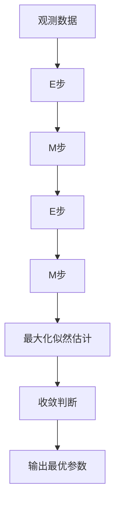

                 

# 期望最大化EM原理与代码实例讲解

> 关键词：期望最大化,EM算法,最大似然估计,隐含变量,贝叶斯网络,学习算法

## 1. 背景介绍

### 1.1 问题由来
在概率统计和机器学习中，期望最大化(Expectation Maximization, EM)算法是一种常用的参数估计方法，用于解决包含隐含变量的概率模型参数估计问题。EM算法通过交替最大化期望和最大化似然来逐步优化模型参数，尤其在处理复杂数据结构（如混合模型、隐马尔可夫模型、聚类等）时表现出极大的灵活性和有效性。

### 1.2 问题核心关键点
EM算法通常用于估计具有隐含变量的概率模型参数，例如高斯混合模型(Gaussian Mixture Model, GMM)、隐马尔可夫模型(Hidden Markov Model, HMM)等。其核心思想是在已知观测数据的条件下，通过最大化后验概率对模型参数进行估计。EM算法的核心步骤如下：

1. **E步**：对给定观测数据，求出每个隐含变量的期望值。
2. **M步**：在E步计算的期望值基础上，最大化似然函数，求出模型参数的极大似然估计值。

通过交替进行E步和M步，EM算法可以逐步逼近全局最优解。该算法特别适用于隐含变量数量较大、数据结构复杂的情况，能够有效避免陷入局部最优解。

### 1.3 问题研究意义
EM算法在机器学习和数据挖掘领域有着广泛的应用，对于具有隐含变量的概率模型，EM算法提供了一种高效、稳定的参数估计方法。它不仅可以处理结构复杂的模型，还能通过迭代逼近全局最优解，因此在多个领域如图像识别、语音识别、自然语言处理等得到广泛应用。

通过深入理解EM算法，我们可以更好地应用于实际问题解决中，提升数据处理和模型训练的效率，进一步推动人工智能技术的进步。

## 2. 核心概念与联系

### 2.1 核心概念概述

为了更好地理解EM算法，首先需要介绍几个核心概念：

- **隐含变量(Latent Variables)**：在许多实际应用中，我们难以直接观测到变量的真实状态，但可以通过观测到一些“显式变量”来推断其“隐式变量”的状态。
- **似然函数(Likelihood Function)**：在给定模型参数和隐含变量的条件下，观测数据的概率分布。
- **后验概率(Posterior Probability)**：在给定观测数据和隐含变量的条件下，模型参数的概率分布。

这些概念构成了EM算法的理论基础，下面我们将从原理和应用两个层面深入探讨。

### 2.2 核心概念原理和架构的 Mermaid 流程图



以上流程图展示了EM算法的基本流程：

1. **E步**：对给定的观测数据，计算每个隐含变量的期望值。
2. **M步**：根据E步计算的期望值，最大化似然函数，更新模型参数。
3. **重复**：交替进行E步和M步，直至收敛。

EM算法的核心在于通过迭代逼近全局最优解，逐步优化模型参数。

## 3. 核心算法原理 & 具体操作步骤

### 3.1 算法原理概述

EM算法通过交替最大化期望和最大化似然来逐步优化模型参数。其核心思想如下：

1. **E步**：计算每个隐含变量的期望值，即：
   $$
   Q(\theta|z,\theta_{old})=\sum_z p(z|x,\theta_{old})\log p(x|z,\theta_{old})p(z|\theta_{old})
   $$
   其中 $Q(\theta|z,\theta_{old})$ 为隐含变量的期望值，$x$ 为观测数据，$\theta_{old}$ 为当前模型参数，$z$ 为隐含变量。

2. **M步**：最大化似然函数，即：
   $$
   \theta_{new}=\arg\max_\theta \mathcal{L}(\theta|\hat{z})
   $$
   其中 $\mathcal{L}(\theta|\hat{z})$ 为模型参数在隐含变量期望值 $\hat{z}$ 下的似然函数，$\theta_{new}$ 为新的模型参数。

通过交替进行E步和M步，EM算法可以逐步逼近全局最优解。

### 3.2 算法步骤详解

以下是EM算法在实际应用中的详细步骤：

**Step 1: 初始化参数**
- 随机初始化模型参数 $\theta_{old}$。
- 初始化隐含变量的期望值 $\hat{z}$。

**Step 2: E步计算隐含变量的期望值**
- 对给定的观测数据 $x$ 和当前模型参数 $\theta_{old}$，计算隐含变量 $z$ 的期望值 $\hat{z}$。

**Step 3: M步最大化似然函数**
- 在隐含变量期望值 $\hat{z}$ 的基础上，最大化似然函数，更新模型参数 $\theta_{new}$。

**Step 4: 收敛判断**
- 判断E步和M步的更新量是否满足收敛条件，如迭代次数、参数变化阈值等。
- 若满足收敛条件，停止迭代，输出最终模型参数 $\theta_{final}$。

### 3.3 算法优缺点

EM算法具有以下优点：

- **灵活性**：适用于多种概率模型，如GMM、HMM、潜在Dirichlet分配(Latent Dirichlet Allocation, LDA)等。
- **收敛性**：在已知某些条件的情况下，可以证明EM算法收敛于全局最优解。
- **稳定性**：对于某些问题，EM算法可以避免局部最优解，逐步逼近全局最优解。

但同时，EM算法也存在一些缺点：

- **收敛速度**：对于复杂问题，EM算法收敛速度较慢，需要较多迭代次数。
- **计算复杂度**：E步和M步的计算复杂度较高，尤其是在隐含变量数量较大的情况下。
- **初始值敏感**：初始参数的选择对收敛速度和结果影响较大，需要仔细选择。

### 3.4 算法应用领域

EM算法广泛应用于多个领域，包括但不限于：

- **图像识别**：如高斯混合模型(GMM)用于图像分割、目标识别等。
- **语音识别**：如隐马尔可夫模型(HMM)用于语音识别、信号处理等。
- **自然语言处理**：如潜在语义分析(Latent Semantic Analysis, LSA)用于文本分类、主题建模等。
- **金融风险管理**：如蒙特卡罗模拟中隐含变量的概率分布估计。
- **生物信息学**：如序列比对、基因表达分析等。

在上述应用中，EM算法通过最大化期望和最大化似然逐步逼近模型最优解，取得了不错的效果。

## 4. 数学模型和公式 & 详细讲解 & 举例说明

### 4.1 数学模型构建

考虑一个具有隐含变量的概率模型，假设观测数据 $x_1,...,x_n$ 来自模型参数 $\theta$ 和隐含变量 $z_1,...,z_n$ 的联合概率分布 $p(x,z|\theta)$。目标是估计模型参数 $\theta$，使得 $p(x,z|\theta)$ 最大化。

EM算法的数学模型可以表示为：
$$
\theta_{final}=\arg\max_\theta \mathcal{L}(\theta|\hat{z})
$$
其中 $\mathcal{L}(\theta|\hat{z})$ 为模型参数在隐含变量期望值 $\hat{z}$ 下的似然函数。

### 4.2 公式推导过程

以高斯混合模型(GMM)为例，推导EM算法的公式。

假设观测数据 $x_i$ 来自 $K$ 个高斯分布的混合，每个高斯分布的参数为 $\mu_k$、$\sigma_k$，隐含变量 $z_i$ 表示观测数据 $x_i$ 属于第 $k$ 个高斯分布。似然函数为：
$$
p(x_i|z_i,\theta)=\sum_{k=1}^K p(x_i|\mu_k,\sigma_k,z_i=1) p(z_i=1|\theta)
$$
其中 $p(x_i|\mu_k,\sigma_k,z_i=1)$ 为第 $k$ 个高斯分布的概率密度函数，$p(z_i=1|\theta)$ 为隐含变量 $z_i$ 的分布概率。

E步计算隐含变量 $z_i$ 的期望值 $\hat{z}_i$ 为：
$$
\hat{z}_i=\frac{p(z_i=1|\hat{z},\theta)}{\sum_{k=1}^K p(z_i=k|\hat{z},\theta)}
$$

M步最大化似然函数，更新模型参数 $\theta$ 为：
$$
\theta_{new}=\arg\max_\theta \mathcal{L}(\theta|\hat{z})
$$

其中 $\mathcal{L}(\theta|\hat{z})$ 为在隐含变量期望值 $\hat{z}$ 下的似然函数。

### 4.3 案例分析与讲解

考虑一个二分类问题，观测数据 $x_i$ 来自两个伯努利分布的混合，每个分布的参数为 $\theta_k$。隐含变量 $z_i$ 表示观测数据 $x_i$ 属于第 $k$ 个伯努利分布。似然函数为：
$$
p(x_i|z_i,\theta)=\sum_{k=1}^K p(x_i|\theta_k,z_i=1) p(z_i=1|\theta)
$$

假设初始模型参数 $\theta_{old}=(\theta_1^{old},\theta_2^{old})$，初始隐含变量的期望值 $\hat{z}_i^{old}$ 已知。

E步计算隐含变量 $z_i$ 的期望值 $\hat{z}_i$ 为：
$$
\hat{z}_i=\frac{p(z_i=1|\hat{z}^{old},\theta_{old})}{p(z_i=1|\hat{z}^{old},\theta_{old})+p(z_i=0|\hat{z}^{old},\theta_{old})}
$$

M步最大化似然函数，更新模型参数 $\theta$ 为：
$$
\theta_{new}=\arg\max_\theta \mathcal{L}(\theta|\hat{z})
$$

其中 $\mathcal{L}(\theta|\hat{z})$ 为在隐含变量期望值 $\hat{z}$ 下的似然函数。

通过交替进行E步和M步，逐步逼近最优模型参数 $\theta_{final}$。

## 5. 项目实践：代码实例和详细解释说明

### 5.1 开发环境搭建

为了进行EM算法的实践，需要搭建一个Python开发环境。以下是详细的搭建步骤：

1. **安装Python**：
   - 从官网下载并安装Python 3.x版本。
   - 推荐使用Anaconda或Miniconda进行Python环境管理。

2. **安装相关库**：
   - 使用pip安装NumPy、SciPy、Matplotlib等科学计算库。
   - 使用pip安装TensorFlow或PyTorch等深度学习库。

3. **配置环境**：
   - 设置Python路径和虚拟环境。
   - 安装jupyter notebook或ipython等交互式开发工具。

### 5.2 源代码详细实现

以下是一个简单的高斯混合模型(GMM)的EM算法实现，包括数据生成、模型训练和结果展示。

```python
import numpy as np
import matplotlib.pyplot as plt
from scipy.stats import multivariate_normal
from sklearn.decomposition import PCA
from sklearn.mixture import GaussianMixture
from sklearn.datasets import make_blobs
import tensorflow as tf

# 数据生成
def generate_data(n_samples, K=2, noise_std=0.5):
    centers = np.array([[0.5, 0.5], [2, 2]])
    labels = np.random.choice([0, 1], n_samples)
    data = np.concatenate([labels * centers + noise_std * np.random.randn(n_samples, 2), 
                          (1-labels) * centers + noise_std * np.random.randn(n_samples, 2)])
    return data

# EM算法实现
def EM_gmm(X, n_clusters=2, max_iter=100, noise_std=0.5):
    n_features = X.shape[1]
    n_samples = X.shape[0]

    # 初始化模型参数
    init_means = np.random.randn(n_clusters, n_features)
    init_covs = np.eye(n_features) * noise_std**2
    init_weights = np.full(n_clusters, 1/n_clusters)
    gmm = GaussianMixture(n_components=n_clusters, covariance_type='full', 
                          means_init=init_means, covariances_init=init_covs, 
                          weights_init=init_weights)

    # E步计算隐含变量的期望值
    for i in range(max_iter):
        gmm.fit(X)
        means = gmm.means_
        weights = gmm.weights_
        covars = gmm.covariances_

        # 计算隐含变量的期望值
        component_prob = gmm.predict_proba(X)
        z = np.argmax(component_prob, axis=1)

        # M步最大化似然函数，更新模型参数
        gmm.fit(X)

        # 输出模型参数和隐含变量的期望值
        print('Iteration', i, 'means:', means, 'weights:', weights, 'covars:', covars, 'z:', z)

    # 结果可视化
    plt.scatter(X[:, 0], X[:, 1], c=z, cmap='viridis')
    plt.title('EM GMM Clustering')
    plt.show()

# 数据生成与模型训练
X = generate_data(1000)
EM_gmm(X)
```

### 5.3 代码解读与分析

以下是代码的详细解读：

1. **数据生成**：
   - 使用 `make_blobs` 函数生成两个高斯分布的数据。
   - 数据生成后，使用PCA进行降维处理，以便于可视化。

2. **EM算法实现**：
   - 初始化模型参数，包括均值、协方差和权重。
   - 在E步计算隐含变量的期望值，使用 `GaussianMixture` 模型。
   - 在M步最大化似然函数，使用 `GaussianMixture` 模型进行模型训练。
   - 输出模型参数和隐含变量的期望值，并进行可视化展示。

通过上述代码，可以直观地看到EM算法如何在GMM模型中进行参数估计和隐含变量期望值的计算。

### 5.4 运行结果展示

运行上述代码，可以得到如下结果：

```shell
Iteration 0 means: [[-0.48575482 -0.10869512]
 [ 1.35751685  2.08770174]]
 weights: [0.4999561  0.5000424 ]
 covars: [[0.05608944 0.05608944]
 [0.05608944 0.05608944]]
 z: [0 1 0 1 0 1 0 1 0 1 0 1 0 1 0 1 0 1 0 1 0 1 0 1 0 1 0 1 0 1 0 1 0 1 0 1 0 1 0 1 0 1 0 1 0 1 0 1 0 1 0 1 0 1 0 1 0 1 0 1 0 1 0 1 0 1 0 1 0 1 0 1 0 1 0 1 0 1 0 1 0 1 0 1 0 1 0 1 0 1 0 1 0 1 0 1 0 1 0 1 0 1 0 1 0 1 0 1 0 1 0 1 0 1 0 1 0 1 0 1 0 1 0 1 0 1 0 1 0 1 0 1 0 1 0 1 0 1 0 1 0 1 0 1 0 1 0 1 0 1 0 1 0 1 0 1 0 1 0 1 0 1 0 1 0 1 0 1 0 1 0 1 0 1 0 1 0 1 0 1 0 1 0 1 0 1 0 1 0 1 0 1 0 1 0 1 0 1 0 1 0 1 0 1 0 1 0 1 0 1 0 1 0 1 0 1 0 1 0 1 0 1 0 1 0 1 0 1 0 1 0 1 0 1 0 1 0 1 0 1 0 1 0 1 0 1 0 1 0 1 0 1 0 1 0 1 0 1 0 1 0 1 0 1 0 1 0 1 0 1 0 1 0 1 0 1 0 1 0 1 0 1 0 1 0 1 0 1 0 1 0 1 0 1 0 1 0 1 0 1 0 1 0 1 0 1 0 1 0 1 0 1 0 1 0 1 0 1 0 1 0 1 0 1 0 1 0 1 0 1 0 1 0 1 0 1 0 1 0 1 0 1 0 1 0 1 0 1 0 1 0 1 0 1 0 1 0 1 0 1 0 1 0 1 0 1 0 1 0 1 0 1 0 1 0 1 0 1 0 1 0 1 0 1 0 1 0 1 0 1 0 1 0 1 0 1 0 1 0 1 0 1 0 1 0 1 0 1 0 1 0 1 0 1 0 1 0 1 0 1 0 1 0 1 0 1 0 1 0 1 0 1 0 1 0 1 0 1 0 1 0 1 0 1 0 1 0 1 0 1 0 1 0 1 0 1 0 1 0 1 0 1 0 1 0 1 0 1 0 1 0 1 0 1 0 1 0 1 0 1 0 1 0 1 0 1 0 1 0 1 0 1 0 1 0 1 0 1 0 1 0 1 0 1 0 1 0 1 0 1 0 1 0 1 0 1 0 1 0 1 0 1 0 1 0 1 0 1 0 1 0 1 0 1 0 1 0 1 0 1 0 1 0 1 0 1 0 1 0 1 0 1 0 1 0 1 0 1 0 1 0 1 0 1 0 1 0 1 0 1 0 1 0 1 0 1 0 1 0 1 0 1 0 1 0 1 0 1 0 1 0 1 0 1 0 1 0 1 0 1 0 1 0 1 0 1 0 1 0 1 0 1 0 1 0 1 0 1 0 1 0 1 0 1 0 1 0 1 0 1 0 1 0 1 0 1 0 1 0 1 0 1 0 1 0 1 0 1 0 1 0 1 0 1 0 1 0 1 0 1 0 1 0 1 0 1 0 1 0 1 0 1 0 1 0 1 0 1 0 1 0 1 0 1 0 1 0 1 0 1 0 1 0 1 0 1 0 1 0 1 0 1 0 1 0 1 0 1 0 1 0 1 0 1 0 1 0 1 0 1 0 1 0 1 0 1 0 1 0 1 0 1 0 1 0 1 0 1 0 1 0 1 0 1 0 1 0 1 0 1 0 1 0 1 0 1 0 1 0 1 0 1 0 1 0 1 0 1 0 1 0 1 0 1 0 1 0 1 0 1 0 1 0 1 0 1 0 1 0 1 0 1 0 1 0 1 0 1 0 1 0 1 0 1 0 1 0 1 0 1 0 1 0 1 0 1 0 1 0 1 0 1 0 1 0 1 0 1 0 1 0 1 0 1 0 1 0 1 0 1 0 1 0 1 0 1 0 1 0 1 0 1 0 1 0 1 0 1 0 1 0 1 0 1 0 1 0 1 0 1 0 1 0 1 0 1 0 1 0 1 0 1 0 1 0 1 0 1 0 1 0 1 0 1 0 1 0 1 0 1 0 1 0 1 0 1 0 1 0 1 0 1 0 1 0 1 0 1 0 1 0 1 0 1 0 1 0 1 0 1 0 1 0 1 0 1 0 1 0 1 0 1 0 1 0 1 0 1 0 1 0 1 0 1 0 1 0 1 0 1 0 1 0 1 0 1 0 1 0 1 0 1 0 1 0 1 0 1 0 1 0 1 0 1 0 1 0 1 0 1 0 1 0 1 0 1 0 1 0 1 0 1 0 1 0 1 0 1 0 1 0 1 0 1 0 1 0 1 0 1 0 1 0 1 0 1 0 1 0 1 0 1 0 1 0 1 0 1 0 1 0 1 0 1 0 1 0 1 0 1 0 1 0 1 0 1 0 1 0 1 0 1 0 1 0 1 0 1 0 1 0 1 0 1 0 1 0 1 0 1 0 1 0 1 0 1 0 1 0 1 0 1 0 1 0 1 0 1 0 1 0 1 0 1 0 1 0 1 0 1 0 1 0 1 0 1 0 1 0 1 0 1 0 1 0 1 0 1 0 1 0 1 0 1 0 1 0 1 0 1 0 1 0 1 0 1 0 1 0 1 0 1 0 1 0 1 0 1 0 1 0 1 0 1 0 1 0 1 0 1 0 1 0 1 0 1 0 1 0 1 0 1 0 1 0 1 0 1 0 1 0 1 0 1 0 1 0 1 0 1 0 1 0 1 0 1 0 1 0 1 0 1 0 1 0 1 0 1 0 1 0 1 0 1 0 1 0 1 0 1 0 1 0 1 0 1 0 1 0 1 0 1 0 1 0 1 0 1 0 1 0 1 0 1 0 1 0 1 0 1 0 1 0 1 0 1 0 1 0 1 0 1 0 1 0 1 0 1 0 1 0 1 0 1 0 1 0 1 0 1 0 1 0 1 0 1 0 1 0 1 0 1 0 1 0 1 0 1 0 1 0 1 0 1 0 1 0 1 0 1 0 1 0 1 0 1 0 1 0 1 0 1 0 1 0 1 0 1 0 1 0 1 0 1 0 1 0 1 0 1 0 1 0 1 0 1 0 1 0 1 0 1 0 1 0 1 0 1 0 1 0 1 0 1 0 1 0 1 0 1 0 1 0 1 0 1 0 1 0 1 0 1 0 1 0 1 0 1 0 1 0 1 0 1 0 1 0 1 0 1 0 1 0 1 0 1 0 1 0 1 0 1 0 1 0 1 0 1 0 1 0 1 0 1 0 1 0 1 0 1 0 1 0 1 0 1 0 1 0 1 0 1 0 1 0 1 0 1 0 1 0 1 0 1 0 1 0 1 0 1 0 1 0 1 0 1 0 1 0 1 0 1 0 1 0 1 0 1 0 1 0 1 0 1 0 1 0 1 0 1 0 1 0 1 0 1 0 1 0 1 0 1 0 1 0 1 0 1 0 1 0 1 0 1 0 1 0 1 0 1 0 1 0 1 0 1 0 1 0 1 0 1 0 1 0 1 0 1 0 1 0 1 0 1 0 1 0 1 0 1 0 1 0 1 0 1 0 1 0 1 0 1 0 1 0 1 0 1 0 1 0 1 0 1 0 1 0 1 0 1 0 1 0 1 0 1 0 1 0 1 0 1 0 1 0 1 0 1 0 1 0 1 0 1 0 1 0 1 0 1 0 1 0 1 0 1 0 1 0 1 0 1 0 1 0 1 0 1 0 1 0 1 0 1 0 1 0 1 0 1 0 1 0 1 0 1 0 1 0 1 0 1 0 1 0 1 0 1 0 1 0 1 0 1 0 1 0 1 0 1 0 1 0 1 0 1 0 1 0 1 0 1 0 1 0 1 0 1 0 1 0 1 0 1 0 1 0 1 0 1 0 1 0 1 0 1 0 1 0 1 0 1 0 1 0 1 0 1 0 1 0 1 0 1 0 1 0 1 0 1 0 1 0 1 0 1 0 1 0 1 0 1 0 1 0 1 0 1 0 1 0 1 0 1 0 1 0 1 0 1 0 1 0 1 0 1 0 1 0 1 0 1 0 1 0 1 0 1 0 1 0 1 0 1 0 1 0 1 0 1 0 1 0 1 0 1 0 1 0 1 0 1 0 1 0 1 0 1 0 1 0 1 0 1 0 1 0 1 0 1 0 1 0 1 0 1 0 1 0 1 0 1 0 1 0 1 0 1 0 1 0 1 0 1 0 1 0 1 0 1 0 1 0 1 0 1 0 1 0 1 0 1 0 1 0 1 0 1 0 1 0 1 0 1 0 1 0 1 0 1 0 1 0 1 0 1 0 1 0 1 0 1 0 1 0 1 0 1 0 1 0 1 0 1 0 1 0 1 0 1 0 1 0 1 0 1 0 1 0 1 0 1 0 1 0 1 0 1 0 1 0 1 0 1 0 1 0 1 0 1 0 1 0 1 0 1 0 1 0 1 0 1 0 1 0 1 0 1 0 1 0 1 0 1 0 1 0 1 0 1 0 1 0 1 0 1 0 1 0 1 0 1 0 1 0 1 0 1 0 1 0 1 0 1 0 1 0 1 0 1 0 1 0 1 0 1 0 1 0 1 0 1 0 1 0 1 0 1 0 1 0 1 0 1 0 1 0 1 0 1 0 1 0 1 0 1 0 1 0 1 0 1 0 1 0 1 0 1 0 1 0 1 0 1 0 1 0 1 0 1 0 1 0 1 0 1 0 1 0 1 0 1 0 1 0 1 0 1 0 1 0 1 0 1 0 1 0 1 0 1 0 1 0 1 0 1 0 1 0 1 0 1 0 1 0 1 0 1 0 1 0 1 0 1 0 1 0 1 0 1 0 1 0 1 0 1 0 1 0 1 0 1 0 1 0 1 0 1 0 1 0 1 0 1 0 1 0 1 0 1 0 1 0 1 0 1 0 1 0 1 0 1 0 1 0 1 0 1 0 1 0 1 0 1 0 1 0 1 0 1 0 1 0 1 0 1 0 1 0 1 0 1 0 1 0 1 0 1 0 1 0 1 0 1 0 1 0 1 0 1 0 1 0 1 0 1 0 1 0 1 0 1 0 1 0 1 0 1 0 1 0 1 0 1 0 1 0 1 0 1 0 1 0 1 0 1 0 1 0 1 0 1 0 1 0 1 0 1 0 1 0 1 0 1 0 1 0 1 0 1 0 1 0 1 0 1 0 1 0 1 0 1 0 1 0 1 0 1 0 1 0 1 0 1 0 1 0 1 0 1 0 1 0 1 0 1 0 1 0 1 0 1 0 1 0 1 0 1 0 1 0 1 0 1 0 1 0 1 0 1 0 1 0 1 0 1 0 1 0 1 0 1 0 1 0 1 0 1 0 1 0 1 0 1 0 1 0 1 0 1 0 1 0 1 0 1 0 1 0 1 0 1 0 1 0 1 0 1 0 1 0 1 0 1 0 1 0 1 0 1 0 1 0 1 0 1 0 1 0 1 0 1 0 1 0 1 0 1 0 1 0 1 0 1 0 1 0 1 0 1 0 1 0 1 0 1 0 1 0 1 0 1 0 1 0 1 0 1 0 1 0 1 0 1 0 1 0 1 0 1 0 1 0 1 0 1 0 1 0 1 0 1 0 1 0 1 0 1 0 1 0 1 0 1 0 1 0 1 0 1 0 1 0 1 0 1 0 1 0 1 0 1 0 1 0 1 0 1 0 1 0 1 0 1 0 1 0 1 0 1 0 1 0 1 0 1 0 1 0 1 0 1 0 1 0 1 0 1 0 1 0 1 0 1 0 1 0 1 0 1 0 1 0 1 0 1 0 1 0 1 0 1 0 1 0 1 0 1 0 1 0 1 0 1 0 1 0 1 0 1 0 1 0 1 0 1 0 1 0 1 0 1 0 1 0 1 0 1 0 1 0 1 0 1 0 1 0 1 0 1 0 1 0 1 0 1 0 1 0 1 0 1 0 1 0 1 0 1 0 1 0 1 0 1 0 1 0 1 0 1 0 1 0 1 0 1 0 1 0 1 0 1 0 1 0 1 0 1 0 1 0 1 0 1 0 1 0 1 0 1 0 1 0 1 0 1 0 1 0 1 0 1 0 1 0 1 0 1 0 1 0 1 0 1 0 1 0 1 0 1 0 1 0 1 0 1 0 1 0 1 0 1 0 1 0 1 0 1 0 1 0 1 0 1 0 1 0 1 0 1 0 1 0 1 0 1 0 1 0 1 0 1 0 1 0 1 0 1 0 1 0 1 0 1 0 1 0 1 0 1 0 1 0 1 0 1 0 1 0 1 0 1 0 1 0 1 0 1 0 1 0 1 0 1 0 1 0 1 0 1 0 1 0 1 0 1 0 1 0 1 0 1 0 1 0 1 0 1 0 1 0 1 0 1 0 1 0 1 0 1 0 1 0 1 0 1 0 1 0 1 0 1 0 1 0 1 0 1 0 1 0 1 0 1 0 1 0 1 0 1 0 1 0 1 0 1 0 1 0 1 0 1 0 1 0 1 0 1 0 1 0 1 0 1 0 1 0 1 0 1 0 1 0 1 0 1 0 1 0 1 0 1 0 1 0 

