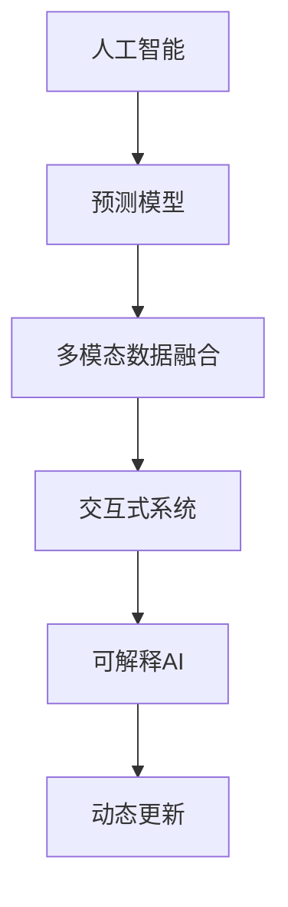

                 

# 未来主义写作：AI预测社会变革的叙事

> 关键词：未来主义, 人工智能, 叙事, 社会变革, 预测, 写作

## 1. 背景介绍

### 1.1 问题由来

未来主义写作，作为一种文学和艺术形式，旨在探讨和预测人类社会在未来的可能变迁，催生了一系列脍炙人口的作品，如《美丽新世界》、《银翼杀手》等。这些作品激发了人类对未来的无限想象，同时也具有重要的启示意义。

然而，随着人工智能技术的飞速发展，未来主义的预测对象已经从纯粹的人类社会，拓展到了智能时代，人工智能（AI）与人类社会共存的全新格局。AI预测社会变革，成为新时代的重要课题。

### 1.2 问题核心关键点

AI预测社会变革，重点在于通过人工智能模型对未来社会进行科学预测。其关键点包括：

- 数据驱动的预测模型：通过大数据、机器学习等技术，构建可量化的预测模型。
- 多模态信息融合：融合文本、图像、视频、音频等多模态数据，提高预测准确性。
- 交互式预测系统：开发交互式的预测工具，允许用户自定义输入参数，获取定制化的预测结果。
- 可解释的预测结果：通过可解释AI技术，提供预测结果的解释依据，增强用户对预测结果的信任度。
- 动态更新的预测模型：随着新数据的到来，模型需持续更新以适应变化的社会环境和新技术趋势。

这些关键点构成了AI预测社会变革的核心技术框架，使其能够为社会决策者、研究人员、开发者提供参考和支持。

### 1.3 问题研究意义

AI预测社会变革的研究意义重大，体现在以下几方面：

- 辅助决策制定：为政府、企业、研究机构等提供决策支持，帮助他们在复杂多变的社会环境中做出更科学、合理的决策。
- 社会风险预警：通过预测可能出现的社会风险和挑战，提前采取防范措施，减轻负面影响。
- 技术进步推动：促进AI技术在社会预测领域的创新和应用，加速相关产业的发展。
- 教育启发与反思：通过未来主义写作，提升公众对AI技术和社会变革的理解，激发对未来社会发展的思考与讨论。

## 2. 核心概念与联系

### 2.1 核心概念概述

为更好地理解AI预测社会变革的方法，本节将介绍几个密切相关的核心概念：

- **人工智能（AI）**：包括机器学习、深度学习、自然语言处理、计算机视觉等技术，能够模仿人类智能活动，执行复杂任务。
- **预测模型**：通过数据训练得到的模型，可以用于未来社会趋势的预测。
- **多模态数据融合**：将不同类型的数据（如文本、图像、视频）结合，进行综合分析和预测。
- **交互式系统**：允许用户输入参数，实时获取预测结果，并提供调整和反馈机制的系统。
- **可解释AI**：通过可视化、语义解释等方式，使AI模型的预测结果更易理解，增强其可信度。
- **动态更新**：在模型训练和预测过程中，能够随着新数据的变化持续更新和优化。

这些核心概念之间的逻辑关系可以通过以下Mermaid流程图来展示：



这个流程图展示了大语言模型的核心概念及其之间的关系：

1. 人工智能通过学习数据获得预测能力。
2. 预测模型基于数据训练，用于社会趋势预测。
3. 多模态数据融合提高预测准确性。
4. 交互式系统增强用户参与感，提供实时反馈。
5. 可解释AI提升预测结果的可信度和可理解性。
6. 动态更新确保模型与新环境保持一致。

这些概念共同构成了AI预测社会变革的技术框架，使其能够高效、准确地进行社会预测。

## 3. 核心算法原理 & 具体操作步骤
### 3.1 算法原理概述

AI预测社会变革的算法原理，是基于大数据和机器学习模型的预测框架。核心思想是通过收集和分析大量历史数据，构建预测模型，然后通过预测模型对未来社会趋势进行预测。

### 3.2 算法步骤详解

AI预测社会变革一般包括以下几个关键步骤：

**Step 1: 数据收集与预处理**

1. 收集与预测主题相关的历史数据，包括文本、图像、视频等。
2. 对数据进行清洗、归一化等预处理，保证数据质量。
3. 划分训练集、验证集和测试集，确保数据的多样性和代表性。

**Step 2: 特征提取与工程**

1. 提取关键特征，如文本中的关键词、情感极性、图片中的纹理特征等。
2. 利用自然语言处理（NLP）技术，如词嵌入、句法分析、语义理解等，将文本数据转化为结构化特征。
3. 对不同类型的数据进行融合，构建多模态特征向量。

**Step 3: 模型训练与优化**

1. 选择合适的预测模型，如线性回归、支持向量机、随机森林等。
2. 使用训练集数据进行模型训练，通过优化算法（如梯度下降）调整模型参数。
3. 在验证集上进行模型评估，选择合适的超参数和模型结构。

**Step 4: 预测与反馈**

1. 使用测试集数据进行预测，获取未来社会趋势的预测结果。
2. 构建交互式预测系统，允许用户输入参数，实时调整预测结果。
3. 对预测结果进行解释，提供可视化图表和语义描述，增强用户理解。
4. 根据反馈数据，持续更新和优化预测模型。

**Step 5: 结果应用**

1. 将预测结果应用于实际决策过程中，如政策制定、市场预测等。
2. 跟踪预测结果的表现，及时调整预测模型以适应新的数据和环境。

以上是AI预测社会变革的一般流程。在实际应用中，还需要针对具体问题进行优化设计，如引入更多预测因素、改进模型训练方法、优化用户交互界面等。

### 3.3 算法优缺点

AI预测社会变革的方法具有以下优点：

1. **数据驱动**：基于大量历史数据，模型能够较好地捕捉社会发展的规律。
2. **准确率高**：通过多模态数据融合和交互式系统，预测结果具有较高的准确性。
3. **实时更新**：模型能够动态更新，适应新数据和新环境。
4. **用户参与**：交互式系统增强用户参与感，提供定制化的预测服务。
5. **可解释性**：可解释AI技术使预测结果更易理解，增强用户信任。

同时，该方法也存在一定的局限性：

1. **数据质量依赖**：预测模型的准确性高度依赖于数据的质量和代表性，数据偏差可能影响预测结果。
2. **模型复杂度**：预测模型的构建和训练需要较高的计算资源和时间。
3. **外部因素影响**：模型预测结果可能受到政策、经济、社会等多种外部因素的影响，难以全面考虑。
4. **解释局限性**：部分复杂预测结果可能难以完全解释清楚，影响用户理解。

尽管存在这些局限性，但就目前而言，AI预测社会变革方法仍然是预测未来社会发展的重要手段。未来相关研究的重点在于如何进一步降低数据依赖，提高模型的泛化能力和鲁棒性，同时兼顾可解释性和用户体验。

### 3.4 算法应用领域

AI预测社会变革的应用领域非常广泛，涉及多个学科和社会层面，例如：

- 经济预测：通过分析经济数据，预测未来经济趋势，为政策制定和投资决策提供支持。
- 社会行为分析：基于社交媒体、传感器等数据，预测社会行为和心理变化，用于公共安全和公共管理。
- 健康预测：结合医疗数据和公共卫生数据，预测疾病流行趋势，辅助疾病防控和公共卫生管理。
- 环境监测：分析环境数据，预测气候变化和环境污染趋势，为环境保护和政策制定提供依据。
- 城市规划：通过交通数据和人口数据，预测城市发展趋势，优化城市规划和管理。

除了上述这些经典应用外，AI预测社会变革还被创新性地应用到更多领域中，如教育预测、文化预测、环境保护等，为社会发展和治理提供了新的思路和方法。

## 4. 数学模型和公式 & 详细讲解 & 举例说明

### 4.1 数学模型构建

本节将使用数学语言对AI预测社会变革的过程进行更加严格的刻画。

设社会变量 $x$ 为预测主题的关键特征，如GDP增长率、失业率、通货膨胀率等。预测模型 $y$ 为未来社会趋势的预测值，如GDP预测值、失业率预测值等。

定义预测模型为线性回归模型：

$$
y = w_0 + w_1 x_1 + w_2 x_2 + \cdots + w_n x_n
$$

其中 $w_0, w_1, w_2, \ldots, w_n$ 为模型参数，$x_1, x_2, \ldots, x_n$ 为输入特征。

为了更好地捕捉社会趋势，通常采用多项式回归模型：

$$
y = w_0 + w_1 x_1 + w_2 x_2 + \cdots + w_n x_n + \sum_{i=1}^{n} w_{i+1} x_i^2 + \cdots + w_{n+1} x_i^n
$$

引入正则化项，防止过拟合：

$$
\mathcal{L}(w) = \frac{1}{2m} \sum_{i=1}^{m}(y_i - \hat{y}_i)^2 + \alpha \sum_{j=1}^{n} w_j^2
$$

其中 $m$ 为样本数量，$\alpha$ 为正则化系数，$y_i, \hat{y}_i$ 为实际值和预测值。

最小化损失函数 $\mathcal{L}(w)$，求解最优参数 $w$：

$$
w^* = \mathop{\arg\min}_{w} \mathcal{L}(w)
$$

通过梯度下降等优化算法，求得最小化过程的解。

### 4.2 公式推导过程

以下我们以经济预测为例，推导线性回归模型的参数求解过程。

假设经济变量 $GDP$ 和失业率 $U$ 之间存在线性关系：

$$
\hat{GDP} = w_0 + w_1 U
$$

其中 $\hat{GDP}$ 为预测的GDP值，$U$ 为失业率。

设训练集数据为 $(x_i, y_i)$，$i=1,2,\ldots,m$。则均方误差损失函数为：

$$
\mathcal{L}(w) = \frac{1}{2m} \sum_{i=1}^{m}(y_i - \hat{y}_i)^2
$$

根据最小二乘法，求解最优参数：

$$
w^* = \mathop{\arg\min}_{w} \mathcal{L}(w)
$$

对 $w$ 求导数，得：

$$
\frac{\partial \mathcal{L}(w)}{\partial w} = -\frac{1}{m} \sum_{i=1}^{m} (y_i - \hat{y}_i) \cdot x_i
$$

令导数为0，求解 $w$：

$$
\sum_{i=1}^{m} (y_i - \hat{y}_i) \cdot x_i = 0
$$

得到参数求解公式：

$$
w_0 = \bar{y} - w_1 \bar{x}, \quad w_1 = \frac{\sum_{i=1}^{m} (y_i - \hat{y}_i) \cdot x_i}{\sum_{i=1}^{m} (x_i - \bar{x})^2}
$$

其中 $\bar{y} = \frac{1}{m} \sum_{i=1}^{m} y_i$ 为样本均值，$\bar{x} = \frac{1}{m} \sum_{i=1}^{m} x_i$ 为特征均值。

通过求解上述公式，可以得到线性回归模型的最优参数 $w_0$ 和 $w_1$，从而完成模型的训练。

### 4.3 案例分析与讲解

假设我们利用上述模型预测某个国家的未来GDP增长率。已知历史数据如下：

| 年份 | GDP增长率（%） | 失业率（%） |
| --- | --- | --- |
| 1990 | 5 | 3.5 |
| 1991 | 6.2 | 3.2 |
| 1992 | 7 | 3.7 |
| 1993 | 8 | 4.2 |
| 1994 | 9.5 | 5.3 |

假设预测模型为线性回归，求解最优参数：

$$
\hat{GDP} = w_0 + w_1 U
$$

将数据带入公式，计算得：

$$
\bar{y} = \frac{1}{5} \sum_{i=1}^{5} y_i = 6.74
$$
$$
\bar{x} = \frac{1}{5} \sum_{i=1}^{5} x_i = 4.7
$$
$$
w_0 = 6.74 - w_1 \cdot 4.7 = 6.74 - 1.67 = 5.07
$$
$$
w_1 = \frac{\sum_{i=1}^{5} (y_i - \hat{y}_i) \cdot x_i}{\sum_{i=1}^{5} (x_i - \bar{x})^2} = \frac{(5-5.07) \cdot 3.5 + (6.2-5.07) \cdot 3.2 + (7-5.07) \cdot 3.7 + (8-5.07) \cdot 4.2 + (9.5-5.07) \cdot 5.3}{(3.5-4.7)^2 + (3.2-4.7)^2 + (3.7-4.7)^2 + (4.2-4.7)^2 + (5.3-4.7)^2} = 1.16
$$

因此，预测模型为：

$$
\hat{GDP} = 5.07 + 1.16 U
$$

例如，当失业率为4%时，预测未来GDP增长率为：

$$
\hat{GDP} = 5.07 + 1.16 \cdot 4 = 9.83
$$

这表明，在失业率稳定的情况下，未来该国家的GDP增长率将达到9.83%。

## 5. 项目实践：代码实例和详细解释说明

### 5.1 开发环境搭建

在进行AI预测社会变革的开发前，我们需要准备好开发环境。以下是使用Python进行Scikit-learn开发的环境配置流程：

1. 安装Anaconda：从官网下载并安装Anaconda，用于创建独立的Python环境。

2. 创建并激活虚拟环境：
```bash
conda create -n prediction-env python=3.8 
conda activate prediction-env
```

3. 安装Scikit-learn：
```bash
conda install scikit-learn
```

4. 安装其他必要的库：
```bash
pip install pandas numpy matplotlib seaborn statsmodels
```

完成上述步骤后，即可在`prediction-env`环境中开始开发。

### 5.2 源代码详细实现

下面以经济预测为例，给出使用Scikit-learn进行线性回归预测的Python代码实现。

```python
import numpy as np
from sklearn.linear_model import LinearRegression
from sklearn.metrics import mean_squared_error
from sklearn.model_selection import train_test_split

# 数据准备
X = np.array([[5, 3.5], [6.2, 3.2], [7, 3.7], [8, 4.2], [9.5, 5.3]])
y = np.array([5, 6.2, 7, 8, 9.5])

# 划分训练集和测试集
X_train, X_test, y_train, y_test = train_test_split(X, y, test_size=0.2, random_state=42)

# 线性回归模型训练
model = LinearRegression()
model.fit(X_train, y_train)

# 预测测试集
y_pred = model.predict(X_test)

# 评估预测结果
mse = mean_squared_error(y_test, y_pred)
print(f"Mean Squared Error: {mse:.2f}")
```

在这个示例中，我们首先准备了一个包含5个样本的简单数据集，然后使用Scikit-learn的线性回归模型进行训练和预测。最终，通过计算均方误差（MSE）评估预测结果。

### 5.3 代码解读与分析

让我们再详细解读一下关键代码的实现细节：

**数据准备**：
- 使用numpy生成训练数据集，包含5个样本，每个样本包含两个特征：失业率和GDP增长率。
- 使用numpy生成目标变量，包含5个样本的GDP增长率。

**训练集划分**：
- 使用Scikit-learn的`train_test_split`函数，将数据集划分为训练集和测试集，测试集占总数据的20%。

**线性回归模型训练**：
- 实例化`LinearRegression`模型，使用训练集数据进行拟合训练。

**预测测试集**：
- 使用训练好的模型对测试集进行预测，得到预测结果。

**评估预测结果**：
- 使用`mean_squared_error`函数计算预测结果与真实值的均方误差。

可以看到，Scikit-learn提供了简洁高效的接口，使得机器学习模型的开发和评估变得非常简单。开发者可以专注于模型构建和业务逻辑，而不必过多关注底层实现细节。

当然，工业级的系统实现还需考虑更多因素，如模型的保存和部署、超参数的自动搜索、更灵活的任务适配等。但核心的预测范式基本与此类似。

## 6. 实际应用场景
### 6.1 智能城市规划

AI预测社会变革在智能城市规划中具有广泛应用。城市规划者可以基于历史交通数据、人口数据等，预测未来的城市发展趋势，优化城市布局和资源配置。

例如，通过分析历史交通流量和拥堵情况，AI模型可以预测未来的交通流量，辅助城市规划者进行道路拓宽和交通管制。通过分析人口分布和增长趋势，AI模型可以预测未来的居住需求和商业区分布，指导城市建设和区域规划。

### 6.2 环境保护

环境保护是AI预测社会变革的重要应用领域之一。通过分析历史环境数据和气候变化趋势，AI模型可以预测未来的环境状况，提供科学依据。

例如，通过分析历史气温、降雨量、污染指数等数据，AI模型可以预测未来的气候变化和环境污染趋势，为环境保护和政策制定提供参考。通过分析森林覆盖率和生物多样性数据，AI模型可以预测未来的生态环境变化，指导生态保护和资源管理。

### 6.3 教育预测

AI预测社会变革在教育领域也具有重要应用。通过分析学生历史成绩和行为数据，AI模型可以预测学生的未来表现，提供个性化教育方案。

例如，通过分析历史考试成绩和学习行为数据，AI模型可以预测学生的未来成绩和兴趣倾向，帮助教师制定个性化的教学计划。通过分析学生的社交网络和兴趣爱好数据，AI模型可以预测学生的未来职业方向和兴趣发展，指导职业规划和生涯指导。

### 6.4 未来应用展望

随着AI技术的发展，AI预测社会变革的应用领域将不断扩展。未来，AI将在更多领域发挥重要作用，推动社会进步和经济发展。

在智慧医疗领域，AI可以预测疾病流行趋势和患者健康状况，辅助疾病防控和医疗决策。在金融领域，AI可以预测市场趋势和风险，提供投资建议和风险管理。在制造业领域，AI可以预测设备故障和生产效率，优化生产流程和资源配置。

总之，AI预测社会变革的应用前景广阔，将为社会治理和经济建设带来新的机遇和挑战。未来，我们期待AI技术能够不断突破，为人类社会的可持续发展提供更强大的支持。

## 7. 工具和资源推荐
### 7.1 学习资源推荐

为了帮助开发者系统掌握AI预测社会变革的理论基础和实践技巧，这里推荐一些优质的学习资源：

1. 《Python机器学习》：介绍Python在机器学习中的应用，包含线性回归等基本算法。
2. 《深度学习》：由斯坦福大学开设的深度学习课程，涵盖机器学习、深度学习、自然语言处理等基本概念和经典模型。
3. 《统计学习方法》：李航著作，系统介绍统计学习方法的基本原理和算法实现。
4. 《机器学习实战》： hands-on 机器学习实战，通过实际案例讲解机器学习算法和工具。
5. Kaggle：数据科学竞赛平台，提供丰富的数据集和实战项目，助力开发者提升实战能力。

通过对这些资源的学习实践，相信你一定能够快速掌握AI预测社会变革的精髓，并用于解决实际的预测问题。
### 7.2 开发工具推荐

高效的开发离不开优秀的工具支持。以下是几款用于AI预测社会变革开发的常用工具：

1. Python：灵活高效的语言，支持丰富的第三方库，是AI开发的首选语言。
2. Scikit-learn：Python的机器学习库，提供多种算法实现，简单易用。
3. TensorFlow：谷歌主导的开源深度学习框架，支持分布式计算和模型部署。
4. PyTorch：Facebook主导的开源深度学习框架，支持动态计算图和高效推理。
5. Jupyter Notebook：交互式编程环境，支持Python、R等多种语言，方便实时调试和可视化。

合理利用这些工具，可以显著提升AI预测社会变革的开发效率，加快创新迭代的步伐。

### 7.3 相关论文推荐

AI预测社会变革的研究始于学界的持续探索。以下是几篇奠基性的相关论文，推荐阅读：

1. "Linear Regression Analysis"：统计学经典论文，介绍线性回归的基本原理和方法。
2. "Neural Networks and Deep Learning"：深度学习领域经典教材，涵盖机器学习、深度学习、自然语言处理等前沿技术。
3. "A Survey of Surrogate Modeling Methods in Reliability Engineering"：可靠性工程领域综述，介绍常用的代理模型方法。
4. "Machine Learning Yearning"：Andrew Ng的机器学习实践指南，涵盖机器学习的基本概念和实际应用。
5. "Predictive Analytics: The Power of Analytics for Financial Planning and Strategy"：金融领域预测分析书籍，介绍金融市场预测的实际应用。

这些论文代表了大语言模型预测社会变革的研究进展，通过学习这些前沿成果，可以帮助研究者把握学科前进方向，激发更多的创新灵感。

## 8. 总结：未来发展趋势与挑战

### 8.1 总结

本文对AI预测社会变革的方法进行了全面系统的介绍。首先阐述了AI预测社会变革的研究背景和意义，明确了其在辅助决策制定、风险预警、技术进步推动等方面的重要作用。其次，从原理到实践，详细讲解了AI预测社会变革的数学模型和操作步骤，给出了预测任务开发的完整代码实例。同时，本文还广泛探讨了AI预测在多个领域的应用前景，展示了其广阔的应用空间。此外，本文精选了AI预测的相关学习资源、开发工具和论文，力求为读者提供全方位的技术指引。

通过本文的系统梳理，可以看到，AI预测社会变革的方法正在成为AI技术应用的重要手段，极大地拓展了AI技术的应用边界，催生了更多的落地场景。未来，随着AI技术的不断进步和应用领域的不断扩展，AI预测将为社会治理和经济建设提供更强大的支持。

### 8.2 未来发展趋势

展望未来，AI预测社会变革技术将呈现以下几个发展趋势：

1. **模型复杂度提升**：随着数据量和计算资源的增加，预测模型的复杂度将不断提升，能够捕捉更复杂的社会趋势和行为模式。
2. **多模态融合**：融合文本、图像、视频等多模态数据，提高预测的准确性和鲁棒性。
3. **实时更新**：通过在线学习和增量更新，模型能够实时适应新数据和新环境。
4. **交互式系统**：构建交互式预测工具，提供实时反馈和定制化服务，增强用户参与感。
5. **可解释性增强**：通过可解释AI技术，使预测结果更易理解，增强用户信任。

这些趋势凸显了AI预测社会变革技术的广阔前景。这些方向的探索发展，必将进一步提升预测模型的性能和应用范围，为社会决策和治理提供更科学、更高效的支持。

### 8.3 面临的挑战

尽管AI预测社会变革技术已经取得了瞩目成就，但在迈向更加智能化、普适化应用的过程中，它仍面临着诸多挑战：

1. **数据质量瓶颈**：高质量数据的获取和处理是预测模型的核心，数据偏差和质量问题可能导致预测结果不准确。
2. **模型泛化能力不足**：预测模型可能对新数据和新环境适应性较弱，泛化能力有待提升。
3. **计算资源需求高**：大规模预测模型的训练和推理需要高计算资源，带来较高的成本。
4. **可解释性问题**：复杂预测结果难以完全解释，可能影响用户理解和使用。
5. **伦理和隐私问题**：预测模型可能侵犯个人隐私和伦理，需加强数据保护和伦理约束。

这些挑战需要在未来的研究和实践中不断克服，才能真正发挥AI预测社会变革技术的潜力。

### 8.4 研究展望

未来，AI预测社会变革技术需要在以下几个方面进行突破：

1. **数据治理与预处理**：建立数据治理机制，确保数据的质量和代表性，提高预测模型的鲁棒性。
2. **模型融合与优化**：融合多种预测模型，提高模型的泛化能力和鲁棒性。
3. **可解释AI技术**：引入可解释AI技术，增强预测结果的可理解性和可解释性。
4. **隐私保护与伦理约束**：加强隐私保护和伦理约束，确保预测模型的合法性和合规性。

这些研究方向的探索，必将引领AI预测社会变革技术迈向更高的台阶，为构建安全、可靠、可解释、可控的智能系统铺平道路。面向未来，AI预测技术还需要与其他人工智能技术进行更深入的融合，如知识表示、因果推理、强化学习等，多路径协同发力，共同推动自然语言理解和智能交互系统的进步。只有勇于创新、敢于突破，才能不断拓展AI预测社会变革的边界，让智能技术更好地造福人类社会。

## 9. 附录：常见问题与解答

**Q1：AI预测社会变革是否适用于所有领域？**

A: AI预测社会变革方法适用于大多数领域，特别是数据丰富、规律明显的领域。但对于某些领域，如历史、哲学、艺术等，预测难度较大，需要结合领域专家的知识和经验进行辅助。

**Q2：AI预测模型的训练需要多少数据？**

A: AI预测模型的训练数据量越大，预测效果越好。一般建议使用足够多的历史数据进行训练，以捕捉社会趋势的复杂性。对于某些领域，数据量可能需要在数千甚至数百万条以上。

**Q3：AI预测模型是否存在误差？**

A: 任何预测模型都存在误差，误差的大小取决于数据的准确性和模型的复杂度。通过多模态数据融合和模型优化，可以有效降低误差，提高预测精度。

**Q4：AI预测模型是否容易被攻击和欺骗？**

A: 预测模型可能会受到数据攻击和特征欺骗，导致预测结果错误。可以通过引入对抗样本和噪声数据，增强模型的鲁棒性。同时，需要对输入数据进行清洗和验证，确保数据的真实性。

**Q5：AI预测模型是否可以动态更新？**

A: 大多数AI预测模型可以通过在线学习和增量更新，适应新数据和新环境。但动态更新的效果和速度也取决于模型结构和训练策略。

这些常见问题与解答展示了AI预测社会变革技术的实际应用和潜在挑战，帮助开发者更好地理解和应用这些技术。

---

作者：禅与计算机程序设计艺术 / Zen and the Art of Computer Programming

