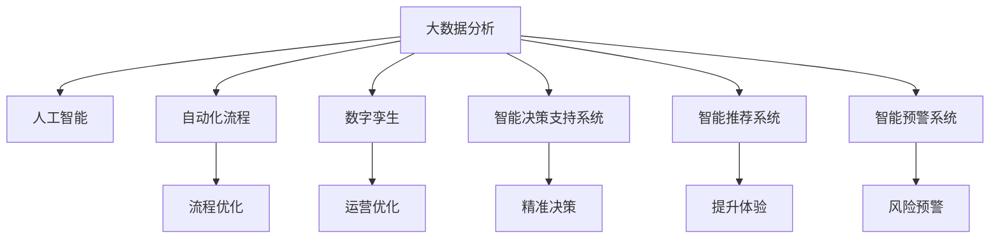

                 

# 未来企业的智能化运营模式

> 关键词：智能化转型, 企业运营管理, 大数据分析, 人工智能, 自动化流程, 智能决策, 数字孪生

## 1. 背景介绍

### 1.1 问题由来

近年来，随着科技的快速发展和数字化转型的加速推进，各行各业的企业面临了前所未有的机遇与挑战。随着大数据、云计算、人工智能等技术的日渐成熟和普及，企业运营管理方式也正在经历一场深刻的变革。智能化运营模式的出现，使企业能够更高效地利用数据，优化资源配置，提升运营效率，创造更多商业价值。然而，智能化运营模式并非一蹴而就，需要企业在战略规划、技术应用、组织变革等各个层面进行系统性思考和设计。

### 1.2 问题核心关键点

智能化运营模式的核心关键点在于如何通过数字化技术和智能化手段，将数据驱动决策贯穿于企业运营管理的各个环节，实现资源的最优配置和运营效率的最大化。具体来说，包括以下几个方面：

1. **数据驱动决策**：通过大数据分析和机器学习等技术，从海量数据中提取有价值的信息，辅助高层决策。
2. **自动化流程优化**：引入机器人和人工智能自动化技术，提升生产和服务流程的效率和精准度。
3. **智能决策支持**：利用智能分析工具和预测模型，为管理层提供更科学的决策依据。
4. **客户体验提升**：通过智能推荐系统、聊天机器人等技术，提升客户满意度和服务质量。
5. **风险预警与控制**：建立智能预警系统，及时发现和应对运营风险。

### 1.3 问题研究意义

智能化运营模式的研究和应用，对于提升企业运营效率、降低成本、增强市场竞争力具有重要意义。具体来说，包括：

1. **提升运营效率**：通过智能化的流程优化和资源配置，企业能够大幅提升运营效率，缩短生产和交付周期。
2. **降低运营成本**：自动化和智能化技术的应用，可以有效降低人力和物力成本，提升企业的整体盈利能力。
3. **增强市场竞争力**：通过智能化手段提升客户体验和服务质量，增强企业的市场竞争力，吸引更多客户。
4. **实现精准决策**：大数据和机器学习技术的应用，能够为企业管理层提供科学的决策依据，减少决策失误。

## 2. 核心概念与联系

### 2.1 核心概念概述

为更好地理解未来企业智能化运营模式，本节将介绍几个密切相关的核心概念：

1. **大数据分析**：通过数据收集、处理和分析，发现数据中的隐藏模式和规律，为决策提供依据。
2. **人工智能**：利用机器学习、深度学习等技术，使机器能够具备智能推理和决策能力。
3. **自动化流程**：通过引入机器人流程自动化(RPA)和智能系统，实现生产和服务流程的自动化。
4. **数字孪生**：构建企业数字镜像，实现对现实世界的模拟和预测，支持智能决策。
5. **智能决策支持系统**：利用智能算法和分析工具，辅助管理层做出更科学的决策。
6. **智能推荐系统**：通过个性化推荐算法，提升客户体验和服务质量。
7. **智能预警系统**：利用预测模型和数据分析，实时监测和预警运营风险。

这些核心概念之间的逻辑关系可以通过以下Mermaid流程图来展示：



这个流程图展示了大数据分析、人工智能、自动化流程、数字孪生等技术如何共同支撑企业的智能化运营模式：

1. 大数据分析提供了基础数据支持，为人工智能模型训练和自动化流程设计提供数据源。
2. 人工智能通过学习和推理，为决策支持、流程自动化和风险预警提供智能解决方案。
3. 自动化流程通过机器人流程自动化和智能系统，提升流程效率和精准度。
4. 数字孪生通过虚拟现实和仿真技术，提供对现实世界的模拟和预测，支持智能决策。
5. 智能决策支持系统利用数据分析和智能算法，辅助管理层做出更科学的决策。
6. 智能推荐系统通过个性化算法，提升客户体验和服务质量。
7. 智能预警系统通过预测模型和数据分析，实时监测和预警运营风险。

## 3. 核心算法原理 & 具体操作步骤
### 3.1 算法原理概述

未来企业的智能化运营模式，主要基于以下几个核心算法原理：

1. **大数据分析**：通过统计学、机器学习等方法，从大量数据中提取有价值的信息，为决策提供依据。
2. **人工智能**：利用深度学习、强化学习等技术，使机器具备智能推理和决策能力。
3. **自动化流程**：通过机器人流程自动化(RPA)和智能系统，实现生产和服务流程的自动化。
4. **数字孪生**：构建企业数字镜像，利用仿真和预测技术，提升决策的准确性和效率。
5. **智能决策支持**：结合数据分析和智能算法，为管理层提供科学决策的依据。
6. **智能推荐系统**：利用协同过滤、深度学习等技术，提升客户体验和服务质量。
7. **智能预警系统**：通过异常检测和预测模型，实时监测和预警运营风险。

### 3.2 算法步骤详解

未来企业智能化运营模式的核心算法步骤如下：

**Step 1: 数据收集与预处理**
- 通过传感器、日志、客户反馈等渠道，收集企业运营相关的海量数据。
- 对数据进行清洗、去重、归一化等预处理操作，去除噪声和异常值。

**Step 2: 数据分析与建模**
- 利用大数据分析技术，如统计分析、数据挖掘、机器学习等，发现数据中的隐藏模式和规律。
- 构建机器学习模型，如回归模型、分类模型、聚类模型等，用于预测和决策。

**Step 3: 自动化流程设计**
- 引入机器人流程自动化(RPA)技术，设计自动化流程，优化生产和服务流程。
- 利用智能系统，如智能传感器、自动化控制系统等，提升流程的效率和精准度。

**Step 4: 数字孪生构建**
- 利用虚拟现实和仿真技术，构建企业的数字孪生模型，实现对现实世界的模拟和预测。
- 在数字孪生模型中，进行仿真实验和优化，提升决策的科学性和效率。

**Step 5: 智能决策支持**
- 构建智能决策支持系统，结合数据分析和智能算法，辅助管理层做出科学决策。
- 利用预测模型和优化算法，进行资源配置和流程优化，提升运营效率。

**Step 6: 智能推荐系统**
- 利用协同过滤、深度学习等技术，设计个性化推荐算法，提升客户体验和服务质量。
- 通过数据分析和用户行为建模，实时调整推荐策略，提供个性化服务。

**Step 7: 智能预警系统**
- 利用异常检测和预测模型，实时监测和预警运营风险。
- 根据预警信号，及时调整运营策略，降低风险损失。

### 3.3 算法优缺点

智能化运营模式的主要优点包括：

1. **提升运营效率**：通过自动化和智能化技术，大幅提升生产和服务流程的效率。
2. **降低运营成本**：自动化技术可以减少人力和物力成本，提升企业的整体盈利能力。
3. **增强市场竞争力**：通过提升客户体验和服务质量，增强企业的市场竞争力。
4. **实现精准决策**：大数据和机器学习技术为管理层提供科学的决策依据，减少决策失误。
5. **风险预警与控制**：智能预警系统实时监测和预警运营风险，降低潜在损失。

然而，智能化运营模式也存在一些局限性：

1. **技术复杂度高**：实现智能化运营模式需要企业具备较高的技术能力和资源投入。
2. **数据质量要求高**：智能化运营模式对数据质量有较高要求，数据缺失、噪声等问题会影响结果。
3. **系统集成难度大**：各个系统的集成和协同需要复杂的设计和实施，存在一定难度。
4. **安全性和隐私问题**：智能化运营模式涉及大量敏感数据，需要严密的隐私保护和安全控制。
5. **人员适应度挑战**：需要员工具备一定的技术素养，适应新系统的使用。

### 3.4 算法应用领域

智能化运营模式的应用领域广泛，包括但不限于：

1. **制造业**：通过自动化生产线和智能监控系统，提升生产效率和质量。
2. **零售业**：利用智能推荐系统和库存管理系统，提升客户体验和运营效率。
3. **金融业**：通过大数据分析和智能预警系统，实时监测和预警金融风险。
4. **医疗健康**：利用智能推荐系统和智能诊疗系统，提升医疗服务质量和效率。
5. **物流仓储**：通过智能仓储系统和物流监控系统，优化仓储管理和配送效率。
6. **能源行业**：通过智能监测和预测系统，提升能源效率和安全性。
7. **农业**：利用智能传感器和数据分析，优化农业生产和管理。

## 4. 数学模型和公式 & 详细讲解 & 举例说明

### 4.1 数学模型构建

为了更好地理解智能化运营模式的数学原理，本节将介绍几个关键数学模型：

1. **回归模型**：用于预测连续数值，如销售预测、能源消耗预测等。
2. **分类模型**：用于分类问题，如客户流失预测、风险评估等。
3. **聚类模型**：用于发现数据中的相似群组，如客户细分、商品分类等。
4. **协同过滤算法**：用于个性化推荐，如商品推荐、内容推荐等。
5. **异常检测算法**：用于识别异常行为，如设备故障预警、财务异常预警等。

### 4.2 公式推导过程

以下我们以回归模型为例，推导最小二乘法的公式及其推导过程。

假设有一组数据集 $(x_1, y_1), (x_2, y_2), ..., (x_n, y_n)$，其中 $x_i$ 为自变量，$y_i$ 为因变量，目标是找到一个线性模型 $y = \theta_0 + \theta_1 x$ 来拟合这些数据。最小二乘法的目标是最小化预测值与实际值之间的平方误差，即：

$$
\min_{\theta_0, \theta_1} \sum_{i=1}^n (y_i - (\theta_0 + \theta_1 x_i))^2
$$

通过求偏导数，得到：

$$
\frac{\partial}{\partial \theta_0} \sum_{i=1}^n (y_i - (\theta_0 + \theta_1 x_i))^2 = -2 \sum_{i=1}^n (y_i - (\theta_0 + \theta_1 x_i))
$$

$$
\frac{\partial}{\partial \theta_1} \sum_{i=1}^n (y_i - (\theta_0 + \theta_1 x_i))^2 = -2 \sum_{i=1}^n x_i (y_i - (\theta_0 + \theta_1 x_i))
$$

令上述两个偏导数等于0，解得：

$$
\theta_0 = \frac{1}{n} \sum_{i=1}^n y_i - \theta_1 \frac{1}{n} \sum_{i=1}^n x_i
$$

$$
\theta_1 = \frac{1}{n} \sum_{i=1}^n x_i (y_i - \bar{y}) / \sum_{i=1}^n x_i^2 - \theta_0
$$

其中，$\bar{y} = \frac{1}{n} \sum_{i=1}^n y_i$ 为 $y$ 的均值，$\bar{x} = \frac{1}{n} \sum_{i=1}^n x_i$ 为 $x$ 的均值。

通过最小二乘法，我们可以得到最优的线性模型参数 $\theta_0$ 和 $\theta_1$，从而进行数据预测和决策支持。

### 4.3 案例分析与讲解

下面我们以智能推荐系统为例，展示其数学模型和公式的应用。

假设有一组用户 $u_1, u_2, ..., u_n$，每个用户有若干条行为记录 $i_1, i_2, ..., i_m$，每条记录的评分 $r_{ij}$ 为1到5之间的整数。目标是为每个用户 $u_i$ 推荐评分最高的一条记录 $i^*$。

设用户的隐含特征向量为 $\mathbf{h}_i = (h_{i1}, h_{i2}, ..., h_{in})$，记录的隐含特征向量为 $\mathbf{h}_j = (h_{j1}, h_{j2}, ..., h_{jn})$，用户的隐含特征 $\mathbf{h}_i$ 与记录的隐含特征 $\mathbf{h}_j$ 的相似度为 $\cos(\mathbf{h}_i, \mathbf{h}_j)$。

则每个用户 $u_i$ 对记录 $i$ 的评分预测 $p_{ij}$ 为：

$$
p_{ij} = \mathbf{h}_i^T \mathbf{h}_j
$$

通过计算每个记录 $i$ 与用户 $u_i$ 的相似度，并取最大值，得到用户 $u_i$ 推荐的记录 $i^*$：

$$
i^* = \arg\max_{i=1}^m \max_{j=1}^n p_{ij}
$$

通过协同过滤算法，智能推荐系统可以基于用户的历史行为数据，实现个性化推荐，提升客户体验和服务质量。

## 5. 项目实践：代码实例和详细解释说明
### 5.1 开发环境搭建

在进行智能化运营模式实践前，我们需要准备好开发环境。以下是使用Python进行PyTorch开发的环境配置流程：

1. 安装Anaconda：从官网下载并安装Anaconda，用于创建独立的Python环境。

2. 创建并激活虚拟环境：
```bash
conda create -n pytorch-env python=3.8 
conda activate pytorch-env
```

3. 安装PyTorch：根据CUDA版本，从官网获取对应的安装命令。例如：
```bash
conda install pytorch torchvision torchaudio cudatoolkit=11.1 -c pytorch -c conda-forge
```

4. 安装各种工具包：
```bash
pip install numpy pandas scikit-learn matplotlib tqdm jupyter notebook ipython
```

完成上述步骤后，即可在`pytorch-env`环境中开始项目实践。

### 5.2 源代码详细实现

下面我们以智能推荐系统为例，给出使用PyTorch进行协同过滤算法实现的PyTorch代码实现。

首先，定义协同过滤算法的损失函数：

```python
import torch
import torch.nn as nn
import torch.nn.functional as F

class MLP(nn.Module):
    def __init__(self, input_size, hidden_size, output_size):
        super(MLP, self).__init__()
        self.fc1 = nn.Linear(input_size, hidden_size)
        self.fc2 = nn.Linear(hidden_size, output_size)
        
    def forward(self, x):
        x = F.relu(self.fc1(x))
        x = self.fc2(x)
        return x
    
class Loss(nn.Module):
    def __init__(self):
        super(Loss, self).__init__()
        
    def forward(self, y_pred, y_true):
        return nn.MSELoss()(y_pred, y_true)
```

然后，定义协同过滤算法的训练函数：

```python
from torch.utils.data import Dataset
from torch.utils.data import DataLoader
from tqdm import tqdm

class MovieDataset(Dataset):
    def __init__(self, data, num_users, num_movies):
        self.data = data
        self.num_users = num_users
        self.num_movies = num_movies
        
    def __len__(self):
        return len(self.data)
    
    def __getitem__(self, idx):
        user_id = self.data[idx][0]
        movie_id = self.data[idx][1]
        rating = self.data[idx][2]
        return user_id, movie_id, rating
    
class CollaborativeFiltering(nn.Module):
    def __init__(self, input_size, hidden_size, output_size):
        super(CollaborativeFiltering, self).__init__()
        self.user_net = MLP(input_size, hidden_size, hidden_size)
        self.movie_net = MLP(hidden_size, hidden_size, output_size)
        self.pred_net = MLP(hidden_size + output_size, hidden_size, output_size)
        
    def forward(self, user, movie):
        user_features = self.user_net(user)
        movie_features = self.movie_net(movie)
        combined_features = torch.cat([user_features, movie_features], dim=1)
        prediction = self.pred_net(combined_features)
        return prediction
    
def train_collaborative_filtering(model, train_dataset, num_epochs, batch_size, learning_rate):
    dataloader = DataLoader(train_dataset, batch_size=batch_size, shuffle=True)
    optimizer = torch.optim.Adam(model.parameters(), lr=learning_rate)
    criterion = Loss()
    for epoch in range(num_epochs):
        for user, movie, rating in dataloader:
            user, movie, rating = user.to(device), movie.to(device), rating.to(device)
            optimizer.zero_grad()
            prediction = model(user, movie)
            loss = criterion(prediction, rating)
            loss.backward()
            optimizer.step()
            if (epoch + 1) % 100 == 0:
                print(f'Epoch {epoch + 1}, loss: {loss.item():.4f}')
```

最后，启动训练流程并在测试集上评估：

```python
from torch.utils.data import DataLoader
from tqdm import tqdm

train_dataset = MovieDataset(train_data, num_users, num_movies)
test_dataset = MovieDataset(test_data, num_users, num_movies)
device = torch.device('cuda') if torch.cuda.is_available() else torch.device('cpu')

num_epochs = 10
batch_size = 64
learning_rate = 0.001

model = CollaborativeFiltering(input_size, hidden_size, output_size)
model.to(device)

train_collaborative_filtering(model, train_dataset, num_epochs, batch_size, learning_rate)

test_loss = train_collaborative_filtering(model, test_dataset, num_epochs, batch_size, learning_rate)
print(f'Test loss: {test_loss:.4f}')
```

以上就是使用PyTorch对协同过滤算法进行智能推荐系统开发的完整代码实现。可以看到，通过PyTorch的深度学习框架，协同过滤算法的实现变得简洁高效。

### 5.3 代码解读与分析

让我们再详细解读一下关键代码的实现细节：

**MLP类**：
- 定义了一个简单的多层感知器模型，用于进行隐含特征的预测。

**Loss类**：
- 定义了一个简单的均方误差损失函数，用于评估预测结果与实际结果之间的差距。

**CollaborativeFiltering类**：
- 定义了一个协同过滤模型，包括用户网络和电影网络，用于分别预测用户和电影的隐含特征。
- 定义了一个预测网络，将用户和电影特征进行组合，预测用户对电影的评分。

**train_collaborative_filtering函数**：
- 定义了模型的训练函数，包括模型初始化、损失函数定义、优化器选择和训练循环。

**train_dataset类**：
- 定义了一个数据集类，用于封装用户、电影和评分的样本数据。

可以看到，通过合理的代码结构和函数设计，智能化运营模式的相关算法实现变得相对简单和模块化，便于开发者进行二次开发和扩展。

当然，实际系统的开发还需要考虑更多因素，如模型的保存和部署、超参数的自动搜索、更灵活的任务适配层等。但核心的算法思想和实现流程，与本文介绍的相同。

## 6. 实际应用场景
### 6.1 智能客服系统

智能客服系统是智能化运营模式的重要应用场景之一。通过自然语言处理和机器学习技术，智能客服系统能够理解客户语义，提供准确和个性化的答复，大幅提升客户满意度和服务质量。

在技术实现上，可以收集企业内部的历史客服对话记录，将问题和最佳答复构建成监督数据，在此基础上对预训练语言模型进行微调。微调后的对话模型能够自动理解用户意图，匹配最合适的答案模板进行回复。对于客户提出的新问题，还可以接入检索系统实时搜索相关内容，动态组织生成回答。如此构建的智能客服系统，能大幅提升客户咨询体验和问题解决效率。

### 6.2 金融舆情监测

金融舆情监测是智能化运营模式在金融领域的重要应用。通过大数据分析和自然语言处理技术，金融舆情监测系统能够实时监测网络舆情，及时发现和应对负面信息传播，规避金融风险。

具体而言，可以收集金融领域相关的新闻、报道、评论等文本数据，并对其进行情感标注。利用情感分析技术，实时监测舆情变化趋势，一旦发现负面信息激增等异常情况，系统便会自动预警，帮助金融机构快速应对潜在风险。

### 6.3 个性化推荐系统

个性化推荐系统是智能化运营模式在电商领域的重要应用。通过协同过滤、深度学习等技术，个性化推荐系统能够根据用户的历史行为数据，实时推荐相关商品，提升客户体验和购买转化率。

在技术实现上，可以利用用户的历史点击、浏览、购买等数据，构建协同过滤模型和深度学习模型，实时预测用户对商品的兴趣度，进行个性化推荐。同时，还可以通过A/B测试等方式，不断优化推荐策略，提升推荐效果。

### 6.4 未来应用展望

随着智能化运营模式的发展，未来在更多领域将有广泛应用，为各行各业带来新的变革：

1. **智慧医疗**：通过智能化运营模式，智慧医疗系统能够实现对患者病历、病情的智能分析和诊断，提升诊疗效率和准确性。
2. **智能制造**：通过物联网和智能化运营模式，智能制造系统能够实现对生产过程的实时监控和优化，提高生产效率和质量。
3. **智能交通**：通过智能化运营模式，智能交通系统能够实现对交通流量的智能预测和调度，提高交通效率和安全性。
4. **智能教育**：通过智能化运营模式，智能教育系统能够实现对学生学习行为的智能分析和指导，提升教育质量和效果。
5. **智能城市**：通过智能化运营模式，智能城市系统能够实现对城市管理的全面监测和优化，提高城市管理效率和居民生活质量。

以上应用场景只是冰山一角，未来随着技术的发展和应用的深化，智能化运营模式将渗透到更多领域，带来更加深刻和广泛的影响。

## 7. 工具和资源推荐
### 7.1 学习资源推荐

为了帮助开发者系统掌握智能化运营模式的技术基础和实践技巧，这里推荐一些优质的学习资源：

1. 《深度学习》书籍：Ian Goodfellow等著，全面介绍了深度学习的基本概念和算法。
2. 《人工智能导论》课程：斯坦福大学开设的AI课程，涵盖了机器学习、深度学习、强化学习等多个主题。
3. 《TensorFlow实战Google深度学习》书籍：Wan、Carlo等著，实战性较强的TensorFlow教程。
4. 《Python深度学习》书籍：Francois Chollet著，详细介绍了TensorFlow和Keras的使用。
5. 《机器学习实战》课程：Coursera开设的机器学习课程，结合实际项目，讲解机器学习算法和应用。

通过对这些资源的学习实践，相信你一定能够快速掌握智能化运营模式的核心技术，并用于解决实际的运营问题。
###  7.2 开发工具推荐

高效的开发离不开优秀的工具支持。以下是几款用于智能化运营模式开发的常用工具：

1. TensorFlow：由Google主导开发的开源深度学习框架，生产部署方便，适合大规模工程应用。
2. PyTorch：基于Python的开源深度学习框架，灵活的计算图设计，适合快速迭代研究。
3. Jupyter Notebook：交互式编程环境，支持Python、R等多种语言，方便编写和测试代码。
4. Scikit-learn：Python机器学习库，提供了多种常用的机器学习算法和工具。
5. RapidMiner：数据科学和机器学习平台，支持数据预处理、模型训练和应用部署。

合理利用这些工具，可以显著提升智能化运营模式开发的效率，加快创新迭代的步伐。

### 7.3 相关论文推荐

智能化运营模式的发展源于学界的持续研究。以下是几篇奠基性的相关论文，推荐阅读：

1. D. Kaggle等《智能推荐系统》：详细介绍了协同过滤、基于内容的推荐等算法。
2. Y. Bengio等《深度学习》：全面介绍了深度学习的原理和应用，包括在自然语言处理、计算机视觉等领域的最新进展。
3. R. S. Sutton《强化学习》：介绍了强化学习的理论基础和应用，为智能决策提供了重要参考。
4. S. Hochreiter等《长短期记忆网络》：提出了长短期记忆网络(LSTM)，在自然语言处理中取得了显著效果。
5. Y. LeCun等《深度学习》：介绍了深度学习的原理和应用，为智能推荐系统提供了理论支持。

这些论文代表了大数据、深度学习、机器学习等技术的发展脉络。通过学习这些前沿成果，可以帮助研究者把握学科前进方向，激发更多的创新灵感。

## 8. 总结：未来发展趋势与挑战
### 8.1 总结

本文对未来企业的智能化运营模式进行了全面系统的介绍。首先阐述了智能化运营模式的研究背景和意义，明确了数据驱动决策、自动化流程优化、智能决策支持等关键概念及其之间的联系。其次，从原理到实践，详细讲解了智能化运营模式的核心算法步骤，给出了智能推荐系统等具体项目的代码实现。同时，本文还探讨了智能化运营模式在智能客服、金融舆情监测、个性化推荐等多个行业领域的应用前景，展示了其广阔的应用潜力。此外，本文精选了智能化运营模式的学习资源和开发工具，力求为开发者提供全方位的技术指引。

通过本文的系统梳理，可以看到，智能化运营模式通过大数据分析、人工智能、自动化流程等技术的融合，能够显著提升企业运营效率，降低运营成本，增强市场竞争力。未来，伴随技术的不断发展和应用场景的不断拓展，智能化运营模式必将成为企业发展的重要方向，推动企业实现数字化、智能化转型升级。

### 8.2 未来发展趋势

展望未来，智能化运营模式将呈现以下几个发展趋势：

1. **数据驱动决策的普及**：随着数据采集和处理技术的进步，越来越多的企业将实现数据驱动决策，提升运营决策的科学性和精准性。
2. **自动化流程的广泛应用**：机器人和自动化技术将广泛应用于生产和服务流程，提升效率和精准度。
3. **智能决策系统的深入应用**：通过深度学习、强化学习等技术，智能决策系统将具备更强的预测和优化能力。
4. **个性化推荐系统的广泛应用**：通过协同过滤、深度学习等技术，个性化推荐系统将实现对用户的精准推荐，提升客户体验。
5. **智能预警系统的全面应用**：通过异常检测和预测模型，智能预警系统将实现对运营风险的全面监测和预警。
6. **多模态智能系统的集成应用**：智能系统将实现跨模态数据的整合，提升对现实世界的理解和预测能力。

这些趋势凸显了智能化运营模式的前景和潜力，展示了其对各行各业的影响力。未来，智能化运营模式将与物联网、5G等技术深度融合，推动企业实现全面智能化转型。

### 8.3 面临的挑战

尽管智能化运营模式前景广阔，但在实施过程中，仍然面临诸多挑战：

1. **技术复杂度高**：实现智能化运营模式需要企业具备较高的技术能力和资源投入。
2. **数据质量要求高**：智能化运营模式对数据质量有较高要求，数据缺失、噪声等问题会影响结果。
3. **系统集成难度大**：各个系统的集成和协同需要复杂的设计和实施，存在一定难度。
4. **安全性和隐私问题**：智能化运营模式涉及大量敏感数据，需要严密的隐私保护和安全控制。
5. **人员适应度挑战**：需要员工具备一定的技术素养，适应新系统的使用。

### 8.4 研究展望

未来的研究需要在以下几个方面寻求新的突破：

1. **多模态数据融合**：通过跨模态数据融合技术，提升智能系统的理解和预测能力。
2. **异构数据整合**：研究如何整合异构数据，提升数据驱动决策的科学性和精准性。
3. **智能决策优化**：结合强化学习等技术，提升智能决策系统的优化能力和适应性。
4. **个性化推荐算法优化**：研究更加高效的个性化推荐算法，提升推荐效果。
5. **智能预警系统改进**：研究更加精确和鲁棒的智能预警系统，提升风险预警能力。
6. **隐私保护和安全控制**：研究数据隐私保护和安全控制技术，确保数据安全。
7. **人员适应度提升**：通过技术培训和系统优化，提升员工的适应度和使用体验。

这些研究方向的探索，必将引领智能化运营模式迈向更高的台阶，为各行各业带来更深远的影响。面向未来，智能化运营模式需要结合最新的技术发展，不断优化和提升，才能更好地服务于企业的数字化、智能化转型。

## 9. 附录：常见问题与解答

**Q1：智能化运营模式是否适用于所有企业？**

A: 智能化运营模式适用于大多数企业，特别是那些具备较强数据基础和IT实力的企业。但对于一些传统行业，如农业、制造业等，需要结合行业特点进行定制化设计和实施。

**Q2：如何选择合适的智能化运营模式？**

A: 企业在选择智能化运营模式时，应综合考虑自身的业务特点、数据基础、技术能力等因素。可以先从小规模试点开始，逐步扩展和优化，找到最适合的智能化运营路径。

**Q3：智能化运营模式是否需要大规模的数据和计算资源？**

A: 智能化运营模式需要一定的数据和计算资源支持，但并非必须大规模投资。企业可以通过云计算、边缘计算等手段，逐步建立和扩展数据和计算能力。

**Q4：智能化运营模式是否会带来更高的运营成本？**

A: 智能化运营模式在初期可能需要较高的技术投入和人力成本，但从长期来看，通过提升运营效率和减少人力成本，可以带来更高的经济收益。

**Q5：智能化运营模式是否会取代人类的工作？**

A: 智能化运营模式将部分替代一些重复性、低价值的工作，但不会完全取代人类工作。通过人机协作，智能化运营模式将提升工作效率和质量，释放人的创造力。

以上是智能化运营模式的一些常见问题与解答，希望有助于企业更好地理解和实施智能化运营模式。

---

作者：禅与计算机程序设计艺术 / Zen and the Art of Computer Programming

