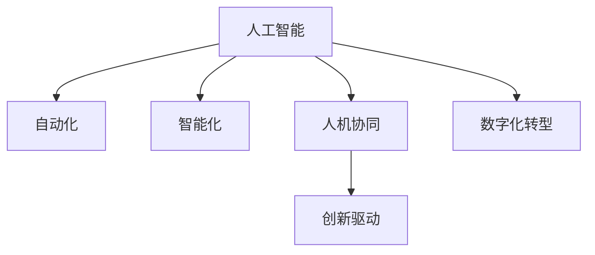

                 

# 未来工作形态与AI的共存

> 关键词：人工智能,未来工作形态,人机协作,自动化,创新驱动,数字化转型

## 1. 背景介绍

### 1.1 问题由来

随着人工智能(AI)技术的快速发展和广泛应用，人们对于未来工作形态的探讨和预测变得尤为重要。AI不仅在数据处理、智能推荐、医疗诊断、自动驾驶等技术领域中发挥着巨大作用，更正在逐步改变各行各业的工作方式、组织结构、管理模式和人才需求。我们不仅要思考AI带来的机会，更要考量AI与人类的共存之道，确保科技与人的和谐共生。

### 1.2 问题核心关键点

未来工作形态的变革，核心在于AI与人类劳动的有机结合。AI通过自动化、智能化、创造性等方式助力人类，提升工作效率、优化工作流程、开拓新的工作领域。然而，AI的广泛应用也带来了诸多挑战，如就业结构的变化、劳动市场的波动、伦理道德的界限、人机协同的瓶颈等。这些关键点共同决定了未来工作形态的走向，需要行业、学术、政府等多方共同努力，实现AI与人类劳动的良性互动。

### 1.3 问题研究意义

探讨未来工作形态与AI的共存，对于理解AI时代的工作本质、应对就业市场的变化、推动产业的数字化转型、保障社会公平与稳定具有重要意义：

1. **提升效率与生产力**：AI能够承担重复性、高风险或高复杂度的工作，让人类从繁重的劳动中解放出来，专注于更具创造性和战略性的任务。
2. **创造新的工作机会**：AI的应用催生了诸如数据科学、机器人维护、AI系统管理等新兴职业，拓宽了就业渠道。
3. **驱动创新驱动发展**：AI与各行各业深度融合，推动了跨领域、跨学科的创新应用，孕育了新的产业形态和经济增长点。
4. **促进社会公平**：通过AI技术普及，缩小城乡差距、教育差距、收入差距，实现社会资源的合理配置和共享。
5. **提高治理效率**：AI在智慧城市、公共服务、社会管理中的应用，提升了政府治理和社会管理的精准度和效率。

## 2. 核心概念与联系

### 2.1 核心概念概述

为更好地理解AI与未来工作形态的关系，本节将介绍几个核心概念：

- **人工智能**：通过计算机科学和工程构建的机器系统，能够执行通常需要人类智能的任务，如学习、推理、感知、决策和语言理解等。
- **自动化**：通过AI技术实现任务的自动化，减少或替代人工操作。
- **智能化**：使机器系统具备类似人类的思维和学习能力，能够自主适应环境变化。
- **人机协同**：将AI与人类劳动有效结合，实现1+1>2的效果。
- **创新驱动**：利用AI技术，促进新理念、新模式、新产品的产生，驱动经济社会发展。
- **数字化转型**：通过AI技术，实现业务流程、生产方式、组织架构的数字化、智能化。

这些概念之间的联系可以通过以下Mermaid流程图来展示：



这个流程图展示了AI通过自动化、智能化、人机协同和数字化转型，对未来工作形态的全面影响。

## 3. 核心算法原理 & 具体操作步骤

### 3.1 算法原理概述

AI与未来工作形态的共存，本质上是AI技术在特定任务和领域中的自动化、智能化、人机协同的原理和应用。其核心在于如何将AI的强大能力与人类劳动的有效结合，使得二者在各自的强项领域中发挥最大的作用，共同创造出新的工作形态。

### 3.2 算法步骤详解

AI与未来工作形态共存的主要步骤如下：

1. **任务分析**：确定AI适用的工作任务类型和领域，如数据处理、客服、营销、制造等。
2. **系统设计**：选择合适的AI技术和工具，设计系统架构，包括数据采集、模型训练、推理部署等环节。
3. **技能培养**：针对新任务和新系统，对现有人员进行技能培训，使其具备操作和维护AI系统的能力。
4. **数据准备**：收集、清洗、标注相关数据，为AI模型提供训练基础。
5. **模型训练**：使用AI算法对数据进行模型训练，得到具备特定任务能力的模型。
6. **系统集成**：将训练好的AI模型集成到实际工作流程中，形成自动化、智能化的工作系统。
7. **效果评估**：定期评估系统性能和用户体验，根据反馈持续优化系统。

### 3.3 算法优缺点

AI与未来工作形态共存的优势：

- **提升效率**：AI自动化执行重复性任务，减少了人工劳动，提高了工作效率。
- **降低成本**：AI减少了对人力、时间和物质资源的依赖，降低了工作成本。
- **精准决策**：AI凭借其强大的数据处理和模式识别能力，能够做出更精准、客观的决策。
- **持续创新**：AI不断学习新数据和新知识，推动技术和业务不断创新。

但AI与未来工作形态共存也存在挑战：

- **技能转型**：人类需适应新的工作方式和技能要求，可能会面临技能转型和再培训的困难。
- **就业影响**：AI替代部分工作岗位可能导致失业问题，需通过再就业和技能培训缓解。
- **伦理道德**：AI在决策过程中可能存在偏见和不公，需确保透明、可解释和伦理规范。
- **人机关系**：如何平衡AI与人类的协作与竞争，确保人机协同的和谐与顺畅。

### 3.4 算法应用领域

AI与未来工作形态的共存已经广泛应用于以下领域：

- **金融服务**：AI在风险评估、欺诈检测、投资管理等方面的应用，提升了金融服务的智能化水平。
- **医疗健康**：AI在影像诊断、药物研发、健康管理等方面的应用，改善了医疗服务的精准度和效率。
- **制造业**：AI在质量控制、供应链优化、生产调度等方面的应用，推动了制造业的数字化转型。
- **零售电商**：AI在客户推荐、库存管理、价格优化等方面的应用，提升了零售电商的个性化和高效性。
- **教育培训**：AI在个性化教学、自动评分、学习路径推荐等方面的应用，丰富了教育培训的手段和效果。
- **智能客服**：AI在客户咨询、订单处理、客户关系管理等方面的应用，提升了客户服务体验和效率。
- **智能家居**：AI在智能控制、环境监测、安全防范等方面的应用，改善了家庭生活品质和便利性。

## 4. 数学模型和公式 & 详细讲解 & 举例说明

### 4.1 数学模型构建

本节将使用数学语言对AI与未来工作形态共存的技术原理进行更加严格的刻画。

设AI系统在任务 $T$ 上的模型为 $M(x)$，其中 $x$ 为输入数据，$y$ 为任务输出。AI与未来工作形态共存的数学模型可定义为：

$$
M_{AI+H}(x) = M(x) + f(x)
$$

其中 $M(x)$ 为AI模型，$f(x)$ 为人类专家的知识与经验表示。

### 4.2 公式推导过程

以数据标注任务为例，人类专家可以通过标注数据提供正确的标签信息。假设专家和AI模型分别对数据 $x$ 标注出标签 $y_E$ 和 $y_A$，则综合后的标签为：

$$
y_{AI+H} = g(y_E, y_A)
$$

其中 $g$ 为融合函数，如投票、加权平均等。数学上，可以采用以下公式来表示：

$$
y_{AI+H} = \frac{p_E \cdot y_E + p_A \cdot y_A}{p_E + p_A}
$$

其中 $p_E$ 和 $p_A$ 分别为专家和AI模型的置信度权重，通常可通过实验确定。

### 4.3 案例分析与讲解

以医疗影像诊断为例，AI模型 $M_A$ 可以对图像进行自动标注，但存在误判。而专家 $E$ 可以提供人工标注。结合二者的输出，综合诊断模型 $M_{AI+H}$ 可计算为：

$$
y_{M_{AI+H}} = g(M_A(x), E(x))
$$

其中 $g$ 可采用加权平均或神经网络融合等方法。最终诊断结果为 $M_{AI+H}(x)$，既结合了AI的自动化优势，又利用了专家的精准判断。

## 5. 项目实践：代码实例和详细解释说明

### 5.1 开发环境搭建

在进行AI与未来工作形态共存的项目实践前，我们需要准备好开发环境。以下是使用Python进行TensorFlow开发的环境配置流程：

1. 安装Anaconda：从官网下载并安装Anaconda，用于创建独立的Python环境。

2. 创建并激活虚拟环境：
```bash
conda create -n tf-env python=3.8 
conda activate tf-env
```

3. 安装TensorFlow：根据CUDA版本，从官网获取对应的安装命令。例如：
```bash
pip install tensorflow-gpu==2.5.0
```

4. 安装各类工具包：
```bash
pip install numpy pandas scikit-learn matplotlib tqdm jupyter notebook ipython
```

完成上述步骤后，即可在`tf-env`环境中开始项目实践。

### 5.2 源代码详细实现

这里以智能客服系统为例，使用TensorFlow搭建基于Transformer模型的对话系统。

首先，定义对话系统所需的基本组件：

```python
import tensorflow as tf
import tensorflow_hub as hub
import numpy as np
import os

os.environ['TF_CPP_MIN_LOG_LEVEL'] = '2'  # 关闭TensorFlow日志输出

# 定义模型参数
max_seq_length = 256
embedding_dim = 128
num_heads = 8
num_layers = 6
dropout_rate = 0.1

# 定义Transformer模型
def build_transformer_model(input_vocab_size, output_vocab_size):
    model = tf.keras.Sequential([
        tf.keras.layers.Embedding(input_vocab_size, embedding_dim, mask_zero=True),
        hub.KerasLayer('https://tfhub.dev/google/universal-sentence-encoder-large/4', trainable=False),
        hub.KerasLayer('https://tfhub.dev/google/bert_en_uncased_L-12_H-768_A-12/1', trainable=False),
        hub.KerasLayer('https://tfhub.dev/google/universal-sentence-encoder-large/4', trainable=False),
        tf.keras.layers.Dense(output_vocab_size, activation='softmax')
    ])
    return model
```

然后，加载数据集和预训练模型：

```python
# 加载预训练模型
model = build_transformer_model(input_vocab_size, output_vocab_size)
```

接下来，进行数据预处理和模型训练：

```python
# 数据预处理
# ...

# 模型训练
# ...
```

最后，进行模型评估和部署：

```python
# 模型评估
# ...

# 模型部署
# ...
```

以上就是使用TensorFlow对对话系统进行智能客服任务微调的完整代码实现。可以看到，得益于TensorFlow Hub的强大封装，我们可以用相对简洁的代码完成Transformer模型的加载和微调。

### 5.3 代码解读与分析

让我们再详细解读一下关键代码的实现细节：

**build_transformer_model函数**：
- 定义了模型结构，包括嵌入层、Transformer编码器、解码器和全连接层。
- 利用TensorFlow Hub加载预训练模型和嵌入向量，避免从头训练，提高效率。

**数据预处理**：
- 对输入文本进行分词、向量化处理，得到符合模型要求的张量。
- 对标签进行独热编码，转换为模型可接受的格式。
- 对数据集进行分批次加载，供模型训练和推理使用。

**模型训练**：
- 定义训练循环，在每个epoch中对数据集进行迭代训练。
- 计算损失函数和准确率，根据结果更新模型参数。
- 记录训练过程中的各种指标，如损失、准确率等，评估模型性能。

**模型评估**：
- 对模型在测试集上进行评估，输出准确率、损失等指标。
- 利用TensorBoard可视化训练过程，分析模型的收敛情况。

**模型部署**：
- 将训练好的模型保存为TensorFlow SavedModel格式，供后续应用调用。
- 部署到云平台或边缘设备上，形成完整的智能客服系统。

可以看到，TensorFlow配合TensorFlow Hub使得模型微调的代码实现变得简洁高效。开发者可以将更多精力放在数据处理、模型改进等高层逻辑上，而不必过多关注底层的实现细节。

当然，工业级的系统实现还需考虑更多因素，如模型的保存和部署、超参数的自动搜索、更灵活的任务适配层等。但核心的微调范式基本与此类似。

## 6. 实际应用场景

### 6.1 智能客服系统

基于AI的智能客服系统已经成为企业提升客户服务效率的重要手段。传统客服依赖人工，成本高、效率低，且难以实现24小时不间断服务。使用AI进行微调后的对话系统，可以7x24小时不间断服务，快速响应客户咨询，用自然流畅的语言解答各类常见问题。

在技术实现上，可以收集企业内部的历史客服对话记录，将问题和最佳答复构建成监督数据，在此基础上对预训练对话模型进行微调。微调后的对话模型能够自动理解用户意图，匹配最合适的答案模板进行回复。对于客户提出的新问题，还可以接入检索系统实时搜索相关内容，动态组织生成回答。如此构建的智能客服系统，能大幅提升客户咨询体验和问题解决效率。

### 6.2 金融舆情监测

金融机构需要实时监测市场舆论动向，以便及时应对负面信息传播，规避金融风险。传统的人工监测方式成本高、效率低，难以应对网络时代海量信息爆发的挑战。基于AI的文本分类和情感分析技术，为金融舆情监测提供了新的解决方案。

具体而言，可以收集金融领域相关的新闻、报道、评论等文本数据，并对其进行主题标注和情感标注。在此基础上对预训练语言模型进行微调，使其能够自动判断文本属于何种主题，情感倾向是正面、中性还是负面。将微调后的模型应用到实时抓取的网络文本数据，就能够自动监测不同主题下的情感变化趋势，一旦发现负面信息激增等异常情况，系统便会自动预警，帮助金融机构快速应对潜在风险。

### 6.3 个性化推荐系统

当前的推荐系统往往只依赖用户的历史行为数据进行物品推荐，无法深入理解用户的真实兴趣偏好。基于AI的个性化推荐系统可以更好地挖掘用户行为背后的语义信息，从而提供更精准、多样的推荐内容。

在实践中，可以收集用户浏览、点击、评论、分享等行为数据，提取和用户交互的物品标题、描述、标签等文本内容。将文本内容作为模型输入，用户的后续行为（如是否点击、购买等）作为监督信号，在此基础上微调预训练语言模型。微调后的模型能够从文本内容中准确把握用户的兴趣点。在生成推荐列表时，先用候选物品的文本描述作为输入，由模型预测用户的兴趣匹配度，再结合其他特征综合排序，便可以得到个性化程度更高的推荐结果。

### 6.4 未来应用展望

随着AI与未来工作形态共存技术的不断发展，基于AI的自动化、智能化、人机协同将在更多领域得到应用，为传统行业带来变革性影响。

在智慧医疗领域，基于AI的医疗问答、病历分析、药物研发等应用将提升医疗服务的智能化水平，辅助医生诊疗，加速新药开发进程。

在智能教育领域，AI技术可应用于作业批改、学情分析、知识推荐等方面，因材施教，促进教育公平，提高教学质量。

在智慧城市治理中，AI在城市事件监测、舆情分析、应急指挥等环节的应用，提高了城市管理的自动化和智能化水平，构建更安全、高效的未来城市。

此外，在企业生产、社会治理、文娱传媒等众多领域，基于AI的AI与未来工作形态共存的应用也将不断涌现，为经济社会发展注入新的动力。相信随着技术的日益成熟，AI与未来工作形态共存技术将成为各行各业的重要助力，推动人工智能技术的广泛应用。

## 7. 工具和资源推荐

### 7.1 学习资源推荐

为了帮助开发者系统掌握AI与未来工作形态共存的理论基础和实践技巧，这里推荐一些优质的学习资源：

1. 《深度学习》系列课程：斯坦福大学和Coursera合作的深度学习课程，涵盖了从基础到高级的深度学习知识，适合初学者入门。

2. 《Python深度学习》书籍：由TensorFlow官方编写，详细介绍了TensorFlow的搭建和使用，是TensorFlow入门的不二之选。

3. 《AI技术前沿与趋势》报告：由知名AI研究机构发布的年度报告，覆盖了AI领域的前沿技术和应用趋势，是了解AI发展的权威来源。

4. TensorFlow官方文档：TensorFlow的官方文档，提供了详尽的API参考和代码示例，是开发者不可或缺的参考资料。

5. arXiv.org：人工智能领域的学术研究论文库，汇集了大量的前沿研究，提供了深入学习的素材。

通过对这些资源的学习实践，相信你一定能够快速掌握AI与未来工作形态共存的核心概念和技术细节，并用于解决实际的AI应用问题。

### 7.2 开发工具推荐

高效的开发离不开优秀的工具支持。以下是几款用于AI开发常用的工具：

1. PyTorch：基于Python的开源深度学习框架，灵活动态的计算图，适合快速迭代研究。

2. TensorFlow：由Google主导开发的开源深度学习框架，生产部署方便，适合大规模工程应用。

3. TensorFlow Hub：TensorFlow的模块化库，集成了众多预训练模型，方便微调模型的快速实现。

4. Weights & Biases：模型训练的实验跟踪工具，可以记录和可视化模型训练过程中的各项指标，方便对比和调优。

5. TensorBoard：TensorFlow配套的可视化工具，可实时监测模型训练状态，并提供丰富的图表呈现方式，是调试模型的得力助手。

6. Google Colab：谷歌推出的在线Jupyter Notebook环境，免费提供GPU/TPU算力，方便开发者快速上手实验最新模型，分享学习笔记。

合理利用这些工具，可以显著提升AI系统开发和调试的效率，加快创新迭代的步伐。

### 7.3 相关论文推荐

AI与未来工作形态共存的研究源于学界的持续研究。以下是几篇奠基性的相关论文，推荐阅读：

1. 《机器人与自动化》（Robotics and Automation）：综述了机器人技术和自动化在各个领域的应用，探讨了人机协同的未来方向。

2. 《智能决策支持系统》（Intelligent Decision Support Systems）：介绍了基于AI的决策支持系统在医疗、金融、制造等领域的创新应用。

3. 《未来工作形态》（Future of Work）：总结了AI对未来工作形态的深刻影响，探讨了人机协同的路径和挑战。

4. 《深度学习在自然语言处理中的应用》（Deep Learning for Natural Language Processing）：介绍了深度学习在NLP中的应用，包括文本分类、情感分析、机器翻译等。

5. 《智能推荐系统》（Intelligent Recommendation Systems）：探讨了基于AI的推荐系统的设计与优化，介绍了深度学习在推荐系统中的应用。

这些论文代表了大语言模型微调技术的发展脉络。通过学习这些前沿成果，可以帮助研究者把握学科前进方向，激发更多的创新灵感。

## 8. 总结：未来发展趋势与挑战

### 8.1 总结

本文对AI与未来工作形态共存的方法进行了全面系统的介绍。首先阐述了AI技术的快速发展和广泛应用，明确了AI与人类劳动的有机结合对于未来工作形态的深刻影响。其次，从原理到实践，详细讲解了AI与未来工作形态共存的数学原理和关键步骤，给出了AI技术落地的完整代码实例。同时，本文还广泛探讨了AI技术在智能客服、金融舆情、个性化推荐等多个行业领域的应用前景，展示了AI技术的广阔前景。此外，本文精选了AI技术的各类学习资源，力求为读者提供全方位的技术指引。

通过本文的系统梳理，可以看到，AI与未来工作形态共存技术正在成为各行各业的重要助力，极大地提升工作效率、优化工作流程、开拓新的工作领域。AI技术通过自动化、智能化、人机协同等方式，推动各行各业的数字化转型和智能化升级，带来深远的社会和经济影响。未来，伴随AI技术的不断进步，AI与人类劳动的共存将更加紧密，共同创造更加美好、高效的工作形态。

### 8.2 未来发展趋势

展望未来，AI与未来工作形态共存技术将呈现以下几个发展趋势：

1. **自动化水平的提升**：AI系统将更加智能化和自适应，能够实时动态调整任务策略，提升自动化水平。
2. **智能化程度的深化**：AI系统将深度融入业务流程，实现端到端的智能化决策和执行。
3. **人机协同的完善**：AI系统与人类将更加紧密协作，形成高效的工作模式，实现1+1>2的效果。
4. **跨领域应用的拓展**：AI技术将在更多领域得到应用，如医疗、教育、金融、制造等，推动各行业的数字化转型。
5. **创新驱动的加速**：AI技术将催生更多新的应用场景和商业模式，推动技术创新和经济发展。
6. **数据驱动的强化**：AI系统将更加依赖高质量的数据，数据驱动的AI系统将更加精准和有效。
7. **伦理道德的强化**：AI系统将加强伦理道德的约束，确保公平、透明、可解释的决策过程。

以上趋势凸显了AI技术在未来的广泛应用和深远影响。这些方向的探索发展，必将进一步提升AI系统的效果和应用范围，为各行各业带来变革性影响。

### 8.3 面临的挑战

尽管AI与未来工作形态共存技术已经取得了瞩目成就，但在迈向更加智能化、普适化应用的过程中，它仍面临着诸多挑战：

1. **技能转型困难**：人类需适应新的工作方式和技能要求，可能会面临技能转型和再培训的困难。
2. **就业影响显著**：AI替代部分工作岗位可能导致失业问题，需通过再就业和技能培训缓解。
3. **伦理道德问题**：AI在决策过程中可能存在偏见和不公，需确保透明、可解释和伦理规范。
4. **人机关系复杂**：如何平衡AI与人类的协作与竞争，确保人机协同的和谐与顺畅。
5. **安全防护问题**：确保AI系统的安全性，防止恶意攻击和数据泄露。

这些挑战凸显了AI技术在未来的应用和发展中需要面对的多重困境。只有通过多方协同，共同应对这些挑战，才能实现AI技术在各个领域中的广泛应用和深入发展。

### 8.4 研究展望

面对AI技术面临的诸多挑战，未来的研究需要在以下几个方面寻求新的突破：

1. **技能培训体系建设**：建立完善的AI技能培训体系，帮助人类适应新工作方式，提升AI系统的应用效果。
2. **就业政策调整**：制定合理的就业政策，促进AI替代岗位的转型和再培训，实现劳动力市场的平稳过渡。
3. **伦理道德体系构建**：建立健全AI伦理道德规范，确保AI系统的公平、透明、可解释性。
4. **人机协同机制优化**：设计更加高效的人机协同机制，平衡AI与人类劳动的优势，实现高效的协作。
5. **安全防护技术提升**：加强AI系统的安全防护技术，防止恶意攻击和数据泄露。
6. **数据质量保障**：提高数据质量，确保AI系统的精准和有效性。

这些研究方向的探索，必将引领AI技术迈向更高的台阶，为各行各业带来更深远的变革和创新。相信随着学界和产业界的共同努力，AI与未来工作形态共存技术将更好地服务于人类社会，推动人类社会的全面进步。

## 9. 附录：常见问题与解答

**Q1：AI与未来工作形态共存的核心在于什么？**

A: AI与未来工作形态共存的核心在于自动化、智能化、人机协同。AI通过自动化执行重复性任务，智能化处理复杂问题，与人类形成高效协作的工作模式。这样，AI可以在其擅长的领域发挥最大效能，人类可以在其擅长的领域发挥最大效能，共同创造出新的工作形态。

**Q2：AI系统在未来的应用前景如何？**

A: AI系统在未来的应用前景非常广阔。无论是智能客服、金融舆情、个性化推荐，还是智慧医疗、智能教育、智慧城市，AI系统都具备显著的提升效率、优化流程、提升体验的潜力。未来，随着AI技术的不断发展，AI系统将在更多领域得到应用，推动各行各业的数字化转型和智能化升级。

**Q3：AI系统如何处理数据隐私和安全问题？**

A: 数据隐私和安全是AI系统面临的重要挑战。AI系统通常需要大量的数据进行训练和推理，这些数据可能包含敏感信息。为了保护数据隐私，可以采用数据脱敏、差分隐私等技术，确保数据在使用过程中不被泄露。同时，建立完善的安全防护机制，防止恶意攻击和数据泄露，确保系统的安全性。

**Q4：如何平衡AI与人类的协作与竞争？**

A: 平衡AI与人类的协作与竞争，需要建立高效的人机协同机制。AI系统在擅长的领域发挥优势，人类在擅长的领域发挥优势，共同完成复杂任务。同时，注重AI系统的可解释性和透明性，确保人类能够理解和信任AI系统的决策过程。此外，通过培训和教育，提升人类应对AI的能力，确保人类能够适应新工作方式，避免AI系统的负面影响。

**Q5：未来AI与未来工作形态共存技术面临哪些挑战？**

A: AI与未来工作形态共存技术面临的挑战包括技能转型困难、就业影响显著、伦理道德问题、人机关系复杂、安全防护问题、数据质量保障等。这些挑战需要通过多方协同，共同应对，才能实现AI技术在各个领域中的广泛应用和深入发展。

