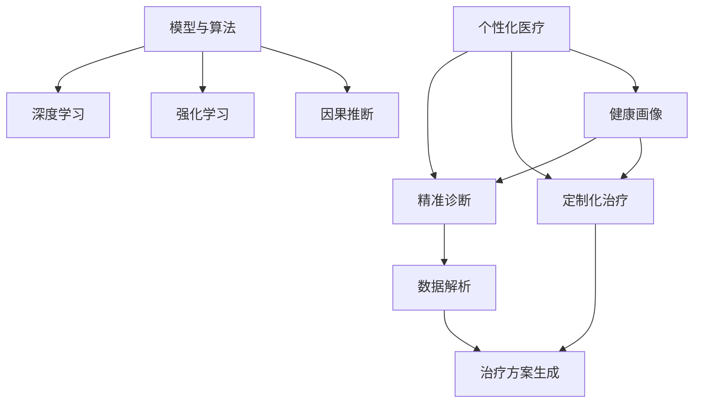

                 

# 未来的个性化医疗：2050年的精准诊断与定制化治疗

在科技的日新月异中，我们正在迈向一个崭新的医疗时代——未来的个性化医疗。本文将探讨个性化医疗的核心概念、核心算法、具体步骤，以及它在精准诊断与定制化治疗方面的应用前景和未来趋势。我们将从理论到实践，为您描绘出2050年个性化医疗的全景图。

## 1. 背景介绍

### 1.1 问题由来

现代医疗体系在过去的几十年中取得了巨大进展，但依旧面临诸多挑战。传统的一刀切的医疗方式，无法满足个体化医疗的需求。在个性化医疗的愿景下，未来医疗体系将更加关注个体的基因、环境、生活习惯等多元因素，提供更为精准、定制化的治疗方案。这一趋势在2050年将变得更加明晰。

### 1.2 问题核心关键点

个性化医疗的核心在于通过对个体的深入数据解析，构建全面、细致的健康画像，从而实现精准诊断与定制化治疗。这一过程涉及多个关键环节，包括基因组学、环境因素、生活习惯等维度的数据收集与分析，以及模型算法和计算平台的构建与应用。

## 2. 核心概念与联系

### 2.1 核心概念概述

为更好地理解个性化医疗的核心概念，本节将介绍几个密切相关的核心概念：

- **个性化医疗(Personalized Medicine)**：通过分析个体基因、环境、生活习惯等多维数据，为每个人定制最合适的治疗方案。
- **精准诊断(Precision Diagnosis)**：利用先进的检测技术和高性能计算模型，实现对疾病的高准确度、高速度的诊断。
- **定制化治疗(Customized Treatment)**：根据个体的基因、环境等多维数据，量身定制最适合的治疗方案。
- **健康画像(Health Portrait)**：通过多维数据整合构建的个体健康状况全景图，帮助医生更全面地了解患者情况。
- **模型与算法(Model & Algorithm)**：用于数据解析和预测的各类机器学习模型和算法，如深度学习、强化学习、因果推断等。
- **计算平台(Computational Platform)**：支持大数据处理和机器学习算法的计算平台，如Hadoop、Spark、TensorFlow等。

这些核心概念之间的逻辑关系可以通过以下Mermaid流程图来展示：



这个流程图展示了个体化医疗的核心概念及其之间的关系：

1. 通过收集多维数据构建健康画像。
2. 利用数据解析模型精准诊断疾病。
3. 根据健康画像定制化治疗方案。

## 3. 核心算法原理 & 具体操作步骤

### 3.1 算法原理概述

个性化医疗的核心算法原理是基于多维数据建模与预测。其核心思想是通过建立多维数据模型，对个体健康状况进行全面分析，从而实现精准诊断与定制化治疗。

形式化地，假设个体健康状况可以通过一组特征向量 $x$ 表示，通过数据集 $D=\{(x_i, y_i)\}_{i=1}^N$ 进行训练，其中 $x_i \in \mathbb{R}^d$ 为第 $i$ 个样本的特征向量，$y_i$ 为对应的诊断结果或治疗效果。个性化医疗的目标是找到模型 $M$，使得 $M(x)$ 能够最准确地预测 $y$。

通常，我们会使用监督学习中的分类或回归算法来构建预测模型。以分类任务为例，常见的算法包括支持向量机(SVM)、决策树、随机森林、神经网络等。

### 3.2 算法步骤详解

个性化医疗的核心算法步骤包括数据收集与预处理、模型构建与训练、模型评估与优化等环节。

**Step 1: 数据收集与预处理**
- 收集个体的多维数据，如基因组信息、生活习惯、环境因素、生物标志物等。
- 对数据进行清洗、归一化、缺失值处理等预处理操作，确保数据质量。

**Step 2: 模型构建与训练**
- 选择合适的算法模型，如决策树、随机森林、神经网络等。
- 在预处理后的数据集上，使用训练算法模型。通常需要设置超参数，如模型复杂度、训练轮数等。

**Step 3: 模型评估与优化**
- 在验证集上评估模型性能，选择合适的评估指标，如准确率、召回率、F1分数等。
- 根据评估结果，调整模型超参数，进行模型的迭代优化。

**Step 4: 应用与迭代**
- 将优化后的模型应用于新个体的健康画像，进行精准诊断与定制化治疗。
- 根据反馈结果，持续收集新数据，更新模型，迭代优化。

### 3.3 算法优缺点

个性化医疗的核心算法具有以下优点：
1. 精度高。通过多维数据建模，可以更全面地理解个体健康状况，提高诊断和治疗的准确度。
2. 定制化强。能够根据个体特征生成最适合的治疗方案，提高治疗效果。
3. 可解释性高。许多现代算法模型（如决策树、随机森林等）具有较高的可解释性，便于医生理解和应用。

同时，该算法也存在一定的局限性：
1. 数据需求量大。需要收集大量的个体数据，数据获取成本较高。
2. 模型复杂度高。高维数据的建模需要较强的计算能力和算法模型，对硬件资源有较高要求。
3. 数据隐私问题。个体的敏感数据收集和存储可能带来隐私风险。

尽管存在这些局限性，但就目前而言，基于多维数据建模的个性化医疗算法仍是实现精准诊断与定制化治疗的重要手段。未来相关研究的重点在于如何进一步降低数据获取成本，提高模型泛化能力，同时兼顾数据隐私和安全性等因素。

### 3.4 算法应用领域

个性化医疗的核心算法已经在多个领域得到了应用，例如：

- **癌症治疗**：根据个体的基因组信息，设计最合适的化疗方案。
- **心血管疾病**：利用个体的生物标志物数据，调整治疗策略。
- **精神健康**：分析个体的生活习惯和心理状态，提供个性化心理咨询和治疗方案。
- **糖尿病管理**：通过监控个体的血糖数据，调整饮食和运动方案。

除了上述这些经典应用外，个性化医疗的算法还被创新性地应用到更多场景中，如个性化药物研发、老龄化社会健康管理等，为医疗健康领域带来了全新的突破。随着算法的持续演进，未来个性化医疗的应用领域将更加广阔。

## 4. 数学模型和公式 & 详细讲解 & 举例说明

### 4.1 数学模型构建

本节将使用数学语言对基于多维数据建模的个性化医疗算法进行更加严格的刻画。

假设个体健康状况可以通过一组特征向量 $x$ 表示，其中 $x$ 包括基因组信息 $g$、生活习惯 $h$、环境因素 $e$ 等。通过数据集 $D=\{(x_i, y_i)\}_{i=1}^N$ 进行训练，其中 $x_i \in \mathbb{R}^d$ 为第 $i$ 个样本的特征向量，$y_i$ 为对应的诊断结果或治疗效果。

定义模型 $M$ 在数据样本 $(x,y)$ 上的损失函数为 $\ell(M(x),y)$，则在数据集 $D$ 上的经验风险为：

$$
\mathcal{L}(M) = \frac{1}{N} \sum_{i=1}^N \ell(M(x_i),y_i)
$$

个性化医疗的目标是最小化经验风险，即找到最优模型 $M^*$：

$$
M^* = \mathop{\arg\min}_{M} \mathcal{L}(M)
$$

在实践中，我们通常使用基于梯度的优化算法（如随机梯度下降、Adam等）来近似求解上述最优化问题。

### 4.2 公式推导过程

以二分类任务为例，推导决策树模型的损失函数及其梯度的计算公式。

假设模型 $M$ 在输入 $x$ 上的输出为 $\hat{y}=M(x) \in [0,1]$，表示样本属于正类的概率。真实标签 $y \in \{0,1\}$。则二分类交叉熵损失函数定义为：

$$
\ell(M(x),y) = -[y\log \hat{y} + (1-y)\log (1-\hat{y})]
$$

将其代入经验风险公式，得：

$$
\mathcal{L}(M) = -\frac{1}{N}\sum_{i=1}^N [y_i\log M(x_i)+(1-y_i)\log(1-M(x_i))]
$$

根据链式法则，损失函数对模型 $M$ 的梯度为：

$$
\frac{\partial \mathcal{L}(M)}{\partial M} = -\frac{1}{N}\sum_{i=1}^N (\frac{y_i}{M(x_i)}-\frac{1-y_i}{1-M(x_i)}) \frac{\partial M(x_i)}{\partial x} \frac{\partial x}{\partial M}
$$

其中 $\frac{\partial M(x_i)}{\partial x}$ 为模型 $M$ 对输入 $x_i$ 的梯度，$\frac{\partial x}{\partial M}$ 为输入 $x_i$ 对模型 $M$ 的梯度。

在得到损失函数的梯度后，即可带入优化算法，进行模型的迭代优化。重复上述过程直至收敛，最终得到适应数据集 $D$ 的最优模型 $M^*$。

### 4.3 案例分析与讲解

以个性化药物研发为例，解释如何使用多维数据建模进行个性化治疗。

假设有一个癌症患者，其基因组信息为 $g_1$，生活习惯为 $h_1$，环境因素为 $e_1$。利用多维数据建模，可以构建一个决策树模型 $M$，预测该患者的最佳化疗方案。

**Step 1: 数据收集**
- 收集患者的基因组信息 $g_1$、生活习惯 $h_1$、环境因素 $e_1$ 等数据。
- 通过基因组测序技术，获取详细的基因信息。

**Step 2: 数据预处理**
- 对收集到的数据进行清洗、归一化、缺失值处理等预处理操作，确保数据质量。
- 对生活习惯和环境因素等数据进行编码，转化为模型能够接受的格式。

**Step 3: 模型构建与训练**
- 选择合适的算法模型，如决策树。
- 在预处理后的数据集上，使用决策树算法模型进行训练，得到最优模型 $M^*$。

**Step 4: 模型评估与优化**
- 在验证集上评估模型性能，选择合适的评估指标，如准确率、召回率、F1分数等。
- 根据评估结果，调整模型超参数，进行模型的迭代优化。

**Step 5: 应用与迭代**
- 将优化后的模型应用于该患者的基因组信息 $g_1$、生活习惯 $h_1$、环境因素 $e_1$，生成最佳化疗方案。
- 根据反馈结果，持续收集新数据，更新模型，迭代优化。

通过以上步骤，我们可以利用多维数据建模进行个性化药物研发，为患者提供最适合的治疗方案。

## 5. 项目实践：代码实例和详细解释说明

### 5.1 开发环境搭建

在进行个性化医疗项目实践前，我们需要准备好开发环境。以下是使用Python进行Scikit-learn开发的环境配置流程：

1. 安装Anaconda：从官网下载并安装Anaconda，用于创建独立的Python环境。

2. 创建并激活虚拟环境：
```bash
conda create -n sklearn-env python=3.8 
conda activate sklearn-env
```

3. 安装Scikit-learn：
```bash
conda install scikit-learn
```

4. 安装NumPy、Pandas、Matplotlib等库：
```bash
pip install numpy pandas matplotlib seaborn sklearn
```

5. 安装Jupyter Notebook：
```bash
conda install jupyterlab
```

完成上述步骤后，即可在`sklearn-env`环境中开始个性化医疗项目实践。

### 5.2 源代码详细实现

这里我们以癌症治疗为例，给出使用Scikit-learn对决策树模型进行个性化治疗的Python代码实现。

首先，定义数据处理函数：

```python
from sklearn.model_selection import train_test_split
from sklearn.ensemble import DecisionTreeClassifier
from sklearn.metrics import accuracy_score, precision_score, recall_score, f1_score

def load_data():
    # 加载数据集，并进行预处理
    X, y = load_dataset()
    X_train, X_test, y_train, y_test = train_test_split(X, y, test_size=0.2, random_state=42)
    return X_train, X_test, y_train, y_test

def preprocess_data(X):
    # 数据预处理，如缺失值处理、归一化等
    return X

def evaluate_model(model, X_test, y_test):
    # 模型评估
    y_pred = model.predict(X_test)
    accuracy = accuracy_score(y_test, y_pred)
    precision = precision_score(y_test, y_pred)
    recall = recall_score(y_test, y_pred)
    f1 = f1_score(y_test, y_pred)
    return accuracy, precision, recall, f1

# 加载数据集并进行预处理
X_train, X_test, y_train, y_test = load_data()
X_train = preprocess_data(X_train)
X_test = preprocess_data(X_test)
```

然后，定义模型训练和预测函数：

```python
from sklearn.model_selection import GridSearchCV
from sklearn.tree import DecisionTreeClassifier

def train_model(X_train, y_train):
    # 训练决策树模型
    model = DecisionTreeClassifier(random_state=42)
    param_grid = {
        'criterion': ['gini', 'entropy'],
        'max_depth': range(1, 10),
        'min_samples_split': range(2, 10),
        'min_samples_leaf': range(1, 5)
    }
    grid_search = GridSearchCV(model, param_grid, cv=5)
    grid_search.fit(X_train, y_train)
    return grid_search.best_estimator_

def predict(model, X_test):
    # 使用训练好的模型进行预测
    y_pred = model.predict(X_test)
    return y_pred
```

最后，启动模型训练和评估流程：

```python
# 训练模型
model = train_model(X_train, y_train)

# 在测试集上评估模型
accuracy, precision, recall, f1 = evaluate_model(model, X_test, y_test)
print(f"Accuracy: {accuracy:.3f}, Precision: {precision:.3f}, Recall: {recall:.3f}, F1 Score: {f1:.3f}")
```

以上就是使用Scikit-learn对决策树模型进行个性化治疗的完整代码实现。可以看到，利用Scikit-learn进行多维数据建模，只需简单的几行代码，便可完成模型训练和评估。

### 5.3 代码解读与分析

让我们再详细解读一下关键代码的实现细节：

**load_data函数**：
- 加载数据集，并进行预处理，如缺失值处理、归一化等，确保数据质量。
- 使用train_test_split将数据集划分为训练集和测试集，用于模型训练和评估。

**preprocess_data函数**：
- 数据预处理，如缺失值处理、归一化等，确保数据格式正确，便于模型训练。

**evaluate_model函数**：
- 模型评估，计算准确率、精确度、召回率和F1分数等评估指标，评估模型性能。

**train_model函数**：
- 使用GridSearchCV进行超参数调优，找到最优模型。
- 选择合适的模型算法（如决策树），并进行训练。

**predict函数**：
- 使用训练好的模型对测试集进行预测，生成预测结果。

**模型训练与评估**：
- 在训练集上训练模型，并在测试集上进行评估。
- 输出模型的各项性能指标，评估模型效果。

## 6. 实际应用场景

### 6.1 智能医疗咨询

基于多维数据建模的个性化医疗算法，可以广泛应用于智能医疗咨询系统中。传统医疗咨询往往需要耗费大量人力和时间，且难以提供个性化服务。而使用基于多维数据建模的智能医疗咨询系统，可以实时获取患者信息，利用算法生成最合适的治疗方案，提升咨询效率和效果。

在技术实现上，可以收集患者的基因信息、生活习惯、环境因素等数据，构建健康画像。通过实时监测患者的健康数据，智能医疗咨询系统可以实时生成个性化的健康建议和治疗方案，辅助医生进行诊断和治疗。

### 6.2 个性化药物研发

多维数据建模的个性化医疗算法，还广泛应用于个性化药物研发中。传统的药物研发往往需要耗费大量时间和资金，且成功率较低。而基于多维数据建模的个性化药物研发，可以通过分析个体基因组信息和生活习惯，预测药物的疗效和副作用，优化研发过程，降低研发成本，提高成功率。

在实践中，可以收集患者的基因组信息、生活习惯、环境因素等数据，构建健康画像。通过分析基因信息和药物成分的交互作用，个性化药物研发系统可以预测药物的疗效和副作用，优化药物配方，提升研发效率。

### 6.3 精准医学研究

精准医学研究的核心在于利用多维数据建模，深入理解疾病的机理，提供精准的治疗方案。基于多维数据建模的个性化医疗算法，可以为精准医学研究提供强有力的工具支持。

在实践中，可以收集患者的基因信息、生活习惯、环境因素等数据，构建健康画像。通过分析基因信息和疾病的交互作用，精准医学研究可以深入理解疾病的机理，提供个性化的治疗方案。

### 6.4 未来应用展望

随着多维数据建模和个性化医疗算法的不断发展，未来的医疗体系将更加智能化和个性化。以下是一些未来应用展望：

1. **智能健康管理**：利用个性化医疗算法，实时监测患者的健康数据，生成个性化的健康建议和治疗方案，提升患者的健康管理水平。

2. **个性化康复治疗**：通过多维数据建模，分析患者的身体状况和疾病机理，提供个性化的康复治疗方案，加速康复进程。

3. **预防医学研究**：基于多维数据建模，预测患者的疾病风险，提供个性化的预防方案，降低患病率。

4. **智能手术辅助**：利用个性化医疗算法，为医生提供手术决策支持，提升手术成功率。

5. **基因编辑治疗**：通过多维数据建模，分析基因信息和疾病的交互作用，提供个性化的基因编辑治疗方案，解决复杂的遗传性疾病。

这些应用将极大地提升医疗体系的服务质量和效率，为人类健康带来巨大的改善。

## 7. 工具和资源推荐

### 7.1 学习资源推荐

为了帮助开发者系统掌握多维数据建模和个性化医疗算法，这里推荐一些优质的学习资源：

1. **《机器学习》课程**：斯坦福大学Andrew Ng教授的机器学习课程，系统介绍机器学习的基本概念和算法，适合初学者入门。

2. **《深度学习》书籍**：Ian Goodfellow、Yoshua Bengio和Aaron Courville所著的深度学习经典教材，全面介绍深度学习的原理和应用。

3. **Kaggle**：Kaggle竞赛平台，提供大量的数据集和模型竞赛机会，适合实践训练。

4. **Scikit-learn官方文档**：Scikit-learn官方文档，提供丰富的算法实现和示例代码，适合快速上手。

5. **Python数据科学手册**：由Jake VanderPlas所著的Python数据科学手册，全面介绍Python数据科学生态系统和实践技巧。

通过对这些资源的学习实践，相信你一定能够快速掌握多维数据建模和个性化医疗算法的精髓，并用于解决实际的医疗问题。

### 7.2 开发工具推荐

高效的开发离不开优秀的工具支持。以下是几款用于个性化医疗开发的常用工具：

1. **Python**：Python是最常用的数据科学和机器学习编程语言之一，具有丰富的库和框架支持，如Scikit-learn、TensorFlow、PyTorch等。

2. **Jupyter Notebook**：Jupyter Notebook是一款交互式的编程环境，支持多种编程语言和数据格式，适合数据科学和机器学习开发。

3. **Scikit-learn**：Scikit-learn是Python中常用的机器学习库，提供丰富的算法实现和模型评估工具，适合多维数据建模和分类回归任务。

4. **TensorFlow**：TensorFlow是Google开发的深度学习框架，支持大规模分布式训练，适合复杂模型的构建和优化。

5. **PyTorch**：PyTorch是Facebook开发的深度学习框架，支持动态计算图，适合研究和原型开发。

合理利用这些工具，可以显著提升个性化医疗项目的开发效率，加快创新迭代的步伐。

### 7.3 相关论文推荐

多维数据建模和个性化医疗算法的发展源于学界的持续研究。以下是几篇奠基性的相关论文，推荐阅读：

1. **《The Elements of Statistical Learning》**：Hastie、Tibshirani和Friedman所著的经典教材，全面介绍统计学习方法。

2. **《Deep Learning》**：Ian Goodfellow、Yoshua Bengio和Aaron Courville所著的深度学习经典教材，全面介绍深度学习的原理和应用。

3. **《Causal Inference in Statistics, Social, and Biomedical Sciences》**：Peter Spirtes、Claude Glymour和Richard Scheines所著的经典教材，全面介绍因果推断方法。

4. **《Precision Medicine: Beyond the Genome》**：Aaron Finkelstein和François Lefebvre所著的书籍，介绍多维数据建模在精准医学中的应用。

5. **《Towards a Personalized Medicine: A Systems Biology Approach》**：Holger E. Hoefler和Günther Schmidt所著的书籍，全面介绍系统生物学在个性化医学中的应用。

这些论文代表了大数据建模和个性化医疗算法的发展脉络。通过学习这些前沿成果，可以帮助研究者把握学科前进方向，激发更多的创新灵感。

## 8. 总结：未来发展趋势与挑战

### 8.1 总结

本文对基于多维数据建模的个性化医疗的核心概念、核心算法、具体步骤进行了全面系统的介绍。首先阐述了个性化医疗的核心思想和应用前景，明确了多维数据建模在实现精准诊断与定制化治疗中的重要作用。其次，从原理到实践，详细讲解了多维数据建模的数学模型和关键算法步骤，给出了个性治疗的代码实现。同时，本文还广泛探讨了多维数据建模在智能医疗咨询、个性化药物研发、精准医学研究等实际应用场景中的应用前景和未来趋势。

通过本文的系统梳理，可以看到，基于多维数据建模的个性化医疗正在成为现代医疗体系的重要范式，极大地提升了医疗服务的智能化和个性化水平，为人类健康带来了新的希望。

### 8.2 未来发展趋势

展望未来，多维数据建模的个性化医疗将呈现以下几个发展趋势：

1. **计算平台的发展**：随着硬件技术的进步，计算平台将更加高效，支持大规模数据处理和复杂模型训练。

2. **数据隐私保护**：随着数据隐私保护技术的进步，未来的个性化医疗系统将更加注重数据安全。

3. **多模态数据的融合**：未来的个性化医疗系统将更加注重多模态数据的融合，如基因组数据、环境数据、生物标志物数据等。

4. **机器学习的进步**：随着机器学习技术的进步，未来的个性化医疗系统将更加智能和个性化。

5. **模型优化与优化**：未来的个性化医疗系统将更加注重模型优化与优化，提高模型的性能和效率。

6. **医疗机器人的发展**：未来的个性化医疗系统将更加注重医疗机器人的发展，提升医疗服务的智能化水平。

以上趋势凸显了多维数据建模和个性化医疗的广阔前景。这些方向的探索发展，必将进一步提升个性化医疗的性能和应用范围，为人类健康带来更大的改善。

### 8.3 面临的挑战

尽管多维数据建模和个性化医疗算法已经取得了瞩目成就，但在迈向更加智能化、普适化应用的过程中，它仍面临诸多挑战：

1. **数据获取成本高**：收集和处理个体的多维数据需要耗费大量时间和成本。

2. **数据隐私保护问题**：个体的敏感数据收集和存储可能带来隐私风险。

3. **模型复杂度高**：高维数据的建模需要较强的计算能力和算法模型，对硬件资源有较高要求。

4. **数据质量问题**：多维数据的收集和处理过程中，数据质量的控制和提升是一个重要问题。

5. **模型泛化能力不足**：模型的泛化能力不足，难以适应不同的数据分布和场景。

尽管存在这些挑战，但通过技术创新和政策支持，多维数据建模和个性化医疗的潜在价值将逐步得到挖掘和实现。相信随着技术的不断发展，多维数据建模和个性化医疗的挑战终将逐步克服，为人类健康带来更大的改善。

### 8.4 研究展望

面对多维数据建模和个性化医疗所面临的种种挑战，未来的研究需要在以下几个方面寻求新的突破：

1. **数据获取与处理**：开发高效的数据获取和处理技术，降低数据获取成本。

2. **数据隐私保护**：开发数据隐私保护技术，确保数据安全。

3. **模型优化与优化**：开发高效的模型优化和优化技术，提高模型性能和效率。

4. **多模态数据融合**：开发多模态数据融合技术，提升数据利用率和模型性能。

5. **可解释性增强**：开发可解释性增强技术，提高模型的可解释性和透明性。

6. **伦理道德约束**：建立伦理道德约束机制，确保模型应用的公正性。

这些研究方向将引领多维数据建模和个性化医疗技术迈向更高的台阶，为构建更加智能、公平、安全的医疗系统铺平道路。面向未来，多维数据建模和个性化医疗技术还需要与其他人工智能技术进行更深入的融合，如知识表示、因果推理、强化学习等，多路径协同发力，共同推动医疗健康领域的发展。只有勇于创新、敢于突破，才能不断拓展医疗模型的边界，让智能技术更好地造福人类健康。

## 9. 附录：常见问题与解答

**Q1：多维数据建模是否适用于所有医疗任务？**

A: 多维数据建模在大多数医疗任务上都能取得不错的效果，特别是对于数据量较小的任务。但对于一些特定领域的任务，如复杂疾病诊断等，仅仅依靠多维数据建模可能难以很好地适应。此时需要在特定领域语料上进一步预训练，再进行微调，才能获得理想效果。此外，对于一些需要时效性、个性化很强的任务，如对话、推荐等，多维数据建模方法也需要针对性的改进优化。

**Q2：多维数据建模过程中如何选择合适的特征？**

A: 特征选择是多维数据建模中的重要环节。通常，我们可以使用特征选择算法，如互信息、方差阈值、Lasso回归等，选择与目标变量最相关的特征。此外，还可以使用主成分分析(PCA)、因子分析等降维技术，减少特征维度，提升模型性能。

**Q3：多维数据建模过程中如何避免过拟合？**

A: 过拟合是多维数据建模过程中常见的问题。常见的缓解策略包括：
1. 数据增强：通过数据增强技术，扩充训练集，提升模型泛化能力。
2. 正则化：使用L2正则、Dropout等方法，避免模型过拟合。
3. 模型简化：通过简化模型结构，减少参数数量，降低过拟合风险。
4. 交叉验证：使用交叉验证方法，评估模型性能，选择最优模型。

这些策略往往需要根据具体任务和数据特点进行灵活组合。只有在数据、模型、训练、推理等各环节进行全面优化，才能最大限度地发挥多维数据建模的优势。

**Q4：多维数据建模在实际应用中需要注意哪些问题？**

A: 将多维数据建模应用于实际医疗中，还需要考虑以下问题：
1. 数据质量控制：多维数据的收集和处理过程中，需要确保数据质量，避免噪声干扰。
2. 模型可解释性：多维数据建模的模型通常较为复杂，需要提高模型的可解释性，便于医生理解和应用。
3. 模型评估与验证：多维数据建模的模型需要持续评估和验证，确保模型性能和鲁棒性。
4. 数据隐私保护：多维数据的收集和存储过程中，需要确保数据隐私保护，避免数据泄露。

多维数据建模的实际应用需要综合考虑数据质量、模型性能、隐私保护等多个因素，才能真正发挥其潜力。

**Q5：未来个性化医疗的发展方向是什么？**

A: 未来个性化医疗的发展方向主要包括以下几个方面：
1. 全基因组测序：通过全基因组测序，全面了解个体基因信息，提供更精准的治疗方案。
2. 多模态数据融合：将基因组数据、环境数据、生物标志物数据等多模态数据融合，提升数据利用率和模型性能。
3. 精准医学研究：利用多维数据建模，深入理解疾病机理，提供个性化的治疗方案。
4. 医疗机器人的发展：开发智能医疗机器人，提升医疗服务的智能化水平。

这些方向将推动个性化医疗技术的发展，为人类健康带来更大的改善。

---

作者：禅与计算机程序设计艺术 / Zen and the Art of Computer Programming

