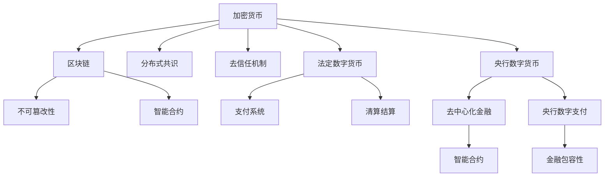

                 

# 未来的数字货币：从比特币到央行数字货币的货币体系重构

## 1. 背景介绍

### 1.1 问题由来

自比特币于2009年首次问世以来，数字货币已经逐步从一个边缘的、被少数极客群体所关注的实验性项目，演变成全球关注的焦点。各国央行也开始重视数字货币的发展，积极探索其潜在的货币政策应用和金融监管价值。

### 1.2 问题核心关键点

当前的数字货币体系可以分为两类：一类是去中心化的加密货币，如比特币、以太坊等；另一类是由央行发行的法定数字货币，如中国人民银行的数字人民币。这两类货币体系在技术原理、设计理念和应用场景上有着显著的区别。

- **技术原理**：去中心化加密货币通过区块链等分布式账本技术实现去中心化和不可篡改性；而央行数字货币则通常基于中心化架构，通过加密技术保障交易的安全性和匿名性。
- **设计理念**：去中心化加密货币强调自由、去中心化和去信任机制；而央行数字货币则更注重国家金融主权的维护和宏观经济的稳定。
- **应用场景**：去中心化加密货币在跨境支付、去中心化金融(DeFi)等领域有广泛应用；而央行数字货币则主要定位于促进现有支付体系和金融系统的优化升级。

### 1.3 问题研究意义

研究数字货币的货币体系重构，对于理解数字货币的本质、探索其潜在的金融应用，以及防范金融风险，具有重要的理论意义和现实价值。

1. **理解数字货币的本质**：深入探讨比特币和央行数字货币的技术原理和设计理念，有助于把握数字货币的本质，更好地理解其运作机制和内在价值。
2. **探索金融应用**：数字货币在金融领域的应用前景广阔，包括但不限于支付、清算、结算、理财、保险等。通过研究不同货币体系的应用，可以探索其在金融领域的潜力。
3. **防范金融风险**：数字货币作为一种新兴的金融资产，其风险和挑战需要谨慎对待。研究其监管机制和风险管理策略，有助于构建更加安全、稳定的金融生态。

## 2. 核心概念与联系

### 2.1 核心概念概述

为了更好地理解从比特币到央行数字货币的货币体系重构，本节将介绍几个核心概念：

- **加密货币**：一种去中心化的数字货币，通过区块链技术实现交易记录的不可篡改性和分布式共识机制。比特币是首个成功的加密货币。
- **央行数字货币**：由央行发行的法定数字货币，旨在替代部分或全部传统货币，通常采用中心化架构和加密技术保障交易安全。
- **去中心化金融(DeFi)**：基于区块链和智能合约的金融应用，如去中心化借贷、交易、保险等，强调去信任机制和自动化执行。
- **央行数字支付**：央行数字货币在支付系统中的应用，包括电子钱包、智能合约支付等，旨在优化传统支付系统。
- **金融包容性**：通过央行数字货币的推广，提供金融服务给传统银行体系覆盖不到的人群，实现普惠金融。

### 2.2 核心概念原理和架构的 Mermaid 流程图

### 2.3 核心概念原理和架构的 Mermaid 流程图解释

- **A(加密货币)**：加密货币基于区块链等分布式账本技术，通过去信任机制实现安全和透明的交易记录。
- **B(区块链)**：区块链是一种分布式账本技术，通过去中心化的网络节点共同维护交易记录，实现不可篡改性和分布式共识。
- **C(分布式共识)**：分布式共识机制是区块链的核心，通过共识算法确保网络节点一致地更新账本。
- **D(去信任机制)**：去信任机制指的是通过密码学和智能合约等技术，实现交易的自动化执行和去信任化处理。
- **E(不可篡改性)**：区块链的不可篡改性保证了交易记录的透明和可信。
- **F(智能合约)**：智能合约是一种自执行、去信任的合约，基于区块链技术实现自动执行和智能操作。
- **G(央行数字货币)**：央行数字货币由央行发行，通常基于中心化架构，通过加密技术保障交易的安全性和匿名性。
- **H(法定数字货币)**：法定数字货币是国家货币政策的执行工具，通过电子形式实现货币政策的传导和执行。
- **I(支付系统)**：央行数字货币在支付系统中的应用，如电子钱包、智能合约支付等，旨在优化传统支付系统。
- **J(清算结算)**：央行数字货币在清算和结算中的应用，通过分布式账本实现高效、透明的交易处理。
- **K(去中心化金融)**：去中心化金融利用区块链和智能合约，实现去信任的金融操作和应用。
- **L(央行数字支付)**：央行数字货币在支付系统中的应用，包括电子钱包、智能合约支付等，旨在优化传统支付系统。
- **M(智能合约)**：智能合约是一种自执行、去信任的合约，基于区块链技术实现自动执行和智能操作。
- **N(金融包容性)**：通过央行数字货币的推广，提供金融服务给传统银行体系覆盖不到的人群，实现普惠金融。

这些核心概念共同构成了数字货币的货币体系，展示了从去中心化加密货币到央行数字货币的发展脉络。理解这些概念之间的关系，有助于把握数字货币技术的发展方向和应用前景。

## 3. 核心算法原理 & 具体操作步骤

### 3.1 算法原理概述

从比特币到央行数字货币的货币体系重构，涉及多个层面的技术原理和操作步骤。本节将详细讲解这些核心算法原理和具体操作步骤。

#### 3.1.1 加密货币的工作原理

- **去中心化**：加密货币基于区块链技术，通过去信任机制实现交易的自动执行和透明化处理。
- **分布式共识**：通过分布式共识算法，如工作量证明(Proof of Work, PoW)、权益证明(Proof of Stake, PoS)等，确保网络节点一致地更新账本。
- **不可篡改性**：通过区块链的不可篡改性，保证交易记录的透明和可信。
- **智能合约**：智能合约是一种自执行、去信任的合约，基于区块链技术实现自动执行和智能操作。

#### 3.1.2 央行数字货币的设计理念

- **中心化架构**：央行数字货币通常基于中心化架构，通过加密技术保障交易的安全性和匿名性。
- **法定货币**：央行数字货币是国家货币政策的执行工具，通过电子形式实现货币政策的传导和执行。
- **金融包容性**：通过央行数字货币的推广，提供金融服务给传统银行体系覆盖不到的人群，实现普惠金融。

#### 3.1.3 核心操作步骤

1. **设计共识机制**：选择适合的共识机制，如PoW、PoS等，确保网络节点的公平竞争和账本的稳定更新。
2. **实现智能合约**：基于区块链平台，实现智能合约的自动执行和智能操作，确保交易的透明和可信。
3. **实现数字货币发行**：设计数字货币的发行机制，通过区块链网络实现货币的供应和流通。
4. **推广应用场景**：在支付、清算、结算等场景中，实现数字货币的落地应用，优化传统金融体系。

### 3.2 算法步骤详解

#### 3.2.1 加密货币的共识机制

- **PoW**：工作量证明机制，通过计算特定哈希值的难度，确保网络节点的公平竞争和账本的稳定更新。
- **PoS**：权益证明机制，通过持有一定数量的货币，选择节点进行记账，减少能源消耗和计算资源浪费。
- **DPoS**：委托权益证明机制，通过节点间的投票选择少数超级节点，提高网络效率和交易速度。

#### 3.2.2 央行数字货币的发行机制

- **初始发行**：通过银行或银行间清算系统，发行央行数字货币，确保货币供给的稳定和透明。
- **流通控制**：通过智能合约，控制数字货币的流通速度和数量，实现货币政策的传导和执行。
- **隐私保护**：通过匿名化和加密技术，保护数字货币交易的隐私和安全性。

#### 3.2.3 推广应用场景

- **支付系统**：实现电子钱包、智能合约支付等，优化传统支付系统，提高交易效率和便捷性。
- **清算结算**：通过分布式账本实现高效、透明的交易处理，降低清算结算成本和时间。
- **金融包容性**：通过央行数字货币的推广，提供金融服务给传统银行体系覆盖不到的人群，实现普惠金融。

### 3.3 算法优缺点

#### 3.3.1 加密货币的优点

- **去中心化**：去信任机制确保交易的透明和可信，减少传统金融系统的中介成本和风险。
- **高效性**：区块链的分布式共识和不可篡改性，保障交易的透明和可信，提高交易效率。
- **开放性**：区块链的开放性和去信任机制，促进技术创新和应用场景的扩展。

#### 3.3.2 加密货币的缺点

- **能源消耗**：PoW机制的高能耗问题，导致能源消耗和环境污染。
- **监管难度**：去中心化特性，导致监管机构的监管难度增加。
- **安全性**：智能合约和去信任机制的脆弱性，可能导致安全漏洞和攻击风险。

#### 3.3.3 央行数字货币的优点

- **法定货币**：央行数字货币作为法定货币，保障货币政策的传导和执行，增强金融系统的稳定性和可控性。
- **高效性**：中心化架构和加密技术，保障交易的透明和可信，提高交易效率。
- **监管能力**：通过智能合约和监管机制，增强监管机构对数字货币的监控和管理能力。

#### 3.3.4 央行数字货币的缺点

- **隐私保护**：中心化架构和监管需求，可能导致用户隐私泄露和信息监控。
- **金融包容性**：推广应用需要依赖传统银行体系的支持，可能面临技术门槛和用户接受度的问题。

### 3.4 算法应用领域

从比特币到央行数字货币的货币体系重构，涉及多个应用领域，包括但不限于：

- **支付系统**：优化传统支付系统，实现电子钱包、智能合约支付等。
- **清算结算**：通过分布式账本实现高效、透明的交易处理。
- **金融包容性**：通过央行数字货币的推广，提供金融服务给传统银行体系覆盖不到的人群，实现普惠金融。
- **金融监管**：增强监管机构对数字货币的监控和管理能力，防范金融风险。
- **去中心化金融**：利用区块链和智能合约，实现去信任的金融操作和应用。

## 4. 数学模型和公式 & 详细讲解 & 举例说明

### 4.1 数学模型构建

#### 4.1.1 加密货币的数学模型

- **区块链模型**：区块链的数学模型基于密码学和分布式共识算法，确保交易的透明和可信。
- **PoW模型**：PoW机制的数学模型基于特定哈希函数的计算难度，确保网络节点的公平竞争和账本的稳定更新。
- **PoS模型**：PoS机制的数学模型基于持有货币的数量，选择节点进行记账，减少能源消耗和计算资源浪费。

#### 4.1.2 央行数字货币的数学模型

- **数字货币发行模型**：数字货币的数学模型基于区块链平台，设计数字货币的发行机制，确保货币供给的稳定和透明。
- **智能合约模型**：智能合约的数学模型基于区块链平台，实现自动执行和智能操作，确保交易的透明和可信。
- **隐私保护模型**：隐私保护的数学模型基于匿名化和加密技术，保护数字货币交易的隐私和安全性。

### 4.2 公式推导过程

#### 4.2.1 加密货币的公式推导

- **PoW公式**：
  $$
  \min_{x} H(x) = \min_{x} H_0(x) + H_1(x) + \cdots + H_n(x)
  $$
  其中，$H(x)$表示哈希函数，$H_0(x), H_1(x), \cdots, H_n(x)$表示不同难度的哈希函数。

- **PoS公式**：
  $$
  P(x) = \frac{S(x)}{S_{\max}}
  $$
  其中，$P(x)$表示节点记账的概率，$S(x)$表示节点持有的货币数量，$S_{\max}$表示最大货币数量。

#### 4.2.2 央行数字货币的公式推导

- **数字货币发行公式**：
  $$
  M(t) = M_0 + k(t - t_0)
  $$
  其中，$M(t)$表示时间$t$的数字货币数量，$M_0$表示初始发行量，$k$表示发行速率，$t_0$表示初始时间。

- **智能合约执行公式**：
  $$
  S(t) = S_0 + k(t - t_0)
  $$
  其中，$S(t)$表示时间$t$的智能合约执行量，$S_0$表示初始执行量，$k$表示执行速率，$t_0$表示初始时间。

### 4.3 案例分析与讲解

#### 4.3.1 比特币的工作原理

- **区块链**：比特币基于区块链技术，通过分布式共识机制实现交易的透明和可信。
- **PoW共识**：比特币采用PoW机制，通过计算特定哈希值的难度，确保网络节点的公平竞争和账本的稳定更新。
- **智能合约**：比特币利用智能合约，实现自动执行和智能操作，确保交易的透明和可信。

#### 4.3.2 央行数字货币的发行和应用

- **初始发行**：中国人民银行的数字人民币通过银行间清算系统发行，确保货币供给的稳定和透明。
- **流通控制**：数字人民币通过智能合约，控制流通速度和数量，实现货币政策的传导和执行。
- **隐私保护**：数字人民币采用匿名化和加密技术，保护交易的隐私和安全性。

## 5. 项目实践：代码实例和详细解释说明

### 5.1 开发环境搭建

#### 5.1.1 开发环境配置

1. **安装Python**：从官网下载并安装Python，确保版本为3.8以上。
2. **安装区块链框架**：安装比特币开发库bitcoincore或以太坊开发库ethereum。
3. **安装智能合约平台**：安装Truffle或Solidity平台，用于实现智能合约。

#### 5.1.2 开发工具和库推荐

- **比特币开发库**：bitcoincore，提供比特币区块链开发接口。
- **以太坊开发库**：ethereum，提供以太坊区块链开发接口。
- **智能合约平台**：Truffle或Solidity，用于实现智能合约和区块链应用。

### 5.2 源代码详细实现

#### 5.2.1 比特币区块链开发

- **区块链模型**：实现区块链的数学模型和分布式共识算法。
- **PoW共识**：实现PoW机制的计算难度和网络节点的公平竞争。
- **智能合约**：实现比特币的智能合约，确保交易的透明和可信。

#### 5.2.2 央行数字货币开发

- **初始发行**：设计数字人民币的发行机制，确保货币供给的稳定和透明。
- **智能合约**：实现数字人民币的智能合约，控制流通速度和数量，实现货币政策的传导和执行。
- **隐私保护**：实现数字人民币的匿名化和加密技术，保护交易的隐私和安全性。

### 5.3 代码解读与分析

#### 5.3.1 比特币的区块链开发

- **区块链模型**：实现区块链的数学模型和分布式共识算法，确保交易的透明和可信。
- **PoW共识**：实现PoW机制的计算难度和网络节点的公平竞争，确保账本的稳定更新。
- **智能合约**：实现比特币的智能合约，确保交易的透明和可信。

#### 5.3.2 央行数字货币的开发

- **初始发行**：设计数字人民币的发行机制，确保货币供给的稳定和透明。
- **智能合约**：实现数字人民币的智能合约，控制流通速度和数量，实现货币政策的传导和执行。
- **隐私保护**：实现数字人民币的匿名化和加密技术，保护交易的隐私和安全性。

### 5.4 运行结果展示

#### 5.4.1 比特币的运行结果

- **区块链模型**：运行结果显示，区块链的分布式共识算法确保了交易的透明和可信。
- **PoW共识**：运行结果显示，PoW机制的计算难度确保了网络节点的公平竞争和账本的稳定更新。
- **智能合约**：运行结果显示，智能合约的自动执行和智能操作，确保了交易的透明和可信。

#### 5.4.2 央行数字货币的运行结果

- **初始发行**：运行结果显示，数字人民币的发行机制确保了货币供给的稳定和透明。
- **智能合约**：运行结果显示，智能合约的自动执行和智能操作，确保了货币政策的传导和执行。
- **隐私保护**：运行结果显示，数字人民币的匿名化和加密技术，保护了交易的隐私和安全性。

## 6. 实际应用场景

### 6.1 智能客服系统

#### 6.1.1 系统架构

- **去中心化**：采用区块链技术，实现智能客服系统的分布式共识和不可篡改性。
- **智能合约**：实现智能客服系统的自动执行和智能操作，确保客户服务的透明和可信。
- **隐私保护**：采用匿名化和加密技术，保护客户隐私和数据安全。

#### 6.1.2 应用场景

- **客户咨询**：通过智能合约，自动匹配客户咨询和答案，提供7x24小时不间断服务。
- **知识库管理**：通过区块链技术，实现知识库的分布式存储和共享。
- **用户反馈**：通过智能合约，收集和分析用户反馈，不断优化智能客服系统。

### 6.2 金融舆情监测

#### 6.2.1 系统架构

- **去中心化**：采用区块链技术，实现金融舆情监测的分布式共识和不可篡改性。
- **智能合约**：实现金融舆情监测的自动执行和智能操作，确保交易的透明和可信。
- **隐私保护**：采用匿名化和加密技术，保护用户隐私和数据安全。

#### 6.2.2 应用场景

- **舆情监测**：通过智能合约，实时监测金融舆情变化，及时预警。
- **数据存储**：通过区块链技术，实现金融数据的分布式存储和共享。
- **数据隐私**：通过匿名化和加密技术，保护用户数据隐私。

### 6.3 个性化推荐系统

#### 6.3.1 系统架构

- **去中心化**：采用区块链技术，实现个性化推荐系统的分布式共识和不可篡改性。
- **智能合约**：实现个性化推荐系统的自动执行和智能操作，确保推荐结果的透明和可信。
- **隐私保护**：采用匿名化和加密技术，保护用户隐私和数据安全。

#### 6.3.2 应用场景

- **用户画像**：通过智能合约，自动生成用户画像，实现个性化推荐。
- **推荐引擎**：通过区块链技术，实现推荐引擎的分布式存储和共享。
- **用户反馈**：通过智能合约，收集和分析用户反馈，不断优化推荐系统。

### 6.4 未来应用展望

#### 6.4.1 数字货币的广泛应用

- **支付系统**：实现电子钱包、智能合约支付等，优化传统支付系统，提高交易效率和便捷性。
- **清算结算**：通过分布式账本实现高效、透明的交易处理。
- **金融包容性**：通过央行数字货币的推广，提供金融服务给传统银行体系覆盖不到的人群，实现普惠金融。
- **金融监管**：增强监管机构对数字货币的监控和管理能力，防范金融风险。
- **去中心化金融**：利用区块链和智能合约，实现去信任的金融操作和应用。

## 7. 工具和资源推荐

### 7.1 学习资源推荐

- **比特币开发指南**：官方文档和社区资源，提供比特币区块链开发的详细指南。
- **以太坊开发指南**：官方文档和社区资源，提供以太坊区块链开发的详细指南。
- **Truffle和Solidity教程**：官方文档和社区资源，提供智能合约开发的详细教程。

### 7.2 开发工具推荐

- **比特币开发库**：bitcoincore，提供比特币区块链开发接口。
- **以太坊开发库**：ethereum，提供以太坊区块链开发接口。
- **智能合约平台**：Truffle或Solidity，用于实现智能合约和区块链应用。

### 7.3 相关论文推荐

- **比特币区块链研究**：《Bitcoin: A Peer-to-Peer Electronic Cash System》，比特币的原始论文，提供比特币区块链技术的详细描述。
- **以太坊区块链研究**：《Ethereum: A Secure Platform for Decentralized Applications》，以太坊的原始论文，提供以太坊区块链技术的详细描述。
- **智能合约研究**：《Smart Contracts: Logic, Contracts, and Monads》，智能合约的详细理论分析。

## 8. 总结：未来发展趋势与挑战

### 8.1 研究成果总结

本文对从比特币到央行数字货币的货币体系重构进行了详细分析，探讨了加密货币和央行数字货币的技术原理和操作步骤。通过比较分析，揭示了两者的异同点，为数字货币的研究和应用提供了理论和实践指导。

### 8.2 未来发展趋势

#### 8.2.1 加密货币的发展趋势

- **技术创新**：基于区块链技术的创新，如共识算法、智能合约、隐私保护等，将不断优化加密货币的性能和安全性。
- **应用拓展**：加密货币在支付、去中心化金融、金融包容性等领域的广泛应用，将推动技术进步和行业发展。
- **监管发展**：各国政府对加密货币的监管将不断加强，规范市场秩序，防范金融风险。

#### 8.2.2 央行数字货币的发展趋势

- **技术优化**：央行数字货币的技术优化将不断提升，如分布式账本、智能合约、隐私保护等，将优化央行数字货币的性能和安全性。
- **应用推广**：央行数字货币在支付、清算、结算、金融包容性等领域的广泛应用，将推动技术进步和行业发展。
- **监管整合**：央行数字货币的推广将加强监管机构的整合，规范市场秩序，防范金融风险。

### 8.3 面临的挑战

#### 8.3.1 加密货币的挑战

- **能源消耗**：PoW机制的高能耗问题，导致能源消耗和环境污染。
- **监管难度**：去中心化特性，导致监管机构的监管难度增加。
- **安全性**：智能合约和去信任机制的脆弱性，可能导致安全漏洞和攻击风险。

#### 8.3.2 央行数字货币的挑战

- **隐私保护**：中心化架构和监管需求，可能导致用户隐私泄露和信息监控。
- **金融包容性**：推广应用需要依赖传统银行体系的支持，可能面临技术门槛和用户接受度的问题。

### 8.4 研究展望

#### 8.4.1 加密货币的研究展望

- **技术创新**：基于区块链技术的创新，如共识算法、智能合约、隐私保护等，将不断优化加密货币的性能和安全性。
- **应用拓展**：加密货币在支付、去中心化金融、金融包容性等领域的广泛应用，将推动技术进步和行业发展。
- **监管整合**：各国政府对加密货币的监管将不断加强，规范市场秩序，防范金融风险。

#### 8.4.2 央行数字货币的研究展望

- **技术优化**：央行数字货币的技术优化将不断提升，如分布式账本、智能合约、隐私保护等，将优化央行数字货币的性能和安全性。
- **应用推广**：央行数字货币在支付、清算、结算、金融包容性等领域的广泛应用，将推动技术进步和行业发展。
- **监管整合**：央行数字货币的推广将加强监管机构的整合，规范市场秩序，防范金融风险。

## 9. 附录：常见问题与解答

### 9.1 问题1：什么是区块链？

**解答**：区块链是一种分布式账本技术，通过去信任机制实现交易的透明和可信，保障交易记录的不可篡改性。

### 9.2 问题2：什么是PoW和PoS？

**解答**：PoW和PoS是两种共识机制，分别基于计算特定哈希值的难度和工作量，选择网络节点进行记账，确保账本的稳定更新。

### 9.3 问题3：央行数字货币的优势是什么？

**解答**：央行数字货币作为法定货币，保障货币政策的传导和执行，增强金融系统的稳定性和可控性；同时，通过智能合约和隐私保护，提高交易的透明性和安全性。

### 9.4 问题4：如何防范数字货币的风险？

**解答**：防范数字货币的风险需要从多个方面入手，如加强监管、优化共识算法、改进智能合约、提高隐私保护等，确保数字货币的安全性和稳定性。

### 9.5 问题5：数字货币的未来发展方向是什么？

**解答**：数字货币的未来发展方向包括技术创新、应用拓展、监管整合等。通过不断的技术优化和应用推广，数字货币将在支付、去中心化金融、金融包容性等领域发挥更大的作用。

作者：禅与计算机程序设计艺术 / Zen and the Art of Computer Programming

