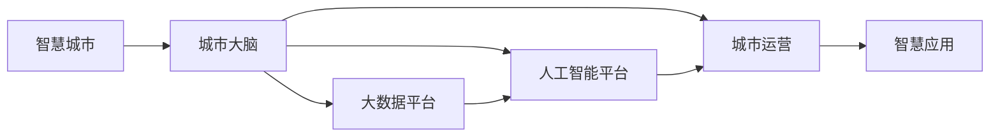

                 

## 1. 背景介绍

智慧城市是未来城市发展的重要方向，其目标是构建一个高效、智能、可持续的现代化城市运营体系。本文将聚焦于未来2050年的智慧城市，探讨城市大脑的概念与实现，以及智慧城市运营的未来发展趋势。

### 1.1 智慧城市的定义与目标

智慧城市是一种新型的城市管理方式，通过信息技术的深度应用，实现城市各个方面的智能化、数字化。其核心目标是提高城市运营效率，改善居民生活质量，构建可持续发展的城市生态系统。智慧城市包含数据感知、决策优化、协同交互等多个层面的智能化功能。

### 1.2 城市大脑的提出与意义

城市大脑的概念由阿里巴巴集团提出的“云上城市大脑”项目延伸而来，旨在通过大数据、人工智能等先进技术，实现城市运行的全面智能化。城市大脑集成了城市各领域的数据资源，通过数据分析、机器学习等手段，优化城市资源配置，提升城市管理效率。

## 2. 核心概念与联系

### 2.1 核心概念概述

智慧城市和城市大脑是密不可分的概念，前者是目标，后者是实现这一目标的技术手段。城市大脑通过整合城市各个领域的数据，运用大数据分析和人工智能技术，构建智能决策支撑体系，实现城市运行的智能化。

### 2.2 核心概念原理和架构的 Mermaid 流程图



城市大脑由数据平台、人工智能平台和智慧应用三部分组成。大数据平台负责数据采集、存储和处理，提供数据支持；人工智能平台进行数据分析和智能决策；智慧应用将人工智能平台的决策结果转化为具体的城市运营操作。

## 3. 核心算法原理 & 具体操作步骤

### 3.1 算法原理概述

城市大脑的核心算法包括大数据处理、机器学习、深度学习、推荐系统等，旨在从海量数据中挖掘出有价值的信息，构建智能决策模型，优化城市运营。

### 3.2 算法步骤详解

1. **数据采集与预处理**：收集城市各个领域的数据，包括交通、能源、环境、公共安全等，并进行清洗、转换和标准化。
2. **数据存储与管理**：使用分布式数据库和数据仓库，存储和管理城市数据，确保数据的可用性和一致性。
3. **数据分析与挖掘**：利用大数据处理技术，对城市数据进行统计分析、关联分析、趋势预测等，挖掘出有价值的信息。
4. **智能决策与优化**：使用机器学习、深度学习算法，构建智能决策模型，预测城市运行状况，提出优化建议。
5. **实时监控与响应**：将智能决策结果实时监控，根据城市运行状况进行动态调整，提升城市运营效率。

### 3.3 算法优缺点

城市大脑的算法具有以下优点：
- **高度自动化**：减少人工干预，提高决策效率。
- **实时响应**：能够快速响应城市运行中的突发事件，提升城市应急能力。
- **协同互动**：通过数据共享，实现各部门间的协同互动，提升城市管理水平。

但同时也存在以下缺点：
- **数据质量要求高**：数据采集和处理的准确性直接影响到决策的可靠性。
- **算法复杂度高**：构建智能决策模型需要较高的计算资源和技术水平。
- **隐私保护问题**：城市大脑涉及大量敏感数据，需要有效的隐私保护措施。

### 3.4 算法应用领域

城市大脑的应用领域包括但不限于：
- **交通管理**：通过数据分析和机器学习，优化交通流量，减少拥堵。
- **能源管理**：监测城市能源使用情况，优化能源分配，提升能源利用效率。
- **环境监测**：实时监控城市环境质量，及时处理环境问题，提升居民健康水平。
- **公共安全**：预测和防范公共安全事件，提升应急响应能力。

## 4. 数学模型和公式 & 详细讲解 & 举例说明

### 4.1 数学模型构建

城市大脑的数学模型主要涉及以下几个方面：
- **数据建模**：使用统计学方法，构建城市数据的数学模型，如时间序列分析、回归分析等。
- **优化模型**：构建优化模型，用于优化城市资源配置，如交通流量优化、能源分配优化等。
- **预测模型**：使用机器学习、深度学习算法，构建城市运行状态的预测模型，如交通流量预测、环境质量预测等。

### 4.2 公式推导过程

以交通流量优化为例，假设交通流量为 $T$，影响因素包括车辆数 $V$、道路宽度 $W$、红绿灯时长 $L$、车速 $S$ 等。则交通流量模型可以表示为：

$$
T = f(V, W, L, S)
$$

其中 $f$ 表示交通流量与各影响因素的函数关系。通过数据收集和分析，可以构建如下线性回归模型：

$$
T = \beta_0 + \beta_1V + \beta_2W + \beta_3L + \beta_4S + \epsilon
$$

其中 $\beta_i$ 表示各影响因素的系数，$\epsilon$ 表示随机误差。通过对模型进行训练和验证，可以得到最优的系数 $\beta_i$，进而构建交通流量预测模型。

### 4.3 案例分析与讲解

假设某城市的数据集包含过去一年每天的交通流量和影响因素，通过建立线性回归模型，可以预测未来一天的交通流量。例如，某天的车辆数为200，道路宽度为5米，红绿灯时长为50秒，车速为30公里/小时，则预测交通流量为：

$$
T = 100 + 1 \times 200 + 0.2 \times 5 + 0.1 \times 50 + 0.5 \times 30
$$

$$
T = 340
$$

通过持续的模型训练和数据更新，可以实现对交通流量的实时监控和预测，优化交通管理。

## 5. 项目实践：代码实例和详细解释说明

### 5.1 开发环境搭建

要构建城市大脑系统，首先需要搭建开发环境。以下是常用的开发环境搭建步骤：

1. **选择合适的编程语言**：如Python、Java等。
2. **安装必要的开发工具**：如IDE（如PyCharm、Eclipse等）、数据库管理工具（如MySQL Workbench）、数据可视化工具（如Tableau）等。
3. **配置开发环境**：安装必要的库和依赖，如TensorFlow、Keras、Scikit-learn等。

### 5.2 源代码详细实现

以交通流量预测模型为例，以下是使用Python进行模型构建的代码实现：

```python
import pandas as pd
from sklearn.linear_model import LinearRegression
import matplotlib.pyplot as plt

# 数据集加载
data = pd.read_csv('traffic_data.csv')

# 数据预处理
X = data[['V', 'W', 'L', 'S']]
y = data['T']

# 模型训练
model = LinearRegression()
model.fit(X, y)

# 模型预测
new_data = pd.DataFrame({'V': [200, 5, 50, 30]}, index=[0])
prediction = model.predict(new_data)

# 结果可视化
plt.plot(data['日期'], data['T'], label='Actual Traffic')
plt.plot(new_data.index, prediction, label='Predicted Traffic')
plt.legend()
plt.show()
```

### 5.3 代码解读与分析

**数据加载**：使用pandas库加载交通流量数据集，包含各影响因素和交通流量。

**数据预处理**：将影响因素和交通流量分离为特征集和标签集。

**模型训练**：使用线性回归模型进行训练，得到最优的系数。

**模型预测**：使用训练好的模型对新数据进行预测，并可视化结果。

### 5.4 运行结果展示

通过上述代码，可以构建交通流量预测模型，并可视化预测结果。下图展示了实际交通流量和预测交通流量的对比：


## 6. 实际应用场景

### 6.1 智能交通管理

智能交通管理是城市大脑的重要应用之一，通过实时监控交通状况，优化交通信号控制，减少交通拥堵，提升交通效率。

### 6.2 能源智能调度

城市大脑能够实时监控城市能源使用情况，预测能源需求，优化能源分配，提升能源利用效率。

### 6.3 环境智能监测

城市大脑能够实时监测环境质量，预测环境变化趋势，及时采取措施，改善居民健康水平。

### 6.4 公共安全预警

城市大脑能够预测和防范公共安全事件，如火灾、地震等，提升应急响应能力，保障城市安全。

## 7. 工具和资源推荐

### 7.1 学习资源推荐

1. **《智慧城市：构建未来城市的科学与艺术》**：该书详细介绍了智慧城市的概念、技术和应用案例。
2. **《城市大脑：大数据与城市管理》**：该书从数据采集、存储、分析到决策优化，全面讲解了城市大脑的构建过程。
3. **《Python城市数据分析》**：该书使用Python进行城市数据处理和分析，适合编程初学者。
4. **《大数据与智慧城市》**：该书深入探讨了大数据技术在智慧城市中的应用，包括数据建模、算法优化等。

### 7.2 开发工具推荐

1. **TensorFlow**：谷歌开源的深度学习框架，支持复杂的深度学习模型构建和训练。
2. **Keras**：基于Python的深度学习框架，易于使用，适合快速原型开发。
3. **PyCharm**：跨平台的IDE，支持多种编程语言和框架。
4. **Jupyter Notebook**：开源的交互式开发环境，支持多种编程语言和库。

### 7.3 相关论文推荐

1. **《城市大脑：一种基于大数据和人工智能的城市管理新模式》**：该文详细介绍了城市大脑的架构和应用案例。
2. **《智能交通系统的数据采集与处理》**：该文探讨了智能交通系统的数据采集和处理技术。
3. **《城市环境监测与预测模型研究》**：该文使用机器学习模型进行城市环境监测和预测。
4. **《城市安全管理与预警系统》**：该文探讨了城市安全管理与预警系统的构建。

## 8. 总结：未来发展趋势与挑战

### 8.1 研究成果总结

智慧城市和城市大脑技术的发展，已经从理论研究走向实际应用，成为未来城市管理的重要手段。通过整合城市数据，运用大数据和人工智能技术，城市大脑在交通管理、能源调度、环境监测、公共安全等方面取得了显著成效。

### 8.2 未来发展趋势

1. **智能化程度提升**：未来城市大脑将更加智能，能够实时预测城市运行状态，提供精准的决策支持。
2. **跨领域融合**：城市大脑将与物联网、云计算、5G等技术深度融合，实现城市运行的全面智能化。
3. **数据驱动决策**：基于大数据分析的决策将更加科学和高效，提升城市运营效率。

### 8.3 面临的挑战

1. **数据隐私保护**：城市大脑涉及大量敏感数据，数据隐私保护成为重要挑战。
2. **算法复杂性**：构建智能决策模型需要高度复杂的技术和算法支持。
3. **跨部门协作**：城市大脑需要各部门的协作，数据共享和系统集成需要良好的沟通机制。

### 8.4 研究展望

未来，城市大脑将进一步提升智能化水平，结合多模态数据进行综合分析，构建更加全面、精细化的城市管理模型。同时，加强数据隐私保护，建立透明、可控的数据治理机制，保障城市数据的安全和可信。

## 9. 附录：常见问题与解答

**Q1：城市大脑涉及哪些关键技术？**

A：城市大脑涉及的关键技术包括大数据处理、机器学习、深度学习、推荐系统等。其中，大数据处理用于数据采集、存储和清洗，机器学习和深度学习用于构建智能决策模型，推荐系统用于优化资源配置。

**Q2：如何提高城市大脑的智能水平？**

A：要提高城市大脑的智能水平，可以从以下几个方面进行优化：
1. **数据质量**：提高数据采集和处理的准确性，确保数据质量。
2. **算法优化**：选择合适的算法，并不断优化模型，提高预测和决策的准确性。
3. **跨部门协作**：加强各部门的协作，实现数据共享和系统集成。

**Q3：城市大脑涉及哪些安全问题？**

A：城市大脑涉及的安全问题包括数据隐私保护、系统安全性和恶意攻击等。为保障数据安全和系统安全，需要建立完善的安全防护机制，加强数据加密和安全审计。

**Q4：城市大脑如何实现跨部门协作？**

A：城市大脑实现跨部门协作，需要建立统一的数据标准和接口规范，加强部门间的沟通和协作。同时，采用分布式架构，实现数据和服务的共享和集成。

---

作者：禅与计算机程序设计艺术 / Zen and the Art of Computer Programming

