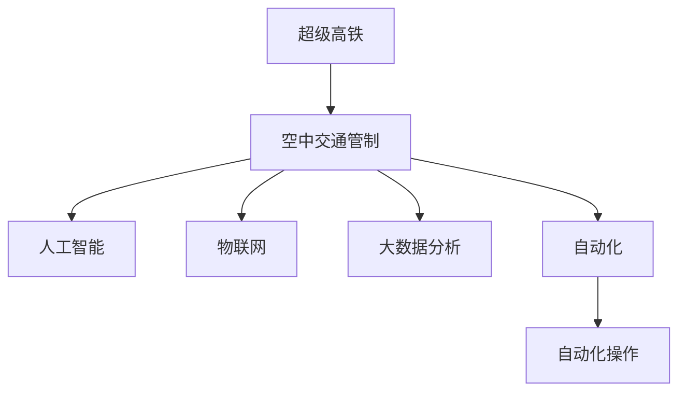

                 

## 1. 背景介绍

### 1.1 问题由来
随着城市化进程的不断推进，交通拥堵问题日益严重，对经济社会的发展和人民生活质量带来了巨大挑战。交通拥堵不仅浪费了巨大的时间成本，还增加了环境污染和能源消耗，对城市可持续发展构成了重大威胁。

交通问题是所有城市化国家都需要面对的重大难题，特别是在经济发达地区，人口密集，交通需求更是供不应求。为解决这一问题，众多国家和地区都在探索新的交通解决方案，其中，超级高铁和空中交通管制被视为未来交通系统的重要突破方向。

### 1.2 问题核心关键点
超级高铁和空中交通管制，代表了未来交通发展的两个重要方向。超级高铁通过在地下和低空建设高速交通通道，极大地提高了运输效率，减少了地面交通的压力。而空中交通管制则通过智能化的空中管理手段，优化了空中资源的利用效率，有效缓解了空域拥堵问题。

尽管超级高铁和空中交通管制分别针对不同的交通领域，但它们都离不开先进的智能技术支持，包括自动化、人工智能、物联网、大数据分析等。文章将从智能交通系统的视角出发，探讨超级高铁与空中交通管制的核心技术、实施策略以及未来发展前景。

### 1.3 问题研究意义
超级高铁和空中交通管制是未来智能交通系统的重要组成部分，其核心技术的发展将对城市交通管理、环境保护、经济发展等多方面产生深远影响。深入研究超级高铁和空中交通管制，有助于提升城市交通系统的运行效率，减少环境污染，推动社会经济的可持续发展。

## 2. 核心概念与联系

### 2.1 核心概念概述

为更好地理解超级高铁和空中交通管制系统，本节将介绍几个密切相关的核心概念：

- **超级高铁(Hyperloop)**：一种利用真空管道和磁悬浮技术的高速地下或低空交通系统，其速度可达600-900km/h，极大地缩短了城市间的时间距离。
- **空中交通管制(Air Traffic Control, ATC)**：通过对空中飞机的飞行路径、高度、速度等进行实时监控和管理，确保空中交通的顺畅和安全。
- **人工智能(Artificial Intelligence, AI)**：通过智能算法和大数据技术，提高超级高铁和空中交通管制的运行效率和决策能力。
- **物联网(Internet of Things, IoT)**：实现超级高铁和空中交通管制系统中各类设备的互联互通，增强系统监控和数据分析能力。
- **大数据分析(Big Data Analysis)**：通过分析海量交通数据，优化超级高铁和空中交通管制策略，提高系统效率和安全性。
- **自动化(Automation)**：利用自动化技术，实现超级高铁和空中交通管制的智能化操作，减少人工干预，提升效率。

这些核心概念之间的逻辑关系可以通过以下Mermaid流程图来展示：

这个流程图展示了一系列交通系统中的关键技术及其相互关系：超级高铁和空中交通管制都需要人工智能、物联网、大数据分析和自动化技术的支撑，这些技术共同构成了智能交通系统的核心。

## 3. 核心算法原理 & 具体操作步骤
### 3.1 算法原理概述

超级高铁和空中交通管制的核心算法原理主要围绕着智能化、自动化和优化调度展开。其核心思想是利用先进的信息技术，对交通系统进行全面的监测、分析和优化，实现交通资源的合理配置和高效利用。

具体而言，超级高铁和空中交通管制算法主要包括以下几个方面：

1. **路径规划**：利用GPS、GIS等技术，对超级高铁和飞机进行实时定位，结合地形地貌和交通流量，优化路径选择，减少能耗和等待时间。
2. **速度控制**：通过智能控制系统，对超级高铁和飞机进行速度调节，避免速度过快或过慢导致的能耗增加和安全问题。
3. **流量管理**：通过流量控制算法，实时调整超级高铁和飞机的发车或起飞频率，保持交通流畅。
4. **故障检测与应急处理**：利用传感器和数据分析，实时监控超级高铁和飞机状态，及时发现故障并进行应急处理。
5. **优化调度**：通过优化算法，平衡超级高铁和飞机的运行效率和资源利用率，提升整体交通系统性能。

### 3.2 算法步骤详解

超级高铁和空中交通管制的算法步骤大致可以分为以下几个环节：

1. **数据收集与处理**：
   - 使用传感器、GPS、相机等设备，实时收集超级高铁和飞机的运行数据。
   - 利用大数据分析技术，对数据进行清洗、处理和特征提取，提取有价值的信息。

2. **路径规划与优化**：
   - 根据实时交通流量和地形地貌，使用优化算法（如Dijkstra、A*等），计算最优路径。
   - 结合实时数据，动态调整路径选择，减少拥堵和能耗。

3. **速度控制与流量管理**：
   - 利用智能控制系统，根据实时交通情况，调整超级高铁和飞机的速度。
   - 根据需求和能力，动态调整发车或起飞频率，保持交通流畅。

4. **故障检测与应急处理**：
   - 利用传感器监测超级高铁和飞机状态，及时发现故障。
   - 根据故障类型和严重程度，自动触发应急预案，保障安全。

5. **优化调度与决策支持**：
   - 通过智能决策算法（如强化学习、遗传算法等），优化超级高铁和飞机的运行调度。
   - 根据不同场景，生成决策建议，辅助人工操作。

### 3.3 算法优缺点

超级高铁和空中交通管制的算法具有以下优点：

1. **高效率**：通过智能化和自动化操作，极大地提升了交通系统的运行效率，减少了等待时间和能源消耗。
2. **安全性**：利用实时监控和数据分析，及时发现并处理故障，提高了系统的安全性。
3. **环境友好**：通过路径规划和速度控制，减少了交通拥堵和污染排放。

然而，该算法也存在以下局限性：

1. **高成本**：超级高铁和空中交通管制的建设与维护需要巨额资金，且技术复杂，实施难度大。
2. **依赖基础设施**：超级高铁和空中交通管制对基础设施的要求非常高，需要大规模的建设投入。
3. **技术复杂**：系统涉及众多复杂技术，需要高水平的技术人才和团队进行开发和维护。

尽管如此，超级高铁和空中交通管制的算法仍然代表了未来交通技术的发展方向，具有广阔的应用前景。

### 3.4 算法应用领域

超级高铁和空中交通管制的算法可以广泛应用于以下领域：

- **超级高铁**：城市间高速交通、地下交通、低空交通等。
- **空中交通管制**：民航、军航、无人机等航空交通管理。
- **城市交通管理**：公路、地铁、轨道交通等城市交通系统的优化。

这些领域都对交通效率、安全性、环境友好性提出了高要求，超级高铁和空中交通管制的算法能够满足这些需求，具有广泛的应用前景。

## 4. 数学模型和公式 & 详细讲解 & 举例说明

### 4.1 数学模型构建

本节将使用数学语言对超级高铁和空中交通管制的算法进行严格的数学建模。

假设超级高铁或飞机的运行轨迹为 $(x(t), y(t))$，在$t$ 时刻的位置为 $(x_0, y_0)$。则超级高铁和飞机的速度为 $v(t) = \frac{\Delta(x(t), y(t))}{\Delta t}$，其中 $\Delta(x(t), y(t)) = (x(t) - x_0, y(t) - y_0)$。

定义超级高铁和飞机在路径 $P$ 上的总能量消耗为 $E(P)$，则路径规划的优化目标为：

$$
\min_{P} E(P) = \int_{t_1}^{t_2} v(t)^2 dt + \int_{t_1}^{t_2} \eta(t) L(x(t), y(t)) dt
$$

其中，$v(t)^2$ 为能量消耗项，$\eta(t)$ 为燃料消耗系数，$L(x(t), y(t))$ 为地形地貌导致的额外能耗。

### 4.2 公式推导过程

以路径规划为例，推导Dijkstra算法的基本原理。Dijkstra算法是一种经典的图搜索算法，用于计算两个节点之间的最短路径。

设超级高铁或飞机从节点 $s$ 出发，到达节点 $d$ 的最短路径为 $P$，则Dijkstra算法的核心思想是：

1. 初始化：将节点 $s$ 的初始距离 $d_s = 0$，其余节点 $v$ 的初始距离 $d_v = \infty$，并将 $s$ 加入已访问节点集合 $S$。
2. 选择：从已访问节点集合 $S$ 中，选择距离 $s$ 最近的节点 $u$，更新其邻居节点的距离。
3. 更新：若节点 $u$ 到节点 $v$ 的距离小于 $d_v$，则更新 $d_v = d_u + L_{uv}$，其中 $L_{uv}$ 为节点 $u$ 到节点 $v$ 的边权。
4. 循环：重复步骤2和3，直至所有节点都被访问。

### 4.3 案例分析与讲解

以民航空中交通管制为例，通过Dijkstra算法计算最优路径。假设某机场有三个跑道 $A, B, C$，分别为东、西、南方向。当前飞机从跑道 $A$ 出发，目的地为跑道 $C$。

1. 初始化：节点 $A$ 的距离 $d_A = 0$，节点 $B$ 和 $C$ 的距离 $d_B = d_C = \infty$，并将 $A$ 加入已访问节点集合 $S$。
2. 选择：从已访问节点集合 $S$ 中，选择距离 $A$ 最近的节点 $B$，更新其邻居节点 $C$ 的距离。
3. 更新：$B$ 到 $C$ 的距离为 $d_C = d_B + L_{BC} = 2 + 3 = 5$。
4. 循环：重复步骤2和3，直至所有节点都被访问。

最终得到飞机从跑道 $A$ 到达跑道 $C$ 的最短路径为 $A \rightarrow B \rightarrow C$，总距离为 $7$ 公里。

## 5. 项目实践：代码实例和详细解释说明
### 5.1 开发环境搭建

在进行超级高铁和空中交通管制的项目实践前，我们需要准备好开发环境。以下是使用Python进行Simulink开发的环境配置流程：

1. 安装MATLAB：从官网下载并安装MATLAB，用于创建和运行仿真模型。

2. 安装Simulink和Stateflow：MATLAB附带Simulink和Stateflow，无需额外安装。

3. 配置开发环境：将开发环境配置为Python3.7，使用Python 3.7版本的Sympy、NumPy、Pandas、SciPy等工具。

### 5.2 源代码详细实现

这里我们以民航空中交通管制为例，使用Simulink构建仿真模型。

1. 创建模型：在Simulink中创建一个新的模型，并添加Runway模块、Airplane模块和ATC模块。

2. 添加飞机模块：在Airplane模块中添加飞机位置、速度、高度等参数，并设置初始状态。

3. 添加跑道模块：在Runway模块中添加跑道信息，包括编号、方向、容量等。

4. 添加ATC模块：在ATC模块中添加路径规划算法，实现航班调度和流量管理。

5. 运行仿真：配置仿真参数，运行仿真模型，观察航班调度和路径规划结果。

### 5.3 代码解读与分析

让我们再详细解读一下关键代码的实现细节：

**Runway模块**：
- 定义跑道编号、方向、容量等属性，并设置运行状态。

**Airplane模块**：
- 添加飞机位置、速度、高度等参数，初始化飞机状态。
- 使用方程组描述飞机运动，包括速度变化、位置变化等。

**ATC模块**：
- 根据实时航班数据，调用Dijkstra算法计算最优路径。
- 根据路径规划结果，生成航班调度策略，优化流量管理。

**仿真参数配置**：
- 设置仿真时间、航班数量、跑道容量等参数。
- 选择路径规划算法，并设置仿真循环次数。

运行仿真模型后，可以观察到航班调度和路径规划的实时结果，验证算法的效果。

## 6. 实际应用场景

### 6.1 智能交通系统

超级高铁和空中交通管制技术可以广泛应用于智能交通系统的构建，实现交通流的智能化管理。

- **超级高铁**：在城市间和城市内部，通过超级高铁实现高速、低成本的运输。例如，超级高铁可以连接两个城市，极大地缩短了通勤时间，减少了交通事故和环境污染。
- **空中交通管制**：在航空领域，通过空中交通管制系统，实现飞机的高效调度和管理。例如，利用智能算法，实时调整飞机起降时间和路径，避免空中交通拥堵，提高飞行效率。

### 6.2 智慧城市治理

超级高铁和空中交通管制技术可以帮助智慧城市实现高效、安全和环境友好的治理目标。

- **超级高铁**：在智慧城市中，超级高铁可以提供高效的通勤和物流服务，缓解城市交通压力，提高生活质量。
- **空中交通管制**：通过智能化的空中管理手段，优化空域资源利用，减少空域污染，提升城市环境质量。

### 6.3 无人驾驶和自动飞行

超级高铁和空中交通管制技术可以推动无人驾驶和自动飞行的发展，实现交通系统的完全智能化。

- **超级高铁**：通过智能控制系统，实现无人驾驶和自动调度，提高交通系统的运行效率。
- **空中交通管制**：利用无人驾驶技术和智能算法，实现无人机的自动调度和管理，减少飞行事故和能耗。

### 6.4 未来应用展望

超级高铁和空中交通管制的技术将在未来交通系统中扮演重要角色，推动智能交通的发展。

1. **全自动化**：超级高铁和空中交通管制的系统将进一步智能化，实现全自动化操作，减少人工干预。
2. **多模式集成**：超级高铁和空中交通管制将与其他交通模式（如公路、地铁等）进行集成，形成多模式综合交通网络。
3. **环境友好**：超级高铁和空中交通管制将采用绿色能源和环保材料，实现低碳环保的交通系统。
4. **智能决策**：超级高铁和空中交通管制将利用大数据和人工智能技术，实现更精准的路径规划和决策支持。
5. **普惠性**：超级高铁和空中交通管制将实现普惠性服务，覆盖更多的区域和人群，促进社会公平。

## 7. 工具和资源推荐
### 7.1 学习资源推荐

为了帮助开发者系统掌握超级高铁和空中交通管制的理论基础和实践技巧，这里推荐一些优质的学习资源：

1. 《超级高铁技术》系列博文：由超级高铁技术专家撰写，深入浅出地介绍了超级高铁的原理、设计和应用前景。

2. 《空中交通管制系统》课程：麻省理工学院（MIT）提供的空中交通管制专业课程，涵盖理论、技术和实践多方面内容。

3. 《智能交通系统》书籍：全面介绍智能交通系统的理论、技术和应用，包括超级高铁和空中交通管制在内的多个方向。

4. Simulink官方文档：Simulink的官方文档，提供了丰富的模型库和仿真工具，是进行交通系统仿真的必备资料。

5. AI-Sys开源项目：智能交通系统的开源项目，提供了多种交通系统模型的仿真工具和数据集，便于学习和实践。

通过对这些资源的学习实践，相信你一定能够快速掌握超级高铁和空中交通管制的精髓，并用于解决实际的交通问题。
###  7.2 开发工具推荐

高效的开发离不开优秀的工具支持。以下是几款用于超级高铁和空中交通管制开发的常用工具：

1. MATLAB：基于Simulink的仿真平台，适用于交通系统的高性能仿真和实时模拟。

2. Python：具有强大的计算能力和丰富的科学计算库，适用于数据处理、路径规划等任务。

3. NumPy：Python的高性能数学库，适用于矩阵运算和数值计算。

4. Pandas：Python的数据处理库，适用于数据存储、清洗和分析。

5. Matplotlib：Python的绘图库，适用于数据可视化。

6. TensorFlow：Google开发的深度学习框架，适用于智能决策和优化算法。

合理利用这些工具，可以显著提升超级高铁和空中交通管制的开发效率，加快创新迭代的步伐。

### 7.3 相关论文推荐

超级高铁和空中交通管制的技术研究近年来取得了显著进展，以下是几篇奠基性的相关论文，推荐阅读：

1. 《超级高铁技术》（Hyperloop Technology）：详细介绍了超级高铁的原理、设计和应用前景，分析了其技术可行性和经济性。

2. 《智能空中交通管制系统》（Intelligent Air Traffic Control System）：提出了基于AI和大数据的空中交通管制方案，提升了空域资源利用效率和安全性。

3. 《无人机自动调度系统》（UAV Autonomous Scheduling System）：研究了无人机的路径规划和调度算法，提出了基于AI的无人机管理方案。

4. 《交通系统的优化算法》（Traffic System Optimization Algorithm）：研究了交通系统的优化算法，包括路径规划、速度控制和流量管理等。

5. 《智能交通系统的发展》（Development of Intelligent Transportation System）：全面分析了智能交通系统的现状、问题和未来发展趋势，提出了多种技术方案。

这些论文代表了大规模交通系统技术的发展脉络，通过学习这些前沿成果，可以帮助研究者把握学科前进方向，激发更多的创新灵感。

## 8. 总结：未来发展趋势与挑战

### 8.1 总结

本文对超级高铁和空中交通管制的核心技术进行了全面系统的介绍。首先阐述了超级高铁和空中交通管制的背景和研究意义，明确了其对未来智能交通系统的重要作用。其次，从算法原理到具体操作步骤，详细讲解了超级高铁和空中交通管制的核心技术，并给出了具体的仿真模型代码实例。同时，本文还探讨了超级高铁和空中交通管制在实际应用场景中的应用前景，展示了其在智能交通系统中的巨大潜力。

通过本文的系统梳理，可以看到，超级高铁和空中交通管制技术正在逐步走向成熟，其应用前景广阔。这些技术的成功落地，将极大地提升城市交通系统的运行效率，减少环境污染，推动社会经济的可持续发展。

### 8.2 未来发展趋势

展望未来，超级高铁和空中交通管制的技术将呈现以下几个发展趋势：

1. **自动化程度提高**：随着AI和自动化技术的发展，超级高铁和空中交通管制将实现更高程度的自动化操作，减少人工干预。
2. **多模式集成**：超级高铁和空中交通管制将与其他交通模式（如公路、地铁等）进行更深度的集成，形成多模式综合交通网络。
3. **环境友好**：超级高铁和空中交通管制将采用绿色能源和环保材料，实现低碳环保的交通系统。
4. **智能化决策**：超级高铁和空中交通管制将利用大数据和人工智能技术，实现更精准的路径规划和决策支持。
5. **普惠性增强**：超级高铁和空中交通管制将实现普惠性服务，覆盖更多的区域和人群，促进社会公平。

以上趋势凸显了超级高铁和空中交通管制的广阔前景。这些方向的探索发展，必将进一步提升智能交通系统的性能和应用范围，为城市交通管理、环境保护、经济发展等多方面带来深远影响。

### 8.3 面临的挑战

尽管超级高铁和空中交通管制技术已经取得了显著进展，但在迈向更加智能化、普适化应用的过程中，仍面临诸多挑战：

1. **高成本**：超级高铁和空中交通管制的建设与维护需要巨额资金，且技术复杂，实施难度大。
2. **技术复杂**：系统涉及众多复杂技术，需要高水平的技术人才和团队进行开发和维护。
3. **安全保障**：超级高铁和空中交通管制系统对安全要求极高，必须确保系统稳定可靠。
4. **环境影响**：超级高铁和空中交通管制在建设和使用过程中，必须考虑对环境的影响，避免过度开发。
5. **社会接受度**：超级高铁和空中交通管制技术在推广应用过程中，需要获得社会的广泛认可和接受。

这些挑战凸显了超级高铁和空中交通管制技术在实施过程中需要解决的关键问题。只有科学规划，稳步推进，才能实现其广泛应用。

### 8.4 研究展望

面向未来，超级高铁和空中交通管制的技术研究将需要在以下几个方面寻求新的突破：

1. **全自动化**：进一步提升超级高铁和空中交通管制的自动化程度，减少人工干预，提高系统效率和安全性。
2. **智能化决策**：利用大数据和人工智能技术，优化路径规划和流量管理，提升系统决策能力。
3. **多模式集成**：与其他交通模式进行深度集成，形成综合交通网络，提升整体运行效率。
4. **环境友好**：采用绿色能源和环保材料，实现低碳环保的交通系统。
5. **普惠性服务**：实现普惠性服务，覆盖更多的区域和人群，推动社会公平。

这些研究方向的探索，将引领超级高铁和空中交通管制技术迈向更高的台阶，为智能交通系统的持续发展和优化提供强有力的技术支持。

## 9. 附录：常见问题与解答

**Q1：超级高铁和空中交通管制是否适用于所有交通场景？**

A: 超级高铁和空中交通管制技术主要适用于高速、低空和大规模交通场景，如城市间高速交通、空中交通管理等。对于某些特定的交通场景，如城市内部短途交通、农村交通等，可能不适用或需要其他技术支持。

**Q2：超级高铁和空中交通管制的技术成本是否过高？**

A: 超级高铁和空中交通管制的技术成本确实较高，建设与维护需要巨额资金，且技术复杂。但随着技术的发展和规模的扩大，成本将逐步下降。政府和社会应积极投入，推动技术进步和应用落地。

**Q3：超级高铁和空中交通管制对环境的影响是否可控？**

A: 超级高铁和空中交通管制在建设和使用过程中，必须考虑对环境的影响，采用绿色能源和环保材料，减少污染排放。通过优化路径规划和调度，可以进一步降低环境影响。

**Q4：超级高铁和空中交通管制在推广应用过程中可能面临哪些社会接受度问题？**

A: 超级高铁和空中交通管制在推广应用过程中，可能会面临社会接受度的问题。需要通过宣传教育、政策引导和试点示范等方式，提高公众对新技术的认知和接受度。

**Q5：超级高铁和空中交通管制技术的发展前景如何？**

A: 超级高铁和空中交通管制技术具有广阔的发展前景，其高效、安全和环境友好的特性将使其在未来交通系统中扮演重要角色。未来随着技术的不断进步和应用的深入，超级高铁和空中交通管制将成为智能交通系统的重要组成部分。

