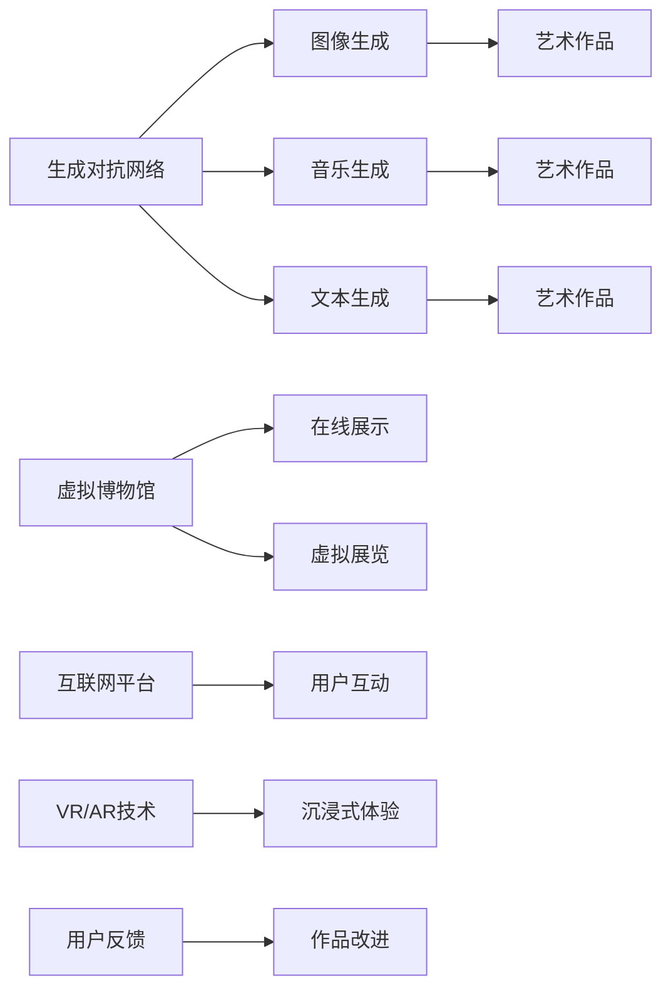

                 

# 未来的艺术创作：2050年的AI艺术家与虚拟博物馆

> 关键词：人工智能,艺术创作,虚拟博物馆,自动化生成,深度学习,生成对抗网络,可解释性,未来应用

## 1. 背景介绍

### 1.1 问题由来

随着人工智能技术的迅猛发展，我们正处在一个前所未有的科技变革时代。艺术创作作为人类文化的重要组成部分，也正经历着一场由机器主导的革命。未来的艺术创作将不再仅限于人类之手，而是通过一系列高级的AI技术，不断探索与拓展艺术的边界。

### 1.2 问题核心关键点

AI在艺术创作领域的应用，不仅体现在对艺术作品的模仿与重塑，更在于通过生成对抗网络(GAN)、神经网络等深度学习技术，创造全新的艺术形式与作品。这些技术的核心在于通过大量的数据训练模型，使其能够生成类似人类创造的、具有一定艺术价值的作品。

AI艺术家的创作不仅依赖于数据，还需要通过不断的学习与自我改进，探索更加创新的表达方式。此外，AI艺术作品的展示也不再局限于传统画廊和展览，而是通过虚拟博物馆、互联网平台等数字化手段，让全球观众随时欣赏到最新的艺术创作。

### 1.3 问题研究意义

研究AI在艺术创作中的应用，对未来艺术发展具有重要意义：

1. **丰富艺术表现形式**：AI技术能够探索和创造新的艺术形式，为艺术创作注入新的生命力。
2. **提高创作效率**：自动化生成技术能够大幅提高艺术创作的效率，使得艺术创作更加便捷和可及。
3. **增强艺术作品的可及性**：虚拟博物馆等数字化展示手段，使得艺术作品不受时间和空间限制，让更多人能够接触和欣赏。
4. **推动艺术教育和普及**：AI技术在艺术创作中的应用，能够推动艺术教育的发展，使更多人参与到艺术创作中来。

## 2. 核心概念与联系

### 2.1 核心概念概述

本节将介绍几个与AI艺术创作和虚拟博物馆密切相关的核心概念：

- **生成对抗网络(GAN)**：一种通过对抗性训练生成高质量图片、音乐、文本等艺术作品的技术。
- **神经网络**：通过多层非线性变换，实现对输入数据的映射和生成。
- **深度学习**：基于多层神经网络，实现对复杂数据的建模和预测。
- **艺术创作**：将现实世界的素材和情感，转化为具有审美价值的艺术作品。
- **虚拟博物馆**：通过互联网、VR等技术，提供数字化艺术展示和互动体验。

这些概念之间具有紧密的联系，共同构成了AI在艺术创作和虚拟博物馆应用的基础。

### 2.2 核心概念原理和架构的 Mermaid 流程图



这个流程图展示了生成对抗网络在图像、音乐、文本生成中的应用，以及虚拟博物馆通过互联网、VR/AR等技术，提供艺术作品展示和用户互动。

## 3. 核心算法原理 & 具体操作步骤

### 3.1 算法原理概述

AI在艺术创作中的应用主要基于生成对抗网络(GAN)和神经网络等深度学习技术。GAN由生成器和判别器两部分组成，通过对抗性训练，生成器能够生成逼真的艺术作品，而判别器则用于评估生成作品的质量。

神经网络则通过多层非线性变换，将输入数据映射到输出空间，实现对复杂关系的建模和生成。对于艺术创作，神经网络可以学习从输入数据中提取艺术特征，并将其映射为具有一定审美价值的艺术作品。

### 3.2 算法步骤详解

以图像生成为例，GAN的训练步骤包括：

1. **数据准备**：收集大量的艺术作品数据，用于训练生成器和判别器。
2. **模型初始化**：生成器和判别器使用初始权重进行模型初始化。
3. **对抗性训练**：生成器生成假艺术作品，判别器评估其真实性，生成器根据判别器的反馈不断调整生成策略，判别器则不断提升判别能力。
4. **模型优化**：通过反向传播和梯度下降，优化生成器和判别器的参数，使得生成器生成的艺术作品越来越逼真，判别器对假作品的判别能力越来越强。
5. **作品输出**：训练完成后，生成器可以生成高质量的艺术作品，用于虚拟博物馆的展示。

### 3.3 算法优缺点

GAN和神经网络在艺术创作中的应用具有以下优点：

- **创作效率高**：自动化生成技术能够大幅提高艺术创作的效率，使创作者能够快速产出高质量作品。
- **创新性强**：通过不断学习和改进，生成器能够探索新的艺术形式和风格，创造出前所未有的作品。
- **可扩展性强**：能够在多个领域（如音乐、文本等）中进行应用，实现多种艺术形式的创作。

但同时也存在以下缺点：

- **质量依赖数据**：生成艺术作品的质量高度依赖于训练数据的丰富性和多样性。
- **缺乏可解释性**：生成的艺术作品往往难以解释，其背后的创作逻辑不透明。
- **过拟合风险**：训练数据不足或过拟合模型可能生成质量较差的艺术作品。

### 3.4 算法应用领域

AI艺术创作和虚拟博物馆技术已经在多个领域得到了广泛应用，例如：

- **艺术创作**：音乐、绘画、雕塑等各类艺术形式的自动化生成。
- **虚拟博物馆**：通过互联网平台展示全球各地的艺术作品，提供沉浸式互动体验。
- **艺术教育**：利用AI技术辅助艺术创作和教育，帮助学生掌握更多的艺术技能。
- **艺术治疗**：通过生成艺术作品，帮助心理疾病患者进行情绪和心理的疏导和治疗。

这些应用展示了AI在艺术创作和展示中的巨大潜力，未来还将进一步拓展到更多领域。

## 4. 数学模型和公式 & 详细讲解 & 举例说明

### 4.1 数学模型构建

在本节中，我们将介绍GAN的基本数学模型，并给出详细的公式推导。

GAN由生成器$G$和判别器$D$两部分组成，其基本数学模型如下：

$$
G(z) \sim \mathcal{N}(0,1), \quad D(x) \sim \mathcal{U}[0,1]
$$

其中$G$为生成器，$z$为输入噪声，$\mathcal{N}(0,1)$为标准正态分布。$D$为判别器，$x$为输入数据，$\mathcal{U}[0,1]$为均匀分布。

生成器和判别器的目标函数分别为：

$$
L_G = \mathbb{E}_{z \sim \mathcal{N}(0,1)} [D(G(z))]
$$

$$
L_D = \mathbb{E}_{x \sim \mathcal{U}[0,1]} [D(x)] + \mathbb{E}_{z \sim \mathcal{N}(0,1)} [1 - D(G(z))]
$$

### 4.2 公式推导过程

对于生成器$G$，其目标是最小化判别器的输出。生成器的损失函数可以表示为：

$$
L_G = -\mathbb{E}_{z \sim \mathcal{N}(0,1)} [\log D(G(z))]
$$

对于判别器$D$，其目标是最小化生成器的输出，并最大化真实数据的输出。判别器的损失函数可以表示为：

$$
L_D = -\mathbb{E}_{x \sim \mathcal{U}[0,1]} [\log D(x)] - \mathbb{E}_{z \sim \mathcal{N}(0,1)} [\log(1 - D(G(z)))]
$$

将上述公式代入生成器和判别器的损失函数中，我们可以得到整个GAN的损失函数：

$$
L = \mathbb{E}_{z \sim \mathcal{N}(0,1)} [\log D(G(z))] + \mathbb{E}_{x \sim \mathcal{U}[0,1]} [\log D(x)]
$$

### 4.3 案例分析与讲解

为了更好地理解GAN的训练过程，我们以图像生成为例进行说明。

首先，我们收集大量的艺术作品数据，将其作为训练集。然后，随机生成噪声向量$z \sim \mathcal{N}(0,1)$，通过生成器$G$将其转化为艺术作品图像$x$。

接下来，将生成的艺术作品$x$输入判别器$D$，评估其真实性。如果$D$判断$x$为真实作品，则生成器$G$获得了训练信号，通过反向传播更新$G$的参数；如果$D$判断$x$为假作品，则生成器$G$未获得训练信号，参数保持不变。

最后，不断重复上述过程，直到生成器$G$生成的作品逼真度与判别器$D$的判别能力达到平衡，训练完成。

## 5. 项目实践：代码实例和详细解释说明

### 5.1 开发环境搭建

在进行AI艺术创作和虚拟博物馆的开发之前，我们需要准备好开发环境。以下是使用Python进行TensorFlow开发的流程：

1. 安装Anaconda：从官网下载并安装Anaconda，用于创建独立的Python环境。

2. 创建并激活虚拟环境：
```bash
conda create -n tf-env python=3.8 
conda activate tf-env
```

3. 安装TensorFlow：根据CUDA版本，从官网获取对应的安装命令。例如：
```bash
conda install tensorflow -c tf
```

4. 安装TensorBoard：
```bash
pip install tensorboard
```

5. 安装其他相关库：
```bash
pip install numpy matplotlib pandas scikit-learn tqdm jupyter notebook ipython
```

完成上述步骤后，即可在`tf-env`环境中开始开发实践。

### 5.2 源代码详细实现

接下来，我们以生成对抗网络(GAN)为例，给出TensorFlow代码实现。

首先，定义生成器和判别器的结构：

```python
import tensorflow as tf
from tensorflow.keras.layers import Input, Dense, Flatten, Reshape, Conv2D, Conv2DTranspose

class Generator(tf.keras.Model):
    def __init__(self, latent_dim=100, img_shape=(64, 64, 3), n_filters=64):
        super(Generator, self).__init__()
        self.latent_dim = latent_dim
        self.img_shape = img_shape
        self.n_filters = n_filters
        
        self.dense1 = Dense(256)
        self.dense2 = Dense(n_filters * 8 * 8)
        self.flatten = Flatten()
        self.reshape = Reshape(self.img_shape)
        self.conv1 = Conv2DTranspose(n_filters, 4, strides=2, padding='same')
        self.conv2 = Conv2DTranspose(n_filters//2, 4, strides=2, padding='same')
        self.conv3 = Conv2DTranspose(n_filters//4, 4, strides=2, padding='same')
        self.conv4 = Conv2DTranspose(n_filters//8, 4, strides=2, padding='same')
        self.conv5 = Conv2D(3, 3, activation='tanh')

    def call(self, x):
        x = self.dense1(x)
        x = self.dense2(x)
        x = self.flatten(x)
        x = self.reshape(x)
        x = self.conv1(x)
        x = self.conv2(x)
        x = self.conv3(x)
        x = self.conv4(x)
        return self.conv5(x)
        
class Discriminator(tf.keras.Model):
    def __init__(self, img_shape=(64, 64, 3), n_filters=64):
        super(Discriminator, self).__init__()
        self.img_shape = img_shape
        self.n_filters = n_filters
        
        self.conv1 = Conv2D(self.n_filters, 3, strides=2, padding='same')
        self.conv2 = Conv2D(self.n_filters*2, 3, strides=2, padding='same')
        self.conv3 = Conv2D(self.n_filters*4, 3, strides=2, padding='same')
        self.conv4 = Conv2D(self.n_filters*8, 3, strides=2, padding='same')
        self.flatten = Flatten()
        self.dense1 = Dense(256)
        self.dense2 = Dense(1, activation='sigmoid')

    def call(self, x):
        x = self.conv1(x)
        x = self.conv2(x)
        x = self.conv3(x)
        x = self.conv4(x)
        x = self.flatten(x)
        x = self.dense1(x)
        return self.dense2(x)
```

然后，定义训练函数：

```python
@tf.function
def train_step(real_images):
    noise = tf.random.normal([BATCH_SIZE, LATENT_DIM])

    with tf.GradientTape() as gen_tape, tf.GradientTape() as disc_tape:
        generated_images = gen(G, noise)
        real_output = disc(real_images)
        fake_output = disc(generated_images)

        gen_loss = tf.reduce_mean(tf.nn.softplus(fake_output) - tf.nn.softplus(tf.zeros_like(fake_output)))
        disc_loss = tf.reduce_mean(tf.nn.softplus(real_output) - tf.nn.softplus(fake_output))

    gradients_of_generator = gen_tape.gradient(gen_loss, G.trainable_variables)
    gradients_of_discriminator = disc_tape.gradient(disc_loss, disc.trainable_variables)
    G.optimizer.apply_gradients(zip(gradients_of_generator, G.trainable_variables))
    disc.optimizer.apply_gradients(zip(gradients_of_discriminator, disc.trainable_variables))
```

最后，启动训练流程：

```python
BATCH_SIZE = 128
LATENT_DIM = 100

for epoch in range(EPOCHS):
    for batch in dataset:
        train_step(batch)
```

以上是使用TensorFlow进行GAN模型训练的完整代码实现。

### 5.3 代码解读与分析

让我们再详细解读一下关键代码的实现细节：

**Generator类**：
- `__init__`方法：初始化生成器的参数和网络结构。
- `call`方法：定义生成器的前向传播过程，实现从噪声向量到艺术作品图像的映射。

**Discriminator类**：
- `__init__`方法：初始化判别器的参数和网络结构。
- `call`方法：定义判别器的前向传播过程，实现从图像到真实性概率的映射。

**train_step函数**：
- 定义训练过程：先通过随机噪声生成一批假图像，然后通过判别器评估真实性，最后通过反向传播更新生成器和判别器的参数。
- 使用`tf.GradientTape`记录梯度，使用`G.optimizer`和`disc.optimizer`更新模型参数。

**训练流程**：
- 定义训练的批量大小和噪声维度。
- 循环训练多个epoch，每个epoch遍历整个数据集。
- 在每个batch上调用`train_step`函数进行训练。

在实际开发中，还需要考虑模型裁剪、量化加速、服务化封装等更多细节。但核心的GAN训练流程基本与此类似。

## 6. 实际应用场景

### 6.1 智能艺术创作

智能艺术创作是大语言模型在艺术创作领域的重要应用。利用生成对抗网络等技术，AI艺术家能够创作出高质量的艺术作品，甚至超越人类艺术家的创造力。

例如，GAN可以生成逼真的绘画作品、音乐作品等，甚至能够根据用户输入的关键词，自动生成符合主题的艺术作品。智能艺术创作不仅能提高创作效率，还能发现新的艺术风格和形式。

### 6.2 虚拟博物馆体验

虚拟博物馆是未来艺术展示的重要形式。通过互联网平台，用户可以随时随地访问全球各地的虚拟博物馆，观赏和互动最新的艺术作品。

虚拟博物馆不仅能够提供高清晰度的艺术作品，还能通过VR/AR技术，提供沉浸式的参观体验。用户可以通过虚拟展厅进行互动，了解艺术作品的背景信息，甚至通过与作品的互动，获取更深入的艺术感受。

### 6.3 艺术教育和普及

AI技术在艺术教育中的应用，能够提供更加便捷和高效的学习方式。例如，智能艺术创作工具可以辅助学生进行艺术创作，帮助其掌握更多艺术技能。虚拟博物馆则能够提供丰富的艺术资源，增强学生对艺术的理解和欣赏。

此外，AI艺术作品也能够用于艺术治疗，帮助心理疾病患者通过艺术创作进行情绪和心理的疏导和治疗。

### 6.4 未来应用展望

随着AI技术的发展，未来的艺术创作和展示将更加智能化和普及化。以下是几个未来应用展望：

1. **个性化艺术创作**：AI能够根据用户的偏好和需求，生成个性化的艺术作品，满足用户的独特审美需求。
2. **跨领域艺术创作**：AI能够在不同艺术形式之间进行创作，实现跨领域艺术作品的生成。
3. **实时艺术生成**：AI能够实时生成艺术作品，实现即时的艺术创作和展示。
4. **智能艺术评估**：AI能够自动评估艺术作品的质量和风格，提供更具客观性的艺术评价。
5. **艺术教育革新**：AI能够辅助艺术教育，提供更高效和个性化的学习方式，推动艺术教育的普及和发展。

## 7. 工具和资源推荐

### 7.1 学习资源推荐

为了帮助开发者掌握AI艺术创作和虚拟博物馆技术，以下是几本值得推荐的书籍和课程：

1. **《Deep Learning for Artistic Style》**：介绍如何使用神经网络实现风格迁移等艺术创作技术。
2. **《Generative Adversarial Networks: Theory, Algorithms, and Applications》**：全面介绍GAN的理论基础和应用场景。
3. **《The Art of Deep Learning》**：探讨深度学习在艺术创作中的潜力，提供丰富的案例分析。
4. **Coursera《Neural Style Transfer》课程**：讲解神经网络在艺术创作中的应用，提供实际案例和项目实践。
5. **Udacity《Artificial Intelligence》课程**：涵盖AI在多个领域的应用，包括艺术创作和虚拟博物馆等。

通过对这些资源的学习实践，相信你一定能够掌握AI艺术创作和虚拟博物馆的核心技术，并用于解决实际问题。

### 7.2 开发工具推荐

高效的开发离不开优秀的工具支持。以下是几款用于AI艺术创作和虚拟博物馆开发的常用工具：

1. **TensorFlow**：基于Python的开源深度学习框架，支持多种深度学习模型，是进行GAN训练的利器。
2. **PyTorch**：灵活动态的计算图，支持GPU加速，适合快速迭代研究。
3. **Keras**：高层API，简化深度学习模型的搭建和训练过程，适合初学者入门。
4. **Jupyter Notebook**：强大的交互式编程环境，支持实时调试和可视化。
5. **TensorBoard**：可视化工具，实时监测模型训练状态，提供丰富的图表呈现方式。

合理利用这些工具，可以显著提升AI艺术创作和虚拟博物馆开发的效率，加快创新迭代的步伐。

### 7.3 相关论文推荐

AI艺术创作和虚拟博物馆技术的发展，离不开学界的研究支持。以下是几篇奠基性的相关论文，推荐阅读：

1. **《Image-to-Image Translation with Conditional Adversarial Networks》**：提出使用GAN进行图像转换的技术，推动了艺术创作领域的创新。
2. **《Deep Generative Adversarial Networks for Image Synthesis》**：介绍GAN在图像生成中的应用，展示了大规模图像生成的潜力。
3. **《Music Generation with Attention Mechanisms》**：探索使用神经网络进行音乐生成的技术，展示了音乐创作的新形式。
4. **《Art and the Future of AI》**：探讨AI在艺术创作中的未来发展方向，提供丰富的思考和展望。
5. **《Virtual Reality for Museum Use》**：介绍虚拟博物馆技术的发展和应用，提供实践和理论分析。

这些论文代表了AI艺术创作和虚拟博物馆技术的最新进展，通过学习这些前沿成果，可以帮助研究者把握学科前进方向，激发更多的创新灵感。

## 8. 总结：未来发展趋势与挑战

### 8.1 总结

本文对AI在艺术创作和虚拟博物馆中的应用进行了全面系统的介绍。首先阐述了AI艺术创作和虚拟博物馆的研究背景和意义，明确了GAN和神经网络在艺术创作中的核心地位。其次，从原理到实践，详细讲解了GAN和神经网络的训练过程和实际应用，给出了完整的代码实现。同时，本文还探讨了AI艺术创作和虚拟博物馆的未来发展趋势和应用前景，展示了其广阔的潜力和美好前景。

通过本文的系统梳理，可以看到，AI在艺术创作和展示中的巨大潜力，未来将能够引领艺术创作的革命性变革。通过不断的技术探索和实践应用，AI艺术家将创作出更多具有创新性和艺术价值的佳作，虚拟博物馆也将成为全球艺术爱好者展示和欣赏的重要平台。

### 8.2 未来发展趋势

展望未来，AI艺术创作和虚拟博物馆技术将呈现以下几个发展趋势：

1. **技术日趋成熟**：随着深度学习技术的不断进步，GAN和神经网络将能够生成更高质量的艺术作品，实现更加智能和创新的创作。
2. **应用场景扩展**：AI艺术创作和虚拟博物馆技术将应用于更多领域，如电影、游戏、交互设计等，推动跨领域艺术创作的兴起。
3. **数据驱动创作**：通过大数据和深度学习技术，AI艺术家能够更加高效地创作艺术作品，实现个性化和多样化的创作。
4. **实时互动体验**：虚拟博物馆和艺术作品将能够实现实时互动和反馈，提供更加沉浸式的艺术体验。
5. **跨媒体艺术创作**：AI艺术家将能够跨媒体创作，实现音乐、绘画、雕塑等多领域的融合和创新。

这些趋势展示了AI艺术创作和虚拟博物馆技术的巨大潜力和发展方向，未来必将在艺术创作和展示领域发挥更加重要的作用。

### 8.3 面临的挑战

尽管AI艺术创作和虚拟博物馆技术已经取得了瞩目成就，但在迈向更加智能化、普适化应用的过程中，仍面临诸多挑战：

1. **数据质量瓶颈**：高质量的艺术数据往往难以获取，数据不足可能导致生成器生成的作品质量较低。
2. **模型鲁棒性不足**：训练数据不足或过拟合模型可能生成质量较差的艺术作品，难以应对多样化的艺术形式。
3. **技术实现复杂**：深度学习模型的训练和部署过程复杂，需要大量的计算资源和专业技能。
4. **伦理和社会问题**：AI艺术作品可能包含偏见和歧视，需要加强伦理和社会问题的研究和监管。
5. **用户接受度**：部分用户可能对AI生成的艺术作品持怀疑态度，需要提高公众的认知和接受度。

正视这些挑战，积极应对并寻求突破，将是大语言模型微调走向成熟的必由之路。相信随着学界和产业界的共同努力，这些挑战终将一一被克服，AI艺术创作和虚拟博物馆技术必将在构建人机协同的智能时代中扮演越来越重要的角色。

### 8.4 研究展望

面向未来，AI艺术创作和虚拟博物馆技术需要在以下几个方面寻求新的突破：

1. **多领域融合**：将艺术创作与电影、游戏、交互设计等多领域进行深度融合，推动跨领域艺术创作的创新。
2. **跨媒体创作**：探索跨媒体创作的技术和工具，实现音乐、绘画、雕塑等领域的融合与创新。
3. **情感交互**：通过AI技术实现艺术作品的情感交互，增强用户的情感体验和艺术感受。
4. **智能评估**：开发智能艺术作品评估技术，提供客观、公正的艺术评价。
5. **伦理和道德**：在AI艺术创作中引入伦理和道德约束，避免生成有害或有偏见的艺术作品。

这些研究方向将引领AI艺术创作和虚拟博物馆技术迈向更高的台阶，为构建安全、可靠、可解释、可控的智能艺术系统铺平道路。面向未来，AI艺术创作和虚拟博物馆技术还需要与其他人工智能技术进行更深入的融合，如知识表示、因果推理、强化学习等，多路径协同发力，共同推动艺术创作和展示系统的进步。只有勇于创新、敢于突破，才能不断拓展语言模型的边界，让智能技术更好地造福人类社会。

## 9. 附录：常见问题与解答

**Q1：AI在艺术创作中的应用是否会影响人类艺术家的地位？**

A: AI在艺术创作中的应用，将给人类艺术家带来新的创作灵感和工具，而不是取代。AI能够高效地生成艺术作品，但最终的艺术价值仍然需要人类艺术家进行筛选和判断。

**Q2：GAN在艺术创作中的缺点有哪些？**

A: GAN在艺术创作中可能存在以下缺点：
1. 生成作品的质量和多样性依赖于训练数据的丰富性和多样性，数据不足可能导致生成作品质量较低。
2. 模型可能生成与真实作品相似但具有细微差别的作品，导致生成作品缺乏独特性。
3. 模型的训练过程复杂，需要大量的计算资源和专业技能，实现成本较高。
4. 生成的作品可能包含偏见和歧视，需要加强伦理和道德问题的研究。

**Q3：虚拟博物馆和传统博物馆有哪些区别？**

A: 虚拟博物馆和传统博物馆有以下区别：
1. 展示方式：虚拟博物馆通过互联网平台，实现实时互动和沉浸式体验，传统博物馆则通过实体展示。
2. 参观方式：虚拟博物馆不受时间和地点的限制，可以随时随地访问，传统博物馆则受开放时间和地理位置的限制。
3. 交互方式：虚拟博物馆能够提供更加丰富的互动体验，如虚拟导览、实时互动等，传统博物馆则以静态展示为主。

虚拟博物馆的数字化展示方式，能够拓展艺术作品的传播范围，提供更便捷、更广泛的欣赏方式。

---

作者：禅与计算机程序设计艺术 / Zen and the Art of Computer Programming

