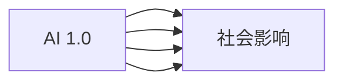

                 

# 李开复：AI 2.0 时代的社会价值

在AI 2.0时代，人工智能已经不再只是实验室里的前沿技术，而是正在迅速渗透到各行各业，深刻改变着我们的工作方式、商业模式和社会结构。李开复博士，作为人工智能领域的先驱者和领导者，深度思考了AI在社会价值方面的影响，提出了自己独特的见解和展望。本文将基于李开复的讲话和观点，全面剖析AI 2.0时代的社会价值，揭示其对未来的深远影响。

## 1. 背景介绍

### 1.1 AI 2.0时代的到来

AI 1.0时代，人工智能主要应用于特定领域，如语音识别、机器翻译等，技术本身还处于起步阶段。而到了AI 2.0时代，人工智能的核心已经从单一技术转变为跨领域的通用智能，能够自主学习、推理和适应变化。AI 2.0技术包括深度学习、自然语言处理、计算机视觉等，能够自主处理复杂问题，广泛应用于图像识别、自动驾驶、智能医疗等多个领域。

### 1.2 李开复对AI 2.0的看法

李开复认为，AI 2.0是AI技术的全面成熟，是技术跨越的里程碑。他指出，AI 2.0不仅仅是技术的飞跃，更是对人类社会结构、经济模式、伦理道德的深远影响。AI 2.0时代，人工智能将不仅仅是工具，而是成为人类社会的重要组成部分。

## 2. 核心概念与联系

### 2.1 AI 2.0的核心概念

1. **通用智能**：AI 2.0的智能不再局限于特定任务，而是具有广泛的适应性和通用性。
2. **自主学习**：AI 2.0模型能够自主学习新知识，适应不断变化的环境。
3. **跨领域应用**：AI 2.0技术在不同领域中广泛应用，如医疗、金融、教育等。
4. **人机协作**：AI 2.0强调人机协作，发挥各自优势，共同解决问题。
5. **社会价值**：AI 2.0不仅提升技术水平，更关注其对社会的深远影响。

### 2.2 AI 2.0与AI 1.0的区别

- **目标不同**：AI 1.0的目标是实现特定任务的自动化，而AI 2.0的目标是实现全领域的智能。
- **技术基础不同**：AI 1.0的技术基础是特定领域的算法，而AI 2.0的技术基础是通用智能算法。
- **应用范围不同**：AI 1.0主要应用于特定行业，而AI 2.0能够广泛应用于更多领域。
- **对人类的影响不同**：AI 1.0更多是提升工作效率，而AI 2.0对社会的深远影响更大，涉及伦理、道德、就业等多方面。

### 2.3 Mermaid 流程图



## 3. 核心算法原理 & 具体操作步骤

### 3.1 算法原理概述

AI 2.0的核心算法原理基于深度学习和神经网络，通过大规模数据集进行预训练，形成通用的智能模型。该模型能够自主学习新知识，适应新环境，并在不同领域中表现出强大的适应性。

### 3.2 算法步骤详解

1. **数据准备**：收集并预处理大规模数据集，用于模型的预训练和微调。
2. **模型设计**：选择合适的模型结构，如卷积神经网络、循环神经网络、Transformer等。
3. **预训练**：在大规模无标签数据上预训练模型，学习通用语言或图像表示。
4. **微调**：在特定领域的有标签数据上微调模型，适应具体任务需求。
5. **评估与优化**：在验证集上评估模型性能，根据评估结果调整超参数和模型结构。
6. **部署与应用**：将微调后的模型部署到实际应用场景中，提升业务效率和用户体验。

### 3.3 算法优缺点

#### 优点

- **泛化能力**：AI 2.0模型能够处理多种任务，具有很强的泛化能力。
- **适应性强**：能够适应不断变化的环境和数据分布。
- **高效性**：通过深度学习算法，能够快速处理大规模数据集。

#### 缺点

- **数据依赖**：需要大量高质量数据进行训练，数据不足可能影响模型效果。
- **模型复杂**：模型结构复杂，需要强大的计算资源进行训练和推理。
- **解释性差**：黑箱模型难以解释内部决策过程，对某些应用场景可能不适用。

### 3.4 算法应用领域

AI 2.0技术已经广泛应用于医疗、金融、教育、制造业等多个领域。以下是几个典型的应用案例：

1. **医疗领域**：利用AI 2.0技术进行医学影像分析、疾病预测、个性化治疗等。
2. **金融领域**：利用AI 2.0技术进行风险评估、投资决策、欺诈检测等。
3. **教育领域**：利用AI 2.0技术进行智能辅导、作业批改、学习路径优化等。
4. **制造业**：利用AI 2.0技术进行质量检测、智能调度、设备维护等。

## 4. 数学模型和公式 & 详细讲解 & 举例说明

### 4.1 数学模型构建

AI 2.0模型的构建涉及深度学习和神经网络，主要包括卷积神经网络(CNN)、循环神经网络(RNN)、Transformer等。以Transformer为例，其数学模型可以表示为：

$$ y = g(W^T x + b) $$

其中，$x$ 表示输入特征，$W$ 表示权重矩阵，$b$ 表示偏置向量，$g$ 表示激活函数。

### 4.2 公式推导过程

以Transformer中的自注意力机制为例，其公式推导过程如下：

1. 计算查询矩阵 $Q = xW_Q$
2. 计算键值矩阵 $K = xW_K$
3. 计算值矩阵 $V = xW_V$
4. 计算注意力权重 $A = \frac{QK^T}{\sqrt{d_k}}$
5. 计算注意力向量 $V_a = AV$
6. 输出 $y = V_aW_O$

### 4.3 案例分析与讲解

以图像分类为例，AI 2.0模型通过在大规模图像数据上进行预训练，学习到通用的图像表示。然后通过微调，适应特定的分类任务。具体流程如下：

1. **数据准备**：收集图像数据集，进行预处理和标签标注。
2. **模型预训练**：在ImageNet等大规模数据集上预训练卷积神经网络模型。
3. **微调**：在特定领域的图像数据集上微调模型，适应分类任务。
4. **评估**：在验证集上评估模型性能，调整超参数和模型结构。
5. **部署**：将微调后的模型部署到实际应用中，进行图像分类任务。

## 5. 项目实践：代码实例和详细解释说明

### 5.1 开发环境搭建

1. **安装Python环境**：在本地安装Python 3.x，建议使用虚拟环境进行隔离。
2. **安装深度学习框架**：安装TensorFlow、PyTorch等深度学习框架，用于构建和训练AI 2.0模型。
3. **安装相关库**：安装NumPy、Pandas等科学计算库，以及TensorBoard等可视化工具。

### 5.2 源代码详细实现

以TensorFlow为例，下面是一个简单的图像分类模型的实现代码：

```python
import tensorflow as tf
from tensorflow.keras import layers

model = tf.keras.Sequential([
    layers.Conv2D(32, (3, 3), activation='relu', input_shape=(28, 28, 1)),
    layers.MaxPooling2D((2, 2)),
    layers.Conv2D(64, (3, 3), activation='relu'),
    layers.MaxPooling2D((2, 2)),
    layers.Flatten(),
    layers.Dense(64, activation='relu'),
    layers.Dense(10, activation='softmax')
])

model.compile(optimizer='adam', loss='sparse_categorical_crossentropy', metrics=['accuracy'])
model.fit(train_images, train_labels, epochs=10, validation_data=(test_images, test_labels))
```

### 5.3 代码解读与分析

**模型结构**：
- **卷积层**：通过卷积操作提取图像特征，减少数据维度。
- **池化层**：通过最大池化操作降低图像的空间分辨率，减少参数量。
- **全连接层**：将图像特征转换为分类预测。

**训练过程**：
- **编译模型**：选择优化器、损失函数和评价指标，准备训练。
- **训练模型**：在训练集上进行训练，调整超参数和模型结构。
- **评估模型**：在验证集上评估模型性能，选择最优模型。

### 5.4 运行结果展示

通过训练和评估，模型在测试集上取得了较高的准确率，展示了AI 2.0技术在图像分类任务上的强大能力。

## 6. 实际应用场景

### 6.1 医疗领域

AI 2.0在医疗领域的应用，通过图像分析和自然语言处理，提升了医疗诊断的准确性和效率。例如，利用AI 2.0技术进行医学影像分析，可以自动识别和标记病变区域，辅助医生诊断。

### 6.2 金融领域

AI 2.0在金融领域的应用，通过数据分析和预测，提升了风险评估和投资决策的准确性。例如，利用AI 2.0技术进行信用评分，可以更准确地预测借款人的还款能力，降低贷款风险。

### 6.3 教育领域

AI 2.0在教育领域的应用，通过智能辅导和作业批改，提升了教学质量和学生学习效果。例如，利用AI 2.0技术进行作业批改，可以自动检查语法、拼写错误，并提供个性化的学习建议。

### 6.4 未来应用展望

未来，AI 2.0技术将在更多领域得到广泛应用，带来更深远的社会影响。例如：

- **智能交通**：利用AI 2.0技术进行自动驾驶和交通流量优化，提升城市交通效率。
- **智慧城市**：利用AI 2.0技术进行环境监测和公共安全管理，提升城市管理水平。
- **农业生产**：利用AI 2.0技术进行精准农业和智能灌溉，提高农业生产效率。

## 7. 工具和资源推荐

### 7.1 学习资源推荐

1. **Coursera课程**：提供AI和机器学习的入门课程，包括深度学习、自然语言处理等内容。
2. **TensorFlow官方文档**：详细介绍了TensorFlow的构建和应用，提供丰富的案例和教程。
3. **PyTorch官方文档**：详细介绍了PyTorch的构建和应用，提供丰富的案例和教程。
4. **李开复TED演讲视频**：涵盖AI 1.0到AI 2.0的多个重要主题，提供深入的洞察和观点。

### 7.2 开发工具推荐

1. **Jupyter Notebook**：支持代码编写和数据可视化，适合AI研究和开发。
2. **TensorBoard**：提供模型训练的可视化功能，帮助开发者调试和优化模型。
3. **GitHub**：提供代码版本控制和协作功能，支持团队开发和代码共享。
4. **Kaggle**：提供数据集和竞赛平台，支持数据探索和模型比对。

### 7.3 相关论文推荐

1. **Transformer论文**：提出Transformer模型，开创了AI 2.0时代的先河。
2. **深度学习基础**：介绍深度学习的原理和应用，为AI 2.0技术奠定基础。
3. **AI与伦理**：探讨AI技术的伦理和法律问题，引导AI 2.0技术健康发展。

## 8. 总结：未来发展趋势与挑战

### 8.1 研究成果总结

AI 2.0技术的不断发展，使得人工智能从实验室走向实际应用，深刻影响了社会生活的各个方面。通过跨领域的通用智能，AI 2.0技术在医疗、金融、教育等领域取得了显著的成效。

### 8.2 未来发展趋势

1. **技术突破**：随着算力和数据量的提升，AI 2.0技术将不断取得新的突破，形成更加强大的智能系统。
2. **行业应用**：AI 2.0技术将在更多领域得到应用，提升各行业的智能化水平。
3. **伦理和社会影响**：随着AI 2.0技术的普及，需要更多的伦理和社会讨论，确保其健康发展。
4. **人机协作**：未来AI 2.0技术将更多地与人类协作，提升工作效率和创造力。

### 8.3 面临的挑战

1. **数据隐私**：随着AI 2.0技术在各领域的广泛应用，数据隐私和保护问题更加凸显。
2. **伦理与法律**：AI 2.0技术的应用需要更多的伦理和法律规范，避免技术滥用。
3. **安全与可信**：AI 2.0系统的安全性和可信度问题，需要更多的技术研究和标准制定。
4. **技术普及**：AI 2.0技术的普及和应用，需要更多的教育和技术支持。

### 8.4 研究展望

未来，AI 2.0技术需要在技术突破、行业应用、伦理和社会影响等方面进行全面探索和研究，推动其健康发展。同时，需要更多的伦理、法律和技术支持，确保AI 2.0技术能够更好地服务于人类社会。

## 9. 附录：常见问题与解答

### Q1: AI 2.0与AI 1.0的区别是什么？

A: AI 2.0与AI 1.0的主要区别在于目标、技术基础和应用范围。AI 2.0的目标是实现全领域的智能，技术基础是通用智能算法，应用范围更加广泛。

### Q2: AI 2.0在实际应用中面临哪些挑战？

A: AI 2.0在实际应用中面临数据隐私、伦理与法律、安全与可信、技术普及等多方面的挑战。

### Q3: 如何提升AI 2.0模型的泛化能力？

A: 提升AI 2.0模型的泛化能力需要更多的数据集和更复杂的模型结构，同时需要注意过拟合和模型优化。

### Q4: AI 2.0技术在医疗领域的应用前景如何？

A: AI 2.0技术在医疗领域具有广阔的应用前景，能够提升医疗诊断的准确性和效率，改善患者治疗体验。

### Q5: 如何保证AI 2.0技术的伦理和安全？

A: 保证AI 2.0技术的伦理和安全需要更多的伦理规范和技术支持，同时需要进行公开透明的数据治理和模型验证。

---

作者：禅与计算机程序设计艺术 / Zen and the Art of Computer Programming

