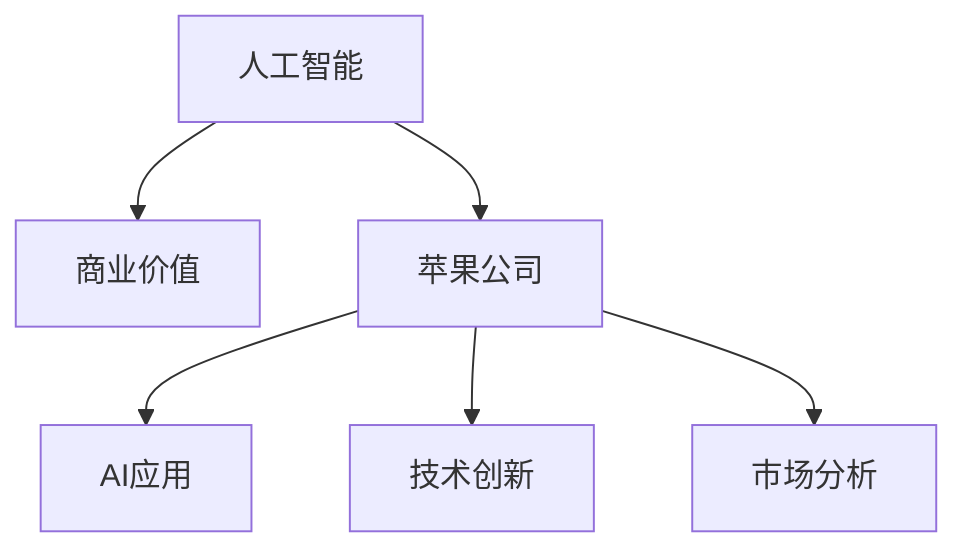

                 

# 李开复：苹果发布AI应用的商业价值

> 关键词：人工智能,商业价值,苹果,AI应用,技术创新,市场分析

## 1. 背景介绍

### 1.1 问题由来
在科技迅猛发展的今天，人工智能(AI)技术已成为推动全球经济增长的关键驱动力。特别是在制造业、金融业、零售业等行业，AI应用不断创新，极大提升了效率和生产力。然而，尽管AI在技术上取得了显著进展，其在商业领域的应用仍面临诸多挑战。如何最大化AI的商业价值，成为业内人士亟需关注的焦点。

### 1.2 问题核心关键点
AI技术的商业价值主要体现在以下几个方面：提升运营效率、创造新的商业模式、增强客户体验等。本文将重点讨论苹果公司如何通过AI应用来提升其商业价值，分析其技术实现和市场策略。

## 2. 核心概念与联系

### 2.1 核心概念概述

为更好地理解苹果公司AI应用的商业价值，本节将介绍几个密切相关的核心概念：

- 人工智能(Artificial Intelligence, AI)：通过计算机模拟人的认知过程，使机器能够处理复杂任务和环境。AI技术包括机器学习、深度学习、自然语言处理等。

- 商业价值(Business Value)：AI技术在商业应用中带来的经济效益和竞争优势。

- 苹果公司(Apple Inc.)：全球知名的科技公司，以其创新的硬件和软件产品而闻名。

- AI应用(AI Application)：利用AI技术实现的特定业务功能，如智能客服、智能推荐、图像识别等。

- 技术创新(Technological Innovation)：通过引入新技术或改进现有技术，提升产品或服务的质量和效率。

- 市场分析(Market Analysis)：通过对市场环境、竞争状况、消费者需求等因素的分析，制定商业策略。

这些核心概念之间的逻辑关系可以通过以下Mermaid流程图来展示：



这个流程图展示了大语言模型的核心概念及其之间的关系：

1. 人工智能通过技术创新支持AI应用。
2. 苹果公司通过AI应用提升商业价值。
3. 市场分析指导苹果公司的AI应用策略。

## 3. 核心算法原理 & 具体操作步骤

### 3.1 算法原理概述

苹果公司AI应用的商业价值主要体现在以下几个方面：提升运营效率、创造新的商业模式、增强客户体验等。本文将重点讨论苹果公司如何通过AI应用来提升其商业价值，分析其技术实现和市场策略。

### 3.2 算法步骤详解

**Step 1: 选择合适的AI应用场景**
苹果公司通过市场分析和用户反馈，筛选出最有可能提升商业价值的AI应用场景。例如，智能客服、图像识别、智能推荐等。

**Step 2: 构建AI应用框架**
苹果公司搭建了适用于多领域的AI应用框架，支持多种AI模型和算法，如卷积神经网络、递归神经网络等。

**Step 3: 数据准备和模型训练**
苹果公司准备大量标注数据，用于训练AI模型。通过模型训练，使AI模型能够学习到数据的特征，并预测结果。

**Step 4: 模型部署和测试**
苹果公司将训练好的AI模型部署到实际应用中，并进行多轮测试，确保模型性能符合预期。

**Step 5: 优化和迭代**
苹果公司根据用户反馈和测试结果，不断优化AI模型，改进算法和模型架构。

### 3.3 算法优缺点

苹果公司AI应用的优点包括：

- 提高运营效率。AI技术在生产、物流、客服等领域的应用，极大地提升了工作效率和准确性。
- 创造新的商业模式。AI技术支持平台型服务，如苹果应用商店、Apple Music等，实现了内容推荐、广告投放等新型商业模式。
- 增强客户体验。通过智能推荐、个性化服务，提升用户满意度。

缺点包括：

- 数据需求高。AI模型的训练和优化需要大量高质量数据，数据收集和标注成本较高。
- 技术复杂度高。AI模型的设计和优化需要高度专业的知识和技术背景。
- 隐私和安全问题。AI应用处理大量用户数据，如何保护隐私和数据安全是一大挑战。

### 3.4 算法应用领域

苹果公司AI应用的领域包括但不限于以下几类：

- 智能客服：利用自然语言处理和机器学习技术，实现24/7在线客服。
- 图像识别：在苹果相机应用中，利用AI技术进行人脸识别、场景检测等。
- 智能推荐：在苹果应用商店和Apple Music中，利用AI技术实现个性化内容推荐。
- 自动化生产：在制造业领域，利用AI技术实现设备自动化、品质检测等。
- 金融服务：利用AI技术进行风险评估、欺诈检测等。

## 4. 数学模型和公式 & 详细讲解  
### 4.1 数学模型构建

苹果公司AI应用的数学模型主要涉及机器学习和深度学习的理论，以下是一些关键模型的介绍：

- 卷积神经网络(Convolutional Neural Network, CNN)：用于图像识别、语音识别等任务，能够提取局部特征。
- 递归神经网络(Recurrent Neural Network, RNN)：用于处理序列数据，如自然语言处理中的文本分类、情感分析等。
- 长短期记忆网络(Long Short-Term Memory, LSTM)：一种特殊的RNN，适用于解决长期依赖问题，如机器翻译、对话系统等。

### 4.2 公式推导过程

以自然语言处理中的情感分析为例，介绍情感分析的数学模型：

假设文本的情感标签为 $y$，情感模型为 $M_{\theta}$，其中 $\theta$ 为模型参数。文本表示为 $x$，模型的输出为 $\hat{y}=M_{\theta}(x)$。情感分析的常见损失函数为交叉熵损失，即：

$$
\mathcal{L}(M_{\theta}(x),y) = -\sum_{i=1}^n y_i \log M_{\theta}(x_i)
$$

其中 $n$ 为训练样本数量。

模型的训练过程可以通过梯度下降算法进行，即：

$$
\theta \leftarrow \theta - \eta \nabla_{\theta}\mathcal{L}(\theta)
$$

其中 $\eta$ 为学习率。

### 4.3 案例分析与讲解

以苹果相机应用中的图像识别为例，介绍其AI模型的构建和应用：

苹果相机应用利用卷积神经网络(CNN)进行图像识别。模型的输入为图像像素矩阵 $x$，输出为识别结果 $y$，其中 $y$ 为物体类别标签。模型参数 $\theta$ 通过大量标注数据进行训练。训练集 $D$ 包括标注好的图像和对应标签，模型输出为预测标签 $\hat{y}=M_{\theta}(x)$。训练过程包括前向传播和反向传播两个步骤，计算损失函数 $\mathcal{L}(\hat{y},y)$ 和梯度 $\nabla_{\theta}\mathcal{L}(\theta)$，并更新模型参数 $\theta$。训练完成后，模型可以应用于实时图像识别和分类任务。

## 5. 项目实践：代码实例和详细解释说明

### 5.1 开发环境搭建

在进行AI应用开发前，我们需要准备好开发环境。以下是使用Python进行TensorFlow开发的环境配置流程：

1. 安装Anaconda：从官网下载并安装Anaconda，用于创建独立的Python环境。

2. 创建并激活虚拟环境：
```bash
conda create -n tensorflow-env python=3.8 
conda activate tensorflow-env
```

3. 安装TensorFlow：根据CUDA版本，从官网获取对应的安装命令。例如：
```bash
conda install tensorflow -c tensorflow -c conda-forge
```

4. 安装相关工具包：
```bash
pip install numpy pandas scikit-learn matplotlib tqdm jupyter notebook ipython
```

完成上述步骤后，即可在`tensorflow-env`环境中开始AI应用开发。

### 5.2 源代码详细实现

下面我们以自然语言处理中的情感分析任务为例，给出使用TensorFlow实现情感分析模型的PyTorch代码实现。

首先，定义情感分类器的数据处理函数：

```python
import tensorflow as tf
from tensorflow.keras.preprocessing.text import Tokenizer
from tensorflow.keras.preprocessing.sequence import pad_sequences

def preprocess_text(texts, max_len=128):
    tokenizer = Tokenizer(num_words=10000, oov_token="<OOV>")
    tokenizer.fit_on_texts(texts)
    sequences = tokenizer.texts_to_sequences(texts)
    padded_sequences = pad_sequences(sequences, maxlen=max_len, padding='post', truncating='post')
    return padded_sequences
```

然后，定义情感分类器的模型：

```python
from tensorflow.keras.models import Sequential
from tensorflow.keras.layers import Dense, Embedding, LSTM, Dropout

model = Sequential()
model.add(Embedding(10000, 100, input_length=128))
model.add(LSTM(64, dropout=0.2, recurrent_dropout=0.2))
model.add(Dense(1, activation='sigmoid'))

model.compile(optimizer='adam', loss='binary_crossentropy', metrics=['accuracy'])
```

接着，定义训练和评估函数：

```python
from tensorflow.keras.utils import to_categorical

def train_epoch(model, train_dataset, batch_size):
    train_dataset = to_categorical(train_dataset, num_classes=2)
    dataloader = tf.data.Dataset.from_tensor_slices((train_dataset['texts'], train_dataset['labels']))
    dataloader = dataloader.shuffle(1000).batch(batch_size)
    
    model.fit(dataloader, epochs=10, validation_split=0.2)

def evaluate(model, test_dataset, batch_size):
    test_dataset = to_categorical(test_dataset, num_classes=2)
    dataloader = tf.data.Dataset.from_tensor_slices((test_dataset['texts'], test_dataset['labels']))
    dataloader = dataloader.shuffle(1000).batch(batch_size)
    
    model.evaluate(dataloader)
```

最后，启动训练流程并在测试集上评估：

```python
epochs = 10
batch_size = 32

train_epoch(model, train_dataset, batch_size)
evaluate(model, test_dataset, batch_size)
```

以上就是使用TensorFlow对情感分析任务进行AI应用开发的完整代码实现。可以看到，TensorFlow提供了强大的生态系统，使得AI应用的开发变得简洁高效。

### 5.3 代码解读与分析

让我们再详细解读一下关键代码的实现细节：

**preprocess_text函数**：
- `Tokenizer`类用于将文本转换为序列，`pad_sequences`函数用于对序列进行填充，确保输入模型时长度一致。

**情感分类器模型**：
- 定义了包含嵌入层、LSTM层和全连接层的深度学习模型，并使用sigmoid激活函数进行二分类。
- 模型编译时选择Adam优化器和二元交叉熵损失函数。

**训练和评估函数**：
- `train_epoch`函数使用TensorFlow的`Dataset`类对数据进行批处理，并进行模型训练。
- `evaluate`函数使用`Dataset`类对数据进行批处理，并进行模型评估。

**训练流程**：
- 定义总的epoch数和batch size，开始循环迭代
- 每个epoch内，对训练集进行训练，并在验证集上评估模型性能
- 所有epoch结束后，在测试集上评估模型性能

可以看到，TensorFlow配合Keras等高层次API，使得AI应用的开发变得简洁高效。开发者可以将更多精力放在模型设计、数据处理等高层逻辑上，而不必过多关注底层的实现细节。

当然，工业级的系统实现还需考虑更多因素，如模型的保存和部署、超参数的自动搜索、更灵活的任务适配层等。但核心的AI应用开发流程基本与此类似。

## 6. 实际应用场景

### 6.1 智能客服系统

苹果公司通过AI技术，构建了智能客服系统，提升客户服务体验。智能客服系统可以24/7不间断服务，快速响应客户咨询，用自然流畅的语言解答各类常见问题。在技术实现上，智能客服系统通过自然语言处理技术，分析客户输入的自然语言，将其转换为系统可以理解的结构化数据，并匹配相应的答案模板进行回复。

### 6.2 图像识别

苹果相机应用中的图像识别功能，通过卷积神经网络(CNN)实现。用户拍摄的照片，通过卷积层和池化层提取局部特征，并传递给全连接层进行分类。模型使用交叉熵损失函数，通过反向传播算法更新模型参数，实现图像识别。

### 6.3 个性化推荐

苹果公司利用AI技术进行个性化推荐，提升用户体验。例如，在App Store中，用户浏览和购买应用的行为数据，通过深度学习模型进行建模，预测用户可能感兴趣的应用，并进行推荐。

### 6.4 未来应用展望

随着AI技术的不断演进，苹果公司将在更多领域部署AI应用，为消费者提供更智能化、个性化的服务。例如，在医疗、金融、智能家居等场景中，AI应用将进一步提升效率和精度，推动这些领域的技术变革。

## 7. 工具和资源推荐

### 7.1 学习资源推荐

为了帮助开发者系统掌握AI技术的应用，这里推荐一些优质的学习资源：

1. 《深度学习》书籍：由深度学习领域的权威人士撰写，详细介绍了深度学习的基本理论和算法。
2. TensorFlow官方文档：TensorFlow的官方文档，提供了丰富的教程、示例和API文档，是学习TensorFlow的必备资料。
3. PyTorch官方文档：PyTorch的官方文档，提供了丰富的教程、示例和API文档，是学习PyTorch的必备资料。
4. Keras官方文档：Keras的官方文档，提供了丰富的教程、示例和API文档，是学习Keras的必备资料。
5. Coursera《机器学习》课程：由斯坦福大学教授Andrew Ng主讲的机器学习课程，涵盖了机器学习的基本概念和算法。

通过对这些资源的学习实践，相信你一定能够快速掌握AI技术的应用，并用于解决实际的商业问题。

### 7.2 开发工具推荐

高效的开发离不开优秀的工具支持。以下是几款用于AI应用开发的常用工具：

1. TensorFlow：由Google主导开发的开源深度学习框架，生产部署方便，适合大规模工程应用。
2. PyTorch：基于Python的开源深度学习框架，灵活动态的计算图，适合快速迭代研究。
3. Keras：高层次API，简化了深度学习模型的构建和训练过程，适合初学者和快速原型开发。
4. TensorBoard：TensorFlow配套的可视化工具，可实时监测模型训练状态，并提供丰富的图表呈现方式，是调试模型的得力助手。
5. Weights & Biases：模型训练的实验跟踪工具，可以记录和可视化模型训练过程中的各项指标，方便对比和调优。
6. Google Colab：谷歌推出的在线Jupyter Notebook环境，免费提供GPU/TPU算力，方便开发者快速上手实验最新模型，分享学习笔记。

合理利用这些工具，可以显著提升AI应用开发的效率，加快创新迭代的步伐。

### 7.3 相关论文推荐

AI技术的商业价值研究源于学界的持续研究。以下是几篇奠基性的相关论文，推荐阅读：

1. A Survey of AI Applications in Business: Current Status and Future Directions：对AI技术在商业领域的应用进行了全面综述，包括智能客服、图像识别、推荐系统等。
2. Deep Learning for Business: AI Apps that Transform Companies：介绍了AI技术在金融、零售、医疗等领域的应用案例。
3. An Overview of Deep Learning for Financial Applications：介绍了深度学习技术在金融领域的应用，包括信用评分、风险管理、欺诈检测等。

这些论文代表了大语言模型微调技术的发展脉络。通过学习这些前沿成果，可以帮助研究者把握学科前进方向，激发更多的创新灵感。

## 8. 总结：未来发展趋势与挑战

### 8.1 总结

本文对苹果公司AI应用的商业价值进行了全面系统的介绍。首先阐述了AI技术的商业价值，明确了AI在提升运营效率、创造新商业模式、增强客户体验等方面的独特价值。其次，从原理到实践，详细讲解了苹果公司AI应用的开发流程，包括数据处理、模型构建、训练和评估等关键步骤。同时，本文还广泛探讨了AI应用在智能客服、图像识别、个性化推荐等多个行业领域的应用前景，展示了AI技术的巨大潜力。此外，本文精选了AI应用开发的各类学习资源，力求为读者提供全方位的技术指引。

通过本文的系统梳理，可以看到，AI技术在商业领域的应用正变得越来越广泛，成为推动企业创新和发展的关键驱动力。未来，伴随AI技术的不断进步，AI应用将更加智能化、普适化，为各行各业带来更多新的机遇和挑战。

### 8.2 未来发展趋势

展望未来，苹果公司AI应用的商业价值将呈现以下几个发展趋势：

1. 智能客服系统的普及。随着NLP技术的不断进步，智能客服系统的应用场景将更加广泛，提升客服效率和客户满意度。

2. 图像识别技术的提升。通过深度学习技术的不断优化，图像识别技术将更加准确、高效，进一步提升相机、视频等产品的用户体验。

3. 个性化推荐系统的优化。利用AI技术进行个性化推荐，提升用户粘性和转化率，成为苹果公司的重要增长引擎。

4. 自动化生产的普及。通过AI技术实现设备自动化、品质检测等，提高生产效率和产品质量。

5. 医疗、金融等行业的AI应用。AI技术在医疗、金融等领域的应用将进一步深入，提升行业效率和准确性。

以上趋势凸显了AI技术在商业领域的应用前景，相信随着AI技术的不断演进，AI应用将进一步提升各行业的生产力和竞争力。

### 8.3 面临的挑战

尽管AI技术在商业领域的应用已经取得了显著进展，但在迈向更加智能化、普适化应用的过程中，仍面临诸多挑战：

1. 数据需求高。AI模型的训练和优化需要大量高质量数据，数据收集和标注成本较高。

2. 技术复杂度高。AI模型的设计和优化需要高度专业的知识和技术背景。

3. 隐私和安全问题。AI应用处理大量用户数据，如何保护隐私和数据安全是一大挑战。

4. 模型鲁棒性不足。AI模型面对域外数据时，泛化性能往往大打折扣。

5. 可解释性不足。当前AI模型缺乏可解释性，难以对其内部工作机制和决策逻辑进行解释。

6. 伦理道德问题。AI模型可能会学习到有偏见、有害的信息，给实际应用带来安全隐患。

这些挑战需要技术界和产业界共同努力，通过持续创新和优化，才能克服这些难题，实现AI技术的全面落地。

### 8.4 研究展望

未来，苹果公司AI应用的商业价值将依赖于以下几个方向的研究：

1. 探索无监督和半监督AI应用方法。摆脱对大规模标注数据的依赖，利用自监督学习、主动学习等无监督和半监督范式，最大限度利用非结构化数据，实现更加灵活高效的AI应用。

2. 研究参数高效和计算高效的AI应用范式。开发更加参数高效的AI应用方法，在固定大部分预训练参数的同时，只更新极少量的任务相关参数。同时优化AI应用的计算图，减少前向传播和反向传播的资源消耗，实现更加轻量级、实时性的部署。

3. 融合因果和对比学习范式。通过引入因果推断和对比学习思想，增强AI应用的稳定性和鲁棒性，学习更加普适、鲁棒的语言表征。

4. 引入更多先验知识。将符号化的先验知识，如知识图谱、逻辑规则等，与AI应用进行巧妙融合，引导AI应用过程学习更准确、合理的语言模型。

5. 结合因果分析和博弈论工具。将因果分析方法引入AI应用，识别出AI应用的决策关键特征，增强AI应用输出解释的因果性和逻辑性。借助博弈论工具刻画人机交互过程，主动探索并规避AI应用的脆弱点，提高系统稳定性。

6. 纳入伦理道德约束。在AI应用训练目标中引入伦理导向的评估指标，过滤和惩罚有偏见、有害的输出倾向。同时加强人工干预和审核，建立AI应用行为的监管机制，确保输出符合人类价值观和伦理道德。

这些研究方向的探索，必将引领AI应用技术迈向更高的台阶，为构建安全、可靠、可解释、可控的智能系统铺平道路。面向未来，AI应用技术还需要与其他人工智能技术进行更深入的融合，如知识表示、因果推理、强化学习等，多路径协同发力，共同推动智能交互系统的进步。只有勇于创新、敢于突破，才能不断拓展AI应用技术的边界，让智能技术更好地造福人类社会。

## 9. 附录：常见问题与解答

**Q1：AI应用如何提升运营效率？**

A: AI应用可以通过自动化、智能化等手段，提升各业务环节的效率。例如，在物流领域，利用AI进行路径优化、库存管理等，可以显著提高物流效率和准确性。

**Q2：苹果公司如何选择AI应用场景？**

A: 苹果公司通过市场分析和用户反馈，筛选出最有可能提升商业价值的AI应用场景。例如，在客户服务、图像识别、个性化推荐等场景中，AI应用可以显著提升用户体验和业务效率。

**Q3：AI应用的数据需求高，如何解决？**

A: AI应用的数据需求可以通过数据增强、主动学习等方法来解决。数据增强可以在少量标注数据上，通过数据变换、生成对抗样本等方式，提高数据的多样性和数量。主动学习可以在训练过程中，不断向系统提供新的标注数据，丰富数据集的多样性。

**Q4：AI应用如何提高模型鲁棒性？**

A: 提高AI应用的模型鲁棒性，可以通过对抗训练、正则化等方法来实现。对抗训练可以引入对抗样本，提高模型对噪声数据的鲁棒性。正则化可以防止模型过拟合，增强模型的泛化能力。

**Q5：AI应用的隐私和安全问题如何解决？**

A: AI应用的隐私和安全问题可以通过数据脱敏、加密、匿名化等方法来解决。数据脱敏可以在数据处理过程中，去除敏感信息。加密可以在数据传输和存储过程中，保护数据的机密性。匿名化可以在数据发布过程中，去除数据中的标识符，防止数据泄露。

**Q6：AI应用的可解释性如何提升？**

A: AI应用的可解释性可以通过模型解释、因果推断等方法来实现。模型解释可以提供模型的内部工作机制，帮助用户理解AI应用的决策过程。因果推断可以分析AI应用决策的关键特征，增强输出的解释性。

这些问题的解答，展示了苹果公司AI应用的商业价值和关键技术细节，为未来的AI应用开发提供了宝贵的参考和指导。

