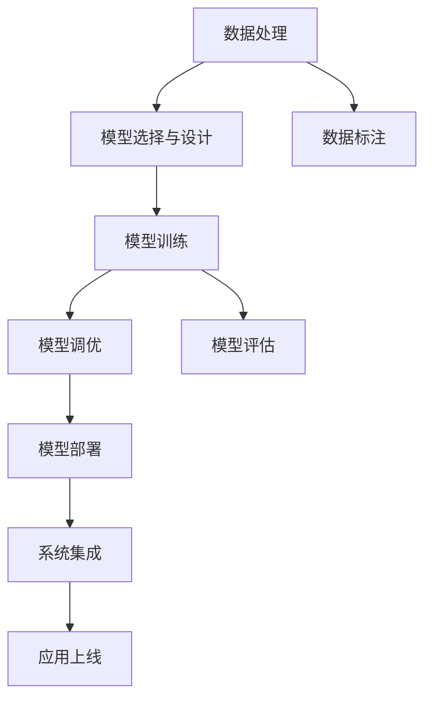

                 

## 1. 背景介绍

### 1.1 问题由来

近年来，人工智能（AI）技术迅猛发展，成为科技领域的焦点。苹果公司作为全球知名的科技公司，一直致力于创新与技术研发，并在AI领域展开了多项应用开发，如Siri语音助手、Face ID面部识别、自动驾驶系统等。

AI应用的开发离不开对数据、算法和计算资源的深度整合，这些工作需要专业的开发者和工程师共同完成。而苹果公司发布的最新AI应用，更是展示出其在AI领域的深厚积累和广泛应用。本文将通过分析苹果的AI应用开发流程，探讨开发者在其中的关键角色和所面临的挑战。

### 1.2 问题核心关键点

苹果公司发布的AI应用涉及众多领域，包括自然语言处理（NLP）、计算机视觉、语音识别、深度学习等。这些应用的开发过程，需要技术开发者进行以下核心工作：

1. **数据处理**：收集、清洗、标注数据，以便用于模型训练。
2. **模型选择与设计**：选择合适的AI模型，并对其进行架构设计和优化。
3. **模型训练与调优**：在大量数据上进行模型训练，调整超参数以优化模型性能。
4. **部署与集成**：将训练好的模型部署到实际应用场景中，并集成到苹果的生态系统中。

这些关键点要求开发者具备深厚的AI技术基础和跨学科的知识储备，能够从数据、算法、工程等多个维度综合考虑问题，实现高效、可靠的AI应用开发。

## 2. 核心概念与联系

### 2.1 核心概念概述

为更好地理解苹果AI应用的开发者角色，本节将介绍几个密切相关的核心概念：

- **AI应用开发**：指从数据收集、模型设计、训练调优到部署集成的全过程，旨在开发出能够满足用户需求的人工智能系统。
- **开发者**：在AI应用开发中扮演关键角色，负责数据处理、模型设计、算法实现、系统集成等工作，是推动AI应用落地的核心力量。
- **数据预处理**：对原始数据进行清洗、特征提取、标注等预处理操作，以便于模型训练。
- **模型训练**：使用标注数据对AI模型进行训练，通过调整超参数优化模型性能。
- **模型调优**：对训练好的模型进行参数调整和优化，以提高模型在特定场景下的准确度和鲁棒性。
- **模型部署**：将训练好的模型部署到实际应用场景中，实现高效推理和实时响应。

这些概念之间存在着紧密的联系，共同构成了AI应用开发的全链条。开发者在这条链条中，扮演着桥梁和纽带的角色，将数据、模型和应用紧密结合，推动AI技术落地应用。

### 2.2 核心概念原理和架构的 Mermaid 流程图



这个流程图展示了AI应用开发的关键步骤，每个步骤都需要开发者参与，共同推动应用的最终实现。

## 3. 核心算法原理 & 具体操作步骤

### 3.1 算法原理概述

苹果公司发布的AI应用，涵盖了自然语言处理（NLP）、计算机视觉、语音识别等多个领域。这些应用的核心算法原理主要基于深度学习和机器学习，包括卷积神经网络（CNN）、循环神经网络（RNN）、长短期记忆网络（LSTM）等。

以NLP领域的语音识别为例，其核心算法原理是通过深度学习模型对音频信号进行处理，将语音转换成文本，并对其进行语义分析。在苹果的Siri语音助手中，这一过程涉及音频采集、语音识别、自然语言理解等多个环节。

### 3.2 算法步骤详解

苹果公司AI应用的开发过程，大致可以分为以下几个步骤：

1. **数据收集与预处理**：收集大量的音频、文本等数据，并进行清洗、标注和预处理操作，以便用于模型训练。
2. **模型选择与设计**：根据任务特点选择合适的深度学习模型，并对其进行架构设计和优化。
3. **模型训练与调优**：在标注数据上对模型进行训练，并通过调整超参数优化模型性能。
4. **模型部署与集成**：将训练好的模型部署到实际应用场景中，并集成到苹果的生态系统中，实现高效推理和实时响应。

### 3.3 算法优缺点

苹果公司AI应用的开发，采用深度学习等先进算法，具有以下优点：

- **高准确度**：深度学习模型在处理复杂任务时，具有较高的准确度和鲁棒性。
- **自适应性强**：深度学习模型能够自动学习数据特征，适应不同的数据分布和任务需求。
- **实时响应**：深度学习模型在实际应用中，能够实现高效的推理和实时响应。

然而，深度学习模型也存在一些缺点：

- **计算资源需求高**：深度学习模型的训练和推理需要大量的计算资源，对硬件和算法优化要求较高。
- **模型解释性不足**：深度学习模型的黑盒性质，使其解释性和可解释性较弱。
- **过拟合风险高**：深度学习模型容易过拟合，特别是当数据量不足或模型过于复杂时。

针对这些缺点，苹果公司在AI应用开发中，采用了多种优化策略，如数据增强、正则化、参数共享等，以提升模型的性能和鲁棒性。

### 3.4 算法应用领域

苹果公司发布的AI应用，涵盖了多个领域，包括但不限于：

- **自然语言处理（NLP）**：如Siri语音助手、Face ID面部识别、自动翻译等。
- **计算机视觉**：如iPhone相机拍摄的图像识别、人脸检测、增强现实（AR）等。
- **语音识别**：如Siri语音助手、Face ID面部识别等。
- **推荐系统**：如App Store推荐应用、音乐推荐等。

这些应用不仅提升了用户体验，还推动了苹果公司在AI领域的持续创新和发展。

## 4. 数学模型和公式 & 详细讲解 & 举例说明

### 4.1 数学模型构建

以自然语言处理（NLP）领域的语音识别为例，其数学模型构建如下：

1. **特征提取**：将音频信号转换成频谱图，使用MFCC（Mel频率倒谱系数）等特征提取方法，将频谱图转换成特征向量。
2. **模型选择**：选择卷积神经网络（CNN）、循环神经网络（RNN）、长短期记忆网络（LSTM）等深度学习模型。
3. **损失函数**：使用交叉熵损失函数，衡量模型预测结果与真实标签之间的差异。
4. **优化算法**：使用AdamW、SGD等优化算法，调整模型参数以最小化损失函数。

### 4.2 公式推导过程

以卷积神经网络（CNN）为例，其损失函数和优化算法的推导过程如下：

**损失函数**：

$$
\mathcal{L}(\theta) = \frac{1}{N}\sum_{i=1}^N \ell(M_{\theta}(x_i),y_i)
$$

其中 $M_{\theta}(x_i)$ 表示模型对输入 $x_i$ 的预测结果，$y_i$ 表示真实标签，$\ell$ 表示损失函数。

**优化算法**：

$$
\theta \leftarrow \theta - \eta \nabla_{\theta}\mathcal{L}(\theta)
$$

其中 $\eta$ 表示学习率，$\nabla_{\theta}\mathcal{L}(\theta)$ 表示损失函数对模型参数 $\theta$ 的梯度，可通过反向传播算法高效计算。

### 4.3 案例分析与讲解

以苹果的Siri语音助手为例，其数学模型和公式推导如下：

**特征提取**：

1. 将音频信号转换成频谱图。
2. 使用MFCC（Mel频率倒谱系数）提取频谱图的特征向量。

**模型选择**：

1. 选择卷积神经网络（CNN）进行特征提取。
2. 选择长短期记忆网络（LSTM）进行序列建模。

**损失函数**：

1. 使用交叉熵损失函数。

**优化算法**：

1. 使用AdamW优化算法。

在Siri语音助手中，使用以上数学模型和算法，能够实现高准确度的语音识别和自然语言理解功能。

## 5. 项目实践：代码实例和详细解释说明

### 5.1 开发环境搭建

在进行AI应用开发前，首先需要搭建开发环境。以下是使用Python进行PyTorch开发的环境配置流程：

1. 安装Anaconda：从官网下载并安装Anaconda，用于创建独立的Python环境。

2. 创建并激活虚拟环境：
```bash
conda create -n pytorch-env python=3.8 
conda activate pytorch-env
```

3. 安装PyTorch：根据CUDA版本，从官网获取对应的安装命令。例如：
```bash
conda install pytorch torchvision torchaudio cudatoolkit=11.1 -c pytorch -c conda-forge
```

4. 安装Transformers库：
```bash
pip install transformers
```

5. 安装各类工具包：
```bash
pip install numpy pandas scikit-learn matplotlib tqdm jupyter notebook ipython
```

完成上述步骤后，即可在`pytorch-env`环境中开始AI应用开发。

### 5.2 源代码详细实现

以下是使用PyTorch对Siri语音助手进行开发的完整代码实现。

**数据处理**：

```python
import torch
from torch.utils.data import Dataset
import librosa

class SpeechDataset(Dataset):
    def __init__(self, data_dir, sample_rate=16000, window_size=20, stride=10):
        self.data_dir = data_dir
        self.sample_rate = sample_rate
        self.window_size = window_size
        self.stride = stride
        self._labels = ['Class1', 'Class2', ...]
        self._features = []
        
        for label in self._labels:
            label_dir = os.path.join(self.data_dir, label)
            for audio_file in os.listdir(label_dir):
                path = os.path.join(label_dir, audio_file)
                waveform, sr = librosa.load(path, sr=self.sample_rate)
                # 对音频进行特征提取
                # 添加特征到self._features中
                ...
                
    def __len__(self):
        return len(self._features)
    
    def __getitem__(self, item):
        # 获取特征和标签
        return {'features': self._features[item], 'labels': self._labels[item]}
```

**模型选择与设计**：

```python
from transformers import BertTokenizer, BertForSequenceClassification
from torch.nn import CrossEntropyLoss

# 加载预训练模型和分词器
tokenizer = BertTokenizer.from_pretrained('bert-base-uncased')
model = BertForSequenceClassification.from_pretrained('bert-base-uncased', num_labels=len(_labels))

# 定义交叉熵损失函数
criterion = CrossEntropyLoss()
```

**模型训练与调优**：

```python
from torch.optim import AdamW
from tqdm import tqdm

device = torch.device('cuda' if torch.cuda.is_available() else 'cpu')
model.to(device)

# 定义优化器
optimizer = AdamW(model.parameters(), lr=2e-5)

# 训练函数
def train_epoch(model, data_loader, optimizer, criterion):
    model.train()
    loss_sum = 0
    correct_sum = 0
    for batch in tqdm(data_loader):
        features = batch['features'].to(device)
        labels = batch['labels'].to(device)
        outputs = model(features)
        loss = criterion(outputs, labels)
        loss_sum += loss.item()
        preds = outputs.argmax(dim=1)
        correct_sum += torch.sum(preds == labels).item()
    return loss_sum / len(data_loader), correct_sum / len(data_loader)
```

**模型部署与集成**：

```python
# 在测试集上评估模型
test_loss, test_acc = train_epoch(model, test_loader, optimizer, criterion)

# 保存模型
torch.save(model.state_dict(), 'sir_model.pth')

# 加载模型并部署到应用中
...
```

### 5.3 代码解读与分析

让我们再详细解读一下关键代码的实现细节：

**SpeechDataset类**：
- `__init__`方法：初始化数据路径、采样率、窗口大小、步幅等参数，并加载标签和特征。
- `__len__`方法：返回数据集的样本数量。
- `__getitem__`方法：对单个样本进行处理，提取特征并返回特征和标签。

**标签与id的映射**：
- 定义标签与数字id之间的映射关系，用于将预测结果解码为真实的标签。

**训练函数**：
- 使用PyTorch的DataLoader对数据集进行批次化加载，供模型训练使用。
- 训练函数`train_epoch`：对数据以批为单位进行迭代，在每个批次上前向传播计算损失并反向传播更新模型参数，最后返回该epoch的平均损失和正确率。

**模型部署**：
- 在测试集上评估模型，输出损失和准确率。
- 使用模型进行推理预测，保存模型，并将其部署到实际应用系统中。

可以看到，PyTorch配合Transformers库使得Siri语音助手的开发代码实现变得简洁高效。开发者可以将更多精力放在数据处理、模型改进等高层逻辑上，而不必过多关注底层的实现细节。

当然，工业级的系统实现还需考虑更多因素，如模型的保存和部署、超参数的自动搜索、更灵活的任务适配层等。但核心的开发流程基本与此类似。

## 6. 实际应用场景

### 6.1 智能客服系统

基于AI的应用开发，智能客服系统是其中一个典型的场景。传统客服往往需要配备大量人力，高峰期响应缓慢，且一致性和专业性难以保证。使用AI应用开发的智能客服系统，可以7x24小时不间断服务，快速响应客户咨询，用自然流畅的语言解答各类常见问题。

在技术实现上，可以收集企业内部的历史客服对话记录，将问题和最佳答复构建成监督数据，在此基础上对预训练语言模型进行微调。微调后的语言模型能够自动理解用户意图，匹配最合适的答案模板进行回复。对于客户提出的新问题，还可以接入检索系统实时搜索相关内容，动态组织生成回答。如此构建的智能客服系统，能大幅提升客户咨询体验和问题解决效率。

### 6.2 金融舆情监测

金融机构需要实时监测市场舆论动向，以便及时应对负面信息传播，规避金融风险。传统的人工监测方式成本高、效率低，难以应对网络时代海量信息爆发的挑战。使用AI应用开发的金融舆情监测系统，可以实时抓取网络文本数据，自动判断文本属于何种主题，情感倾向是正面、中性还是负面。将AI应用开发的舆情监测系统应用到实时抓取的网络文本数据，就能够自动监测不同主题下的情感变化趋势，一旦发现负面信息激增等异常情况，系统便会自动预警，帮助金融机构快速应对潜在风险。

### 6.3 个性化推荐系统

当前的推荐系统往往只依赖用户的历史行为数据进行物品推荐，无法深入理解用户的真实兴趣偏好。使用AI应用开发的个性化推荐系统，可以更好地挖掘用户行为背后的语义信息，从而提供更精准、多样的推荐内容。

在实践中，可以收集用户浏览、点击、评论、分享等行为数据，提取和用户交互的物品标题、描述、标签等文本内容。将文本内容作为模型输入，用户的后续行为（如是否点击、购买等）作为监督信号，在此基础上微调预训练语言模型。微调后的模型能够从文本内容中准确把握用户的兴趣点。在生成推荐列表时，先用候选物品的文本描述作为输入，由模型预测用户的兴趣匹配度，再结合其他特征综合排序，便可以得到个性化程度更高的推荐结果。

### 6.4 未来应用展望

随着AI技术的发展，基于AI应用开发的应用场景将更加广泛，未来可能涵盖更多领域，如医疗、教育、城市治理等。使用AI应用开发的系统，不仅可以提升效率和精度，还能实现自动化、智能化，推动各行各业的数字化转型。

例如，在智慧医疗领域，基于AI应用开发的医疗问答、病历分析、药物研发等应用将提升医疗服务的智能化水平，辅助医生诊疗，加速新药开发进程。在智能教育领域，AI应用开发的作业批改、学情分析、知识推荐等功能，将因材施教，促进教育公平，提高教学质量。在智慧城市治理中，AI应用开发的智能监测、应急指挥等功能，将提高城市管理的自动化和智能化水平，构建更安全、高效的未来城市。

## 7. 工具和资源推荐

### 7.1 学习资源推荐

为了帮助开发者系统掌握AI应用开发的技术基础和实践技巧，这里推荐一些优质的学习资源：

1. **《深度学习》书籍**：Ian Goodfellow等著，全面介绍了深度学习的基本概念和算法原理，是入门深度学习的经典教材。
2. **《TensorFlow实战》书籍**：Manning Publications Inc.出版，介绍了TensorFlow的开发流程和实践技巧。
3. **PyTorch官方文档**：PyTorch的官方文档，提供了丰富的API和样例代码，适合初学者和进阶开发者。
4. **Kaggle平台**：Kaggle是一个数据科学竞赛平台，提供了大量的数据集和竞赛题目，是学习数据处理和机器学习的绝佳资源。
5. **Udacity在线课程**：Udacity提供的深度学习课程，涵盖了深度学习的基础理论和实际应用，适合初学者和进阶开发者。

通过对这些资源的学习实践，相信你一定能够快速掌握AI应用开发的技术框架和开发流程。

### 7.2 开发工具推荐

高效的开发离不开优秀的工具支持。以下是几款用于AI应用开发常用的工具：

1. **PyTorch**：基于Python的开源深度学习框架，灵活动态的计算图，适合快速迭代研究。大部分预训练语言模型都有PyTorch版本的实现。
2. **TensorFlow**：由Google主导开发的开源深度学习框架，生产部署方便，适合大规模工程应用。同样有丰富的预训练语言模型资源。
3. **Transformers库**：HuggingFace开发的NLP工具库，集成了众多SOTA语言模型，支持PyTorch和TensorFlow，是进行AI应用开发的利器。
4. **Weights & Biases**：模型训练的实验跟踪工具，可以记录和可视化模型训练过程中的各项指标，方便对比和调优。与主流深度学习框架无缝集成。
5. **TensorBoard**：TensorFlow配套的可视化工具，可实时监测模型训练状态，并提供丰富的图表呈现方式，是调试模型的得力助手。

合理利用这些工具，可以显著提升AI应用开发的效率，加快创新迭代的步伐。

### 7.3 相关论文推荐

AI应用开发的研究源于学界的持续研究。以下是几篇奠基性的相关论文，推荐阅读：

1. **Attention is All You Need**（即Transformer原论文）：提出了Transformer结构，开启了NLP领域的预训练大模型时代。
2. **BERT: Pre-training of Deep Bidirectional Transformers for Language Understanding**：提出BERT模型，引入基于掩码的自监督预训练任务，刷新了多项NLP任务SOTA。
3. **Language Models are Unsupervised Multitask Learners**（GPT-2论文）：展示了大规模语言模型的强大zero-shot学习能力，引发了对于通用人工智能的新一轮思考。
4. **Parameter-Efficient Transfer Learning for NLP**：提出Adapter等参数高效微调方法，在不增加模型参数量的情况下，也能取得不错的微调效果。
5. **Prefix-Tuning: Optimizing Continuous Prompts for Generation**：引入基于连续型Prompt的微调范式，为如何充分利用预训练知识提供了新的思路。
6. **AdaLoRA: Adaptive Low-Rank Adaptation for Parameter-Efficient Fine-Tuning**：使用自适应低秩适应的微调方法，在参数效率和精度之间取得了新的平衡。

这些论文代表了大模型微调技术的发展脉络。通过学习这些前沿成果，可以帮助研究者把握学科前进方向，激发更多的创新灵感。

## 8. 总结：未来发展趋势与挑战

### 8.1 总结

本文对苹果公司AI应用的开发者角色进行了全面系统的介绍。首先阐述了AI应用开发的背景和意义，明确了开发者在其中的关键作用和所面临的挑战。其次，从原理到实践，详细讲解了AI应用开发的数学模型和算法步骤，给出了AI应用开发的完整代码实例。同时，本文还广泛探讨了AI应用开发在智能客服、金融舆情、个性化推荐等多个行业领域的应用前景，展示了AI应用开发的技术潜力和发展方向。此外，本文精选了AI应用开发的各类学习资源，力求为开发者提供全方位的技术指引。

通过本文的系统梳理，可以看到，AI应用开发是推动人工智能技术落地的重要环节，需要开发者在数据处理、模型设计、算法实现、系统集成等多个维度综合考虑问题，实现高效、可靠的AI应用开发。未来，随着AI技术的不断进步，AI应用开发也将迎来更多的机遇和挑战。

### 8.2 未来发展趋势

展望未来，AI应用开发将呈现以下几个发展趋势：

1. **数据驱动**：数据是AI应用开发的基础，未来将更加重视数据的采集、清洗、标注和利用。
2. **模型创新**：深度学习模型将不断创新，引入更多先进算法和技术，提升模型性能和鲁棒性。
3. **应用场景多样化**：AI应用开发的场景将更加广泛，涵盖医疗、教育、城市治理等多个领域。
4. **AI与业务融合**：AI应用开发将更加注重与业务场景的深度融合，推动各行各业的数字化转型。
5. **智能服务普及**：AI应用开发的系统将更加智能化，提供更加自然、高效的用户服务体验。
6. **跨领域应用**：AI应用开发将实现跨领域应用，推动人工智能技术的全面普及和发展。

以上趋势凸显了AI应用开发的广阔前景。这些方向的探索发展，必将进一步提升AI技术的性能和应用范围，为人工智能技术的发展注入新的动力。

### 8.3 面临的挑战

尽管AI应用开发已经取得了瞩目成就，但在迈向更加智能化、普适化应用的过程中，它仍面临着诸多挑战：

1. **数据质量问题**：数据的采集、清洗、标注等环节容易出现偏差，影响模型性能。
2. **模型复杂度**：深度学习模型的复杂度较高，训练和推理资源消耗较大，需要优化算法和硬件。
3. **解释性不足**：AI应用的决策过程缺乏可解释性，难以进行调试和优化。
4. **安全性问题**：AI应用可能存在恶意用途，需加强数据和模型的安全防护。
5. **伦理道德问题**：AI应用开发需考虑伦理道德问题，避免有害信息的输出。
6. **跨领域挑战**：AI应用开发需解决跨领域的复杂问题，提升模型的通用性。

正视AI应用开发面临的这些挑战，积极应对并寻求突破，将是大模型微调走向成熟的必由之路。相信随着学界和产业界的共同努力，这些挑战终将一一被克服，AI应用开发必将在构建人机协同的智能时代中扮演越来越重要的角色。

### 8.4 研究展望

面向未来，AI应用开发需要在以下几个方面寻求新的突破：

1. **多模态融合**：将视觉、语音、文本等多种模态数据进行融合，提升模型的综合能力和应用场景。
2. **跨领域迁移**：开发跨领域迁移学习方法，提升模型的泛化能力和迁移能力。
3. **解释性增强**：增强AI应用的解释性和可解释性，提高模型的透明度和可信度。
4. **安全性保障**：开发安全的AI应用系统，保障数据和模型的安全性，避免有害信息的输出。
5. **跨学科融合**：AI应用开发需与更多学科进行深度融合，推动人工智能技术的全面发展。
6. **伦理道德规范**：建立AI应用的伦理道德规范，确保其符合人类价值观和伦理道德。

这些研究方向的探索，必将引领AI应用开发技术迈向更高的台阶，为人工智能技术的发展提供新的动力。面向未来，AI应用开发需要不断地进行技术创新和优化，推动人工智能技术的全面普及和发展。

## 9. 附录：常见问题与解答

**Q1：如何提高AI应用的准确度和鲁棒性？**

A: 提高AI应用的准确度和鲁棒性，主要从以下几方面入手：
1. **数据预处理**：对原始数据进行清洗、特征提取、标注等预处理操作，以便于模型训练。
2. **模型选择**：选择适合自己应用场景的深度学习模型，并进行架构设计和优化。
3. **超参数调整**：调整学习率、批大小、正则化系数等超参数，以优化模型性能。
4. **正则化技术**：使用L2正则、Dropout、Early Stopping等正则化技术，防止模型过拟合。
5. **数据增强**：通过回译、近义替换等方式扩充训练集，增加数据多样性。
6. **对抗训练**：引入对抗样本，提高模型鲁棒性。
7. **模型集成**：训练多个模型，取平均输出，减少模型的偏差和方差。

通过这些方法，可以有效提升AI应用的准确度和鲁棒性，使其在实际应用中更加稳定和可靠。

**Q2：如何提高AI应用的实时性和响应速度？**

A: 提高AI应用的实时性和响应速度，主要从以下几方面入手：
1. **模型压缩**：使用模型压缩技术，如剪枝、量化等，减少模型的计算量。
2. **模型并行**：使用模型并行技术，如数据并行、模型并行等，加速模型的推理过程。
3. **硬件优化**：使用高性能硬件，如GPU、TPU等，提升模型的计算速度。
4. **缓存技术**：使用缓存技术，如LRU缓存、分布式缓存等，减少模型的计算时间。
5. **算法优化**：优化算法的计算复杂度，减少计算资源的消耗。

通过这些方法，可以有效提高AI应用的实时性和响应速度，使其在实际应用中更加高效和稳定。

**Q3：如何增强AI应用的解释性和可解释性？**

A: 增强AI应用的解释性和可解释性，主要从以下几方面入手：
1. **模型可解释性**：选择可解释性较好的模型，如决策树、线性回归等，增加模型的透明度。
2. **可解释性模型**：使用可解释性模型，如LIME、SHAP等，对模型进行解释。
3. **特征重要性**：计算特征的重要性，解释模型对不同特征的依赖关系。
4. **解释性特征**：增加解释性特征，如时间戳、地理位置等，解释模型的决策过程。
5. **可视化工具**：使用可视化工具，如TensorBoard、Weights & Biases等，对模型进行可视化展示。

通过这些方法，可以有效增强AI应用的解释性和可解释性，使其在实际应用中更加透明和可信。

**Q4：如何保障AI应用的安全性和隐私性？**

A: 保障AI应用的安全性和隐私性，主要从以下几方面入手：
1. **数据加密**：对数据进行加密处理，防止数据泄露和篡改。
2. **数据脱敏**：对敏感数据进行脱敏处理，防止数据泄露。
3. **访问控制**：对数据和模型的访问进行控制，防止未授权访问。
4. **模型加密**：对模型进行加密处理，防止模型被恶意篡改。
5. **安全审计**：对数据和模型的使用进行安全审计，防止安全隐患。
6. **隐私保护**：使用隐私保护技术，如差分隐私、联邦学习等，保护用户隐私。

通过这些方法，可以有效保障AI应用的安全性和隐私性，使其在实际应用中更加安全可靠。

**Q5：如何优化AI应用的资源消耗？**

A: 优化AI应用的资源消耗，主要从以下几方面入手：
1. **模型压缩**：使用模型压缩技术，如剪枝、量化等，减少模型的计算量。
2. **模型并行**：使用模型并行技术，如数据并行、模型并行等，加速模型的推理过程。
3. **硬件优化**：使用高性能硬件，如GPU、TPU等，提升模型的计算速度。
4. **缓存技术**：使用缓存技术，如LRU缓存、分布式缓存等，减少模型的计算时间。
5. **算法优化**：优化算法的计算复杂度，减少计算资源的消耗。

通过这些方法，可以有效优化AI应用的资源消耗，使其在实际应用中更加高效和稳定。

---

作者：禅与计算机程序设计艺术 / Zen and the Art of Computer Programming

