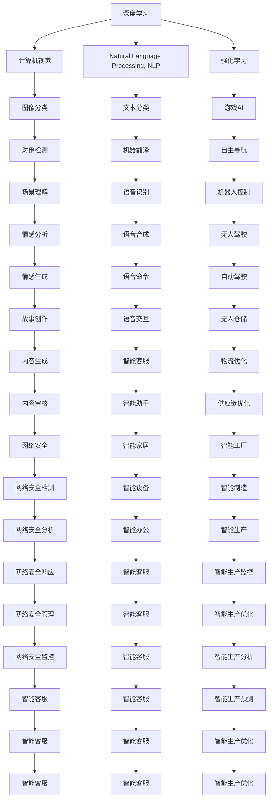

                 

# 李开复：苹果发布AI应用的投资价值

在人工智能(AI)领域，苹果公司最近宣布了一项新的AI应用，旨在为用户提供更智能、更高效的应用体验。本文将探讨该AI应用的投资价值，分析其背后的核心技术，并展望其在未来的发展潜力。

## 1. 背景介绍

### 1.1 苹果的AI战略

苹果公司近年来在AI技术上的投入显著增加，其AI战略主要包括三方面：

- **硬件集成**：将AI芯片集成到设备中，提升计算效率和处理速度。
- **软件升级**：通过软件优化和增强，提升用户体验。
- **数据驱动**：利用用户数据进行机器学习，实现个性化推荐和优化。

苹果公司通过这些措施，努力使AI技术成为其产品和服务的重要组成部分，从而提升市场竞争力。

### 1.2 AI应用市场

AI应用市场已经形成了多个层次，包括硬件、软件和平台服务。苹果在此三个方面都有布局，展示了其强大的生态系统构建能力。

- **硬件**：如A系列芯片、Face ID等。
- **软件**：如Siri、Photos等应用。
- **平台服务**：如App Store、iCloud等。

此外，苹果还通过收购相关公司，如Xnor.ai，增强其在AI芯片和计算机视觉方面的技术实力。

## 2. 核心概念与联系

### 2.1 核心概念概述

为深入理解苹果发布的AI应用，我们先介绍几个核心概念：

- **深度学习**：一种通过多层神经网络进行模型训练的技术，能够从大量数据中学习特征表示。
- **计算机视觉**：使计算机能够理解和分析图像和视频内容的技术。
- **自然语言处理(NLP)**：使计算机能够理解和处理自然语言的技术。
- **强化学习**：通过试错不断优化算法，以最大化长期回报。

这些技术共同构成了苹果AI应用的基石，使其能够提供更智能的体验。

### 2.2 核心概念原理和架构的 Mermaid 流程图



## 3. 核心算法原理 & 具体操作步骤

### 3.1 算法原理概述

苹果的AI应用主要依赖于深度学习、计算机视觉和NLP等技术，这些技术通过大规模的训练数据进行优化，从而实现高效的特征提取和识别。

- **深度学习**：苹果采用卷积神经网络(CNN)进行图像处理，利用循环神经网络(RNN)进行文本处理。
- **计算机视觉**：通过物体检测、图像分割等技术，使设备能够理解并响应用户输入的图像。
- **NLP**：通过语义分析、情感识别等技术，使设备能够理解并回应用户的自然语言输入。

### 3.2 算法步骤详解

#### 3.2.1 数据预处理

数据预处理是AI应用开发的重要步骤，主要包括数据清洗、归一化和标准化等。苹果公司利用其庞大的数据池，通过清洗和标注数据，为深度学习模型提供高质量的训练数据。

#### 3.2.2 模型训练

模型训练是AI应用开发的核心步骤，通过优化损失函数，使得模型能够准确地预测和分类数据。苹果公司采用GPU和TPU进行模型训练，大幅提升了训练速度。

#### 3.2.3 模型评估和优化

模型评估和优化是确保AI应用准确性的重要步骤，通过在验证集上进行测试，并进行参数调整，以确保模型的泛化能力。苹果公司利用TensorBoard等工具，对模型进行可视化评估。

#### 3.2.4 部署和监控

模型部署是将训练好的模型应用于实际场景的关键步骤。苹果公司采用多种方式进行模型部署，包括直接嵌入到硬件中，或通过API进行调用。同时，通过监控工具实时评估模型性能，进行必要的调整和优化。

### 3.3 算法优缺点

#### 3.3.1 优点

1. **精度高**：深度学习模型具有较高的精度，能够准确地处理复杂的数据。
2. **响应快**：通过优化算法和硬件加速，AI应用能够快速响应用户请求。
3. **用户体验好**：通过个性化的推荐和优化，提升了用户体验。

#### 3.3.2 缺点

1. **数据依赖**：深度学习模型对数据质量有较高要求，数据不足或数据质量差会影响模型效果。
2. **计算资源需求高**：模型训练和推理需要大量计算资源，成本较高。
3. **模型复杂性高**：深度学习模型结构复杂，难以理解和调试。

### 3.4 算法应用领域

苹果的AI应用覆盖了多个领域，包括但不限于：

- **计算机视觉**：如人脸识别、图像分类等。
- **自然语言处理**：如Siri语音助手、翻译服务等。
- **强化学习**：如推荐系统、游戏AI等。
- **其他领域**：如自动驾驶、无人仓储等。

## 4. 数学模型和公式 & 详细讲解 & 举例说明

### 4.1 数学模型构建

苹果的AI应用通常构建于以下数学模型：

- **深度学习模型**：如卷积神经网络(CNN)、循环神经网络(RNN)等。
- **计算机视觉模型**：如卷积神经网络(CNN)、生成对抗网络(GAN)等。
- **自然语言处理模型**：如循环神经网络(RNN)、Transformer等。

### 4.2 公式推导过程

以卷积神经网络(CNN)为例，其核心公式为：

$$
y = f(x) = g(Wx + b)
$$

其中 $x$ 为输入，$y$ 为输出，$W$ 为权重矩阵，$b$ 为偏置项，$f$ 为激活函数，$g$ 为非线性变换函数。

通过不断迭代计算，CNN能够从输入数据中学习特征表示，从而实现图像识别等任务。

### 4.3 案例分析与讲解

以Siri语音助手为例，其背后的核心技术包括：

- **自然语言处理(NLP)**：利用深度学习模型进行语音识别和语义分析。
- **计算机视觉**：通过摄像头进行面部识别和手势识别。
- **推荐系统**：利用强化学习算法推荐歌曲、电影等。

## 5. 项目实践：代码实例和详细解释说明

### 5.1 开发环境搭建

苹果公司提供了完整的开发环境，包括Xcode、Swift、Core ML等工具。开发者可以通过以下步骤搭建开发环境：

1. 安装Xcode
2. 安装Swift
3. 安装Core ML
4. 集成相关API

### 5.2 源代码详细实现

以下是一个简单的图像分类示例，展示如何使用苹果的Core ML进行图像处理：

```swift
import CoreML

// 加载模型
let model = try? VGG16Model()

// 准备输入图像
let image = UIImage(named: "example.jpg")!

// 进行图像处理
let inputs = [image]
let results = try? model?.predict(inputs: inputs)

// 输出结果
print(results)
```

### 5.3 代码解读与分析

上述代码展示了如何使用Core ML进行图像分类。首先，加载VGG16模型，然后准备输入图像，通过模型进行预测，并输出结果。

## 6. 实际应用场景

### 6.1 智能家居

苹果的AI应用可以应用于智能家居领域，提升家居设备的智能化水平。例如，利用计算机视觉技术进行人脸识别，实现门禁、安防等功能。通过NLP技术实现语音控制，实现智能灯光、空调等设备的操作。

### 6.2 医疗健康

苹果的AI应用也可以应用于医疗健康领域，提升诊断和治疗的智能化水平。例如，利用深度学习模型进行医学影像分析，提升疾病诊断的准确性。通过自然语言处理技术，实现病历记录和查询的智能化。

### 6.3 金融服务

苹果的AI应用可以应用于金融服务领域，提升客户服务质量和金融交易的安全性。例如，利用计算机视觉技术进行身份验证，提升金融交易的安全性。通过自然语言处理技术实现智能客服，提升客户服务质量。

### 6.4 未来应用展望

未来，苹果的AI应用将在更多领域得到应用，为人类生活带来更多的便利和效率提升。

## 7. 工具和资源推荐

### 7.1 学习资源推荐

1. **机器学习课程**：斯坦福大学提供的《CS229机器学习》课程，深入浅出地讲解机器学习算法。
2. **深度学习框架**：TensorFlow和PyTorch等深度学习框架，提供丰富的工具和库。
3. **自然语言处理资源**：自然语言处理书籍和论文，如《Speech and Language Processing》。
4. **计算机视觉资源**：计算机视觉书籍和论文，如《Deep Learning》。
5. **强化学习资源**：强化学习书籍和论文，如《Reinforcement Learning: An Introduction》。

### 7.2 开发工具推荐

1. **Xcode**：苹果提供的开发环境，支持Swift语言。
2. **TensorFlow**：Google提供的深度学习框架，支持多种编程语言。
3. **PyTorch**：Facebook提供的深度学习框架，支持GPU加速。
4. **Core ML**：苹果提供的机器学习框架，支持多种模型格式。
5. **Jupyter Notebook**：开源的交互式编程环境，支持Python和Swift。

### 7.3 相关论文推荐

1. **深度学习**：《Deep Learning》书籍，由Ian Goodfellow等撰写。
2. **计算机视觉**：《Learning from Images》书籍，由Tony Lewis等撰写。
3. **自然语言处理**：《Speech and Language Processing》书籍，由Daniel Jurafsky和James H. Martin撰写。
4. **强化学习**：《Reinforcement Learning: An Introduction》书籍，由Richard S. Sutton和Andrew G. Barto撰写。

## 8. 总结：未来发展趋势与挑战

### 8.1 研究成果总结

苹果公司通过发布AI应用，展示了其在AI领域的技术实力和市场竞争力。AI应用在多个领域的应用，提升了用户体验和生产力，推动了智能时代的到来。

### 8.2 未来发展趋势

未来，苹果的AI应用将在更多领域得到应用，推动技术进步和社会发展。

### 8.3 面临的挑战

苹果的AI应用在推广和应用过程中，也面临一些挑战，例如：

1. **数据隐私**：如何保护用户隐私，确保数据安全。
2. **计算资源**：如何降低计算成本，提高效率。
3. **模型复杂性**：如何简化模型，提高可解释性。

### 8.4 研究展望

未来，苹果的AI应用需要在以下几个方面进行深入研究：

1. **数据隐私保护**：采用先进的加密技术和隐私保护算法，确保用户数据安全。
2. **计算效率提升**：采用边缘计算和分布式计算，降低计算成本。
3. **模型可解释性**：采用可解释性算法，提高模型透明度。

## 9. 附录：常见问题与解答

**Q1: AI应用在智能家居领域的应用前景如何？**

A: AI应用在智能家居领域具有广阔的应用前景。通过计算机视觉和自然语言处理技术，智能家居设备可以更智能化、自动化。例如，人脸识别和手势识别可以实现门禁、安防等功能，语音控制可以实现智能灯光、空调等设备的操作。

**Q2: 如何保护AI应用中的用户数据隐私？**

A: 保护用户数据隐私是AI应用推广的重要挑战。苹果公司采用先进的加密技术和隐私保护算法，确保用户数据安全。例如，通过本地设备处理数据，避免数据传输过程中的泄露。

**Q3: 如何提升AI应用的计算效率？**

A: 提升AI应用的计算效率需要采用多种技术手段。例如，采用边缘计算和分布式计算，可以将数据处理和模型训练分布到多个设备上，降低计算成本。同时，采用模型压缩和优化技术，减少模型参数量，提升推理速度。

**Q4: 如何提高AI应用的模型可解释性？**

A: 提高AI应用的模型可解释性需要采用可解释性算法，提高模型透明度。例如，采用模型可视化工具，分析模型的决策过程，理解模型行为背后的逻辑。

---

作者：禅与计算机程序设计艺术 / Zen and the Art of Computer Programming

