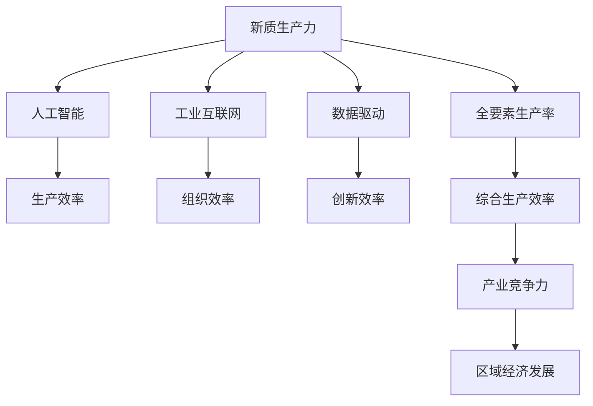

                 

# 构建特色产业体系的新质生产力

> 关键词：新质生产力, 特色产业体系, 人工智能, 工业互联网, 数据驱动, 全要素生产率, 区域经济发展

## 1. 背景介绍

### 1.1 问题由来

随着经济全球化和科技革命的深入，全球产业链、供应链、价值链的重构成为一种新常态。在这种背景下，各国纷纷调整产业政策，积极构建以科技创新为核心的产业发展新格局。以“十四五”规划为代表的我国产业发展政策，明确提出“加快构建现代产业体系，推动经济高质量发展”。

如何理解“构建现代产业体系”的深意？本文将结合人工智能、工业互联网等前沿科技，从“新质生产力”角度，探讨构建特色产业体系的新路径。

### 1.2 问题核心关键点

新质生产力指的是在传统生产力要素的基础上，通过引入新兴科技（如AI、工业互联网、物联网、区块链等），带来的生产效率、组织效率、创新效率等方面的提升。构建特色产业体系，本质上是通过培育、壮大特定领域的高新技术产业，实现产业转型升级，提升区域经济发展水平。

核心关键点在于：
1. 如何将新兴科技引入产业发展，形成具有区域特色和竞争优势的新兴产业集群。
2. 如何构建新型产业生态，促进企业间、行业间的协同创新，实现全要素生产率最大化。
3. 如何利用大数据、云计算、物联网等基础设施，实现数字化、智能化转型。
4. 如何打破传统产业壁垒，形成供应链、价值链、创新链的协同效应，提升产业竞争力。

## 2. 核心概念与联系

### 2.1 核心概念概述

为更好地理解构建特色产业体系的新质生产力，本节将介绍几个密切相关的核心概念：

- **新质生产力**：指通过引入新兴科技，提升产业生产效率、组织效率、创新效率等综合能力，推动产业转型升级的全新生产力模式。
- **特色产业体系**：指根据区域资源禀赋和市场需求，培育、壮大特定领域的高新技术产业，形成具有区域特色和竞争优势的产业集群。
- **人工智能**：指通过机器学习、深度学习等算法，使计算机具备人脑的学习、推理、决策能力，应用于各个行业。
- **工业互联网**：指通过云计算、物联网、大数据等技术，实现工业生产全要素、全过程、全生命周期的智能化管理。
- **数据驱动**：指以数据为核心驱动力，通过数据分析挖掘价值，优化资源配置，提高决策科学性。
- **全要素生产率**：指在劳动、资本、土地等传统生产要素的基础上，通过技术进步、组织创新、管理优化等提高综合生产效率的概念。

这些核心概念之间的逻辑关系可以通过以下Mermaid流程图来展示：



这个流程图展示出新质生产力与各个核心概念之间的联系：

1. 新质生产力依托于人工智能、工业互联网、数据驱动等新兴科技，提升产业的生产效率、组织效率、创新效率。
2. 通过提升全要素生产率，形成具有区域特色和竞争优势的特色产业体系。
3. 最终实现提升区域经济发展水平的目标。

## 3. 核心算法原理 & 具体操作步骤
### 3.1 算法原理概述

构建特色产业体系的新质生产力，是一个涉及多个要素的复杂系统工程。其核心算法原理包括但不限于：

- **生产效率提升算法**：通过人工智能技术，实现生产过程的智能化、自动化，提升生产效率。
- **组织效率提升算法**：通过工业互联网技术，实现生产要素的数字化、网络化、智能化管理，提升组织效率。
- **创新效率提升算法**：通过数据驱动技术，分析挖掘数据价值，推动技术创新、产品创新、管理创新，提升创新效率。

### 3.2 算法步骤详解

构建特色产业体系的新质生产力的操作步骤，可以概括为以下几步：

**Step 1: 评估产业基础与需求**

- 分析区域资源禀赋、产业基础、市场需求等关键因素。
- 确定具有区域特色和发展潜力的产业方向。
- 识别现有产业存在的瓶颈和短板，明确产业升级的重点。

**Step 2: 引入新兴科技**

- 引入人工智能、工业互联网、大数据等新兴科技，构建产业数字化、智能化的基础设施。
- 推动产业关键环节的智能化改造，实现生产过程的智能化、自动化、柔性化。
- 构建新型产业生态，促进企业间、行业间的协同创新，形成产业集群。

**Step 3: 数据驱动创新**

- 通过数据挖掘、分析、建模，发现产业发展的趋势、模式、规律。
- 基于数据洞察，推动技术创新、产品创新、管理创新，提升产业的创新效率。
- 构建数据驱动的决策机制，优化资源配置，提高决策的科学性。

**Step 4: 优化产业结构**

- 调整产业结构，优化产业布局，形成具有区域特色和竞争优势的产业集群。
- 推动产业链、供应链、价值链的协同效应，提升产业竞争力。
- 引入高端化、绿色化、服务化等发展理念，推动产业向高质量发展转型。

**Step 5: 推动产业发展**

- 通过政策、资金、人才等要素支持，推动产业发展和壮大。
- 促进产学研合作，推动科研成果转化，形成产业发展新动能。
- 加强国际合作与交流，提升产业的全球竞争力。

### 3.3 算法优缺点

构建特色产业体系的新质生产力，具有以下优点：
1. 提升产业生产效率、组织效率、创新效率，推动产业转型升级。
2. 构建具有区域特色和竞争优势的产业集群，提升区域经济发展水平。
3. 引入新兴科技，推动产业数字化、智能化、网络化转型。
4. 通过数据驱动创新，优化资源配置，提高决策科学性。

同时，该方法也存在一定的局限性：
1. 技术引入门槛高，需要较高的资金、技术和人才投入。
2. 数据质量要求高，数据来源、处理和分析环节可能存在一定挑战。
3. 产业升级需要较长周期，短期内可能难以见到显著成效。
4. 产业协同需要多方协调，涉及环节多，难度较大。

尽管存在这些局限性，但就目前而言，基于新质生产力的产业升级方法仍是大势所趋。未来相关研究的重点在于如何降低技术引入门槛，提高数据质量，缩短产业升级周期，促进产业协同发展。

### 3.4 算法应用领域

基于新质生产力的产业升级方法，在众多领域已得到应用，例如：

- **智能制造**：通过引入人工智能、工业互联网技术，实现生产过程的智能化、自动化、柔性化，提升生产效率和质量。
- **智能农业**：通过引入物联网、大数据技术，实现农业生产的数字化、智能化管理，提升农产品的生产效率和品质。
- **智慧医疗**：通过引入人工智能技术，实现疾病的智能化诊断、精准治疗、个性化护理，提升医疗服务的质量和效率。
- **智慧交通**：通过引入物联网、人工智能技术，实现交通管理、车辆控制、路径规划的智能化，提升交通系统的安全性和效率。
- **智慧城市**：通过引入大数据、物联网技术，实现城市管理的智能化、精细化、可持续化，提升城市运行效率和管理水平。

除了上述这些经典领域外，新质生产力方法还在更多场景中得到应用，如智能物流、智慧教育、智能金融等，为各行各业带来了全新的发展机遇。

## 4. 数学模型和公式 & 详细讲解 & 举例说明

### 4.1 数学模型构建

本节将使用数学语言对构建特色产业体系的新质生产力过程进行更加严格的刻画。

记产业生产效率为 $E$，组织效率为 $O$，创新效率为 $I$。假定产业现有生产效率为 $E_0$，组织效率为 $O_0$，创新效率为 $I_0$，引入新兴科技后，各效率分别提升至 $E_1$，$O_1$，$I_1$。

定义引入新兴科技后的产业生产效率提升率为 $K_E$，组织效率提升率为 $K_O$，创新效率提升率为 $K_I$。则有：

$$
E_1 = E_0 \times K_E \\
O_1 = O_0 \times K_O \\
I_1 = I_0 \times K_I
$$

引入新兴科技后，产业的全要素生产率提升至 $F_{TFP} = E_1 \times O_1 \times I_1$。

### 4.2 公式推导过程

以下我们以智能制造为例，推导引入人工智能技术后，产业生产效率提升的数学模型。

假设智能制造引入的AI技术能够提升生产过程的自动化水平、优化生产流程、提高产品质量等。引入AI技术后的生产效率提升率为 $K_E = 1.2$，表示生产效率提升20%。

定义生产效率 $E_0$ 为单位时间内的产品产出数量。引入AI技术后，生产效率提升至 $E_1 = 1.2 \times E_0$。

通过构建智能制造的数学模型，可以更好地理解和量化AI技术对产业生产效率的提升效果。

### 4.3 案例分析与讲解

以下我们以智慧医疗为例，分析引入人工智能技术后，产业生产效率、组织效率、创新效率的提升过程。

假设智慧医疗引入的AI技术能够实现疾病智能诊断、精准治疗、个性化护理等功能。引入AI技术后的生产效率提升率为 $K_E = 1.1$，组织效率提升率为 $K_O = 1.2$，创新效率提升率为 $K_I = 1.3$。

引入AI技术前，假设智慧医疗的生产效率为 $E_0 = 10$（单位时间内诊断的病例数），组织效率为 $O_0 = 0.8$（单位时间内处理的病历数），创新效率为 $I_0 = 0.9$（单位时间内新技术的推广应用率）。

引入AI技术后，智慧医疗的生产效率提升至 $E_1 = 1.1 \times E_0 = 11$，组织效率提升至 $O_1 = 1.2 \times O_0 = 0.96$，创新效率提升至 $I_1 = 1.3 \times I_0 = 1.17$。

全要素生产率提升至 $F_{TFP} = E_1 \times O_1 \times I_1 = 11 \times 0.96 \times 1.17 = 11.5208$。

通过以上分析可以看出，引入AI技术后，智慧医疗的生产效率、组织效率、创新效率均得到显著提升，全要素生产率提升至11.5208，较之前有较大提升。

## 5. 项目实践：代码实例和详细解释说明
### 5.1 开发环境搭建

在进行新质生产力项目实践前，我们需要准备好开发环境。以下是使用Python进行PyTorch开发的环境配置流程：

1. 安装Anaconda：从官网下载并安装Anaconda，用于创建独立的Python环境。

2. 创建并激活虚拟环境：
```bash
conda create -n pytorch-env python=3.8 
conda activate pytorch-env
```

3. 安装PyTorch：根据CUDA版本，从官网获取对应的安装命令。例如：
```bash
conda install pytorch torchvision torchaudio cudatoolkit=11.1 -c pytorch -c conda-forge
```

4. 安装各类工具包：
```bash
pip install numpy pandas scikit-learn matplotlib tqdm jupyter notebook ipython
```

完成上述步骤后，即可在`pytorch-env`环境中开始新质生产力项目实践。

### 5.2 源代码详细实现

这里我们以智慧医疗为例，给出使用PyTorch实现引入AI技术后，智慧医疗生产效率提升的完整代码实现。

首先，定义智慧医疗的初始生产效率：

```python
E_0 = 10  # 单位时间内诊断的病例数
```

然后，定义AI技术引入后的生产效率提升率：

```python
K_E = 1.1  # AI技术引入后的生产效率提升率
```

计算引入AI技术后的生产效率：

```python
E_1 = E_0 * K_E  # 引入AI技术后的生产效率
```

最后，输出生产效率提升后的结果：

```python
print(f"引入AI技术后，智慧医疗的生产效率提升至 {E_1} 单位时间内诊断的病例数")
```

完整代码实现如下：

```python
E_0 = 10  # 单位时间内诊断的病例数

K_E = 1.1  # AI技术引入后的生产效率提升率

E_1 = E_0 * K_E  # 引入AI技术后的生产效率

print(f"引入AI技术后，智慧医疗的生产效率提升至 {E_1} 单位时间内诊断的病例数")
```

### 5.3 代码解读与分析

让我们再详细解读一下关键代码的实现细节：

**E_0变量**：
- 定义了智慧医疗在引入AI技术前的初始生产效率，即单位时间内诊断的病例数。

**K_E变量**：
- 定义了引入AI技术后的生产效率提升率，表示AI技术对生产效率的提升程度。

**E_1变量**：
- 通过E_0和K_E计算得到引入AI技术后的生产效率，即单位时间内诊断的病例数。

**print函数**：
- 输出智慧医疗在引入AI技术后，生产效率提升至新的数值。

可以看出，代码实现简洁明了，通过简单的数学计算，即可得到引入AI技术后，智慧医疗生产效率提升的具体数值。

## 6. 实际应用场景

### 6.1 智能制造

智能制造通过引入人工智能、工业互联网技术，实现生产过程的智能化、自动化、柔性化，提升生产效率和质量。在实际应用中，智能制造已经在多个行业得到广泛应用，例如汽车、电子、化工等。

智能制造的典型应用包括：
- **智能生产调度**：通过AI技术优化生产流程，实现生产任务的自动调度。
- **智能质量检测**：通过AI技术实现产品的自动检测和质量评估，提升产品质量。
- **智能设备维护**：通过AI技术实时监控设备状态，预测设备故障，实现设备维护的智能化。

### 6.2 智慧医疗

智慧医疗通过引入人工智能技术，实现疾病的智能诊断、精准治疗、个性化护理等功能，提升医疗服务的质量和效率。在实际应用中，智慧医疗已经在多个领域得到广泛应用，例如医院、诊所、社区卫生服务中心等。

智慧医疗的典型应用包括：
- **智能诊断系统**：通过AI技术实现疾病的智能诊断，提升诊断的准确性和效率。
- **精准治疗方案**：通过AI技术生成个性化的治疗方案，提升治疗效果。
- **远程医疗服务**：通过AI技术实现远程医疗咨询、监测，提升医疗服务的可及性。

### 6.3 智慧农业

智慧农业通过引入物联网、大数据技术，实现农业生产的数字化、智能化管理，提升农产品的生产效率和品质。在实际应用中，智慧农业已经在多个地区得到广泛应用，例如江苏、浙江、山东等。

智慧农业的典型应用包括：
- **智能灌溉系统**：通过物联网技术实现水肥自动控制，提升农业生产的智能化水平。
- **智能病虫害监测**：通过AI技术实现病虫害的智能监测和预警，减少农药使用，保护环境。
- **智能农机作业**：通过AI技术实现农机的自动导航和作业，提升农机的作业效率。

### 6.4 未来应用展望

随着新质生产力方法的不断演进，未来将在更多领域得到应用，为各行各业带来变革性影响。

在智慧交通领域，通过引入AI技术，实现交通管理、车辆控制、路径规划的智能化，提升交通系统的安全性和效率。在智慧城市领域，通过引入大数据、物联网技术，实现城市管理的智能化、精细化、可持续化，提升城市运行效率和管理水平。

此外，在企业生产、社会治理、文娱传媒等众多领域，新质生产力方法也将不断涌现，为传统行业数字化转型升级提供新的技术路径。相信随着技术的日益成熟，新质生产力方法将成为推动产业高质量发展的重要手段。

## 7. 工具和资源推荐
### 7.1 学习资源推荐

为了帮助开发者系统掌握新质生产力理论基础和实践技巧，这里推荐一些优质的学习资源：

1. 《工业互联网与智能制造》系列博文：由大模型技术专家撰写，深入浅出地介绍了工业互联网和智能制造的基本概念、发展趋势和实际应用案例。

2. 《智慧医疗技术与应用》课程：由医疗领域的顶尖专家开设的在线课程，涵盖智慧医疗的基本原理、技术手段和应用场景，适合行业从业人员和企业技术人员学习。

3. 《人工智能与大数据驱动的智慧农业》书籍：全面介绍了人工智能和大数据在农业中的应用，包括智慧农业的系统设计、技术实现和案例分析，帮助理解智慧农业的全貌。

4. 《新质生产力与区域经济发展》报告：由知名咨询公司发布的行业报告，分析了新质生产力对区域经济发展的驱动作用，提供了具体案例和实施策略，适合政策制定者和行业投资者阅读。

通过对这些资源的学习实践，相信你一定能够快速掌握新质生产力理论，并将其应用于实际项目中。

### 7.2 开发工具推荐

高效的开发离不开优秀的工具支持。以下是几款用于新质生产力开发的常用工具：

1. PyTorch：基于Python的开源深度学习框架，灵活动态的计算图，适合快速迭代研究。大部分新质生产力项目都有PyTorch版本的实现。

2. TensorFlow：由Google主导开发的开源深度学习框架，生产部署方便，适合大规模工程应用。同样有丰富的新质生产力项目资源。

3. HuggingFace：NLP工具库，集成了众多SOTA语言模型，支持PyTorch和TensorFlow，是进行新质生产力开发的重要工具。

4. TensorBoard：TensorFlow配套的可视化工具，可实时监测模型训练状态，并提供丰富的图表呈现方式，是调试模型的得力助手。

5. Weights & Biases：模型训练的实验跟踪工具，可以记录和可视化模型训练过程中的各项指标，方便对比和调优。与主流深度学习框架无缝集成。

合理利用这些工具，可以显著提升新质生产力项目的开发效率，加快创新迭代的步伐。

### 7.3 相关论文推荐

新质生产力方法的发展源于学界的持续研究。以下是几篇奠基性的相关论文，推荐阅读：

1. "A Survey on Industrial Internet of Things (IIoT) for Smart Manufacturing"：综述了工业互联网在智能制造中的应用，提出了智能制造的体系架构和关键技术。

2. "The Impact of Artificial Intelligence on Healthcare"：探讨了人工智能在智慧医疗中的应用，分析了AI技术在疾病诊断、治疗、管理等方面的作用。

3. "AI-Driven Precision Agriculture"：介绍了人工智能在智慧农业中的应用，讨论了AI技术在智能灌溉、病虫害监测、农机作业等方面的效果。

4. "The Potential of Artificial Intelligence in Smart Transportation"：分析了人工智能在智慧交通中的应用，研究了AI技术在交通管理、车辆控制、路径规划等方面的应用前景。

5. "The Role of Artificial Intelligence in Smart Cities"：讨论了人工智能在智慧城市中的应用，分析了AI技术在城市管理、公共服务、应急响应等方面的作用。

这些论文代表了大规模智能制造、智慧医疗、智慧农业、智慧交通、智慧城市等新质生产力的发展脉络。通过学习这些前沿成果，可以帮助研究者把握学科前进方向，激发更多的创新灵感。

## 8. 总结：未来发展趋势与挑战

### 8.1 总结

本文对新质生产力及其在构建特色产业体系中的应用进行了全面系统的介绍。首先阐述了新质生产力的定义和意义，明确了其对产业转型升级的重要作用。其次，从原理到实践，详细讲解了新质生产力的核心算法原理和操作步骤，给出了新质生产力项目开发的完整代码实例。同时，本文还广泛探讨了新质生产力在智能制造、智慧医疗、智慧农业等多个领域的应用前景，展示了新质生产力的巨大潜力。最后，本文精选了新质生产力的各类学习资源，力求为读者提供全方位的技术指引。

通过本文的系统梳理，可以看到，新质生产力方法正在成为推动产业高质量发展的重要手段，极大地拓展了新质生产力的应用边界，为各行各业带来了新的发展机遇。未来，伴随新质生产力的不断发展，相信将有更多新兴产业涌现，为区域经济发展注入新的活力。

### 8.2 未来发展趋势

展望未来，新质生产力方法将呈现以下几个发展趋势：

1. **产业融合深化**：新质生产力将在更多行业得到应用，形成跨行业的产业融合，提升产业链、供应链、价值链的协同效应。
2. **技术创新加速**：新兴科技如AI、区块链、5G等将不断涌现，推动新质生产力的技术创新和应用突破。
3. **数据驱动深入**：大数据、云计算、物联网等基础设施将更加普及，推动新质生产力的数据驱动转型。
4. **智慧治理提升**：新质生产力方法将应用于智慧城市、智慧交通、智慧环保等领域，提升智慧治理水平。
5. **国际合作加强**：全球化背景下的国际合作将进一步加强，促进新质生产力的技术交流和产业协同。

以上趋势凸显了新质生产力方法的广阔前景。这些方向的探索发展，必将进一步提升各行业的生产效率、组织效率、创新效率，推动经济高质量发展。

### 8.3 面临的挑战

尽管新质生产力方法已经取得了显著成效，但在迈向更加智能化、普适化应用的过程中，仍面临诸多挑战：

1. **技术门槛高**：新兴科技的引入需要较高的技术储备和资金投入，技术门槛较高。
2. **数据质量差**：数据来源、处理和分析环节可能存在数据质量差、数据孤岛等问题，影响新质生产力的效果。
3. **产业协同难**：不同行业、不同环节的协同需要多方协调，难度较大。
4. **安全风险大**：引入新兴科技可能带来新的安全风险，需要建立完善的安全保障机制。
5. **法律合规难**：新质生产力的应用涉及数据隐私、知识产权等法律问题，法律合规难度较大。

正视新质生产力面临的这些挑战，积极应对并寻求突破，将是新质生产力方法走向成熟的必由之路。相信随着学界和产业界的共同努力，这些挑战终将一一被克服，新质生产力方法必将在构建产业新质体系中扮演越来越重要的角色。

### 8.4 研究展望

面对新质生产力面临的挑战，未来的研究需要在以下几个方面寻求新的突破：

1. **技术降门槛**：开发更加普适、易用的新质生产力工具和平台，降低技术引入门槛。
2. **数据提质量**：推动数据标准化、共享和治理，提升数据质量。
3. **产业促协同**：建立跨行业、跨部门的新型产业生态，促进产业协同。
4. **安全保合规**：建立完善的新兴科技安全保障机制，确保数据隐私和安全。
5. **法律遵规范**：制定行业标准和规范，推动新质生产力应用的法律合规。

这些研究方向的探索，必将引领新质生产力方法迈向更高的台阶，为构建产业新质体系提供坚实的技术基础和法律保障。面向未来，新质生产力方法需要与其他前沿科技如区块链、5G、大数据等协同发力，推动产业全面转型升级，实现高质量发展。总之，新质生产力方法需要在技术、产业、法律等多方面协同推进，才能真正实现其在新产业体系中的重要价值。

## 9. 附录：常见问题与解答

**Q1: 什么是新质生产力？**

A: 新质生产力指的是在传统生产力要素的基础上，通过引入新兴科技（如AI、工业互联网、物联网、区块链等），带来的生产效率、组织效率、创新效率等方面的提升。新质生产力是推动产业转型升级的重要手段。

**Q2: 如何引入新兴科技提升产业效率？**

A: 引入新兴科技提升产业效率，需要从多个环节入手：
1. 分析现有产业的瓶颈和短板，确定引入新兴科技的方向。
2. 选择合适的技术和工具，进行产业改造和升级。
3. 进行技术试点和推广，验证新技术的效果。
4. 建立新型产业生态，促进企业间、行业间的协同创新。
5. 推动技术和管理的优化，提升产业的效率和质量。

**Q3: 新质生产力在实施过程中需要注意哪些问题？**

A: 新质生产力的实施过程中需要注意以下问题：
1. 技术引入需要较高的技术储备和资金投入，需要充分评估可行性。
2. 数据质量直接影响新质生产力的效果，需要建立完善的数据治理机制。
3. 产业协同需要多方协调，需要建立跨行业、跨部门的新型产业生态。
4. 安全风险需要建立完善的安全保障机制，确保数据隐私和安全。
5. 法律合规需要制定行业标准和规范，推动新质生产力应用的法律合规。

**Q4: 新质生产力在新产业体系中扮演什么角色？**

A: 新质生产力在新产业体系中扮演以下角色：
1. 通过引入新兴科技，提升产业的生产效率、组织效率、创新效率，推动产业转型升级。
2. 构建具有区域特色和竞争优势的产业集群，提升区域经济发展水平。
3. 实现产业的数字化、智能化、网络化转型，提升全要素生产率。
4. 推动新技术、新业态、新模式的发展，提升产业的竞争力。

通过以上问题与解答，相信你一定能够更好地理解新质生产力的概念、原理和应用。未来，伴随着新质生产力方法的不断演进，相信将在更多领域得到应用，为各行各业带来新的发展机遇。

