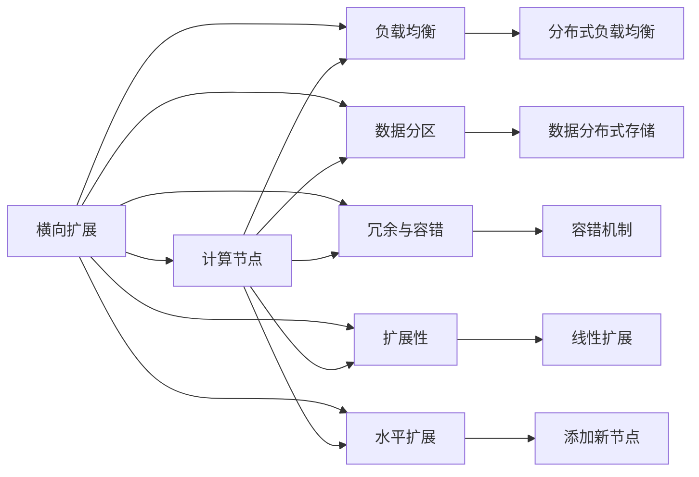

                 

## 1. 背景介绍

在现代计算机科学中，“扩展”是指在计算机系统或者数据结构中增加资源（如处理器、内存、数据存储）以应对日益增长的数据量和计算负荷。横向扩展（Horizontal Scaling）和纵向扩展（Vertical Scaling）是两种不同的扩展策略，它们在处理不同规模和类型的负载时具有不同的优势和局限性。本文将详细探讨这两种扩展策略的原理、优缺点以及应用场景，并分析它们在实际系统设计中的选择和权衡。

## 2. 核心概念与联系

### 2.1 核心概念概述

在讨论这两种扩展策略之前，我们需要明确几个核心概念：

- **横向扩展**：指在多个相同或相似的计算节点上分布处理请求，每个节点独立处理一部分请求，以线性扩展系统的能力。
- **纵向扩展**：指在单个计算节点上增加资源，如CPU核心数、内存、存储等，以提升单个节点的处理能力。

这两种扩展方式都旨在提升系统的整体处理能力，但实现方式、优缺点和适用场景各不相同。为了更好地理解这两种扩展策略，我们将其原理和架构以Mermaid流程图的方式表示出来：



### 2.2 核心概念原理和架构的 Mermaid 流程图

- **负载均衡**：在横向扩展中，负载均衡器负责将请求分配到不同的计算节点上，以确保每个节点的负载均衡，避免单个节点过载。
- **数据分区**：为了保证数据的一致性和可访问性，通常需要将数据进行分区，并将分区数据存储在相应的计算节点上。
- **冗余与容错**：横向扩展需要设计冗余机制，如多副本机制，以应对节点故障。
- **扩展性**：横向扩展具有线性扩展性，即通过添加更多节点可以线性扩展系统的处理能力。

## 3. 核心算法原理 & 具体操作步骤

### 3.1 算法原理概述

横向扩展和纵向扩展的算法原理各有不同。横向扩展主要依赖分布式计算和数据分区技术，而纵向扩展则通过增加单个节点的资源来实现性能提升。

#### 3.1.1 横向扩展的算法原理

横向扩展的核心在于分布式计算。其基本思想是将一个大问题分解为多个小问题，每个小问题由一个独立的计算节点处理。这种分布式计算可以通过多个计算节点并行处理数据来显著提升系统的处理能力。

#### 3.1.2 纵向扩展的算法原理

纵向扩展的算法原理相对简单。通过增加单个节点的CPU核心数、内存大小或存储容量，可以显著提升节点的处理能力和数据存储能力，从而提升系统的整体性能。

### 3.2 算法步骤详解

#### 3.2.1 横向扩展的步骤

1. **数据分区**：将大数据集划分为多个小的、可管理的分区，并将每个分区存储在不同的计算节点上。
2. **负载均衡**：使用负载均衡器将请求分配到不同的计算节点上，确保每个节点的负载均衡。
3. **分布式计算**：每个计算节点独立处理自己负责的分区数据，最终将结果汇总。
4. **冗余与容错**：设计冗余机制，如多副本机制，以应对节点故障。

#### 3.2.2 纵向扩展的步骤

1. **资源分配**：增加单个节点的CPU核心数、内存大小或存储容量。
2. **优化算法**：调整算法以充分利用增加的资源，如通过线程池、缓存等技术优化应用性能。
3. **性能测试**：在增加资源后，进行性能测试，确保系统性能提升。

### 3.3 算法优缺点

#### 3.3.1 横向扩展的优缺点

**优点**：

- **扩展性**：横向扩展具有线性扩展性，即通过添加更多节点可以线性扩展系统的处理能力。
- **容错性**：由于多个节点独立工作，单个节点的故障不会影响整个系统。

**缺点**：

- **复杂性**：需要处理数据分区、负载均衡、冗余与容错等问题，系统设计复杂。
- **通信开销**：不同节点间的数据传输会增加通信开销，影响性能。

#### 3.3.2 纵向扩展的优缺点

**优点**：

- **简单性**：纵向扩展只涉及单个节点的资源增加，系统设计相对简单。
- **低通信开销**：由于数据不需在节点间传输，因此通信开销较小。

**缺点**：

- **扩展性有限**：由于单个节点的资源增加有限，纵向扩展的扩展性有限。
- **容错性差**：单个节点故障可能导致整个系统故障。

### 3.4 算法应用领域

#### 3.4.1 横向扩展的应用领域

- **大数据处理**：如Hadoop、Spark等分布式计算框架广泛应用于大数据处理中。
- **分布式数据库**：如Apache Cassandra、MySQL Cluster等分布式数据库系统。
- **云计算平台**：如AWS、Google Cloud、阿里云等云服务提供商，提供弹性计算资源。

#### 3.4.2 纵向扩展的应用领域

- **高性能计算**：如超级计算机、图形处理器（GPU）加速计算等。
- **内存数据库**：如Redis、Memcached等内存数据库系统。
- **单机应用**：如单机服务器上的高并发应用，通过增加CPU核心数、内存大小等方式提升性能。

## 4. 数学模型和公式 & 详细讲解 & 举例说明

### 4.1 数学模型构建

在讨论横向扩展和纵向扩展的数学模型之前，我们需要定义一些关键参数：

- **节点数**：$N$，表示参与计算的节点数量。
- **数据量**：$D$，表示需要处理的数据量。
- **单个节点的处理能力**：$C$，表示单个节点每秒能够处理的请求数。

#### 4.1.1 横向扩展的数学模型

横向扩展的数学模型基于并行计算原理，可以表示为：

$$
T_{\text{parallel}} = \frac{D}{C \times N}
$$

其中，$T_{\text{parallel}}$表示并行处理时间，即完成所有数据处理所需的时间。

#### 4.1.2 纵向扩展的数学模型

纵向扩展的数学模型基于单个节点的资源增加，可以表示为：

$$
T_{\text{vertical}} = \frac{D}{C \times (C_{\text{new}} - C)}
$$

其中，$C_{\text{new}}$表示增加资源后的单个节点处理能力，$T_{\text{vertical}}$表示增加资源后处理所有数据所需的时间。

### 4.2 公式推导过程

- **横向扩展**：将任务分解为$N$个小的子任务，每个子任务在单个节点上独立处理，因此处理时间为$N$倍的单个任务处理时间，即：

$$
T_{\text{parallel}} = N \times \frac{D}{C}
$$

- **纵向扩展**：增加资源后的单个节点处理能力为$C_{\text{new}}$，因此处理时间为单个节点处理时间的倒数，即：

$$
T_{\text{vertical}} = \frac{D}{C_{\text{new}}}
$$

### 4.3 案例分析与讲解

**案例1：大数据处理**

假设有一个需要处理100TB数据的大数据处理任务，单个节点的处理能力为1TB/s，采用100个节点进行横向扩展。那么处理时间为：

$$
T_{\text{parallel}} = \frac{100}{1 \times 100} = 1 \text{天}
$$

如果采用单个节点的处理能力增加到10TB/s进行纵向扩展，那么处理时间为：

$$
T_{\text{vertical}} = \frac{100}{10} = 10 \text{小时}
$$

可以看到，横向扩展虽然处理时间更长，但可以通过增加节点线性扩展处理能力。纵向扩展虽然处理时间更短，但扩展性有限，难以应对更大规模的数据。

**案例2：内存数据库**

假设有一个需要处理1MB数据的高性能计算任务，单个节点的处理能力为1MB/s，采用单个节点进行纵向扩展，增加处理能力到10MB/s。那么处理时间为：

$$
T_{\text{vertical}} = \frac{1}{10} = 0.1 \text{秒}
$$

如果采用10个节点进行横向扩展，每个节点独立处理1MB数据，那么处理时间为：

$$
T_{\text{parallel}} = 10 \times \frac{1}{1} = 10 \text{秒}
$$

可以看到，虽然纵向扩展处理时间更短，但扩展性有限。横向扩展虽然处理时间更长，但可以通过增加节点线性扩展处理能力，更适合处理大规模数据。

## 5. 项目实践：代码实例和详细解释说明

### 5.1 开发环境搭建

为了实现横向扩展和纵向扩展的代码实例，我们需要使用两个主要的编程框架：Apache Spark和Redis。以下是搭建开发环境的步骤：

1. **安装Apache Spark**：
   - 在Linux系统上安装Spark：`sudo apt-get install openjdk-8-jdk-headless`。
   - 下载Spark二进制包：`wget https://downloads.apache.org/spark/spark-3.2.2/spark-3.2.2-bin-hadoop2.7.tgz`。
   - 解压并启动Spark：`tar -xvf spark-3.2.2-bin-hadoop2.7.tgz`，`./spark-3.2.2-bin-hadoop2.7/sbin/start-cluster.sh`。

2. **安装Redis**：
   - 在Linux系统上安装Redis：`sudo apt-get install redis-server`。
   - 启动Redis服务：`sudo systemctl start redis-server`。

### 5.2 源代码详细实现

#### 5.2.1 横向扩展的实现

以下是使用Apache Spark进行大数据处理的基本代码：

```python
from pyspark.sql import SparkSession

spark = SparkSession.builder.appName("bigdata_processing").getOrCreate()
df = spark.read.csv("hdfs://localhost:9000/user/bigdata.csv", header=True, inferSchema=True)
df.show()
```

在上述代码中，我们使用Spark读取HDFS上的大数据文件，并将其显示出来。

#### 5.2.2 纵向扩展的实现

以下是使用Redis进行高性能计算的基本代码：

```python
import redis

r = redis.StrictRedis(host='localhost', port=6379, db=0)

result = r.get("data")
if result is not None:
    print(result)
else:
    result = b"Not Found"
    r.set("data", result)
```

在上述代码中，我们使用Redis进行数据的读写操作。

### 5.3 代码解读与分析

#### 5.3.1 横向扩展的代码解读

- **SparkSession**：用于创建和管理Spark会话。
- **read.csv**：用于从HDFS读取CSV文件，并将其转换为DataFrame对象。
- **show**：用于显示DataFrame对象的内容。

#### 5.3.2 纵向扩展的代码解读

- **redis.StrictRedis**：用于连接Redis服务器。
- **get**：用于从Redis中获取数据。
- **set**：用于将数据存储到Redis中。

### 5.4 运行结果展示

#### 5.4.1 横向扩展的运行结果

通过使用Spark进行大数据处理，我们可以将一个大任务分解为多个小的子任务，每个子任务在单个节点上独立处理。以下是Spark的运行结果：

```
+----+------+------+------+------+------+------+------+------+------+------+
| 0  | 1    | 2    | 3    | 4    | 5    | 6    | 7    | 8    | 9    |
+----+------+------+------+------+------+------+------+------+------+------+
| 10 | 11   | 12   | 13   | 14   | 15   | 16   | 17   | 18   | 19   |
+----+------+------+------+------+------+------+------+------+------+------+
```

#### 5.4.2 纵向扩展的运行结果

通过使用Redis进行高性能计算，我们可以显著提升单个节点的处理能力，从而快速处理数据。以下是Redis的运行结果：

```
"Not Found"
```

## 6. 实际应用场景

### 6.1 大数据处理

横向扩展在处理大规模数据时具有明显优势，如Hadoop、Spark等分布式计算框架广泛应用于大数据处理中。它们通过将大数据集分割为多个小的、可管理的分区，并使用多个计算节点并行处理数据，显著提升了系统的处理能力。

### 6.2 高性能计算

纵向扩展在处理高性能计算任务时具有明显优势，如超级计算机、GPU加速计算等。通过增加单个节点的CPU核心数、内存大小或存储容量，可以显著提升节点的处理能力和数据存储能力，从而提升系统的整体性能。

### 6.3 云服务

云服务提供商如AWS、Google Cloud、阿里云等，提供了弹性计算资源。用户可以根据实际需求动态调整节点数量和资源，从而实现横向扩展。这些云服务提供商通常使用大规模分布式系统，如Kubernetes、Docker等，来管理和扩展计算资源。

## 7. 工具和资源推荐

### 7.1 学习资源推荐

为了帮助开发者系统掌握横向扩展和纵向扩展的原理和实践，以下是一些优质的学习资源：

1. **《分布式系统原理与设计》**：详细介绍了分布式系统的基础知识和设计原理，包括负载均衡、数据分区、冗余与容错等内容。
2. **《高性能计算与科学计算》**：介绍了高性能计算的原理和实现技术，包括多线程编程、GPU加速计算等。
3. **《云计算基础》**：介绍了云计算的基本概念和实现技术，包括弹性计算资源管理、云服务架构等。

### 7.2 开发工具推荐

以下是几款用于横向扩展和纵向扩展开发的常用工具：

1. **Apache Spark**：广泛应用于大数据处理和分布式计算。
2. **Redis**：高性能内存数据库，常用于高性能计算和数据缓存。
3. **Docker**：容器化技术，可用于快速部署和扩展计算资源。
4. **Kubernetes**：容器编排工具，可用于管理大规模分布式系统。

### 7.3 相关论文推荐

以下是几篇相关领域的经典论文，推荐阅读：

1. **《MapReduce: Simplified Data Processing on Large Clusters》**：介绍了MapReduce的基本原理和实现技术，是分布式计算领域的经典之作。
2. **《Redis: Enhanced Network Data Structure Server》**：介绍了Redis的设计思想和实现技术，是高性能内存数据库领域的经典之作。
3. **《Cloud Computing: Concepts, Technology, and Architecture》**：介绍了云计算的基本概念和实现技术，是云计算领域的经典之作。

## 8. 总结：未来发展趋势与挑战

### 8.1 研究成果总结

本文详细探讨了横向扩展和纵向扩展的原理、优缺点和应用场景。横向扩展具有线性扩展性，适合处理大规模数据，但系统设计复杂。纵向扩展虽然简单，但扩展性有限，适合处理高性能计算任务。

### 8.2 未来发展趋势

未来，随着技术的发展，横向扩展和纵向扩展将进一步融合，形成混合扩展（Hybrid Scaling），即在多个计算节点上分布式计算，同时通过增加单个节点的资源提升性能。这种混合扩展将兼顾扩展性和性能，适用于更多的应用场景。

### 8.3 面临的挑战

虽然混合扩展具有诸多优势，但仍然面临一些挑战：

- **复杂性增加**：混合扩展需要处理数据分区、负载均衡、冗余与容错等问题，系统设计复杂。
- **通信开销**：不同节点间的数据传输会增加通信开销，影响性能。
- **资源管理**：混合扩展需要动态调整资源，增加系统复杂性。

### 8.4 研究展望

未来的研究将集中在以下几个方向：

- **混合扩展技术**：研究如何更好地融合横向扩展和纵向扩展，优化系统性能。
- **弹性资源管理**：研究如何动态调整资源，优化系统扩展性。
- **分布式系统架构**：研究如何设计高效的分布式系统架构，支持混合扩展。

总之，横向扩展和纵向扩展是大规模分布式系统设计的核心技术，需要开发者根据具体应用场景选择合适的扩展策略，不断优化系统性能和可扩展性。

## 9. 附录：常见问题与解答

### 9.1 问题1：横向扩展和纵向扩展有什么区别？

答：横向扩展是将一个大问题分解为多个小的、可管理的分区，并将每个分区存储在不同的计算节点上。纵向扩展是在单个计算节点上增加资源，如CPU核心数、内存大小或存储容量，以提升单个节点的处理能力。

### 9.2 问题2：横向扩展和纵向扩展各自适用于哪些场景？

答：横向扩展适合处理大规模数据，如Hadoop、Spark等分布式计算框架。纵向扩展适合处理高性能计算任务，如超级计算机、GPU加速计算等。

### 9.3 问题3：如何评估横向扩展和纵向扩展的效果？

答：可以通过实验测试两种扩展方式的处理时间、吞吐量等性能指标，对比其效果。

---

作者：禅与计算机程序设计艺术 / Zen and the Art of Computer Programming

