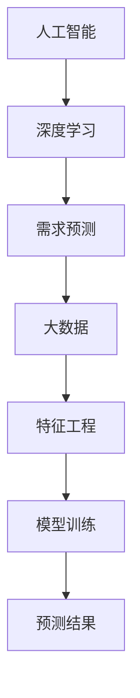

                 

# 欲望的智能化：AI预测人类需求

## 1. 背景介绍

### 1.1 问题由来

在当今信息爆炸的时代，人类对于个性化、定制化的需求日益增长，然而传统的工业化生产模式难以满足这一需求。如何在保证生产效率的同时，实现更精准的需求预测，成为了一个亟待解决的问题。随着人工智能技术的进步，尤其是深度学习和大数据技术的成熟，人工智能（AI）预测人类需求的方法应运而生，为传统行业带来了颠覆性的变革。

### 1.2 问题核心关键点

AI预测人类需求的核心在于通过数据挖掘和大数据分析，挖掘出用户的行为和偏好，结合历史数据和机器学习算法，预测用户未来的需求和行为。这一过程包括数据采集、特征工程、模型训练、结果分析等多个环节，每个环节都需要考虑数据的质量、模型选择的合理性以及预测结果的可解释性。

### 1.3 问题研究意义

AI预测人类需求对于企业来说，可以优化库存管理、精准营销、提升客户满意度等方面带来显著效益。对于社会来说，可以更好地应对消费升级、个性化服务、公共资源分配等问题，提升社会的整体效率和幸福感。

## 2. 核心概念与联系

### 2.1 核心概念概述

为更好地理解AI预测人类需求的理论基础和技术实现，本节将介绍几个密切相关的核心概念：

- **人工智能（AI）**：涵盖了机器学习、深度学习、自然语言处理等技术，目标是使计算机具备人类智能。
- **需求预测（Demand Forecasting）**：通过分析和挖掘数据，预测未来需求或行为的一种方法。
- **深度学习（Deep Learning）**：一种特殊的机器学习方法，通过多层神经网络进行特征学习和模式识别。
- **大数据（Big Data）**：指数据量巨大、数据类型多样的数据集合，需要特殊的数据处理和分析方法。
- **特征工程（Feature Engineering）**：通过数据清洗、特征提取、特征选择等步骤，将原始数据转化为机器学习模型可用的特征。
- **模型训练（Model Training）**：通过将数据集分为训练集和测试集，使用训练集对模型进行训练，并在测试集上评估性能的过程。
- **预测结果（Prediction Result）**：模型根据输入数据预测出的结果，常用于评估模型性能和进行业务决策。

这些核心概念之间的逻辑关系可以通过以下Mermaid流程图来展示：



这个流程图展示了大数据与人工智能、深度学习与需求预测之间的联系，以及特征工程和模型训练在需求预测中的重要作用。

## 3. 核心算法原理 & 具体操作步骤

### 3.1 算法原理概述

AI预测人类需求的算法原理可以概括为以下几个步骤：

1. **数据采集**：收集用户的行为数据、历史订单数据、社交媒体数据等。
2. **特征工程**：对收集到的数据进行预处理、特征提取和选择，以提取出对预测有用的特征。
3. **模型训练**：选择合适的机器学习或深度学习模型，对特征数据进行训练，以得到一个能够准确预测需求的模型。
4. **结果分析**：对预测结果进行分析，评估模型的性能，并对预测结果进行解释和调整。

### 3.2 算法步骤详解

以下将详细讲解AI预测人类需求的算法步骤：

#### 3.2.1 数据采集

- **用户行为数据**：包括用户的浏览记录、购买记录、评价记录等。
- **历史订单数据**：包括用户过去一段时间内的订单信息，如购买时间、商品类别、购买次数等。
- **社交媒体数据**：包括用户在社交媒体上的互动记录，如评论、点赞、分享等。

#### 3.2.2 特征工程

- **数据清洗**：处理缺失值、异常值和噪声，以确保数据的准确性。
- **特征提取**：将原始数据转化为机器学习模型可用的特征，如时间戳、购买频率、商品类别等。
- **特征选择**：通过特征选择算法（如LASSO、随机森林等），选择对预测结果影响最大的特征，以降低模型的复杂度。

#### 3.2.3 模型训练

- **模型选择**：选择合适的机器学习或深度学习模型，如线性回归、决策树、神经网络等。
- **训练过程**：使用训练集对模型进行训练，调整模型的参数，使其能够准确预测需求。
- **模型评估**：使用测试集对模型进行评估，计算模型的准确率、召回率、F1值等指标，以评估模型的性能。

#### 3.2.4 结果分析

- **结果可视化**：使用图表、图形等可视化工具，展示预测结果和模型的性能。
- **结果解释**：对预测结果进行解释，分析模型的决策依据和原因。
- **调整优化**：根据预测结果和分析结果，调整模型的参数和特征，以提高模型的性能。

### 3.3 算法优缺点

AI预测人类需求的方法具有以下优点：

- **准确性高**：通过深度学习和大数据分析，能够准确预测用户的需求和行为。
- **实时性**：模型可以实时处理数据，快速预测需求变化。
- **可解释性**：通过特征选择和结果分析，能够解释模型的预测依据。

同时，该方法也存在一些缺点：

- **数据依赖性**：预测结果高度依赖于数据的完整性和准确性。
- **模型复杂性**：深度学习模型较为复杂，训练和调参难度较大。
- **成本高**：数据采集和特征工程需要大量的资源和时间投入。

尽管存在这些局限性，但AI预测人类需求在电商、金融、旅游等多个领域已经取得了显著的效果，成为行业中的重要工具。

### 3.4 算法应用领域

AI预测人类需求在以下领域得到了广泛应用：

- **电商行业**：通过预测用户需求，优化库存管理和供应链管理，提高销售额。
- **金融行业**：预测客户贷款需求和投资需求，优化风险控制和客户服务。
- **旅游行业**：预测旅游需求和趋势，提升旅游体验和收益。
- **医疗行业**：预测患者就诊需求，优化医院资源分配和患者服务。
- **物流行业**：预测货物需求和运输需求，优化物流路径和配送效率。

这些应用场景展示了AI预测人类需求方法的广泛适用性和强大的商业价值。

## 4. 数学模型和公式 & 详细讲解 & 举例说明

### 4.1 数学模型构建

为了更加系统地理解AI预测人类需求，我们将介绍一个简单的数学模型，用于描述需求预测的过程。

假设用户的需求 $D_t$ 可以用以下模型来预测：

$$ D_t = \alpha_1 x_1 + \alpha_2 x_2 + \ldots + \alpha_n x_n + \epsilon_t $$

其中，$x_i$ 表示第 $i$ 个特征，$\alpha_i$ 表示第 $i$ 个特征的权重，$\epsilon_t$ 表示误差项。该模型假设需求 $D_t$ 与特征 $x_i$ 之间存在线性关系，并引入了误差项 $\epsilon_t$ 来处理模型预测误差。

### 4.2 公式推导过程

首先，我们需要对特征 $x_i$ 进行标准化处理，以消除特征之间的量纲差异，提高模型的预测能力。标准化公式如下：

$$ x_i = \frac{x_i - \mu_i}{\sigma_i} $$

其中，$\mu_i$ 表示第 $i$ 个特征的均值，$\sigma_i$ 表示第 $i$ 个特征的标准差。

然后，我们使用最小二乘法来估计模型参数 $\alpha_i$。最小二乘法的目标是使得模型预测值与真实值之间的误差平方和最小。具体来说，最小二乘法的优化目标为：

$$ \sum_{t=1}^{T} (D_t - \hat{D}_t)^2 $$

其中，$T$ 表示样本数量，$\hat{D}_t$ 表示模型预测值。

通过求解上述优化问题，可以得到模型参数 $\alpha_i$ 的估计值。求解过程可以通过矩阵运算来实现，具体公式如下：

$$ \hat{\alpha} = (X^TX)^{-1}X^TY $$

其中，$X$ 表示特征矩阵，$Y$ 表示目标变量向量，$\hat{\alpha}$ 表示模型参数的估计值。

### 4.3 案例分析与讲解

假设我们有一个电商网站，需要预测用户的购买需求。根据历史订单数据，我们可以得到以下特征：

- 用户ID：表示用户的基本信息。
- 商品类别：表示用户购买的商品类型。
- 购买时间：表示用户购买的时间。
- 购买频率：表示用户在不同时间段的购买次数。

我们将这些特征标准化后，输入到上述模型中，可以得到用户需求的预测值。通过对预测值进行分析，可以优化库存管理和推荐系统，提高用户体验和销售收益。

## 5. 项目实践：代码实例和详细解释说明

### 5.1 开发环境搭建

在进行AI预测人类需求的项目实践前，我们需要准备好开发环境。以下是使用Python进行项目开发的常见环境配置流程：

1. 安装Anaconda：从官网下载并安装Anaconda，用于创建独立的Python环境。
2. 创建并激活虚拟环境：
```bash
conda create -n py35 python=3.5 
conda activate py35
```
3. 安装必要的Python包：
```bash
conda install numpy pandas scikit-learn matplotlib tqdm
```

### 5.2 源代码详细实现

以下是一个简单的Python代码示例，用于描述如何基于线性回归模型进行需求预测。

```python
import numpy as np
import pandas as pd
from sklearn.linear_model import LinearRegression

# 读取数据集
data = pd.read_csv('data.csv')

# 标准化特征
X = (data[['feature1', 'feature2']] - data[['feature1', 'feature2']].mean()) / data[['feature1', 'feature2']].std()

# 目标变量
y = data['target']

# 创建线性回归模型
model = LinearRegression()

# 训练模型
model.fit(X, y)

# 预测需求
X_test = np.array([[1.0, 2.0]])
y_pred = model.predict(X_test)

print(y_pred)
```

### 5.3 代码解读与分析

让我们再详细解读一下关键代码的实现细节：

**读取数据集**：使用Pandas库读取CSV格式的数据集，并存储在DataFrame中。

**标准化特征**：对特征数据进行标准化处理，以消除量纲差异，提高模型的预测能力。

**创建模型**：使用Scikit-learn库中的线性回归模型，并使用训练数据对模型进行训练。

**预测需求**：对标准化后的测试数据进行预测，并输出预测结果。

## 6. 实际应用场景

### 6.1 智能推荐系统

智能推荐系统是AI预测人类需求的重要应用场景之一。通过分析用户的历史行为数据和兴趣偏好，推荐系统可以实时推荐用户感兴趣的商品，提高用户的购物体验和满意度。

在实际应用中，推荐系统可以结合深度学习模型和特征工程技术，对用户行为数据进行分析和建模，预测用户的购买需求和偏好，从而实现个性化推荐。推荐系统的效果直接影响了用户的购物体验和电商平台的销售额，因此对于电商平台来说，构建高效、精准的推荐系统至关重要。

### 6.2 金融风险管理

金融行业也广泛应用AI预测人类需求的方法。通过分析用户的财务数据和行为记录，预测用户的贷款需求和投资需求，金融公司可以优化贷款审批流程，降低违约风险，提高客户满意度。

在实际应用中，金融公司可以使用AI预测需求的方法，结合信用评分模型和风险评估模型，对用户进行综合评估，预测用户的还款能力和还款意愿。同时，金融公司可以通过实时监控和预测用户的投资需求，优化投资组合，降低投资风险，提高投资收益。

### 6.3 旅游需求预测

旅游行业也是AI预测人类需求的典型应用场景之一。通过分析用户的旅游历史数据和行为记录，旅游公司可以预测用户的旅游需求和趋势，优化旅游线路和资源配置，提高用户满意度。

在实际应用中，旅游公司可以使用AI预测需求的方法，结合历史数据和机器学习模型，对用户的旅游需求进行预测。旅游公司可以根据预测结果，优化旅游线路、调整旅游产品、提高旅游服务质量，从而提升用户的旅游体验和收益。

## 7. 工具和资源推荐

### 7.1 学习资源推荐

为了帮助开发者系统掌握AI预测人类需求的理论基础和实践技巧，这里推荐一些优质的学习资源：

1. 《机器学习实战》系列书籍：由Google工程师编写，介绍了机器学习的基础知识和经典算法，适合初学者入门。
2. 《深度学习》课程：由斯坦福大学开设的深度学习课程，讲解了深度学习的原理和应用，适合有一定编程基础的开发者。
3. 《Python数据分析实战》书籍：由Kaggle平台上的数据科学家编写，介绍了Python数据分析的基础知识和实战技巧，适合数据分析师和数据工程师。
4. Kaggle平台：全球最大的数据科学竞赛平台，提供了丰富的数据集和挑战，适合数据科学爱好者和工程师。
5. Coursera平台：提供了许多著名大学的在线课程，涵盖机器学习、深度学习、数据科学等多个领域。

通过对这些资源的学习实践，相信你一定能够快速掌握AI预测人类需求的精髓，并用于解决实际的业务问题。

### 7.2 开发工具推荐

高效的开发离不开优秀的工具支持。以下是几款用于AI预测人类需求开发的常用工具：

1. Python语言：Python是数据科学和机器学习领域的主流编程语言，具有丰富的数据处理和机器学习库。
2. Scikit-learn库：一个流行的Python机器学习库，提供了许多经典的机器学习算法和工具。
3. TensorFlow框架：由Google开发的深度学习框架，支持多种神经网络模型和分布式计算。
4. PyTorch框架：由Facebook开发的深度学习框架，支持动态计算图和GPU加速。
5. Jupyter Notebook：一个交互式的Python开发环境，适合进行数据处理和模型训练。

合理利用这些工具，可以显著提升AI预测人类需求任务的开发效率，加快创新迭代的步伐。

### 7.3 相关论文推荐

AI预测人类需求的研究源于学界的持续研究。以下是几篇奠基性的相关论文，推荐阅读：

1. "An Introduction to Statistical Learning" by Gareth James et al.：介绍了统计学习的基础知识和常用算法，适合初学者。
2. "Deep Learning" by Ian Goodfellow et al.：讲解了深度学习的原理和应用，适合有一定编程基础的开发者。
3. "The Elements of Statistical Learning" by Trevor Hastie et al.：介绍了统计学习的方法和应用，适合数据科学家和工程师。
4. "Predictive Analytics" by Eric Siegel：介绍了预测分析的基础知识和实用技巧，适合数据科学家和分析师。
5. "Machine Learning Yearning" by Andrew Ng：讲解了机器学习的实际应用和最佳实践，适合从业者阅读。

这些论文代表了大数据和人工智能领域的研究进展，通过学习这些前沿成果，可以帮助研究者把握学科前进方向，激发更多的创新灵感。

## 8. 总结：未来发展趋势与挑战

### 8.1 总结

本文对AI预测人类需求的算法原理和实践技巧进行了全面系统的介绍。首先阐述了AI预测人类需求的理论基础和技术实现，明确了数据采集、特征工程、模型训练等关键步骤，以及预测结果的分析和调整方法。其次，通过具体案例和代码实例，展示了AI预测人类需求在电商、金融、旅游等多个领域的应用。最后，推荐了相关的学习资源、开发工具和研究论文，为读者提供了完整的学习路径。

通过本文的系统梳理，可以看到，AI预测人类需求通过深度学习和大数据分析，在多个领域展示了强大的应用潜力，成为解决实际问题的有力工具。未来，随着数据科学和人工智能技术的进一步发展，AI预测人类需求将变得更加精准和高效，带来更多的商业价值和社会效益。

### 8.2 未来发展趋势

展望未来，AI预测人类需求的研究将呈现以下几个发展趋势：

1. **数据质量提升**：随着数据采集技术的进步，数据质量和数据量将不断提升，为需求预测带来更高的准确性。
2. **模型复杂度降低**：未来的需求预测模型将更加简单高效，能够在更短的时间内完成训练和预测。
3. **实时性增强**：实时数据处理和预测技术的发展，使得需求预测更加及时，能够快速应对市场变化。
4. **跨领域融合**：AI预测人类需求将与其他人工智能技术进行更深层次的融合，如自然语言处理、计算机视觉等，提升综合预测能力。
5. **可解释性增强**：通过更好的特征选择和结果解释，使得AI预测模型更加透明和可解释。
6. **个性化增强**：根据用户的多样化需求，提供更加个性化的推荐和服务，提高用户体验和满意度。

以上趋势凸显了AI预测人类需求方法的广泛应用前景，通过不断优化算法和模型，可以更好地满足用户需求，提升企业的竞争力和效率。

### 8.3 面临的挑战

尽管AI预测人类需求已经取得了显著的进展，但在迈向更加智能化、普适化应用的过程中，仍面临着诸多挑战：

1. **数据隐私保护**：用户数据隐私保护是一个重要问题，需要在数据采集和使用过程中遵守相关法规和伦理规范。
2. **数据质量波动**：数据采集和处理过程中，数据质量可能存在波动，影响需求预测的准确性。
3. **模型鲁棒性不足**：在面对异常数据和噪声时，预测模型的鲁棒性不足，可能导致预测结果不准确。
4. **预测结果解释**：预测模型的可解释性不足，用户难以理解和信任预测结果。
5. **资源消耗较大**：深度学习和大数据分析需要大量的计算资源和时间成本，增加了企业负担。

这些挑战需要从数据采集、模型设计、算法优化等多个方面进行综合考虑，才能构建更加高效、准确、可解释的需求预测系统。

### 8.4 研究展望

未来，AI预测人类需求的研究需要关注以下几个方向：

1. **数据隐私保护**：在数据采集和使用过程中，如何保护用户隐私，同时利用数据价值，是一个亟待解决的问题。
2. **数据质量提升**：如何从多个数据源获取高质量的数据，并构建数据融合模型，提升数据质量，是提高预测准确性的关键。
3. **模型鲁棒性增强**：通过引入鲁棒性增强技术，提高模型的抗干扰能力和鲁棒性，确保在面对异常数据时，仍能提供稳定的预测结果。
4. **可解释性增强**：通过更好的特征选择和结果解释，使得AI预测模型更加透明和可解释，增强用户对模型的信任。
5. **实时性提升**：通过实时数据处理和预测技术，实现更加及时的预测，满足市场变化的需求。
6. **跨领域融合**：与其他人工智能技术进行更深层次的融合，如自然语言处理、计算机视觉等，提升综合预测能力。

这些研究方向将推动AI预测人类需求技术的不断进步，为构建更加高效、准确、可解释的需求预测系统奠定基础。

## 9. 附录：常见问题与解答

**Q1：AI预测人类需求需要多少数据？**

A: 数据量和数据质量对需求预测的效果影响很大。一般而言，数据量越多，预测结果越准确，但数据质量低或数据采集过程有偏差也会影响预测效果。在实际应用中，需要根据具体场景和数据采集难度，选择合适的数据量。

**Q2：AI预测人类需求可以使用哪些算法？**

A: 常用的算法包括线性回归、决策树、随机森林、支持向量机、神经网络等。其中，深度学习算法在处理非线性关系和复杂特征时表现更佳，但需要更多的计算资源和时间成本。

**Q3：AI预测人类需求的结果如何解释？**

A: AI预测结果的解释通常需要结合特征工程和模型分析。通过特征选择和结果可视化，可以解释模型的决策依据和原因，帮助用户理解和信任预测结果。

**Q4：AI预测人类需求的算法实现难度大吗？**

A: AI预测人类需求的算法实现需要一定的编程和数据分析技能，但随着机器学习库和开发工具的普及，算法实现难度逐渐降低。通过学习和实践，可以实现高效、准确的需求预测模型。

**Q5：AI预测人类需求在哪些领域应用最广泛？**

A: AI预测人类需求在电商、金融、旅游、医疗、物流等多个领域应用广泛。通过预测需求，优化库存管理、风险控制、推荐系统等，提升企业的竞争力和效率。

---

作者：禅与计算机程序设计艺术 / Zen and the Art of Computer Programming

