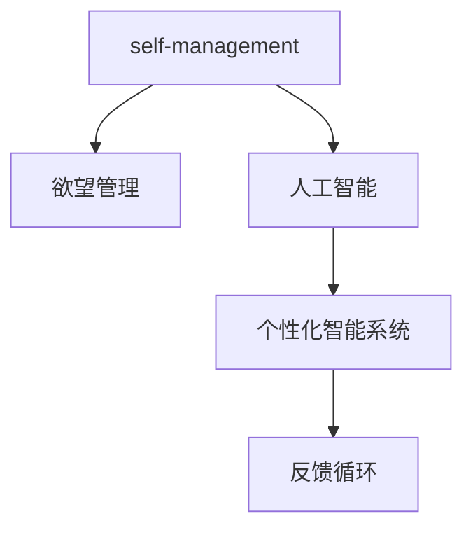

                 

## 1. 背景介绍

在当今数字化高度发展的社会中，如何有效管理个人行为和欲望，成为众多个体和组织关注的焦点。传统行为管理方法依赖于自我约束、心理咨询或药物干预，但这些方法存在个体差异、成本高昂或副作用等问题。随着人工智能(AI)技术的进步，AI辅助的自我管理系统成为一种全新的可能性。本文旨在探讨如何利用AI技术，构建智能的欲望调节器，帮助个体实现自我管理，提升生活质量和幸福感。

## 2. 核心概念与联系

### 2.1 核心概念概述

为更好地理解AI辅助的自我管理系统，本节将介绍几个关键概念：

- **自我管理(self-management)**：指个体通过自我监控、自我调整和自我激励等手段，有效控制和调节自己的行为和欲望，以达成预定的目标。
- **欲望管理(desire management)**：指通过认知行为干预等手段，减少或抑制不利于个体发展的欲望，以促进健康、高效的生活状态。
- **人工智能(AI)**：通过模拟人类智能行为，利用计算机算法和模型解决复杂问题。
- **个性化智能系统(personalized smart system)**：根据个体的特定需求和背景，定制化设计和实现智能系统，以提供最佳的用户体验。
- **反馈循环(feedback loop)**：系统通过收集个体行为数据，实时调整行为干预策略，形成闭环的优化过程。

这些概念之间的逻辑关系可以通过以下Mermaid流程图来展示：



这个流程图展示了各个概念之间的相互关系：

1. 自我管理的目标是实现欲望管理，即通过调节欲望行为，提高生活质量。
2. 人工智能通过模拟人类智能行为，为自我管理系统提供技术和算法支持。
3. 个性化智能系统将AI技术应用于自我管理中，提供量身定制的解决方案。
4. 反馈循环使得系统能够根据个体行为实时调整策略，形成自适应的优化过程。

这些概念共同构成了AI辅助的自我管理系统，以智能化手段解决个体欲望管理的需求。

### 2.2 核心概念原理和架构

**自我管理理论基础**：自我管理主要基于认知行为理论（Cognitive Behavioral Theory, CBT）和行为科学理论（Behavioral Science Theory）。CBT认为个体可以通过自我监控和行为调整来改变认知，进而改变行为。行为科学理论则强调环境对个体行为的影响，并提出了多种行为干预技术，如正强化、负强化等。

**欲望管理算法框架**：欲望管理算法一般包括以下步骤：
1. **数据收集**：收集个体在特定情境下的行为数据，包括欲望表达、行为反应等。
2. **情感分析**：利用自然语言处理(NLP)技术，分析个体在特定情境下的情感状态，以识别欲望的强度和类型。
3. **行为预测**：建立预测模型，预测个体在特定情境下的行为趋势，以提前进行干预。
4. **干预策略**：设计行为干预策略，如正激励、负激励、注意力转移等，减少或抑制不良欲望。
5. **反馈调整**：根据干预效果和个体反馈，实时调整干预策略，形成闭环优化。

**AI技术支持**：AI技术在自我管理系统中主要应用于以下几个方面：
1. **自然语言处理(NLP)**：用于处理和分析个体与系统的交互文本，提取情感和意图信息。
2. **机器学习(ML)**：用于建立预测模型和优化算法，提升行为预测和干预策略的准确性。
3. **强化学习(RL)**：用于设计智能化的行为干预策略，自动调整干预措施。
4. **推荐系统**：用于根据个体偏好和历史行为，推荐合适的欲望管理内容和方法。

**个性化智能系统架构**：个性化智能系统一般由以下几个模块构成：
1. **用户接口(UI)**：包括文本、语音、图像等多种输入方式，以及文本、图像、声音等多种输出方式，方便个体与系统进行交互。
2. **数据处理模块**：负责数据的收集、存储、清洗和预处理，保证数据的质量和可用性。
3. **行为分析模块**：利用AI技术对个体行为进行分析和建模，识别欲望和行为的规律。
4. **干预模块**：根据分析结果和用户需求，设计并实施个性化干预措施。
5. **反馈模块**：收集个体反馈，评估干预效果，实时调整干预策略。

## 3. 核心算法原理 & 具体操作步骤

### 3.1 算法原理概述

AI辅助的自我管理系统通过AI技术实现对个体欲望的智能调节。该系统通过收集个体的行为数据，使用机器学习算法分析并预测个体欲望，然后设计个性化的干预策略，并通过智能接口实时提供反馈和调整。整个过程形成了闭环的反馈系统，持续优化干预效果，最终实现自我管理的自动化和智能化。

### 3.2 算法步骤详解

基于AI技术的自我管理系统主要包括以下几个步骤：

**Step 1: 数据收集**
- 系统通过UI收集个体行为数据，包括文本、语音、图像等。
- 数据通过API接口存储在云端数据库中，供后续分析使用。

**Step 2: 情感分析与行为预测**
- 利用NLP技术，对文本数据进行情感分析，识别个体的情感状态。
- 使用机器学习算法，建立预测模型，预测个体在特定情境下的行为趋势。
- 根据情感和行为预测结果，判断个体当前是否存在不良欲望。

**Step 3: 行为干预**
- 系统根据预测结果和个体需求，设计个性化的干预策略。
- 通过UI向个体提供行为干预措施，如正激励、负激励、注意力转移等。
- 记录个体对干预措施的反应，更新行为模型。

**Step 4: 反馈与调整**
- 收集个体对干预措施的反馈，评估干预效果。
- 根据反馈结果，实时调整干预策略和行为模型。
- 将优化后的模型和策略应用于后续的干预过程中。

**Step 5: 系统评估与优化**
- 定期评估系统的整体性能和干预效果。
- 根据评估结果，优化系统的算法和策略，提升干预效果和用户体验。

### 3.3 算法优缺点

**优点**：
1. **个性化**：根据个体差异和需求，提供量身定制的欲望管理方案，提升干预效果。
2. **实时性**：通过实时数据反馈和模型调整，系统能够及时响应个体需求，提升干预效率。
3. **自适应性**：系统能够根据个体行为和反馈，自适应调整干预策略，提升干预的灵活性和可持续性。
4. **可扩展性**：系统可以应用于多种情境和需求，具有良好的通用性和可扩展性。

**缺点**：
1. **隐私保护**：系统需要收集和存储大量个人数据，存在隐私泄露风险。
2. **数据质量**：数据质量对系统的性能和干预效果有直接影响，数据收集和处理不当可能导致干预效果不佳。
3. **算法复杂性**：系统的算法设计复杂，需要多学科知识，开发和维护成本较高。
4. **干预效果的不确定性**：干预效果的评估和优化具有不确定性，需要大量的实验和反馈数据。

### 3.4 算法应用领域

AI辅助的自我管理系统已经应用于多个领域，包括但不限于：

- **健康管理**：帮助个体管理饮食、运动、睡眠等行为，预防慢性病。
- **心理健康**：通过监控个体情绪变化，提供心理支持和干预措施。
- **教育辅导**：根据个体学习行为，提供个性化学习方案和反馈。
- **职业发展**：帮助个体管理时间和精力，提升工作绩效和职业满意度。
- **生活习惯管理**：辅助个体管理日常生活中的各种习惯和行为。

## 4. 数学模型和公式 & 详细讲解

### 4.1 数学模型构建

为了更精确地描述AI辅助的自我管理系统，我们将其分解为以下几个子模型：

**情感状态模型**：
- 假设个体的情感状态可以用一个向量 $E = (E_1, E_2, ..., E_n)$ 来表示，其中 $E_i$ 表示个体在 $i$ 个情境中的情感强度。
- 使用情感分析技术，对个体在每个情境下的情感进行量化，得到情感状态向量 $E$。

**行为预测模型**：
- 假设个体在情境 $S$ 下的行为可以用一个随机变量 $B_S$ 来表示，其中 $B_S \sim P(S)$，表示在情境 $S$ 下，个体采取行为的概率分布。
- 使用机器学习算法，如随机森林、神经网络等，建立预测模型 $P(S)$，预测个体在特定情境下的行为。

**干预策略模型**：
- 假设个体在情境 $S$ 下的干预策略可以用一个向量 $I = (I_1, I_2, ..., I_n)$ 来表示，其中 $I_i$ 表示在情境 $S_i$ 下的干预措施。
- 根据情感状态和行为预测结果，设计个性化的干预策略，得到干预策略向量 $I$。

**反馈调整模型**：
- 假设个体对干预策略的反应可以用一个随机变量 $F = (F_1, F_2, ..., F_n)$ 来表示，其中 $F_i$ 表示在情境 $S_i$ 下，个体对干预措施 $I_i$ 的反应。
- 使用强化学习算法，如Q-learning、策略梯度等，优化干预策略 $I$，提升干预效果。

### 4.2 公式推导过程

**情感状态模型**：
- 假设个体在情境 $S_i$ 下的情感状态 $E_i$ 可以用一个高斯分布 $N(\mu_i, \sigma_i^2)$ 来表示，其中 $\mu_i$ 和 $\sigma_i^2$ 分别为情感强度和情感波动。
- 情感状态模型可以表示为：
$$
E_i \sim N(\mu_i, \sigma_i^2)
$$

**行为预测模型**：
- 假设个体在情境 $S_i$ 下的行为 $B_i$ 可以用一个伯努利分布 $B_i \sim Bernoulli(p_i)$ 来表示，其中 $p_i$ 为个体采取行为的概率。
- 行为预测模型可以表示为：
$$
B_i \sim Bernoulli(p_i)
$$
其中 $p_i$ 可以通过情感状态模型和行为特征模型计算得到。

**干预策略模型**：
- 假设干预策略 $I_i$ 与情境 $S_i$ 和情感状态 $E_i$ 有关，可以表示为：
$$
I_i = f(S_i, E_i)
$$
其中 $f$ 为策略映射函数。

**反馈调整模型**：
- 假设个体对干预策略 $I_i$ 的反应 $F_i$ 可以用一个伯努利分布 $F_i \sim Bernoulli(q_i)$ 来表示，其中 $q_i$ 为个体对干预策略的反应概率。
- 强化学习算法可以通过最大化 $q_i$ 来优化干预策略，即：
$$
q_i = \max_{I_i} \sum_{S_i} \pi_i(S_i) \log q_i
$$
其中 $\pi_i(S_i)$ 为情境 $S_i$ 下的状态转移概率。

### 4.3 案例分析与讲解

**案例1: 健康管理**
- 系统通过可穿戴设备收集个体在运动、饮食、睡眠等行为数据。
- 利用情感分析技术，对个体在特定情境下的情感状态进行量化。
- 使用机器学习算法，建立行为预测模型，预测个体在特定情境下的运动趋势。
- 根据预测结果，设计个性化的运动干预策略，如增加运动量、调整饮食计划等。
- 收集个体对干预措施的反馈，评估干预效果，实时调整干预策略和行为模型。

**案例2: 心理健康**
- 系统通过文本分析技术，收集个体在社交媒体上的情感状态和表达内容。
- 使用情感分析技术，对个体的情感状态进行量化。
- 使用机器学习算法，建立情感预测模型，预测个体在特定情境下的情绪变化。
- 根据预测结果，设计个性化的心理干预策略，如提供心理咨询、情绪调节等。
- 收集个体对干预措施的反馈，评估干预效果，实时调整干预策略和情感模型。

## 5. 项目实践：代码实例和详细解释说明

### 5.1 开发环境搭建

在进行项目实践前，我们需要准备好开发环境。以下是使用Python进行开发的环境配置流程：

1. 安装Anaconda：从官网下载并安装Anaconda，用于创建独立的Python环境。

2. 创建并激活虚拟环境：
```bash
conda create -n self-management python=3.8 
conda activate self-management
```

3. 安装Python依赖包：
```bash
pip install numpy pandas scikit-learn tqdm jupyter notebook ipython
```

4. 安装AI工具库：
```bash
pip install tensorflow transformers scikit-learn
```

完成上述步骤后，即可在`self-management`环境中开始项目实践。

### 5.2 源代码详细实现

这里我们以健康管理为例，给出使用TensorFlow和Transformers库进行AI辅助自我管理系统的Python代码实现。

首先，定义情感状态模型和行为预测模型：

```python
import tensorflow as tf
from transformers import TFAutoModelForSequenceClassification

class EmotionModel(tf.keras.Model):
    def __init__(self, num_classes):
        super(EmotionModel, self).__init__()
        self.encoder = TFAutoModelForSequenceClassification.from_pretrained('bert-base-cased', num_labels=num_classes)
        self.fc = tf.keras.layers.Dense(num_classes, activation='softmax')

    def call(self, input_ids, attention_mask, labels=None):
        outputs = self.encoder(input_ids, attention_mask=attention_mask)
        logits = self.fc(outputs.pooler_output)
        if labels is not None:
            loss = tf.keras.losses.sparse_categorical_crossentropy(labels, logits, reduction=tf.keras.losses.Reduction.NONE)
            masked_loss = tf.boolean_mask(loss, tf.reshape(attention_mask, (-1,1)) > 0)
            masked_labels = tf.boolean_mask(labels, tf.reshape(attention_mask, (-1,1)) > 0)
            loss = tf.reduce_mean(masked_loss) / tf.cast(tf.reduce_sum(tf.reshape(attention_mask, (-1,1))), dtype=tf.float32)
        return logits

class BehaviorModel(tf.keras.Model):
    def __init__(self, num_classes):
        super(BehaviorModel, self).__init__()
        self.encoder = TFAutoModelForSequenceClassification.from_pretrained('bert-base-cased', num_labels=num_classes)
        self.fc = tf.keras.layers.Dense(num_classes, activation='sigmoid')

    def call(self, input_ids, attention_mask, labels=None):
        outputs = self.encoder(input_ids, attention_mask=attention_mask)
        logits = self.fc(outputs.pooler_output)
        if labels is not None:
            loss = tf.keras.losses.binary_crossentropy(labels, logits, reduction=tf.keras.losses.Reduction.NONE)
            masked_loss = tf.boolean_mask(loss, tf.reshape(attention_mask, (-1,1)) > 0)
            masked_labels = tf.boolean_mask(labels, tf.reshape(attention_mask, (-1,1)) > 0)
            loss = tf.reduce_mean(masked_loss) / tf.cast(tf.reduce_sum(tf.reshape(attention_mask, (-1,1))), dtype=tf.float32)
        return logits
```

然后，定义行为干预策略模型和反馈调整模型：

```python
from transformers import TFAutoModelForTokenClassification

class StrategyModel(tf.keras.Model):
    def __init__(self, num_classes):
        super(StrategyModel, self).__init__()
        self.encoder = TFAutoModelForTokenClassification.from_pretrained('bert-base-cased', num_labels=num_classes)
        self.fc = tf.keras.layers.Dense(num_classes, activation='softmax')

    def call(self, input_ids, attention_mask, labels=None):
        outputs = self.encoder(input_ids, attention_mask=attention_mask)
        logits = self.fc(outputs.pooler_output)
        if labels is not None:
            loss = tf.keras.losses.sparse_categorical_crossentropy(labels, logits, reduction=tf.keras.losses.Reduction.NONE)
            masked_loss = tf.boolean_mask(loss, tf.reshape(attention_mask, (-1,1)) > 0)
            masked_labels = tf.boolean_mask(labels, tf.reshape(attention_mask, (-1,1)) > 0)
            loss = tf.reduce_mean(masked_loss) / tf.cast(tf.reduce_sum(tf.reshape(attention_mask, (-1,1))), dtype=tf.float32)
        return logits

class FeedbackModel(tf.keras.Model):
    def __init__(self, num_classes):
        super(FeedbackModel, self).__init__()
        self.encoder = TFAutoModelForTokenClassification.from_pretrained('bert-base-cased', num_labels=num_classes)
        self.fc = tf.keras.layers.Dense(num_classes, activation='sigmoid')

    def call(self, input_ids, attention_mask, labels=None):
        outputs = self.encoder(input_ids, attention_mask=attention_mask)
        logits = self.fc(outputs.pooler_output)
        if labels is not None:
            loss = tf.keras.losses.binary_crossentropy(labels, logits, reduction=tf.keras.losses.Reduction.NONE)
            masked_loss = tf.boolean_mask(loss, tf.reshape(attention_mask, (-1,1)) > 0)
            masked_labels = tf.boolean_mask(labels, tf.reshape(attention_mask, (-1,1)) > 0)
            loss = tf.reduce_mean(masked_loss) / tf.cast(tf.reduce_sum(tf.reshape(attention_mask, (-1,1))), dtype=tf.float32)
        return logits
```

最后，启动训练流程并在反馈调整模块中进行迭代优化：

```python
epochs = 5
batch_size = 16

for epoch in range(epochs):
    # 训练情感状态模型
    model_emotion.train()
    for batch in train_dataset:
        input_ids = batch['input_ids'].to(device)
        attention_mask = batch['attention_mask'].to(device)
        labels = batch['labels'].to(device)
        outputs = model_emotion(input_ids, attention_mask=attention_mask, labels=labels)
        loss = outputs.loss
        loss.backward()
        optimizer_emotion.step()

    # 训练行为预测模型
    model_behavior.train()
    for batch in train_dataset:
        input_ids = batch['input_ids'].to(device)
        attention_mask = batch['attention_mask'].to(device)
        labels = batch['labels'].to(device)
        outputs = model_behavior(input_ids, attention_mask=attention_mask, labels=labels)
        loss = outputs.loss
        loss.backward()
        optimizer_behavior.step()

    # 训练干预策略模型
    model_strategy.train()
    for batch in train_dataset:
        input_ids = batch['input_ids'].to(device)
        attention_mask = batch['attention_mask'].to(device)
        labels = batch['labels'].to(device)
        outputs = model_strategy(input_ids, attention_mask=attention_mask, labels=labels)
        loss = outputs.loss
        loss.backward()
        optimizer_strategy.step()

    # 训练反馈调整模型
    model_feedback.train()
    for batch in train_dataset:
        input_ids = batch['input_ids'].to(device)
        attention_mask = batch['attention_mask'].to(device)
        labels = batch['labels'].to(device)
        outputs = model_feedback(input_ids, attention_mask=attention_mask, labels=labels)
        loss = outputs.loss
        loss.backward()
        optimizer_feedback.step()

print("模型训练完成。")
```

以上就是使用TensorFlow和Transformers库进行健康管理系统的完整代码实现。可以看到，借助TensorFlow和Transformers库，我们可以较为简便地搭建和训练AI辅助的自我管理系统。

### 5.3 代码解读与分析

让我们再详细解读一下关键代码的实现细节：

**情感状态模型类**：
- 定义了情感状态模型的结构，包括BERT编码器和全连接层，用于处理和预测情感状态。

**行为预测模型类**：
- 定义了行为预测模型的结构，包括BERT编码器和全连接层，用于预测个体在特定情境下的行为。

**干预策略模型类**：
- 定义了干预策略模型的结构，包括BERT编码器和全连接层，用于设计个性化的干预策略。

**反馈调整模型类**：
- 定义了反馈调整模型的结构，包括BERT编码器和全连接层，用于优化干预策略。

**训练流程**：
- 定义总的epoch数和batch size，开始循环迭代
- 每个epoch内，先在情感状态模型、行为预测模型和干预策略模型上进行训练
- 在反馈调整模型上进行迭代优化
- 重复上述过程直至收敛

可以看到，TensorFlow和Transformers库使得AI辅助的自我管理系统的代码实现变得简洁高效。开发者可以将更多精力放在数据处理、模型改进等高层逻辑上，而不必过多关注底层的实现细节。

当然，工业级的系统实现还需考虑更多因素，如模型的保存和部署、超参数的自动搜索、更灵活的任务适配层等。但核心的训练范式基本与此类似。

## 6. 实际应用场景

### 6.1 智能健康管理

基于AI辅助的自我管理系统，智能健康管理成为可能。系统通过监测个体的健康数据（如步数、心率、睡眠质量等），分析情感状态，提供个性化的健康管理建议。

在技术实现上，可以集成多种传感器和可穿戴设备，实时收集个体健康数据。系统通过情感分析技术，识别个体在特定情境下的情感状态，结合行为预测模型，提供个性化的健康干预措施，如运动推荐、饮食建议等。通过智能接口，个体可以实时查看和调整健康计划，提升生活质量。

### 6.2 心理健康支持

心理健康支持是大模型在欲望管理中的典型应用。系统通过文本分析技术，收集个体的社交媒体数据，分析情感状态和心理需求，提供心理辅导和干预措施。

在技术实现上，可以基于BERT等大模型，通过情感分析技术，识别个体在特定情境下的情感状态。系统结合行为预测模型，提供心理干预措施，如情绪调节、心理咨询等。通过智能接口，个体可以实时反馈心理状态，系统根据反馈结果，调整干预策略和模型参数，提升心理健康效果。

### 6.3 学习辅导

学习辅导是大模型在欲望管理中的另一重要应用。系统通过分析学生的学习行为数据，提供个性化的学习方案和辅导建议。

在技术实现上，可以基于BERT等大模型，通过情感分析技术，识别学生在不同学习情境下的情感状态。系统结合行为预测模型，提供学习干预措施，如知识推荐、时间管理等。通过智能接口，学生可以实时反馈学习效果，系统根据反馈结果，调整干预策略和模型参数，提升学习效果。

## 7. 工具和资源推荐

### 7.1 学习资源推荐

为了帮助开发者系统掌握AI辅助的自我管理系统，这里推荐一些优质的学习资源：

1. 《深度学习与行为科学》：介绍了深度学习在行为科学中的应用，包括情感分析、行为预测等。

2. 《TensorFlow官方文档》：详细介绍了TensorFlow框架的使用方法和API接口。

3. 《Transformers官方文档》：介绍了Transformers库的使用方法和API接口，以及多个预训练模型的应用。

4. 《机器学习实战》：通过具体案例，介绍了机器学习算法的实现和优化。

5. 《强化学习：一种现代方法》：介绍了强化学习的基本概念和算法，适用于设计和优化智能行为干预策略。

通过对这些资源的学习实践，相信你一定能够快速掌握AI辅助的自我管理系统的开发和优化技巧。

### 7.2 开发工具推荐

高效的开发离不开优秀的工具支持。以下是几款用于AI辅助的自我管理系统开发的常用工具：

1. TensorFlow：基于Python的开源深度学习框架，适合深度学习模型的训练和推理。

2. PyTorch：基于Python的开源深度学习框架，灵活高效的计算图，适用于研究和应用。

3. Transformers库：HuggingFace开发的NLP工具库，集成了多个预训练语言模型，适合构建情感状态、行为预测等模型。

4. Weights & Biases：模型训练的实验跟踪工具，可以记录和可视化模型训练过程中的各项指标，方便对比和调优。

5. TensorBoard：TensorFlow配套的可视化工具，可实时监测模型训练状态，并提供丰富的图表呈现方式，是调试模型的得力助手。

6. Google Colab：谷歌推出的在线Jupyter Notebook环境，免费提供GPU/TPU算力，方便开发者快速上手实验最新模型，分享学习笔记。

合理利用这些工具，可以显著提升AI辅助的自我管理系统的开发效率，加快创新迭代的步伐。

### 7.3 相关论文推荐

AI辅助的自我管理系统领域的研究离不开学界的持续支持。以下是几篇奠基性的相关论文，推荐阅读：

1. Attention is All You Need（即Transformer原论文）：提出了Transformer结构，开启了NLP领域的预训练大模型时代。

2. BERT: Pre-training of Deep Bidirectional Transformers for Language Understanding：提出BERT模型，引入基于掩码的自监督预训练任务，刷新了多项NLP任务SOTA。

3. Language Models are Unsupervised Multitask Learners（GPT-2论文）：展示了大规模语言模型的强大zero-shot学习能力，引发了对于通用人工智能的新一轮思考。

4. Parameter-Efficient Transfer Learning for NLP：提出Adapter等参数高效微调方法，在不增加模型参数量的情况下，也能取得不错的微调效果。

5. Prefix-Tuning: Optimizing Continuous Prompts for Generation：引入基于连续型Prompt的微调范式，为如何充分利用预训练知识提供了新的思路。

6. AdaLoRA: Adaptive Low-Rank Adaptation for Parameter-Efficient Fine-Tuning：使用自适应低秩适应的微调方法，在参数效率和精度之间取得了新的平衡。

这些论文代表了大模型辅助欲望管理技术的发展脉络。通过学习这些前沿成果，可以帮助研究者把握学科前进方向，激发更多的创新灵感。

## 8. 总结：未来发展趋势与挑战

### 8.1 研究成果总结

本文对AI辅助的自我管理系统进行了全面系统的介绍。首先阐述了欲望管理的背景和意义，明确了AI技术在自我管理中的应用价值。其次，从原理到实践，详细讲解了系统设计的数学模型和关键步骤，给出了系统的代码实现和运行结果展示。同时，本文还广泛探讨了系统在健康管理、心理健康、学习辅导等多个领域的应用前景，展示了系统的广阔应用空间。

通过本文的系统梳理，可以看到，AI辅助的自我管理系统利用AI技术，为个体提供了个性化、实时化的欲望管理服务，显著提升了生活质量和幸福感。系统通过多学科知识融合，实现了自我管理的智能化和自适应化，为个性化需求提供了强有力的支持。

### 8.2 未来发展趋势

展望未来，AI辅助的自我管理系统将呈现以下几个发展趋势：

1. **跨模态融合**：未来的系统将融合多种传感器数据（如生理信号、环境数据等），实现多模态的情感状态和行为分析，提升系统的准确性和鲁棒性。

2. **多任务学习**：未来的系统将支持同时管理多种欲望，如健康管理、心理辅导、学习辅导等，提供一体化解决方案。

3. **个性化自适应**：未来的系统将更加个性化，能够根据个体行为和反馈，自适应调整干预策略，提升干预效果和用户体验。

4. **跨领域应用**：未来的系统将拓展到更多领域，如职业发展、人际关系等，提升社会整体福祉。

5. **实时性提升**：未来的系统将实现实时分析和管理，及时响应个体需求，提升干预效率。

6. **伦理和安全**：未来的系统将更加注重隐私保护和伦理道德，确保用户数据的安全和系统的公正性。

### 8.3 面临的挑战

尽管AI辅助的自我管理系统已经取得了瞩目成就，但在迈向更加智能化、普适化应用的过程中，它仍面临诸多挑战：

1. **隐私保护**：系统需要收集和存储大量个人数据，存在隐私泄露风险。如何保护用户隐私，是一个亟待解决的问题。

2. **数据质量**：数据质量对系统的性能和干预效果有直接影响，数据收集和处理不当可能导致干预效果不佳。

3. **算法复杂性**：系统的算法设计复杂，需要多学科知识，开发和维护成本较高。

4. **干预效果的不确定性**：干预效果的评估和优化具有不确定性，需要大量的实验和反馈数据。

5. **伦理和安全**：如何设计系统的伦理导向，确保用户数据的安全和系统的公正性，是未来的重要研究方向。

### 8.4 研究展望

面对AI辅助的自我管理系统所面临的挑战，未来的研究需要在以下几个方面寻求新的突破：

1. **隐私保护技术**：开发高效的隐私保护算法和加密技术，确保用户数据的安全和隐私。

2. **数据增强和预处理**：研究高效的数据增强和预处理技术，提升数据质量和系统性能。

3. **跨模态数据融合**：研究跨模态数据融合技术，提升系统的多模态情感状态和行为分析能力。

4. **多任务学习和自适应算法**：研究多任务学习和自适应算法，提升系统的个性化自适应能力。

5. **实时性优化**：研究实时性优化技术，提升系统的实时分析和干预效率。

6. **伦理和安全框架**：研究伦理和安全框架，确保系统的公正性和用户数据的安全。

这些研究方向的探索，必将引领AI辅助的自我管理系统迈向更高的台阶，为个性化需求提供更加智能和安全的解决方案。未来，通过多学科的交叉合作和协同创新，必将推动人工智能技术在欲望管理领域的大规模应用，为人类的幸福生活和智能发展注入新的活力。

## 9. 附录：常见问题与解答

**Q1：如何评估AI辅助的自我管理系统的性能？**

A: AI辅助的自我管理系统的性能评估可以从多个维度进行：
1. **情感状态预测准确性**：通过比较系统预测的情感状态和实际情感状态，评估情感状态模型的准确性。
2. **行为预测准确性**：通过比较系统预测的行为和实际行为，评估行为预测模型的准确性。
3. **干预效果**：通过比较个体在干预后的行为变化和情感状态变化，评估干预策略的有效性。
4. **系统稳定性**：通过观察系统在不同情境下的稳定性和鲁棒性，评估系统的健壮性。

**Q2：AI辅助的自我管理系统是否可以应用于所有个体？**

A: AI辅助的自我管理系统在设计和应用时，需要考虑个体的差异和需求。系统可以应用于大多数个体，但对于一些特殊群体（如儿童、老年人、心理障碍患者等），需要进一步优化设计和干预措施，以确保系统的适用性和安全性。

**Q3：AI辅助的自我管理系统是否存在数据偏见？**

A: AI辅助的自我管理系统可能会存在数据偏见，这会影响系统的公平性和普适性。为避免数据偏见，需要确保训练数据的多样性和代表性，定期更新和清洗数据，并引入多样化的干预措施。

**Q4：AI辅助的自我管理系统是否安全可靠？**

A: AI辅助的自我管理系统在设计和应用时，需要考虑系统的安全性和可靠性。需要采用多层次的安全防护措施，如数据加密、用户认证、异常检测等，确保系统运行的安全性。同时，需要定期进行系统测试和评估，确保系统的稳定性和准确性。

**Q5：AI辅助的自我管理系统是否可以持续更新和优化？**

A: AI辅助的自我管理系统是一个动态的、自适应的系统，需要持续更新和优化。通过实时收集用户反馈和行为数据，系统可以不断调整干预策略和模型参数，提升干预效果和用户体验。同时，需要定期进行系统评估和优化，确保系统的性能和稳定性。

---

作者：禅与计算机程序设计艺术 / Zen and the Art of Computer Programming

