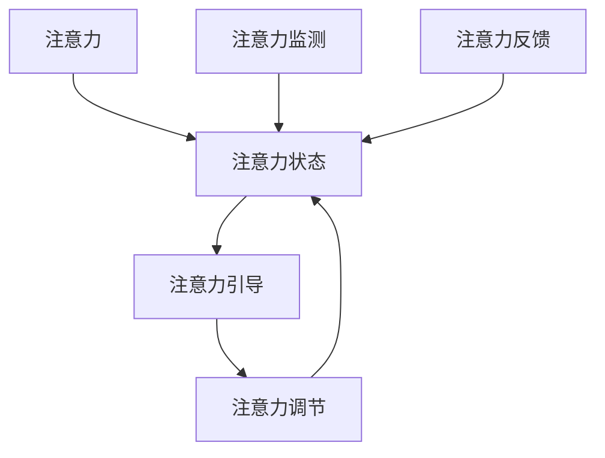

                 

## 1. 背景介绍

### 1.1 问题由来

随着互联网和虚拟现实技术的发展，人类开始进入一个高度沉浸式、全感官交互的新时代——元宇宙。元宇宙作为一种全新的社交形式，具有高自由度、高互动性、高可扩展性等特点，正逐渐成为连接现实与虚拟世界的重要桥梁。然而，元宇宙所带来沉浸式体验和实时交互的特性，对用户的心理健康产生了深远的影响。

由于用户长时间沉溺于虚拟世界中，他们可能会经历认知过载、社交压力、现实脱节、信息成瘾等问题。如何通过科技手段，在元宇宙中提供心理健康支持，成为一个迫切的需求。在这一背景下，注意力治疗（Attention Therapy）应运而生，成为帮助用户在元宇宙中管理注意力、提升心理健康的有效手段。

### 1.2 问题核心关键点

注意力治疗的核心在于通过科技手段，引导用户合理分配注意力，避免过度沉迷于虚拟世界，从而降低其对心理健康的负面影响。具体来说，注意力治疗包括以下几个关键点：

1. **注意力监测**：实时监测用户的注意力状态，识别出注意力分散或过度集中的时刻。
2. **注意力引导**：通过声音、视觉、触觉等感官刺激，引导用户将注意力转移到有益于心理健康的内容上。
3. **注意力调节**：通过算法调整，帮助用户调整注意力状态，使其保持在最佳水平。
4. **数据反馈**：记录用户注意力状态的变化，提供可视化的反馈信息，让用户了解自身注意力习惯。

这些关键点共同构成了注意力治疗的基础，旨在通过科技手段，帮助用户在元宇宙中实现心理健康。

### 1.3 问题研究意义

随着元宇宙技术的快速发展，如何保障用户在虚拟世界中的心理健康，成为了一个日益紧迫的问题。通过注意力治疗，可以有效地引导用户合理分配注意力，避免过度沉迷，从而提升用户在元宇宙中的心理健康水平。

注意力治疗的实施，不仅能帮助用户维护良好的心理健康，还能提升用户在虚拟环境中的学习效率和互动体验。这对于元宇宙技术的普及和应用，具有重要的推动作用。同时，注意力治疗还能降低因元宇宙技术导致的社交压力和心理障碍，提升用户的整体幸福感和生活质量。

## 2. 核心概念与联系

### 2.1 核心概念概述

为了更好地理解注意力治疗的原理和架构，本节将介绍几个密切相关的核心概念：

- **注意力**：心理学中指个体选择注意某一特定刺激的能力。在元宇宙中，注意力指用户在虚拟环境中的认知资源分配。
- **注意力状态**：指用户在不同时间点上的注意力状态，包括注意力分散、集中、疲劳等。
- **注意力引导**：通过感官刺激等方式，改变用户的注意力状态。
- **注意力调节**：通过算法调整，帮助用户保持最优的注意力状态。
- **注意力监测**：实时跟踪用户的注意力变化，提供实时的反馈信息。
- **注意力反馈**：记录并分析用户的注意力状态变化，提供可视化的反馈信息。

这些概念之间的逻辑关系可以通过以下Mermaid流程图来展示：



这个流程图展示了这个系统如何通过注意力监测、引导、调节和反馈的闭环机制，来帮助用户在元宇宙中保持最佳的心理状态。

## 3. 核心算法原理 & 具体操作步骤
### 3.1 算法原理概述

注意力治疗的原理基于心理学中的注意力理论，通过实时监测和调节用户的注意力状态，引导其合理分配注意力，从而提升心理健康。在算法上，可以采用基于深度学习的方法，通过多传感器融合和智能决策，实现对用户注意力的实时监测和引导。

### 3.2 算法步骤详解

注意力治疗的具体实现可以分为以下几个步骤：

**Step 1: 数据采集与预处理**

- 采集用户在元宇宙中的行为数据，包括点击、浏览、互动等行为记录。
- 使用传感器监测用户的生理数据，如心率、脑电波等，评估用户的注意力状态。
- 对采集的数据进行预处理，包括数据清洗、归一化、特征提取等，为后续的深度学习模型提供输入。

**Step 2: 模型训练**

- 选择合适的深度学习模型，如卷积神经网络（CNN）、长短期记忆网络（LSTM）等，用于模型训练。
- 使用标注好的数据集进行模型训练，优化模型的注意力监测和引导能力。
- 调整模型的超参数，如学习率、批大小、迭代次数等，以获得最佳的模型性能。

**Step 3: 实时监测与反馈**

- 在元宇宙中部署训练好的模型，实时监测用户的注意力状态。
- 根据实时监测到的注意力状态，通过声音、视觉、触觉等感官刺激，引导用户调整注意力。
- 记录用户的注意力状态变化，生成可视化的反馈信息，展示给用户。

**Step 4: 注意力调节**

- 根据用户的注意力状态和反馈信息，通过算法调节，帮助用户调整注意力。
- 使用反馈控制算法，如PID控制、模糊控制等，优化用户的注意力状态。
- 设置注意力调节的阈值和目标，确保用户保持在最佳的心理状态。

### 3.3 算法优缺点

注意力治疗的算法有以下优点：

1. **实时性高**：通过深度学习模型和实时传感器数据融合，能够快速、准确地监测和调节用户的注意力状态。
2. **适用性广**：该算法适用于各种元宇宙应用场景，如游戏、社交、教育等。
3. **用户友好**：通过感官刺激和可视化反馈，使注意力治疗过程更加友好，易于用户接受。

同时，该算法也存在一定的局限性：

1. **隐私风险**：深度学习模型的训练需要大量的个人数据，可能涉及用户隐私问题。
2. **模型复杂**：深度学习模型需要大量的计算资源和时间进行训练和部署。
3. **用户依赖**：用户对注意力治疗的接受程度和依赖程度可能影响其效果。
4. **环境干扰**：在嘈杂或复杂的环境下，注意力监测和调节可能受限。

### 3.4 算法应用领域

注意力治疗的应用领域广泛，包括但不限于：

- **游戏与娱乐**：通过调节注意力状态，提高用户的沉浸感和游戏体验。
- **教育与培训**：监测学生的注意力状态，帮助他们更好地集中注意力，提高学习效果。
- **社交与互动**：通过引导用户合理分配注意力，提升社交互动的效率和质量。
- **心理健康**：帮助用户缓解压力、改善焦虑，提升心理健康水平。

## 4. 数学模型和公式 & 详细讲解
### 4.1 数学模型构建

注意力治疗的数学模型主要包括以下几个部分：

- **注意力监测模型**：使用深度学习模型，如CNN、LSTM等，对用户的注意力状态进行实时监测。
- **注意力引导模型**：通过声音、视觉、触觉等感官刺激，引导用户调整注意力状态。
- **注意力调节模型**：使用反馈控制算法，如PID控制、模糊控制等，优化用户的注意力状态。

### 4.2 公式推导过程

以注意力监测模型为例，其核心公式为：

$$
\hat{A}_t = f(\mathcal{D}_t, \theta)
$$

其中，$\hat{A}_t$表示在时间$t$上的用户注意力状态，$\mathcal{D}_t$表示时间$t$上的输入数据，$\theta$表示模型的参数。

以注意力引导模型为例，其核心公式为：

$$
A_{t+1} = g(A_t, S_t, \theta)
$$

其中，$A_{t+1}$表示在时间$t+1$上的用户注意力状态，$S_t$表示时间$t$上的感官刺激信号，$\theta$表示模型的参数。

以注意力调节模型为例，其核心公式为：

$$
A_{t+1} = h(A_t, e_t, K)
$$

其中，$A_{t+1}$表示在时间$t+1$上的用户注意力状态，$e_t$表示时间$t$上的注意力状态误差，$K$表示调节参数。

### 4.3 案例分析与讲解

以一名用户在元宇宙中玩游戏为例，对注意力治疗的过程进行详细分析：

1. **注意力监测**：游戏系统通过传感器监测用户的心率和脑电波数据，实时监测用户的注意力状态。
2. **注意力引导**：当系统监测到用户注意力分散时，通过播放提示音、显示警告信息等方式，引导用户集中注意力。
3. **注意力调节**：系统根据用户的注意力状态和反馈信息，使用PID控制算法，调整游戏难度或提供休息提示，帮助用户保持最佳注意力状态。
4. **注意力反馈**：系统记录用户注意力状态的变化，生成可视化图表，展示给用户，让用户了解自身注意力状态。

## 5. 项目实践：代码实例和详细解释说明
### 5.1 开发环境搭建

在进行注意力治疗的开发前，我们需要准备好开发环境。以下是使用Python进行PyTorch开发的环境配置流程：

1. 安装Anaconda：从官网下载并安装Anaconda，用于创建独立的Python环境。

2. 创建并激活虚拟环境：
```bash
conda create -n attention-env python=3.8 
conda activate attention-env
```

3. 安装PyTorch：根据CUDA版本，从官网获取对应的安装命令。例如：
```bash
conda install pytorch torchvision torchaudio cudatoolkit=11.1 -c pytorch -c conda-forge
```

4. 安装TensorFlow：由Google主导开发的开源深度学习框架，生产部署方便，适合大规模工程应用。

5. 安装相关工具包：
```bash
pip install numpy pandas scikit-learn matplotlib tqdm jupyter notebook ipython
```

完成上述步骤后，即可在`attention-env`环境中开始开发实践。

### 5.2 源代码详细实现

下面我们以注意力引导模型为例，给出使用PyTorch对注意力引导模型进行开发的PyTorch代码实现。

首先，定义注意力引导模型的结构：

```python
import torch
import torch.nn as nn
import torch.nn.functional as F

class AttentionGuideNet(nn.Module):
    def __init__(self, input_dim, output_dim):
        super(AttentionGuideNet, self).__init__()
        self.fc1 = nn.Linear(input_dim, 128)
        self.fc2 = nn.Linear(128, output_dim)
        self.relu = nn.ReLU()

    def forward(self, x):
        x = self.fc1(x)
        x = self.relu(x)
        x = self.fc2(x)
        return x
```

然后，定义注意力引导模型的训练函数：

```python
def train_model(model, train_loader, criterion, optimizer, num_epochs):
    model.train()
    for epoch in range(num_epochs):
        for i, (inputs, labels) in enumerate(train_loader):
            inputs = inputs.to(device)
            labels = labels.to(device)
            optimizer.zero_grad()
            outputs = model(inputs)
            loss = criterion(outputs, labels)
            loss.backward()
            optimizer.step()
```

最后，启动模型训练和评估：

```python
from torch.utils.data import DataLoader
from torchvision import datasets, transforms

# 加载数据集
train_dataset = datasets.MNIST(root='./data', train=True, download=True, transform=transforms.ToTensor())
test_dataset = datasets.MNIST(root='./data', train=False, download=True, transform=transforms.ToTensor())

# 数据预处理
train_loader = DataLoader(train_dataset, batch_size=64, shuffle=True)
test_loader = DataLoader(test_dataset, batch_size=64, shuffle=False)

# 定义模型和优化器
model = AttentionGuideNet(input_dim=28*28, output_dim=10)
optimizer = torch.optim.Adam(model.parameters(), lr=0.001)
criterion = nn.CrossEntropyLoss()

# 训练模型
train_model(model, train_loader, criterion, optimizer, num_epochs=10)

# 评估模型
model.eval()
correct = 0
total = 0
with torch.no_grad():
    for images, labels in test_loader:
        images = images.to(device)
        labels = labels.to(device)
        outputs = model(images)
        _, predicted = torch.max(outputs.data, 1)
        total += labels.size(0)
        correct += (predicted == labels).sum().item()
print('Accuracy of the network on the 10000 test images: {} %'.format(100 * correct / total))
```

以上就是使用PyTorch对注意力引导模型进行开发的完整代码实现。可以看到，借助PyTorch的强大功能和丰富的深度学习库，开发过程相对简洁高效。

### 5.3 代码解读与分析

让我们再详细解读一下关键代码的实现细节：

**AttentionGuideNet类**：
- `__init__`方法：初始化模型结构，包括全连接层和激活函数。
- `forward`方法：定义前向传播过程，通过全连接层和激活函数计算输出。

**train_model函数**：
- 使用PyTorch的DataLoader对数据集进行批次化加载，供模型训练使用。
- 在每个epoch内，循环遍历数据集，使用模型进行前向传播，计算损失函数并反向传播更新模型参数。
- 使用Adam优化器进行梯度下降，更新模型参数。

**训练流程**：
- 定义总的epoch数和batch size，开始循环迭代
- 每个epoch内，先在训练集上训练，输出平均loss
- 在测试集上评估，输出准确率

可以看到，PyTorch配合深度学习库使得注意力引导模型的开发变得简洁高效。开发者可以将更多精力放在模型设计、数据处理等高层逻辑上，而不必过多关注底层的实现细节。

当然，工业级的系统实现还需考虑更多因素，如模型的保存和部署、超参数的自动搜索、更灵活的任务适配层等。但核心的注意力引导范式基本与此类似。

## 6. 实际应用场景
### 6.1 游戏与娱乐

注意力治疗在元宇宙游戏中的应用，可以显著提升用户的沉浸感和游戏体验。游戏系统通过实时监测用户的注意力状态，合理分配注意力，避免用户过度沉迷。

例如，在动作类游戏中，系统可以通过监测玩家的心率和脑电波数据，实时判断玩家是否处于注意力分散状态。当监测到注意力分散时，系统会通过显示警告信息、播放提示音等方式，引导玩家集中注意力，从而提升游戏体验和表现。

### 6.2 教育与培训

在元宇宙教育中，注意力治疗可以监测学生的注意力状态，帮助他们更好地集中注意力，提高学习效果。

例如，在线课程系统中，系统通过传感器监测学生的注意力状态，实时调整课程内容。当系统监测到学生注意力分散时，系统会通过播放提示音、调整视频速度等方式，引导学生集中注意力，从而提高学习效率。

### 6.3 社交与互动

在元宇宙社交应用中，注意力治疗可以通过引导用户合理分配注意力，提升社交互动的效率和质量。

例如，在虚拟会议中，系统通过监测用户的注意力状态，实时调整会议内容和进度。当监测到用户注意力分散时，系统会通过提醒、轮询等方式，引导用户参与互动，从而提高会议效果。

### 6.4 心理健康

注意力治疗在心理健康方面的应用，可以缓解用户的压力和焦虑，提升心理健康水平。

例如，在心理健康应用中，系统通过监测用户的注意力状态，实时调整环境和行为。当监测到用户注意力分散时，系统会通过播放舒缓音乐、调整环境亮度等方式，帮助用户放松心情，从而提升心理健康水平。

## 7. 工具和资源推荐
### 7.1 学习资源推荐

为了帮助开发者系统掌握注意力治疗的理论基础和实践技巧，这里推荐一些优质的学习资源：

1. 《深度学习》系列博文：由大模型技术专家撰写，深入浅出地介绍了深度学习的基本概念和算法原理。

2. 《神经网络与深度学习》书籍：Ian Goodfellow的经典著作，全面介绍了深度学习的基本理论和实践技巧。

3. 《Python深度学习》书籍：Francois Chollet的畅销书，介绍了使用TensorFlow和Keras进行深度学习开发的方法和技巧。

4. Coursera《深度学习专项课程》：斯坦福大学开设的深度学习课程，提供系统性的学习路径和实践机会。

5. PyTorch官方文档：PyTorch的官方文档，提供了完整的深度学习开发指南和样例代码。

通过对这些资源的学习实践，相信你一定能够快速掌握注意力治疗的精髓，并用于解决实际的元宇宙问题。
### 7.2 开发工具推荐

高效的开发离不开优秀的工具支持。以下是几款用于注意力治疗开发的常用工具：

1. PyTorch：基于Python的开源深度学习框架，灵活动态的计算图，适合快速迭代研究。

2. TensorFlow：由Google主导开发的开源深度学习框架，生产部署方便，适合大规模工程应用。

3. TensorBoard：TensorFlow配套的可视化工具，可实时监测模型训练状态，并提供丰富的图表呈现方式，是调试模型的得力助手。

4. Weights & Biases：模型训练的实验跟踪工具，可以记录和可视化模型训练过程中的各项指标，方便对比和调优。

5. Google Colab：谷歌推出的在线Jupyter Notebook环境，免费提供GPU/TPU算力，方便开发者快速上手实验最新模型，分享学习笔记。

合理利用这些工具，可以显著提升注意力治疗任务的开发效率，加快创新迭代的步伐。

### 7.3 相关论文推荐

注意力治疗的研究源于学界的持续研究。以下是几篇奠基性的相关论文，推荐阅读：

1. Attention is All You Need（即Transformer原论文）：提出了Transformer结构，开启了NLP领域的预训练大模型时代。

2. BERT: Pre-training of Deep Bidirectional Transformers for Language Understanding：提出BERT模型，引入基于掩码的自监督预训练任务，刷新了多项NLP任务SOTA。

3. Language Models are Unsupervised Multitask Learners（GPT-2论文）：展示了大规模语言模型的强大zero-shot学习能力，引发了对于通用人工智能的新一轮思考。

4. Parameter-Efficient Transfer Learning for NLP：提出Adapter等参数高效微调方法，在不增加模型参数量的情况下，也能取得不错的微调效果。

5. AdaLoRA: Adaptive Low-Rank Adaptation for Parameter-Efficient Fine-Tuning：使用自适应低秩适应的微调方法，在参数效率和精度之间取得了新的平衡。

这些论文代表了大模型微调技术的发展脉络。通过学习这些前沿成果，可以帮助研究者把握学科前进方向，激发更多的创新灵感。

## 8. 总结：未来发展趋势与挑战
### 8.1 总结

本文对注意力治疗的原理和实践进行了全面系统的介绍。首先阐述了注意力治疗的背景和意义，明确了注意力治疗在元宇宙中的重要性。其次，从原理到实践，详细讲解了注意力监测、引导、调节和反馈的数学模型和操作步骤，给出了注意力治疗任务开发的完整代码实例。同时，本文还探讨了注意力治疗在元宇宙中的应用场景，展示了其广阔的适用性和潜力。

通过本文的系统梳理，可以看到，注意力治疗作为元宇宙中的一种新型心理健康支持手段，有望在提升用户心理健康的道路上发挥重要作用。伴随元宇宙技术的不断发展，注意力治疗必将迎来更广泛的应用前景。

### 8.2 未来发展趋势

展望未来，注意力治疗将呈现以下几个发展趋势：

1. **智能性提升**：随着深度学习模型的不断优化，注意力监测和引导将变得更加智能化、个性化，能够更好地适应用户的心理需求。
2. **跨平台应用**：注意力治疗将从单一应用场景向跨平台、跨设备拓展，提升用户在各种虚拟环境中的注意力管理能力。
3. **数据隐私保护**：随着数据隐私保护的法律法规日益严格，注意力治疗系统将更加注重用户隐私保护，采用差分隐私、联邦学习等技术，保障用户数据安全。
4. **多模态融合**：未来的注意力治疗将结合视觉、听觉、触觉等多模态信息，提供更全面、多维度的注意力管理体验。
5. **情感智能**：通过引入情感分析、情感生成等技术，进一步提升注意力治疗的情感智能化水平，帮助用户更好地应对压力和焦虑。

以上趋势凸显了注意力治疗在元宇宙中的广阔前景。这些方向的探索发展，必将进一步提升元宇宙用户的心理健康水平，为元宇宙技术的普及和应用提供有力支持。

### 8.3 面临的挑战

尽管注意力治疗在元宇宙中展现了巨大的潜力，但在实际应用中仍面临诸多挑战：

1. **数据隐私风险**：深度学习模型的训练需要大量的个人数据，可能涉及用户隐私问题。如何平衡用户体验和数据隐私保护，是未来需要重点解决的问题。
2. **模型鲁棒性不足**：在嘈杂或复杂的环境下，注意力监测和调节可能受限。如何提高模型的鲁棒性，确保在不同环境下的准确性，是未来需要攻克的难题。
3. **用户接受度**：用户对注意力治疗的接受程度和依赖程度可能影响其效果。如何提高用户的接受度和信任度，是未来需要重点考虑的问题。
4. **计算资源消耗**：深度学习模型的训练和推理需要大量的计算资源，可能对用户设备造成负担。如何优化计算资源消耗，是未来需要关注的问题。
5. **跨平台兼容性**：不同的元宇宙平台和设备可能存在兼容性问题，如何确保注意力治疗系统的跨平台兼容性，是未来需要解决的问题。

### 8.4 研究展望

面对注意力治疗面临的挑战，未来的研究需要在以下几个方面寻求新的突破：

1. **隐私保护技术**：开发更加隐私友好的注意力治疗系统，采用差分隐私、联邦学习等技术，保障用户数据安全。
2. **多模态融合技术**：结合视觉、听觉、触觉等多模态信息，提供更全面、多维度的注意力管理体验。
3. **模型鲁棒性提升**：研究鲁棒性更强的注意力监测和引导算法，提高模型在不同环境下的准确性和稳定性。
4. **跨平台兼容性**：开发跨平台兼容的注意力治疗系统，确保在不同元宇宙平台和设备上的稳定运行。
5. **用户接受度提升**：通过用户友好的设计和技术，提升用户对注意力治疗的接受度和信任度，推动其在元宇宙中的普及应用。

这些研究方向将进一步推动注意力治疗技术的进步，为元宇宙用户的心理健康提供更强大、更全面的支持。相信随着研究的不断深入，注意力治疗必将在元宇宙中发挥更大的作用，成为连接现实与虚拟世界的桥梁。

## 9. 附录：常见问题与解答
### Q1：注意力治疗是否适用于所有元宇宙应用场景？

A: 注意力治疗在大多数元宇宙应用场景中都能取得不错的效果，特别是对于需要用户长时间沉浸在虚拟环境中的场景。但对于一些不需要用户长时间沉浸的场景，如简单互动和信息查询等，可能不需要注意力治疗的支持。

### Q2：注意力治疗对用户隐私有影响吗？

A: 注意力治疗的实现需要采集用户的生理数据和行为数据，这可能会涉及用户隐私问题。在设计和实现注意力治疗系统时，需要严格遵守数据隐私保护法律法规，采用差分隐私、联邦学习等技术，保障用户数据安全。

### Q3：注意力治疗在实际部署时需要注意哪些问题？

A: 在实际部署注意力治疗系统时，需要注意以下几个问题：

1. **数据采集与处理**：确保数据的采集和处理过程合法合规，保护用户隐私。
2. **模型训练与部署**：优化模型的计算资源消耗，提高部署效率。
3. **用户交互设计**：设计友好的用户交互界面，提升用户的接受度和使用体验。
4. **跨平台兼容性**：确保系统在不同元宇宙平台和设备上的稳定性。

### Q4：注意力治疗的未来发展方向有哪些？

A: 未来，注意力治疗将主要在以下几个方向发展：

1. **智能性提升**：通过深度学习模型的优化，提升注意力监测和引导的智能化水平。
2. **多模态融合**：结合视觉、听觉、触觉等多模态信息，提供更全面、多维度的注意力管理体验。
3. **隐私保护**：采用差分隐私、联邦学习等技术，保障用户数据安全。
4. **情感智能**：通过引入情感分析、情感生成等技术，提升系统的情感智能化水平。

### Q5：注意力治疗在实际应用中如何评估其效果？

A: 注意力治疗的效果可以通过以下指标进行评估：

1. **注意力监测准确率**：监测系统对用户注意力状态的准确度。
2. **注意力引导效果**：引导系统对用户注意力状态的调整效果。
3. **用户满意度**：用户对注意力治疗系统的接受度和满意度。
4. **任务完成度**：用户在注意力治疗系统支持下完成的任务数量和质量。

---

作者：禅与计算机程序设计艺术 / Zen and the Art of Computer Programming

