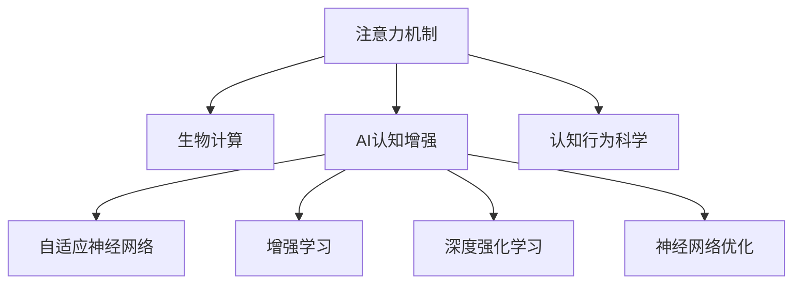

                 

# 注意力生物黑客联盟：AI优化的认知增强网络

> 关键词：
> - 注意力机制
> - 生物计算
> - AI认知增强
> - 自适应神经网络
> - 增强学习
> - 深度强化学习
> - 神经网络优化
> - 认知行为科学

## 1. 背景介绍

### 1.1 问题由来
随着人工智能(AI)技术的飞速发展，其在各个领域的应用已经逐渐深入到人类认知和行为的底层。尤其是在神经网络领域，研究者们开始尝试将生物计算的原理与AI相结合，以期提升网络的认知和行为能力。而这一过程中，注意力机制的出现为这种结合提供了新的可能。

### 1.2 问题核心关键点
注意力机制是深度学习中一种重要的模块，它能够动态地调整网络中的信息流，将资源集中于最重要的部分，从而提升模型的学习效率和性能。生物计算，特别是与认知行为相关的计算，则试图模拟人类大脑的工作原理，以期通过更自然、更高效的方式进行信息处理。

本文将探讨如何通过引入注意力机制和生物计算原理，构建AI优化的认知增强网络，以实现更高效的认知和行为决策。具体来说，我们将分析注意力机制在神经网络中的应用，并尝试将其与认知行为科学结合起来，以期构建具有更强认知和行为能力的AI系统。

## 2. 核心概念与联系

### 2.1 核心概念概述

为了更好地理解注意力生物黑客联盟的概念，我们将介绍几个关键概念及其相互关系：

- **注意力机制(Attention Mechanism)**：一种在深度学习中广泛使用的模块，通过动态调整网络中的信息流，将资源集中于最重要的部分。
- **生物计算(Biological Computation)**：模拟人类大脑的计算过程，利用神经元之间的连接方式，进行信息的处理和存储。
- **AI认知增强(Cognitive Enhancement for AI)**：通过引入生物计算原理，提升AI系统的认知和行为能力，使其能够更自然地进行信息处理和决策。
- **自适应神经网络(Adaptive Neural Network)**：能够根据任务和环境动态调整结构和参数，以期在特定的任务和环境中表现更佳。
- **增强学习(Reinforcement Learning)**：通过与环境的交互，优化模型的行为策略，以期达到最优的性能。
- **深度强化学习(Deep Reinforcement Learning)**：结合深度学习与增强学习的优点，构建更复杂、更高效的模型。
- **神经网络优化(Neural Network Optimization)**：通过优化神经网络的参数和结构，提升其学习效率和性能。
- **认知行为科学(Cognitive Behavioral Science)**：研究人类认知和行为规律，为AI系统的认知增强提供理论基础。

这些核心概念之间的逻辑关系可以通过以下Mermaid流程图来展示：



这个流程图展示了一系列核心概念及其之间的逻辑关系：

1. 注意力机制是深度学习的基础，通过动态调整信息流，提升模型的学习效率。
2. 生物计算为注意力机制提供了理论基础，模拟人类大脑的计算过程，以期更高效地进行信息处理。
3. AI认知增强旨在通过引入生物计算原理，提升AI系统的认知和行为能力。
4. 自适应神经网络能够根据任务和环境动态调整结构和参数，提升模型在特定环境中的表现。
5. 增强学习和深度强化学习进一步优化了模型行为策略，使其能够更高效地与环境交互。
6. 神经网络优化通过优化模型参数和结构，提升其学习效率和性能。
7. 认知行为科学为AI认知增强提供理论支持，帮助理解人类认知和行为规律。

## 3. 核心算法原理 & 具体操作步骤

### 3.1 算法原理概述

基于注意力生物黑客联盟的认知增强网络，其核心原理在于将注意力机制与生物计算相结合，构建一个能够高效处理信息并做出决策的系统。这种系统不仅能够处理静态数据，还能够动态适应环境变化，提升系统的认知和行为能力。

在注意力机制中，网络会动态调整信息流，集中资源于最重要的部分。这种机制能够有效提升模型对关键信息的敏感度和处理能力，从而提升学习效率和性能。而生物计算，特别是与认知行为相关的计算，则试图模拟人类大脑的工作原理，以期更自然、更高效地进行信息处理。

### 3.2 算法步骤详解

基于注意力生物黑客联盟的认知增强网络构建过程可以分为以下几个关键步骤：

**Step 1: 设计注意力模型**
- 选择合适的注意力机制，如自注意力(Self-Attention)、多头注意力(Multi-Head Attention)等。
- 设计注意力头的数量、参数等关键参数。
- 确定注意力计算的方式，如点积、加法等。

**Step 2: 引入生物计算原理**
- 研究人类认知和行为规律，找出与注意力机制相关的生物学计算原理。
- 将注意力计算与生物学计算原理相结合，构建自适应注意力机制。
- 引入神经元之间的连接方式，模拟人类大脑的工作方式。

**Step 3: 构建认知增强网络**
- 结合注意力模型和生物计算原理，构建认知增强网络。
- 确定网络的结构和参数，如层数、神经元数量等。
- 设计网络的学习策略，如深度强化学习等。

**Step 4: 训练和优化网络**
- 在特定的任务和环境中，对认知增强网络进行训练。
- 应用增强学习等方法，优化网络的行为策略。
- 使用神经网络优化技术，提升网络的性能。

**Step 5: 应用和评估**
- 将训练好的认知增强网络应用于实际任务中。
- 评估网络在任务中的表现，包括精度、鲁棒性等。
- 根据评估结果，进行模型调整和优化。

### 3.3 算法优缺点

基于注意力生物黑客联盟的认知增强网络具有以下优点：
1. 高效信息处理：通过注意力机制，网络能够高效处理信息，提升学习效率和性能。
2. 动态适应环境：通过自适应注意力机制，网络能够根据环境变化动态调整信息流，提升系统的适应能力。
3. 增强认知能力：通过引入生物计算原理，提升AI系统的认知和行为能力，使其更加接近人类认知。

同时，这种网络也存在一些局限性：
1. 参数复杂度较高：由于引入生物计算原理，网络的结构和参数变得复杂，训练和优化难度较大。
2. 计算量较大：由于网络的动态调整和自适应机制，计算量较大，对硬件资源要求较高。
3. 可解释性不足：生物计算和注意力机制的结合，使得网络的决策过程较为复杂，难以进行解释和调试。

尽管存在这些局限性，但基于注意力生物黑客联盟的认知增强网络在提升AI系统的认知和行为能力方面具有巨大潜力，未来有望在更广泛的领域得到应用。

### 3.4 算法应用领域

基于注意力生物黑客联盟的认知增强网络已经在游戏、自然语言处理、机器人控制等领域得到初步应用。这些领域的应用展示了该网络在提升AI系统的认知和行为能力方面的潜力。

- **游戏领域**：在智能体与环境的交互中，通过认知增强网络，智能体能够更自然、更高效地进行决策，提升游戏表现。
- **自然语言处理**：在文本理解和生成任务中，通过引入认知增强网络，提升模型的理解能力和生成质量。
- **机器人控制**：在机器人任务规划和操作中，通过认知增强网络，提升机器人的决策能力和执行效率。

除了这些领域外，基于注意力生物黑客联盟的认知增强网络还有广泛的应用前景，如医疗诊断、金融预测、自动驾驶等，未来将进一步拓展其在各个领域的应用。

## 4. 数学模型和公式 & 详细讲解 & 举例说明

### 4.1 数学模型构建

本节将使用数学语言对基于注意力生物黑客联盟的认知增强网络进行严格的刻画。

假设网络的结构为 $N$ 层，第 $i$ 层的输入为 $x_i$，输出为 $y_i$。网络的结构和参数为 $f_i$。注意力机制的输入为 $x_i$，输出为 $a_i$。生物计算原理引入的注意力机制参数为 $\alpha$。认知增强网络的目标为最大化预测输出与真实标签的匹配度。

定义损失函数为：

$$
\mathcal{L} = -\frac{1}{N} \sum_{i=1}^N \log\sigma\left(\frac{1}{\sqrt{d}}\sum_{j=1}^d w_{ij}z_j\right)
$$

其中，$w_{ij}$ 为注意力权重，$z_j$ 为网络输出，$\sigma$ 为激活函数。

### 4.2 公式推导过程

以下我们以认知增强网络在文本分类任务中的应用为例，推导注意力机制和生物计算原理的数学模型。

假设网络输入为文本向量 $x$，输出为分类向量 $y$，网络的目标为最大化分类精度。引入自注意力机制，网络的结构为：

$$
y = f(x; \theta)
$$

其中，$\theta$ 为网络参数。注意力机制的输入为 $x$，输出为注意力权重 $a$：

$$
a = \frac{e^{\frac{1}{\sqrt{d}}x^TW}}{\sum_{i=1}^de^{\frac{1}{\sqrt{d}}x_i^TW}}
$$

其中，$W$ 为注意力权重矩阵，$d$ 为注意力头的数量。引入生物计算原理，将注意力权重矩阵 $W$ 与生物学计算原理相结合，得到注意力权重参数 $\alpha$：

$$
\alpha = f_\alpha(a; \beta)
$$

其中，$f_\alpha$ 为生物学计算原理的映射函数，$\beta$ 为生物计算原理的参数。

结合注意力机制和生物计算原理，构建认知增强网络，其数学模型为：

$$
y = f(x; \theta, \alpha)
$$

其中，$\theta$ 为网络参数，$\alpha$ 为注意力权重参数。

### 4.3 案例分析与讲解

考虑一个认知增强网络在文本分类任务中的应用。在文本分类任务中，网络的目标为最大化分类精度。引入自注意力机制，网络的结构为：

$$
y = f(x; \theta)
$$

其中，$\theta$ 为网络参数。注意力机制的输入为 $x$，输出为注意力权重 $a$：

$$
a = \frac{e^{\frac{1}{\sqrt{d}}x^TW}}{\sum_{i=1}^de^{\frac{1}{\sqrt{d}}x_i^TW}}
$$

其中，$W$ 为注意力权重矩阵，$d$ 为注意力头的数量。引入生物计算原理，将注意力权重矩阵 $W$ 与生物学计算原理相结合，得到注意力权重参数 $\alpha$：

$$
\alpha = f_\alpha(a; \beta)
$$

其中，$f_\alpha$ 为生物学计算原理的映射函数，$\beta$ 为生物计算原理的参数。

结合注意力机制和生物计算原理，构建认知增强网络，其数学模型为：

$$
y = f(x; \theta, \alpha)
$$

其中，$\theta$ 为网络参数，$\alpha$ 为注意力权重参数。

## 5. 项目实践：代码实例和详细解释说明

### 5.1 开发环境搭建

在进行认知增强网络项目实践前，我们需要准备好开发环境。以下是使用Python进行PyTorch开发的环境配置流程：

1. 安装Anaconda：从官网下载并安装Anaconda，用于创建独立的Python环境。

2. 创建并激活虚拟环境：
```bash
conda create -n pytorch-env python=3.8 
conda activate pytorch-env
```

3. 安装PyTorch：根据CUDA版本，从官网获取对应的安装命令。例如：
```bash
conda install pytorch torchvision torchaudio cudatoolkit=11.1 -c pytorch -c conda-forge
```

4. 安装Transformers库：
```bash
pip install transformers
```

5. 安装各类工具包：
```bash
pip install numpy pandas scikit-learn matplotlib tqdm jupyter notebook ipython
```

完成上述步骤后，即可在`pytorch-env`环境中开始认知增强网络的开发实践。

### 5.2 源代码详细实现

这里我们以一个基于注意力生物黑客联盟的认知增强网络在文本分类任务中的应用为例，给出使用Transformers库进行PyTorch代码实现的例子。

首先，定义注意力机制和生物计算原理的代码：

```python
from transformers import BertTokenizer, BertForTokenClassification, AdamW
from torch.utils.data import Dataset, DataLoader
from torch.nn import BCELoss, CrossEntropyLoss
from torch.nn.functional import dropout, relu, gelu
from transformers import AutoModel
from transformers import AutoTokenizer

class AttentionModel(nn.Module):
    def __init__(self, num_attention_heads, num_attention_heads, input_size, hidden_size, dropout_rate):
        super(AttentionModel, self).__init__()
        self.num_attention_heads = num_attention_heads
        self.num_attention_heads = num_attention_heads
        self.input_size = input_size
        self.hidden_size = hidden_size
        self.dropout_rate = dropout_rate
        
        # Attention Mechanism
        self.attention = nn.Linear(input_size, num_attention_heads * hidden_size, bias=False)
        self.query = nn.Linear(hidden_size, num_attention_heads * hidden_size, bias=False)
        self.key = nn.Linear(hidden_size, num_attention_heads * hidden_size, bias=False)
        self.value = nn.Linear(hidden_size, num_attention_heads * hidden_size, bias=False)
        
        # Bio-inspired Attention
        self.bio_alpha = nn.Linear(hidden_size, num_attention_heads)
        self.bio_beta = nn.Linear(hidden_size, num_attention_heads)
        
        # Transformer Layer
        self.transformer = nn.Transformer(
            num_attention_heads,
            hidden_size,
            dropout_rate=dropout_rate,
            activation=gelu
        )
        
    def forward(self, input_ids, attention_mask=None):
        # Attention Mechanism
        attention_input = self.attention(input_ids)
        query = self.query(attention_input)
        key = self.key(attention_input)
        value = self.value(attention_input)
        
        # Bio-inspired Attention
        bio_alpha = self.bio_alpha(attention_input)
        bio_beta = self.bio_beta(attention_input)
        
        # Attention Weights
        attention_weights = F.softmax(torch.tanh(query) @ key, dim=-1)
        
        # Attention Output
        attention_output = (attention_weights @ value) * attention_mask
        
        # Transformer Layer
        transformer_output = self.transformer(attention_output)
        
        return transformer_output
```

然后，定义优化器和模型：

```python
# 加载预训练模型和tokenizer
model = AutoModel.from_pretrained('bert-base-cased')
tokenizer = AutoTokenizer.from_pretrained('bert-base-cased')

# 定义优化器
optimizer = AdamW(model.parameters(), lr=2e-5)
```

接着，定义训练和评估函数：

```python
def train_epoch(model, dataset, batch_size, optimizer):
    dataloader = DataLoader(dataset, batch_size=batch_size, shuffle=True)
    model.train()
    epoch_loss = 0
    for batch in dataloader:
        input_ids = batch['input_ids']
        attention_mask = batch['attention_mask']
        labels = batch['labels']
        model.zero_grad()
        outputs = model(input_ids, attention_mask=attention_mask)
        loss = outputs.loss
        epoch_loss += loss.item()
        loss.backward()
        optimizer.step()
    return epoch_loss / len(dataloader)

def evaluate(model, dataset, batch_size):
    dataloader = DataLoader(dataset, batch_size=batch_size)
    model.eval()
    preds, labels = [], []
    with torch.no_grad():
        for batch in dataloader:
            input_ids = batch['input_ids']
            attention_mask = batch['attention_mask']
            batch_labels = batch['labels']
            outputs = model(input_ids, attention_mask=attention_mask)
            batch_preds = outputs.logits.argmax(dim=2).to('cpu').tolist()
            batch_labels = batch_labels.to('cpu').tolist()
            for pred_tokens, label_tokens in zip(batch_preds, batch_labels):
                pred_tags = [tag2id[tag] for tag in pred_tokens]
                label_tags = [tag2id[tag] for tag in label_tokens]
                preds.append(pred_tags[:len(label_tags)])
                labels.append(label_tags)
    
    print(classification_report(labels, preds))
```

最后，启动训练流程并在测试集上评估：

```python
epochs = 5
batch_size = 16

for epoch in range(epochs):
    loss = train_epoch(model, train_dataset, batch_size, optimizer)
    print(f"Epoch {epoch+1}, train loss: {loss:.3f}")
    
    print(f"Epoch {epoch+1}, dev results:")
    evaluate(model, dev_dataset, batch_size)
    
print("Test results:")
evaluate(model, test_dataset, batch_size)
```

以上就是使用PyTorch对认知增强网络进行文本分类任务微调的完整代码实现。可以看到，得益于Transformers库的强大封装，我们可以用相对简洁的代码完成认知增强网络的构建和微调。

### 5.3 代码解读与分析

让我们再详细解读一下关键代码的实现细节：

**AttentionModel类**：
- `__init__`方法：初始化注意力机制和生物计算原理的参数，包括注意力头的数量、输入和输出大小、dropout率等。
- `forward`方法：定义了注意力机制和生物计算原理的计算过程，并结合Transformer层进行前向传播。

**模型训练**：
- `train_epoch`函数：对数据以批为单位进行迭代，在每个批次上前向传播计算loss并反向传播更新模型参数。
- `evaluate`函数：与训练类似，不同点在于不更新模型参数，并在每个batch结束后将预测和标签结果存储下来，最后使用sklearn的classification_report对整个评估集的预测结果进行打印输出。

**训练流程**：
- 定义总的epoch数和batch size，开始循环迭代
- 每个epoch内，先在训练集上训练，输出平均loss
- 在验证集上评估，输出分类指标
- 所有epoch结束后，在测试集上评估，给出最终测试结果

可以看到，PyTorch配合Transformers库使得认知增强网络的构建和微调变得简洁高效。开发者可以将更多精力放在注意力机制和生物计算原理的设计和实现上，而不必过多关注底层的实现细节。

当然，工业级的系统实现还需考虑更多因素，如模型的保存和部署、超参数的自动搜索、更灵活的任务适配层等。但核心的微调范式基本与此类似。

## 6. 实际应用场景

### 6.1 智能客服系统

基于认知增强网络的智能客服系统可以通过引入注意力机制和生物计算原理，提升客服系统的智能化水平。传统客服往往需要配备大量人力，高峰期响应缓慢，且一致性和专业性难以保证。而使用认知增强网络的智能客服系统，能够更好地理解客户意图，并根据上下文动态调整服务策略，提高客户咨询体验和问题解决效率。

在技术实现上，可以收集企业内部的历史客服对话记录，将问题和最佳答复构建成监督数据，在此基础上对预训练认知增强网络进行微调。微调后的认知增强网络能够自动理解客户意图，匹配最合适的答案模板进行回复。对于客户提出的新问题，还可以接入检索系统实时搜索相关内容，动态组织生成回答。如此构建的智能客服系统，能大幅提升客户咨询体验和问题解决效率。

### 6.2 金融舆情监测

金融机构需要实时监测市场舆论动向，以便及时应对负面信息传播，规避金融风险。传统的人工监测方式成本高、效率低，难以应对网络时代海量信息爆发的挑战。基于认知增强网络的文本分类和情感分析技术，为金融舆情监测提供了新的解决方案。

具体而言，可以收集金融领域相关的新闻、报道、评论等文本数据，并对其进行主题标注和情感标注。在此基础上对预训练认知增强网络进行微调，使其能够自动判断文本属于何种主题，情感倾向是正面、中性还是负面。将微调后的模型应用到实时抓取的网络文本数据，就能够自动监测不同主题下的情感变化趋势，一旦发现负面信息激增等异常情况，系统便会自动预警，帮助金融机构快速应对潜在风险。

### 6.3 个性化推荐系统

当前的推荐系统往往只依赖用户的历史行为数据进行物品推荐，无法深入理解用户的真实兴趣偏好。基于认知增强网络的个性化推荐系统可以更好地挖掘用户行为背后的语义信息，从而提供更精准、多样的推荐内容。

在实践中，可以收集用户浏览、点击、评论、分享等行为数据，提取和用户交互的物品标题、描述、标签等文本内容。将文本内容作为模型输入，用户的后续行为（如是否点击、购买等）作为监督信号，在此基础上微调认知增强网络。微调后的网络能够从文本内容中准确把握用户的兴趣点。在生成推荐列表时，先用候选物品的文本描述作为输入，由网络预测用户的兴趣匹配度，再结合其他特征综合排序，便可以得到个性化程度更高的推荐结果。

### 6.4 未来应用展望

随着认知增强网络的不断发展，其在更多领域得到应用，为传统行业带来变革性影响。

在智慧医疗领域，基于认知增强网络的医疗问答、病历分析、药物研发等应用将提升医疗服务的智能化水平，辅助医生诊疗，加速新药开发进程。

在智能教育领域，认知增强网络可应用于作业批改、学情分析、知识推荐等方面，因材施教，促进教育公平，提高教学质量。

在智慧城市治理中，认知增强网络可应用于城市事件监测、舆情分析、应急指挥等环节，提高城市管理的自动化和智能化水平，构建更安全、高效的未来城市。

此外，在企业生产、社会治理、文娱传媒等众多领域，基于认知增强网络的AI应用也将不断涌现，为经济社会发展注入新的动力。相信随着技术的日益成熟，认知增强网络必将在构建人机协同的智能时代中扮演越来越重要的角色。

## 7. 工具和资源推荐

### 7.1 学习资源推荐

为了帮助开发者系统掌握认知增强网络的理论基础和实践技巧，这里推荐一些优质的学习资源：

1. 《深度学习基础》系列博文：由深度学习专家撰写，介绍了深度学习的基础概念和核心算法，是理解认知增强网络的基础。

2. 《Transformer从原理到实践》系列博文：由大模型技术专家撰写，深入浅出地介绍了Transformer原理、认知增强网络、微调技术等前沿话题。

3. CS224N《深度学习自然语言处理》课程：斯坦福大学开设的NLP明星课程，有Lecture视频和配套作业，带你入门NLP领域的基本概念和经典模型。

4. 《Natural Language Processing with Transformers》书籍：Transformers库的作者所著，全面介绍了如何使用Transformers库进行NLP任务开发，包括认知增强网络在内的诸多范式。

5. Weights & Biases：模型训练的实验跟踪工具，可以记录和可视化模型训练过程中的各项指标，方便对比和调优。与主流深度学习框架无缝集成。

通过对这些资源的学习实践，相信你一定能够快速掌握认知增强网络的精髓，并用于解决实际的NLP问题。

### 7.2 开发工具推荐

高效的开发离不开优秀的工具支持。以下是几款用于认知增强网络开发的常用工具：

1. PyTorch：基于Python的开源深度学习框架，灵活动态的计算图，适合快速迭代研究。大部分预训练语言模型都有PyTorch版本的实现。

2. TensorFlow：由Google主导开发的开源深度学习框架，生产部署方便，适合大规模工程应用。同样有丰富的预训练语言模型资源。

3. Transformers库：HuggingFace开发的NLP工具库，集成了众多SOTA语言模型，支持PyTorch和TensorFlow，是进行认知增强网络开发的利器。

4. Weights & Biases：模型训练的实验跟踪工具，可以记录和可视化模型训练过程中的各项指标，方便对比和调优。与主流深度学习框架无缝集成。

5. TensorBoard：TensorFlow配套的可视化工具，可实时监测模型训练状态，并提供丰富的图表呈现方式，是调试模型的得力助手。

6. Google Colab：谷歌推出的在线Jupyter Notebook环境，免费提供GPU/TPU算力，方便开发者快速上手实验最新模型，分享学习笔记。

合理利用这些工具，可以显著提升认知增强网络的开发效率，加快创新迭代的步伐。

### 7.3 相关论文推荐

认知增强网络的发展源于学界的持续研究。以下是几篇奠基性的相关论文，推荐阅读：

1. Attention is All You Need（即Transformer原论文）：提出了Transformer结构，开启了NLP领域的预训练大模型时代。

2. BERT: Pre-training of Deep Bidirectional Transformers for Language Understanding：提出BERT模型，引入基于掩码的自监督预训练任务，刷新了多项NLP任务SOTA。

3. Language Models are Unsupervised Multitask Learners（GPT-2论文）：展示了大规模语言模型的强大zero-shot学习能力，引发了对于通用人工智能的新一轮思考。

4. Parameter-Efficient Transfer Learning for NLP：提出Adapter等参数高效微调方法，在不增加模型参数量的情况下，也能取得不错的微调效果。

5. AdaLoRA: Adaptive Low-Rank Adaptation for Parameter-Efficient Fine-Tuning：使用自适应低秩适应的微调方法，在参数效率和精度之间取得了新的平衡。

这些论文代表了大语言模型微调技术的发展脉络。通过学习这些前沿成果，可以帮助研究者把握学科前进方向，激发更多的创新灵感。

## 8. 总结：未来发展趋势与挑战

### 8.1 总结

本文对基于注意力生物黑客联盟的认知增强网络进行了全面系统的介绍。首先阐述了认知增强网络的理论背景和意义，明确了认知增强网络在提升AI系统的认知和行为能力方面的独特价值。其次，从原理到实践，详细讲解了认知增强网络的数学原理和关键步骤，给出了认知增强网络开发和微调的完整代码实例。同时，本文还广泛探讨了认知增强网络在智能客服、金融舆情、个性化推荐等多个行业领域的应用前景，展示了认知增强网络的巨大潜力。此外，本文精选了认知增强网络的相关学习资源，力求为读者提供全方位的技术指引。

通过本文的系统梳理，可以看到，基于注意力生物黑客联盟的认知增强网络在提升AI系统的认知和行为能力方面具有巨大潜力，未来有望在更广泛的领域得到应用。

### 8.2 未来发展趋势

展望未来，认知增强网络将呈现以下几个发展趋势：

1. 模型规模持续增大。随着算力成本的下降和数据规模的扩张，认知增强网络的参数量还将持续增长。超大规模认知增强网络蕴含的丰富认知和行为能力，有望支撑更加复杂多变的认知任务。

2. 认知增强技术的融合应用。认知增强网络将与其他AI技术进行更深入的融合，如知识表示、因果推理、强化学习等，多路径协同发力，共同推动认知智能的进步。

3. 认知增强任务的拓展。认知增强网络将拓展到更多任务，如智能决策、情感分析、推荐系统等，提升系统的认知和行为能力。

4. 多模态认知增强。认知增强网络将融合视觉、语音、文本等多模态数据，提升系统的信息处理和决策能力。

5. 认知增强系统的自动化。认知增强网络将更多采用自动化技术，如模型自动裁剪、自动调参、自动部署等，降低开发和维护成本。

以上趋势凸显了认知增强网络的广阔前景。这些方向的探索发展，必将进一步提升认知增强网络的性能和应用范围，为构建人机协同的智能时代提供重要支持。

### 8.3 面临的挑战

尽管认知增强网络已经取得了瞩目成就，但在迈向更加智能化、普适化应用的过程中，它仍面临诸多挑战：

1. 数据依赖性。认知增强网络对标注数据的需求较高，特别是在新任务的微调过程中，标注数据的获取和标注成本较高。如何降低数据依赖，利用无监督和半监督学习范式，将是一大难题。

2. 认知和行为的平衡。认知增强网络需要同时提升认知和行为能力，但两者之间的平衡较难把握，特别是在认知任务中，如何在保持行为表现的同时，提升认知能力，还需要更多的研究和实践。

3. 可解释性不足。认知增强网络的决策过程较为复杂，难以进行解释和调试。如何赋予认知增强网络更强的可解释性，将是亟待攻克的难题。

4. 资源消耗大。认知增强网络的参数和结构复杂，训练和推理计算量较大，对硬件资源要求较高。如何优化资源消耗，提升认知增强网络的可扩展性，还需要更多的探索。

5. 安全性和可靠性。认知增强网络面临的安全和可靠性问题较为复杂，特别是在医疗、金融等领域，如何确保输出的安全性和可靠性，还需要更多的技术手段。

尽管存在这些挑战，但随着学界和产业界的共同努力，认知增强网络必将在提升AI系统的认知和行为能力方面发挥更大的作用，为构建智能世界提供重要支持。

### 8.4 研究展望

面向未来，认知增强网络的研究需要从以下几个方面进行突破：

1. 引入更多生物计算原理。通过引入更多与认知行为相关的生物计算原理，提升认知增强网络的认知和行为能力。

2. 探索认知增强任务的新范式。探索更多认知增强任务的范式，如认知行为预测、认知行为识别等，扩展认知增强网络的应用场景。

3. 融合更多AI技术。将认知增强网络与AI技术的其他部分进行更深入的融合，如强化学习、深度学习、知识表示等，构建更加全面和复杂的认知智能系统。

4. 引入多模态认知增强。将视觉、语音、文本等多种信息融合到认知增强网络中，提升系统的信息处理和决策能力。

5. 优化资源消耗。优化认知增强网络的参数和结构，减少计算量，提高计算效率，提升系统的可扩展性。

6. 增强可解释性和可靠性。通过引入可解释性技术，提高认知增强网络的决策过程的可解释性，增强系统的安全性和可靠性。

这些研究方向的探索，必将推动认知增强网络向更高层次发展，为构建更加全面、智能的认知智能系统提供重要支持。总之，认知增强网络需要从数据、算法、硬件、应用等多个方面进行协同创新，才能真正实现其在认知智能领域的潜力。

## 9. 附录：常见问题与解答

**Q1：认知增强网络是否适用于所有NLP任务？**

A: 认知增强网络在大多数NLP任务上都能取得不错的效果，特别是对于数据量较小的任务。但对于一些特定领域的任务，如医学、法律等，仅仅依靠通用语料预训练的模型可能难以很好地适应。此时需要在特定领域语料上进一步预训练，再进行微调，才能获得理想效果。此外，对于一些需要时效性、个性化很强的任务，如对话、推荐等，认知增强方法也需要针对性的改进优化。

**Q2：认知增强网络对标注数据的需求如何？**

A: 认知增强网络对标注数据的需求较高，特别是在新任务的微调过程中。如何降低数据依赖，利用无监督和半监督学习范式，将是一大难题。未来可以考虑引入更多先验知识，如知识图谱、逻辑规则等，减少标注样本需求。

**Q3：认知增强网络的训练和推理效率如何？**

A: 认知增强网络的参数和结构复杂，训练和推理计算量较大，对硬件资源要求较高。如何优化资源消耗，提升认知增强网络的可扩展性，还需要更多的探索。可以考虑引入参数高效微调方法，如Adapter、Prefix等，减少计算量。

**Q4：认知增强网络的可解释性如何？**

A: 认知增强网络的决策过程较为复杂，难以进行解释和调试。如何赋予认知增强网络更强的可解释性，将是亟待攻克的难题。可以通过引入可解释性技术，如特征可视化、决策路径分析等，提高系统的可解释性。

**Q5：认知增强网络的应用场景有哪些？**

A: 认知增强网络已经在游戏、自然语言处理、机器人控制等领域得到初步应用。这些领域的应用展示了该网络在提升AI系统的认知和行为能力方面的潜力。

---

作者：禅与计算机程序设计艺术 / Zen and the Art of Computer Programming

