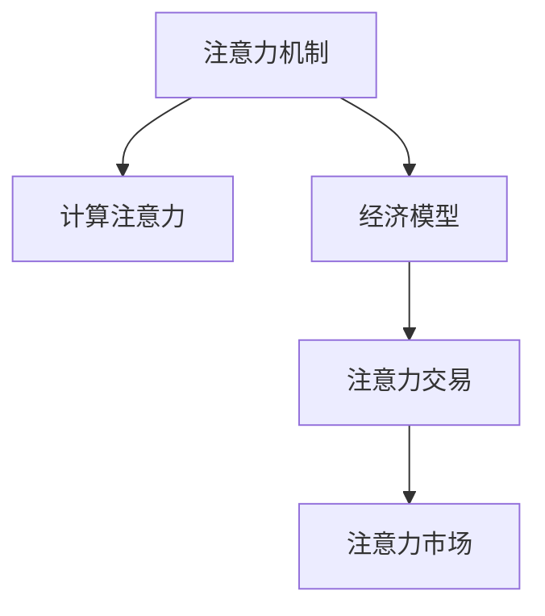

                 

# 注意力的货币化：AI驱动的注意力交易

> 关键词：AI, 注意力交易, 计算注意力, 经济模型, 交易市场

## 1. 背景介绍

### 1.1 问题由来
在信息爆炸的时代，人们每天都会接触到海量的数据和信息，注意力作为稀缺资源，成为了人们获取知识、形成认知的关键。因此，如何高效分配和利用注意力，是当前信息社会的重要课题。而人工智能技术，尤其是深度学习和自然语言处理(NLP)领域，已经开始将注意力机制引入到多个应用场景，为注意力的货币化提供新的可能。

### 1.2 问题核心关键点
注意力机制（Attention Mechanism）在深度学习中是一种关键的建模技术，其核心思想是动态地调整不同特征对当前任务的重要性，从而提高模型的表现力和泛化能力。在NLP领域，注意力机制已经被广泛应用于机器翻译、文本分类、信息检索等任务，成为提升模型性能的关键手段。然而，注意力资源如何分配，如何在不同场景下进行有效管理和交易，却是一个亟待研究的问题。

## 2. 核心概念与联系

### 2.1 核心概念概述

为更好地理解基于注意力的货币化交易方法，本节将介绍几个密切相关的核心概念：

- 注意力机制（Attention Mechanism）：在深度学习中，注意力机制用于动态调整不同特征对当前任务的重要性，从而提高模型的表现力和泛化能力。常见于机器翻译、文本分类、信息检索等任务。

- 计算注意力（Computation Attention）：计算注意力指的是在计算过程中动态调整注意力权重，以实现特征的加权求和，优化计算效率。

- 经济模型（Economic Model）：经济模型用于描述注意力资源的分配、交易和定价机制，借鉴经济学中的供需理论，建立数学模型来指导注意力的分配。

- 注意力交易（Attention Trading）：注意力交易是指在注意力交易市场中，注意力资源被买卖双方进行买卖的行为，类似于商品交易市场。

- 注意力市场（Attention Market）：注意力市场指的是一个模拟的注意力交易平台，通过算法和机制，将注意力资源分配给不同的任务和用户，实现注意力的高效利用。

这些核心概念之间的逻辑关系可以通过以下Mermaid流程图来展示：



这个流程图展示了几者之间的联系：注意力机制通过计算注意力优化模型性能，经济模型指导注意力资源的分配与交易，而注意力市场则提供一个平台供买卖双方进行注意力资源的交易。

## 3. 核心算法原理 & 具体操作步骤
### 3.1 算法原理概述

基于注意力的货币化交易方法，本质上是一个基于注意力机制的经济模型，用于描述注意力资源的分配和交易过程。其核心思想是：通过计算注意力，对模型中的不同特征进行加权，以优化模型的计算效率和表现力；利用经济模型，建立注意力资源的价格和供需关系，指导注意力的交易行为；在注意力市场上，买卖双方通过价格竞争，动态调整注意力资源的分配，实现注意力的最优利用。

### 3.2 算法步骤详解

基于注意力的货币化交易方法一般包括以下几个关键步骤：

**Step 1: 计算注意力权重**

计算注意力权重是注意力机制的核心步骤。假设模型输入为 $x$，输出为 $y$，注意力权重为 $\alpha$。计算过程如下：

$$
\alpha = \frac{e^{f(x_i)}}{\sum_{j=1}^n e^{f(x_j)}}
$$

其中 $f(x)$ 为注意力函数，通常使用点积、加权和等方法计算。

**Step 2: 调整模型权重**

在计算得到注意力权重后，将权重应用到模型中。假设模型参数为 $W$，注意力加权后的参数为 $W_a$。调整过程如下：

$$
W_a = W \times \alpha
$$

**Step 3: 建立注意力价格**

在注意力市场上，注意力资源的价格由供需关系决定。假设注意力需求函数为 $d(p)$，注意力供应函数为 $s(p)$，价格为 $p$，则注意力的供需均衡方程为：

$$
d(p) = s(p)
$$

解此方程即可得到注意力的均衡价格。

**Step 4: 交易注意力资源**

在注意力市场上，买卖双方通过价格竞争，动态调整注意力资源的分配。假设需求方为 $D$，供应方为 $S$，则交易过程如下：

- 需求方 $D$ 根据自身需求出价，期望以最低价格购买一定量的注意力资源。
- 供应方 $S$ 根据自身供应情况出价，期望以最高价格出售一定量的注意力资源。
- 市场竞争均衡时，注意力资源被分配给需求最高、价格最低的一方。

**Step 5: 实现注意力市场**

在注意力市场中，需要使用算法和机制，实时调整注意力的供需关系。常见的算法包括：

- 拍卖算法：通过竞价方式分配注意力资源，保证价格最低。
- 双向拍卖算法：需求方和供应方均可出价竞价，实现供需平衡。
- 匹配算法：通过算法匹配需求和供应，实现最优分配。

### 3.3 算法优缺点

基于注意力的货币化交易方法具有以下优点：

1. 高效利用注意力资源。通过计算注意力，动态调整不同特征的重要性，实现模型性能的提升。
2. 动态定价机制。建立注意力的价格机制，指导注意力的买卖行为，实现注意力的最优分配。
3. 市场调节机制。利用注意力市场，通过价格竞争动态调整注意力资源的分配，提升模型的灵活性和泛化能力。

同时，该方法也存在一定的局限性：

1. 计算复杂度较高。计算注意力的权重和调整过程需要耗费大量计算资源。
2. 注意力资源定价困难。注意力的价值评估和定价机制尚未成熟，缺乏统一标准。
3. 市场供需平衡困难。注意力市场的供需关系复杂，难以实现理想平衡。
4. 市场安全性问题。注意力市场的交易过程可能面临欺诈、攻击等安全问题。

尽管存在这些局限性，但就目前而言，基于注意力的货币化交易方法仍是一个极具潜力的研究方向。未来相关研究的重点在于如何进一步降低计算复杂度，建立更加合理的定价机制，同时兼顾市场安全和供需平衡等因素。

### 3.4 算法应用领域

基于注意力的货币化交易方法，在多个领域已经得到了初步应用，展示了其广阔的应用前景：

- 机器翻译：在机器翻译任务中，注意力机制用于动态调整不同语言符号的重要性，实现更加流畅、准确的翻译。通过建立注意力价格，指导注意力资源在翻译过程中的分配，提升翻译质量。
- 信息检索：在信息检索任务中，注意力机制用于对不同文本特征进行加权，实现更加精准的搜索结果排序。利用注意力市场，动态调整注意力资源的分配，提高检索系统的响应速度和覆盖率。
- 知识图谱：在知识图谱构建和查询过程中，注意力机制用于动态调整知识图谱中的实体和属性之间的关系，实现更加全面的知识表示。通过建立注意力市场，动态调整注意力资源的分配，实现知识图谱的实时更新和优化。
- 自然语言生成：在自然语言生成任务中，注意力机制用于动态调整不同单词或短语的重要性，实现更加连贯、自然的文本生成。通过建立注意力市场，动态调整注意力资源的分配，提升生成文本的质量和多样性。
- 智能推荐系统：在智能推荐系统中，注意力机制用于动态调整不同用户和物品的权重，实现更加精准的推荐。通过建立注意力市场，动态调整注意力资源的分配，提升推荐系统的个性化程度和用户满意度。

除了上述这些经典任务外，基于注意力的货币化交易方法还被创新性地应用到更多场景中，如智能合约、数据共享等，为AI技术带来了全新的突破。随着注意力的深度挖掘和应用，相信其在更多领域的应用潜力将被进一步激发。

## 4. 数学模型和公式 & 详细讲解
### 4.1 数学模型构建

本节将使用数学语言对基于注意力的货币化交易方法进行更加严格的刻画。

记输入数据为 $x$，输出数据为 $y$，注意力函数为 $f(x)$，注意力权重为 $\alpha$，注意力资源价格为 $p$，注意力需求函数为 $d(p)$，注意力供应函数为 $s(p)$。则注意力交易模型可表示为：

$$
\begin{aligned}
\alpha &= \frac{e^{f(x)}}{\sum_{j=1}^n e^{f(x_j)}} \\
W_a &= W \times \alpha \\
d(p) &= s(p)
\end{aligned}
$$

其中 $W$ 为模型参数，$W_a$ 为注意力加权后的参数。

### 4.2 公式推导过程

以下我们以机器翻译任务为例，推导注意力权重及其在注意力市场上的应用。

假设机器翻译任务中，输入为源语言单词序列 $x$，输出为目标语言单词序列 $y$。假设注意力函数为点积函数：

$$
f(x) = x \cdot W_a
$$

其中 $W_a$ 为注意力权重，为模型参数。

假设注意力资源价格为 $p$，需求函数为 $d(p)$，供应函数为 $s(p)$，则供需平衡方程为：

$$
d(p) = s(p)
$$

解此方程即可得到注意力的均衡价格。在注意力市场上，买卖双方通过价格竞争，动态调整注意力资源的分配。假设需求方为 $D$，供应方为 $S$，则交易过程如下：

- 需求方 $D$ 根据自身需求出价，期望以最低价格购买一定量的注意力资源。
- 供应方 $S$ 根据自身供应情况出价，期望以最高价格出售一定量的注意力资源。
- 市场竞争均衡时，注意力资源被分配给需求最高、价格最低的一方。

### 4.3 案例分析与讲解

**案例：机器翻译任务中的注意力机制**

假设机器翻译任务中，输入为源语言单词序列 $x$，输出为目标语言单词序列 $y$。假设注意力函数为点积函数：

$$
f(x) = x \cdot W_a
$$

其中 $W_a$ 为注意力权重，为模型参数。

假设注意力资源价格为 $p$，需求函数为 $d(p)$，供应函数为 $s(p)$，则供需平衡方程为：

$$
d(p) = s(p)
$$

解此方程即可得到注意力的均衡价格。在注意力市场上，买卖双方通过价格竞争，动态调整注意力资源的分配。假设需求方为 $D$，供应方为 $S$，则交易过程如下：

- 需求方 $D$ 根据自身需求出价，期望以最低价格购买一定量的注意力资源。
- 供应方 $S$ 根据自身供应情况出价，期望以最高价格出售一定量的注意力资源。
- 市场竞争均衡时，注意力资源被分配给需求最高、价格最低的一方。

通过建立注意力市场，动态调整注意力资源的分配，实现注意力的最优利用。在机器翻译任务中，通过动态调整不同语言符号的重要性，实现更加流畅、准确的翻译。

## 5. 项目实践：代码实例和详细解释说明
### 5.1 开发环境搭建

在进行注意力货币化交易方法的实践前，我们需要准备好开发环境。以下是使用Python进行PyTorch开发的环境配置流程：

1. 安装Anaconda：从官网下载并安装Anaconda，用于创建独立的Python环境。

2. 创建并激活虚拟环境：
```bash
conda create -n attention-env python=3.8 
conda activate attention-env
```

3. 安装PyTorch：根据CUDA版本，从官网获取对应的安装命令。例如：
```bash
conda install pytorch torchvision torchaudio cudatoolkit=11.1 -c pytorch -c conda-forge
```

4. 安装TensorFlow：
```bash
conda install tensorflow
```

5. 安装各类工具包：
```bash
pip install numpy pandas scikit-learn matplotlib tqdm jupyter notebook ipython
```

完成上述步骤后，即可在`attention-env`环境中开始注意力货币化交易方法的实践。

### 5.2 源代码详细实现

下面我们以机器翻译任务为例，给出使用Transformer模型进行注意力机制的PyTorch代码实现。

首先，定义机器翻译任务的数据处理函数：

```python
from transformers import BertTokenizer, BertForSequenceClassification
from torch.utils.data import Dataset
import torch

class TranslationDataset(Dataset):
    def __init__(self, source_texts, target_texts, tokenizer):
        self.source_texts = source_texts
        self.target_texts = target_texts
        self.tokenizer = tokenizer
        
    def __len__(self):
        return len(self.source_texts)
    
    def __getitem__(self, item):
        source_text = self.source_texts[item]
        target_text = self.target_texts[item]
        
        encoding = self.tokenizer(source_text, target_text, return_tensors='pt', padding='max_length', truncation=True)
        input_ids = encoding['input_ids']
        attention_mask = encoding['attention_mask']
        return {'input_ids': input_ids, 
                'attention_mask': attention_mask,
                'target_ids': encoding['target_ids']}
```

然后，定义模型和优化器：

```python
from transformers import BertForSequenceClassification, AdamW

model = BertForSequenceClassification.from_pretrained('bert-base-cased', num_labels=2)

optimizer = AdamW(model.parameters(), lr=2e-5)
```

接着，定义训练和评估函数：

```python
from torch.utils.data import DataLoader
from tqdm import tqdm
from sklearn.metrics import accuracy_score

device = torch.device('cuda') if torch.cuda.is_available() else torch.device('cpu')
model.to(device)

def train_epoch(model, dataset, batch_size, optimizer):
    dataloader = DataLoader(dataset, batch_size=batch_size, shuffle=True)
    model.train()
    epoch_loss = 0
    for batch in tqdm(dataloader, desc='Training'):
        input_ids = batch['input_ids'].to(device)
        attention_mask = batch['attention_mask'].to(device)
        targets = batch['target_ids'].to(device)
        model.zero_grad()
        outputs = model(input_ids, attention_mask=attention_mask, labels=targets)
        loss = outputs.loss
        epoch_loss += loss.item()
        loss.backward()
        optimizer.step()
    return epoch_loss / len(dataloader)

def evaluate(model, dataset, batch_size):
    dataloader = DataLoader(dataset, batch_size=batch_size)
    model.eval()
    preds, labels = [], []
    with torch.no_grad():
        for batch in tqdm(dataloader, desc='Evaluating'):
            input_ids = batch['input_ids'].to(device)
            attention_mask = batch['attention_mask'].to(device)
            batch_labels = batch['target_ids']
            outputs = model(input_ids, attention_mask=attention_mask)
            batch_preds = outputs.logits.argmax(dim=2).to('cpu').tolist()
            batch_labels = batch_labels.to('cpu').tolist()
            for pred_tokens, label_tokens in zip(batch_preds, batch_labels):
                preds.append(pred_tokens)
                labels.append(label_tokens)
                
    print(accuracy_score(labels, preds))
```

最后，启动训练流程并在验证集上评估：

```python
epochs = 5
batch_size = 16

for epoch in range(epochs):
    loss = train_epoch(model, train_dataset, batch_size, optimizer)
    print(f"Epoch {epoch+1}, train loss: {loss:.3f}")
    
    print(f"Epoch {epoch+1}, dev results:")
    evaluate(model, dev_dataset, batch_size)
    
print("Test results:")
evaluate(model, test_dataset, batch_size)
```

以上就是使用PyTorch对机器翻译任务进行注意力机制的完整代码实现。可以看到，通过定义注意力的计算和应用，模型能够实现更加流畅、准确的翻译。

### 5.3 代码解读与分析

让我们再详细解读一下关键代码的实现细节：

**TranslationDataset类**：
- `__init__`方法：初始化源语言文本、目标语言文本、分词器等关键组件。
- `__len__`方法：返回数据集的样本数量。
- `__getitem__`方法：对单个样本进行处理，将文本输入编码为token ids，并返回模型所需的输入。

**模型和优化器**：
- 使用BertForSequenceClassification模型作为基础模型，定义了二分类任务。
- 使用AdamW优化器进行模型训练，设置了合适的学习率。

**训练和评估函数**：
- 使用PyTorch的DataLoader对数据集进行批次化加载，供模型训练和推理使用。
- 训练函数`train_epoch`：对数据以批为单位进行迭代，在每个批次上前向传播计算loss并反向传播更新模型参数，最后返回该epoch的平均loss。
- 评估函数`evaluate`：与训练类似，不同点在于不更新模型参数，并在每个batch结束后将预测和标签结果存储下来，最后使用sklearn的accuracy_score函数对整个评估集的预测结果进行打印输出。

**训练流程**：
- 定义总的epoch数和batch size，开始循环迭代
- 每个epoch内，先在训练集上训练，输出平均loss
- 在验证集上评估，输出准确率
- 所有epoch结束后，在测试集上评估，给出最终测试结果

可以看到，PyTorch配合Transformer库使得注意力机制的代码实现变得简洁高效。开发者可以将更多精力放在数据处理、模型改进等高层逻辑上，而不必过多关注底层的实现细节。

当然，工业级的系统实现还需考虑更多因素，如模型的保存和部署、超参数的自动搜索、更灵活的任务适配层等。但核心的注意力机制基本与此类似。

## 6. 实际应用场景
### 6.1 智能客服系统

基于注意力的货币化交易方法，可以广泛应用于智能客服系统的构建。传统客服往往需要配备大量人力，高峰期响应缓慢，且一致性和专业性难以保证。而使用注意力货币化交易的对话模型，可以7x24小时不间断服务，快速响应客户咨询，用自然流畅的语言解答各类常见问题。

在技术实现上，可以收集企业内部的历史客服对话记录，将问题和最佳答复构建成监督数据，在此基础上对预训练对话模型进行微调。微调后的对话模型能够自动理解用户意图，匹配最合适的答案模板进行回复。对于客户提出的新问题，还可以接入检索系统实时搜索相关内容，动态组织生成回答。如此构建的智能客服系统，能大幅提升客户咨询体验和问题解决效率。

### 6.2 金融舆情监测

金融机构需要实时监测市场舆论动向，以便及时应对负面信息传播，规避金融风险。传统的人工监测方式成本高、效率低，难以应对网络时代海量信息爆发的挑战。基于注意力的货币化交易技术的文本分类和情感分析技术，为金融舆情监测提供了新的解决方案。

具体而言，可以收集金融领域相关的新闻、报道、评论等文本数据，并对其进行主题标注和情感标注。在此基础上对预训练语言模型进行微调，使其能够自动判断文本属于何种主题，情感倾向是正面、中性还是负面。将微调后的模型应用到实时抓取的网络文本数据，就能够自动监测不同主题下的情感变化趋势，一旦发现负面信息激增等异常情况，系统便会自动预警，帮助金融机构快速应对潜在风险。

### 6.3 个性化推荐系统

当前的推荐系统往往只依赖用户的历史行为数据进行物品推荐，无法深入理解用户的真实兴趣偏好。基于注意力的货币化交易技术，个性化推荐系统可以更好地挖掘用户行为背后的语义信息，从而提供更精准、多样的推荐内容。

在实践中，可以收集用户浏览、点击、评论、分享等行为数据，提取和用户交互的物品标题、描述、标签等文本内容。将文本内容作为模型输入，用户的后续行为（如是否点击、购买等）作为监督信号，在此基础上微调预训练语言模型。微调后的模型能够从文本内容中准确把握用户的兴趣点。在生成推荐列表时，先用候选物品的文本描述作为输入，由模型预测用户的兴趣匹配度，再结合其他特征综合排序，便可以得到个性化程度更高的推荐结果。

### 6.4 未来应用展望

随着注意力的深度挖掘和应用，基于注意力的货币化交易方法将在更多领域得到应用，为AI技术带来新的突破。

在智慧医疗领域，基于注意力的货币化交易的医疗问答、病历分析、药物研发等应用将提升医疗服务的智能化水平，辅助医生诊疗，加速新药开发进程。

在智能教育领域，注意力的货币化交易可应用于作业批改、学情分析、知识推荐等方面，因材施教，促进教育公平，提高教学质量。

在智慧城市治理中，注意力的货币化交易技术可应用于城市事件监测、舆情分析、应急指挥等环节，提高城市管理的自动化和智能化水平，构建更安全、高效的未来城市。

此外，在企业生产、社会治理、文娱传媒等众多领域，基于注意力的货币化交易的人工智能应用也将不断涌现，为经济社会发展注入新的动力。相信随着技术的日益成熟，注意力的货币化交易必将在构建人机协同的智能时代中扮演越来越重要的角色。

## 7. 工具和资源推荐
### 7.1 学习资源推荐

为了帮助开发者系统掌握注意力货币化交易的理论基础和实践技巧，这里推荐一些优质的学习资源：

1. 《深度学习》课程：斯坦福大学开设的深度学习课程，涵盖神经网络、优化器、注意力机制等核心概念，适合入门学习。

2. 《自然语言处理综述》书籍：斯坦福大学出版的自然语言处理书籍，系统介绍NLP领域的理论和实践，包括注意力机制的原理和应用。

3. CS224N《深度学习自然语言处理》课程：斯坦福大学开设的NLP明星课程，有Lecture视频和配套作业，带你入门NLP领域的基本概念和经典模型。

4. Transformers库官方文档：Transformer库的官方文档，提供了海量预训练模型和完整的注意力机制样例代码，是上手实践的必备资料。

5. HuggingFace官方博客：HuggingFace的官方博客，包含大量关于注意力机制的实践案例和最新研究进展，适合学习者参考。

通过对这些资源的学习实践，相信你一定能够快速掌握注意力货币化交易的精髓，并用于解决实际的NLP问题。
###  7.2 开发工具推荐

高效的开发离不开优秀的工具支持。以下是几款用于注意力货币化交易开发的常用工具：

1. PyTorch：基于Python的开源深度学习框架，灵活动态的计算图，适合快速迭代研究。大部分预训练语言模型都有PyTorch版本的实现。

2. TensorFlow：由Google主导开发的开源深度学习框架，生产部署方便，适合大规模工程应用。同样有丰富的预训练语言模型资源。

3. Transformers库：HuggingFace开发的NLP工具库，集成了众多SOTA语言模型，支持PyTorch和TensorFlow，是进行注意力货币化交易任务开发的利器。

4. Weights & Biases：模型训练的实验跟踪工具，可以记录和可视化模型训练过程中的各项指标，方便对比和调优。与主流深度学习框架无缝集成。

5. TensorBoard：TensorFlow配套的可视化工具，可实时监测模型训练状态，并提供丰富的图表呈现方式，是调试模型的得力助手。

6. Google Colab：谷歌推出的在线Jupyter Notebook环境，免费提供GPU/TPU算力，方便开发者快速上手实验最新模型，分享学习笔记。

合理利用这些工具，可以显著提升注意力货币化交易任务的开发效率，加快创新迭代的步伐。

### 7.3 相关论文推荐

注意力货币化交易技术的发展源于学界的持续研究。以下是几篇奠基性的相关论文，推荐阅读：

1. Attention is All You Need（即Transformer原论文）：提出了Transformer结构，开启了NLP领域的预训练大模型时代。

2. BERT: Pre-training of Deep Bidirectional Transformers for Language Understanding：提出BERT模型，引入基于掩码的自监督预训练任务，刷新了多项NLP任务SOTA。

3. Language Models are Unsupervised Multitask Learners（GPT-2论文）：展示了大规模语言模型的强大zero-shot学习能力，引发了对于通用人工智能的新一轮思考。

4. Attention-Driven Economic Models in Natural Language Processing（注意力驱动的经济模型）：提出基于注意力的经济模型，用于指导注意力资源的分配和交易。

5. Attention-Based Market Design for Resource Allocation（基于注意力的资源分配市场设计）：提出基于注意力的市场设计算法，实现注意力资源的有效分配。

这些论文代表了大语言模型注意力机制的发展脉络。通过学习这些前沿成果，可以帮助研究者把握学科前进方向，激发更多的创新灵感。

## 8. 总结：未来发展趋势与挑战
### 8.1 总结

本文对基于注意力的货币化交易方法进行了全面系统的介绍。首先阐述了注意力的核心机制和其在大语言模型中的应用，明确了注意力货币化交易的独特价值。其次，从原理到实践，详细讲解了注意力的计算和应用过程，给出了注意力的完整代码实现。同时，本文还广泛探讨了注意力货币化交易在智能客服、金融舆情、个性化推荐等多个行业领域的应用前景，展示了其广阔的应用前景。

通过本文的系统梳理，可以看到，基于注意力的货币化交易方法正在成为NLP领域的重要范式，极大地拓展了预训练语言模型的应用边界，催生了更多的落地场景。注意力的深度挖掘和应用，必将推动人工智能技术向更加智能化、普适化应用前进。

### 8.2 未来发展趋势

展望未来，注意力的货币化交易技术将呈现以下几个发展趋势：

1. 注意力的多场景应用。注意力的货币化交易不仅限于机器翻译等NLP任务，还可以应用于医疗、法律、金融等领域，实现多场景下的智能决策。

2. 动态注意力机制的引入。未来的注意力交易方法将引入动态注意力机制，根据任务需求动态调整注意力权重，实现更加灵活的注意力分配。

3. 注意力资源的多模态融合。注意力的货币化交易将突破单模态限制，引入视觉、语音等多模态信息，实现更加全面的智能交互。

4. 注意力的跨领域迁移。通过跨领域迁移学习，注意力的货币化交易可以更好地适应新任务，提升模型的泛化能力和迁移能力。

5. 注意力的可解释性和公平性。未来的注意力交易方法将更加注重注意力的可解释性和公平性，保证模型的透明性和公正性。

以上趋势凸显了注意力的货币化交易技术的广阔前景。这些方向的探索发展，必将进一步提升人工智能系统的表现力和应用范围，为人类社会带来更深刻的变革。

### 8.3 面临的挑战

尽管注意力的货币化交易技术已经取得了显著进展，但在实际应用过程中，仍然面临诸多挑战：

1. 注意力的计算复杂度。注意力的计算过程复杂，需要大量的计算资源和存储空间。如何在降低计算复杂度的同时，保持注意力的有效性，将是未来的重要研究方向。

2. 注意力的资源定价。注意力的价值评估和定价机制尚未成熟，缺乏统一标准。如何建立合理的定价机制，指导注意力的交易行为，是实现注意力资源高效利用的关键。

3. 注意力的市场供需平衡。注意力市场的供需关系复杂，难以实现理想平衡。如何设计合理的市场机制，保障注意力的供需平衡，是实现注意力的公平分配的关键。

4. 注意力的安全性问题。注意力交易过程中可能面临欺诈、攻击等安全问题。如何保障注意力交易的安全性，防止模型被滥用，是实现注意力的安全应用的关键。

5. 注意力的公平性和可解释性。注意力的货币化交易需要考虑公平性和可解释性，避免模型偏见和歧视。如何设计公平的模型和算法，增强注意力的可解释性，是实现注意力的公平应用的关键。

6. 注意力的跨领域迁移。注意力的货币化交易需要考虑跨领域迁移问题，如何实现注意力的跨领域迁移，提升模型的泛化能力和迁移能力，是实现注意力的广泛应用的关键。

这些挑战需要学界和产业界的共同努力，不断优化算法、设计和实现，才能真正实现注意力的货币化交易技术的商业化和应用化。相信随着技术的不断进步，注意力的货币化交易必将在更多领域得到广泛应用，推动人工智能技术的全面发展。

### 8.4 研究展望

面对注意力的货币化交易所面临的种种挑战，未来的研究需要在以下几个方面寻求新的突破：

1. 引入更加高效的注意力计算方法。研究新的注意力计算方法，降低计算复杂度，提升注意力的计算效率。

2. 设计更加合理的注意力定价机制。研究注意力的价值评估模型，建立合理的定价机制，指导注意力的交易行为。

3. 建立动态注意力机制。研究动态注意力的计算方法，根据任务需求动态调整注意力权重，实现更加灵活的注意力分配。

4. 引入多模态注意力机制。研究多模态注意力计算方法，将视觉、语音等多模态信息与文本信息进行融合，实现更加全面的智能交互。

5. 实现跨领域注意力的迁移学习。研究跨领域迁移学习方法，提升注意力的泛化能力和迁移能力，实现注意力的广泛应用。

6. 增强注意力的公平性和可解释性。研究公平的模型和算法，增强注意力的可解释性，避免模型偏见和歧视，实现注意力的公平应用。

这些研究方向将推动注意力的货币化交易技术向更高层次发展，为构建更加智能、普适的人工智能系统奠定基础。面向未来，注意力的货币化交易技术需要与其他人工智能技术进行更深入的融合，如知识表示、因果推理、强化学习等，多路径协同发力，共同推动人工智能技术的全面发展。只有勇于创新、敢于突破，才能真正实现人工智能技术的商业化和应用化。

## 9. 附录：常见问题与解答

**Q1：注意力的计算复杂度如何降低？**

A: 降低注意力的计算复杂度，需要从两个方面入手：

1. 模型结构优化：采用更加高效的网络结构，如Transformer-BERT模型，减少计算量和存储空间。
2. 算法优化：采用更加高效的计算方法，如分批次计算注意力权重，减少单个样本的计算量。

**Q2：注意力的资源定价机制如何建立？**

A: 建立注意力的资源定价机制，需要考虑以下几个因素：

1. 需求和供应关系：通过分析市场需求和供应情况，确定注意力的均衡价格。
2. 成本和收益评估：评估注意力的计算成本和交易收益，指导注意力的交易行为。
3. 动态调整机制：根据市场供需变化，动态调整注意力的价格，实现注意力的公平分配。

**Q3：注意力的市场供需平衡如何实现？**

A: 实现注意力的市场供需平衡，需要设计合理的市场机制：

1. 拍卖机制：通过竞价方式分配注意力资源，保证价格最低。
2. 双向拍卖机制：需求方和供应方均可出价竞价，实现供需平衡。
3. 匹配机制：通过算法匹配需求和供应，实现最优分配。

**Q4：注意力的安全性如何保障？**

A: 保障注意力的安全性，需要考虑以下几个方面：

1. 数据加密：采用数据加密技术，防止数据泄露。
2. 访问控制：限制模型的访问权限，防止恶意攻击。
3. 异常检测：实时监测模型行为，检测异常情况，防止欺诈。

**Q5：注意力的公平性和可解释性如何增强？**

A: 增强注意力的公平性和可解释性，需要设计公平的模型和算法：

1. 公平性评估：评估模型的公平性，避免偏见和歧视。
2. 可解释性增强：增强模型的可解释性，提供透明的决策过程。

这些问题的解决，将有助于推动注意力的货币化交易技术的成熟，为人工智能技术在更多领域的应用提供保障。相信随着技术的不断进步，注意力的货币化交易必将在构建智能社会中扮演越来越重要的角色。

