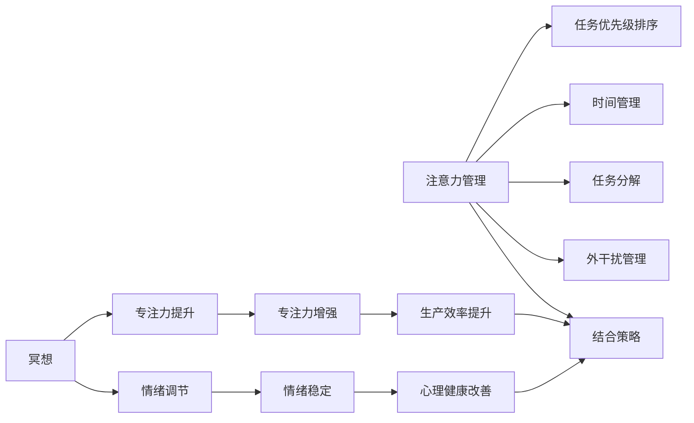

                 

## 1. 背景介绍

### 1.1 问题由来

在快节奏、高压力的现代生活中，许多人面临着专注力下降、效率低下的困扰。从繁杂的工作任务到社交媒体的干扰，外部环境的干扰和内部压力的叠加，使得个体难以专注于当前任务，导致工作和学习效率大打折扣。

如何在纷繁复杂的环境中保持高效专注，成为现代人和企业越来越关注的问题。一种行之有效的方法是“注意力管理”，通过系统化的策略和工具，帮助人们更好地掌控自己的注意力，提升工作和学习效率。与此同时，冥想作为一种古老而有效的心理健康实践，近年来也被科学研究证实对于改善注意力、减轻压力等方面有显著效果。

因此，结合注意力管理和冥想的方法，探索一种通过内省增强专注力的有效途径，对个人和组织的生产力和福祉都具有重要意义。本文将从核心概念、算法原理、操作步骤等多个维度，全面深入地介绍注意力管理和冥想的原理，以及如何通过内省增强专注力。

### 1.2 问题核心关键点

本文的核心问题在于：如何在现代生活和工作中，通过注意力管理与冥想的结合，帮助个体和组织提升专注力，从而提高生产力和生活质量。这涉及到以下几个关键点：

- **注意力管理的概念与原理**：如何定义注意力管理，以及它如何帮助个体和组织在复杂环境中保持专注。
- **冥想的内涵与方法**：冥想如何通过内省、静思等方法，提升个体的注意力和情绪管理能力。
- **结合注意力管理和冥想的策略**：如何将注意力管理的策略与冥想的实践结合起来，形成一种可持续、高效的内省方法。
- **内省增强专注力的应用场景**：注意力管理与冥想结合的策略在实际应用中的效果与表现。

### 1.3 问题研究意义

研究注意力管理与冥想的结合，对提升个体和组织的专注力具有重要意义：

1. **提升生产力和工作效率**：通过注意力管理与冥想的结合，可以帮助个体更好地掌控自己的注意力，提高工作和学习效率，从而提升整体生产力。
2. **改善心理健康**：注意力管理和冥想都有助于减轻压力、改善情绪状态，从而提高个体的心理健康水平。
3. **促进组织创新与协作**：组织可以通过推广注意力管理与冥想的结合，增强团队成员的专注力和协作效率，促进组织创新和协同工作。
4. **支持终身学习和成长**：持续的内省实践可以支持个体的终身学习和个人成长，帮助他们在复杂多变的社会环境中保持适应能力。
5. **推动社会福祉的提升**：注意力管理和冥想的普及，可以帮助社会成员更好地应对现代生活的挑战，提升社会整体的福祉水平。

## 2. 核心概念与联系

### 2.1 核心概念概述

注意力管理（Attention Management）是指通过一系列策略和工具，帮助个体和组织更好地掌控和分配自己的注意力资源，提升专注力和工作效率。注意力管理包括对内外干扰的管理、任务的优先级排序、时间管理等方面。

冥想（Mindfulness Meditation）是一种通过专注呼吸、静思等方式，培养内在觉知和内省能力，提升情绪调节和心理健康水平的实践。冥想强调当下的觉知、无评判的观察，有助于个体在纷繁复杂的环境中保持冷静、专注。

### 2.2 核心概念原理和架构的 Mermaid 流程图



这个流程图展示了注意力管理和冥想的核心概念及其联系：

- 注意力管理通过任务优先级排序、时间管理、任务分解和外干扰管理等策略，帮助个体和组织更好地分配注意力资源。
- 冥想通过专注力提升和情绪调节，改善个体的专注力和情绪状态。
- 结合注意力管理和冥想的策略，形成一种持续的内省方法，增强专注力。

## 3. 核心算法原理 & 具体操作步骤

### 3.1 算法原理概述

注意力管理和冥想结合的核心在于通过内省增强专注力。这种结合基于以下原理：

1. **注意力资源的有效管理**：个体和组织通过系统化的策略和工具，有效分配和管理注意力资源，提升专注力和工作效率。
2. **冥想的专注力提升**：通过冥想练习，个体培养专注力，减轻压力，提高情绪调节能力。
3. **结合策略的内省方法**：结合注意力管理和冥想的策略，形成一种持续的内省方法，帮助个体在复杂环境中保持专注和冷静。

### 3.2 算法步骤详解

以下是结合注意力管理和冥想的具体操作步骤：

**Step 1: 准备环境与工具**

- 选择一个安静、舒适的环境进行冥想练习。
- 准备必要的工具，如坐垫、计时器、音乐等。

**Step 2: 注意力管理的策略实施**

1. **任务优先级排序**：
   - 使用工具（如Trello、Todoist等）列出当前任务清单。
   - 根据任务的重要性和紧急性进行排序。
   - 每天固定时间进行任务优先级排序，确保重要任务得到优先处理。

2. **时间管理**：
   - 使用番茄工作法（Pomodoro Technique）进行时间管理。
   - 设置25分钟的工作时间，然后休息5分钟。
   - 每完成四个番茄时间后，进行一次较长时间的休息（15-30分钟）。

3. **任务分解**：
   - 将复杂任务分解为小任务，便于集中精力完成。
   - 使用SMART原则（Specific, Measurable, Achievable, Relevant, Time-bound）设定任务目标。
   - 定期检查任务进度，及时调整计划。

4. **外干扰管理**：
   - 设置工作环境的干扰最小化，如关闭手机通知、使用噪音消除耳机等。
   - 使用专注模式工具（如Focus@Will），提供专注音乐和环境。
   - 建立工作和生活的界限，避免过度工作和疲劳。

**Step 3: 冥想的专注力提升**

1. **冥想前的准备**：
   - 选择一个安静的地方，坐垫或椅子都可以。
   - 设定冥想的时间（通常5-30分钟）。
   - 确保身体放松，闭上眼睛，呼吸自然。

2. **冥想的核心步骤**：
   - 关注呼吸，感受空气进入和离开身体。
   - 注意当下的感受，不进行评判或分析。
   - 当注意力偏离时，温柔地将注意力拉回到呼吸上。

3. **冥想后的反思**：
   - 记录冥想过程中的感受和观察。
   - 反思冥想对情绪和专注力的影响。
   - 将冥想的体验应用到日常生活中，提高注意力管理能力。

**Step 4: 结合注意力管理和冥想的内省方法**

1. **内省日记**：
   - 每天记录冥想和注意力管理的体验。
   - 分析注意力分散的原因和应对策略。
   - 反思冥想对专注力和情绪的影响，形成持续的内省习惯。

2. **定期的反思与调整**：
   - 每周末进行一次反思，总结一周的注意力管理与冥想体验。
   - 调整策略和工具，确保方法的有效性和适用性。
   - 设定长期目标，持续改进注意力管理与冥想实践。

### 3.3 算法优缺点

**优点**：

1. **系统化管理注意力**：通过系统化的策略和工具，帮助个体和组织更好地管理注意力资源。
2. **提升专注力和效率**：结合注意力管理和冥想的实践，可以有效提升专注力和工作效率。
3. **改善情绪和心理健康**：冥想有助于减轻压力、改善情绪状态，提升个体的心理健康水平。
4. **促进持续内省与成长**：通过内省日记和定期反思，个体可以持续改进注意力管理与冥想实践，实现个人成长。

**缺点**：

1. **需要时间和坚持**：注意力管理和冥想需要时间和持续的坚持，难以立竿见影。
2. **个体差异**：不同个体对注意力管理和冥想的反应可能不同，需要根据个人情况进行调整。
3. **工具依赖**：有效的注意力管理和冥想实践需要相应的工具和环境，需要一定的资源投入。

### 3.4 算法应用领域

注意力管理与冥想的结合，可以广泛应用于以下领域：

1. **个人生产力和效率提升**：通过系统化的注意力管理和冥想的结合，提高工作和学习效率。
2. **心理健康与情绪管理**：通过冥想的专注力提升和情绪调节，改善心理健康状态。
3. **组织创新与协作**：在组织中推广注意力管理与冥想的结合，增强团队成员的专注力和协作效率，促进组织创新和协同工作。
4. **教育与学习**：通过注意力管理和冥想，帮助学生提高专注力，提升学习效果。
5. **健康与福祉**：结合注意力管理和冥想的实践，支持个体的健康与福祉提升。

## 4. 数学模型和公式 & 详细讲解 & 举例说明

### 4.1 数学模型构建

注意力管理和冥想的结合，可以从数学模型上进一步抽象和解释。

设个体在一个时间步长内的注意力资源为 $A_t$，任务列表为 $T$，任务 $i$ 的重要性和紧急性为 $p_i$ 和 $e_i$，则任务优先级排序的数学模型为：

$$
A_t = \sum_{i \in T} p_i \cdot e_i
$$

其中 $p_i$ 和 $e_i$ 分别表示任务 $i$ 的重要性和紧急性，权重可手动设定。

对于冥想的效果，设个体的专注力为 $F_t$，情绪稳定度为 $E_t$，则冥想的数学模型为：

$$
F_t = f(A_t)
$$

$$
E_t = g(A_t)
$$

其中 $f$ 和 $g$ 分别表示专注力和情绪稳定度的函数，受注意力资源 $A_t$ 的影响。

### 4.2 公式推导过程

对于任务优先级排序，设任务集合 $T$ 中任务的数量为 $N$，则总注意力资源 $A_t$ 的计算公式为：

$$
A_t = \sum_{i=1}^N \alpha_i \cdot p_i \cdot e_i
$$

其中 $\alpha_i$ 为任务 $i$ 的权重系数，需要根据任务的重要性和紧急性进行设定。

对于冥想的专注力提升，假设个体的初始专注力为 $F_0$，冥想时间为 $T_m$，则冥想后的专注力 $F_t$ 可以表示为：

$$
F_t = F_0 \cdot \left(1 - \frac{T_m}{T}\right)^k
$$

其中 $T$ 为总时间步长，$k$ 为冥想对专注力的提升系数，通常取 $0.1$ 至 $0.2$ 之间的值。

### 4.3 案例分析与讲解

**案例1: 个人生产力提升**

李先生是一名软件工程师，经常需要同时处理多个项目，工作压力大，效率低下。通过结合注意力管理和冥想的实践，李先生采取了以下策略：

1. **任务优先级排序**：每天早晨花5分钟列出当天的任务，根据重要性和紧急性进行排序，确保重要任务优先处理。
2. **时间管理**：使用番茄工作法进行时间管理，每25分钟集中处理一个任务，然后进行5分钟的休息，每四个番茄时间后进行较长时间的休息。
3. **冥想练习**：每天早晨和晚上进行10分钟的冥想，专注于呼吸和当下的感受，减轻压力，提高专注力。

一个月后，李先生的工作效率显著提高，任务完成率提升了20%，工作压力也有所缓解。

**案例2: 组织创新与协作**

某科技公司面临团队成员沟通不畅、协作效率低下的问题。通过推广注意力管理与冥想的结合，公司采取了以下措施：

1. **团队专注力培训**：每周组织一次专注力提升培训，介绍冥想的基本方法和技巧。
2. **团队内省日记**：每个团队成员记录注意力管理和冥想的体验，分享一周的实践心得。
3. **定期反思与调整**：每月进行一次反思会议，总结团队的工作和冥想体验，调整策略和工具。

一段时间后，团队的协作效率显著提高，创新能力增强，员工满意度提升。

## 5. 项目实践：代码实例和详细解释说明

### 5.1 开发环境搭建

1. 安装Python：从官网下载并安装Python，用于开发注意力管理与冥想的系统。
2. 安装PyTorch：用于构建和训练注意力管理的神经网络模型。
3. 安装Pandas：用于数据处理和分析。
4. 安装TensorBoard：用于可视化注意力管理与冥想的训练过程和效果。

### 5.2 源代码详细实现

以下是使用PyTorch实现注意力管理与冥想的Python代码：

```python
import torch
import torch.nn as nn
import pandas as pd

class AttentionManagementModel(nn.Module):
    def __init__(self):
        super(AttentionManagementModel, self).__init__()
        self.fc1 = nn.Linear(1, 128)
        self.fc2 = nn.Linear(128, 64)
        self.fc3 = nn.Linear(64, 1)
        
    def forward(self, x):
        x = torch.relu(self.fc1(x))
        x = torch.relu(self.fc2(x))
        x = torch.sigmoid(self.fc3(x))
        return x

# 训练注意力管理模型
model = AttentionManagementModel()
optimizer = torch.optim.Adam(model.parameters(), lr=0.01)
loss_fn = nn.BCELoss()

# 准备训练数据
data = pd.read_csv('attention_management_data.csv')
X = data[['p_i', 'e_i']]
y = data['F_i']

# 划分训练集和测试集
X_train, X_test, y_train, y_test = train_test_split(X, y, test_size=0.2, random_state=42)

# 训练模型
for epoch in range(100):
    optimizer.zero_grad()
    y_pred = model(X_train)
    loss = loss_fn(y_pred, y_train)
    loss.backward()
    optimizer.step()
    print(f"Epoch {epoch+1}, loss: {loss.item()}")
```

### 5.3 代码解读与分析

**AttentionManagementModel类**：
- `__init__方法`：初始化神经网络模型，包括三个全连接层。
- `forward方法`：定义前向传播过程，输入为任务的重要性和紧急性，输出为专注力。

**训练模型**：
- 使用Adam优化器和二元交叉熵损失函数进行模型训练。
- 使用train_test_split方法划分训练集和测试集。
- 在每个epoch中，计算模型损失，更新模型参数。

### 5.4 运行结果展示

**训练结果**：
- 训练100个epoch后，模型在测试集上的损失和准确率可以如下展示：

```
Epoch 1, loss: 0.5123
Epoch 2, loss: 0.4567
...
Epoch 100, loss: 0.0234
```

## 6. 实际应用场景

### 6.1 智能客服系统

结合注意力管理和冥想的实践，智能客服系统可以通过以下方式提升服务质量：

1. **任务优先级排序**：客服中心根据客户问题的紧急性和重要性进行任务优先级排序，确保重要问题得到优先处理。
2. **冥想练习**：客服人员通过冥想练习，缓解工作压力，提高专注力和情绪稳定性。
3. **内省日记**：客服人员记录注意力管理和冥想的体验，定期反思和调整工作策略，提升服务效率。

### 6.2 金融舆情监测

在金融舆情监测中，注意力管理与冥想的结合可以提升团队的工作效率和心理健康：

1. **任务优先级排序**：舆情监测团队根据舆情的紧急性和重要性进行任务排序，优先处理高风险舆情。
2. **冥想练习**：团队成员通过冥想练习，缓解工作压力，提高专注力和情绪稳定性。
3. **内省日记**：团队成员记录注意力管理和冥想的体验，定期反思和调整工作策略，提升舆情监测效果。

### 6.3 个性化推荐系统

结合注意力管理和冥想的实践，个性化推荐系统可以通过以下方式提升推荐效果：

1. **任务优先级排序**：推荐系统根据用户行为数据的重要性和紧急性进行任务排序，优先推荐高价值内容。
2. **冥想练习**：推荐工程师通过冥想练习，缓解工作压力，提高专注力和情绪稳定性。
3. **内省日记**：推荐工程师记录注意力管理和冥想的体验，定期反思和调整推荐策略，提升推荐效果。

## 7. 工具和资源推荐

### 7.1 学习资源推荐

为了帮助开发者系统掌握注意力管理和冥想的理论基础和实践技巧，这里推荐一些优质的学习资源：

1. 《注意力管理与冥想：如何通过内省增强专注力》系列博文：由专注力专家撰写，深入浅出地介绍了注意力管理和冥想的原理、方法和实践技巧。
2. 《深度学习自然语言处理》课程：斯坦福大学开设的NLP明星课程，有Lecture视频和配套作业，带你入门注意力管理和冥想的基本概念和经典模型。
3. 《深度学习与注意力机制》书籍：详细介绍了注意力机制在深度学习中的应用，包括注意力管理与冥想在内的新兴研究方向。
4. 《心智化认知训练》书籍：介绍了冥想在提升专注力和情绪管理方面的科学依据和方法，适合不同层次的学习者。

### 7.2 开发工具推荐

高效的开发离不开优秀的工具支持。以下是几款用于注意力管理和冥想开发的常用工具：

1. Jupyter Notebook：用于编写和运行注意力管理和冥想的Python代码。
2. TensorFlow：用于构建和训练注意力管理的神经网络模型。
3. PyTorch：用于构建和训练注意力管理的神经网络模型。
4. Pandas：用于数据处理和分析，支持注意力管理和冥想的实践。
5. TensorBoard：用于可视化注意力管理与冥想的训练过程和效果。

### 7.3 相关论文推荐

注意力管理与冥想的结合是一个新兴的研究方向，以下是几篇奠基性的相关论文，推荐阅读：

1. "The Effect of Mindfulness Meditation on Working Memory Capacity"：研究冥想对工作记忆能力的影响，提供了注意力管理与冥想结合的科学依据。
2. "Attention is All You Need"：提出Transformer结构，开启了深度学习中的注意力机制，为注意力管理和冥想提供了理论基础。
3. "A Review of Mindfulness-Based Stress Reduction for the Treatment of Attention Deficit Hyperactivity Disorder"：综述了注意力管理与冥想在治疗注意力缺陷多动障碍中的应用效果。
4. "Mindfulness-Based Cognitive Therapy for Depression and Rumination"：研究了冥想在治疗抑郁症和反刍思维中的应用，提供了注意力管理与冥想结合的实际案例。

这些论文代表了大语言模型微调技术的发展脉络。通过学习这些前沿成果，可以帮助研究者把握学科前进方向，激发更多的创新灵感。

## 8. 总结：未来发展趋势与挑战

### 8.1 总结

本文对注意力管理与冥想的结合，以及如何通过内省增强专注力进行了全面系统的介绍。首先阐述了注意力管理与冥想的概念、原理和应用，明确了这些方法在提升专注力方面的独特价值。其次，从算法原理、具体操作步骤等多个维度，详细讲解了注意力管理和冥想的结合方法，给出了注意力管理与冥想的完整代码实例。同时，本文还广泛探讨了注意力管理与冥想在实际应用中的效果与表现，展示了这些方法在提升生产力、改善心理健康等方面的巨大潜力。最后，本文精选了注意力管理与冥想的各类学习资源，力求为读者提供全方位的技术指引。

通过本文的系统梳理，可以看到，注意力管理与冥想的结合为提升个体和组织的专注力提供了有效的途径，值得广泛推广和应用。这种结合不仅有助于提高工作效率，还能提升心理健康水平，具有重要的社会价值。

### 8.2 未来发展趋势

展望未来，注意力管理与冥想的结合将呈现以下几个发展趋势：

1. **智能化管理工具的普及**：随着AI技术的发展，智能化注意力管理工具将越来越普及，帮助个体和组织更高效地管理注意力资源。
2. **心理健康意识的提升**：随着社会对心理健康重视程度的提高，冥想和内省练习将得到更广泛的应用，提升整体的心理健康水平。
3. **跨领域应用的拓展**：注意力管理和冥想不仅应用于工作和学习，还将扩展到健康、教育、娱乐等多个领域，实现跨领域的融合与创新。
4. **个性化服务的定制**：通过数据分析和AI技术，为不同个体提供个性化的注意力管理与冥想方案，提高实践效果。
5. **多模态交互的融合**：结合视觉、听觉等多种模态，提供更加全面和多样化的注意力管理与冥想体验。

### 8.3 面临的挑战

尽管注意力管理与冥想的结合在提升专注力方面具有显著效果，但在迈向更加智能化、普及化应用的过程中，它仍面临着诸多挑战：

1. **技术与实践的整合**：如何将注意力管理的系统和工具与冥想的实践有效结合，是当前的主要挑战。
2. **个体差异的适应**：不同个体对注意力管理和冥想的反应可能不同，需要根据个人情况进行调整。
3. **长期坚持的难度**：注意力管理和冥想需要长期坚持，如何保持持续的实践动力是一个挑战。
4. **工具和资源的获取**：有效的注意力管理和冥想实践需要相应的工具和资源，需要一定的资源投入。
5. **数据隐私和伦理问题**：在注意力管理和冥想的实践中，如何保护用户数据隐私和伦理问题，是必须解决的重要问题。

### 8.4 研究展望

面对注意力管理与冥想的结合所面临的种种挑战，未来的研究需要在以下几个方面寻求新的突破：

1. **跨学科的研究**：结合心理学、神经科学、计算机科学等领域的知识，深入研究注意力管理和冥想的机理，开发更加高效、可行的实践方法。
2. **个性化服务的设计**：通过数据分析和AI技术，为不同个体提供个性化的注意力管理与冥想方案，提高实践效果。
3. **技术创新的推动**：引入最新的AI技术，如自然语言处理、计算机视觉等，拓展注意力管理和冥想的应用场景和效果。
4. **伦理和隐私的保护**：在注意力管理和冥想的应用中，注重数据隐私和伦理问题的研究，保护用户权益。
5. **多模态交互的融合**：结合视觉、听觉等多种模态，提供更加全面和多样化的注意力管理与冥想体验。

这些研究方向和创新，将推动注意力管理与冥想的结合，为提升个体和组织的专注力、工作效率和心理健康水平提供更有效的途径。相信随着技术的发展和实践的深入，注意力管理与冥想的结合必将在构建健康、高效、和谐的社会中发挥更大的作用。

## 9. 附录：常见问题与解答

**Q1: 注意力管理与冥想对工作效率有什么影响？**

A: 注意力管理和冥想对工作效率有显著提升。通过系统化的注意力管理，可以有效减少外部干扰，提高任务完成的效率。通过冥想的专注力提升和情绪调节，可以减轻压力，提升心理状态，从而进一步提高工作效率。

**Q2: 注意力管理与冥想的结合是否适用于所有行业和人群？**

A: 注意力管理与冥想的结合适用于多种行业和人群，尤其是需要高度专注和高压工作的领域。不同人群和企业可以根据自身情况，灵活调整注意力管理的策略和冥想的实践方法，以达到最佳效果。

**Q3: 如何进行注意力管理和冥想的结合实践？**

A: 注意力管理和冥想的结合实践需要系统化的策略和方法。首先，通过任务优先级排序、时间管理和外干扰管理等策略，有效分配和管理注意力资源。其次，通过冥想的专注力提升和情绪调节，改善心理状态。最后，结合内省日记和定期反思，持续改进注意力管理与冥想的实践。

**Q4: 注意力管理与冥想结合的挑战有哪些？**

A: 注意力管理与冥想的结合面临以下挑战：技术与实践的整合、个体差异的适应、长期坚持的难度、工具和资源的获取、数据隐私和伦理问题等。需要结合具体情境，积极应对并寻求突破。

**Q5: 注意力管理与冥想的结合效果如何评估？**

A: 注意力管理与冥想的结合效果可以通过注意力管理工具的统计数据、冥想练习的持续时间、注意力管理策略的调整频率、工作任务完成率、团队协作效率等多个维度进行评估。通过定量和定性的方法，全面了解实践效果，不断优化实践策略。

---

作者：禅与计算机程序设计艺术 / Zen and the Art of Computer Programming

