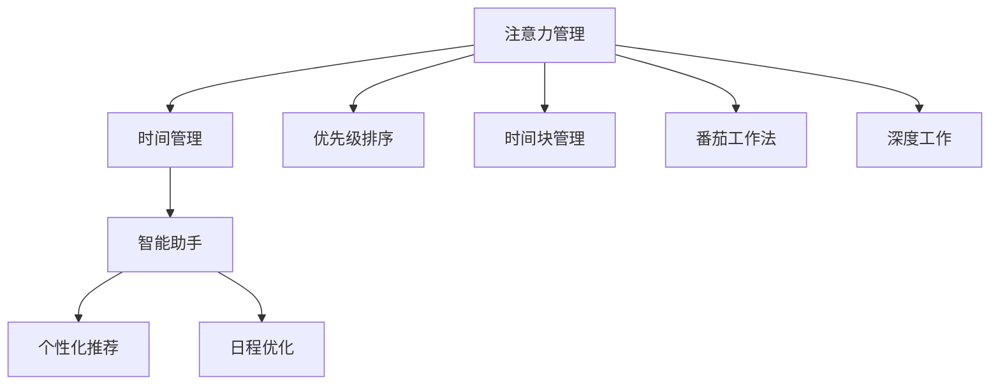

                 

# 注意力管理与时间管理：如何最大化利用你的一天

> 关键词：注意力管理,时间管理,优先级排序,时间块管理,番茄工作法,深度工作,智能助手,任务管理

## 1. 背景介绍

在现代快节奏的工作与生活中，如何在有限的24小时内高效地完成任务，提高生产力和个人满意度，是每一位专业人士都在思考的问题。过去，我们主要依靠时间管理工具、任务列表和日历提醒来组织日程，但这些方法往往无法应对复杂和不断变化的工作需求。

近年来，随着人工智能技术的发展，智能助手、个性化推荐和自动化工具开始进入人们的工作和生活，为时间管理带来了新的可能。而注意力管理，即如何集中精力、避免分心，也逐渐成为时间管理的一个重要方面。通过科技手段提升注意力管理能力，我们能够更好地利用时间，实现高效工作与生活的平衡。

本文将深入探讨注意力管理和时间管理的方法和工具，帮助读者在繁忙的日常中更好地分配资源、提升效率，从而最大化利用每一天。

## 2. 核心概念与联系

### 2.1 核心概念概述

为更好地理解注意力管理和时间管理，本节将介绍几个关键的概念：

- **注意力管理(Attention Management)**：指通过认知科学和心理学原理，指导个体如何在工作时集中注意力、避免分心，从而提升工作效率和效果。

- **时间管理(Time Management)**：指通过规划、监控和评估，合理利用时间，优化工作和生活流程，以达成既定目标的过程。

- **优先级排序(Priority Sorting)**：指根据任务的紧急程度和重要性，对任务进行排序，确定优先完成哪些任务的方法。

- **时间块管理(Time Blocking)**：指将一天的时间划分为固定的时间块，每个时间块专注于特定任务的时间管理方式。

- **番茄工作法(Pomodoro Technique)**：通过设定25分钟的工作时间块和5分钟的短暂休息，循环进行工作与休息的管理方法。

- **深度工作(Deep Work)**：指在无干扰的环境中，深入思考和工作的状态，是高效完成复杂任务的关键。

- **智能助手(智能推荐系统, AI Assistant)**：利用人工智能技术，为用户提供个性化任务推荐和时间管理建议的工具。

这些核心概念之间的逻辑关系可以通过以下Mermaid流程图来展示：



这个流程图展示了几大时间管理核心概念的关系：

1. 注意力管理通过提升专注度，直接影响时间管理的效果。
2. 时间管理通过合理规划和监控时间，使注意力管理能够更好地执行。
3. 优先级排序和时间块管理是具体的时间管理工具，帮助组织任务和安排时间。
4. 番茄工作法和深度工作是特定的时间管理技巧，旨在提高工作专注度和效率。
5. 智能助手利用人工智能技术，提供个性化的时间管理建议和任务推荐。

这些概念共同构成了高效时间管理的基础框架，使得个人能够更好地应对日常任务和工作需求。

## 3. 核心算法原理 & 具体操作步骤
### 3.1 算法原理概述

注意力管理和时间管理的技术和工具，大多基于认知心理学和行为科学原理。它们通过优化人的注意力和行为模式，帮助个体更有效地利用时间。

注意力管理聚焦于个体的认知过程，通过干预注意力流向，提升工作和学习效果。常见的注意力管理方法包括正念练习、番茄工作法、深度工作等。

时间管理则关注于通过系统化的方法和工具，帮助个体规划、执行和评估时间的使用。时间管理技术包括优先级排序、时间块管理、智能助手等。

### 3.2 算法步骤详解

以下是几个核心算法步骤的详细说明：

**步骤1：自我评估与目标设定**
- **注意力评估**：评估自己的注意力集中程度，识别影响注意力的因素，如环境干扰、任务复杂度等。
- **目标设定**：根据个人和职业目标，设定短期和长期的关注重点，明确需要集中注意力的任务。

**步骤2：优先级排序**
- **紧急性评估**：使用任务矩阵（如Eisenhower矩阵），区分任务的紧急性和重要性。
- **优先级调整**：根据紧急性和重要性，调整任务的排序，确定最优先处理的任务。

**步骤3：时间块管理**
- **时间规划**：将一天的时间划分为多个时间块，每个时间块专注处理特定任务。
- **时间块设置**：根据任务需求和个人效率，设定时间块的长度和间隔。

**步骤4：番茄工作法**
- **设定定时器**：使用定时器设定25分钟的工作时间块和5分钟的短暂休息。
- **周期循环**：重复工作-休息的周期，每完成4个周期后，进行较长的休息。

**步骤5：深度工作**
- **环境准备**：选择一个安静无干扰的环境，减少外界干扰。
- **专注执行**：在无干扰的环境中，全神贯注地进行深度思考和任务执行。

**步骤6：智能助手应用**
- **任务推荐**：使用智能助手获取个性化任务推荐，优化任务处理顺序。
- **时间监控**：利用智能助手监控时间使用情况，评估时间管理效果。

### 3.3 算法优缺点

**优点**：
- **高效执行**：通过优先级排序和时间块管理，能够高效地完成重要任务。
- **减少分心**：番茄工作法和深度工作有助于提升注意力集中度，避免任务间频繁切换。
- **个性化优化**：智能助手可以根据用户习惯和需求，提供定制化的建议和工具。

**缺点**：
- **初始设定困难**：优先级排序和时间块管理需要大量初期设定工作，初期效果可能不明显。
- **易受干扰**：环境干扰和任务优先级变化可能导致计划变动。
- **技术依赖**：智能助手等技术工具的准确性和有效性依赖于数据质量和算法设计。

### 3.4 算法应用领域

注意力管理和时间管理技术广泛应用于各种领域，例如：

- **企业管理**：帮助企业优化任务分配和员工时间使用，提升整体效率。
- **教育培训**：通过优化课堂时间和注意力管理，提升学生学习效果。
- **个人发展**：通过自我管理工具，提升个人技能和专业能力。
- **软件开发**：通过番茄工作法和深度工作，提高代码质量和开发效率。
- **创意工作**：通过时间块管理和智能助手，激发创意和提升作品质量。

除了上述这些经典应用外，时间管理技术也在更多场景中得到创新性的应用，如智能家居、健康管理等，为生活和工作带来了新的便利和可能。

## 4. 数学模型和公式 & 详细讲解 & 举例说明

### 4.1 数学模型构建

为了更加精确地解释注意力管理和时间管理的技术，本节将介绍一些常用的数学模型和公式。

设一个任务集为 $T=\{t_1, t_2, ..., t_n\}$，每个任务的权重为 $w_i$，紧急程度为 $e_i$，重要性为 $i_i$。时间块为 $B=\{b_1, b_2, ..., b_m\}$，每个时间块的长度为 $l_j$，分配给任务 $t_i$ 的时间为 $t_{ij}$。

**优先级排序模型**：

目标是最小化未完成任务的总权重，最大化已完成任务的总权重。

$$
\text{Minimize:} \quad W_{\text{unfinished}} = \sum_{i=1}^n w_i(1 - t_{ij})
$$
$$
\text{Maximize:} \quad W_{\text{finished}} = \sum_{i=1}^n w_i t_{ij}
$$

其中 $w_i(1 - t_{ij})$ 表示未完成任务的总权重，$w_i t_{ij}$ 表示已完成任务的总权重。

**时间块管理模型**：

目标是在有限的时间内，最大化完成的任务数和质量。

$$
\text{Maximize:} \quad \sum_{j=1}^m \sum_{i=1}^n w_i t_{ij} + \sum_{j=1}^m e_j
$$

其中 $\sum_{j=1}^m \sum_{i=1}^n w_i t_{ij}$ 表示在时间块内完成的任务权重总和，$\sum_{j=1}^m e_j$ 表示时间块内紧急任务的完成数量。

**番茄工作法模型**：

目标是在固定时间内，最大化工作时间的有效利用率。

$$
\text{Maximize:} \quad \sum_{k=1}^K (25 \times 1_{k=1 \mod 4} + 5 \times (1_{k \mod 4} \neq 1))
$$

其中 $25 \times 1_{k=1 \mod 4}$ 表示每完成一个番茄时间块，获得25分钟的有效工作时间，$5 \times (1_{k \mod 4} \neq 1)$ 表示每4个番茄时间块后，获得5分钟的短暂休息时间。

### 4.2 公式推导过程

以下是几个模型的公式推导过程：

**优先级排序模型推导**：
- 定义未完成任务总权重 $W_{\text{unfinished}} = \sum_{i=1}^n w_i(1 - t_{ij})$。
- 通过优化目标函数，求解最优的任务分配方案 $t_{ij}^*$。

**时间块管理模型推导**：
- 定义已完成任务总权重 $W_{\text{finished}} = \sum_{i=1}^n w_i t_{ij}$。
- 通过优化目标函数，求解最优的时间块分配方案 $t_{ij}^*$。

**番茄工作法模型推导**：
- 定义有效工作时间 $25 \times 1_{k=1 \mod 4}$ 和短暂休息时间 $5 \times (1_{k \mod 4} \neq 1)$。
- 通过优化目标函数，求解最优的番茄工作法循环次数 $k$。

### 4.3 案例分析与讲解

**案例1：优先级排序**
假设一个项目有5个任务，分别为：任务A（重要性：高，紧急性：低）、任务B（重要性：中，紧急性：低）、任务C（重要性：中，紧急性：高）、任务D（重要性：低，紧急性：低）、任务E（重要性：低，紧急性：中）。

| 任务 | 权重 $w_i$ | 紧急性 $e_i$ | 重要性 $i_i$ |
| ---- | --------- | ----------- | ----------- |
| A    | 0.8       | 0.3         | 0.8         |
| B    | 0.6       | 0.2         | 0.6         |
| C    | 0.7       | 0.9         | 0.7         |
| D    | 0.5       | 0.1         | 0.5         |
| E    | 0.4       | 0.6         | 0.4         |

根据优先级排序模型，优先处理紧急且重要的任务C，其次是任务E，然后是任务A，最后处理任务B和D。

**案例2：时间块管理**
假设一天有8个时间块，每个时间块的长度为1小时。

| 时间块 | 时间块长度 $l_j$ | 分配给任务的时间 $t_{ij}$ |
| ------ | --------------- | -------------------------- |
| 1      | 1               | 0.2                         |
| 2      | 1               | 0.3                         |
| 3      | 1               | 0.5                         |
| 4      | 1               | 0.4                         |
| 5      | 1               | 0.4                         |
| 6      | 1               | 0.3                         |
| 7      | 1               | 0.2                         |
| 8      | 1               | 0.5                         |

根据时间块管理模型，优先处理任务D和任务C，然后是任务E，接着是任务B，最后是任务A。

**案例3：番茄工作法**
假设一天有8个番茄时间块，每个时间块的长度为25分钟。

| 时间块 | 番茄时间块长度 $25 \times 1_{k=1 \mod 4}$ | 短暂休息时间 $5 \times (1_{k \mod 4} \neq 1)$ |
| ------ | -------------------------------------- | -------------------------------------- |

通过番茄工作法模型，可以获得有效的番茄时间块数为6，短暂休息时间为2，确保了高效的工作和适当的休息。

## 5. 项目实践：代码实例和详细解释说明
### 5.1 开发环境搭建

在进行注意力管理和时间管理实践前，我们需要准备好开发环境。以下是使用Python进行开发的常见环境配置流程：

1. 安装Python：从官网下载并安装Python，选择3.x版本。
2. 安装pip包管理工具：在命令行中运行 `python -m ensurepip --default-pip` 安装pip。
3. 安装Pomodoro Timer应用程序：例如使用Pomodone、Tomato Timer等工具。

完成上述步骤后，即可在Python环境中开始实践。

### 5.2 源代码详细实现

以下是使用Python编写的简单番茄工作法计时器示例：

```python
from time import sleep

def pomodoro_timer():
    k = 1
    while k <= 8:
        for i in range(1, 25, 5):
            print(f"Pomodoro {k} ({i}分钟):")
            sleep(i)
            print("休息5分钟：")
            sleep(300)
        k += 1

pomodoro_timer()
```

以上代码实现了简单的番茄工作法计时器，每个时间块25分钟，每个时间块后休息5分钟，循环8个时间块。

### 5.3 代码解读与分析

让我们再详细解读一下关键代码的实现细节：

**pomodoro_timer函数**：
- 定义变量k，表示当前循环到第几个番茄时间块。
- 循环k从1到8，模拟8个番茄时间块。
- 内部循环i从1到25，每次打印当前番茄时间块，并暂停i分钟。
- 休息5分钟后，打印休息信息，并暂停300秒（5分钟）。
- 循环结束后，k加1，继续下一次循环。

通过这个示例，我们可以看到，通过编写简单的代码，便可以实现番茄工作法的时间管理。在实际应用中，可以根据具体需求进行扩展和优化，如添加任务列表、休息提醒、时间块统计等功能。

### 5.4 运行结果展示

通过运行上述代码，你将看到按照番茄工作法计时器输出的时间块和休息时间。例如：

```
Pomodoro 1 (1分钟):
休息5分钟：
Pomodoro 1 (5分钟):
休息5分钟：
...
Pomodoro 8 (25分钟):
休息5分钟：
```

这个计时器可以作为起点，进一步开发功能更强大的时间管理工具。

## 6. 实际应用场景
### 6.1 企业管理

对于企业而言，高效的注意力管理和时间管理对于提升整体效率和员工满意度至关重要。通过优化任务优先级和时间块安排，企业可以更好地分配资源，确保关键任务能够及时完成。例如，使用智能助手提供任务推荐和时间监控，帮助管理者实时掌握工作进度，优化任务分配。

### 6.2 教育培训

在教育领域，时间管理工具可以帮助学生合理安排学习时间，提升学习效果。例如，使用智能推荐系统根据学生的学习情况和兴趣，推荐合适的学习任务和时间块，确保高效学习。此外，番茄工作法等时间管理技巧也可以帮助学生集中注意力，避免学习疲劳。

### 6.3 个人发展

对于个人而言，良好的时间管理能够显著提升工作和生活质量。通过合理分配时间块，设定优先级，可以有效处理日常任务，避免拖延和分心。同时，利用智能助手提供任务建议和时间监控，能够更好地掌控个人发展路径。

### 6.4 未来应用展望

随着人工智能技术的不断进步，时间管理工具将更加智能化和个性化。未来的时间管理工具将能够实时监控用户行为，动态调整任务优先级和时间块安排，甚至根据用户的生理节律和心理状态，提供个性化的工作和学习建议。同时，更多的应用场景也将出现，如健康管理、智能家居等，为人类生活质量带来更多便利和可能。

## 7. 工具和资源推荐
### 7.1 学习资源推荐

为了帮助开发者系统掌握注意力管理和时间管理的技术，这里推荐一些优质的学习资源：

1. 《深度工作：如何有效利用你的每一天》：Cal Newport所著，深入探讨深度工作的重要性和实现方法，推荐阅读。
2. 《番茄工作法图解》：Francesco Cirillo所著，详细解释了番茄工作法的原理和应用，适合实践参考。
3. 《时间管理简史》：Theodore G. Canaris所著，介绍了时间管理的历史和演变，适合了解时间管理的基础知识。
4. 《注意力管理：提升工作效率的心理学与技术》：Susan Greenfield所著，结合心理学和认知科学原理，介绍了注意力管理的理论和方法。
5. Coursera上的《时间管理与自我提升》课程：由西北大学开设，系统讲解时间管理的方法和技巧。

通过这些资源的学习，相信你能够更好地掌握注意力管理和时间管理的技术，并将其应用到实际生活中。

### 7.2 开发工具推荐

高效的开发离不开优秀的工具支持。以下是几款用于时间管理开发的常用工具：

1. Todoist：任务管理工具，支持任务列表、优先级、截止日期等功能，适用于个人和团队管理任务。
2. Trello：项目管理工具，支持看板、列表、卡片等功能，适合团队协作和任务分配。
3. Evernote：笔记和任务管理工具，支持手写笔记、语音记录、任务提醒等功能，适合日常工作和生活管理。
4. Toggl：时间追踪工具，支持手动记录和自动化时间跟踪，适合个人和企业的时间监控和分析。
5. RescueTime：自动时间追踪工具，实时监控工作和学习活动，提供详细的时间使用报告。

合理利用这些工具，可以显著提升时间管理的效率，加快创新迭代的步伐。

### 7.3 相关论文推荐

时间管理的研究源于学界的持续探索。以下是几篇奠基性的相关论文，推荐阅读：

1. "Deep Work: Rules for Focused Success in a Distracted World"：Cal Newport所著，探讨了深度工作的重要性及其实现方法。
2. "The Pomodoro Technique"：Francesco Cirillo所著，详细介绍了番茄工作法的原理和应用。
3. "How to Stop Procrastinating: Techniques for Mastering Your Work"：Piers Steel所著，介绍了克服拖延的技巧和方法。
4. "Time Management 2.0: Using the Secrets of Adaptive Thinking to Work Less and Do More"：Susan Greenfield所著，介绍了适应性思维在时间管理中的应用。

这些论文代表了时间管理的研究方向，通过学习这些前沿成果，可以帮助研究者把握学科前进方向，激发更多的创新灵感。

## 8. 总结：未来发展趋势与挑战
### 8.1 研究成果总结

本文对注意力管理和时间管理的方法和工具进行了全面系统的介绍。首先，阐述了注意力管理和时间管理的研究背景和重要性，明确了它们在提升生产力、优化工作和生活流程中的独特价值。其次，从原理到实践，详细讲解了注意力管理和时间管理的核心算法和具体操作步骤，给出了具体的时间管理示例和应用场景。同时，本文还精选了注意力管理和时间管理的学习资源和工具，力求为读者提供全方位的技术指引。

通过本文的系统梳理，可以看到，注意力管理和时间管理技术正在成为个人和组织的重要资源。这些技术的广泛应用，使得个体能够更好地应对复杂和不断变化的工作需求，提升整体效率和满意度。未来，伴随人工智能技术的不断进步，时间管理工具将更加智能化和个性化，助力人类实现高效工作与生活的平衡。

### 8.2 未来发展趋势

展望未来，注意力管理和时间管理技术将呈现以下几个发展趋势：

1. **智能化和个性化**：未来的时间管理工具将更加智能化，能够实时监控用户行为，动态调整任务优先级和时间块安排，甚至根据用户的生理节律和心理状态，提供个性化的工作和学习建议。
2. **多模态融合**：未来的时间管理工具将融合视觉、听觉等多种模态信息，提升用户体验和智能化水平。
3. **跨平台集成**：未来的时间管理工具将支持多种设备和平台，实现无缝切换和协同工作。
4. **实时反馈与优化**：通过实时反馈和智能优化，提升用户的时间管理效果和体验。
5. **伦理与安全**：在注重隐私保护和数据安全的前提下，提升时间管理工具的可信度和可用性。

以上趋势凸显了时间管理技术的广阔前景。这些方向的探索发展，必将进一步提升时间管理的智能化和个性化水平，为个人和组织带来更多便利和可能。

### 8.3 面临的挑战

尽管注意力管理和时间管理技术已经取得了显著进展，但在迈向更加智能化、普适化应用的过程中，仍面临诸多挑战：

1. **数据隐私**：智能助手和个性化推荐系统需要大量的用户数据支持，如何保障用户隐私和数据安全是一个重要问题。
2. **技术依赖**：时间管理工具的准确性和有效性依赖于算法的优化和数据质量，技术的成熟度有待提升。
3. **用户体验**：复杂的界面和操作方式可能降低用户的使用体验，需要进一步优化设计。
4. **公平性**：不同用户群体的需求差异较大，如何提供公平和均衡的时间管理方案是一个挑战。
5. **适应性**：如何适应用户动态变化的需求和环境是一个长期挑战。

这些挑战需要我们不断探索和优化，才能使时间管理技术更好地服务于用户，提升整体工作效率和生活质量。

### 8.4 研究展望

面对时间管理面临的挑战，未来的研究需要在以下几个方面寻求新的突破：

1. **隐私保护**：开发更加安全的隐私保护技术，保障用户数据安全。
2. **算法优化**：不断优化时间管理算法的性能，提升准确性和实时性。
3. **用户体验**：设计和优化更加直观和易用的时间管理工具，提升用户使用体验。
4. **多模态融合**：探索多种模态信息的融合，提升时间管理工具的智能化水平。
5. **跨领域应用**：拓展时间管理工具在更多领域的应用，如健康管理、智能家居等。

这些研究方向的探索，必将使时间管理技术走向更高的台阶，为个人和组织带来更多的便利和可能。面向未来，时间管理技术还需要与其他人工智能技术进行更深入的融合，如知识表示、因果推理、强化学习等，多路径协同发力，共同推动时间管理系统的进步。

## 9. 附录：常见问题与解答

**Q1：时间管理工具如何帮助提升效率？**

A: 时间管理工具通过规划、监控和评估时间的使用，帮助个体更好地组织任务和资源，提升整体效率。具体而言：
1. 任务优先级排序：根据任务的紧急性和重要性，合理安排任务顺序，确保关键任务优先完成。
2. 时间块管理：将一天的时间划分为多个固定时间块，每个时间块专注于特定任务，避免任务间频繁切换。
3. 番茄工作法：通过设定固定的时间工作段和短暂休息段，提升工作效率和效果。
4. 智能助手：提供个性化任务推荐和时间监控，实时调整任务安排，确保高效工作。

**Q2：如何克服拖延症？**

A: 克服拖延症需要从多个方面入手，包括心理调节、任务分解和时间管理技巧。具体方法包括：
1. 设定明确的目标和截止日期，增强任务的可操作性和紧迫感。
2. 任务分解：将大任务分解为小任务，逐步完成，降低心理压力。
3. 番茄工作法：使用番茄工作法，通过设定固定时间块和短暂休息，逐步培养专注力和执行力。
4. 自我激励：通过设定奖励机制，激励自己完成任务。
5. 行为调整：改变工作环境，减少外界干扰，提高工作效率。

**Q3：时间管理工具如何选择？**

A: 选择适合自己的时间管理工具需要考虑个人的工作习惯、任务类型和应用场景。建议从以下几个方面入手：
1. 功能需求：根据自己的需求选择任务列表、优先级、截止日期、时间块管理等功能。
2. 操作界面：选择界面友好、操作简单的工具，提升用户体验。
3. 数据同步：选择支持多设备同步的工具，方便跨平台使用。
4. 可扩展性：选择可扩展性高的工具，方便根据自己的需求进行个性化定制。
5. 用户评价：参考其他用户的评价和反馈，选择口碑良好的工具。

通过合理的工具选择和使用方法，可以更好地提升时间管理效果，实现高效工作和生活。

**Q4：时间管理工具如何与其他技术结合？**

A: 时间管理工具可以与其他技术进行深度整合，提升整体效能。例如：
1. 智能助手与数据分析：结合智能助手提供的任务建议和数据分析结果，进行任务优先级排序和时间块管理。
2. 知识图谱与任务管理：结合知识图谱中的领域知识，提供更加精准的任务推荐。
3. 语音识别与自然语言处理：结合语音识别和自然语言处理技术，实现语音输入和智能分析。
4. 机器学习与推荐系统：结合机器学习算法，提供个性化任务推荐和时间监控，提升用户体验。
5. 增强现实与虚拟现实：结合增强现实和虚拟现实技术，提升任务管理的界面和交互效果。

通过技术与工具的结合，可以进一步提升时间管理的智能化和个性化水平，为工作和生活带来更多便利和可能。

---

作者：禅与计算机程序设计艺术 / Zen and the Art of Computer Programming

